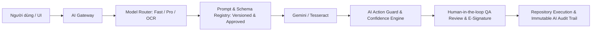

# PQM 3.0 - BÁO CÁO KHẢO SÁT HỆ THỐNG AI (AI BASELINE)
> **Phiên bản:** 3.0.0-baseline  
> **Thời điểm khảo sát:** 2026-09-08  
> **Phạm vi:** 16 dịch vụ AI, AI Copilot Action Tools, OCR Pipeline, Gemini SDK Integration

---

## 1. DANH MỤC CÁC DỊCH VỤ AI HIỆN TẠI (AI SERVICES INVENTORY)

Toàn bộ phân hệ AI hiện có **21 files với 9,336 dòng code**, bao gồm 16 dịch vụ AI chuyên biệt:

| STT | Dịch vụ AI | File vị trí | LOC | Chức năng chính | Trạng thái Governance |
| :---: | :--- | :--- | :---: | :--- | :---: |
| 1 | **AI Action Tools** | `src/services/ai/aiTools.ts` | 1,722 | 6 công cụ thực thi tự động cho Copilot (tạo lô, sửa trạng thái, heal data...) | 🚨 **Thiếu RBAC & Approval Guard** |
| 2 | **Gemini Core SDK** | `src/services/ai/geminiService.ts` | 831 | Client kết nối Gemini 2.5 Flash / 2.0 Flash / Pro, structured JSON helper | ⚠️ Trực tiếp gọi từ Client API Key |
| 3 | **Inter-Lab Comparison** | `src/services/ai/labComparisonService.ts` | 586 | Tính độ lệch Z-Score, directional bias giữa các phòng lab | Đã có 18 unit tests |
| 4 | **Predictive Inspection**| `src/services/ai/predictiveInspectionService.ts` | 548 | Dự báo xác suất Đạt/Không đạt trước kiểm nghiệm | Đã có 3 unit tests |
| 5 | **Smart Alert Engine** | `src/services/ai/smartAlertService.ts` | 526 | Quét 5 mẫu hình rủi ro (drift, trôi chất lượng, sắp hết hạn) | Logic rule-based kết hợp |
| 6 | **NL Query Engine** | `src/services/ai/nlQueryService.ts` | 530 | Truy vấn dữ liệu toàn hệ thống bằng tiếng Việt tự nhiên | Cần kiểm soát schema đầu ra |
| 7 | **Material Harmonizer** | `src/services/ai/materialHarmonizerService.ts` | 468 | Quét trùng lặp nguyên liệu, đề xuất gộp alias | Đã có 3 unit tests |
| 8 | **Batch Clearance** | `src/services/ai/batchClearanceService.ts` | 390 | Hồ sơ thẩm định chất lượng lô (RELEASE / CONDITIONAL / HOLD) | Structured JSON Schema (v2.5) |
| 9 | **Stability Kinetics** | `src/services/ai/stabilityPredictionService.ts` | 382 | Mô hình động học Arrhenius dự báo tuổi thọ sản phẩm | Đã có 4 unit tests |
| 10 | **Deviation Reporter** | `src/services/ai/deviationReportService.ts` | 380 | Tự động sinh báo cáo sai lệch 6 phần chuẩn GMP-WHO | Cần prompt versioning |
| 11 | **Data Integrity ALCOA+**| `src/services/ai/dataIntegrityService.ts` | 370 | Quét vết audit trail, tính Data Integrity Score (0-100) | Đã có 3 unit tests |
| 12 | **PQR Narrative** | `src/services/ai/pqrNarrativeService.ts` | 350 | Soạn thảo kết luận tổng thể PQR/APR 4 phần chuyên môn | Structured JSON Schema (v2.5) |
| 13 | **TCCS Validator** | `src/services/ai/tccsAssistantService.ts` | 335 | Gợi ý chỉ tiêu theo Dược điển VN V / USP và công thức | Đã có 3 unit tests |
| 14 | **Self-Learning Engine** | `src/services/ai/autoLearningService.ts` | 320 | Học máy ánh xạ chỉ tiêu OCR -> TCCS chuẩn hệ thống | 🚨 **Tự động lưu Firebase không qua duyệt** |
| 15 | **OOS Investigation** | `src/services/ai/oosInvestigationService.ts` | 260 | Hỗ trợ điều tra nguyên nhân gốc rễ (Fishbone / 5 Whys) | Cần tích hợp QMS workflow |
| 16 | **Voice Test Parser** | `src/services/ai/voiceParserService.ts` | 180 | Phân tích giọng nói kiểm nghiệm viên điền vào form | Đã có 4 unit tests |
| 17 | **Tesseract Fallback** | `src/services/ai/tesseractFallback.ts` | 130 | Tesseract.js lazy-loaded OCR offline khi mất mạng/hết quota | Nền tảng dự phòng tốt |

---

## 2. KIẾN TRÚC TÍCH HỢP & DÒNG DỮ LIỆU HIỆN TẠI (INTEGRATION FLOW)

```
[Trang UI / Form] 
       │
       ▼ (Gọi trực tiếp không có Gateway)
[Service AI cụ thể (e.g. deviationReportService)]
       │
       ▼
[geminiService.ts] ──(Gọi API trực tiếp qua client key)──> [Google Generative AI]
       │
       ▼
[aiTools.ts] ──(Tự ý gọi store.updateBatch, store.delete...)──> [Firebase RTDB]
```

### Điểm mạnh đã có:
- Đã áp dụng cơ chế Schema-enforced JSON (`generateStructuredJson<T>()`) tại 2 service then chốt: `batchClearanceService` và `pqrNarrativeService`.
- Đã có giải pháp OCR dự phòng đa tầng: Canvas Rasterizer nhiều trang + Gemini Vision OCR + Tesseract.js offline fallback.
- Đã có 71 unit tests bao phủ các thuật toán tính toán của các service AI.

### Khoảng trống kiến trúc theo chuẩn PQM 3.0:

1. **Thiếu AI Gateway thống nhất (Phase 8)**:
   - Hiện tại các service tự khởi tạo model, tự quản lý tham số (`temperature`, `topK`), tự xử lý retry.
   - Chưa có Model Router phân loại tác vụ nhanh (Fast Model: Gemini 2.0 Flash) vs tác vụ phân tích sâu (Pro Model: Gemini 2.5 Pro).

2. **Chưa có Prompt Registry & Schema Registry có kiểm soát phiên bản (Prompt/Schema Registry)**:
   - Các prompt hướng dẫn (System Instructions) được viết dạng chuỗi nối cứng bên trong từng file mã nguồn.
   - Không có thông tin: Phiên bản prompt v1.0 hay v2.0? Ai phê duyệt? Ngày hiệu lực?

3. **Lỗ hổng AI Action Execution (Regulated Actions)**:
   - Trong `aiTools.ts`, AI Copilot có quyền gọi trực tiếp `store.updateBatchStatus(batchId, 'RELEASED')`.
   - Trong môi trường kiểm nghiệm Dược, **AI tuyệt đối không được phép tự động ra quyết định xuất xưởng** mà chỉ được đóng vai trò tham mưu (Decision Support), cung cấp Bằng chứng (Evidence) và chờ Chữ ký điện tử của Trưởng phòng QA.

4. **Học máy tự động chưa qua kiểm duyệt (Self-Learning Without Human-in-the-loop - Phase 9)**:
   - `autoLearningService.ts` tự động lưu cặp ánh xạ mới vào `ai_learned_mappings` trên RTDB nếu điểm tin cậy đạt ngưỡng.
   - Nguy cơ từ điển chuẩn bị ô nhiễm nếu OCR đọc sai tên hoạt chất quan trọng và tự động ghi đè từ điển sản xuất.

5. **Thiếu bộ dữ liệu thẩm định vàng (Golden Evaluation Dataset)**:
   - Chưa có bộ test benchmark đo độ chính xác trích xuất trường dữ liệu (Precision, Recall, F1-Score) trên 50+ mẫu phiếu kiểm nghiệm thực tế từ các Viện Kiểm nghiệm.

---

## 3. LỘ TRÌNH QUẢN TRỊ AI PQM 3.0 (AI GOVERNANCE ROADMAP)



1. **Phase 1 & 8**: Xây dựng **AI Action Guard**: Chặn đứng mọi hành vi sửa đổi dữ liệu từ AI nếu không có sự xác nhận của người dùng có thẩm quyền.
2. **Phase 5 & 8**: Ghi nhận **AI Audit Trail**: Ghi lại mọi lần AI đưa ra nhận định kèm model, promptVersion, token, inputHash, outputHash, confidence score.
3. **Phase 9**: Đổi cơ chế Self-Learning sang quy trình: `Candidate -> Human QA Review -> Approved Mapping -> Production Dictionary`.
