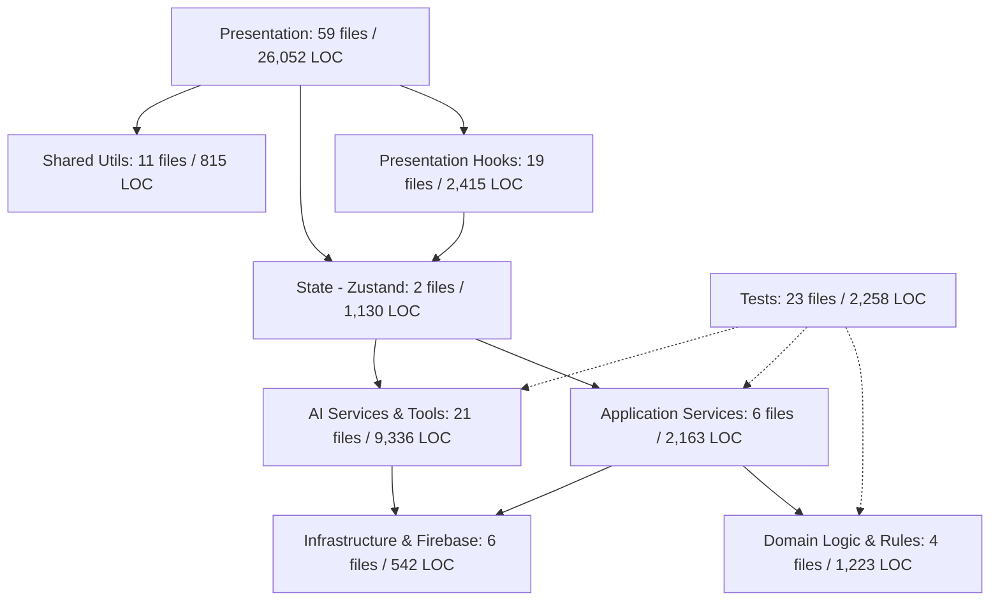

# PQM 3.0 - BÁO CÁO KHẢO SÁT KIẾN TRÚC HỆ THỐNG (ARCHITECTURE BASELINE)
> **Phiên bản:** 3.0.0-baseline  
> **Thời điểm khảo sát:** 2026-09-08  
> **Dự án:** Hệ thống Quản lý Chất lượng Sản phẩm & Kiểm nghiệm (PQM)

---

## 1. TỔNG QUAN HỆ THỐNG HIỆN TẠI (SYSTEM INVENTORY)

| Chỉ số | Giá trị hiện tại | Ghi chú |
| :--- | :--- | :--- |
| **Tổng số files mã nguồn** | **158 files** | Bao gồm src, tests, rules, configs |
| **Tổng số dòng code (LOC)** | **48,139 dòng** | TypeScript, TSX, CSS, Rules |
| **Tech Stack cốt lõi** | React 19, TS 5.8, Vite 6, TailwindCSS 3 | Zustand, Firebase RTDB/Auth/Storage, Gemini AI |
| **Số lượng Test Suites / Tests** | 22 suites / 123 unit tests passed (100%) | 4 E2E test suites (Playwright) |
| **Thời gian Build sản xuất** | **9.90 giây** | 2402 modules transformed |
| **Dung lượng Bundle chính** | **1,350 kB (gzip: 391 kB)** | Vượt ngưỡng khuyến nghị 1,000 kB của Vite |

---

## 2. PHÂN LOẠI MÃ NGUỒN THEO TẦNG KIẾN TRÚC (SOURCE CATEGORIZATION)

Theo mục tiêu PQM 3.0, mã nguồn toàn dự án được phân rã thành các tầng kiến trúc:



### Thống kê chi tiết từng phân tầng:

1. **Presentation (UI Components & Pages)**:
   - **59 files, 26,052 LOC** (chiếm ~54% toàn bộ codebase).
   - Tập trung các màn hình nghiệp vụ: `TestResultFormPage.tsx` (1,610 LOC), `MaterialList.tsx` (1,510 LOC), `QualitySummaryReport.tsx` (1,376 LOC), `TrendAnalysisPage.tsx` (1,329 LOC), `ProductDetail.tsx` (1,140 LOC), `BatchList.tsx` (930 LOC).
   - **Vấn đề cốt lõi**: Các trang UI này đang ôm đồm quá nhiều logic nghiệp vụ, tính toán định lượng, điều phối OCR, và gọi trực tiếp đến store/Firebase.

2. **Presentation Hooks**:
   - **19 files, 2,415 LOC**.
   - Gồm các custom hooks: `useTestResultForm.ts`, `useFirebaseSync.ts`, `useDataGraph.ts`, `useAuthSync.ts`, `usePagination.ts`...

3. **State Management (Zustand)**:
   - **2 files, 1,130 LOC**: `src/store/useAppStore.ts` (782 LOC) và `src/store/useUIStore.ts` (348 LOC).
   - **Rủi ro lớn**: `useAppStore.ts` đang đóng vai trò như một **In-Memory Database + Backend CRUD + Synchronization Bus**. Nơi đây chứa toàn bộ logic tạo log audit, rollback, phân quyền `isAdmin`, gọi API RTDB trực tiếp.

4. **AI Platform & Tools**:
   - **21 files, 9,336 LOC** (chiếm gần 20% codebase).
   - Chứa 16 dịch vụ AI chuyên sâu: `aiTools.ts` (1,722 LOC), `geminiService.ts` (831 LOC), `labComparisonService.ts` (586 LOC), `predictiveInspectionService.ts` (548 LOC), `smartAlertService.ts` (526 LOC)...
   - **Rủi ro**: `aiTools.ts` có 6 action tools có khả năng trực tiếp sửa đổi database thông qua `useAppStore` mà chưa đi qua hệ thống kiểm soát quyền hạn (RBAC Guard) hoặc Workflow State Machine.

5. **Application Services**:
   - **6 files, 2,163 LOC**: `dataConsistencyService.ts` (932 LOC), `testResultService.ts` (467 LOC), `criteriaAliasService.ts` (394 LOC), `reportService.ts` (187 LOC)...
   - `dataConsistencyService.ts` chứa công cụ Auto-Healing tự động sửa chữa bất thường dữ liệu trên RTDB nhưng chưa có cơ chế Impact Preview và Dual-Control Approval.

6. **Domain Logic & Specifications**:
   - **4 files, 1,223 LOC**: `src/utils/criteriaEvaluation.ts` (496 LOC), `src/types.ts` (375 LOC), `src/utils/ootDetection.ts` (180 LOC), `src/utils/basisCalculation.ts` (172 LOC).
   - Các thuật toán kiểm tra chỉ tiêu, đánh giá OOT (Out of Trend), tính hàm lượng theo công thức định lượng.

7. **Infrastructure Layer**:
   - **6 files, 542 LOC**: `firebase.ts`, `databaseService.ts`, `storageService.ts`, `authService.ts`, `offlineMutationQueue.ts`, `database.rules.json`, `storage.rules`.

8. **Shared Utilities**:
   - **11 files, 815 LOC**: `dateUtils.ts`, `formatters.ts`, `searchUtils.ts`, `urlUtils.ts`, `validation.ts`...

9. **Tests (Automated Testing)**:
   - **23 files, 2,258 LOC**: 22 unit test suites (123 tests) + E2E Playwright tests.

---

## 3. BẢN ĐỒ PHỤ THUỘC & COUPLING (DEPENDENCY GRAPH ANALYSIS)

Qua phân tích tự động bằng `scripts/analyzeGraph.cjs`:
- **54 files** phụ thuộc trực tiếp vào `useAppStore`.
- **20 files** import Firebase trực tiếp bên ngoài cấu hình nền tảng.
- **12 files** gọi trực tiếp các dịch vụ AI / Gemini SDK mà không qua AI Gateway thống nhất.

### Biểu đồ luồng dữ liệu hiện tại (Tightly Coupled):
```
React Page / Component
   ├──> useAppStore (Zustand)
   │       ├──> Firebase RTDB / Auth (CRUD trực tiếp)
   │       ├──> Audit Log (tạo inline)
   │       └──> Local state & UI state
   ├──> Direct Firebase calls (20 files gọi trực tiếp get/ref/update)
   └──> Direct AI Service calls (12 files gọi trực tiếp Gemini)
```

### Biểu đồ kiến trúc mục tiêu PQM 3.0 (Clean Architecture / Strangler Pattern):
```
React Page (Presentation)
   └──> Feature Hook
          └──> Application Service (Business Orchestration)
                 ├──> Domain Model & State Machine (Pure Business Logic)
                 ├──> Permission Service & AI Guard (RBAC Authorization)
                 └──> Repository Interface (Data Abstraction)
                        ├──> Firebase Repository (Remote Persistence)
                        └──> IndexedDB Repository (Offline Cache & Sync)
```

---

## 4. BẢNG THEO DÕI NỢ KỸ THUẬT (TECHNICAL DEBT BACKLOG)

| Hạng mục | Vị trí / File | LOC | Mức độ nghiêm trọng | Vấn đề cụ thể | Kế hoạch xử lý (Phase) |
| :--- | :--- | :---: | :---: | :--- | :--- |
| **1. AI Tools Action Bypass** | `src/services/ai/aiTools.ts` | 1,722 | **CRITICAL (P0)** | 6 công cụ AI gọi `useAppStore.getState()` trực tiếp sửa đổi lô, phiếu kiểm nghiệm, auto-heal mà không qua RBAC hoặc workflow guard. | Phase 1 & Phase 8 (Tạo AI Action Guard & Gateway) |
| **2. Monolithic Form Page** | `src/pages/qa/TestResultFormPage.tsx` | 1,610 | **HIGH (P1)** | Chứa đồng thời: PDF Canvas OCR, tính toán tiêu chuẩn, mapping tên chỉ tiêu, dialog xác nhận tạo lô mới, voice speech parser, và form submit. | Phase 15 (Chia nhỏ thành Form, OCRPanel, CriteriaTable, Dialogs) |
| **3. Material Catalog Monolith** | `src/pages/products/MaterialList.tsx` | 1,510 | **MEDIUM (P1)** | Gộp cả catalog, AI Harmonization, bảng trùng lặp, modal sáp nhập, CRUD. | Phase 15 (Tách Master List, Harmonizer Modal, Aliases) |
| **4. PQR Report Monolith** | `src/pages/quality/QualitySummaryReport.tsx` | 1,376 | **MEDIUM (P1)** | Tính toán CPK, biểu đồ Recharts, AI narrative generator, xuất Excel, in ấn. | Phase 15 (Tách Analytical Hook, PrintView, NarrativePanel) |
| **5. Monolithic Trend Analysis** | `src/pages/quality/TrendAnalysisPage.tsx` | 1,329 | **MEDIUM (P1)** | Xử lý toàn bộ logic thống kê OOT, drift, phân phối chuẩn, render Recharts. | Phase 15 (Tách StatisticalService & ChartComponents) |
| **6. Monolithic Product Detail** | `src/pages/products/ProductDetail.tsx` | 1,140 | **MEDIUM (P1)** | Nạp đồng thời toàn bộ TCCS, công thức, lô, phiếu kiểm nghiệm, đồ thị. | Phase 15 (Tách Tab components & Lazy Load) |
| **7. useAppStore God-Object** | `src/store/useAppStore.ts` | 782 | **CRITICAL (P0/P1)** | Đảm nhiệm CRUD, network state, optimistic updates, auth role check, realtime subscription cho 8 thực thể. | Phase 2 (Tách Repository & Application Services theo Strangler Pattern) |
| **8. Auto-Healing Không Kiểm Soát** | `src/services/dataConsistencyService.ts` | 932 | **HIGH (P1/P2)** | Phương thức `autoHeal` trực tiếp thực thi thay đổi trên RTDB không có cơ chế Impact Preview, Dual Approval. | Phase 7 (Auto-Healing 2.0 với Controlled Remediation) |
| **9. Direct Firebase Imports** | 20 files khắp `src/` | ~3,500 | **HIGH (P1)** | Nhiều component/hook import trực tiếp SDK Firebase (`get`, `ref`, `update`) gây rò rỉ chi tiết hạ tầng vào UI. | Phase 2 (Bọc qua Repositories) |
| **10. Quyền hạn nhị phân (Binary RBAC)** | Toàn hệ thống | N/A | **CRITICAL (P0)** | Chỉ có `isAdmin: boolean` và role `'ADMIN' \| 'USER' \| 'GUEST'`. Thiếu hoàn toàn phân quyền chuyên môn Dược: QA, QC, LAB, PRODUCTION. | Phase 1 (Permission Matrix & Service) |

---

## 5. KẾT LUẬN & ĐỀ XUẤT HÀNH ĐỘNG
Giai đoạn Phase 0 đã hoàn thành khảo sát cấu trúc toàn diện. Mã nguồn hiện hữu có nền tảng tốt về tính năng và kiểm thử (123 tests pass), nhưng chịu sự phụ thuộc lớn vào `useAppStore` và thiếu lớp phòng thủ phân quyền/workflow. Bước đi tiếp theo bắt buộc là triển khai **Phase 1 (Security / RBAC / Firebase Rules)** để thiết lập lá chắn an toàn trước khi di chuyển logic dữ liệu ở Phase 2.
