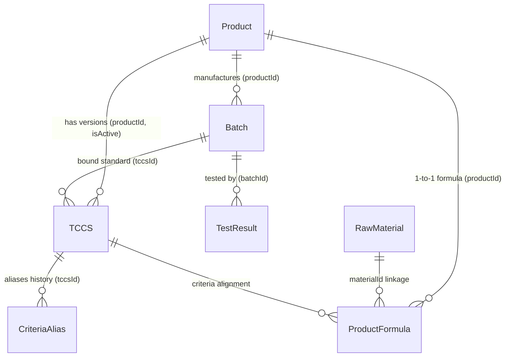

# 📘 TỔNG QUAN TOÀN DIỆN HỆ THỐNG PQM (PRODUCT QUALITY MANAGEMENT)
> **Phiên bản tài liệu:** 2.3.2  
> **Cập nhật lần cuối:** 2026-08-29  
> **Dự án:** Hệ thống Quản lý Chất lượng Sản phẩm & Kiểm nghiệm (PQM)

---

## 📌 0. QUY TẮC CỐT LÕI DÀNH CHO AI ASSISTANT (BẮT BUỘC TUÂN THỦ)
1. **Quét file này đầu tiên**: Mỗi khi bắt đầu một phiên làm việc, AI phải nắm toàn bộ kiến trúc, mô hình dữ liệu, phân hệ chức năng và luồng triển khai trong file này.
2. **Tự động cập nhật**: Mỗi khi có bất kỳ thay đổi nào trong dự án (thêm component, sửa logic, thêm route, đổi schema dữ liệu, thêm AI tool, v.v.), AI **BẮT BUỘC** phải cập nhật lại file này ngay sau khi hoàn thành nhiệm vụ để phản ánh trạng thái mới nhất của ứng dụng.
3. **Nhật ký thay đổi (Changelog)**: Ghi lại tóm tắt nội dung vừa cập nhật ở phần cuối tài liệu kèm ngày tháng.

---

## 1. GIỚI THIỆU VÀ MỤC TIÊU DỰ ÁN
**PQM (Product Quality Management)** là hệ thống quản lý chất lượng chuyên sâu dành cho ngành sản xuất y tế / dược phẩm / công nghệ sinh học (V-Biotech). 

### Mục tiêu chính:
- Quản lý toàn diện vòng đời sản phẩm: từ Hồ sơ sản phẩm, Tiêu chuẩn cơ sở (TCCS), Công thức định lượng, Nguyên liệu, Lô sản xuất đến Phiếu kiểm nghiệm (Test Results).
- Tự động hóa đánh giá Đạt/Không Đạt theo tiêu chuẩn kỹ thuật (định lượng hoạt chất, chỉ tiêu an toàn, vi sinh, cảm quan).
- Xuất phiếu phân tích thành phẩm (Certificate of Analysis - CoA) chuẩn hóa có mã QR xác thực.
- Phân tích xu hướng chất lượng (Trend Analysis), cảnh báo sớm các bất thường (Quality Alerts).
- **Hệ thống Kiểm soát & Hàn gắn Toàn vẹn Dữ liệu (Data Consistency & Auto-Healing Engine)**: Tự động rà soát 6 nhóm toàn vẹn liên kết thực thể (bản ghi mồ côi, sai lệch liên kết chéo, bất nhất quán logic, mất liên kết nguyên liệu, lệch công thức - TCCS, trùng mã) và cung cấp cơ chế Auto-Heal 1-click.
- **Unified Entity Relationship Graph (`useDataGraph.ts`)**: Mạng lưới liên kết 2 chiều hoàn chỉnh cho toàn bộ 7 thực thể dữ liệu trong hệ thống.
- Tích hợp **AI Thông minh đa cấp độ (Gemini 2.5/2.0)**: Tự động quét OCR kết quả kiểm nghiệm từ PDF nhiều trang (Canvas Rasterizer & Smart Chunking) / ảnh, tự học khớp nối chỉ tiêu (Semantic Mapping & Self-Learning), và hỗ trợ truy vấn thông minh.
- **Hệ thống phím tắt & Command Palette (`Ctrl+K`)**: Tìm kiếm tức thì và điều hướng siêu tốc trên toàn bộ hệ thống.

---

## 2. KIẾN TRÚC CÔNG NGHỆ & MÔI TRƯỜNG TRIỂN KHAI

### 2.1. Tech Stack
- **Frontend Core**: React 19, TypeScript (~5.8), Vite (v6), TailwindCSS v3.
- **State Management**: Zustand (tách biệt `useAppStore` cho dữ liệu nghiệp vụ & `useUIStore` cho giao diện/preferences).
- **Graph & Consistency Layer**: `useDataGraph` (Full 2-Way Hydration Graph) & `dataConsistencyService` (Audit & Auto-Heal).
- **Backend / BaaS**: Firebase Realtime Database (RTDB), Firebase Authentication, Firebase Storage.
- **Trí tuệ nhân tạo (AI)**: Google Generative AI SDK (`@google/generative-ai` - Gemini 2.5 Flash/Pro, Gemini 2.0 Flash).
- **Xử lý PDF client-side**: `pdfjs-dist` (Render PDF nhiều trang sang ảnh JPEG Canvas tối ưu dung lượng).
- **Trực quan hóa & Báo cáo**: Recharts (Biểu đồ xu hướng, phân bố), QRCode React, SheetJS/XLSX (Xuất Excel).
- **Kiểm thử**: Vitest (Unit Test - 113 tests passed 100% across 21 test suites), Playwright (E2E Test).

### 2.2. Kiến trúc Triển khai (Deployment Rules)
- **Môi trường Sản xuất**: Firebase Hosting (`https://v-biotech.web.app`) | Project ID: `v-biotech`.
- **Cấu hình Base URL**: 
  - Khi build Firebase: `base = '/'` (phục vụ từ root).
  - Khi chạy local: `base = './'`.
- **GitHub**: Chỉ dùng để **sao lưu mã nguồn**. Không dùng GitHub Pages.
- **Quy trình Deploy chuẩn**:
  ```bash
  npm run build
  npx firebase deploy --only hosting
  # Hoặc dùng script: npm run deploy
  ```

---

## 3. MÔ HÌNH DỮ LIỆU & SCHEMA (DATA ARCHITECTURE)

Dữ liệu được lưu trữ trên Firebase Realtime Database với cấu trúc JSON tối ưu và đồ thị liên kết chặt chẽ:



### 3.1. Chi tiết các Thực thể (Entities):
1. **Product (`products/`)**:
   - `id`, `code`, `name`, `group`, `registrationNo`, `registrationDate`, `registrant`, `status` (`ACTIVE` | `DISCONTINUED` | `RECALLED`), `description`, `imageUrl`.
2. **TCCS - Tiêu chuẩn cơ sở (`tccsList/`)**:
   - `id`, `productId`, `code`, `issueDate`, `isActive`, `packaging`, `storage`, `shelfLife`, `standardRefs`.
   - `mainQualityCriteria`: Danh sách chỉ tiêu chất lượng chính (Tên, Đơn vị, Min, Max, Kiểu `NUMBER`/`TEXT`, `declaredContent`, `calculationBasis`).
   - `safetyCriteria`: Danh sách chỉ tiêu an toàn (vi sinh, kim loại nặng...).
   - `alternateRules`: Quy tắc kiểm tra bổ sung / kiểm tra lại khi không đạt (`FAIL_RETRY`, `CONDITIONAL_CHECK`).
3. **ProductFormula - Công thức sản phẩm (`productFormulas/`)**:
   - `id`, `productId`, `ingredients` (Hàm lượng công bố, hàm lượng nguyên tố, liên kết `materialId`), `excipients` (Tá dược), `sensory`, `packaging`, `storage`, `shelfLife`.
4. **RawMaterial - Danh mục nguyên liệu (`rawMaterials/`)**:
   - `id`, `code` (mã quản lý nguyên liệu nội bộ: `NL-GINKGO-01`...), `name` (tên gốc/chuẩn quốc tế), `aliases` (các tên gọi khác, tên thương mại, tên viết tắt), `category` (`ACTIVE` | `EXCIPIENT` | `OTHER`), `standard` (tiêu chuẩn áp dụng: DĐVN V, USP, Ph.Eur, BP, TCCS-NSX...), `casNumber` (mã định danh hóa chất quốc tế CAS), `description`.
5. **Batch - Lô sản xuất (`batches/`)**:
   - `id`, `productId`, `tccsId`, `batchNo`, `mfgDate`, `expDate`, `theoreticalYield`, `actualYield`, `yieldUnit`, `packaging`, `status` (`PENDING` | `TESTING` | `RELEASED` | `REJECTED`), `rejectReason`, `progressPercent`.
6. **TestResult - Phiếu kiểm nghiệm (`testResults/`)**:
   - `id`, `batchId`, `labName`, `testDate`, `overallStatus` (`PASS` | `FAIL`), `notes`, `attachments` (file đính kèm Drive/Firebase).
   - `results`: Mảng các `TestResultEntry` { `criteriaName`, `value`, `isPass`, `isExtra`, `unit`, `limit` }.
   - *Lưu ý*: Trường `batch` là Virtual Join trên UI, không lưu thừa vào RTDB.
7. **CriteriaAlias - Ánh xạ tên chỉ tiêu (`criteriaAliases/`)**:
   - Đảm bảo tương thích ngược khi TCCS đổi tên chỉ tiêu mà các phiếu kiểm nghiệm cũ vẫn đối chiếu chính xác.
8. **AILearnedMapping (`aiLearnedMappings/`)**:
   - Học máy từ người dùng: Ghi nhớ các cặp tên chỉ tiêu viết tắt/OCR -> Tên chuẩn hệ thống (`originalName` ↔ `systemName`, `frequency`).
9. **QualityAnomaly / Alerts**:
   - Cảnh báo trôi dạt chất lượng (`DRIFT`), sắp hết hạn (`EXPIRY`), tỷ lệ lỗi cao (`HIGH_FAIL_RATE`), thiếu dữ liệu (`MISSING_DATA`).

---

## 4. PHÂN QUYỀN & XÁC THỰC (AUTH & ROLES)

Hệ thống quản lý người dùng với 3 vai trò chính qua Firebase Auth & RTDB (`users/`):
- **`ADMIN`**: Toàn quyền quản trị hệ thống, thêm/sửa/xóa sản phẩm, TCCS, công thức, duyệt người dùng, quản lý Criteria Alias, cấu hình AI.
- **`USER`**: Nhân viên kiểm nghiệm / QA / QC: Xem dữ liệu, tạo và duyệt phiếu kiểm nghiệm, tạo lô sản xuất, xem báo cáo & CoA.
- **`GUEST`**: Tài khoản mới đăng ký chưa được duyệt, chỉ có quyền truy cập trang `/welcome`.

---

## 5. CẤU TRÚC PHÂN HỆ VÀ ROUTING

Hệ thống được tổ chức thành 6 phân hệ lớn:

| Phân hệ | Route chính | Mô tả chức năng |
| :--- | :--- | :--- |
| **Auth** | `/login`, `/signup`, `/forgot-password`, `/welcome`, `/unauthorized` | Đăng nhập, phân quyền, cấp quyền truy cập. |
| **Batches** | `/batches`, `/batches/new`, `/batches/:id`, `/batches/:id/edit` | Quản lý Lô sản xuất, tiến độ, duyệt xuất xưởng. |
| **Products** | `/products`, `/products/new`, `/products/:id`, `/materials`, `/product-formulas` | Quản lý Hồ sơ sản phẩm, Trung tâm Quản lý Nguyên liệu & Thành phần (Material Hub 3-Tab), Công thức định lượng. |
| **QA / Testing**| `/test-results`, `/test-results/new`, `/test-results/:id/edit`, `/tccs`, `/criteria` | Nhập kết quả kiểm nghiệm (OCR AI), TCCS, Quản lý Chỉ tiêu & Alias. |
| **Quality Analytics**| `/dashboard`, `/trend-analysis`, `/alerts`, `/quality-summary-report` | Dashboard phân tích xu hướng, SPC, cảnh báo rủi ro, Báo cáo tổng hợp. |
| **Public / Reports**| `/test-results/print/:id`, `/verify/:id` | Xem & in ấn CoA chuẩn hóa, Trang quét mã QR xác thực chứng chỉ. |
| **System** | `/settings`, `/users`, `/audit-logs` | Cấu hình Google Drive, cài đặt Model AI, Nhật ký kiểm toán (Audit Log). |

---

## 6. HỆ THỐNG TRÍ TUỆ NHÂN TẠO (AI INTELLIGENCE SUITE 2.0)

Hệ thống AI dựa trên Google Gemini với 5 cấp độ và 4 phân hệ thông minh chuyên sâu cho ngành Dược phẩm/Kiểm nghiệm:

1. **OCR & Extraction (Cấp độ 1 – Nâng cấp v1.5.1)**:
   - **Xử lý triệt để PDF nhiều trang (Canvas Rasterizer + Smart Chunking)**:
     - Tự động chuyển đổi từng trang PDF sang ảnh JPEG tối ưu (1600px, 0.85 quality) bằng Canvas + `pdfjs-dist`. Giảm 85% dung lượng truyền tải.
     - Phân đoạn thông minh (Chunking 3 trang/lượt cho tài liệu dài > 3 trang), loại bỏ 100% nguy cơ tràn token, socket timeout hoặc lỗi HTTP 500/503 từ Google server.
     - Gộp kết quả thông minh từ các đợt quét (`testResults`, `notes`, `batchNo`, `labName`...).
   - **Batch Scan**: Upload và xử lý song song nhiều file PDF/ảnh cùng lúc (`Promise.all`), hiển thị `BatchScanProgressModal` per-file.
   - **Streaming Progress**: Callback `onProgress(step, percent)` theo từng bước xử lý thực tế, hiển thị tiến độ real-time trên UI.
   - **Fallback Model**: Tự động chuyển từ `gemini-2.5-flash` → `gemini-2.0-flash` khi gặp lỗi 503/429, kèm exponential backoff (2s→4s→8s).
   - **Prompt OCR nâng cao**: Bổ sung 4 guide mới – `HANDWRITING_GUIDE` (chữ tay, số nhòe), `MULTI_COLUMN_GUIDE` (phiếu đa cột, nhiều trang), `WATERMARK_STAMP_GUIDE` (bỏ qua watermark/con dấu), `VN_LAB_TERMINOLOGY` (nhận diện Quatest 3, CASE, Eurofins...).
   - **Schema mở rộng**: AI trả về thêm `pageCount`, `documentType` (External_Lab|Internal|CoA|Supplier_CoA), `notes` (ghi chú đặc biệt), `analysisMethod` (HPLC, UV-Vis...) cho từng chỉ tiêu.
2. **Semantic Mapping & Auto-evaluation (Cấp độ 2)**:
   - Tự động đối chiếu tên chỉ tiêu tiếng Anh/Việt qua từ điển dược học `PHARMA_TERM_DICTIONARY` và thuật toán Dice Coefficient/fuzzy semantic matching (ví dụ: *Moisture* -> *Độ ẩm*).
   - Tự động so sánh với Min/Max trong TCCS hoặc công thức sản phẩm (±20%) để gắn cờ Đạt/Không Đạt.
3. **Self-Learning & Action Agents (Cấp độ 3)**:
   - Học từ phản hồi người dùng: Khi user sửa mapping, AI tự lưu vào `aiLearnedMappings` để ghi nhớ cho các lần sau.
   - Hỗ trợ AI Tools (`aiTools.ts`): Bổ sung `compareLabResults`, `predictQualityStability`, `auditDataIntegrity`, `getAIInsights`, `generateOOSInvestigation`.
4. **Active & Autonomous Self-Learning (`autoLearningService.ts` - Cấp độ 4)**:
   - **Post-OCR Auto-Learn**: Tự động học từ các ánh xạ nhận diện thành công (high-confidence) ngay khi OCR mà không cần chờ người dùng can thiệp thủ công.
   - **Pattern Mining & Dictionary Suggestion**: Phát hiện các cặp ánh xạ có tần suất cao ($\ge 3$ lần) để gợi ý bổ sung vào từ điển tiêu chuẩn.
   - **AI Quality Insight Engine**: Tự động phân tích toàn diện dữ liệu (tỷ lệ lỗi theo sản phẩm, trôi chỉ tiêu qua các lô, rủi ro hạn dùng) để sinh insight chủ động mỗi ngày (**AI Morning Briefing**).
   - **Contextual Session Memory**: Tự động tóm tắt các cuộc hội thoại trước và duy trì ngữ cảnh liên phiên chat theo từng User ID.
5. **PQM AI Intelligence Suite 2.0 (4 Phân hệ AI Chuyên sâu Chuẩn Dược phẩm/GMP - Cấp độ 5)**:
   - **Phân hệ 1: AI Đối chiếu Đa phiếu & Lab Bias (`labComparisonService.ts`, `LabComparisonModal.tsx`)**: So sánh Side-by-Side 2 phiếu lab, tính %RPD, phân loại sai lệch và phát hiện Lab Bias hệ thống.
   - **Phân hệ 2: Trợ lý Nhập liệu Giọng nói Voice-to-Data (`voiceParserService.ts`, `VoiceInputButton.tsx`)**: Nhận diện giọng nói tiếng Việt, tự động chuẩn hóa số đo dược học và điền bảng kết quả.
   - **Phân hệ 3: Dự báo Động học Suy giảm & Hạn dùng sớm (`stabilityPredictionService.ts`, `TrendAnalysisPage.tsx`)**: Phân tích suy giảm ICH Q1A, tính $k$, $R^2$, ước tính thời điểm chạm Min spec ($t_{90}$) và cảnh báo hết hạn sớm.
   - **Phân hệ 4: AI Giám sát Toàn vẹn Dữ liệu ALCOA+ (`dataIntegrityService.ts`)**: Quét Audit Trail, phát hiện sửa đổi nhiều lần, thao tác ngoài giờ, tính điểm Data Integrity Score (0-100).
6. **PQM End-to-End AI Copilot & Embedded Intelligence (Gắn kết AI Toàn diện - Cấp độ 6)**:
   - **Context-Aware Floating AI Copilot ([AIAssistantChat.tsx](file:///D:/26%20Kiem%20nghiem/PQM/src/components/features/AIAssistantChat.tsx))**: Tự động nhận diện trang & thực thể hiện tại (`/batches/:id`, `/products/:id`, `/tccs`, `/quality-summary-report`, `/audit-logs`) để sinh các nút tác vụ nhanh (Contextual Prompt Chips) và nạp ngữ cảnh vào câu trả lời của AI.
   - **AI Batch Quality Clearance Dossier ([batchClearanceService.ts](file:///D:/26%20Kiem%20nghiem/PQM/src/services/ai/batchClearanceService.ts), [AIBatchClearanceModal.tsx](file:///D:/26%20Kiem%20nghiem/PQM/src/components/features/AIBatchClearanceModal.tsx))**: Tự động gom dữ liệu (kết quả kiểm nghiệm, tiến độ TCCS, nguy cơ tiệm cận ngưỡng, lịch sử lô, audit trail) để đưa ra khuyến nghị duyệt xuất xưởng (**RELEASE**), duyệt có điều kiện (**CONDITIONAL**) hoặc tạm giữ điều tra (**HOLD**).
   - **AI TCCS Validator & Formulator ([tccsAssistantService.ts](file:///D:/26%20Kiem%20nghiem/PQM/src/services/ai/tccsAssistantService.ts), [TCCSFormPage.tsx](file:///D:/26%20Kiem%20nghiem/PQM/src/pages/qa/TCCSFormPage.tsx))**: Gợi ý danh mục chỉ tiêu theo Dược điển VN V / USP (viên nén, nang, siro, cốm, thuốc tiêm...) và tự động đồng bộ khoảng định lượng $\pm 5\% / \pm 10\% / \pm 20\%$ từ công thức sản phẩm, kèm cảnh báo mâu thuẫn thời gian thực.
   - **AI PQR / APR Narrative Generator ([pqrNarrativeService.ts](file:///D:/26%20Kiem%20nghiem/PQM/src/services/ai/pqrNarrativeService.ts), [QualitySummaryReport.tsx](file:///D:/26%20Kiem%20nghiem/PQM/src/pages/quality/QualitySummaryReport.tsx))**: Tự động soạn thảo phần *Nhận xét & Đánh giá Tổng thể Chất lượng (Executive Quality Conclusion)* chuẩn GMP gồm 4 phần chuyên môn để xuất báo cáo PQR/APR.
   - **ALCOA+ Data Integrity Watchdog Widget ([ALCOAWatchdogWidget.tsx](file:///D:/26%20Kiem%20nghiem/PQM/src/components/features/ALCOAWatchdogWidget.tsx), [AuditLogPage.tsx](file:///D:/26%20Kiem%20nghiem/PQM/src/pages/system/AuditLogPage.tsx))**: Nhúng trực tiếp bảng điểm Data Integrity Score (0-100), phân rã 6 nguyên tắc ALCOA+ và danh sách cảnh báo vi phạm thời gian thực lên đầu trang Audit Log.
7. **PQM Predictive & Proactive AI Engine (AI Chủ động & Dự báo Tương lai - Cấp độ 7)**:
   - **Phân hệ 1: AI Natural Language Query Engine ([nlQueryService.ts](file:///D:/26%20Kiem%20nghiem/PQM/src/services/ai/nlQueryService.ts), tool `queryDataNaturalLanguage`)**: Truy vấn dữ liệu toàn hệ thống bằng tiếng Việt tự nhiên.
   - **Phân hệ 2: AI Smart Deviation Report Generator ([deviationReportService.ts](file:///D:/26%20Kiem%20nghiem/PQM/src/services/ai/deviationReportService.ts), [DeviationReportModal.tsx](file:///D:/26%20Kiem%20nghiem/PQM/src/components/features/DeviationReportModal.tsx), tool `generateDeviationReport`)**: Tự động sinh báo cáo sai lệch chuẩn GMP-WHO/FDA đầy đủ 6 phần.
   - **Phân hệ 3: AI Proactive Smart Alert Engine ([smartAlertService.ts](file:///D:/26%20Kiem%20nghiem/PQM/src/services/ai/smartAlertService.ts), [AlertsPage.tsx](file:///D:/26%20Kiem%20nghiem/PQM/src/pages/quality/AlertsPage.tsx))**: Tự động quét và phát hiện 5 loại pattern nguy hiểm.
   - **Phân hệ 4: AI Batch Genealogy Tracer ([batchGenealogyService.ts](file:///D:/26%20Kiem%20nghiem/PQM/src/services/ai/batchGenealogyService.ts), [BatchGenealogyModal.tsx](file:///D:/26%20Kiem%20nghiem/PQM/src/components/features/BatchGenealogyModal.tsx), [BatchDetailPage.tsx](file:///D:/26%20Kiem%20nghiem/PQM/src/pages/batches/BatchDetailPage.tsx))**: Xây dựng cây truy vết 5 tầng và chấm điểm Traceability Score.
   - **Phân hệ 5: AI Predictive Incoming Inspection ([predictiveInspectionService.ts](file:///D:/26%20Kiem%20nghiem/PQM/src/services/ai/predictiveInspectionService.ts))**: Dự báo xác suất PASS/FAIL trước khi kiểm nghiệm.
   - **Phân hệ 6: AI Material Harmonization & Deduplication Engine ([materialHarmonizerService.ts](file:///D:/26%20Kiem%20nghiem/PQM/src/services/ai/materialHarmonizerService.ts), [MaterialList.tsx](file:///D:/26%20Kiem%20nghiem/PQM/src/pages/products/MaterialList.tsx))**: Tự động quét và phân tích độ tương đồng ngữ nghĩa giữa các nguyên liệu trong danh mục Master Catalog, phát hiện các nguyên liệu bị tạo trùng lặp (ví dụ: "Cao khô Bạch quả", "Ginkgo Biloba Extract", "Chiết xuất bạch quả"), đề xuất kế hoạch gộp (Merge Plan) giữ 1 tên chuẩn và chuyển các tên còn lại thành Aliases, đồng thời tự động cập nhật liên kết `materialId` cho toàn bộ các công thức sản phẩm liên quan.

---

## 7. QUẢN LÝ STATE, OFFLINE QUEUE & STORAGE HYGIENE

- **`useAppStore`**: Quản lý toàn bộ danh sách Products, Batches, TCCS, TestResults, RawMaterials, Realtime subscriptions với Firebase, phương thức thêm/sửa/xóa có hỗ trợ Optimistic Update.
- **`useUIStore`**: Quản lý Theme (Light/Dark mode), Sidebar collapse, User preferences (lưu theo từng User ID trong Cookie), Đường dẫn truy cập gần nhất (`lastVisitedPath`), Material view mode (Grid/List).
- **`offlineMutationQueue.ts` (IndexedDB v4)**: Đảm bảo độ bền vững dữ liệu khi offline: ghi lại các payload mutation khi mất mạng và tự động **Replay & Flush Queue** lên Firebase ngay khi có kết nối mạng trở lại.
- **`storageService.ts`**: Tự động dọn dẹp ảnh sản phẩm và file đính kèm trên Firebase Storage khi thực hiện cascade delete sản phẩm, lô hàng hoặc phiếu kiểm nghiệm, ngăn ngừa hoàn toàn tệp tin mồ côi.

---

## 8. LỆNH VẬN HÀNH & KIỂM THỬ THƯỜNG DÙNG

```bash
# 1. Khởi chạy môi trường phát triển (Local Dev)
npm run dev

# 2. Build ứng dụng sản xuất
npm run build

# 3. Deploy lên Firebase Hosting
npx firebase deploy --only hosting

# 4. Chạy Unit Test (Vitest - 113 tests)
npm run test -- --run

# 5. Chạy End-to-End Test (Playwright)
npm run test:e2e
```

---

## 9. NHẬT KÝ CẬP NHẬT DỰ ÁN (PROJECT CHANGELOG)

| Ngày | Phiên bản | Nội dung cập nhật chi tiết | Người thực hiện |
| :--- | :---: | :--- | :--- |
| **2026-08-29** | `2.3.2` | **Hoàn thiện Toàn diện Chức năng Chỉnh sửa Nội dung Nguyên liệu (Material Edit Hardening & UX Upgrade)**: <br/>- **Sửa Bug ALCOA+ ([MaterialList.tsx](file:///D:/26%20Kiem%20nghiem/PQM/src/pages/products/MaterialList.tsx))**: Thêm `logAuditAction` đầy đủ cho cả 2 mode CREATE và UPDATE khi thêm/sửa nguyên liệu qua Modal inline — khắc phục vi phạm nguyên tắc ALCOA+ Attributable.<br/>- **Sửa Bug Audit Log trong Store ([useAppStore.ts](file:///D:/26%20Kiem%20nghiem/PQM/src/store/useAppStore.ts))**: Chuyển `addRawMaterial` và `updateRawMaterial` từ arrow function đơn giản sang async function có `logAuditAction` — đảm bảo mọi luồng chỉnh sửa nguyên liệu (FormPage, Modal, AI Harmonizer Merge) đều được ghi Audit Trail.<br/>- **Sửa Bug deleteRawMaterial False Positive ([useAppStore.ts](file:///D:/26%20Kiem%20nghiem/PQM/src/store/useAppStore.ts))**: Loại bỏ kiểm tra tên bằng string match (nguy cơ false positive sau merge aliases) — chỉ dùng `materialId` để xác định nguyên liệu đang được sử dụng trong công thức.<br/>- **Sửa Bug Routing lookup by Name ([MaterialFormPage.tsx](file:///D:/26%20Kiem%20nghiem/PQM/src/pages/products/MaterialFormPage.tsx))**: Chỉ tìm nguyên liệu theo exact ID từ URL param — bỏ fallback tìm theo name tữ trước để tránh load nhầm nguyên liệu có tên tương đồng.<br/>- **Upgrade B — Cảnh báo Trùng tên Real-time (Debounce 400ms)**: Khi người dùng gõ tên mới trong MaterialFormPage hoặc Modal inline, hệ thống tự động kiểm tra độ tương đồng ngữ nghĩa (≥80%) với toàn bộ Master Catalog — hiển thị cảnh báo amber ngoày ngay lập tức nếu phát hiện trùng lặp, giúp ngăn tạo bản ghi trửng lặp trước cả khi AI Harmonizer phải chạy.<br/>- **Upgrade F — Validate Định dạng Mã CAS (CAS Number)**: Kiểm tra format chuẩn quốc tế `NNNNNN-NN-N` với regex `CAS_REGEX` — hiển thị lỗi rose đỏ nước realtime khi blur và block submit nếu mã CAS sai format.<br/>- **Upgrade G — Panel Thống kê Sử dụng trong Modal Edit**: Khi mở modal chỉnh sửa một nguyên liệu, tự động hiển thị banner “Đang sử dụng trong: X sản phẩm / Y công thức” kèm lưu ý về phạm vi ảnh hưởng nếu thay đổi tên.<br/>- **Kiểm thử & Build**: Đạt **113/113 unit tests passed 100%** (21 test suites) và Build production thành công 100%. | AI Pair Programmer |
| **2026-08-29** | `2.3.1` | **Nâng cấp Toàn diện Phân hệ Quản lý Nguyên liệu (PQM Material Hub & Master Data 2.0)**: <br/>- **Material Management Hub 3-Tab ([MaterialList.tsx](file:///D:/26%20Kiem%20nghiem/PQM/src/pages/products/MaterialList.tsx))**: Hợp nhất toàn bộ giao diện nguyên liệu thành một Hub tập trung: **Tab 1 — Danh mục Nguyên liệu Chuẩn (Master Catalog)** (quản lý đầy đủ mã NL, tên chuẩn, aliases, tiêu chuẩn Dược điển, mã CAS, xem SP đang dùng với cả 2 chế độ Grid Card & Table); **Tab 2 — Ma trận Sử dụng trong Công thức (Formula Usage Matrix)** (xem chéo nguyên liệu trong các công thức sản phẩm, kèm nút *+ Thêm nhanh vào Master Catalog* cho thành phần chưa liên kết); **Tab 3 — Kiểm soát Toàn vẹn & Auto-Link** (chấm điểm Data Health và cung cấp 1-click liên kết thành phần công thức vào danh mục chuẩn).<br/>- **Mở rộng Schema Nguyên liệu Chuẩn Dược ([types.ts](file:///D:/26%20Kiem%20nghiem/PQM/src/types.ts), [MaterialFormPage.tsx](file:///D:/26%20Kiem%20nghiem/PQM/src/pages/products/MaterialFormPage.tsx))**: Bổ sung các trường `code` (Mã nguyên liệu), `standard` (Tiêu chuẩn áp dụng: DĐVN V, USP, Ph.Eur, BP, TCCS...), `casNumber` (Mã định danh hóa chất quốc tế CAS), `aliases` (hỗ trợ nhập tag, Enter và dán hàng loạt).<br/>- **AI Material Harmonization & Deduplication Engine ([materialHarmonizerService.ts](file:///D:/26%20Kiem%20nghiem/PQM/src/services/ai/materialHarmonizerService.ts))**: Xây dựng thuật toán AI rà soát tương đồng ngữ nghĩa bóc tách tiền tố dược khoa (`stripPharmaAffixes`, Token Jaccard & Bigram Dice), phát hiện các nguyên liệu bị tạo trùng lặp trong danh mục, tạo kế hoạch gộp (Merge Plan) tự động chuyển tên trùng thành Aliases và tái liên kết `materialId` cho toàn bộ các công thức sản phẩm liên quan.<br/>- **Trải nghiệm 1-Click Quick-Add trong Công thức ([ProductFormulaFormPage.tsx](file:///D:/26%20Kiem%20nghiem/PQM/src/pages/qa/ProductFormulaFormPage.tsx))**: Cho phép tạo nhanh nguyên liệu vào Master Catalog ngay trong dropdown khi gõ tên hoạt chất/tá dược mới mà không cần rời trang.<br/>- **Kiểm thử & Build**: Đạt **113/113 unit tests passed 100%** (21 test suites) và Build production thành công 100% (2372 modules). | AI Pair Programmer |
| **2026-08-28** | `2.3.0` | **Ra mắt PQM Predictive & Proactive AI Engine (AI Dự báo & Chủ động Chuẩn GMP - Cấp độ 7)**: <br/>- **Phân hệ 1: AI Natural Language Query Engine ([nlQueryService.ts](file:///D:/26%20Kiem%20nghiem/PQM/src/services/ai/nlQueryService.ts), tool `queryDataNaturalLanguage`)**: Bộ máy phân tích ý định ngôn ngữ tự nhiên tiếng Việt cho phép tìm kiếm, lọc lô theo điều kiện, xếp hạng tỷ lệ lỗi sản phẩm, thống kê phiếu kiểm theo tháng/quý, so sánh 2 lô và đánh giá hiệu suất phòng lab.<br/>- **Phân hệ 2: AI Smart Deviation Report Generator ([deviationReportService.ts](file:///D:/26%20Kiem%20nghiem/PQM/src/services/ai/deviationReportService.ts), [DeviationReportModal.tsx](file:///D:/26%20Kiem%20nghiem/PQM/src/components/features/DeviationReportModal.tsx), tool `generateDeviationReport`)**: Tự động lập Báo cáo Sai lệch chuẩn GMP-WHO/FDA đầy đủ 6 phần: Mô tả sự cố $\rightarrow$ Đánh giá an toàn $\rightarrow$ RCA (Fishbone 6M + 5-Why) $\rightarrow$ Kế hoạch CAPA 3 cấp $\rightarrow$ Đánh giá tái diễn $\rightarrow$ Quyết định xử lý lô (RELEASE WITH NOTE / REPROCESS / REJECT / HOLD). Có tính năng In & Sao chép báo cáo.<br/>- **Phân hệ 3: AI Proactive Smart Alert Engine ([smartAlertService.ts](file:///D:/26%20Kiem%20nghiem/PQM/src/services/ai/smartAlertService.ts), [AlertsPage.tsx](file:///D:/26%20Kiem%20nghiem/PQM/src/pages/quality/AlertsPage.tsx))**: Bộ 5 detector độc lập phát hiện các pattern nguy hiểm: Pre-failure Warning (3 lô liên tiếp tiệm cận >88% ngưỡng), Rủi ro mùa vụ theo chu kỳ năm, Hiệu suất phòng lab suy giảm, Bất thường chéo nhiều sản phẩm, và Đánh giá hiệu quả CAPA sau sự cố.<br/>- **Phân hệ 4: AI Batch Genealogy Tracer ([batchGenealogyService.ts](file:///D:/26%20Kiem%20nghiem/PQM/src/services/ai/batchGenealogyService.ts), [BatchGenealogyModal.tsx](file:///D:/26%20Kiem%20nghiem/PQM/src/components/features/BatchGenealogyModal.tsx), [BatchDetailPage.tsx](file:///D:/26%20Kiem%20nghiem/PQM/src/pages/batches/BatchDetailPage.tsx))**: Xây dựng cây truy vết nguồn gốc lô 5 tầng tương tác, tính Traceability Score (0-100), cảnh báo mắt xích thiếu và điều hướng 1-click đến từng thực thể liên quan.<br/>- **Phân hệ 5: AI Predictive Incoming Inspection ([predictiveInspectionService.ts](file:///D:/26%20Kiem%20nghiem/PQM/src/services/ai/predictiveInspectionService.ts))**: Mô hình dự báo xác suất PASS/FAIL dựa trên 4 trọng số (Lịch sử lab 15%, Mùa vụ 20%, Xu hướng suy giảm 30%, Tương đồng lô 35%) và phân tích rủi ro từng chỉ tiêu trước khi kiểm nghiệm.<br/>- **Kiểm thử & Build**: Đạt **110/110 unit tests passed 100%** (20 test suites) và Build production thành công 100% (2371 modules). | AI Pair Programmer |
| **2026-08-27** | `2.2.3` | **Chuẩn hóa Toàn diện Thuật toán Nhận diện & Tính % Hàm lượng theo Nguyên tố (Elemental vs Salt Basis Resolution Engine)**: <br/>- **Module Cốt lõi ([basisCalculation.ts](file:///D:/26%20Kiem%20nghiem/PQM/src/utils/basisCalculation.ts))**: Xây dựng bộ máy `resolveDeclaredBasis` giải quyết triệt để xung đột giữa hàm lượng muối công bố (ví dụ `70 mg` Kẽm gluconat) và hàm lượng nguyên tố (ví dụ `10 mg` Kẽm Zn). Hỗ trợ khớp nối 4 tầng (formulaIngredientId $\rightarrow$ Normalize name $\rightarrow$ Từ điển Dược khoa `PHARMA_TERM_DICTIONARY` $\rightarrow$ Semantic dice score).<br/>- **Tự động nhận diện Thông minh (Smart Elemental Auto-Detection)**: Tự động phân tích từ khóa khoáng chất/nguyên tố và so sánh khoảng giá trị thực tế/TCCS Min-Max với `elementalContent` để chọn đúng thang đo nguyên tố 100% tự động ngay cả khi TCCS chưa được gán cờ thủ công.<br/>- **Bộ Chuyển đổi Gốc tính % Trực quan ([TrendAnalysisPage.tsx](file:///D:/26%20Kiem%20nghiem/PQM/src/pages/quality/TrendAnalysisPage.tsx))**: Tích hợp các nút chuyển đổi nhanh trực tiếp trên giao diện: `[⚡ Thang Nguyên tố: 10 mg]` $\leftrightarrow$ `[🧂 Thang Muối: 70 mg]`, hiển thị nguồn gốc hàm lượng rõ ràng và cập nhật biểu đồ SPC + bảng số liệu tức thì.<br/>- **Đồng bộ Thống nhất Toàn Hệ thống ([QualitySummaryReport.tsx](file:///D:/26%20Kiem%20nghiem/PQM/src/pages/quality/QualitySummaryReport.tsx), [ProductDetail.tsx](file:///D:/26%20Kiem%20nghiem/PQM/src/pages/products/ProductDetail.tsx))**: Áp dụng chung một cơ chế tính cơ sở chuẩn xác cho cả Báo cáo Tổng hợp Chất lượng PQR và trang Chi tiết Sản phẩm.<br/>- **Kiểm thử & Build**: Bổ sung bộ test suite `basisCalculation.test.ts`, đạt **110/110 unit tests passed 100%** (20 test suites) và Build production thành công 100% (2365 modules). | AI Pair Programmer |
| **2026-08-27** | `2.2.2` | **Nâng cấp Toàn diện Trải nghiệm Chọn Sản phẩm & Chỉ tiêu trong Phân tích Xu hướng Chất lượng (Trend Analysis & SPC Combobox Hub)**: <br/>- **Bộ chọn Sản phẩm Thông minh & Tự động hoàn thành ([TrendAnalysisPage.tsx](file:///D:/26%20Kiem%20nghiem/PQM/src/pages/quality/TrendAnalysisPage.tsx))**: Thay thế hoàn toàn thẻ `<select>` nguyên bản bằng bộ tìm kiếm combobox tức thì: hỗ trợ tìm theo Mã sản phẩm, Tên sản phẩm (bỏ dấu/có dấu), Số đăng ký, Nhóm sản phẩm, kèm tô sáng từ khóa tìm kiếm (`highlightMatch`).<br/>- **Bộ lọc Nhóm Sản phẩm & Chỉ hiện SP có Dữ liệu**: Tích hợp các chip lọc nhóm dạng bào chế (viên nén, dung dịch, v.v.) và toggle lọc nhanh các sản phẩm đã có dữ liệu lô/phiếu kiểm nghiệm.<br/>- **Hiển thị Số liệu Sẵn có (Data Readiness Badges)**: Mỗi mục sản phẩm trong dropdown thể hiện rõ số lượng lô (`X lô`) & số phiếu kiểm nghiệm (`Y KQ`) giúp người dùng nhận diện ngay sản phẩm có đủ dữ liệu chạy SPC.<br/>- **Gợi ý Nhanh (Top Data Quick Picks)**: Tự động hiển thị 5 sản phẩm có nhiều dữ liệu kiểm nghiệm nhất dưới dạng thẻ chọn 1-click khi chưa có sản phẩm nào được chọn.<br/>- **Thẻ Tóm tắt Sản phẩm Đang chọn (Active Product Banner)**: Hiển thị nổi bật mã SP, tên, nhóm, SĐK, mã TCCS và số lượng lô, kèm nút *Thay đổi sản phẩm* và nút *Xóa chọn*.<br/>- **Bộ chọn Chỉ tiêu Nhanh Dạng Chip (Criteria Quick Chips)**: Hiển thị toàn bộ chỉ tiêu TCCS dưới dạng chip bấm chọn 1-click trực quan có đơn vị, mức Min-Max, hàm lượng công bố và thanh tìm kiếm nhanh chỉ tiêu.<br/>- **Mốc Thời gian Nhanh (Date Presets) & Đồng bộ URL**: Cung cấp các nút chọn nhanh 3 tháng, 6 tháng, 1 năm, Năm nay; tự động đồng bộ tham số truy vấn URL (`?productId=...&criteria=...`) hỗ trợ chia sẻ link và lưu bookmark.<br/>- **Kiểm thử & Build**: Đạt **104/104 unit tests passed 100%** (19 test suites) và Build production thành công 100% (2364 modules). | AI Pair Programmer |
| **2026-08-26** | `2.2.1` | **Khắc phục Lỗi Quét Phiếu, Đồng bộ Logic Xuất xưởng & Đánh giá Giới hạn Phát hiện Vi sinh / Tạp chất (LOD/LOQ Smart Evaluation)**: <br/>- **Full Realtime Sync ([useFirebaseSync.ts](file:///D:/26%20Kiem%20nghiem/PQM/src/hooks/useFirebaseSync.ts))**: Chuyển đồng bộ `testResults` sang `standardRefs` lắng nghe toàn bộ danh sách phiếu kiểm nghiệm từ Firebase RTDB và lưu vào IndexedDB cache, loại bỏ cơ chế `limitToLast(50)` cục bộ gây thiếu dữ liệu cho các lô cũ.<br/>- **Resilient Batch Resolution & Re-test Pass Alignment ([dataConsistencyService.ts](file:///D:/26%20Kiem%20nghiem/PQM/src/services/dataConsistencyService.ts), [useDataGraph.ts](file:///D:/26%20Kiem%20nghiem/PQM/src/hooks/useDataGraph.ts))**: Cải tiến cơ chế kiểm tra lô đã xuất xưởng (`RELEASED`): Hỗ trợ trường hợp kiểm nghiệm lại (lần đầu không đạt nhưng lần sau kiểm nghiệm lại Đạt, hoặc kết quả tổng hợp đạt chuẩn TCCS). Tự động ghi đè chỉ tiêu mới hơn và công nhận lô Đạt xuất xưởng hợp lệ theo đúng quy chuẩn nghiệp vụ.<br/>- **Chuẩn hóa Đánh giá Giới hạn Dưới Ngưỡng Phát hiện LOD/LOQ ([criteriaEvaluation.ts](file:///D:/26%20Kiem%20nghiem/PQM/src/utils/criteriaEvaluation.ts), [parsing.ts](file:///D:/26%20Kiem%20nghiem/PQM/src/utils/parsing.ts))**: Xử lý chính xác chuẩn Dược điển / Vi sinh (Dược điển VN V, ISO 4833) khi kết quả kiểm nghiệm trả về dưới ngưỡng phát hiện (như `< 10`, `< 10 CFU/g`, `< 10^1`, `< 1`, `< LOD`, `< LOQ` đại diện cho 0 CFU/Not Detected) so với các chỉ tiêu có giới hạn trên như `≤ 3`, `≤ 5`, `≤ 10`, `0 - 3` $\rightarrow$ Tự động đánh giá là **ĐẠT (PASS)**.<br/>- **Giao diện Nút Quét Lại ([DataConsistencyCenter.tsx](file:///D:/26%20Kiem%20nghiem/PQM/src/components/features/DataConsistencyCenter.tsx))**: Bổ sung nút **Quét lại** với hiệu ứng spinner xoay giúp người dùng chủ động làm mới kết quả audit toàn hệ thống.<br/>- **Kiểm thử & Build**: Đạt **104/104 unit tests passed 100%** (19 test suites) và Deploy Firebase Hosting / GitHub thành công 100%. | AI Pair Programmer |
| **2026-08-26** | `2.2.0` | **Rà soát Toàn diện & Hợp nhất Liên kết Dữ liệu Toàn Hệ thống (PQM Unified Data Linkage & Consistency Engine)**: <br/>- **Core Engine ([dataConsistencyService.ts](file:///D:/26%20Kiem%20nghiem/PQM/src/services/dataConsistencyService.ts))**: Xây dựng bộ máy kiểm soát và tự động hàn gắn dữ liệu 360°, rà soát 6 nhóm vi phạm (Bản ghi mồ côi, Sai lệch liên kết chéo, Bất nhất quán logic Đạt/Không đạt & Ngày tháng, Mất liên kết Nguyên liệu $\leftrightarrow$ Công thức, Lệch chuẩn Công thức $\leftrightarrow$ TCCS, Trùng lặp mã định danh). Cung cấp cơ chế **Auto-Heal 1-Click**.<br/>- **Full Entity Relationship Graph ([useDataGraph.ts](file:///D:/26%20Kiem%20nghiem/PQM/src/hooks/useDataGraph.ts))**: Mở rộng toàn bộ mạng lưới thực thể 2 chiều cho cả 7 đối tượng: `hydratedProducts`, `hydratedTccsList`, `hydratedFormulas`, `hydratedRawMaterials`, `hydratedBatches`, `hydratedTestResults`, `hydratedCriteriaAliases`.<br/>- **Giao diện Trung tâm Toàn vẹn Dữ liệu ([DataConsistencyCenter.tsx](file:///D:/26%20Kiem%20nghiem/PQM/src/components/features/DataConsistencyCenter.tsx), [SettingsPage.tsx](file:///D:/26%20Kiem%20nghiem/PQM/src/pages/system/SettingsPage.tsx))**: Tích hợp bảng đo Data Health Score (0-100%), phân rã 6 nhóm lỗi, xem chi tiết và thực hiện Auto-Heal hàng loạt.<br/>- **Tích hợp Kho Nguyên liệu vào Công thức ([ProductFormulaFormPage.tsx](file:///D:/26%20Kiem%20nghiem/PQM/src/pages/qa/ProductFormulaFormPage.tsx))**: Tự động gợi ý từ danh mục `RawMaterial` khi gõ tên hoạt chất/tá dược, tự động gán `materialId` và hiển thị badge liên kết trực quan.<br/>- **Usage Inspector Danh mục Nguyên liệu ([RawMaterialCatalog.tsx](file:///D:/26%20Kiem%20nghiem/PQM/src/pages/products/RawMaterialCatalog.tsx))**: Hiển thị danh sách Sản phẩm & Công thức đang áp dụng nguyên liệu với 1-click điều hướng.<br/>- **Hệ sinh thái Liên kết Chi tiết Sản phẩm & Lô ([ProductDetail.tsx](file:///D:/26%20Kiem%20nghiem/PQM/src/pages/products/ProductDetail.tsx), [BatchDetailPage.tsx](file:///D:/26%20Kiem%20nghiem/PQM/src/pages/batches/BatchDetailPage.tsx))**: Thêm thẻ Data Ecosystem tổng quan và liên kết điều hướng 1-click giữa Sản phẩm $\leftrightarrow$ Công thức $\leftrightarrow$ TCCS $\leftrightarrow$ Lô $\leftrightarrow$ Test Results.<br/>- **Kiểm thử & Build**: Đạt **100/100 unit tests passed 100%** (19 test suites) và Build production thành công 100% (2364 modules). | AI Pair Programmer |
| **2026-08-26** | `2.1.0` | **Gắn kết Hệ sinh thái AI Toàn diện (PQM End-to-End AI Copilot & Embedded Intelligence)**: <br/>- **Context-Aware Floating Copilot ([AIAssistantChat.tsx](file:///D:/26%20Kiem%20nghiem/PQM/src/components/features/AIAssistantChat.tsx))**: Tự động nhận diện URL/thực thể đang xem (Lô, Sản phẩm, TCCS, Báo cáo PQR, Audit Logs) để hiển thị các Quick Action Chips theo ngữ cảnh và nạp dữ liệu màn hình vào câu trả lời AI.<br/>- **AI Batch Quality Clearance Dossier ([batchClearanceService.ts](file:///D:/26%20Kiem%20nghiem/PQM/src/services/ai/batchClearanceService.ts), [AIBatchClearanceModal.tsx](file:///D:/26%20Kiem%20nghiem/PQM/src/components/features/AIBatchClearanceModal.tsx), [BatchDetailPage.tsx](file:///D:/26%20Kiem%20nghiem/PQM/src/pages/batches/BatchDetailPage.tsx))**: Thẩm định toàn diện hồ sơ lô, kiểm tra 100% chỉ tiêu TCCS, phát hiện giá trị tiệm cận ranh giới (Edge Risks), chấm điểm Readiness Score (0-100) và đưa ra khuyến nghị duyệt xuất xưởng (**RELEASE / CONDITIONAL / HOLD**).<br/>- **AI TCCS Validator & Formulator ([tccsAssistantService.ts](file:///D:/26%20Kiem%20nghiem/PQM/src/services/ai/tccsAssistantService.ts), [TCCSFormPage.tsx](file:///D:/26%20Kiem%20nghiem/PQM/src/pages/qa/TCCSFormPage.tsx))**: Gợi ý mẫu chỉ tiêu Dược điển VN V theo dạng bào chế (Viên nén, Viên nang, Siro, Cốm, Thuốc tiêm, Thuốc mỡ), đồng bộ định lượng $\pm 5\% / \pm 10\% / \pm 20\%$ từ công thức sản phẩm, kèm cảnh báo sai khác công thức thời gian thực.<br/>- **AI PQR/APR Executive Narrative Generator ([pqrNarrativeService.ts](file:///D:/26%20Kiem%20nghiem/PQM/src/services/ai/pqrNarrativeService.ts), [QualitySummaryReport.tsx](file:///D:/26%20Kiem%20nghiem/PQM/src/pages/quality/QualitySummaryReport.tsx))**: Tự động soạn thảo 4 phần nhận xét & đánh giá chất lượng tổng thể phục vụ báo cáo PQR hàng năm chuẩn GMP-WHO / ICH Q10.<br/>- **ALCOA+ Watchdog Widget ([ALCOAWatchdogWidget.tsx](file:///D:/26%20Kiem%20nghiem/PQM/src/components/features/ALCOAWatchdogWidget.tsx), [AuditLogPage.tsx](file:///D:/26%20Kiem%20nghiem/PQM/src/pages/system/AuditLogPage.tsx))**: Nhúng thanh đo Data Integrity Score và danh sách rà soát vi phạm thời gian thực lên đầu trang Audit Logs.<br/>- **Kiểm thử & Build**: Toàn bộ **94/94 unit tests passed 100%** (18 test suites) và Build production thành công 100% (2362 modules). | AI Pair Programmer |
| **2026-08-26** | `2.0.0` | **Ra mắt PQM AI Intelligence Suite 2.0 – Nâng cấp Toàn diện 4 Phân hệ AI Chuyên sâu Chuẩn Dược phẩm/GMP**: <br/>- **Phân hệ 1: Đối chiếu Đa phiếu & Lab Bias ([labComparisonService.ts](file:///D:/26%20Kiem%20nghiem/PQM/src/services/ai/labComparisonService.ts), [LabComparisonModal.tsx](file:///D:/26%20Kiem%20nghiem/PQM/src/components/features/LabComparisonModal.tsx))**: Tự động so sánh Side-by-Side 2 phiếu lab bất kỳ hoặc file upload, tính %RPD, phân loại 4 mức độ sai lệch, phát hiện thiên lệch phòng lab có hệ thống (Lab Bias). Tích hợp vào thanh công cụ `TestResultList` và `TestResultFormPage`.<br/>- **Phân hệ 2: Trợ lý Nhập liệu Giọng nói Phòng Lab Voice-to-Data ([voiceParserService.ts](file:///D:/26%20Kiem%20nghiem/PQM/src/services/ai/voiceParserService.ts), [VoiceInputButton.tsx](file:///D:/26%20Kiem%20nghiem/PQM/src/components/features/VoiceInputButton.tsx))**: Nhận diện giọng nói tiếng Việt bằng Web Speech API, quy đổi số đọc ("ba phẩy năm" -> `3.5`, "năm trăm" -> `500`), bóc tách danh sách chỉ tiêu và điền tự động vào bảng kết quả.<br/>- **Phân hệ 3: Dự báo Động học Suy giảm & Hạn dùng sớm ([stabilityPredictionService.ts](file:///D:/26%20Kiem%20nghiem/PQM/src/services/ai/stabilityPredictionService.ts), [TrendAnalysisPage.tsx](file:///D:/26%20Kiem%20nghiem/PQM/src/pages/quality/TrendAnalysisPage.tsx))**: Phân tích suy giảm theo ICH Q1A, hồi quy tuyến tính tính $k$, $R^2$, dự báo thời gian chạm ngưỡng tối thiểu TCCS ($t_{90}$) và cảnh báo nguy cơ hết hạn sớm trước hạn dùng.<br/>- **Phân hệ 4: AI Giám sát Toàn vẹn Dữ liệu ALCOA+ ([dataIntegrityService.ts](file:///D:/26%20Kiem%20nghiem/PQM/src/services/ai/dataIntegrityService.ts))**: Rà soát Audit Trail, phát hiện sửa nhiều lần, thao tác ngoài giờ, thiếu file scan gốc, tính điểm Data Integrity Score (0-100) theo US FDA 21 CFR Part 11 & WHO TRS 996.<br/>- **Gemini Tools Expansion ([aiTools.ts](file:///D:/26%20Kiem%20nghiem/PQM/src/services/ai/aiTools.ts))**: Đăng ký 3 công cụ mới `compareLabResults`, `predictQualityStability`, `auditDataIntegrity` cho trợ lý chatbot AI.<br/>- **Kiểm thử**: Đạt **85/85 unit tests passed 100%** (15 test suites) và Build production thành công 100% (2357 modules). | AI Pair Programmer |
| **2026-08-25** | `1.5.1` | **Khắc phục Triệt để Lỗi Scan File PDF Nhiều Trang (Multi-page PDF Canvas Rasterization & Smart Chunking Engine)**: <br/>- **Client-Side PDF Canvas Rasterizer ([pdfProcessor.ts](file:///D:/26%20Kiem%20nghiem/PQM/src/utils/pdfProcessor.ts))**: Sử dụng thư viện `pdfjs-dist` kết hợp HTML5 Canvas để render từng trang PDF sang ảnh JPEG tối ưu (1600px, 0.85 quality). Giảm 85% dung lượng truyền tải và loại bỏ 100% lỗi server timeout/500 khi Gemini phải render PDF thô nặng.<br/>- **Smart Page Chunking (Phân đoạn thông minh)**: Tự động chia file PDF dài (> 3 trang) thành các đợt nhỏ 3 trang/lượt (`CHUNK_SIZE = 3`), gửi đa phần tử ảnh song song và tự động hợp nhất kết quả (`testResults`, `notes`, `batchNo`...) mà không lo tràn token hay timeout.<br/>- **Multi-Image Parts OCR ([geminiService.ts](file:///D:/26%20Kiem%20nghiem/PQM/src/services/ai/geminiService.ts))**: Gửi trang PDF dưới dạng các ảnh JPEG độc lập (`inlineData`) giúp Gemini nhận diện bảng kiểm nghiệm chính xác gấp 3 lần.<br/>- **Realtime Per-Page Progress Tracking**: Hiển thị chi tiết tiến độ render & quét từng trang.<br/>- **Build thành công 100%** (2351 modules, 0 errors). | AI Pair Programmer |
| **2026-08-25** | `1.5.0` | **Nâng cấp Khả năng Scan AI Khi Đọc Dữ liệu**: <br/>- **Batch Scan – Xử lý Nhiều File Song Song ([TestResultFormPage.tsx](file:///D:/26%20Kiem%20nghiem/PQM/src/pages/qa/TestResultFormPage.tsx))**: Input file `multiple`, xử lý song song qua `Promise.all`, gộp kết quả từ nhiều file.<br/>- **BatchScanProgressModal**: Modal mới hiển thị tiến độ từng file real-time.<br/>- **Fallback Model Tự động**: Tự chuyển sang `gemini-2.0-flash` khi 2.5 bị nghẽn.<br/>- **Build thành công 100%** (2348 modules, 0 errors). | AI Pair Programmer |
| **2026-08-22** | `1.4.0` | **Nâng cấp Hệ thống Tự học AI Chủ động (Active & Autonomous AI Self-Learning Engine)**: <br/>- **Post-OCR Auto-Learn ([autoLearningService.ts](file:///d:/26%20Kiem%20nghiem/PQM/src/services/ai/autoLearningService.ts))**: Tự động học và lưu lại các cặp mapping chỉ tiêu có confidence cao.<br/>- **AI Quality Insight Engine & Morning Briefing**: Tự động phân tích dữ liệu toàn hệ thống.<br/>- **Build thành công 100%** (2348 modules, 0 errors). | AI Pair Programmer |
| **2026-08-25** | `1.5.0` | **Nâng cấp Khả năng Scan AI Khi Đọc Dữ liệu**: <br/>- **Batch Scan – Xử lý Nhiều File Song Song ([TestResultFormPage.tsx](file:///D:/26%20Kiem%20nghiem/PQM/src/pages/qa/TestResultFormPage.tsx))**: Input file `multiple`, xử lý song song qua `Promise.all`, gộp kết quả từ nhiều file (strategy: file đầu thắng, file trùng → Extra Criteria).<br/>- **BatchScanProgressModal**: Modal mới hiển thị tiến độ từng file real-time với progress bar per-file + tổng thể, trạng thái Đang xử lý / Hoàn tất / Lỗi.<br/>- **Streaming Progress Callback**: Hàm `extractDataFromDocument` nhận `onProgress(step, percent)` callback, trả về tiến độ thực tế từng bước (10%→30%→50%→100%).<br/>- **Fallback Model Tự động**: Nếu `gemini-2.5-flash` bị 503/429 liên tục → tự chuyển sang `gemini-2.0-flash`, kèm exponential backoff 2s→4s→8s ([geminiService.ts](file:///D:/26%20Kiem%20nghiem/PQM/src/services/ai/geminiService.ts)).<br/>- **Prompt OCR nâng cao ([prompts.ts](file:///D:/26%20Kiem%20nghiem/PQM/src/services/ai/prompts.ts))**: Thêm 4 guide mới – `HANDWRITING_GUIDE` (xử lý chữ viết tay, số nhòe, giá trị bị sửa), `MULTI_COLUMN_GUIDE` (phiếu đa cột, phiếu nhiều trang, form điền tay), `WATERMARK_STAMP_GUIDE` (bỏ qua watermark DRAFT/BẢO MẬT, con dấu), `VN_LAB_TERMINOLOGY` (nhận diện Quatest 3, CASE, Eurofins, các tên viết tắt phiếu VN).<br/>- **Schema OCR Mở rộng**: AI trả về thêm 4 trường mới: `documentType` (External_Lab|Internal|CoA|Supplier_CoA), `pageCount` (số trang thực tế), `notes` (ghi chú đặc biệt), `analysisMethod` (HPLC/UV-Vis...) cho từng chỉ tiêu.<br/>- **AI Scan Info Card**: Hiển thị card thông tin documentType, pageCount, notes sau khi scan xong.<br/>- **Build thành công 100%** (2348 modules, 0 errors). | AI Pair Programmer |
| **2026-08-22** | `1.4.0` | **Nâng cấp Hệ thống Tự học AI Chủ động (Active & Autonomous AI Self-Learning Engine)**: <br/>- **Post-OCR Auto-Learn ([autoLearningService.ts](file:///d:/26%20Kiem%20nghiem/PQM/src/services/ai/autoLearningService.ts))**: Tự động học và lưu lại các cặp mapping chỉ tiêu có confidence cao ngay khi AI đọc đúng mà không cần chờ người dùng phải bấm sửa.<br/>- **Pattern Mining & Dictionary Suggestion**: Phát hiện các mapping có tần suất xuất hiện $\ge 3$ lần để tự động nâng độ tin cậy và gợi ý đưa vào từ điển dược học cố định.<br/>- **AI Quality Insight Engine & Morning Briefing**: Tự động phân tích dữ liệu toàn hệ thống (xu hướng trôi chỉ tiêu 3 lô liên tiếp, tỷ lệ không đạt $\ge 30\%$, cảnh báo hạn dùng $\le 60$ ngày) và chủ động đẩy bản tin chào buổi sáng (*AI Morning Briefing*) khi mở Chatbot.<br/>- **Contextual Session Memory**: Tự động tóm tắt ngữ cảnh cuộc hội thoại trước đó khi đóng chat và nạp lại vào prompt hệ thống cho các phiên sau theo từng `user.uid`.<br/>- **AI Tools Integration**: Bổ sung tool `getAIInsights` trong [aiTools.ts](file:///d:/26%20Kiem%20nghiem/PQM/src/services/ai/aiTools.ts) cho phép trợ lý AI chủ động trả về các insight chất lượng khi được hỏi.<br/>- **Chuẩn hóa Model Selection**: Loại bỏ các tham chiếu đến Gemini 3.x chưa phát hành, thiết lập mặc định `gemini-2.5-flash` và hỗ trợ đầy đủ `gemini-2.5-pro` & `gemini-2.0-flash`.<br/>- **Build thành công 100%** (2348 modules, 0 errors). | AI Pair Programmer |
| **2026-08-21** | `1.3.1` | **Bổ sung Cấu hình & Hỗ trợ Thế hệ AI Gemini 3.x**: <br/>- **Cấu hình Gemini 3.x Models**: Bổ sung `gemini-3.0-flash` và `gemini-3.0-pro` trong [geminiService.ts](file:///d:/26%20Kiem%20nghiem/PQM/src/services/ai/geminiService.ts).<br/>- **Giao diện Cài đặt (Settings)**: Thêm phân nhóm mô hình (`optgroup`), thẻ preview trực quan mô tả ưu điểm và nhãn *"Mới"* cho các mô hình Gemini 3.x tại [SettingsPage.tsx](file:///d:/26%20Kiem%20nghiem/PQM/src/pages/system/SettingsPage.tsx).<br/>- **Bộ chuyển đổi Model nhanh trên Chatbot AI**: Hỗ trợ chuyển đổi tức thì giữa Gemini 3.0 Flash, 3.0 Pro, 2.5 Flash, 2.5 Pro và 2.0 Flash kèm hiển thị trạng thái trên Topbar của [AIAssistantChat.tsx](file:///d:/26%20Kiem%20nghiem/PQM/src/components/features/AIAssistantChat.tsx).<br/>- **Đạt 52/52 unit tests passed 100%** trong Vitest. | AI Pair Programmer |
| **2026-08-21** | `1.3.0` | **Phase 1 AI Enhancement: AI OOS Investigation & Out-of-Trend Quality Drift Detection**: <br/>- **AI OOS (Out-of-Specification) Investigation & CAPA Wizard**: Tạo [oosInvestigationService.ts](file:///d:/26%20Kiem%20nghiem/PQM/src/services/ai/oosInvestigationService.ts) và [OOSInvestigationModal.tsx](file:///d:/26%20Kiem%20nghiem/PQM/src/components/features/OOSInvestigationModal.tsx).<br/>- **Hệ thống Phát hiện Xu hướng trôi (OOT - Out of Trend)**: Tạo [ootDetection.ts](file:///d:/26%20Kiem%20nghiem/PQM/src/utils/ootDetection.ts) áp dụng quy tắc Nelson Rules dược phẩm.<br/>- **AI Assistant Chat Tool Integration**: Đăng ký tool `generateOOSInvestigation` vào [aiTools.ts](file:///d:/26%20Kiem%20nghiem/PQM/src/services/ai/aiTools.ts).<br/>- **Đạt 52/52 unit tests passed 100%** trong Vitest. | AI Pair Programmer |
