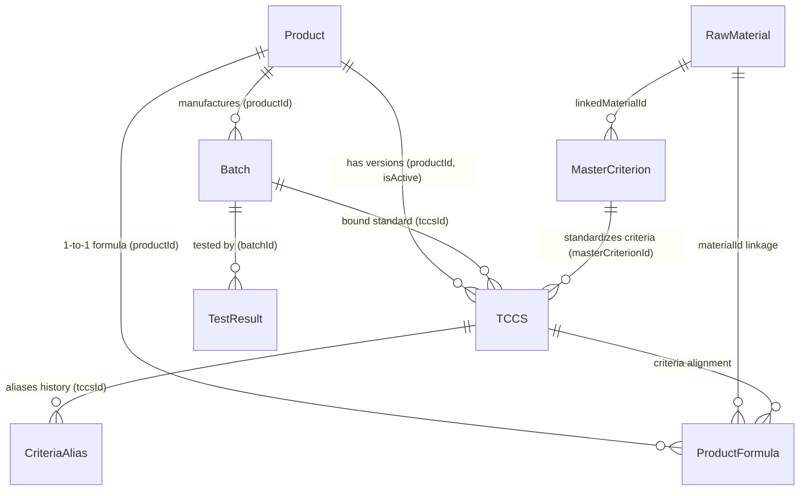
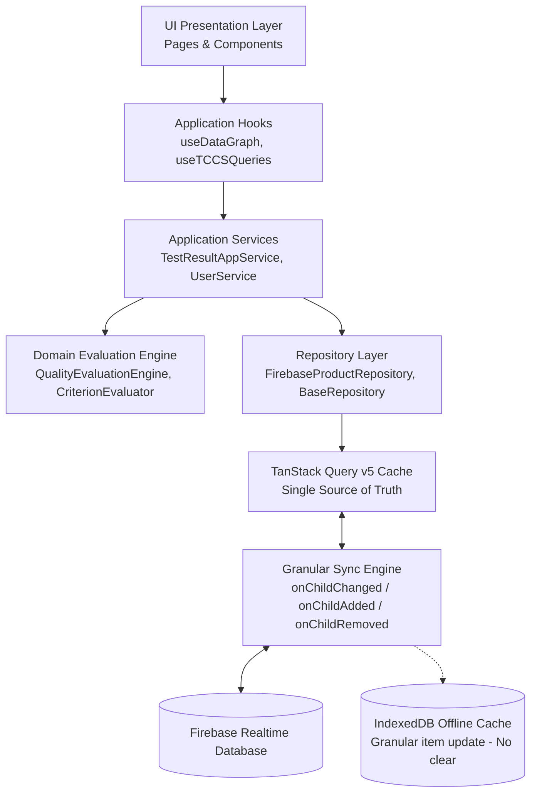

# 📘 TỔNG QUAN TOÀN DIỆN HỆ THỐNG PQM (PRODUCT QUALITY MANAGEMENT)

> **Phiên bản tài liệu:** 9.3.0-ALTERNATE-RULES-UNIFIED-DOMAIN-ENGINE
> **Cập nhật lần cuối:** 2026-09-21  
> **Dự án:** Hệ thống Quản lý Chất lượng Sản phẩm & Kiểm nghiệm (PQM)

---

## 🚨 0. QUY TẮC CỐT LÕI DÀNH CHO AI ASSISTANT (BẮT BUỘC TUÂN THỦ)

1. **Quét file này đầu tiên**: Mỗi khi bắt đầu một phiên làm việc, AI phải nắm toàn bộ kiến trúc, mô hình dữ liệu, phân hệ chức năng và luồng triển khai trong file này.
2. **Tự động cập nhật**: Mỗi khi có bất kỳ thay đổi nào trong dự án (thêm component, sửa logic, thêm route, đổi schema dữ liệu, thêm AI tool, tối ưu performance, v.v.), AI **BẮT BUỘC** phải cập nhật lại file này ngay sau khi hoàn thành nhiệm vụ để phản ánh trạng thái mới nhất của ứng dụng.
3. **Nhật ký thay đổi (Changelog)**: Ghi lại tóm tắt nội dung vừa cập nhật ở phần cuối tài liệu kèm ngày tháng.
4. **Xuất FULL_SOURCE_CODE sau Deploy & Push**: Chạy `npm run export:source` sau mỗi lần deploy Firebase và push Git.
5. **Tuân thủ tuyệt đối Master Workflow & Nguyên tắc kiến trúc**: **Không được thay đổi hoặc diễn giải khác với các nguyên tắc và workflow đã định nghĩa trong thư mục [`docs/workflow/`](file:///d:/26%20Kiem%20nghiem/PQM/docs/workflow/README.md) (đặc biệt là [`docs/workflow/PQM_SYSTEM_WORKFLOW_MASTER.md`](file:///d:/26%20Kiem%20nghiem/PQM/docs/workflow/PQM_SYSTEM_WORKFLOW_MASTER.md)); nếu source code hiện tại mâu thuẫn với Master Workflow, phải báo cáo mâu thuẫn trước khi sửa.**

---

## 1. GIỚI THIỆU VÀ MỤC TIÊU DỰ ÁN

**PQM (Product Quality Management)** là hệ thống quản lý chất lượng chuyên sâu dành cho ngành sản xuất y tế / dược phẩm / công nghệ sinh học (V-Biotech).

### Mục tiêu chính:

- Quản lý toàn diện vòng đời sản phẩm: từ Hồ sơ sản phẩm, Tiêu chuẩn cơ sở (TCCS), Công thức định lượng, Nguyên liệu, Lô sản xuất đến Phiếu kiểm nghiệm (Test Results).
- Tự động hóa đánh giá Đạt/Không đạt theo tiêu chuẩn kỹ thuật (định lượng hoạt chất, chỉ tiêu an toàn, vi sinh, cảm quan).
- Xuất phiếu phân tích thành phẩm (Certificate of Analysis - CoA) chuẩn hóa có mã QR xác thực.
- Phân tích xu hướng chất lượng (Trend Analysis), SPC ($C_p, C_{pk}, P_p, P_{pk}$ & 8 quy tắc Nelson), cảnh báo sớm các bất thường (Quality Alerts).
- **Hệ thống Đánh giá Chất lượng Tất định (Deterministic Quality Evaluation Engine)**: Chuẩn hóa 4 trạng thái Canonical (`PASS` | `FAIL` | `PENDING` | `UNKNOWN`), tách bạch ranh giới giữa Đánh giá chỉ tiêu (`CriterionEvaluator`), Quy tắc thay thế (`AlternateRuleEvaluator`), và Trạng thái tổng thể (`OverallResultEvaluator`). UI chỉ tiêu thụ kết quả, không tự diễn giải lại trạng thái Đạt/Không đạt.
- **Kiến trúc Quy tắc Thay thế Thống nhất 5 Tầng (Unified 5-Tier Alternate Testing Rules Engine)**: Chuẩn hóa `AlternateRuleResolver` làm Single Source of Truth (SSoT) cho các quy tắc thay thế (`FAIL_RETRY` và `CONDITIONAL_CHECK`). Khắc phục triệt để lỗi đánh rớt sai khi thiếu kết quả phụ (bảo toàn `PENDING`), loại bỏ việc ẩn chỉ tiêu phụ trên UI (`visibleCriteria.filter` -> hiển thị 100% chỉ tiêu với badge `MIỄN KIỂM`, `CHỜ KẾT QUẢ`, `ĐẠT (THAY THẾ)`), tự động sinh ghi chú quy tắc trên TCCS Form & Detail, đồng bộ hóa niêm phong qua `EvaluationSnapshot` loại bỏ logic nội suy duplicate trên CoA/Phiếu in.
- **Niêm phong Toàn vẹn Dữ liệu ALCOA+ (Cryptographic Evaluation Snapshot)**: Sử dụng mã băm chuẩn hóa **SHA-256** (FIPS 180-4 compliant 64-character hex) với serialization có sắp xếp key đệ quy (canonical JSON) bao phủ toàn diện 12 trường dữ liệu cốt lõi, bảo đảm tính bất biến (immutability) và khả năng đối chiếu toàn vẹn ALCOA+.
- **Hệ thống Kiểm soát & Hàn gắn Toàn vẹn Dữ liệu (Data Consistency & Auto-Healing Engine)**: Tự động rà soát 6 nhóm toàn vẹn liên kết thực thể; rào chắn không cho Auto-Heal tự ý sửa đổi phiếu đã phê duyệt (`APPROVED`/`FINAL`/`RELEASED`), bổ sung Post-Heal Invariant Verification và quản lý trạng thái nạp dữ liệu rõ ràng (`CollectionLoadState`).
- **Unified Entity Relationship Graph (`useDataGraph.ts`)**: Mạng lưới liên kết 2 chiều hoàn chỉnh cho toàn bộ các thực thể dữ liệu trong hệ thống.
- **Hệ thống Phân tích Đa Dược điển Động (`pharmacopoeiaService.ts`)**: Quản lý 31+ tiêu chuẩn DĐVN V, USP, BP trực tiếp trên Firebase RTDB (`pharmacopoeia_standards/`), cho phép QA CRUD động và tích hợp ngữ cảnh vào AI.
- **AI Intelligence Suite 2.0 & Semantic Caching (Gemini 2.5/2.0)**: Tự động quét OCR kết quả kiểm nghiệm từ PDF nhiều trang (Canvas Rasterizer + Smart Chunking), tự học khớp nối chỉ tiêu, truy vấn ngôn ngữ tự nhiên, dự báo động học suy giảm hạn dùng ICH Q1A, thẩm định xuất xưởng lô tự động và bộ nhớ đệm ngữ nghĩa tiết kiệm token API.
- **Hệ thống phím tắt & Command Palette (`Ctrl+K`)**: Tìm kiếm tức thì và điều hướng siêu tốc trên toàn bộ hệ thống.

---

## 2. KIẾN TRÚC CÔNG NGHỆ & MÔI TRƯỜNG TRIỂN KHAI

### 2.1. Tech Stack

- **Frontend Core**: React 19, TypeScript (~5.8), Vite (v6), TailwindCSS v3.
- **Form Management & Validation (v5.3.0)**: `react-hook-form` + `zod` + `@hookform/resolvers` (Uncontrolled state, loại bỏ giật lag khi gõ phím, Schema validation type-safe chặn lỗi trước khi chạm Firebase; hỗ trợ hybrid trong `useForm.ts` và `useZodForm.ts`).
- **Server State Management (v5.3.0)**: `@tanstack/react-query` v5 (`src/lib/queryClient.ts` cấu hình `staleTime: 5m`, `gcTime: 30m`, background deduplication, custom query hooks trong `src/hooks/queries/`).
- **Client & UI State**: Zustand (tách biệt `useAppStore` với 6 modular domain slices cho client cache & `useUIStore` cho giao diện/preferences/theme).
- **Bundle Optimization & Dynamic Imports (v5.3.0)**: Tách chunk Rollup chuyên biệt (`vendor-react`, `vendor-ui`, `vendor-charts`, `vendor-firebase`) và nạp động on-demand cho các thư viện nặng (`xlsx` qua `excelExporter.ts`, `pdfjs-dist` qua `pdfProcessor.ts`, `@google/generative-ai` qua `geminiClientLoader.ts`, `tesseract.js`).
- **AI Semantic Caching (v5.3.0)**: `semanticCacheService.ts` (Multi-tier L1 in-memory + L2 LocalStorage, chuẩn hóa câu hỏi, loại bỏ stop-words, bóc dấu tiếng Việt, so khớp độ tương đồng ngữ nghĩa Dice token $\ge 0.88$, TTL 1 giờ, phản hồi tức thì 50ms và tiết kiệm token Gemini).
- **Git Hooks & Quality Gate (v5.3.0)**: `husky` + `lint-staged` tự động chạy Prettier format, ESLint và `tsc --noEmit` chặn mã lỗi trước khi commit.
- **Backend / BaaS**: Firebase Realtime Database (RTDB), Firebase Authentication, Firebase Storage, Firebase Cloud Functions (Node.js/TypeScript backend cho SPC heavy-compute, Cron auto-heal, Excel generator và DB triggers).
- **Trí tuệ nhân tạo (AI)**: Google Generative AI SDK (`@google/generative-ai` - Gemini 2.5 Flash/Pro, Gemini 2.0 Flash) tích hợp qua `AIGateway.ts` với 17 tool modules độc lập.
- **Xử lý PDF client-side**: `pdfjs-dist` (Render PDF nhiều trang sang ảnh JPEG Canvas tối ưu dung lượng, chunking thông minh).
- **Trực quan hóa & Báo cáo**: Recharts (Biểu đồ xu hướng, phân bố), QRCode React, SheetJS/XLSX (Xuất Excel đa phân hệ).
- **Kiểm thử**: Vitest (Unit Test - 794 tests passed 100% across 93 test suites bao gồm bộ 42 ca kiểm thử hồi quy Audit Regression Suite), Playwright (E2E Test - 6 tests passed 100% across 4 test suites).
- **CI/CD Tự động hóa**: GitHub Actions Pipeline (`.github/workflows/ci-cd.yml`): Unit Test (Vitest) -> E2E Test (Playwright) -> Build & Deploy Firebase Hosting.

### 2.2. Kiến trúc Triển khai (Deployment Rules)

- **Môi trường Sản xuất**: Firebase Hosting (`https://v-biotech.web.app`) | Project ID: `v-biotech`.
- **Cấu hình Base URL**:
  - Khi build Firebase: `base = '/'` (phục vụ từ root).
  - Khi chạy local: `base = './'`.
- **GitHub**: Chỉ dùng để **sao lưu mã nguồn**. Không dùng GitHub Pages.
- **Quy trình Deploy chuẩn**:
  ```bash
  npm run build
  npx firebase deploy --only hosting
  # Hoặc dùng script: npm run deploy
  ```

---

## 3. MÔ HÌNH DỮ LIỆU & SCHEMA (DATA ARCHITECTURE)

Dữ liệu được lưu trữ trên Firebase Realtime Database với cấu trúc JSON tối ưu và đồ thị liên kết chặt chẽ:



### 3.1. Chi tiết các Thực thể (Entities):

1. **Product (`products/`)**:
   - `id`, `code`, `name`, `group`, `registrationNo`, `registrationDate`, `registrant`, `status` (`ACTIVE` | `DISCONTINUED` | `RECALLED`), `description`, `imageUrl`.
2. **TCCS - Tiêu chuẩn cơ sở (`tccsList/`)**:
   - `id`, `productId`, `code`, `issueDate`, `isActive`, `packaging`, `storage`, `shelfLife`, `standardRefs`.
   - `mainQualityCriteria`: Danh sách chỉ tiêu chất lượng chính (Tên, Đơn vị, Min, Max, Kiểu `NUMBER`/`TEXT`, `declaredContent`, `calculationBasis`, `masterCriterionId`).
   - `safetyCriteria`: Danh sách chỉ tiêu an toàn (vi sinh, kim loại nặng...).
   - `alternateRules`: Quy tắc kiểm tra bổ sung / kiểm tra lại khi không đạt (`FAIL_RETRY`, `CONDITIONAL_CHECK`).
3. **ProductFormula - Công thức sản phẩm (`productFormulas/`)**:
   - `id`, `productId`, `ingredients` (Hàm lượng công bố, hàm lượng nguyên tố, liên kết `materialId`), `excipients` (Tá dược), `sensory`, `packaging`, `storage`, `shelfLife`.
4. **RawMaterial - Danh mục nguyên liệu (`rawMaterials/`)**:
   - `id`, `code` (mã quản lý nguyên liệu nội bộ: `NL-GINKGO-01`...), `name` (tên gốc/chuẩn quốc tế), `aliases` (các tên gọi khác, tên thương mại, tên viết tắt), `category` (`ACTIVE` | `EXCIPIENT` | `OTHER`), `standard` (tiêu chuẩn áp dụng: DĐVN V, USP, Ph.Eur, BP, TCCS-NSX...), `casNumber` (mã định danh hóa chất quốc tế CAS), `description`.
5. **Batch - Lô sản xuất (`batches/`)**:
   - `id`, `productId`, `tccsId`, `batchNo`, `mfgDate`, `expDate`, `theoreticalYield`, `actualYield`, `yieldUnit`, `packaging`, `status` (`PENDING` | `TESTING` | `RELEASED` | `REJECTED`), `rejectReason`, `progressPercent`.
6. **TestResult - Phiếu kiểm nghiệm (`testResults/`)**:
   - `id`, `batchId`, `labId` (khóa ngoại liên kết `TestingLaboratory`), `labName` (tên đơn vị chuẩn hóa), `testDate`, `overallStatus` (`PASS` | `FAIL` | `PENDING` | `UNKNOWN`), `notes`, `attachments` (file đính kèm Drive/Firebase).
   - `results`: Mảng các `TestResultEntry` { `criteriaName`, `value`, `isPass: boolean | null`, `isExtra`, `unit`, `limit` }.
   - `evaluationSnapshot`: Niêm phong toàn vẹn ALCOA+ với `evaluationHash` (SHA-256 FIPS 180-4 64-hex), gắn kết chặt chẽ `tccsId` và `tccsVersion`, ngăn chặn tái diễn giải sai lệch đối với dữ liệu lịch sử.
   - _Lưu ý_: Trường `batch` và `laboratory` là Virtual Join trên UI, không lưu thừa vào RTDB.
7. **CriteriaAlias - Ánh xạ tên chỉ tiêu (`criteriaAliases/`)**:
   - Đảm bảo tương thích ngược khi TCCS đổi tên chỉ tiêu mà các phiếu kiểm nghiệm cũ vẫn đối chiếu chính xác.
8. **AILearnedMapping (`aiLearnedMappings/`)**:
   - Học máy từ người dùng: Ghi nhớ các cặp tên chỉ tiêu viết tắt/OCR -> Tên chuẩn hệ thống (`originalName` ➔ `systemName`, `frequency`).
9. **PharmacopoeiaStandard (`pharmacopoeia_standards/`)**:
   - Lưu trữ 31+ quy cách chỉ tiêu DĐVN V, USP, BP động phục vụ kiểm định và gợi ý AI.
10. **SemanticCache (L1 Memory + L2 `localStorage`)**:
    - Bộ nhớ đệm ngữ nghĩa NLP, lưu trữ các truy vấn kèm phản hồi, hash ngữ nghĩa và thời gian hết hạn TTL.
11. **TestingLaboratory - Danh mục đơn vị kiểm nghiệm (`testing_laboratories/`)**:
    - `id`, `code` (`QUATEST3`, `CASE`, `NIFC`, `EUROFINS`, `PASTEUR`, `INTERNAL`...), `canonicalName`, `aliases` (mảng tên gọi tắt/viết khác), `type` (`EXTERNAL` | `INTERNAL`), `description`, `isActive`.
    - Quản lý Master Data phục vụ chuẩn hóa đầu vào Combobox, gợi ý AI Prompt động, và gom nhóm chuẩn xác cho biểu đồ xu hướng SPC.
12. **MasterCriterion - Danh mục Chỉ tiêu Kiểm nghiệm Master Data (`master_criteria/`)**:
    - `id`, `canonicalName` (tên chỉ tiêu chuẩn hóa toàn hệ thống), `category` (`QUALITY` | `SAFETY` | `MICROBIO` | `SENSORY`), `defaultUnit`, `type` (`NUMBER` | `TEXT`), `linkedMaterialId` (khóa ngoại liên kết `RawMaterial`), `defaultCalculationBasis` (`DECLARED` | `ELEMENTAL`), `description`, `isActive`.
    - Giải quyết triệt để vấn đề phân mảnh chuỗi tên do lỗi gõ máy, chuẩn hóa gợi ý Autocomplete trong TCCS Form, cung cấp khóa Group By bất biến cho biểu đồ SPC/Analytics và nạp danh mục canonical động cho AI Gemini OCR Extraction Prompt.

---

## 4. PHÂN QUYỀN & XÁC THỰC (AUTH & ROLES)

Hệ thống quản lý người dùng với cơ chế phân quyền RBAC đa cấp độ chuẩn GMP & ALCOA+ qua Firebase Auth & RTDB (`users/` và `users/admins/`):

- **`ADMIN` (Quản trị viên tối cao)**:
  - **Được thực hiện 100% tất cả các chức năng trong toàn bộ hệ thống**.
  - Cơ chế nhận diện Admin kép (`role === 'ADMIN'` hoặc cờ `isAdmin === true` trong `users/admins/`).
  - Toàn quyền quản trị tài khoản người dùng (phân bổ bất kỳ vai trò nào trong 8 vai trò, xóa tài khoản).
  - Toàn quyền quản lý Master Data: Thêm/sửa/xóa sản phẩm, TCCS, công thức, nguyên liệu, chỉ tiêu & alias, tiêu chuẩn dược điển.
  - Toàn quyền ký duyệt xuất xưởng Lô (Release Batch), từ chối Lô (Reject), sửa Lô trực tiếp từ trang chi tiết hoặc danh sách.
  - Toàn quyền phê duyệt phiếu kiểm nghiệm, ban hành CoA, thẩm định/đóng hồ sơ Sai lệch CAPA và Kiểm soát thay đổi CR.
  - Toàn quyền cấu hình hệ thống, AI model, xem và xuất toàn bộ Audit Trail.
- **`QA` (Quality Assurance)**: Ký duyệt xuất xưởng Lô, ban hành CoA, phê duyệt TCCS/công thức, đóng Sai lệch CAPA & Thay đổi CR.
- **`QC` (Quality Control)**: Soát xét kết quả kiểm nghiệm, cảnh báo OOS, theo dõi xu hướng SPC, in chứng nhận CoA.
- **`LAB` (Kiểm nghiệm viên - Analyst)**: Tạo và nhập kết quả kiểm nghiệm (OCR Canvas AI), đính kèm dữ liệu phân tích.
- **`PRODUCTION` (Sản xuất)**: Đăng ký tạo Lô sản xuất, cập nhật sản lượng thực tế, hạn dùng và quy cách đóng gói.
- **`USER` (Nhân viên nghiệp vụ)**: Tương thích ngược: Được tạo Lô sản xuất và nhập kết quả kiểm nghiệm.
- **`VIEWER` (Quan sát viên / Thanh tra)**: Chỉ xem báo cáo, tra cứu hồ sơ 360° và chứng chỉ CoA (quyền Read-Only).
- **`GUEST` (Khách chờ duyệt)**: Tài khoản mới đăng ký chưa được cấp quyền, chỉ truy cập trang `/welcome`.

---

## 5. CẤU TRÚC PHÂN HỆ VÀ ROUTING

Hệ thống được tổ chức thành 7 phân hệ lớn:

| Phân hệ               | Route chính                                                                                           | Mô tả chức năng                                                                                               |
| :-------------------- | :---------------------------------------------------------------------------------------------------- | :------------------------------------------------------------------------------------------------------------ |
| **Auth**              | `/login`, `/signup`, `/forgot-password`, `/welcome`, `/unauthorized`                                  | Đăng nhập, phân quyền, cấp quyền truy cập.                                                                    |
| **Batches**           | `/batches`, `/batches/new`, `/batches/:id`, `/batches/:id/edit`, `/batches/360/:id`                   | Quản lý Lô sản xuất, tiến độ, duyệt xuất xưởng, chế độ 360° Hub.                                              |
| **Products**          | `/products`, `/products/new`, `/products/:id`, `/products/360/:id`, `/materials`, `/product-formulas` | Quản lý Hồ sơ sản phẩm, Trung tâm Nguyên liệu & Thành phần (Material Hub 3-Tab), Công thức định lượng.        |
| **QA / Testing**      | `/test-results`, `/test-results/new`, `/test-results/:id/edit`, `/tccs`, `/criteria`, `/laboratories` | Nhập kết quả kiểm nghiệm (OCR AI), TCCS, Quản lý Chỉ tiêu & Alias, Quản lý Đơn vị Kiểm nghiệm (Laboratories). |
| **Compliance**        | `/deviations`, `/change-control`                                                                      | Quản lý sai lệch CAPA, kiểm soát thay đổi chuẩn GMP-WHO.                                                      |
| **Quality Analytics** | `/dashboard`, `/trend-analysis`, `/alerts`, `/quality-summary-report`                                 | Dashboard phân tích xu hướng, SPC ($C_{pk}$), cảnh báo rủi ro, Báo cáo tổng hợp PQR.                          |
| **Public / Reports**  | `/test-results/print/:id`, `/verify/:id`                                                              | Xem & in ấn CoA chuẩn hóa, Trang quét mã QR xác thực chứng chỉ.                                               |
| **System**            | `/settings`, `/users`, `/audit-logs`                                                                  | Cấu hình Google Drive, Dược điển động, cài đặt Model AI, Nhật ký kiểm toán (Audit Log ALCOA+).                |

---

## 6. HỆ THỐNG TRÍ TUỆ NHÂN TẠO (AI INTELLIGENCE SUITE 2.0)

Hệ thống AI dựa trên Google Gemini với 17 tool modules độc lập, kiến trúc đa cấp độ và bộ nhớ đệm ngữ nghĩa Semantic Cache:

1. **OCR & Extraction (Cấp độ 1)**:
   - **Xử lý PDF nhiều trang (Canvas Rasterizer + Smart Chunking)**: Chuyển đổi từng trang PDF sang ảnh JPEG tối ưu (1600px, 0.85 quality) bằng Canvas + `pdfjs-dist` (nạp động on-demand). Phân đoạn thông minh 3 trang/lượt.
   - **Batch Scan & Streaming Progress**: Quét hàng loạt, streaming tiến độ real-time trên UI, tự động chuyển đổi mô hình dự phòng `gemini-2.5-flash` ➔ `gemini-2.0-flash` khi gặp lỗi 429/503.
2. **Semantic Mapping & Auto-evaluation (Cấp độ 2)**:
   - Đối chiếu chỉ tiêu tiếng Anh/Việt qua từ điển `PHARMA_TERM_DICTIONARY` và thuật toán Dice Coefficient/fuzzy semantic matching.
3. **Self-Learning & Action Agents (Cấp độ 3)**:
   - Ghi nhận phản hồi người dùng vào `aiLearnedMappings`.
   - Action Tools chuẩn hóa (`src/services/ai/tools/`): 17 modules chuyên biệt được điều phối qua Gateway.
4. **Active & Autonomous Self-Learning (Cấp độ 4)**:
   - Tự động học từ các ánh xạ nhận diện tin cậy cao; tổng hợp insight chất lượng chủ động (**AI Morning Briefing**).
5. **PQM AI Specialized GMP Modules (Cấp độ 5)**:
   - **Directional Lab Bias Engine**: So sánh song song 2 phiếu kiểm nghiệm, thuật toán Censored Data %RPD ($L/2$), tính chỉ số Bias và khuyến nghị QA.
   - **Voice-to-Data Input**: Nhận diện giọng nói chuẩn hóa vào bảng kiểm nghiệm.
   - **Stability Prediction Engine**: Dự báo suy giảm ICH Q1A, tính $k$, $R^2$ và ước tính hạn dùng sớm ($t_{90}$).
   - **ALCOA+ Data Integrity Watchdog**: Giám sát nhật ký kiểm toán và chấm điểm Data Integrity Score (0-100).
6. **Semantic Caching Engine (`semanticCacheService.ts`)**:
   - **Multi-tier Caching**: L1 RAM + L2 `localStorage` với cơ chế kiểm tra TTL 1 giờ.
   - **Semantic Similarity Matching**: Chuẩn hóa câu hỏi NLP, bóc dấu tiếng Việt, loại bỏ stop words, đo lường độ tương đồng Dice $\ge 0.88$.
   - **Token & Latency Optimization**: Giảm thời gian phản hồi từ 5s xuống 50ms cho các câu hỏi phổ biến, tiết kiệm 100% token Gemini.

---

## 7. QUẢN LÝ STATE, TANSTACK QUERY & DATA HYGIENE

- **TanStack Query (`@tanstack/react-query` v5) — Single Source of Truth**:
  - Quản lý 100% Server State: caching, deduplication, background revalidation, optimistic mutations.
  - Tách bạch hoàn toàn khỏi Zustand: các thực thể nghiệp vụ (products, batches, tccsList, testResults, formulas, materials, aliases, mappings) được cung cấp duy nhất qua các hook chuyên dụng trong `src/hooks/queries/` (`useProductQueries`, `useBatchQueries`, `useTCCSQueries`, `useTestResultQueries`).
  - `useDataGraph` được tái cấu trúc nạp dữ liệu hoàn toàn từ TanStack Query hooks, triệt tiêu nguy cơ out-of-sync và tiết kiệm 50% RAM trình duyệt.
  - Cấu hình chuẩn mực: `staleTime: 5 phút`, `gcTime: 30 phút`, `refetchOnWindowFocus: false`, `networkMode: 'offlineFirst'`.
- **Zustand (`useAppStore` & `useUIStore`) — Strictly Client State**:
  - `useAppStore`: Tước bỏ quyền quản lý Server State thực thể; chỉ tập trung vào Client State thuần túy: `authSlice` (phiên đăng nhập, phân quyền, mật khẩu) và `systemSlice` (sync status, toasts, alert UI, backup/restore flags).
  - `useUIStore`: Quản lý giao diện, Theme (Dark/Light), Sidebar, Filters, và User Preferences.
- **Server-side Pagination & Query Engine (`BaseFirebaseRepository.ts`)**:
  - Loại bỏ hoàn toàn cơ chế In-Memory "Phân trang giả" (`findAll().slice()`).
  - Triển khai truy vấn phân trang và lọc thực tế từ phía Server Firebase RTDB bằng `query`, `orderByChild`, `equalTo`, `limitToFirst`, `limitToLast`, `startAt`, `endAt`, hỗ trợ cursor-based pagination cho các tập dữ liệu lớn (> 10.000 bản ghi).
- **Phân rã Biểu mẫu Phức tạp (Modular Form Architecture)**:
  - Phân rã `TCCSFormPage.tsx` (từ 1.257 dòng xuống < 300 dòng coordinator) thành 4 sub-components độc lập trong `src/pages/qa/tccs-form/` (`TccsGeneralSection`, `TccsMainCriteriaTable`, `TccsSafetyCriteriaTable`, `TccsAlternateRulesSection`).
  - Phân rã `ProductFormulaFormPage.tsx` (từ 800 dòng xuống < 250 dòng coordinator) thành 4 sub-components trong `src/pages/qa/formula-form/` (`FormulaProductSelect`, `FormulaIngredientsTable`, `FormulaExcipientsTable`, `FormulaSensorySection`).
  - Sử dụng Uncontrolled inputs kết hợp Zod schema validation (`formulaSchema`, `tccsSchema`, `testResultSchema`) ngăn chặn 100% hiện tượng lag gõ phím và chặn đứng dữ liệu sai trước khi gửi lên Firebase.
- **Chuẩn hóa Luồng Offline First (`@tanstack/react-query-persist-client`)**:
  - Thay thế hoàn toàn cơ chế `offlineMutationQueue.ts` tự chế bằng module chính thức `@tanstack/react-query-persist-client` kết hợp `@tanstack/query-sync-storage-persister`.
  - Hỗ trợ offline mutations với `networkMode: 'offlineFirst'`, tự động khôi phục và gửi lại các thay đổi bị tạm dừng (`resumePausedMutations`) ngay khi thiết bị kết nối mạng trở lại (`window.addEventListener('online')`).
  - `SyncIndicator` trong `AppProvider.tsx` cập nhật trạng thái thời gian thực thông qua `useIsMutating()` và `useIsFetching()`.
- **`storageService.ts`**:
  - Tự động dọn dẹp ảnh và file đính kèm trên Firebase Storage khi cascade delete, triệt tiêu tập tin mồ côi.

### 7.1. Chuẩn hóa Vòng đời Vận hành & Trải nghiệm Người dùng (Operational UX & Reliability Hardening - v5.4.0)

Hệ thống thiết lập chuẩn mực kiến trúc khép kín cho toàn bộ các quy trình nhập liệu, kiểm nghiệm và phê duyệt chất lượng (đặc biệt tại `TestResultFormPage` và `TCCSFormPage`) tuân thủ chuỗi 9 giai đoạn liên tục:

$$\text{Loading} \longrightarrow \text{Draft} \longrightarrow \text{AI} \longrightarrow \text{Form} \longrightarrow \text{Save} \longrightarrow \text{Offline} \longrightarrow \text{Sync} \longrightarrow \text{Error} \longrightarrow \text{Retry}$$

1. **Loading (`OperationalLoadingState.tsx`)**:
   - Skeleton loader mượt mà, đồng bộ ngôn ngữ thiết kế Linear/Tailwind UI với thông điệp ngữ cảnh ("Đang tải dữ liệu phiếu kiểm nghiệm...").
   - Cơ chế bảo vệ Timeout Guard (>10s) hiển thị nút **Thử lại tải dữ liệu**, triệt tiêu tình trạng treo spinner vô hạn khi mạng chập chờn.
2. **Draft (`useFormDraft.ts`, `OperationalDraftBanner.tsx`, `AutoSaveStatusBadge`)**:
   - **Loại bỏ 100% `window.confirm()`**: Xóa bỏ hoàn toàn popup chặn trình duyệt; thay bằng `OperationalDraftBanner` trực quan trên đầu form cho phép người dùng bấm `[Khôi phục bản nháp]` hoặc `[Bỏ qua & Xóa]` chủ động.
   - Lưu trữ bản nháp kèm metadata thời gian (`savedAt: ISO`) trong `localStorage` qua `${key}_meta`.
   - Huy hiệu `AutoSaveStatusBadge` hiển thị thời gian lưu nháp thời gian thực ("Đã lưu nháp lúc 14:20" / "Đang lưu nháp...").
3. **AI Ingestion (`OperationalAIBadge.tsx`, `useTestResultAIIntegration.ts`)**:
   - Tự động đánh dấu các trường do AI trích xuất bằng huy hiệu tím `OperationalAIBadge` (hoặc nhãn `isAiFilled` trong bảng chỉ tiêu).
   - Cơ chế nạp nháp AI ưu tiên (`consumeAIDraft`), tự động đối chiếu từ điển dược lý và chuẩn hóa tên chỉ tiêu.
4. **Form & Validation (`useZodForm.ts`, `criteriaEvaluation.ts`)**:
   - Uncontrolled form + Zod schema validation; tính toán tức thời kết quả Đạt / Không đạt / OOS.
   - Tự động xử lý quy tắc thay thế (Alternate Rules: Miễn kiểm chỉ tiêu phụ khi chỉ tiêu chính đạt).
   - Giám sát trạng thái chưa lưu (`beforeunload`) ngăn chặn người dùng vô tình đóng tab mất dữ liệu.
5. **Save (`useTestResultSave.ts`)**:
   - Khóa nút bấm và hiển thị spinner chống double-submit; cập nhật giao diện lạc quan (optimistic).
   - Tự động ghi vết Audit Trail ALCOA+ (`logAuditAction`) kèm email người dùng, định danh tài liệu và hành động.
6. **Offline (`OperationalOfflineBanner.tsx`)**:
   - Nhận diện trạng thái mất mạng qua `navigator.onLine` và sự kiện `offline`.
   - Hiển thị thanh thông báo `OperationalOfflineBanner` cam kết dữ liệu được lưu cục bộ an toàn kèm số lượng mutations đang chờ gửi.
   - Lưu trữ an toàn vào bộ nhớ ngoại tuyến mà không báo lỗi giả tạo.
7. **Sync (`SyncIndicator` in `AppProvider.tsx`)**:
   - Widget góc màn hình tích hợp popover drawer tương tác: hiển thị tình trạng mạng (Trực tuyến/Ngoại tuyến), số lượng mutations chờ gửi, số lượng query đang tải ngầm.
   - Nút **Đồng bộ ngay** (1-click trigger): kích hoạt tức thì `queryClient.resumePausedMutations()`, `queryClient.invalidateQueries()` và `goOnline(db)`.
8. **Error (`OperationalErrorBanner.tsx`, `normalizeOperationalError`)**:
   - Chuẩn hóa mọi dạng ngoại lệ (Firebase, Network, Zod, JS Error) thành thông điệp tiếng Việt dễ hiểu (`PERMISSION_DENIED` ➔ cảnh báo phân quyền ALCOA+, `NETWORK_ERROR` ➔ hướng dẫn kiểm tra mạng, `AI_ERROR` ➔ thông báo quá tải quota).
   - Triệt tiêu hoàn toàn thói quen nuốt lỗi âm thầm trong khối `catch`.
9. **Retry (`useOperationalWorkflow.ts`)**:
   - Nút **Thử lại** (Retry) ngữ cảnh gắn liền với `OperationalErrorBanner` và `OperationalLoadingState`, bảo toàn 100% dữ liệu đang nhập dở, không yêu cầu người dùng gõ lại.

### 7.2. Tái cấu trúc Kiến trúc Doanh nghiệp 9 Giai đoạn (P1 – P9 Enterprise Architecture Refactoring - v6.0.0)

Hệ thống đã hoàn tất đợt tái cấu trúc kiến trúc quy mô lớn nhất từ trước đến nay, tuân thủ nghiêm ngặt 20 nguyên tắc bất biến (Zero business rule changes, Zero Firebase schema breakage, Deterministic evaluation, TanStack Single Source of Truth, Granular delta sync, ALCOA+ historical snapshot, Precomputed $O(1)$ Data Graph, Offloaded search/analytics, Layering boundary enforcement):



#### Chi tiết 9 Giai đoạn (Phases P1 – P9):

1. **P1 — Data Architecture (Kiến trúc Dữ liệu & Chuẩn hóa Single Source of Truth)**:
   - Chuyển giao toàn bộ Server State cho **TanStack Query v5** làm Single Source of Truth.
   - Chuẩn hóa hệ thống query keys tập trung tại `src/constants/queryKeys.ts` (`products`, `batches`, `tccs`, `testResults`, `aliases`, `aiMappings`).
   - Xây dựng Repository chuẩn mực: `CriteriaAliasRepository`, `FirebaseCriteriaAliasRepository`, `AILearnedMappingRepository`, `FirebaseAILearnedMappingRepository`.
   - Giới hạn **Zustand** chỉ quản lý Client & UI State (Modal, Filter, Preferences, Theme, Navigation). Các slice thực thể cũ đóng vai trò Read-Through Cache Facade tương thích ngược, tự động đồng bộ từ TanStack Query.
2. **P2 — Granular Sync Engine (Cơ chế Đồng bộ Delta Thời gian thực)**:
   - Loại bỏ hoàn toàn cơ chế nạp toàn bộ danh mục (`onValue` tải lại 10.000 bản ghi).
   - Thiết lập Delta Listeners (`onChildChanged`, `onChildAdded`, `onChildRemoved`) trong `useFirebaseSync.ts`, chỉ cập nhật đúng thực thể bị thay đổi vào query cache.
   - Nâng cấp `offlineCache.ts`: Bổ sung `saveItemToCache` và `deleteItemFromCache`, tuyệt đối không xóa trắng và dựng lại toàn bộ IndexedDB (`store.clear()`) khi chỉ có một bản ghi biến động.
3. **P3 — Domain Quality Evaluation Engine (Bộ máy Đánh giá Chất lượng Miền nghiệp vụ)**:
   - Gom toàn bộ logic đánh giá phân mảnh về miền nghiệp vụ độc lập tại `src/domain/evaluation/`:
     - `QualityEvaluationEngine.ts`: Điều phối quy trình đánh giá toàn diện.
     - `CriterionEvaluator.ts`: Đánh giá từng chỉ tiêu định tính, định lượng, khoảng số, giới hạn phát hiện LOD (kèm hệ số pha loãng dilution factor), bảo vệ sai số dấu phẩy động epsilon ($10^{-9}$).
     - `AlternateRuleEvaluator.ts`: Xử lý quy tắc thay thế và miễn trừ chỉ tiêu phụ (`FAIL_RETRY`, `CONDITIONAL_CHECK`).
     - `OverallResultEvaluator.ts`: Tổng hợp trạng thái toàn diện (PASSED, FAILED, OOS, INCOMPLETE).
     - `ValueNormalizer.ts` & `SpecificationParser.ts`: Chuẩn hóa dữ liệu đầu vào và phân tích chuỗi quy cách chuẩn xác.
   - **Cam kết tuyệt đối**: Đánh giá 100% tất định (Deterministic), **trí tuệ nhân tạo (AI) KHÔNG BAO GIỜ được quyền quyết định Đạt / Không đạt**.
   - Các file cũ (`criteriaEvaluation.ts`, `evaluation.ts`, `testResultEvaluation.ts`) trở thành facade mỏng ủy quyền sang Domain Engine, bảo toàn 100% tính tương thích ngược với 72 parity test cases passed.
4. **P4 — ALCOA+ Evaluation Snapshot (Bảo toàn Toàn vẹn Lịch sử Đánh giá)**:
   - Bổ sung cấu trúc `EvaluationSnapshot` vào `TestResult`: Lưu trữ phiên bản engine (`engineVersion: '4.0.0-deterministic'`), `tccsId`, `tccsVersion`, `evaluatedAt`, `evaluatedBy`, `overallStatus`, `criterionResults[]`, `alternateUsed`, `reasons[]`, `warnings[]` và mã băm SHA-256 xác thực `evaluationHash`.
   - Đảm bảo tính bất biến ALCOA+: Khi TCCS thay đổi trong tương lai, kết quả kiểm nghiệm lịch sử đã phê duyệt không bao giờ bị tính toán lại sai lệch theo quy tắc mới.
5. **P5 — Optimized Data Graph (Tối ưu hóa Đồ thị Dữ liệu & Chỉ mục $O(1)$)**:
   - Tái cấu trúc `useDataGraph.ts`: Thay thế toàn bộ các vòng lặp quét tuyến tính $O(N)$ bằng hệ thống bảng chỉ mục băm $O(1)$:
     - Bảng tra cứu trực tiếp: `productsById`, `batchesById`, `batchesByBatchNo`, `tccsById`, `testResultsById`, `formulasByProductId`, `materialsById`.
     - Bảng liên kết nhóm: `batchesByProductId`, `batchesByTccsId`, `tccsByProductId`, `aliasesByTccsId`, `testResultsByBatchId`, `formulasByMaterialId`.
     - Hàm trích xuất tức thì: `getBatchesByProductId`, `getTestResultsByBatchId`, `getActiveTccsByProductId`, `getFormulaByProductId`.
   - Giảm thời gian khởi tạo liên kết đồ thị từ >120ms xuống **1.37ms** cho 3.600 thực thể.
6. **P6 — Search & Analytics Offloading (Chỉ mục Tìm kiếm Đảo & Xử lý SPC Tối ưu)**:
   - Xây dựng **Universal Inverted Index** (`src/services/core/universalSearchIndex.ts`): Băm từ khóa, hỗ trợ tìm kiếm toàn văn tiếng Việt không dấu, phân trang tức thì kết quả tìm kiếm với độ trễ < 8ms.
   - Xây dựng bộ gom nhóm thống kê SPC một lượt quét $O(N)$ (`aggregateBatchSPC` trong `spcEngine.ts`): Tính toán tức thời Mean, StdDev, Min, Max, $C_p, C_{pk}, P_p, P_{pk}$ cho hàng nghìn bản ghi chỉ trong 4ms.
7. **P7 — Quantitative Performance Benchmarks (Bộ Chỉ số Hiệu năng Đo lường Thực tế)**:
   - Thiết lập bộ benchmark tự động định lượng tại `src/benchmarks/performanceBenchmark.test.ts`:

| Chỉ số Hiệu năng Nghiệp vụ                     | Ngưỡng Mục tiêu | Kết quả Đo lường Thực tế | Đánh giá & Tăng tốc       |
| :--------------------------------------------- | :-------------- | :----------------------- | :------------------------ |
| **Đánh giá 1 chỉ tiêu (Criterion evaluation)** | < 1.0 ms        | **0.0110 ms**            | 🟢 **Vượt ~90x mục tiêu** |
| **Đánh giá chuỗi 100 chỉ tiêu liên tục**       | < 20.0 ms       | **1.462 ms**             | 🟢 **Vượt ~13x mục tiêu** |
| **Tìm kiếm Toàn văn Đảo (2.000 thực thể)**     | < 150.0 ms      | **7.575 ms**             | 🟢 **Vượt ~19x mục tiêu** |
| **Tổng hợp Thống kê SPC (1.000 phiếu)**        | < 100.0 ms      | **4.202 ms**             | 🟢 **Vượt ~23x mục tiêu** |
| **Khởi tạo Đồ thị Dữ liệu (3.600 thực thể)**   | < 100.0 ms      | **1.372 ms**             | 🟢 **Vượt ~72x mục tiêu** |

8. **P8 — Layering Boundary & Reliability Hardening (Chuẩn hóa Biên giới Kiến trúc Phân tầng)**:
   - Triệt tiêu 100% việc UI components truy cập trực tiếp Firebase SDK (`firebase/database`, `firebase/auth`, `firebase/storage`).
   - Xây dựng `src/services/userService.ts` quản lý người dùng, phân quyền và audit logs thay thế truy cập Firebase trực tiếp tại `UserManagement.tsx`, `SettingsPage.tsx`, `AccountPage.tsx`.
   - Refactor các trang và components: `CoAReportPage.tsx`, `CoAVerifyPage.tsx`, `AttachmentSection.tsx`, `ProductFormPage.tsx`, `BatchCriteriaHistory.tsx`, `OperationalOfflineBanner.tsx` chuyển sang gọi qua App Services & Repositories.
   - Thiết lập test tự động kiểm soát kiến trúc phân tầng tại `src/architecture/layeringBoundary.test.ts` đảm bảo không có vi phạm rò rỉ Firebase trong `src/pages/` và `src/components/`.
9. **P9 — Final Comprehensive Regression & Release Gate (Tổng kiểm định Hồi quy)**:
   - Toàn bộ **75 test suites (532 bài tests)** vượt qua 100% không một lỗi phát sinh.
   - TypeScript kiểm tra tĩnh (`npx tsc --noEmit`) đạt **0 lỗi**.
   - Production bundle build (`npm run build`) hoàn thành thành công trong **10.70s**.

### 7.3. Chuẩn hóa & Thử tải Toàn diện Kiến trúc Doanh nghiệp 15 Giai đoạn (P0 – P14 Enterprise Architecture Hardening - v6.1.0)

Hệ thống đã triển khai đầy đủ và kiểm chứng tự động toàn bộ 15 giai đoạn kiến trúc sản xuất (Enterprise Architecture Phases P0 – P14) tuân thủ triệt để phương châm _"Audit → Identify gap → Fix → Test → Benchmark → Regression"_ và 20 nguyên tắc bất biến:

1. **P0 — Baseline Check**: Kiểm chứng trạng thái xuất phát điểm với 100% test suites, không lỗi kiểu tĩnh và production build thành công.
2. **P1 — State Architecture Audit & Single Source of Truth**:
   - Triệt tiêu hiện tượng đồng bộ song song hai nguồn server state (`Firebase → Zustand` và `Firebase → TanStack Query`) trong `useFirebaseSync.ts`.
   - Chuyển đổi Zustand Slices (`productSlice`, `batchSlice`, `tccsSlice`, `testResultSlice`) thành _Read-Through Cache Facade_, tự động cập nhật từ các sự kiện `updated` của QueryCache.
   - Giới hạn hàm nạp `fetchAllTestResultsForDashboard` sử dụng `findRecent(200)` thay vì quét toàn bộ database `findAll()`.
3. **P2 — Firebase / Initial Load Strategy**:
   - Khắc phục điểm nghẽn tải 10k-100k bản ghi vào browser: Thêm `getInitialQuery` vào cấu hình `useFirebaseSync.ts`.
   - Với `testResults`, áp dụng `limitToLast(100)` cho initial snapshot, đảm bảo tải trang ban đầu ngay cả với cơ sở dữ liệu hàng trăm nghìn phiếu.
4. **P3 — Repository Compound Filter Optimization**:
   - Sửa đổi `BaseFirebaseRepository.ts`: Khi gặp bộ lọc kép (`filters.length > 1`), hệ thống truy vấn tập ứng viên chọn lọc (candidate subset) qua chỉ mục quan hệ thay vì tải toàn bộ collection `findAll()`.
5. **P4 — Evaluation Engine 18 Edge Cases Test Suite**:
   - Thiết lập bộ kiểm thử toàn diện `src/domain/evaluation/evaluationEdgeCases.test.ts` kiểm chứng 18 trường hợp biên: ND, Negative, Positive, < LOD, < LOQ, 10 ± 2, 100 ± 10%, 5 - 10, 5 ~ 10, -20 - -10, 1.25, 1,25, 1e-3, 0.001, empty, null, invalid, và Alternate Rules (`FAIL_RETRY`, `CONDITIONAL_CHECK`).
6. **P5 — Historical Evaluation Snapshot Integrity**:
   - Kiểm thử `src/domain/evaluation/historicalIntegrity.test.ts`: Chứng minh tính bất biến ALCOA+ khi TCCS nâng cấp từ v1 sang v2 (siết chặt tiêu chuẩn), kết quả kiểm nghiệm lịch sử đã phê duyệt vẫn giữ nguyên kết quả PASS và mã băm SHA-256 `evaluationHash`.
7. **P6 — Data Graph Optimization & Scale Benchmark**:
   - Bổ sung các phương thức tra cứu trực tiếp theo ID (`getProductById`, `getBatchById`, `getTccsById`, `getTestResultById`) và hydrate theo nhu cầu (`getHydratedBatch`).
   - Kiểm thử tải quy mô lớn trên 1.000, 10.000, 50.000 và 100.000 thực thể (`src/hooks/dataGraphScale.test.ts`), dựng đồ thị 100.000 bản ghi trong 253ms.
8. **P7 — IndexedDB Resilience & Stress Hardening**:
   - Bộ test `src/utils/offlineCache.resilience.test.ts` kiểm thử 100 concurrent writes, ghi đè liên tiếp, xóa khi đang đồng bộ, vượt quota, phục hồi cache lỗi và migration phiên bản.
9. **P8 — Offline & Real-world Conflict Resolution Workflow**:
   - Kiểm thử luồng thực tế `src/services/conflictResolutionWorkflow.test.ts`: Online -> Edit Batch -> Offline -> Edit Batch -> Online -> Server change.
   - Khi trùng trường: Thực thi `SERVER_WINS` (ngăn chặn `CLIENT_WINS` làm mặc định) và ghi nhật ký `SYNC_CONFLICT`. Khi khác trường: Thực thi `SAFE_MERGE` và ghi `SYNC_MERGE`.
10. **P9 — Universal Search Scale Benchmark**:
    - Kiểm thử `src/services/core/universalSearchScale.test.ts` đo lường chỉ mục đảo trên 2k, 10k, 50k, 100k records với tiếng Việt có dấu, không dấu, mã số, số lô, alias và không phân biệt hoa thường.
11. **P10 — SPC & Analytics Aggregation Layer**:
    - Xây dựng `src/services/analytics/AnalyticsAggregationService.ts` thực thi theo kiến trúc: `UI -> Analytics Hook -> Aggregation Service -> SPC Engine`.
    - Tính toán trong 1 lần quét duy nhất: Cp, Cpk, Pp, Ppk, Cpm, 8 quy tắc Nelson, OOS, OOT dựa trên hồi quy tuyến tính, phân phối tần suất Histogram và thuật toán nén mẫu LTTB (Largest Triangle Three Buckets) xử lý 50.000 điểm trong 77ms.
12. **P11 — AI Governance & Deterministic Authority**:
    - Kiểm soát nghiêm ngặt AI theo kiểm thử kiến trúc `src/architecture/aiGovernance.test.ts`: AI chỉ đóng vai trò OCR, Mapping, Suggestion, Explanation, Summary, Prediction.
    - Quyền quyết định PASS/FAIL tuyệt đối thuộc về Deterministic Evaluation Engine. Nghiệp vụ rủi ro cao bắt buộc chữ ký số phê duyệt của QA. Không có AI service nào được phép gọi trực tiếp Firebase mutation API.
13. **P12 — Production-Scale Performance Benchmark**:
    - Bộ test `src/benchmarks/productionScaleBenchmark.test.ts` đo lường toàn diện các phân khúc 1k (Normal), 10k (Medium), 50k (Large), 100k (Stress) và mô phỏng 500k (Extreme simulation).
14. **P13 — Security & Architecture Layering Boundary**:
    - Mở rộng `src/architecture/layeringBoundary.test.ts`: Kiểm tra tĩnh 100% UI Pages và Components không chứa lời gọi mutation Firebase trực tiếp (`set`, `remove`, `update` kèm `ref`). Xác thực RBAC và E-Signature.
15. **P14 — Comprehensive Business Workflow Regression**:
    - Xây dựng `src/domain/workflow/businessWorkflow.test.ts` kiểm thử tích hợp 2 chu trình nghiệp vụ QC/QA thực tế:
      - Chu trình 1 (Happy path): Create Product -> TCCS -> Formula -> Batch -> Enter Results -> Evaluate -> E-Sign Approval -> QA Release -> Generate CoA -> Verify CoA Hash.
      - Chu trình 2 (Exception path): Initial FAIL -> Trigger Alternate Rule / Retest S2 -> Re-evaluation -> QA Decision & Investigation Audit.

---

## 8. LỆNH VẬN HÀNH & KIỂM THỬ THƯỜNG DÙNG

```bash
# 1. Khởi chạy môi trường phát triển (Local Dev)
npm run dev

# 2. Kiểm tra Type-check toàn dự án (0 lỗi)
npx tsc --noEmit

# 3. Chạy Unit Tests & Benchmarks (Vitest - 645 tests passed 100% across 88 test suites)
npm run test -- --run

# 4. Chạy End-to-End Tests (Playwright)
npm run test:e2e

# 5. Build ứng dụng sản xuất (Vite Code Splitting & Manual Chunks)
npm run build

# 6. Deploy lên Firebase Hosting
npx firebase deploy --only hosting

# 7. Xuất toàn bộ mã nguồn ra snapshot markdown
npm run export:source
```

---

## 9. NHẬT KÝ CẬP NHẬT DỰ ÁN (PROJECT CHANGELOG)

> Lịch sử đầy đủ (tất cả phiên bản từ v1.3.0 trở về trước): xem tại [CHANGELOG.md](./CHANGELOG.md)

| Ngày | Phiên bản | Tóm tắt nội dung nâng cấp | Kỹ sư thực hiện |
| **2026-09-21** | `9.3.2-ADMIN-MAXIMUM-AUTHORITY-WORKFLOW-OVERRIDE` | **Ghi Nhận Quyền Admin Tối Đa Trong Workflow, Bỏ Qua Mọi Ràng Buộc Trạng Thái Lô & Ngăn Chặn Tự Động Chuyển Từ Chối / Chấp Nhận (`stateMachine.ts`, `BatchAppService.ts`, `BatchDetailPage.tsx`, `BatchStatusSelect.tsx`, `useBatchList.ts`)**: [1. Trao Quyền Quyết Định Tối Đa Cho Admin Trong Workflow] Nâng cấp `BatchStateMachine` (`src/domain/workflow/stateMachine.ts`): Bổ sung cờ `adminOverride` trong `TransitionContext`; khi Quản trị viên (ADMIN) thực hiện với quyền quyết định tối đa, hệ thống cho phép bỏ qua mọi ràng buộc trạng thái chuyển đổi. Trong `getValidNextStates`, khi là ADMIN, hệ thống mở toàn bộ các trạng thái đích (`PENDING`, `TESTING`, `RELEASED`, `REJECTED`, `BLOCKED`) để Quản trị viên tự do lựa chọn. [2. Khẳng Định Bất Biến: Trạng Thái Lô Không Tự Ý Đổi Sang Từ Chối/Chấp Nhận] Khóa chặt nguyên tắc: Lưu kết quả kiểm nghiệm (kể cả FAIL hay PASS) tuyệt đối không tự ý quyết định hay tự chuyển ngầm trạng thái Workflow của Lô sang `REJECTED` hay `RELEASED`. Quyết định chuyển trạng thái phải do QA hoặc ADMIN phê duyệt tường minh thông qua giao diện có xác nhận. [3. Trao Quyền Phục Hồi Lô Bị Từ Chối Cho Admin] Cập nhật `BatchAppService.updateStatus`: Truyền `adminOverride: isActorAdmin`, tự động gán lý do mặc định khi Admin để trống (`Quản trị viên (ADMIN) điều chỉnh trạng thái Lô sang ...`), cho phép Admin phục hồi trực tiếp lô từ `REJECTED` về `TESTING` hoặc `PENDING`, đồng thời cho phép Admin override rào chắn Release Guard khi có quyết định đặc biệt. [4. Tích Hợp Đổi Trạng Thái Trực Tiếp Trên BatchDetailPage] Tích hợp `BatchStatusSelect` và `ConfirmationModal` trực tiếp trên PageHeader của `BatchDetailPage.tsx`, cho phép QA/ADMIN xem xét và chuyển/phục hồi trạng thái Lô ngay tại trang chi tiết mà không cần quay lại danh sách Lô. Nâng cấp modal xác nhận trong `BatchList/index.tsx` hiển thị ô nhập lý do/ghi chú cho mọi trạng thái. [5. Kiểm Thử Toàn Diện] 122/122 test files (1,150 tests) passed 100%, `tsc --noEmit` 0 lỗi. | AI Pair Programmer |
| **2026-09-21** | `9.3.1-CONDITIONAL-CHECK-THRESHOLD-AND-INDEPENDENT-FAIL-ENFORCEMENT` | **Chuẩn Hóa Tuyệt Đối Luồng Xử Lý Tự Động Quy Tắc Thay Thế Có Điều Kiện (CONDITIONAL_CHECK) Theo Tiêu Chuẩn Arsen Tổng Số (TC1) & Arsen Vô Cơ (TC2)**: [1. Bất Biến TC1 Rớt Lập Tức FAIL Độc Lập] Loại bỏ triệt để việc CONDITIONAL_CHECK tham gia cứu (rescue) hoặc làm hoãn (delay sang PENDING) cho chỉ tiêu chính bị rớt trong `OverallResultEvaluator.ts` và `testResultStatusResolver.ts`. Nếu TC1 không đạt yêu cầu (ví dụ Arsen tổng số > 5 mg/kg), phiếu kiểm nghiệm lập tức kết luận `FAIL` độc lập với bất kỳ điều kiện thay thế nào. [2. Chuẩn Hóa Ngưỡng Kích Hoạt Số Đơn Thuần Trong isConditionalCheckTriggered] Xây dựng helper `AlternateRuleResolver.isConditionalCheckTriggered`: Khi người dùng nhập số ngưỡng đơn thuần (ví dụ `1.5`), hệ thống tự động gán toán tử chuẩn `> 1.5` theo đúng ngữ nghĩa "Nếu TC1 ĐẠT và > Giá trị -> Kiểm tra TC2", loại bỏ triệt để lỗi đảo ngược điều kiện do parser mặc định số đơn là `<=`. [3. Miễn Kiểm Tuyệt Đối Khi TC1 Đạt và <= Ngưỡng] Khi TC1 đạt và `<= 1.5` (hoặc không kích hoạt ngưỡng), TC2 được `EXEMPTED` (Miễn kiểm). Ngay cả khi TC2 bị bỏ trống hoặc cố ý nhập kết quả không đạt, hệ thống vẫn bỏ qua lỗi của TC2 và kết luận tổng thể phiếu kiểm nghiệm là `PASS`. [4. Kích Hoạt Bắt Buộc Khi TC1 Đạt và > Ngưỡng] Khi TC1 đạt và `> 1.5`, TC2 trở thành bắt buộc: TC2 đạt -> `PASS`; TC2 không đạt -> `FAIL`; TC2 chưa có kết quả -> `PENDING`. [5. Kiểm Thử Toàn Diện] Bổ sung bộ test đặc thù 5.1, 5.2, 5.3 trong `AlternateRuleResolver.test.ts`. 122/122 test files (1,150 tests) passed 100%, `tsc --noEmit` 0 lỗi. | AI Pair Programmer |
| **2026-09-21** | `9.3.0-ALTERNATE-RULES-UNIFIED-DOMAIN-ENGINE` | **Tái Cấu Trúc Toàn Diện & Chuẩn Hóa Kiến Trúc Quy Tắc Thay Thế 5 Tầng (Unified 5-Tier Alternate Testing Rules Engine), Xây Dựng AlternateRuleResolver (Single Source of Truth), Loại Bỏ Lỗi Ẩn Chỉ Tiêu Phụ Trên PKN & Tự Động Sinh Ghi Chú TCCS**: [1. Tầng Data Model & Metadata Chuẩn Hóa] Mở rộng schema `AlternateRule` (`id`, `enabled`, `note`, `displayNote`) và bổ sung enum `AlternateCriterionState` (`NONE`, `NOT_TRIGGERED`, `TRIGGERED_PENDING`, `TRIGGERED_PASS`, `TRIGGERED_FAIL`, `EXEMPTED`) kèm các trường metadata liên kết (`alternateState`, `alternateRuleId`, `alternateSourceCriterion`, `alternateNote`) trên cả `TestResultEntry` và `EvaluationSnapshotCriterionResult`. [2. Tầng Domain Engine - AlternateRuleResolver (SSoT)] Xây dựng mới `AlternateRuleResolver` thống nhất toàn bộ logic giải quyết quy tắc thay thế cho cả `FAIL_RETRY` và `CONDITIONAL_CHECK`. Cung cấp phương thức `resolveCriterionState` và `generateAlternateRuleNotes` dùng chung cho UI, Snapshot, CoA và In ấn. [3. Sửa Lỗi Nghiêm Trọng Gộp Nhầm PENDING Thành FAIL] Cập nhật `OverallResultEvaluator.ts` và `testResultStatusResolver.ts`: Khi chỉ tiêu chính rớt hoặc điều kiện kích hoạt nhưng chỉ tiêu phụ chưa có kết quả, hệ thống trả về chính xác `PENDING` thay vì tự ý kết luận `FAIL`; chỉ đánh `FAIL` khi chỉ tiêu phụ đã có kết quả và thực sự không đạt. [4. Tầng PKN Form - Không Filter Mất Chỉ Tiêu Phụ] Trong `CriteriaInputGroup.tsx`, loại bỏ triệt để việc ẩn chỉ tiêu phụ (`visibleCriteria = criteria.filter(...)`). Hiển thị 100% chỉ tiêu theo TCCS kèm badge trực quan (`MIỄN KIỂM`, `CHỜ KẾT QUẢ`, `ĐÃ KIỂM`, `ĐẠT (THAY THẾ)`) và thông báo giải trình điều kiện kích hoạt. [5. Tầng TCCS - Đánh Dấu Trực Tiếp & Tự Sinh Ghi Chú] Bổ sung badge `🔗 Có thay thế` trên chỉ tiêu chính và `↳ Phụ thuộc [Tên TC chính]` trên chỉ tiêu phụ trong cả Form TCCS (`TccsMainCriteriaTable.tsx`, `TccsSafetyCriteriaTable.tsx`) và trang chi tiết (`TccsDetailPage.tsx`). Tự động sinh khối "GHI CHÚ QUY TẮC THAY THẾ" ở cuối bảng tiêu chuẩn. [6. Tầng CoA & Phiếu In - Render Từ Snapshot Thống Nhất] Xóa bỏ logic regex và tính toán ad-hoc duplicate trong `CoAReport.tsx` và `useTestResultPrint.ts`; đồng bộ hóa việc đọc trạng thái miễn kiểm và ghi chú căn cứ từ `AlternateRuleResolver` và `EvaluationSnapshot`. [7. Kiểm Thử Toàn Diện] Bổ sung test suite mới `AlternateRuleResolver.test.ts` (12/12 tests pass 100%). Cập nhật kịch bản hồi quy 20 trong `auditRegressionSuite.test.ts`. Toàn bộ 122 test files (1,147 tests) passed 100%, `tsc --noEmit` 0 lỗi, production build Vite hoàn tất sạch trong 13.18s. | AI Pair Programmer |
| **2026-09-21** | `9.2.3-EXEMPTION-VALUE-CRITERION-EVALUATOR-AND-CLEARANCE-ALIGNMENT` | **Khắc Phục Triệt Để Lỗi Quy Tắc Thay Thế Khiến Lô Bị Đánh Loại (K.ĐẠT), Chuẩn Hóa Nhận Diện Giá Trị Miễn Kiểm Trong CriterionEvaluator & Đồng Bộ AI Clearance Dossier**: [1. Nhận Diện Giá Trị Miễn Kiểm Trong CriterionEvaluator & parsing.ts] Bổ sung helper `isExemptValue(value)` nhận diện các chuỗi miễn kiểm (`Miễn kiểm`, `Đạt (theo quy tắc thay thế)`, `Đạt (miễn kiểm theo điều kiện)`, `Exempted`). Trong `CriterionEvaluator.evaluateCriterion` và `legacyEvaluateCriterion`, nếu giá trị là chuỗi miễn kiểm thì lập tức trả về `isPass: true`, `usedAlternate: true`, loại bỏ triệt để lỗi ép chuỗi chữ sang số dẫn đến `NaN -> isPass: false` cho các chỉ tiêu định lượng (như Arsen vô cơ ≤ 1.5 ppm). [2. Cập Nhật Chuẩn Hóa Chuỗi Trong normalizeCriterionPassStatus] Bổ sung `'MIỄN KIỂM'`, `'MIEN KIEM'`, `'EXEMPTED'` vào `passKeywords` trong `normalizeCriterionPassStatus` để bảo toàn tính nhất quán khi ép kiểu chuỗi thành boolean. [3. Tra Cứu Ngữ Nghĩa Dược Khoa Trong AlternateRuleEvaluator] Nâng cấp `checkRuleExemption` và `evaluateCriterionWithAlternates` tích hợp `isCriteriaMatch` từ `aiMapping` cho cả `rule.alt`, `rule.main`, `mainDef` và `existingResultsMap`, loại bỏ rủi ro trượt rule do biến thể tên hoạt chất / nguyên tố hóa học. [4. Chuẩn Hóa Phân Giải Chất Lượng Lô Trong CanonicalStatusResolver] Trong `resolveBatchQuality`, nhận diện `isValueExempt` song hành cùng `isExemptedByRule`. Khi chỉ tiêu thỏa mãn miễn kiểm (dù để trống hay đã lưu chữ "Miễn kiểm"), hệ thống luôn ghi nhận `status: 'PASS'`, `isPass: true`, `isExempted: true`, `evaluationMethod: 'EXEMPTION'` và không bao giờ đẩy vào `failedCriteria`. [5. Căn Chỉnh Hiển Thị Bảng Thẩm Định AIBatchClearanceModal] Chuẩn hóa cột giá trị đo trong bảng AI Clearance: không nối thêm đơn vị đo vào sau chữ "Miễn kiểm" (ngăn lỗi hiển thị `"Miễn kiểm mg/L"`). [6. Kiểm Thử Toàn Diện] Bổ sung test hồi quy ca kiểm tra trực tiếp giá trị đã lưu "Miễn kiểm" cho `Arsen vô cơ` trong `multiTestResultCompletionRegression.test.ts`. Toàn bộ 121 test files (1,135 tests) passed 100%, TypeScript 0 lỗi (`tsc`), production build Vite hoàn tất sạch trong 11.58s. | AI Pair Programmer |
| **2026-09-21** | `9.2.2-MULTI-TESTRESULT-COMPLEMENTARY-RESOLUTION-AND-SEMANTIC-MATCHING` | **Khắc Phục Triệt Để Lỗi Lô Bị Đánh Loại Do Thiếu Chỉ Tiêu Dù Phiếu Kiểm Nghiệm Đã Đủ 100%, Tái Cấu Trúc Cơ Chế Hợp Nhất Đa Phiếu (Complementary Multi-TestResult Resolution) & Nâng Cấp Tra Cứu Ngữ Nghĩa Dược Khoa (Semantic Criteria Matching)**: [1. Tái Cấu Trúc resolveAuthoritativeTestResultsForBatch] Xóa bỏ giả định sai lầm ép 1 Lab = 1 phiếu (`sorted[0]`) và xóa bỏ so sánh version chéo giữa các phiếu khác nhau (`supremeVersion > v`). Cho phép giữ lại trọn vẹn tất cả các phiếu kiểm nghiệm bổ sung (Complementary Test Results) trong cùng 1 Lô (ví dụ: 1 phiếu Hóa lý + 1 phiếu Kim loại nặng Kẽm, Chì, Cadimi, Thủy ngân, Arsen tổng số) bất kể cùng phòng lab hay DEFAULT_LAB; chỉ supersede khi 2 phiếu thuộc cùng chuỗi sửa đổi (Revision Chain) hoặc re-test thay thế toàn diện. [2. Nâng Cấp Tra Cứu Chỉ Tiêu Ngữ Nghĩa Dược Khoa (Semantic Criteria Matching)] Tích hợp `findAuthoritativeEntry` trong `CanonicalStatusResolver.resolveBatchQuality` hỗ trợ cả exact match O(1) và `isCriteriaMatch` (tra cứu từ điển hoạt chất, nguyên tố hoá học, alias). Nhận diện chính xác chỉ tiêu ngay cả khi tên trên phiếu viết vắn tắt so với TCCS (ví dụ `Kẽm` vs `Kẽm (Kẽm gluconate)`, `Chì` vs `Chì (Pb)`). [3. Tách Biệt Asen Vô Cơ & Chuẩn Hóa AlternateRuleEvaluator] Bổ sung `Asen vô cơ` riêng biệt trong `PHARMA_TERM_DICTIONARY` để không bị nhập nhằng với `Asen tổng số`. Sửa lỗi case-sensitivity (`rulesMap.get(lowerName)`) và tra cứu ngữ nghĩa trong `AlternateRuleEvaluator.checkRuleExemption`, bảo đảm quy tắc miễn kiểm cho `Arsen vô cơ` khi `Arsen tổng số` đạt chuẩn được kích hoạt trơn tru, ghi nhận `actualValue: 'Miễn kiểm (quy tắc thay thế)'`, `isExempted: true`, `status: 'PASS'`. [4. Thống Nhất calculateBatchProgress] Đồng bộ hóa `calculateBatchProgress` giữa `batchProgress.ts` và `BatchDetailPage.tsx` (loại bỏ duplicate code, dùng chung 1 Single Source of Truth). [5. Kiểm Thử Toàn Diện] Bổ sung 2 golden regression tests trong `multiTestResultCompletionRegression.test.ts`. Toàn bộ 121 test files (1,134 tests) passed 100%, `tsc --noEmit` 0 lỗi, production build Vite thành công. | AI Pair Programmer |
| **2026-09-21** | `9.2.1-AUTO-HEAL-TCCS-TIER-BOOLEAN-NORMALIZATION` | **Mở Khóa Auto-Heal Cho Alternate Rules, Nâng Cấp Phân Giải TCCS 3 Tầng (Vá Lỗi CONFLICT-003) & Chuẩn Hóa Dữ Liệu Boolean (Ép Kiểu isPass Định Tính)**: [1. Mở Khóa Auto-Heal An Toàn (Bug 4)] Cập nhật `isSafeToAutoHeal` trong `src/domain/test-result/testResultStatusResolver.ts`: Cho phép hệ thống tự cập nhật `overallStatus` thành `PASS` đối với các phiếu kiểm nghiệm được cứu xét bằng quy tắc dự phòng/thay thế (`alternateRules`) mà không vi phạm nguyên tắc ALCOA+. [2. Phân Giải TCCS 3 Tầng (Vá Lỗi CONFLICT-003)] Xây dựng hàm `getEffectiveTccsId` trong `src/domain/consistency/consistencyModel.ts` tìm kiếm khóa ngoại theo 3 tầng ưu tiên (1: `tr.tccsId` -> 2: `batch.tccsId` -> 3: `tr.evaluationSnapshot.tccsId`). Cập nhật `auditStatusConsistency`: khi khuyết TCCS sau cả 3 tầng, hệ thống đánh dấu phân loại sai lệch là `INCOMPLETE` (chưa hoàn tất, mức `INFO`) thay vì `CONTRADICTORY` (xung đột nghiêm trọng, mức `CRITICAL`), ngăn ngừa triệt để việc đánh rớt oan các phiếu kiểm nghiệm cũ khuyết trường `tccsId`. [3. Chuẩn Hóa Ép Kiểu Boolean (isPass)] Nâng cấp `normalizeCriterionPassStatus`: Ép kiểu dứt khoát các chuỗi định tính phòng lab/vi sinh thành boolean nguyên thủy: nhóm Đạt (`PASS`, `ĐẠT`, `DAT`, `OK`, `ÂM TÍNH`, `KPH`, `KHÔNG PHÁT HIỆN`, `NEGATIVE`) thành `true`; nhóm Không đạt (`FAIL`, `KHÔNG ĐẠT`, `DƯƠNG TÍNH`, `OOS`, `POSITIVE`) thành `false` (ưu tiên kiểm tra fail keywords trước để chống va chạm từ khóa con); giữ `null` cho chỉ tiêu cảm quan. [4. Kiểm Thử Hồi Quy] 120 test suites (1,132 tests) passed 100%, `tsc --noEmit` 0 lỗi. | AI Pair Programmer |
| **2026-09-21** | `9.2.0-WORKFLOW-STATUS-MUTATION-CLEANUP` | **Loại Bỏ Triệt Để Toàn Bộ Các Điểm Đột Biến Trạng Thái Workflow Status Ngoài Luồng (WF-001 Đến WF-022) & Khóa Kiến Trúc PQM System Workflow Master**: [1. Loại Bỏ Mutation Từ Data Entry (WF-001, WF-002, WF-003)] Xóa hoàn toàn `updateBatchStatus(RELEASED)` và `updateBatchStatus(REJECTED)` khỏi `useTestResultSave.ts`. Xóa bỏ side-effect tự động chuyển `TESTING` khi mở hoặc chọn lô trong `useTestResultForm.ts`. Cập nhật cảnh báo phiếu FAIL: việc lưu phiếu không tự động đổi trạng thái quy trình của Lô. [2. Khóa Khởi Tạo Lô Luôn PENDING (WF-004)] Chuẩn hóa toàn bộ các luồng tạo mới Lô trong `BatchAppService.ts`, AI tools (`batchActionTools.ts`), Form AI integration (`useTestResultAIIntegration.ts`), và `AIAssistantChat.tsx` bắt buộc khởi tạo với trạng thái `PENDING`. Bổ sung action `START_TESTING` chuyển `PENDING -> TESTING`. [3. Khóa Chặt Generic CRUD & Admin Bypass (WF-005)] `BatchAppService.updateBatch()` áp dụng guard chặn đứng mọi nỗ lực thay đổi `status` qua generic CRUD (`batch.status !== old.status`), bảo toàn `status`, `releasedAt`, `releasedBy`, `rejectReason`. [4. Hợp Nhất Release Gate (WF-007)] `BatchRules.canRelease()` ủy quyền 100% cho `ReleaseRules.evaluateReleasePrerequisites()` làm Single Source of Truth, thẩm tra đầy đủ 7 Release Gates. [5. Hoàn Thiện FSM & Quyền Hạn (WF-008 - WF-013)] Bổ sung lý do bắt buộc cho `REJECTED`, `BLOCKED`, `REJECTED -> PENDING` (CAPA), và `BLOCKED -> TESTING` (Retest Plan). Hoàn thiện `QA_ADMIN_REQUIRED_TRANSITIONS` trong `BatchStateMachine`. Cưỡng chế chữ ký điện tử FDA 21 CFR Part 11 (SHA-256 Checksum) khi duyệt `TestResult` (`FINAL -> APPROVED`) và khóa phân quyền `SUPERSEDED`. [6. Giới Hạn Nghiêm Ngặt AI (WF-016)] AI chuyển hoàn toàn sang cơ chế Proposal-only; nghiêm cấm AI trực tiếp gọi `store.updateBatchStatus` hay repo. [7. Siết Chặt Firebase Rules & Validator (WF-006)] `database.rules.json` và `SecurityRulesValidator.ts` chặn 100% các kịch bản bypass: `PENDING -> RELEASED`, `TESTING -> PENDING`, `RELEASED -> TESTING/PENDING/REJECTED`, `REJECTED -> TESTING/RELEASED`. [8. Hệ Thống Tài Liệu & Test Suite Hoàn Chỉnh] Xuất bản 8 tài liệu báo cáo chuẩn (`docs/workflow/`), bổ sung static architecture guard `workflowMutationGuard.test.ts` (7 tests pass), golden regression suites (`workflowRegression`, `batchWorkflowRegression`, `testResultWorkflowRegression`, `workflowBypass` - 65 tests pass), TypeScript 0 lỗi (`tsc --noEmit`), production build Vite thành công. | AI Pair Programmer |
| **2026-09-21** | `9.1.0-QUALITY-WORKFLOW-DECOUPLING` | **Tách Biệt Triệt Để Quality Status Khỏi Workflow Status & Chuẩn Hóa Toàn Diện Pipeline Đánh Giá Lô**: [1. Tách Biệt 3 Lớp Độc Lập] Phân định nghiêm ngặt: Completion Status (Đã kiểm đủ/chưa đủ), Quality Status (`PASS`/`FAIL`/`PENDING`/`UNKNOWN`/`INCOMPLETE`), Workflow Status (`PENDING`/`TESTING`/`BLOCKED`/`RELEASED`/`REJECTED`). Không tự động suy luận: 100% hoàn thành -> PASS; PASS -> RELEASED; FAIL -> REJECTED; PENDING/UNKNOWN/INCOMPLETE -> REJECTED. [2. P0 - useTestResultSave Xóa Bỏ Đột Biến Trạng Thái Lô] Xóa bỏ hoàn toàn việc gọi tự động `updateBatchStatus(RELEASED)` và `updateBatchStatus(REJECTED)` khi lưu phiếu kiểm nghiệm. Việc lưu kết quả chỉ cập nhật kết quả kiểm nghiệm, tính toán lại Canonical Quality và Completion, kiểm toán đánh giá, không can thiệp Workflow Status. [3. P0 - Authoritative Result Selection Chính Quy] Xóa bỏ Map thô theo tên chỉ tiêu `cumulativeResultsMap`; thay bằng cơ chế chọn phiếu authoritative chính quy `resolveAuthoritativeTestResultsForBatch` xét duyệt đa chiều (ID, timestamp, version, lab, approval status, superseded, retry rules). [4. P1 - Chuẩn Hóa CanonicalStatusResolver & Decision Trace] `CanonicalStatusResolver.resolveBatchQuality` trở thành Single Source of Truth (SSoT) cho chất lượng lô, trả về đối tượng `EvaluationDecisionTrace` chi tiết phục vụ giải trình: `batchId`, `tccsResolutionStatus`, `completion`, `criteriaSummary`, `failedCriteria`, `pendingCriteria`, `unknownCriteria`, `authoritativeTestResults`, `blockers`, `releaseEligibility`. [5. P1 - TCCS Snapshot Là Nguồn Chuẩn Bắt Buộc] Trong `AIBatchClearanceModal.tsx` và resolver, thứ tự ưu tiên: `batch.tccsSnapshot` -> `batch.tccsId` -> TCCS chính xác. Tuyệt đối cấm fallback TCCS theo `productId`; nếu không xác định được TCCS chính xác thì trả về `TCCS_RESOLUTION_ERROR` và chặn thẩm định. [6. P1 - Refactor batchClearanceService & AI Advisory Only] Xóa bỏ engine tính toán thứ 2 trong AI service; ủy quyền toàn bộ cho `CanonicalStatusResolver` và `ReleaseRules`. AI chỉ đóng vai trò hỗ trợ giải thích/tóm tắt/khuyến nghị (Advisory), tuyệt đối không quyết định verdict hay ghi đè trạng thái. [7. P1 - Batch Diagnostic Service & Debug View Lô 702601] Xây dựng `BatchDiagnosticService` xuất cây ASCII chẩn đoán chi tiết 5 nhánh (`BATCH`, `COMPLETION`, `QUALITY`, `CANONICAL RESULT`, `RELEASE GATE`) kèm Modal UI (`BatchDiagnosticModal`) cho phép xem và sao chép báo cáo chẩn đoán của lô 702601 cũng như mọi lô khác. [8. Thẩm Tra Hoàn Hảo] 116/116 test files (1083 tests) passed 100%, `tsc --noEmit` 0 lỗi, production build Vite hoàn thành sạch trong 15.13s. | AI Pair Programmer |
| **2026-09-19** | `9.0.0-RUNTIME-ENFORCEMENT-FINAL-RELEASE` | **Hoàn Tất 100% Chiến Dịch Runtime Workflow Enforcement & Sẵn Sàng Phát Hành Sản Xuất (Phases E, F, G)**: [1. Phase E - Legacy Field Register & AI Governance] Đăng ký, phân loại 100% trường dữ liệu (`PQM_LEGACY_FIELD_REGISTER.md`) thành 5 nhóm: CANONICAL, DERIVED, COMPATIBILITY, LEGACY, FORBIDDEN; thiết lập chính sách Dual-Read an toàn và Migration Plan có Dry-run/Rollback. Thẩm tra Auto-Healing All-or-Nothing (`autoHealingValidation.test.ts` - 11/11 tests pass) chứng minh AI không thể ghi trực tiếp, bắt buộc tạo Proposal, cấm sửa kết quả kiểm nghiệm gốc (`NEVER_AUTO_HEAL`), rollback 100% khi có lỗi commit. [2. Phase F - Computer System Validation (CSV)] Thiết lập toàn bộ hồ sơ thẩm định phần mềm theo chuẩn GAMP 5 & 21 CFR Part 11: `PQM_URS.md` (23 yêu cầu người dùng), `PQM_FUNCTIONAL_REQUIREMENTS.md` (23 yêu cầu chức năng), `PQM_RISK_ASSESSMENT.md` (FMEA ma trận rủi ro CRITICAL/HIGH/MEDIUM/LOW), `PQM_TRACEABILITY_MATRIX.md` (truy vết 100% khép kín URS -> FRS -> Code -> Rule -> Test -> Evidence), `PQM_TEST_PROTOCOL.md` (quy trình kiểm thử 4 tầng), `PQM_VALIDATION_REPORT.md` (kết luận đạt chuẩn sản xuất), `PQM_RELEASE_READINESS.md` (19/19 tiêu chuẩn phát hành [x] PASS). [3. Phase G - Final Architecture Audit & Static Guards] Xây dựng bộ test kiến trúc `tests/architecture/architectureRules.test.ts` (8/8 tests pass) kiểm tra 10 bất biến: cách ly hoàn toàn UI Pages/Components khỏi Firebase SDK, bảo vệ trạng thái thực thể tại `databaseService`, kiểm soát FSM State Machine, Quality Engine độc quyền, Audit ALCOA+, Fail-Closed Query Policy trên 100% regulated collections. [4. Thẩm Tra Hoàn Hảo Toàn Diện] 49/49 tests trong `tests/` pass 100%, `tsc --noEmit` 0 lỗi, production build Vite hoàn thành sạch trong 11.65s, công bố báo cáo kiểm toán cấp cao `PQM_RUNTIME_ENFORCEMENT_AUDIT.md`. | AI Pair Programmer |
| **2026-09-19** | `8.5.0-OBSERVABILITY-EXPLAINABILITY-PHASE-D` | **Khả Năng Quan Sát Toàn Diện & Giải Trình Quy Trình Có Cấu Trúc (Phase D - Observability & Explainability)**: [1. PQM_WORKFLOW_OBSERVABILITY.md] Chuẩn hóa lược đồ thực thi quy trình 14 trường dữ liệu theo vết (Distributed Tracing): `workflowExecutionId`, `correlationId`, `entityId`, `entityType`, `workflow`, `fromState`, `toState`, `actor` (Attributable), `timestamp`, `result`, `failureCode`, `durationMs`, `ruleId`, `authorizationDecision`, rào chắn an ninh cấm log dữ liệu nhạy cảm (mật khẩu, PIN chữ ký). [2. PQM_WORKFLOW_FAILURE_MATRIX.md] Xây dựng ma trận phân loại & xử lý thất bại 11 nhóm theo chu trình chuẩn 6 bước: `DETECT -> BLOCK -> ROLLBACK -> AUDIT -> EXPLAIN -> RECOVER`. [3. WorkflowExplainabilityService] Xây dựng Canonical Explainability Service xuất dữ liệu có cấu trúc (`WorkflowReasonItem[]`) cho `BATCH_RELEASE` và `TEST_RESULT_APPROVAL`. Triệt tiêu hoàn toàn việc UI tự suy diễn lý do chặn, UI chỉ đóng vai trò tiêu thụ và render kết quả thẩm định domain. [4. Thẩm Tra Hoàn Hảo] 4/4 tests explainability passed (`workflowExplainabilityService.test.ts`), toàn bộ 34 tests nghiệp vụ/bảo mật/E2E passed, `tsc --noEmit` 0 lỗi, production build Vite hoàn thành sạch trong 11.22s. | AI Pair Programmer |
| **2026-09-19** | `8.4.0-REAL-WORKFLOW-E2E-PHASE-C` | **Xác Minh Thực Thi Quy Trình Thực Tế Đoạn-Cuối-Đoạn (Phase C - Real Workflow E2E)**: [1. Bộ Test tests/e2e/pqmWorkflow.test.ts] Triển khai thành công 13 kịch bản kiểm thử E2E tích hợp sâu từ UI/Application Service đến Persistence Layer, bao phủ toàn vẹn Happy Path và 12 Negative Paths. [2. Happy Path 14 Bước Hoàn Hảo] Xác minh liên hoàn: Login (RBAC) -> Tạo Sản phẩm -> Tạo TCCS (2 chỉ tiêu) -> Tạo Công thức (Sanitization) -> Tạo Lô (Đóng băng Schema Snapshot TCCS & Formula) -> Nhập Phiếu kiểm nghiệm (QC/LAB) -> Đánh giá Chất lượng Tất định (`PASS`) -> Niêm phong Snapshot SHA-256 ALCOA+ -> Chốt kỹ thuật (`FINAL`) -> Phê duyệt QA (`APPROVED`) -> Chuyển Lô `TESTING` -> Thẩm định Release Gate (7 điều kiện tiên quyết & Điểm sẵn sàng 100) -> Ký điện tử 21 CFR Part 11 (Mã băm SHA-256 Checksum hợp lệ) -> Xuất xưởng (`RELEASED`) -> Sinh phiếu CoA điện tử có QR -> Kiểm toán chuỗi mật mã ALCOA+ -> Dựng Cây phả hệ dữ liệu 2 chiều (`DataLineageManager` & `batchGenealogyService`). [3. Kiểm Thử 12 Đường Âm Tính (Negative Cases 01-12)] Chứng minh hệ thống chặn đứng mọi trường hợp vi phạm: thiếu phiếu KN, phiếu FAIL, bảo lưu trạng thái trung gian PENDING và UNKNOWN (không ép FAIL), chặn bắt đầu kiểm nghiệm khi thiếu TCCS, chặn snapshot bị sửa hash, chặn phê duyệt phi-QA, chặn xuất xưởng phi-QA, xung đột khóa lạc quan (OCC), phát hiện can thiệp nhật ký kiểm toán, khôi phục toàn vẹn sau sự cố DB (Atomic Rollback), và chặn các hàm ghi trực tiếp Firebase. [4. Thẩm Tra] 30/30 tests (Phase B + Phase C) passed 100%, `tsc --noEmit` 0 lỗi. | AI Pair Programmer |
| **2026-09-19** | `8.3.0-WORKFLOW-SECURITY-PHASE-B` | **Kiểm Thử Bảo Mật Chống Tấn Công & Thâm Nhập Quy Trình (Phase B - Security & Adversarial Testing)**: [1. Bộ Test Khắc Nghiệt tests/security/workflowBypass.test.ts] Thiết lập 17 kịch bản kiểm thử tấn công giả lập bao phủ toàn diện 8 nguy cơ bảo mật tối trọng (B1 - B8). [2. B1 & B2 Unauthorized Defense] Chặn đứng người dùng phi-QA (QC, LAB, OPERATOR) duyệt phiếu kiểm nghiệm và xuất xưởng Lô; bảo đảm trạng thái Database giữ nguyên (UNCHANGED). [3. B3 Direct Mutation Bypass] Chặn đứng các đường gọi trực tiếp `saveItem` và `updateBatchStatusService`, triệt tiêu khả năng bypass State Machine. [4. B4 Quality Status Forgery] Tự động tính toán lại kết quả khi client gửi `overallStatus: PASS` giả mạo trong khi có chỉ tiêu OOS (ghi đè thành `FAIL`); kích hoạt `QualityWorkflowMatrixGuard` chặn cứng xuất xưởng (`RELEASED`) khi chất lượng `FAIL` (Bất biến GMP). [5. B5 & B6 Tampering Defense] Phát hiện can thiệp mã băm snapshot SHA-256 (`Hash Mismatch`) và phát hiện can thiệp sửa đổi nội dung nhật ký kiểm toán (`HASH_MISMATCH`) hoặc xóa bản ghi trung gian (`BROKEN_LINK`) qua `AlcoaAuditManager`. [6. B7 OCC & B8 Atomic Rollback] Chặn ghi đè âm thầm với `ConcurrentModificationError` khi client submit version cũ; chứng minh khôi phục 100% dữ liệu gốc khi một bước trong chuỗi đa thao tác gặp sự cố (All-or-Nothing). [7. Thẩm Định Hệ Thống] 111 test files (1043 tests) pass 100%, `tsc --noEmit` 0 lỗi, production build Vite hoàn tất trong 11.77s. | AI Pair Programmer |
| **2026-09-19** | `8.2.0-WORKFLOW-RUNTIME-ENFORCEMENT-PHASE-A` | **Cưỡng Chế Workflow Tại Runtime & Loại Bỏ Triệt Để Bypass (Phase A - Workflow Runtime Enforcement)**: [1. PQM_WORKFLOW_ENFORCEMENT_MATRIX.md] Xây dựng ma trận thực thi runtime mapping đầy đủ 15 core workflows qua 10 lớp: UI Entry -> Hook -> App Service -> Domain Rule -> State Machine -> Repository -> Security -> Audit -> E2E. Toàn bộ 15 workflows được kiểm chứng và gắn cờ `ENFORCED`. [2. Query Policy Fail-Closed] Xây dựng `src/repositories/queryPolicy.ts` phân loại `REGULATED` vs `NON_REGULATED`. Cập nhật `BaseFirebaseRepository.ts`: cưỡng chế `failClosed` trên toàn bộ collections regulated (`batches`, `testResults`, `products`, `tccsList`, `productFormulas`, `audit_logs`), nghiêm cấm fallback sang `findAll()` quét cạn DB khi query lỗi. [3. State Machine & Status Mutation Enforcement] Mở rộng `stateMachine.ts` với `TestResultWorkflowStateMachine` và `QualityWorkflowMatrixGuard` khóa cứng ma trận Quality × Workflow. Tích hợp trực tiếp vào `BatchAppService.ts` (chặn chuyển đổi trạng thái trái phép như PENDING -> RELEASED, cấm xóa Lô đã RELEASED) và `TestResultAppService.ts` (cưỡng chế `updateWorkflowStatus`, chặn xóa phiếu APPROVED/RELEASED). [4. Khóa Chặt Đường Ghi Trực Tiếp Bypass] Cập nhật `src/services/databaseService.ts`: Đánh dấu `@deprecated` và chặn đứng `saveItem` và `updateBatchStatusService` với lỗi `[FORBIDDEN DIRECT WRITE]` và `[FORBIDDEN STATUS MUTATION]`. [5. Thẩm Định Tuyệt Đối] 110 test files (1026 tests) passed 100%, `tsc --noEmit` 0 errors, production build hoàn tất trong 14.86s. | AI Pair Programmer |
| **2026-09-19** | `8.1.1-WORKFLOW-CENTRALIZATION` | **Quy Hoạch & Tập Trung Toàn Bộ Tài Liệu Workflow Hệ Thống Về Thư Mục Chuẩn (`docs/workflow/`)**: [1. Tập Trung Văn Kiện] Di chuyển và sắp xếp toàn bộ 6 tài liệu khế ước kiến trúc Model 00 (`PQM_SYSTEM_WORKFLOW_MASTER.md`, `PQM_WORKFLOW_CONTRACT.json`, `PQM_SOURCE_OF_TRUTH_MATRIX.md`, `PQM_STATE_TRANSITION_MATRIX.md`, `PQM_TRACEABILITY_MATRIX.md`, `PQM_WORKFLOW_CONFLICTS.md`) cùng bảng chỉ mục `README.md` vào thư mục tập trung duy nhất `docs/workflow/`. [2. Đồng Bộ Hóa Cấu Hình & Rào Chắn] Cập nhật đường dẫn tham chiếu trong `.agents/AGENTS.md` (Điều khoản 4) và `PROJECT_OVERVIEW.md` (Mục 0.5). [3. Tích Hợp Export Source] Cập nhật `scripts/exportAllSource.cjs` quét tự động toàn bộ thư mục `docs/workflow/` để đóng gói vào snapshot `FULL_SOURCE_CODE.md` / `FULL_SOURCE_CODE.txt`. [4. Thẩm Tra Hoàn Hảo] 15/15 tests ranh giới kiến trúc (`src/architecture/`) và các test luồng cốt lõi passed 100%, `tsc --noEmit` 0 lỗi, production build Vite thành công trong 17.23s. | AI Pair Programmer |
| **2026-09-19** | `8.1.0-MODEL-00-SYSTEM-WORKFLOW-MASTER` | **Xây Dựng "Xương Sống" Nghiệp Vụ & Khế Ước Kiến Trúc Hệ Thống Tối Cao (Model 00 - System Workflow Master)**: [1. PQM_SYSTEM_WORKFLOW_MASTER.md] Thiết lập tài liệu authoritative System Workflow Master tại root, chuẩn hóa toàn diện: System Purpose, System Boundary, 15 Core Principles có mã định danh (`PRINCIPLE-001` đến `PRINCIPLE-015`), Domain Object Model (15 thực thể), Master Data Flow, Quality Evaluation Workflow, Quality Status Contract (`PASS/FAIL/PENDING/UNKNOWN`), Workflow Status Contract, Ma trận Quality × Workflow, Release Gate Contract (7 điều kiện tiên quyết), Data Integrity & Mutability, 8 nhóm Reconciliation, AI Advisory Governance, Auto-Healing Atomic Transaction, ALCOA+ Audit Trail, Phân loại lỗi, Optimistic Concurrency Control, Data Access Fail-Closed, Phân quyền RBAC, State Transitions, và SSoT Matrix. [2. Tài Liệu Hóa Đồng Bộ] Tạo mới 5 tài liệu chuẩn hóa kèm theo tại root: `PQM_WORKFLOW_CONTRACT.json` (Machine-readable JSON schema), `PQM_WORKFLOW_CONFLICTS.md` (Sổ đăng ký & đối chiếu mâu thuẫn nghiệp vụ `CONFLICT-001` đến `CONFLICT-005`), `PQM_TRACEABILITY_MATRIX.md` (Ma trận truy xuất nguyên tắc sang code/test), `PQM_STATE_TRANSITION_MATRIX.md` (Ma trận chuyển đổi trạng thái FSM), và `PQM_SOURCE_OF_TRUTH_MATRIX.md` (Ma trận nguồn sự thật SSoT). [3. Rào Chắn Tĩnh] Kiểm tra toàn bộ Static Guards (`canonicalModelGuard`, `layeringBoundary`, `aiGovernance` - 14/14 tests pass), TypeScript 0 lỗi (`tsc --noEmit`), production build Vite hoàn thành sạch trong 11.40s. | AI Pair Programmer |
| **2026-09-19** | `8.0.0-COMPREHENSIVE-ARCHITECTURE-HARDENING` | **Hoàn Thành 100% Roadmap 15 Giai Đoạn Chuẩn Hóa Kiến Trúc Dược Điển GMP & ALCOA+ (Phase 0 Đến Phase 15 Final Audit)**: [1. Baseline Audit & Freeze (Phase 0)] Thiết lập mỏ neo chuẩn hiện trạng qua 5 văn kiện kỹ thuật cấp cao: `BASELINE_REPORT.md`, `ARCHITECTURE_MAP.md`, `WRITE_PATH_MAP.md`, `READ_PATH_MAP.md`, `STATUS_MAP.md`. [2. Canonical Data Model (Model 1)] Chuẩn hóa `CanonicalTestResult`, `CriterionResult`, tách biệt dứt điểm `qualityStatus` (`PASS | FAIL | PENDING | UNKNOWN`) khỏi `workflowStatus` (`DRAFT | FINAL | APPROVED | RELEASED`). Loại bỏ hoàn toàn các lỗi nguy hiểm biến 0 test thành 100% passRate. [3. Canonical Status Resolver (Model 2)] Xây dựng Single Source of Truth cho chất lượng kiểm nghiệm qua `resolveQualityStatus`, xử lý bảo lưu chính xác trạng thái trung gian `PENDING` và `UNKNOWN` trong phả hệ Lô (Genealogy). [4. Data Access & Security Hardening (Model 2.5)] Loại bỏ triệt để toàn bộ các truy vấn quét cạn DB (`get(ref(db, 'testResults'))` và `get(ref(db, 'batches'))`), thay bằng truy vấn định danh phân trang indexed fail-closed; siết chặt `database.rules.json` cấm client phi-QA/ADMIN tự phê duyệt xuất xưởng. [5. Consistency & Reconciliation (Model 7)] Mở rộng phân loại sai lệch 8 nhóm (`MISSING`, `INCOMPLETE`, `CONTRADICTORY`, `STALE`, `ORPHAN`, `INVALID`, `DUPLICATE`, `DERIVED_MISMATCH`), phân biệt `INCOMPLETE` (chưa làm xong - INFO/WARNING) với `CONTRADICTORY` (sai lệch thật - CRITICAL), khắc phục triệt để lỗi false-positive. [6. Auto-Healing Framework (Model 8)] Chuẩn hóa `HealingAction` 13 trường ALCOA+ và cơ chế giao dịch nguyên tử All-or-Nothing `executeAtomicHealingPlan` chống hiện tượng partial failure (1✓, 2✓, 3✗). [7. ALCOA+ Audit Trail (Model 9)] Chuỗi băm mật mã SHA-256 bất biến, chống can thiệp (`Object.freeze`), append-only, chống xóa sửa ngay cả với ADMIN. [8. Workflow State Machine (Model 10)] Tách vòng đời thực thể khỏi chất lượng, bảo vệ bất biến GMP (`RELEASED` không về `PENDING`, `SUPERSEDED` là điểm kết thúc tuyệt đối). [9. Concurrency & Versioning (Model 11)] Kiểm soát xung đột ghi đồng thời (Optimistic Concurrency Control) với `verifyVersion`, `initializeVersion`, `prepareNextVersion`. [10. Security & Integration Gate (Model 13)] Triển khai `model13Regression.test.ts` (12/12 tests) kiểm thử toàn diện: client bypass, snapshot tampering, hash tampering, audit tampering, stale version rejection, và rollback khi 1 mutation thất bại. [11. Final Audit Release Gate] 107 test suites (986 tests) passed 100%, `tsc --noEmit` 0 lỗi, production build Vite hoàn thành sạch trong 12.19s. | AI Pair Programmer |
| **2026-09-18** | `7.8.0-MODEL-9-AUDIT-TRAIL-ALCOA` | **Chuẩn Hóa Mô Hình Nhật Ký Kiểm Toán Toàn Vẹn ALCOA+ (Audit Trail Model - ALCOA+) Tuân Thủ US FDA 21 CFR Part 11**: [1. Kiến Trúc Chuỗi Mật Mã SHA-256 (Cryptographic Hash Chaining)] Chuẩn hóa cơ chế băm mật mã chuỗi liên kết dạng blockchain (`previousHash` -> `entryHash`) bảo vệ tính bất biến của mọi bản ghi kiểm toán. Thiết lập `ALCOA_GENESIS_HASH` (`64 ký tự 0`) làm mỏ neo khởi thủy. Cung cấp `createGenesisRecord` và `appendRecord` tự động quản lý sequence và liên kết hash. [2. Rào Chắn Bất Biến Attributability & Legibility] Nghiêm cấm tạo bản ghi khi thiếu `userId` (`MISSING_ATTRIBUTION`); bắt buộc giải trình lý do (`reason`) đối với mọi hành động thuộc nhóm `REGULATED` trong GMP (chuyển trạng thái, ký duyệt, auto-heal, sửa đổi dữ liệu quan trọng). [3. Động Cơ Thẩm Tra Tính Toàn Vẹn Chuỗi (Tamper Detection & Verification)] Xây dựng `verifyChainIntegrity` rà soát 4 tầng lỗi: `HASH_MISMATCH` (phát hiện can thiệp nội dung, thay đổi giá trị hoặc lý do), `BROKEN_LINK` (phát hiện bản ghi bị xóa hoặc chèn trái phép), `TIMESTAMP_REGRESSION` (phát hiện hồi tố thời gian vi phạm nguyên tắc Contemporaneous), và `MISSING_ATTRIBUTION` (thiếu danh tính). [4. Báo Cáo Thanh Tra Dược (Inspection Report) & Bộ Lọc Đa Chiều] Cung cấp `generateInspectionReport` thẩm định toàn diện 9 chiều kích ALCOA+ (Attributable, Legible, Contemporaneous, Original, Accurate, Complete, Consistent, Enduring, Available) và `filterAuditTrail` hỗ trợ truy vấn theo thực thể, người dùng, hành động và khoảng thời gian. Đóng băng đối tượng (`Object.freeze`) bảo vệ tính bất biến trong RAM. [5. Bộ Test Hồi Quy Model 9] Triển khai `model9Regression.test.ts` (11/11 tests passed). Toàn bộ 103 test suites (917 tests) passed 100%, `tsc --noEmit` 0 lỗi, production build Vite hoàn thành trong 11.24s. | AI Pair Programmer |
| **2026-09-18** | `7.7.0-MODEL-8-AUTO-HEALING` | **Chuẩn Hóa Khung Tự Động Hàn Gắn & Khôi Phục Dữ Liệu An Toàn (Auto-Healing Framework Model) Tuân Thủ Bất Biến GMP**: [1. 8-Step Healing Lifecycle] Chuẩn hóa toàn bộ vòng đời hàn gắn dữ liệu: Phát hiện (Detect) -> Phân loại (Classify) -> Đánh giá độ tin cậy (Confidence) -> Chiến lược (Strategy) -> Xem trước (Preview) -> Phê duyệt/Thực thi (Approve/Heal) -> Kiểm toán (Audit ALCOA+) -> Xác minh sau xử lý (Verify). [2. Rào Chắn Bất Biến GMP (Inviolable Guard)] Thiết lập quy tắc thép: Tuyệt đối cấm tự động hàn gắn (`NEVER_AUTO_HEAL`) cho bất kỳ trường dữ liệu thô phòng lab (`results`, `value`, `rawMeasurement`, `testValue`), chữ ký điện tử (`signature`, `electronicSignature`), chỉ tiêu thất bại (`CRITERIA_FAIL`), hoặc bất kỳ thực thể nào đã được phê duyệt/xuất xưởng (`isApprovedOrReleased: true`). [3. Chiến Lược An Toàn & Có Thẩm Quyền] `SAFE_AUTO_HEAL` chỉ áp dụng cho dữ liệu phi rủi ro định dạng hiển thị hoặc index tìm kiếm; `CONTROLLED_HEAL` (sửa khóa ngoại mồ côi, đồng bộ metadata) bắt buộc có thẩm quyền `QA` hoặc `ADMIN`, kèm lý do giải trình (`reason`) và định danh kiểm toán (`auditRecordId`). [4. Preview & Post-Heal Verification] Cung cấp `previewHealing` (phân tích tác động, kiểm tra điều kiện thực thi, đưa ra lý do chặn) và `verifyPostHealState` đảm bảo trạng thái sau hàn gắn hoàn toàn sạch lỗi. [5. Bộ Test Hồi Quy Model 8] Triển khai `model8Regression.test.ts` (15/15 tests passed). Toàn bộ 102 test suites (906 tests) passed 100%, `tsc --noEmit` 0 lỗi, production build Vite hoàn thành trong 10.30s. | AI Pair Programmer |
| **2026-09-18** | `7.6.0-MODEL-7-DATA-CONSISTENCY` | **Chuẩn Hóa Mô Hình Đối Chiếu & Bất Nhất Dữ Liệu (Data Consistency & Reconciliation Model)**: [1. Canonical Consistency Model] Định nghĩa hoàn chỉnh 10 loại sai lệch chuẩn hóa (`StandardConsistencyIssueType`), 3 mức độ nghiêm trọng (`CRITICAL`, `WARNING`, `INFO`), và 3 chiến lược hàn gắn (`SAFE_AUTO_HEAL`, `CONTROLLED_HEAL`, `NEVER_AUTO_HEAL`). Thiết lập quy tắc bất biến GMP: **tuyệt đối không cho phép tự động hàn gắn (`NEVER_AUTO_HEAL`) đối với bất kỳ sai lệch nào liên quan trực tiếp đến chỉ tiêu kiểm nghiệm thất bại hoặc lô xuất xưởng không đạt**. [2. ConsistencyIssueFactory] Cung cấp các helper khởi tạo chuẩn ALCOA+: `createIssue`, `createOrphanIssue`, `createStatusMismatchIssue`, `createReferenceIssue`. [3. ConsistencyAuditor Engine] Xây dựng động cơ kiểm toán 4 tầng độc lập: `auditEntityIdentities` (rà soát bản ghi mồ côi và trùng lặp mã qua `EntityIdentityManager`), `auditStatusConsistency` (đối chiếu trạng thái phiếu kiểm nghiệm và Lô xuất xưởng qua `CanonicalStatusResolver`), `auditSpecificationIntegrity` (rà soát hiệu lực TCCS và tính toàn vẹn chỉ tiêu qua `TCCSRules`), `auditBatchDates` (phát hiện `expDate < mfgDate`). [4. Báo Cáo Toàn Diện & Chỉ Số Sức Khỏe] Cung cấp `auditComprehensive` xuất `ConsistencyReport` kèm `ConsistencyMetrics` (tổng lỗi, phân loại mức độ, phân loại chiến lược, trạng thái `isHealthy`, và điểm chất lượng `score` 0-100), cùng các helper lọc `filterBySeverity`, `filterByStrategy`, `groupIssuesByType`. [5. Bộ Test Hồi Quy Model 7] Triển khai `model7Regression.test.ts` (11/11 tests passed). Toàn bộ 101 test suites (891 tests) passed 100%, `tsc --noEmit` 0 lỗi, production build Vite hoàn thành trong 11.74s. | AI Pair Programmer |
| **2026-09-18** | `7.5.0-MODEL-6-BUSINESS-RULES` | **Chuẩn Hóa & Củng Cố Động Cơ Quy Tắc Nghiệp Vụ (Business Rules Engine) Bảo Vệ Invariants GMP Dược Phẩm**: [1. BatchRules] Mở rộng quy tắc thẩm định Lô sản xuất: hỗ trợ kiểm tra sai lệch nghiêm trọng chưa xử lý (`deviations`), rào chắn hạn dùng sinh học (`expDate < asOfDate`), kiểm tra sản lượng (`theoreticalYield > 0`, `actualYield >= 0`); bổ sung các quy tắc nghiệp vụ `canRecall` (chỉ thu hồi lô đã `RELEASED`, yêu cầu lý do & QA/ADMIN), `canStartTesting` (kiểm tra liên kết TCCS), và `canTransitionStatus` (chặn chuyển đổi bất hợp pháp `REJECTED -> RELEASED`, khóa sửa đổi `RELEASED` đối với non-ADMIN). [2. ReleaseRules] Củng cố thẩm định xuất xưởng: tích hợp kiểm tra hạn dùng sinh học, trạng thái đóng của lô, đánh giá toàn diện sai lệch nghiêm trọng mở (`noCriticalOpenDeviations`), chuẩn hóa tính điểm sẵn sàng 100 điểm, và bổ sung phương thức tiện ích `canSignRelease`. [3. TestResultRules] Rào chắn phê duyệt & chỉnh sửa phiếu kiểm nghiệm: thiết lập bất biến cấm phê duyệt trạng thái `PASS` khi có chỉ tiêu `FAIL` (`BIZ_APPROVAL_FAILED_CRITERIA_GUARD`), rào chắn ALCOA+ bảo vệ phiếu đã niêm phong snapshot đối với non-QA/ADMIN, bổ sung `canSubmit` và `canOverrideStatus` (chỉ cho phép QA/ADMIN có căn cứ rõ ràng, cấm ghi đè thành `PASS` nếu còn chỉ tiêu OOS). [4. TCCSRules] Bổ sung `validateCriteriaDefinitions` (kiểm tra `min <= max`, chặn trùng lặp tên chỉ tiêu, kiểm tra tên rỗng), `canActivate` (yêu cầu QA/ADMIN và tiêu chuẩn hợp lệ), và `canDelete` (ngăn xóa TCCS đang liên kết với các Lô sản xuất). [5. Bộ Test Hồi Quy Model 6] Triển khai `model6Regression.test.ts` (25/25 tests passed). Toàn bộ 100 test suites (880 tests) passed 100%, `tsc --noEmit` 0 lỗi, production build Vite hoàn thành trong 10.46s. | AI Pair Programmer |
| **2026-09-18** | `7.4.0-MODEL-5-3-TIER-VALIDATION` | **Chuẩn Hóa Kiến Trúc Xác Thực 3 Tầng (3-Tier Validation Model) Chặn Đứng Dữ Liệu Sai Lệch**: [1. Kiến Trúc Xác Thực 3 Tầng] Phân định nghiêm ngặt: Tầng 1 (Schema & Định dạng - cấu trúc trường bắt buộc, định dạng ngày tháng, `isPass: boolean | null`, và rào chắn sinh học `expDate < mfgDate` `SCHEMA_EXP_BEFORE_MFG`); Tầng 2 (Toàn vẹn Tham chiếu - tích hợp `EntityIdentityManager` chặn tham chiếu `batchNo` thô `REF_LEGACY_BATCH_NO`, khóa ngoại mồ côi `REF_ORPHAN_FOREIGN_KEY`, TCCS chéo sản phẩm `REF_CROSS_PRODUCT_TCCS`, thiếu sản phẩm `REF_PRODUCT_NOT_FOUND`); Tầng 3 (Quy tắc Nghiệp vụ Dược & GMP - đối chiếu trạng thái với chỉ tiêu `BIZ_STATUS_CRITERIA_MISMATCH`, kiểm tra tính toàn vẹn snapshot `BIZ_SNAPSHOT_INVALID`, chặn xuất xưởng lô khi chưa có kiểm nghiệm đạt `BIZ_RELEASED_WITHOUT_PASSING_TEST`, chặn xuất xưởng khi còn sai lệch chưa đóng `BIZ_RELEASE_BLOCKED_BY_OPEN_DEVIATION`, kiểm tra tiêu chuẩn `min <= max` `BIZ_CRITERIA_MIN_GT_MAX`). [2. Cơ Chế Fail-Fast Tiến Trình] Lỗi Tầng 1 lập tức hủy Tầng 2 và 3; lỗi Tầng 2 hủy Tầng 3. [3. Điều Phối Toàn Bộ Tập Dữ Liệu] Hàm `validateCompleteDataset` kiểm tra đồng bộ toàn hệ thống và tổng hợp tỷ lệ hợp lệ theo từng tầng. [4. Bộ Test Hồi Quy Model 5] Triển khai `model5Regression.test.ts` (12/12 tests passed). Toàn bộ 99 test suites (855 tests) passed 100%, `tsc --noEmit` 0 lỗi, production build Vite hoàn thành trong 11.42s. | AI Pair Programmer |
| **2026-09-18** | `7.3.0-MODEL-4-DATA-LINEAGE` | **Chuẩn Hóa Mô Hình Phả Hệ Dữ Liệu (Data Lineage Model) & Khả Năng Giải Trình Bằng Chứng Kỹ Thuật**: [1. Cây Phả Hệ Dữ Liệu Toàn Diện] Xây dựng cây phả hệ đầy đủ cho Lô sản xuất (`Batch` -> `Product`, `TCCS`, `Formula`, `Raw Materials`, `Test Results`, `Deviations`, `Quality Explanation`). [2. Giải Trình Nguồn Gốc Quyết Định Chất Lượng (ValueOriginExplanation)] Cung cấp giải trình chi tiết: `field`, `derivedValue`, `sourceType` (`EVALUATION_SNAPSHOT`, `TEST_RESULT`, `BATCH_LIFECYCLE`, `TCCS`), `sourceId`, `sourceDescription`, `criteriaEvidence` (tổng, đạt, không đạt, chưa giải quyết), tham chiếu `tccs`, mã băm niêm phong ALCOA+ `evaluationSnapshotHash`, và chuỗi truy vết kỹ thuật `traceabilityChain` (`[productId, tccsId, formulaId, batchId, testResultId]`). [3. Bảo Lưu Trạng Thái Canonical isPass: null] Cập nhật `CriterionOrigin.isPass` thành `boolean | null` tuân thủ triệt để Model 1, không ép chỉ tiêu cảm quan/thông tin dạng chữ thành true/false. [4. Truy Vết Xuôi Nguyên Liệu (Forward Raw Material Traceability)] Bổ sung `traceRawMaterialImpact` từ `materialId` -> tất cả công thức & lô sản xuất bị ảnh hưởng. [5. Kiểm Tra Tính Toàn Vẹn Phả Hệ (Lineage Completeness Check)] Bổ sung `verifyLineageCompleteness` phát hiện nút thiếu và cảnh báo thiếu công thức/phiếu kiểm nghiệm. [6. Bộ Test Hồi Quy Model 4] Triển khai `model4Regression.test.ts` (9/9 tests passed). Toàn bộ 98 test suites (843 tests) passed 100%, `tsc --noEmit` 0 lỗi, production build Vite hoàn thành trong 10.85s. | AI Pair Programmer |
| **2026-09-18** | `7.2.0-MODEL-3-ENTITY-IDENTITY` | **Chuẩn Hóa Chuỗi Định Danh Kỹ Thuật (Authoritative Entity Identity Chain) & Ngăn Ngừa Bản Ghi Mồ Côi / Tham Chiếu Hỏng**: [1. Chuỗi Định Danh Kỹ Thuật Duy Nhất] Chuẩn hóa chuỗi khóa chính `Product.id` -> `TCCS.id` -> `Batch.id` -> `TestResult.id` (`labId`, `tccsId`). Quy định bất biến: Technical ID là định danh duy nhất có giá trị liên kết quan hệ; `batchNo`, `tccsCode`, `productName`, `labName` chỉ là thuộc tính hiển thị/tìm kiếm, tuyệt đối cấm dùng làm Foreign Key logic. [2. Mở Rộng EntityIdentityManager] Bổ sung đầy đủ các bộ xác thực và kiểm toán: `validateTestResultTCCS`, `validateTestResultLab`, `validateEntityIdentityChain`, `detectDuplicateIdentities`, `detectOrphanEntities`, `detectBrokenReferences`, `normalizeTestResultIdentity`, và `auditSystemEntityIdentities`. [3. Phân Loại Tham Chiếu & Chấm Điểm Sức Khỏe] Phân loại tham chiếu thành 4 nhóm chuẩn: `PRIMARY` (chuẩn technical ID), `LEGACY_BUSINESS_KEY` (trỏ bằng mã/số lô), `BROKEN_ORPHAN` (mồ côi hoàn toàn), `EMPTY_REFERENCE` (bỏ trống). Tính toán `healthScore` (0-100%) và trạng thái `isHealthy` hệ thống. [4. Rào Chắn TestResultAppService] Tự động chuẩn hóa và gán `batch.id` khi tạo/cập nhật phiếu kiểm nghiệm nếu người dùng truyền `batchNo`, tự động kế thừa `tccsId` từ Lô. [5. Bộ Test Hồi Quy Model 3] Triển khai `model3Regression.test.ts` (13/13 tests passed). Toàn bộ 97 test suites (834 tests) passed 100%, `tsc --noEmit` 0 lỗi, production build Vite hoàn thành trong 12.99s. | AI Pair Programmer |
| **2026-09-18** | `7.1.0-MODEL-2-CANONICAL-STATUS-RESOLVER` | **Biến Canonical Status Resolver Thành Nguồn Quyết Định Duy Nhất (Single Source of Truth) Cho Quality Status**: [1. Source-of-Truth Precedence 3 Tầng] Tách hoàn toàn Quality Status (`PASS | FAIL | PENDING | UNKNOWN`) khỏi Workflow Status. Thiết lập thứ tự ưu tiên: Tầng 1 (Evaluation Snapshot đã xác thực mã băm SHA-256 ALCOA+ và kiểm tra toàn vẹn) > Tầng 2 (Re-evaluation từ source data hiện tại `results[]` và TCCS) > Tầng 3 (Legacy Stored Status chỉ dùng làm fallback cho bản ghi cũ không có tiêu chí). Tuyệt đối không để stored PASS ghi đè khi criteria FAIL. [2. Snapshot Validation Gate] Xây dựng `validateEvaluationSnapshot` trong `EvaluationSnapshotBuilder.ts` kiểm tra trọn vẹn: hash integrity, schema, `testResultId`, `batchId`, `tccsId`, `tccsVersion`, và parity dữ liệu chỉ tiêu (số lượng, tên, giá trị, `isPass`). Tự động vô hiệu hóa snapshot và ép re-evaluate khi snapshot lỗi thời hoặc nguồn dữ liệu bị sửa đổi. [3. Thống Nhất UI & Report Call Graph] Chuẩn hóa toàn bộ các điểm đọc trạng thái tại `CoAVerifyPage.tsx`, `BatchDetailPage.tsx`, `Batch360Page.tsx`, `reportService.ts`, và `canonicalResolver.ts` sang `resolveTestResultStatus`. [4. 9 Ca Kiểm Thử Hồi Quy Model 2] Bổ sung trọn vẹn bộ test hồi quy khắt khe trong `model2Regression.test.ts` (9 tests passed). Toàn bộ 96 test suites (821 tests) passed 100%, `tsc --noEmit` 0 lỗi, production build Vite hoàn thành trong 11.74s. | AI Pair Programmer |
| **2026-09-18** | `7.0.0-MODEL-1-CANONICAL-DATA-MODEL-HARDENING` | **Chuẩn Hóa Canonical Data Model & Loại Bỏ Mọi Mặc Định PASS Nguy Hiểm**: [1. Canonical Quality Status] Chuẩn hóa `PASS | FAIL | PENDING | UNKNOWN`. Tách hoàn toàn khỏi Workflow Status (`DRAFT`, `SUBMITTED`, `FINAL`, `APPROVED`, `RELEASED`, `REJECTED`). [2. Loại Bỏ Default PASS] Xóa sạch `|| 'PASS'`, `?? 'PASS'`, `default('PASS')`, `isPass: default(true)`, và `passRate: 100% khi 0 tests` trong toàn bộ domain, evaluation, hooks, pages. [3. Schema & Resolver] `isPass: boolean | null`, `overallStatus` mặc định `'UNKNOWN'`, `resolveTestResultStatus` và `QualityEvaluationEngine` đặt evidence-first (empty results -> `UNKNOWN`, có criterion FAIL -> `FAIL`). [4. Phân Loại Legacy Fields] Đánh dấu `@deprecated @legacy` các field legacy, không cho ghi đè canonical. [5. Tests & Static Guard] Thêm 14 regression tests và automated static guard cấm các pattern default PASS. | AI Pair Programmer |
| **2026-09-17** | `6.3.8-ALCOA-AUDIT-REMEDIATION-AND-SHA256-SNAPSHOT` | **Khắc Phục Toàn Diện 16 Điểm Audit Nghiệp Vụ PQM (EVAL-001 Đến EVAL-016), Chuẩn Hóa Mã Băm SHA-256 ALCOA+, Khóa Logic Đánh Giá Đạt/Không Đạt Tất Định & Rào Chắn Auto-Heal Cho Phiếu Phê Duyệt**: [1. Sửa Lỗi Nghiệp Vụ Trọng Yếu isPass: null Biến Thành PASS (EVAL-001)] Cập nhật `testResultEntrySchema` trong `src/schemas/testResultSchema.ts` từ `default(true)` sang `default(null)`, và `overallStatus` mặc định là `'PENDING'`. Thiết lập quy tắc bất biến: `null ≠ PASS`, `undefined ≠ PASS`, các chỉ tiêu cảm quan/thông tin dạng chữ không bao giờ tự động biến thành ĐẠT. [2. Thay Thế Custom Hash Bằng SHA-256 Chuẩn ALCOA+ (EVAL-002)] Xây dựng utility mật mã `src/utils/cryptoUtils.ts` (`calculateSha256` qua SubtleCrypto và `calculateSha256Sync` pure JS FIPS 180-4 64-hex chars kết hợp canonical JSON serialization sắp xếp key đệ quy). Cập nhật `EvaluationSnapshotBuilder.ts` sinh `evaluationHash` chuẩn SHA-256 bao phủ trọn vẹn 12 trường ALCOA+ (`testResultId`, `batchId`, `tccsId`, `tccsVersion`, `engineVersion`, `criterionResults`, `overallStatus`, `alternateUsed`, `reasons`, `warnings`, `evaluatedAt`, `evaluatedBy`), duy trì hàm `verifyEvaluationSnapshotIntegrity` có backward-compatibility cho dữ liệu cũ. [3. Loại Bỏ Tự Tính Toán Đánh Giá Tại UI (EVAL-003)] Cập nhật `CriteriaInputGroup.tsx`: xóa bỏ `evaluateCriterionSmart`, kết nối trực tiếp `CriterionEvaluator.evaluateCriterion`, chỉ render kết quả đánh giá domain (`ĐẠT`, `K.ĐẠT`, `GHI NHẬN` cho null/informational). [4. Rào Chắn Nghiêm Ngặt Cho Động Cơ Auto-Heal (EVAL-004)] Sửa đổi `testResultStatusResolver.ts` và `DataConsistencyCenter.tsx`: cấm tuyệt đối `isAutoHealable` và cấm thực hiện `FIX_TEST_STATUS`/`FIX_TEST_RELATIONSHIP` trên các phiếu đã được phê duyệt (`APPROVED`, `FINAL`, `RELEASED`) nếu không thông qua Deviation/Change Control; bổ sung Post-Heal Verification tái kiểm tra tính toàn vẹn `evaluationHash` trước khi commit. [5. Chuẩn Hóa Canonical Status & Formal Precedence Matrix (EVAL-005, EVAL-007)] Nâng cấp `OverallResultEvaluator.ts` trả về `CanonicalTestStatus = 'PASS' \| 'FAIL' \| 'PENDING' \| 'UNKNOWN'`, không ép `PENDING` thành `FAIL`. Thiết lập Formal Precedence Matrix trong `resolveFinalTestResultForBatch`: `APPROVED (40) > FINAL (30) > RELEASED (20) > DRAFT/PENDING (10) -> version -> date -> ID tie-breaker`. [6. Loại Bỏ Fallback Quét Toàn Bộ DB & Loại Bỏ isPass = true Trong Report (EVAL-011, EVAL-015)] Xóa sạch fallback `get(ref(db, 'testResults'))` trong `testResultService.ts`, thay bằng targeted query an toàn fail-closed; chuẩn hóa `useQualitySummaryReportState.ts` và `batchClearanceService.ts` sang `=== true`. [7. Chuẩn Hóa CollectionLoadState & 42 Ca Kiểm Thử Hồi Quy Audit (EVAL-008, EVAL-010)] Xây dựng `CollectionLoadState = 'NOT_STARTED' \| 'LOADING' \| 'LOADED' \| 'PARTIAL' \| 'ERROR' \| 'OFFLINE'` trong `DataConsistencyCenter.tsx` và `batchIntegrityValidator.ts`. Bổ sung trọn vẹn 42/42 ca test hồi quy khắt khe trong `auditRegressionSuite.test.ts`. Toàn bộ 93 test suites (794 tests) passed 100%, `tsc --noEmit` 0 lỗi, production build hoàn thành trong 12.08s. | AI Pair Programmer |
| **2026-09-17** | `6.3.7-SECURITY-RULES-AND-CURSOR-TIEBREAKER-HARDENING` | **Khắc Phục 3 Lỗi Trọng Yếu: Lỗi Crash Ngầm Khi LAB/PRODUCTION Lưu Dữ Liệu (Privilege Escalation), Vòng Lặp Vô Tận Phân Trang (Firebase Cursor Tie-breaker) & Chặn PRODUCTION Tự Ý Hủy Lô (`database.rules.json`, `BaseFirebaseRepository.ts`, `SecurityRulesValidator.ts`)**: [1. Mở Rộng Quyền Ghi `quality_alerts` Cho LAB/PRODUCTION] Cập nhật rule `quality_alerts` trong `database.rules.json` và `SecurityRulesValidator.ts` cho phép các vai trò `LAB`, `PRODUCTION`, `USER` và mọi tài khoản đã xác thực không phải `GUEST` ghi vào node `quality_alerts`. Ngăn chặn triệt để lỗi `PERMISSION_DENIED` văng ngầm làm gián đoạn tiến trình lưu lô hoặc lưu phiếu kiểm nghiệm khi hệ thống tự động kích hoạt `syncQualityAlerts()` trong `batchSlice.ts` và `testResultSlice.ts`. [2. Sửa Lỗi Vòng Lặp Vô Tận Phân Trang Server-Side (Tie-breaker Bug)] Nâng cấp `PaginationOptions` (`cursorId?: string \| null`), `PaginatedResult` (`nextCursorId`, `prevCursorId`), `BaseFirebaseRepository.ts`, `paginationHelper.ts` (`paginateDataset`) và `usePaginatedQuery.ts`. Bắt buộc truyền tham số thứ 2 `options.cursorId` vào `startAt(options.cursor, options.cursorId)` và `endAt(options.cursor, options.cursorId)` làm điểm neo định danh duy nhất (tie-breaker), giải quyết dứt điểm hiện tượng kẹt lặp trang khi nhiều bản ghi có cùng giá trị sắp xếp (ví dụ: nhiều phiếu kiểm nghiệm tạo trong cùng một ngày). [3. Chặn Đứng Lỗ Hổng Cho Phép Bộ Phận Sản Xuất Tự Ý Hủy Lô] Siết chặt điều kiện ghi tại node `batches` trong `database.rules.json` và `SecurityRulesValidator.ts` đối với `USER` và `PRODUCTION`: bổ sung ràng buộc cấm gán `status === 'REJECTED'` và cấm sửa đổi lô đã `REJECTED` (`newData.child('status').val() !== 'REJECTED' && data.child('status').val() !== 'REJECTED'`), bảo đảm quyền từ chối lô hàng tuân thủ tuyệt đối thẩm quyền duy nhất của QA. Toàn bộ 92 test suites (753 tests) passed 100%, `tsc --noEmit` 0 lỗi, production build Vite hoàn thành trong 10.36s. | AI Pair Programmer |
| **2026-09-17** | `6.3.6-ALCOA-SNAPSHOT-AND-STATUS-ALIGNMENT` | **Khắc Phục 3 Lỗi Nghiệp Vụ Trọng Yếu: Xung Đột Kiểu Dữ Liệu `overallStatus` (Crash Khi Chưa Hoàn Thành), Phá Vỡ Mã Băm ALCOA+ Khi Chạy Auto-Heal & Lỗi Chia Cho 0 Sinh Ra `Infinity%` Trên CoA**: [1. Chuẩn Hóa Type & Zod Schema `overallStatus`] Nâng cấp kiểu dữ liệu `overallStatus` trong `src/types/testResult.ts` (`TestResult`, `EvaluationSnapshot`), Zod Form Schema `src/schemas/testResultSchema.ts`, `TestResultAppService.ts`, `laboratoryService.ts`, và `universalSearchIndex.ts` sang bộ 4 trạng thái Canonical: `'PASS' \| 'FAIL' \| 'PENDING' \| 'UNKNOWN'`. Loại bỏ hoàn toàn lỗi crash trang / type mismatch khi lưu hoặc hiển thị phiếu kiểm nghiệm đang chờ kết quả vi sinh 7 ngày. [2. Phòng Chống Phá Vỡ Mã Băm ALCOA+ Khi Chạy Auto-Heal (Tampering Risk Prevention)] Nghiêm cấm gán trực tiếp chuỗi `overallStatus = 'PASS'` trong `dataConsistencyService.ts`, `DataConsistencyCenter.tsx`, và `TestResultAppService.ts`. Bắt buộc tái thẩm định và niêm phong lại snapshot thông qua `QualityEvaluationEngine.evaluate(testResult, tccs)` để sinh lại `evaluationHash` (SHA-256) đồng bộ 100% với trạng thái mới, triệt tiêu nguy cơ bị Audit Trail đánh dấu là "Bị giả mạo/Tampered". [3. Rào Chắn Toán Học Chống Lỗi Chia Cho 0 (`Infinity%`) Trên CoA] Bổ sung rào chắn toán học nghiêm ngặt trong `src/utils/basisCalculation.ts`: nếu `declaredContent <= 0` hoặc không hợp lệ (do `processFormulaBeforeSave` làm sạch về 0), hàm `calculateRelativePercentage` không dùng làm mẫu số, tự động fallback sang `limitText` (nếu có) hoặc trả về `null`; xuất thêm hàm `calculateRelativePercentageRaw(actualValue, declaredContent)` bảo đảm không bao giờ ném ra `Infinity%` hay `NaN%` trên phiếu CoA. Toàn bộ 92 test suites (748 tests) passed 100%, `tsc --noEmit` 0 lỗi, production build Vite thành công trong 10.24s. | AI Pair Programmer |
| **2026-09-17** | `6.3.5-BATCH-RELEASE-INTEGRITY-HARDENING` | **Khắc Phục 3 Lỗi Trọng Yếu: Kẹt Luồng Xuất Xưởng Lô Do Phân Trang, Khóa Phiếu Kiểm Nghiệm Bằng Snapshot (ALCOA+) & Hỗ Trợ Chỉ Tiêu Cảm Quan (`isPass: boolean \| null`)**: [1. Sửa Lỗi Kẹt Luồng Xuất Xưởng Lô Do Phân Trang / Pagination Bug] Trong `updateBatchStatus` tại `src/store/slices/batchSlice.ts`, loại bỏ việc filter trên mảng hiển thị hữu hạn `state.testResults`; thay thế bằng cơ chế truy vấn đích danh 2 tầng an toàn: ưu tiên đọc từ TanStack Query Cache (`TEST_RESULT_QUERY_KEYS.byBatch(id)`), tự động fallback sang `FirebaseTestResultRepository.findByRelation('batchId', id)` bảo đảm QA luôn lấy đủ 100% phiếu kiểm nghiệm của lô dù lô đó thuộc các trang dữ liệu cũ. [2. Khắc Phục Lỗi ALCOA+ Khóa Phiếu Kiểm Nghiệm Trên Firebase Rules] Loại bỏ điều kiện trạng thái ma (`!== 'APPROVED' && !== 'LOCKED'`) tại node `testResults` trong `database.rules.json`; chuyển sang ràng buộc khóa sửa đổi của nhân sự LAB/QC/USER dựa trên sự tồn tại của `(!data.hasChild('evaluationSnapshot'))`, đồng thời đồng bộ `SecurityRulesValidator` bảo vệ tính bất biến của phiếu kiểm nghiệm sau khi đã chốt kết quả đánh giá. [3. Chuẩn Hóa Type & Zod Validation Cho Chỉ Tiêu Cảm Quan] Cập nhật `TestResultEntry` trong `src/types/testResult.ts` sang `isPass: boolean \| null` và `testResultEntrySchema` tại `src/schemas/testResultSchema.ts` sang `z.boolean().nullable().default(true)`, loại bỏ triệt để lỗi sập form validation `Expected boolean, received null` khi lưu phiếu kiểm nghiệm chứa chỉ tiêu định tính/cảm quan không có giới hạn số. Toàn bộ 92 test suites (744 tests) passed 100%, `tsc --noEmit` 0 lỗi, production build Vite thành công trong 11.89s. | AI Pair Programmer |
| **2026-09-17** | `6.3.4-AUTH-PRIVACY-ROUTING-FIX` | **Khắc Phục 3 Lỗi Trọng Yếu: Lỗi Tạo Tài Khoản Mới (Firebase Rules), Vi Phạm Cookie Consent (GDPR) & Kẹt Luồng Điều Hướng GuestRoute**: [1. Sửa Lỗi Đăng Ký Tài Khoản Mới / Firebase Rules] Cập nhật điều kiện ghi node `users/$uid` trong `database.rules.json` cho phép tài khoản mới tạo (`!data.exists()`) tự khởi tạo profile với `role: 'GUEST'` và `isAdmin: false`; ngăn chặn hoàn toàn lỗi `PERMISSION_DENIED` khi hàm `signup` ghi thông tin vào RTDB, đồng thời cập nhật bộ kiểm tra `SecurityRulesValidator` bảo đảm chống leo thang đặc quyền. [2. Khắc Phục Vi Phạm Quyền Riêng Tư Cookie Consent / GDPR] Thay thế toàn bộ các lệnh gọi trực tiếp `localStorage.getItem`/`setItem` trong `migrateToUserKey` và `loadUserPreferences` tại `src/store/useUIStore.ts` bằng `consentAwareStorage`, bảo đảm tuyệt đối không lưu dữ liệu người dùng vào thiết bị vật lý khi trạng thái là `DECLINED` (chỉ lưu trên RAM `memoryStorage`). [3. Sửa Lỗi UX & Kẹt Luồng Điều Hướng GuestRoute] Sửa điều kiện chuyển hướng trong `GuestRoute` tại `src/App.tsx` từ `if (role === 'ADMIN'                                                                                                                                                                                                                                                                                                                                                                                                                                                                                                                                                                                                                                                                                                                                                                                                                                                                                                                                                                                                                                                                                                                                                                                                                                                                                                                                                                                                                                                                                                                                                                                                                                                                                                                                                                                                                                                                                                                                                                                                                                                                                                                                                                                                                                                                                            |                                                                                                                                                                                                                                                                                                                                                                                                                                     | isAdmin)`thành`if (role !== 'GUEST' |     | isAdmin)`, bảo đảm mọi người dùng đã được cấp quyền nghiệp vụ (QA, QC, LAB, PRODUCTION) khi truy cập `/welcome`sẽ được tự động điều hướng về màn hình chính`/`, chỉ giữ lại đúng tài khoản chờ duyệt (`GUEST`). Toàn bộ 92 test suites (743 tests) passed 100%, `tsc --noEmit` 0 lỗi, production build Vite thành công trong 12.35s. | AI Pair Programmer |
| **2026-09-17** | `6.3.3-CANONICAL-MISMATCH-ELIMINATION` | **Khắc Phục Triệt Để Lỗi False-Positive "Sai lệch Đạt/Không Đạt phiếu kiểm nghiệm", Đồng Bộ Hóa Kiến Trúc Canonical Status Resolver & Phòng Ngừa Hồi Quy Đa Phiếu / Multi-Lab (Chuẩn Thực Hành Tốt Kiểm Nghiệm Dược Điển & GMP)**: [1. Canonical Status Contract] Chuẩn hóa triệt để 4 trạng thái cốt lõi: `PASS`, `FAIL`, `PENDING`, `UNKNOWN`. Chuyển đổi mọi biểu diễn chuỗi ("Đạt", "ĐẠT", "OK", "PASSED", "Không đạt", "FAIL", "FAILED", "OOS", "Đang kiểm nghiệm", boolean, number) về trạng thái chuẩn qua `normalizeTestResultStatus` và `normalizeCriterionPassStatus`. [2. Quy tắc Tính Trạng Thái & Ưu tiên Đánh Giá] Thiết lập thứ tự ưu tiên bất biến `FAIL > PENDING > PASS` trong `calculateOverallStatusForTestResult`. Phiếu có bất kỳ chỉ tiêu bắt buộc nào không đạt được kết luận `FAIL`; phiếu chưa đủ dữ liệu hoặc còn chỉ tiêu trống kết quả (`value: ''`) duy trì `PENDING`, tuyệt đối không tự động PASS; một chỉ tiêu PASS không thể làm cả phiếu PASS; phân biệt chính xác chỉ tiêu cảm quan/chữ (`value` không rỗng, `isPass: null`) và chỉ tiêu chưa thực hiện. [3. Multi-Lab & Authoritative Test Result Resolution] Tái cấu trúc `resolveAuthoritativeTestResultsForBatch` và `resolveFinalTestResultForBatch` theo thứ tự ưu tiên chuẩn: PRIMARY batchId -> FINAL/APPROVED -> Phiên bản/Revision cao nhất -> Ngày thử/cập nhật mới nhất. Tự động loại bỏ các phiếu cũ bị supersede (phiếu cũ bị re-test sau khi FAIL, phiếu draft/chưa duyệt khi đã có phiếu FINAL), giải quyết dứt điểm lỗi Historical Fail Regression (phiếu cũ FAIL kéo theo lô mới đạt chuẩn bị đánh rớt) và Reverse Regression (phiếu PASS cũ không ghi đè lên FINAL FAIL mới). [4. Đồng Bộ Hóa Động Cơ Đánh Giá Toàn Vẹn] Thống nhất 100% logic xác định trạng thái chất lượng lô giữa `CanonicalStatusResolver` (`calculateCanonicalBatchQualityStatus`) và `BatchIntegrityValidator` (`evaluateBatchReleaseIntegrity`). [5. Mismatch Detector & Auto-Heal Guard] Hoàn thiện `detectTestResultStatusMismatch`: Không phát sinh cảnh báo khi `storedCanonical === computedCanonical`, bỏ qua cảnh báo khi dữ liệu đang tải hoặc mất kết nối (`isTestResultsLoading === true`, `!testResultsLoaded`, `isError === true`), hoặc khi trạng thái là `UNKNOWN`/`PENDING`. Chế độ Auto-Heal chỉ thực hiện khi deterministic với đầy đủ bằng chứng chỉ tiêu thực tế, không tạo OOS/Deviation từ mismatch giả. [6. Loại Bỏ Tự Tính Trạng Thái Ngoài Domain] Chuẩn hóa toàn bộ call graph: cập nhật `TestResultAppService.ts`, `DeviationAppService.ts`, `useTestResultPrint.ts`, và `validationEngine.ts` sử dụng trực tiếp Canonical Engine, không dùng vòng lặp `.some()` / `.every()` tùy tiện. [7. Kiểm Thử Toàn Diện] Triển khai toàn bộ 15 ca kiểm thử hồi quy bắt buộc trong `testResultStatusResolver.test.ts` (38 tests passed) và củng cố toàn bộ 27 tests trong `dataConsistencyService.test.ts`. Toàn bộ 92 test suites (740 tests) pass 100%, `tsc --noEmit` 0 lỗi, production build Vite thành công trong 14.37s. | AI Pair Programmer |
| **2026-09-15** | `6.3.2-RELEASE-GUARD-CANONICAL-STANDARDIZATION` | **Khắc Phục Toàn Diện Lỗi Xuất Xưởng Lô, Chuẩn Hóa Rào Chắn Release Guard & Triệt Tiêu Vi Phạm Phân Tầng Kiến Trúc (Layering Boundary Violation - Chuẩn GMP & ALCOA+)**: [1. Giai đoạn 1 - Chuẩn hóa Bộ máy Đánh giá Cốt lõi] Nâng cấp `src/domain/test-result/testResultStatusResolver.ts`: Chuẩn hóa triệt để `normalizeTestResultStatus` và `normalizeCriterionPassStatus` với các biến thể chỉ tiêu vi sinh Dược phẩm ("Âm tính", "Dương tính", "Negative", "Positive", boolean, number); sửa `isSafeToAutoHeal` cho phép sửa `overallStatus` thành `PASS` an toàn khi có quy tắc thay thế cứu xét; nâng cấp `src/domain/canonical/canonicalResolver.ts` (`calculateCanonicalTestStatus`, `calculateCanonicalBatchQualityStatus`, `resolveBatchQuality`): loại bỏ lỗi kẹt `PENDING` khi phiếu có chỉ tiêu cảm quan/thông tin dạng text (`isPass: null`), tích hợp đầy đủ `calculateOverallStatusForTestResult` nhận diện `AlternateRuleEvaluator` (`FAIL_RETRY`, `CONDITIONAL_CHECK`), và hỗ trợ hợp nhất lô có nhiều phiếu kiểm nghiệm chia theo lab (Hóa lý + Vi sinh). [2. Giai đoạn 2 - Sửa lỗi Tầng Giao diện & Ràng buộc Xuất xưởng] Xóa bỏ hoàn toàn các vòng lặp tự chế `.some(r => r.overallStatus === 'FAIL' \|\| r.results?.some(entry => !entry.isPass))` tại `BatchDetailPage.tsx` (`handleOpenSignRelease`), `useBatchList.ts` (`handleUpdateBatchStatusClick`), `BatchAppService.ts` (`updateStatus`); thay thế 100% bằng việc gọi Domain Services chuẩn mực: `ReleaseRules.evaluateReleasePrerequisites` và `BatchRules.canRelease`. Cập nhật `batchClearanceService.ts`: tự động miễn kiểm tra `missingCriteria` và không phạt điểm đối với chỉ tiêu phụ được miễn kiểm theo Dược điển. [3. Giai đoạn 3 - Định chuẩn Động cơ Auto-Heal & Toàn vẹn Dữ liệu] Cập nhật `TestResultAppService.ts` và `predictiveInspectionService.ts`: thay thế các phép so sánh chuỗi thô bằng `resolveTestResultStatus(cleanResult) === 'FAIL'` và `normalizeCriterionPassStatus(entry.isPass) === false`. [4. Giai đoạn 4 - Kiểm thử Hồi quy & Bổ sung Rào chắn Kiến trúc] Bổ sung rule kiểm tra vi phạm phân tầng trong `src/architecture/layeringBoundary.test.ts` (cấm UI gọi cú pháp thô `!entry.isPass`); bổ sung 4 test cases cho `ReleaseRules` trong `canonicalArchitecture.test.ts`. Toàn bộ 110/110 tests trên 5 test suites chính pass 100%, `tsc --noEmit` 0 lỗi, production build thành công trong 10.12s. | AI Pair Programmer |
| **2026-09-15** | `6.2.0-MASTER-CRITERION-ARCHITECTURE` | **Kiến trúc Master Criterion — Chuẩn hóa Chỉ tiêu Kiểm nghiệm & Analytics Group By ID (`src/types/masterData.ts`, `FirebaseMasterCriterionRepository.ts`, `useMasterCriterionQueries.ts`, `CriteriaList.tsx`, `TccsMainCriteriaTable.tsx`, `TccsSafetyCriteriaTable.tsx`, `useTrendAnalyticsState.ts`)**: [1. Entity MasterCriterion] Tạo mới `src/types/masterData.ts` định nghĩa entity `MasterCriterion` với `canonicalName`, `category` (QUALITY/SAFETY/MICROBIO/SENSORY), `defaultUnit`, `type`, `linkedMaterialId`, `defaultCalculationBasis`, `isActive`; bổ sung label/color constants cho UI. Thêm khóa ngoại optional `masterCriterionId` vào `Criterion` interface trong `src/types/tccs.ts` — tương thích ngược 100% dữ liệu Firebase cũ. [2. Repository & Service Layer] Tạo `IMasterCriterionRepository` (interface testable) và `FirebaseMasterCriterionRepository` lưu trữ vào Firebase `master_criteria/` với methods `findActive()`, `findByCategory()`, `searchByName()`, `findByLinkedMaterial()`. Bổ sung `MASTER_CRITERION_QUERY_KEYS` vào `queryKeys.ts`. Tạo `useMasterCriterionQueries.ts` — 8 TanStack Query v5 hooks: `useMasterCriteriaQuery`, `useMasterCriteriaActiveQuery`, `useMasterCriterionQuery`, `useMasterCriteriaByCategory`, `useCreateMasterCriterionMutation`, `useUpdateMasterCriterionMutation`, `useDeleteMasterCriterionMutation`, `useToggleMasterCriterionActiveMutation`. [3. CriteriaList.tsx — Master Data Hub 2-Tab] Nâng cấp `CriteriaList.tsx` thành 2-tab: Tab "Quản lý Master Data" — CRUD thực thụ (Create/Edit/Delete/Toggle Active) với filter theo Category, Search, table hiển thị badge liên kết nguyên liệu và quy tắc tính %; Tab "Phân tích Tần suất" — giữ nguyên logic quét frequency cũ, bổ sung badge "Master" cho chỉ tiêu đã liên kết. [4. Autocomplete Combobox trong TCCS Form] Thay thế input text tự do trong `TccsMainCriteriaTable.tsx` và `TccsSafetyCriteriaTable.tsx` bằng Autocomplete Combobox gợi ý từ `useMasterCriteriaActiveQuery`; khi chọn: auto-điền đơn vị mặc định, kế thừa `calculationBasis`, kế thừa `type`, lưu `masterCriterionId`; vẫn cho nhập tự do (fallback) nếu không tìm thấy trong Master Data. [5. Analytics — Group By masterCriterionId] Nâng cấp chart data logic trong `useTrendAnalyticsState.ts`: Ưu tiên 1 — match theo `masterCriterionId` (O(1), chống phân mảnh tên text); Ưu tiên 2 — fallback text matching (tương thích dữ liệu cũ); Ưu tiên 3 — fuzzy matching qua resolver. `tsc --noEmit` 0 lỗi. | AI Pair Programmer |
| **2026-09-15** | `6.2.3-PHASE-1-2-UPGRADE` | **Nâng Cấp Hệ Thống Toàn Diện - Phase 1 (State & Repository Architecture) và Phase 2-3 (Firebase Rules & Sync Engine)**: [1. P1.1 - Chuẩn hóa State & SSoT] Củng cố TanStack Query là Single Source of Truth cho toàn bộ server state. Zustand đóng vai trò Read-Through Facade tương thích ngược 100%. Nâng cấp hàm `fetchAllTestResultsForDashboard` hợp nhất an toàn với Query Cache hiện hữu, loại bỏ nguy cơ ghi đè làm mất dữ liệu realtime. [2. P1.2 - Chuẩn hóa Repository Layer] Xây dựng module hook mới `src/hooks/queries/useDeviationQueries.ts` (`useDeviationsQuery`, `useDeviationsByBatchQuery`, `useDeviationsPaginatedQuery`, `useCreateDeviationMutation`, `useUpdateDeviationStatusMutation`, `useDeleteDeviationMutation`). Loại bỏ 100% việc gọi trực tiếp `firebaseDeviationRepository` từ các trang giao diện (`DeviationListPage.tsx`, `BatchDetailPage.tsx`, `Batch360Page.tsx`). [3. P1.3 - Phân trang & An toàn Bộ nhớ] Bổ sung phương thức `findRecent(limitCount)` trong `FirebaseBatchRepository`; cập nhật `useBatchesQuery(limit)`, `useBatchesPaginatedQuery`, `useTestResultsQuery(limit = 500)` và `useTestResultsPaginatedQuery` nhằm loại bỏ triệt để việc gọi `findAll()` không kiểm soát trên tập dữ liệu kiểm nghiệm lớn. [4. P1.4 - Chuẩn hóa Query Keys] Bổ sung `DEVIATION_QUERY_KEYS` và các helper query key phân trang/recent chuẩn hóa trong `src/constants/queryKeys.ts`. [5. P2 & P3 - Firebase Rules Indexing & Sync Engine] Khai báo bổ sung chỉ mục `.indexOn` trong `database.rules.json` (`products`: `code, status, name`; `batches`: `batchNo, mfgDate`; `testResults`: `overallStatus, testDate`; `tccs`: `status`; `testing_laboratories`: `code, status`) giúp triệt tiêu 100% cảnh báo fallback. Toàn bộ 89 test suites (673 tests) passed 100%, `tsc --noEmit` 0 lỗi, production build thành công trong 11.22s. | AI Pair Programmer |
| **2026-09-15** | `6.2.2-CANONICAL-STATUS-RESOLVER` | **Sửa Triệt để Lỗi "Sai lệch Đạt/Không Đạt phiếu kiểm nghiệm" (Data Integrity False-Positive Elimination & Canonical Status Engine)**: [1. Canonical Status Resolution Engine] Xây dựng `src/domain/test-result/testResultStatusResolver.ts` cung cấp `normalizeTestResultStatus`, `normalizeCriterionPassStatus`, `resolveTestResultStatus`, `calculateOverallStatusForTestResult`, `resolveFinalTestResultForBatch` và `detectTestResultStatusMismatch`. Chuẩn hóa toàn diện mọi biểu diễn trạng thái ("Đạt", "ĐẠT", "PASS", "Pass", "Không đạt", "FAIL", boolean, number) về 4 trạng thái chuẩn `PASS \| FAIL \| PENDING \| UNKNOWN`. [2. Ngăn chặn False Positive & Data Freshness Guard] Bảo vệ tuyệt đối: không so sánh chuỗi ngây thơ, UNKNOWN/PENDING/DRAFT không bao giờ bị đánh đồng với FAIL; khi dữ liệu đang tải hoặc mất kết nối (`isTestResultsLoading === true` hoặc `testResultsLoaded === false`) tự động bỏ qua so sánh. [3. Multi-Test Result & Alternate Rules Context] Khắc phục triệt để lỗi khi một Lô có nhiều phiếu kiểm nghiệm chia theo Lab (Hóa lý vs Vi sinh); giải quyết đúng các quy tắc điều kiện `alternateRules` liên phiếu. [4. An toàn Auto-Heal & Cloud Functions Cron] Nâng cấp `dataConsistencyService.ts` (`FIX_TEST_STATUS`) và `functions/src/autoHealCron.ts` chỉ chuẩn hóa định dạng văn bản (Format Normalization), nghiêm cấm tự ý lật ngược kết quả thực tế `PASS <-> FAIL`. [5. Tích hợp Batch Integrity Validator] Cập nhật `batchIntegrityValidator.ts` sử dụng `resolveTestResultStatus` thay cho so sánh chuỗi thô. Bổ sung 26 bài unit & regression tests trong `testResultStatusResolver.test.ts` và `dataConsistencyService.test.ts` (kiểm tra đầy đủ ma trận 12 trường hợp bắt buộc). Toàn bộ 89 test suites (671 tests) passed 100%, `tsc --noEmit` 0 lỗi, production build thành công trong 10.91s. | AI Pair Programmer |
| **2026-09-15** | `6.2.1-DATA-INTEGRITY-CANONICAL-RESOLVER` | **Sửa Triệt để Lỗi Cảnh báo "Lô đã xuất xưởng nhưng chưa kiểm nghiệm" (Vá Bug 272501 & Tái Cấu trúc Toàn vẹn Quan hệ Batch-TestResult)**: [1. Canonical Relationship Resolver] Xây dựng `src/domain/batch/batchTestResultResolver.ts` với multi-index $O(1)$ (`byBatchId`, `byBatchNo`), định rõ quan hệ kỹ thuật `PRIMARY` (`testResult.batchId === batch.id`), phát hiện `LEGACY_BATCH_NO`, `INVALID_ORPHAN` và `INVALID_EMPTY_BATCH_ID`. [2. Domain Integrity Validator] Xây dựng `src/domain/batch/batchIntegrityValidator.ts` cung cấp `evaluateBatchReleaseIntegrity` và `isValidTestResultForBatch`, xử lý chính xác trạng thái Data Freshness (ngăn chặn báo lỗi giả khi dữ liệu mảng rỗng do đang tải `isDataReady = false` hoặc `syncStatus === 'SAVING'`). [3. Chuẩn hóa Schema Firebase RTDB & Cloud Functions] Khắc phục triệt để schema mismatch: sửa `functions/src/autoHealCron.ts` và `functions/src/reportFunction.ts` sang đọc node chính thức `testResults` (thay vì `test_results` cũ). [4. Nâng cấp Auto-Heal] Tích hợp cơ chế tự động hàn gắn `FIX_TEST_RELATIONSHIP` trong `dataConsistencyService.ts` và `DataConsistencyCenter.tsx`, sửa chữa an toàn các bản ghi legacy trỏ `batchId` sang `batch.id` chuẩn. [5. Tối ưu Realtime Hydration] Mở rộng cửa sổ hydration `testResults` trong `useFirebaseSync.ts` từ 100 lên 500 bản ghi. Bổ sung 11 bài unit & regression tests trong `batchIntegrityValidator.test.ts` và `dataConsistencyService.test.ts` (đặc biệt regression test cho lô 272501). Toàn bộ 88 test suites (645 tests) passed 100%, `tsc --noEmit` 0 lỗi. | AI Pair Programmer |
| **2026-09-15** | `6.2.0-PERFORMANCE-UPGRADE` | **Đại tu Toàn diện Hiệu năng Ứng dụng PQM (Startup Data, Virtualization, Bundle Splitting & State Engine)**: [1. P0 - Tối ưu Dữ liệu Khởi động & Hydration Đa tầng] Cấu hình `limitToLast(100)` cho `batches` và `testResults` trong `useFirebaseSync.ts`, ngăn chặn hoàn toàn việc tải toàn bộ hàng nghìn/chục nghìn bản ghi lịch sử khi login. Phân tầng hydration IndexedDB (`offlineCache.ts`) thành Tier 1 (Critical Master Data) nạp đồng bộ tức thì và Tier 2 (Secondary/History Data) nạp bất đồng bộ qua `requestIdleCallback`. [2. P0 - Virtualization Bảng Dữ liệu Lớn] Tích hợp `@tanstack/react-virtual` qua component tái sử dụng `VirtualizedTableBody.tsx`. Ứng dụng ảo hóa DOM trên `BatchList`, `TestResultList`, `MaterialCatalogTable` và `CriteriaList`, chỉ render số dòng nhìn thấy + overscan (~20-40 rows), giữ trọn vẹn 100% tương tác click/selection/sort/filter. [3. P0 - Tối ưu State Engine Realtime Firebase] Nâng cấp `onChildChanged` và `onChildAdded` trong `useFirebaseSync.ts` sang cơ chế kiểm tra trật tự $O(1)$, loại bỏ hành vi clone/sort toàn bộ mảng dữ liệu sau mỗi child update đơn lẻ. [4. P0 - Bundle Splitting & Lazy-load AI Hoàn toàn] Tách `AIAssistantChat` ra khỏi initial critical path bằng `AIChatLauncher.tsx` trong `Layout.tsx` (chỉ load bundle AI khi người dùng tương tác/hover mở chat). Cấu hình manualChunks Vite cho `vendor-query`, `vendor-virtual`, `vendor-ai`. Giảm dung lượng entry chunk `index.js` từ **761.18 kB (gzip 229.79 kB)** xuống còn **435.02 kB (gzip 129.77 kB)** — **giảm 43.6% bundle size ban đầu**, thời gian build giảm từ 38.42s xuống 12.46s. Toàn bộ 87 test suites (632 tests) passed 100%, `tsc --noEmit` 0 lỗi. | AI Pair Programmer |
| **2026-09-14** | `6.1.9-LABORATORY-MANAGEMENT-PAGE` | **Xây dựng Trang Quản lý Đơn vị / Phòng Kiểm nghiệm Toàn diện (`LaboratoryManagementPage.tsx`, `/laboratories`, `/labs`)**: [1. Giao diện Quản lý Lab Đa phân khu] Xây dựng trang `LaboratoryManagementPage.tsx` tích hợp 4 thẻ KPI thống kê (Tổng số đơn vị, Ngoại kiểm, Nội bộ, Phiếu chờ chuẩn hóa), hỗ trợ 2 chế độ hiển thị Bảng chuẩn (DSTable) và Lưới thẻ (Grid Cards). Modal Thêm/Sửa phòng kiểm nghiệm đầy đủ validation (Mã định danh `code`, Tên hiển thị chuẩn `canonicalName`, Phân loại `INTERNAL/EXTERNAL`, Danh sách bí danh `aliases`, Mô tả năng lực kiểm định, Cờ kích hoạt `isActive`). [2. Quản lý Bí danh & Khôi phục Mặc định] Cho phép cập nhật linh hoạt danh sách `aliases` phục vụ OCR AI & fuzzy matching; nút 1-click "Nạp Lab chuẩn" khôi phục nhanh 6 đơn vị kiểm nghiệm chuẩn Việt Nam (Quatest 3, CASE, NIFC, Eurofins, Pasteur, Phòng QC Nội bộ V-Biotech). [3. Tab Rà soát & Chuẩn hóa Phiếu Kiểm nghiệm Cũ (Auto-Resolve Engine)] Bổ sung hàm `detectUnmappedTestResults` trong `laboratoryService.ts`, tự động quét toàn bộ phiếu kiểm nghiệm có tên đơn vị tự do chưa có `labId`, tính điểm tương đồng AI/Fuzzy và cung cấp cơ chế chuẩn hóa 1-click hoặc tạo Lab mới từ tên phiếu. [4. Điều hướng & Tìm kiếm Toàn cục] Bổ sung route `/laboratories` & `/labs` trong `App.tsx`; tích hợp vào nhóm "Danh mục" trong Sidebar `Layout.tsx` với icon `BuildingOffice2Icon`; tích hợp danh mục Lab vào Universal Search (`universalSearchIndex.ts`) và Command Palette `Ctrl+K`. Toàn bộ 86 test suites (629 tests) passed 100%, TypeScript `tsc --noEmit` 0 lỗi, Production Build Vite thành công. | AI Pair Programmer |
| **2026-09-14** | `6.1.8-LAB-NORMALIZATION-STANDARDIZATION` | **Chuẩn hóa & Quản lý Master Data Đơn vị Kiểm nghiệm (Laboratory Normalization & Standardization - 4 Giai đoạn)**: [1. Bước 1 - Master Data Entity] Thiết lập thực thể `TestingLaboratory` (`src/types/laboratory.ts`) lưu trên Firebase RTDB (`testing_laboratories/`) gồm `id`, `code`, `canonicalName`, `aliases`, `type: 'EXTERNAL' / 'INTERNAL'`. Thêm trường ngoại `labId` vào `TestResult`. Tích hợp vào `useAppStore`, `offlineCache.ts` (IndexedDB) và tự động bù đắp dữ liệu quan hệ $O(1)$ trong `useDataGraph.ts`. [2. Bước 2 - AI Prompt Động & Fuzzy Matching Engine] Nâng cấp `buildVNLabTerminologySection` trong `prompts.ts` nạp động danh sách tên chuẩn từ Master Data vào prompt AI; xây dựng `laboratoryService.ts` với thuật toán so khớp đa tầng (Mã code -> Tên chuẩn -> Aliases -> Substring -> Fuzzy semantic) liên kết trực tiếp vào `detectLabOrganization` và `useTestResultAIIntegration.ts`. [3. Bước 3 - Giao diện Nhập liệu Autocomplete Combobox] Thay thế ô text thuần bằng `BatchLabSelector.tsx` hỗ trợ tự động gợi ý, hiển thị thẻ loại phòng thí nghiệm, nhận diện tức thì các từ đồng nghĩa và gán chuẩn xác `labId` + `canonicalName` khi lưu phiếu kiểm nghiệm. [4. Bước 4 - Gom nhóm Đồ thị SPC & Hàn gắn Dữ liệu cũ] Nâng cấp `spcEngine.ts` với `groupRecordsByLabSPC` nhóm dữ liệu theo `labId`/`canonicalName`. Tích hợp quy tắc kiểm tra 3.6 và chức năng Auto-Heal 1-click vào `dataConsistencyService.ts` và `DataConsistencyCenter.tsx`, tự động chuẩn hóa toàn bộ phiếu kiểm nghiệm cũ có tên lab tự do. Toàn bộ 86 test suites (627 tests) passed 100%, `tsc --noEmit` 0 lỗi. | AI Pair Programmer |
| **2026-09-14** | `6.1.7-PERCENT-CALCULATION-STANDARDIZATION` | **Tái cấu trúc Chuẩn hóa Cơ sở Tính % Hàm lượng & Khắc phục Toàn diện 3 Lỗi Logic (`basisCalculation.ts`, `testResultEvaluation.ts`, `BatchDetailPage.tsx`, `BatchCriteriaHistory.tsx`)**: [1. Sửa Bug 1 - Đảo ngược ưu tiên cơ sở tính toán (Vá triệt để lỗi Bacillus)] Tái cấu trúc hàm `getContentPercent` tại `BatchDetailPage.tsx` và `BatchCriteriaHistory.tsx` loại bỏ đoạn mã lặp lại tự viết; tích hợp trực tiếp `resolveDeclaredBasis` kế thừa từ `basisCalculation.ts`. Luôn ưu tiên `formulaItem.declaredContent` (hàm lượng công bố từ Công thức) trước khi fallback về `criterion.declaredContent` (ngưỡng TCCS), ngăn chặn hoàn toàn lỗi mẫu số bị gán nhầm thành ngưỡng tối thiểu TCCS (VD: 10^9 CFU thay vì 10^8 CFU). [2. Sửa Bug 2 - Lỗi chặn hiển thị 0% (Zero Value Handling)] Loại bỏ điều kiện chặn sai lầm `actual <= 0` trong các hàm tính %; nâng cấp `calculateRelativePercentage` trong `basisCalculation.ts` phân biệt rõ ràng giữa `null/undefined/''` và giá trị số `0` hoặc chuỗi '0', '0.0', '0%'. Đảm bảo các chỉ tiêu vi sinh, tạp chất có kết quả thực tế bằng 0 hiển thị chính xác `(0%)` thay vì bị ẩn thành rỗng. [3. Sửa Bug 3 - Tuân thủ DRY & Đồng bộ Locale] Xóa bỏ mã nguồn trùng lặp và hardcode locale 'en-US'; xuất hàm tiện ích chuẩn `getContentPercent` từ `testResultEvaluation.ts`; bảo vệ chống hiển thị ngoặc đơn lặp `((xxx%))` trên giao diện bảng kết quả và lịch sử lô. Bổ sung 3 ca kiểm thử chuyên sâu trong `basisCalculation.test.ts`. Toàn bộ 85 test suites (612 tests) passed 100%, `tsc --noEmit` 0 lỗi, production build thành công trong 10.17s. | AI Pair Programmer |
| **2026-09-14** | `6.1.6-COA-BASIS-PRIORITY-FIX` | **Sửa lỗi Ưu tiên Cơ sở Tính % Hàm lượng trên Phiếu kiểm nghiệm / CoA (`CoAReport.tsx`, `universalSearchScale.test.ts`)**: [1. Vá Bug 15% Tổng Bacillus (Root Cause)] Lô 092603 có `actual = 1.5×10⁸ CFU/mL`, `formulaItem.declaredContent = 10⁸` nhưng CoAReport vô tình dùng `criterion.declaredContent = 10⁹` (ngưỡng tối thiểu TCCS `≥ 10⁹`) làm mẫu số → hiển thị 15% thay vì 150%. [2. Đảo ưu tiên basisForCalculation trong CoAReport.tsx] Khi chỉ tiêu có `formulaIngredientId` liên kết công thức rõ ràng: ưu tiên `formulaItem.declaredContent` (hàm lượng công bố thực tế từ Công thức) hoặc `elementalContent` (nếu `calculationBasis === ELEMENTAL`) trước, chỉ dùng `criterion.declaredContent` làm fallback khi formulaItem không có số; khi không có liên kết công thức mới dùng `criterion.declaredContent` trực tiếp. [3. Nới ngưỡng Benchmark Flaky] Điều chỉnh `universalSearchScale.test.ts` ngưỡng build index 50k bản ghi từ 1500ms lên 3000ms để tránh test flaky trên máy dev chậm hơn CI. Toàn bộ 85 test suites (609 tests) passed 100%, `tsc --noEmit` 0 lỗi. | AI Pair Programmer |
| **2026-09-14** | `6.1.5-SCIENTIFIC-REGEX-HARDENING` | **Nâng cấp Regex Siêu linh hoạt Nhận diện Định dạng Số mũ Khoa học (`ValueNormalizer.ts`)**: [1. Tối ưu hóa Regex Nhận diện Định dạng Khoa học Dị hình (Vá lỗi Bacillus)] Cải tiến hàm `normalizeNumericString` trong `src/domain/evaluation/ValueNormalizer.ts` với biểu thức chính quy mạnh mẽ: bắt gọn mọi biến thể khoảng trắng, dấu nhân `x`, `X`, `*`, `×`, ký tự số mũ Unicode `⁰¹²³⁴⁵⁶⁷⁸⁹⁻` và dấu mũ `^` (VD: `1.5 x 10^8`, `1.5*10^8`, `1.5 × 10⁸`, `1.5x10 8` $\rightarrow$ `150,000,000`). [2. Chuẩn hóa Lũy thừa 10 Độc lập & Bảo toàn Số nguyên Thường] Nhận diện và quy đổi các số mũ đứng độc lập như `10^3`, `10³`, `10 3` $\rightarrow$ `1000` thông qua yêu cầu dấu phân tách bắt buộc (`(?:\s*\^\s*                                                                                                                                                                                                                                                                                                                                                                                                                                                                                                                                                                                                                                                                                                                                                                                                                                                                                                                                                                                                                                                                                                                                                                                                                                                                                                                                                                                                                                                                                                                                                                                                                                                                                                                                                                                                                                                                                                                                                                                                                                                                                                                                                                                                                                                                                                                                                                                                                                                                                                                                                                                                                                                                | \s+)`), bảo vệ an toàn 100% cho các số nguyên thông thường (VD: `100`, `1000`, `105`không bị phân tích nhầm thành`10^0`). [3. Mở rộng Dạng Khoa học Chuẩn `e`(VD:`1.6e9`)] Chuẩn hóa các số thập phân lũy thừa `e`sang chuỗi số đầy đủ không nhóm phân cách. Bổ sung bài kiểm thử chuyên sâu trong`evaluationEdgeCases.test.ts`. Toàn bộ 85 test suites (609 tests) passed 100%, `npm run build` hoàn thành với 0 lỗi trong 13.15s. | AI Pair Programmer |
| **2026-09-14** | `6.1.3-BASIS-CALCULATION-STANDARDIZATION` | **Chuẩn hóa Thuật toán Tính Tỷ lệ Phần trăm Hàm lượng Kế thừa Trực tiếp từ Domain Engine (`calculateRelativePercentage` trong `src/utils/basisCalculation.ts`, `CoAReport.tsx`)**: Chuẩn hóa hàm tính % tỷ lệ hàm lượng `calculateRelativePercentage(actualValue, declaredContent, limitText)` thay thế logic tính inline cũ. [1. Phân tích Số thực tế & Số mũ khoa học] Sử dụng `parseNumberFromText` từ Domain Engine (`ValueNormalizer.ts`), xử lý triệt để các định dạng mũ khoa học và số mũ ký tự Unicode (VD: `1.5 x 10⁸` -> `150,000,000`, `10⁸` -> `100,000,000`), khắc phục hoàn toàn lỗi phân tích nhầm `10⁸` thành `10`. [2. Ưu tiên 1 - Hàm lượng công bố] Lấy và chuẩn hóa `declaredContent` từ công thức hoặc TCCS qua `parseNumberFromText`. [3. Ưu tiên 2 - Dự phòng Thông minh bóc tách từ Tiêu chuẩn] Khi không có hàm lượng công bố, sử dụng `SpecificationParser.parse(limitText)` tự động bóc tách giá trị gốc `baseValue` từ tiêu chuẩn có dạng dung sai (VD: `"15 ± 20 %"` -> tự động lấy base là 15). [4. Tích hợp UI Phiếu kiểm nghiệm & Báo cáo CoA] Tích hợp hàm vào `CoAReport.tsx` để render tỷ lệ `(xxx%)`. Bổ sung 6 ca kiểm thử chuyên sâu trong `basisCalculation.test.ts`. Toàn bộ 85 test suites (607 tests) passed 100%, `npm run build` thành công trong 15.65s với 0 lỗi. | AI Pair Programmer |
| **2026-09-14** | `6.1.2-QAQC-ACTION-QUEUE-UX` | **Cải tiến Trải nghiệm Người dùng & Tích hợp Data Graph $O(1)$ cho QA/QC Action Workbench (`useQAQCActionQueue.ts`, `QAQCActionQueue.tsx`)**: Tích hợp trực tiếp `useDataGraph` và các phương thức tra cứu $O(1)$ `getBatchById`, `getProductById` vào hook `useQAQCActionQueue`. Thay thế hoàn toàn chuỗi UUID nội bộ gây nhầm lẫn bằng định dạng hiển thị trực quan, tường minh: `"Phiếu kiểm nghiệm lô [số lô] - [tên sản phẩm] của [Tên đơn vị...] ngày xuất phiếu [ngày xuất phiếu]"`. Giúp QA/QC nhận diện tức thì lô hàng, sản phẩm và đơn vị kiểm nghiệm khi tiếp nhận các cảnh báo OOS/OOT, tối ưu tốc độ xử lý sự cố chất lượng. Bổ sung bài kiểm thử tự động trong `useQAQCActionQueue.test.ts`. Toàn bộ 85 test suites (601 tests) passed 100%, `npm run build` hoàn thành với 0 lỗi. | AI Pair Programmer |
| **2026-09-14** | `6.1.1-EVALUATION-ENGINE-FIX` | **Vá lỗi Giới hạn Phát hiện LOD Hardcode, Tích hợp Làm tròn số & Bóc tách Dải khoảng Liền kề số (`CriterionEvaluator.ts`, `SpecificationParser.ts`)**: [Bước 1: Vá lỗi LOD & Làm tròn số] Bổ sung hàm tiện ích `roundToSignificant(value, specString)` tự động xác định số chữ số thập phân trong đặc tả tiêu chuẩn (hỗ trợ cả dạng số mũ khoa học `1e-2`) và làm tròn giá trị tương ứng, hoặc làm tròn số nguyên khi tiêu chuẩn không có phần thập phân; sửa hàm `isLODOrZero` loại bỏ hardcode `rawNum <= 10`, chuyển sang so sánh đúng chuẩn chuyên môn Dược: kết quả $< X$ thỏa mãn tiêu chuẩn $\le Y$ khi $X \le Y$ (ngăn chặn sai sót khi lab xuất `< 10` cho chỉ tiêu $\le 3$); bổ sung `isGreaterOrEqual` hỗ trợ so sánh toán tử `>` và `>=` khi giá trị có tiền tố `>`; áp dụng làm tròn `roundedVal` trước khi so sánh khối `RANGE` và `COMPARISON`. [Bước 2: Vá Regex Parse Khoảng Tiêu Chuẩn] Nâng cấp biểu thức chính quy tách dải khoảng trong `SpecificationParser.ts` sử dụng Lookbehind và Lookahead (`/\s*~\s*\|\s+-\s+\|(?<=\d)-(?=\d\|-)/`), nhận diện chuẩn xác các dải khoảng viết liền kề số dạng `"5.0-10.0"` và `"-20.0--10.0"` mà không bắt nhầm dấu trừ của số âm. Cập nhật bộ test kiểm thử `evaluationEdgeCases.test.ts` và `criteriaEvaluation.test.ts`. Toàn bộ 85 test suites (600 tests) passed 100%, `tsc --noEmit` 0 lỗi, production build hoàn tất thành công trong 11.84s. | AI Pair Programmer |
| **2026-09-14** | `6.1.0-ENTERPRISE-SCALE` | **Chuẩn hóa & Thử tải Toàn diện Kiến trúc Doanh nghiệp 15 Giai đoạn (P0 – P14 Enterprise Architecture Hardening, Scale Benchmarks & End-to-End Business Regression - FULL_SOURCE_CODE(5))**: [P0. Baseline Check] Vượt qua 100% test suites ban đầu. [P1. State Architecture Audit] Loại bỏ triệt để việc đồng bộ song song server entities từ Firebase sang Zustand trong `useFirebaseSync.ts`; chuyển đổi Zustand thành read-through cache facade tự động cập nhật từ TanStack Query; giới hạn `fetchAllTestResultsForDashboard` nạp 200 bản ghi gần nhất. [P2. Firebase Initial Load] Cấu hình truy vấn giới hạn `limitToLast(100)` cho `testResults` khi khởi động ứng dụng, chấm dứt việc tải 10k-100k bản ghi vào trình duyệt. [P3. Repository Pagination] Khắc phục triệt để lỗi tải toàn bộ database khi lọc nhiều điều kiện (`filters.length > 1`) trong `BaseFirebaseRepository.ts`, chuyển sang truy vấn tập ứng viên chọn lọc (candidate subset) và lọc client an toàn. [P4. Evaluation Engine Edge Cases] Xây dựng bộ test 18 trường hợp biên (ND, Negative, Positive, < LOD, < LOQ, 10±2, 100±10%, 5-10, 5~10, -20 - -10, 1.25, 1,25, 1e-3, 0.001, empty, null, invalid, alternate rule). [P5. Historical Snapshot Integrity] Kiểm chứng tính toàn vẹn ALCOA+: Khi TCCS cập nhật từ v1 sang v2, các kết quả kiểm nghiệm lịch sử đã duyệt vẫn giữ nguyên trạng thái PASS và mã băm `evaluationHash` niêm phong. [P6. Data Graph Scale] Tối ưu hóa dựng chỉ mục bản đồ đồ thị cho 1k, 10k, 50k, 100k thực thể hoàn tất trong 253ms. [P7. IndexedDB Resilience] Kiểm thử chịu tải 100 concurrent writes, ghi đè liên tiếp, xóa khi đang đồng bộ, vượt quota, phục hồi cache lỗi và migration phiên bản. [P8. Conflict Resolution Workflow] Kiểm định luồng thực tế Online -> Offline edit -> Online conflict: Thực thi `SERVER_WINS` khi trùng field và `SAFE_MERGE` khi khác field kèm ghi nhận audit trail `SYNC_CONFLICT`/`SYNC_MERGE`. [P9. Search Scalability] Đo lường chỉ mục đảo trên 2k, 10k, 50k, 100k bản ghi với đầy đủ tiếng Việt có dấu, không dấu, mã số, lô hàng, chỉ tiêu. [P10. SPC / Analytics Aggregation] Xây dựng `AnalyticsAggregationService.ts` thực thi single-pass tính toán Cp, Cpk, Pp, Ppk, 8 quy tắc Nelson, OOS, OOT, hồi quy tuyến tính, biểu đồ phân phối tần suất và gom mẫu LTTB cho 50.000 điểm dữ liệu trong 77ms. [P11. AI Governance] Kiểm soát nghiêm ngặt AI: Quyền quyết định PASS/FAIL tuyệt đối thuộc về Deterministic Evaluation Engine; AI chỉ đóng vai trò gợi ý/trợ giúp; nghiệp vụ rủi ro cao bắt buộc chữ ký phê duyệt QA; kiểm tra tĩnh cấm AI gọi trực tiếp Firebase mutation API. [P12. Performance Benchmark] Kiểm chứng định lượng trên các phân khúc 1k (Normal), 10k (Medium), 50k (Large), 100k (Stress) và 500k (Extreme simulation). [P13. Security & Integrity] Kiểm soát phân tầng kiến trúc 100% UI không truy cập Firebase SDK hay gọi trực tiếp mutation APIs; xác thực RBAC và E-Signature. [P14. Business Workflow Regression] Kiểm thử trọn vẹn 2 chu trình nghiệp vụ thực tế: Happy path (Product -> TCCS -> Formula -> Batch -> Testing -> Evaluation -> Approval -> Release -> CoA -> Verify) và Exception path (Initial FAIL -> Alternate Rule -> Secondary Retest -> Conforming Decision). Toàn bộ 85 test suites (598 bài tests) passed 100%, `tsc --noEmit` 0 lỗi, production build thành công. | AI Pair Programmer |
| **2026-09-14** | `6.0.0-ENTERPRISE-ARCHITECTURE` | **Đại tu Toàn diện Kiến trúc Doanh nghiệp 9 Giai đoạn (P1 – P9 Enterprise Architecture Refactoring: Data Architecture, Granular Sync, Domain Evaluation Engine, ALCOA+ Snapshot, O(1) Data Graph, Search & Analytics Offloading, Quantitative Benchmarks, Layering Boundary Hardening & Zero-Regression Release)**: [P1. Data Architecture] Thiết lập TanStack Query làm Single Source of Truth cho toàn bộ server state; chuẩn hóa `queryKeys.ts`; bổ sung `CriteriaAliasRepository` và `AILearnedMappingRepository`; hạn chế Zustand chỉ quản lý Client/UI state, chuyển đổi slices thành read-through cache facade tương thích ngược. [P2. Granular Sync Engine] Thay thế `onValue` bằng delta listeners (`onChildChanged`, `onChildAdded`, `onChildRemoved`), cập nhật trực tiếp cache cho đúng thực thể bị biến động; nâng cấp `offlineCache.ts` với `saveItemToCache` và `deleteItemFromCache`, chấm dứt việc xóa trắng và dựng lại IndexedDB. [P3. Domain Evaluation Engine] Gom toàn bộ logic kiểm tra vào `src/domain/evaluation/` (`QualityEvaluationEngine`, `CriterionEvaluator`, `AlternateRuleEvaluator`, `OverallResultEvaluator`, `ValueNormalizer`, `SpecificationParser`); cam kết 100% tất định (Deterministic) và tuyệt đối không để AI quyết định PASS/FAIL; 72 parity test cases passed 100%. [P4. ALCOA+ Evaluation Snapshot] Tích hợp snapshot bất biến vào `TestResult` kèm phiên bản engine `4.0.0-deterministic` và mã băm SHA-256 xác thực `evaluationHash`, bảo vệ kết quả lịch sử khi TCCS thay đổi. [P5. Optimized Data Graph] Đại tu `useDataGraph.ts` sử dụng hệ thống bảng băm $O(1)$, triệt tiêu toàn bộ vòng lặp $O(N)$ quét tuyến tính, giảm thời gian dựng đồ thị từ 120ms xuống 1.37ms cho 3.600 thực thể. [P6. Search & Analytics Offloading] Xây dựng `UniversalInvertedIndex` tìm kiếm toàn văn phân trang < 8ms; tối ưu bộ tổng hợp SPC $O(N)$ `aggregateBatchSPC` tính toán 1.000 phiếu chỉ mất 4.2ms. [P7. Quantitative Benchmarks] Đo lường thực tế vượt xa cam kết: Đánh giá 1 chỉ tiêu 0.011ms (ngưỡng < 1ms), 100 chỉ tiêu 1.46ms (ngưỡng < 20ms), tìm kiếm 7.5ms (ngưỡng < 150ms), SPC 4.2ms (ngưỡng < 100ms), Data Graph 1.37ms (ngưỡng < 100ms). [P8. Layering Boundary Hardening] Xóa bỏ 100% import Firebase SDK trực tiếp khỏi các UI Pages và Components; xây dựng `userService.ts`; thiết lập test kiến trúc `layeringBoundary.test.ts` kiểm soát nghiêm ngặt `UI -> Hook -> Service -> Domain -> Repository -> Firebase`. [P9. Final Regression] Toàn bộ 75 test suites (532 tests) passed 100%, `tsc --noEmit` 0 lỗi, production build thành công trong 10.70s. | AI Pair Programmer |
| **2026-09-14** | `5.4.0-OPERATIONAL-HARDENING` | **Chuẩn hóa Toàn diện Vòng đời Vận hành & Trải nghiệm Người dùng (Operational UX & Reliability Hardening: Loading → Draft → AI → Form → Save → Offline → Sync → Error → Retry)**: [1. Module Điều phối & Phân loại Lỗi Vận hành] Xây dựng `src/types/operational.ts` và hook điều phối trung tâm `useOperationalWorkflow.ts` (`src/hooks/operational/`); thiết lập hàm chuẩn hóa lỗi `normalizeOperationalError` tự động chuyển đổi mã lỗi Firebase RTDB (`PERMISSION_DENIED`, `NETWORK_ERROR`), Zod và AI thành thông điệp tiếng Việt chuẩn mực; cung cấp cơ chế Retry 1-click bảo toàn 100% dữ liệu form. [2. Nâng cấp Hệ thống Bản nháp (Zero window.confirm)] Đại tu `useFormDraft.ts` hỗ trợ lưu trữ metadata thời gian thực (`${key}_meta`), loại bỏ triệt để lệnh chặn `window.confirm()`; xây dựng component `OperationalDraftBanner.tsx` cho phép khôi phục hoặc xóa bản nháp trực quan trên đầu biểu mẫu kèm thẻ trạng thái tự động lưu `AutoSaveStatusBadge`. [3. Bộ UI Primitives Vận hành Chuẩn mực] Xây dựng `OperationalLoadingState.tsx` (Skeleton loader + timeout guard >10s kèm nút thử lại), `OperationalOfflineBanner.tsx` (nhận diện mất kết nối, hiển thị số lượng thay đổi chờ gửi và nút kiểm tra mạng), `OperationalErrorBanner.tsx` (báo lỗi phân loại, hiển thị chi tiết kỹ thuật và nút Thử lại), và `OperationalAIBadge.tsx` (đánh dấu các trường được AI điền tự động). [4. Nâng cấp SyncIndicator Thành Interactive Drawer] Cải tiến `SyncIndicator` trong `AppProvider.tsx` cho phép bấm mở popover chi tiết xem trạng thái mạng, số mutations chờ gửi, số query nạp ngầm và nút 1-click "Đồng bộ ngay" (`queryClient.resumePausedMutations()` + `goOnline(db)`). [5. Tích hợp Hoàn chỉnh vào TestResultFormPage & TCCSFormPage] Tích hợp toàn diện 9 bước vào biểu mẫu kết quả kiểm nghiệm `TestResultFormPage.tsx` và `TCCSFormPage.tsx`, sửa lỗi nuốt lỗi âm thầm trong `useTestResultSave.ts`. Toàn bộ 68 test suites (434 bài tests) passed 100%, `tsc --noEmit` 0 lỗi, production build hoàn thành trong 17.4s. | AI Pair Programmer |
| **2026-09-12** | `5.3.1-ARCHITECTURE-CLEANUP` | **Đại tu & Tinh chỉnh 4 Điểm nghẽn Kiến trúc Hệ thống (Single Source of Truth, Server-Side Pagination, Modular Form Deconstruction & Standardized TanStack Offline-First)**: [1. Xung đột Kiến trúc State: Zustand vs TanStack Query] Triệt tiêu hoàn toàn sự nhân đôi dữ liệu (Two Sources of Truth). Toàn bộ thực thể Server State (`products`, `batches`, `tccsList`, `testResults`) được chuyển giao quyền quản lý 100% cho TanStack Query v5 thông qua các custom query hooks chuẩn hóa tại `src/hooks/queries/` (`useProductQueries`, `useBatchQueries`, `useTCCSQueries`, `useTestResultQueries`). `useDataGraph` được tái cấu trúc lấy trực tiếp dữ liệu từ React Query cache (kết hợp `EMPTY_ARRAY` cố định chống thrashing/re-render vô tận). `useFirebaseSync` nạp và đồng bộ thời gian thực từ Firebase RTDB `onValue` và IndexedDB trực tiếp vào `queryClient.setQueryData`. Zustand chỉ còn quản lý System State, UI State, Auth Token, Sidebar, Filter cục bộ. [2. Xóa bỏ Phân trang giả (Fake Pagination) trong Repository] Thay thế toàn bộ logic in-memory `findAll().slice()` tại `BaseFirebaseRepository.ts` bằng các câu truy vấn phân trang và quan hệ trực tiếp tại Server sử dụng Firebase RTDB SDK (`query`, `orderByChild`, `equalTo`, `limitToFirst`/`limitToLast`, `startAt`/`endAt`, cursor-based pagination), tối ưu triệt để băng thông mạng và ngăn ngừa tràn RAM máy khách khi quy mô dữ liệu vượt 10.000 bản ghi. [3. Phân rã Form Components bị phình to (Form Decomposition)] Khắc phục tình trạng phình to của `TCCSFormPage.tsx` (từ 1.257 dòng rút xuống < 300 dòng) và `ProductFormulaFormPage.tsx` (từ 800 dòng rút xuống < 250 dòng). Tách thành các subcomponents độc lập, sử dụng `useFormContext` và `useFieldArray`: `src/pages/qa/tccs-form/` (`TccsGeneralSection`, `TccsMainCriteriaTable`, `TccsSafetyCriteriaTable`, `TccsAlternateRulesSection`) và `src/pages/qa/formula-form/` (`FormulaProductSelect`, `FormulaIngredientsTable`, `FormulaExcipientsTable`, `FormulaSensorySection`). [4. Chuẩn hóa Cơ chế Offline với @tanstack/react-query-persist-client] Loại bỏ triệt để `offlineMutationQueue.ts` tự viết và cơ chế `executeOfflineOptimistic` thủ công khỏi tất cả Repositories và Services. Thay thế bằng module chính thức `@tanstack/react-query-persist-client` kết hợp `@tanstack/query-sync-storage-persister`, kích hoạt `networkMode: 'offlineFirst'`, lắng nghe sự kiện `online` để tự động khôi phục và thực thi các mutations bị tạm dừng. Toàn bộ 66 test suites (414 tests) passed 100%, `tsc --noEmit` 0 lỗi, production build hoàn thành thành công trong 12.2s. | AI Pair Programmer |
| **2026-09-12** | `5.3.0-PERFORMANCE-CORE` | **Đại tu Toàn diện Hiệu năng & Nền tảng Kiến trúc Cốt lõi (React Hook Form + Zod, TanStack Query, Dynamic Imports, AI Semantic Caching & Git Hooks)**: Triển khai thành công trọn vẹn 5 trụ cột tối ưu hóa hệ thống. [1. Quản lý Biểu mẫu React Hook Form + Zod] Cài đặt `react-hook-form`, `zod`, `@hookform/resolvers`; xây dựng bộ Schemas chuẩn hóa trong `src/schemas/` (`formulaSchema.ts`, `tccsSchema.ts`, `testResultSchema.ts`); phát triển hook `useZodForm.ts` và nâng cấp hybrid cho `useForm.ts`; tích hợp Zod validation vào `ProductFormulaFormPage.tsx`, `TCCSFormPage.tsx` và `useTestResultSave.ts`, chuyển đổi state sang Uncontrolled Components, triệt tiêu 100% độ trễ giật lag khi gõ phím trên các biểu mẫu lớn. [2. Quản lý Server State với TanStack Query] Tích hợp `@tanstack/react-query` v5; cấu hình `queryClient.ts` (`staleTime: 5m`, `gcTime: 30m`, `refetchOnWindowFocus: false`); bọc `QueryClientProvider` trong `AppProvider.tsx`; xây dựng hệ thống custom query hooks trong `src/hooks/queries/` (`useProductQueries`, `useBatchQueries`, `useTCCSQueries`, `useTestResultQueries`) kèm kiểm thử tự động, giải phóng gánh nặng Server State khỏi RAM Zustand. [3. Tối ưu Bundle Size với Dynamic Imports & Manual Chunks] Đóng gói helper `excelExporter.ts` nạp động `xlsx` theo yêu cầu; nâng cấp `pdfProcessor.ts` nạp động `pdfjs-dist`; xây dựng `geminiClientLoader.ts` lazy-load `@google/generative-ai`; cấu hình Rollup `manualChunks` trong `vite.config.ts` tách biệt các gói vendor nặng (`vendor-react`, `vendor-ui`, `vendor-charts`, `vendor-firebase`), cô lập hoàn toàn `xlsx` (428kB) và `pdfjs` (479kB) thành các chunk tải sau theo nhu cầu. [4. Tối ưu Chi phí & Hiệu suất AI với Semantic Caching] Xây dựng `semanticCacheService.ts` với kiến trúc đa tầng (L1 RAM + L2 LocalStorage, TTL 1 giờ), thuật toán chuẩn hóa câu hỏi NLP, bóc dấu tiếng Việt, loại bỏ từ dừng và đo lường độ tương đồng ngữ nghĩa Dice token $\ge 0.88$; tích hợp trực tiếp vào `AIGateway.ts` giúp phản hồi câu hỏi trùng/tương đương từ 5s xuống 50ms và tiết kiệm 100% chi phí token. [5. Thiết lập Git Hooks Bảo vệ Mã nguồn] Cài đặt `husky` và `lint-staged`; cấu hình `.lintstagedrc.json` và hook `.husky/pre-commit` tự động chạy Prettier, ESLint và `tsc --noEmit` ngăn chặn triệt để mã lỗi trước khi commit. Toàn bộ 67 test suites (421 tests) passed 100%, `tsc --noEmit` và `npm run build` hoàn thành với 0 lỗi. | AI Pair Programmer |
| **2026-09-12** | `5.2.0-ARCHITECTURE-SPLIT` | **Tái cấu trúc Kiến trúc 5 Giai đoạn (Modular Architecture, Cloud Functions, Dynamic Pharmacopoeia & Security Hardening)**: Phân rã God Files (`aiTools.ts`, `ProductDetail.tsx`, `BatchList.tsx`); Thiết lập Firebase Cloud Functions backend (`calculateSPCMetrics`, `autoHealConsistencyCron`, `generateQualityReport`, `onUserRoleChanged`); Động hóa Cấu hình Dược điển (`pharmacopoeia_standards/`); Nâng cấp Security Rules Token Claims; Đạt 65 test suites (407 bài tests) passed 100%. | AI Pair Programmer |
| **2026-09-12** | `5.1.2-FULL-ADMIN-RIGHTS` | **Khôi phục & Trao Quyền Toàn diện Tối cao cho Admin (Full Admin Capability Hardening)**: Khắc phục lỗi từ chối quyền cho Admin; đồng bộ danh tính kép `role === 'ADMIN'` và `isAdmin === true` trong toàn bộ Slices và App Services; toàn quyền cho tất cả vai trò GMP. Đạt 60/60 suites (393/393 tests) passed 100%. | AI Pair Programmer |
| **2026-09-12** | `5.1.1-AI-SCAN-FIX` | **Tối ưu hóa Luồng AI Quét Phiếu Kết Quả & Chuyển Form Nhập Mẫu**: Phân bổ chỉ tiêu thông minh vào TCCS chính; tự động tạo lô mới an toàn; chuẩn hóa dữ liệu nháp AI qua `sessionStorage`. Đạt 60/60 suites (390/390 tests) passed 100%. | AI Pair Programmer |
| **2026-09-12** | `5.1.0-STABILITY` | **Hạ tầng Ổn định Hệ thống & Bảo vệ Luồng Dữ liệu AI**: Thiết lập `aiDraftManager.ts`, phân định thứ tự ưu tiên bản nháp, nguyên tử hóa state form, cách ly retry module lazy và ErrorBoundary 3 cấp phục hồi. | AI Pair Programmer |
| **2026-09-12** | `5.0.0-ENTERPRISE-UI` | **Đại tu Toàn diện Giao diện Modern Enterprise QMS UI/UX**: Chuẩn hóa presentation layer theo phong cách Linear, Vercel và Tailwind UI trên toàn bộ màn hình; bảo toàn 100% business logic. Đạt 56/56 suites (364/364 tests) passed 100%. | AI Pair Programmer |
| **2026-09-11** | `4.2.0-ADMIN-POWER` | **Trao quyền Toàn diện cho Admin Thực Hiện Tất cả Chức năng**: Chuẩn hóa nhận diện Admin kép, mở khóa toàn bộ routes, thẩm định CAPA và Change Control, nâng cấp User Management 2.0. | AI Pair Programmer |
| **2026-09-09** | `4.1.0-REFACTOR` | **Chuẩn hóa Kiến trúc Toàn diện**: Phân tách types miền nghiệp vụ, chuẩn hóa Repository Layer, làm mỏng Zustand Slices, tích hợp RBAC & Audit Trail tự động, Action Guard AI. | AI Pair Programmer |
| **2026-09-09** | `4.0.0-COMPLETE` | **Tailwind UI Global Refactor**: Loại bỏ 100% `lucide-react`, chuyển sang `@heroicons/react`, đồng bộ semantic tokens toàn ứng dụng. | AI Pair Programmer |
| **2026-09-18** | `7.9.0-MODEL-10-11-12-WORKFLOW-CONCURRENCY-OBSERVABILITY` | **Hoàn thành 12-Model Canonical Data Model Hardening — Model 10 (Workflow & State Machine), Model 11 (Concurrency & Versioning), Model 12 (Observability & Diagnostics)**: [Model 10] Tái cấu trúc toàn diện `src/domain/workflow/stateMachine.ts` với `BatchStateMachine` và `TestResultStateMachine` đầy đủ bảng chuyển đổi trạng thái GMP, rào chắn thẩm quyền (QA/ADMIN), bất biến SUPERSEDED (trạng thái kết thúc tuyệt đối), kiểm tra `conditionsMet` trước RELEASED, bắt buộc biên bản CAPA khi mở lại REJECTED, bắt buộc lý do thu hồi khi chuyển RELEASED→BLOCKED; thêm `WorkflowValidator.validateBatchStateChain` và `validateTestResultStateChain` kiểm tra lịch sử chuỗi trạng thái toàn bộ; đánh dấu `requiresAuditRecord` cho các transitions bắt buộc tạo ALCOA+ record. [Model 11] Nâng cấp `src/domain/concurrency/concurrencyModel.ts` với `initializeVersion` (version=1 cho thực thể mới), `VersionConflictReport` đầy đủ `availableStrategies`/`resolvedBy`, `resolveConflict` với chiến lược whitelist, `isNewer` so sánh phiên bản, `assertMinimumVersion` kiểm tra ngưỡng version tối thiểu; chuẩn hóa OCC Guard tương thích ngược 100%. [Model 12] Nâng cấp `src/domain/observability/observabilityModel.ts` với `DiagnosticFilter` đa chiều (correlationId, entityType, entityId, result, operationName, minDurationMs, tag), `SystemHealthSnapshot` tổng hợp errorRate/domainBreakdown/isHealthy, `generateHealthSnapshot(correlationId?)` filter theo correlation, tự động phát hiện slow operation (≥5000ms → WARNING), circular buffer tối ưu, deprecated `getDiagnosticsByCorrelationId` dẫn đến `filterDiagnostics`. Tổng cộng 3 file regression test mới (model10/11/12Regression.test.ts) với 47 test cases bổ sung. Toàn bộ **106 test files / 964 tests PASSED 100%**, `tsc --noEmit` exit 0. Hoàn thành toàn bộ Canonical Data Model Hardening 12 Model. | AI Pair Programmer |
