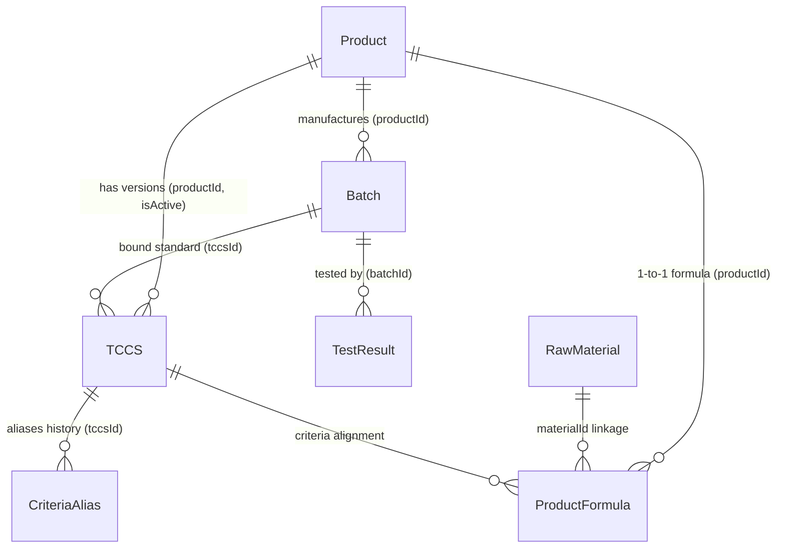

# ?? T?NG QUAN TO�N DI?N H? TH?NG PQM (PRODUCT QUALITY MANAGEMENT)
> **Phiên bản tài liệu:** 3.0.0-final  
> **Cập nhật lần cuối:** 2026-09-09  
> **D? �n:** H? th?ng Qu?n l� Ch?t lu?ng S?n ph?m & Ki?m nghi?m (PQM)

---

## ?? 0. QUY T?C C?T L�I D�NH CHO AI ASSISTANT (B?T BU?C TU�N TH?)
1. **Qu�t file n�y d?u ti�n**: M?i khi b?t d?u m?t phi�n l�m vi?c, AI ph?i n?m to�n b? ki?n tr�c, m� h�nh d? li?u, ph�n h? ch?c nang v� lu?ng tri?n khai trong file n�y.
2. **T? d?ng c?p nh?t**: M?i khi c� b?t k? thay d?i n�o trong d? �n (th�m component, s?a logic, th�m route, d?i schema d? li?u, th�m AI tool, v.v.), AI **B?T BU?C** ph?i c?p nh?t l?i file n�y ngay sau khi ho�n th�nh nhi?m v? d? ph?n �nh tr?ng th�i m?i nh?t c?a ?ng d?ng.
3. **Nh?t k� thay d?i (Changelog)**: Ghi l?i t�m t?t n?i dung v?a c?p nh?t ? ph?n cu?i t�i li?u k�m ng�y th�ng.

---

## 1. GI?I THI?U V� M?C TI�U D? �N
**PQM (Product Quality Management)** l� h? th?ng qu?n l� ch?t lu?ng chuy�n s�u d�nh cho ng�nh s?n xu?t y t? / du?c ph?m / c�ng ngh? sinh h?c (V-Biotech). 

### M?c ti�u ch�nh:
- Qu?n l� to�n di?n v�ng d?i s?n ph?m: t? H? so s?n ph?m, Ti�u chu?n co s? (TCCS), C�ng th?c d?nh lu?ng, Nguy�n li?u, L� s?n xu?t d?n Phi?u ki?m nghi?m (Test Results).
- T? d?ng h�a d�nh gi� �?t/Kh�ng �?t theo ti�u chu?n k? thu?t (d?nh lu?ng ho?t ch?t, ch? ti�u an to�n, vi sinh, c?m quan).
- Xu?t phi?u ph�n t�ch th�nh ph?m (Certificate of Analysis - CoA) chu?n h�a c� m� QR x�c th?c.
- Ph�n t�ch xu hu?ng ch?t lu?ng (Trend Analysis), c?nh b�o s?m c�c b?t thu?ng (Quality Alerts).
- **H? th?ng Ki?m so�t & H�n g?n To�n v?n D? li?u (Data Consistency & Auto-Healing Engine)**: T? d?ng r� so�t 6 nh�m to�n v?n li�n k?t th?c th? (b?n ghi m? c�i, sai l?ch li�n k?t ch�o, b?t nh?t qu�n logic, m?t li�n k?t nguy�n li?u, l?ch c�ng th?c - TCCS, tr�ng m�) v� cung c?p co ch? Auto-Heal 1-click.
- **Unified Entity Relationship Graph (`useDataGraph.ts`)**: M?ng lu?i li�n k?t 2 chi?u ho�n ch?nh cho to�n b? 7 th?c th? d? li?u trong h? th?ng.
- T�ch h?p **AI Th�ng minh da c?p d? (Gemini 2.5/2.0)**: T? d?ng qu�t OCR k?t qu? ki?m nghi?m t? PDF nhi?u trang (Canvas Rasterizer & Smart Chunking) / ?nh, t? h?c kh?p n?i ch? ti�u (Semantic Mapping & Self-Learning), v� h? tr? truy v?n th�ng minh.
- **H? th?ng ph�m t?t & Command Palette (`Ctrl+K`)**: T�m ki?m t?c th� v� di?u hu?ng si�u t?c tr�n to�n b? h? th?ng.

---

## 2. KI?N TR�C C�NG NGH? & M�I TRU?NG TRI?N KHAI

### 2.1. Tech Stack
- **Frontend Core**: React 19, TypeScript (~5.8), Vite (v6), TailwindCSS v3.
- **State Management**: Zustand (t�ch bi?t `useAppStore` cho d? li?u nghi?p v? & `useUIStore` cho giao di?n/preferences).
- **Graph & Consistency Layer**: `useDataGraph` (Full 2-Way Hydration Graph) & `dataConsistencyService` (Audit & Auto-Heal).
- **Backend / BaaS**: Firebase Realtime Database (RTDB), Firebase Authentication, Firebase Storage.
- **Tr� tu? nh�n t?o (AI)**: Google Generative AI SDK (`@google/generative-ai` - Gemini 2.5 Flash/Pro, Gemini 2.0 Flash).
- **X? l� PDF client-side**: `pdfjs-dist` (Render PDF nhi?u trang sang ?nh JPEG Canvas t?i uu dung lu?ng).
- **Tr?c quan h�a & B�o c�o**: Recharts (Bi?u d? xu hu?ng, ph�n b?), QRCode React, SheetJS/XLSX (Xu?t Excel).
- **Ki?m th?**: Vitest (Unit Test - 123 tests passed 100% across 22 test suites), Playwright (E2E Test - 6 tests passed 100% across 4 test suites).
- **CI/CD T? d?ng h�a**: GitHub Actions Pipeline 3 c�ng do?n (`.github/workflows/ci-cd.yml`): Unit Test (Vitest) -> E2E Test (Playwright) -> Build & Deploy Firebase Hosting.

### 2.2. Ki?n tr�c Tri?n khai (Deployment Rules)
- **M�i tru?ng S?n xu?t**: Firebase Hosting (`https://v-biotech.web.app`) | Project ID: `v-biotech`.
- **C?u h�nh Base URL**: 
  - Khi build Firebase: `base = '/'` (ph?c v? t? root).
  - Khi ch?y local: `base = './'`.
- **GitHub**: Ch? d�ng d? **sao luu m� ngu?n**. Kh�ng d�ng GitHub Pages.
- **Quy tr�nh Deploy chu?n**:
  ```bash
  npm run build
  npx firebase deploy --only hosting
  # Ho?c d�ng script: npm run deploy
  ```

---

## 3. M� H�NH D? LI?U & SCHEMA (DATA ARCHITECTURE)

D? li?u du?c luu tr? tr�n Firebase Realtime Database v?i c?u tr�c JSON t?i uu v� d? th? li�n k?t ch?t ch?:



### 3.1. Chi ti?t c�c Th?c th? (Entities):
1. **Product (`products/`)**:
   - `id`, `code`, `name`, `group`, `registrationNo`, `registrationDate`, `registrant`, `status` (`ACTIVE` | `DISCONTINUED` | `RECALLED`), `description`, `imageUrl`.
2. **TCCS - Ti�u chu?n co s? (`tccsList/`)**:
   - `id`, `productId`, `code`, `issueDate`, `isActive`, `packaging`, `storage`, `shelfLife`, `standardRefs`.
   - `mainQualityCriteria`: Danh s�ch ch? ti�u ch?t lu?ng ch�nh (T�n, �on v?, Min, Max, Ki?u `NUMBER`/`TEXT`, `declaredContent`, `calculationBasis`).
   - `safetyCriteria`: Danh s�ch ch? ti�u an to�n (vi sinh, kim lo?i n?ng...).
   - `alternateRules`: Quy t?c ki?m tra b? sung / ki?m tra l?i khi kh�ng d?t (`FAIL_RETRY`, `CONDITIONAL_CHECK`).
3. **ProductFormula - C�ng th?c s?n ph?m (`productFormulas/`)**:
   - `id`, `productId`, `ingredients` (H�m lu?ng c�ng b?, h�m lu?ng nguy�n t?, li�n k?t `materialId`), `excipients` (T� du?c), `sensory`, `packaging`, `storage`, `shelfLife`.
4. **RawMaterial - Danh m?c nguy�n li?u (`rawMaterials/`)**:
   - `id`, `code` (m� qu?n l� nguy�n li?u n?i b?: `NL-GINKGO-01`...), `name` (t�n g?c/chu?n qu?c t?), `aliases` (c�c t�n g?i kh�c, t�n thuong m?i, t�n vi?t t?t), `category` (`ACTIVE` | `EXCIPIENT` | `OTHER`), `standard` (ti�u chu?n �p d?ng: D�VN V, USP, Ph.Eur, BP, TCCS-NSX...), `casNumber` (m� d?nh danh h�a ch?t qu?c t? CAS), `description`.
5. **Batch - L� s?n xu?t (`batches/`)**:
   - `id`, `productId`, `tccsId`, `batchNo`, `mfgDate`, `expDate`, `theoreticalYield`, `actualYield`, `yieldUnit`, `packaging`, `status` (`PENDING` | `TESTING` | `RELEASED` | `REJECTED`), `rejectReason`, `progressPercent`.
6. **TestResult - Phi?u ki?m nghi?m (`testResults/`)**:
   - `id`, `batchId`, `labName`, `testDate`, `overallStatus` (`PASS` | `FAIL`), `notes`, `attachments` (file d�nh k�m Drive/Firebase).
   - `results`: M?ng c�c `TestResultEntry` { `criteriaName`, `value`, `isPass`, `isExtra`, `unit`, `limit` }.
   - *Luu �*: Tru?ng `batch` l� Virtual Join tr�n UI, kh�ng luu th?a v�o RTDB.
7. **CriteriaAlias - �nh x? t�n ch? ti�u (`criteriaAliases/`)**:
   - �?m b?o tuong th�ch ngu?c khi TCCS d?i t�n ch? ti�u m� c�c phi?u ki?m nghi?m cu v?n d?i chi?u ch�nh x�c.
8. **AILearnedMapping (`aiLearnedMappings/`)**:
   - H?c m�y t? ngu?i d�ng: Ghi nh? c�c c?p t�n ch? ti�u vi?t t?t/OCR -> T�n chu?n h? th?ng (`originalName` ? `systemName`, `frequency`).
9. **QualityAnomaly / Alerts**:
   - C?nh b�o tr�i d?t ch?t lu?ng (`DRIFT`), s?p h?t h?n (`EXPIRY`), t? l? l?i cao (`HIGH_FAIL_RATE`), thi?u d? li?u (`MISSING_DATA`).

---

## 4. PH�N QUY?N & X�C TH?C (AUTH & ROLES)

H? th?ng qu?n l� ngu?i d�ng v?i 3 vai tr� ch�nh qua Firebase Auth & RTDB (`users/`):
- **`ADMIN`**: To�n quy?n qu?n tr? h? th?ng, th�m/s?a/x�a s?n ph?m, TCCS, c�ng th?c, duy?t ngu?i d�ng, qu?n l� Criteria Alias, c?u h�nh AI.
- **`USER`**: Nh�n vi�n ki?m nghi?m / QA / QC: Xem d? li?u, t?o v� duy?t phi?u ki?m nghi?m, t?o l� s?n xu?t, xem b�o c�o & CoA.
- **`GUEST`**: T�i kho?n m?i dang k� chua du?c duy?t, ch? c� quy?n truy c?p trang `/welcome`.

---

## 5. C?U TR�C PH�N H? V� ROUTING

H? th?ng du?c t? ch?c th�nh 6 ph�n h? l?n:

| Ph�n h? | Route ch�nh | M� t? ch?c nang |
| :--- | :--- | :--- |
| **Auth** | `/login`, `/signup`, `/forgot-password`, `/welcome`, `/unauthorized` | �ang nh?p, ph�n quy?n, c?p quy?n truy c?p. |
| **Batches** | `/batches`, `/batches/new`, `/batches/:id`, `/batches/:id/edit` | Qu?n l� L� s?n xu?t, ti?n d?, duy?t xu?t xu?ng. |
| **Products** | `/products`, `/products/new`, `/products/:id`, `/materials`, `/product-formulas` | Qu?n l� H? so s?n ph?m, Trung t�m Qu?n l� Nguy�n li?u & Th�nh ph?n (Material Hub 3-Tab), C�ng th?c d?nh lu?ng. |
| **QA / Testing**| `/test-results`, `/test-results/new`, `/test-results/:id/edit`, `/tccs`, `/criteria` | Nh?p k?t qu? ki?m nghi?m (OCR AI), TCCS, Qu?n l� Ch? ti�u & Alias. |
| **Quality Analytics**| `/dashboard`, `/trend-analysis`, `/alerts`, `/quality-summary-report` | Dashboard ph�n t�ch xu hu?ng, SPC, c?nh b�o r?i ro, B�o c�o t?ng h?p. |
| **Public / Reports**| `/test-results/print/:id`, `/verify/:id` | Xem & in ?n CoA chu?n h�a, Trang qu�t m� QR x�c th?c ch?ng ch?. |
| **System** | `/settings`, `/users`, `/audit-logs` | C?u h�nh Google Drive, c�i d?t Model AI, Nh?t k� ki?m to�n (Audit Log). |

---

## 6. H? TH?NG TR� TU? NH�N T?O (AI INTELLIGENCE SUITE 2.0)

H? th?ng AI d?a tr�n Google Gemini v?i 5 c?p d? v� 4 ph�n h? th�ng minh chuy�n s�u cho ng�nh Du?c ph?m/Ki?m nghi?m:

1. **OCR & Extraction (C?p d? 1 � N�ng c?p v1.5.1)**:
   - **X? l� tri?t d? PDF nhi?u trang (Canvas Rasterizer + Smart Chunking)**:
     - T? d?ng chuy?n d?i t?ng trang PDF sang ?nh JPEG t?i uu (1600px, 0.85 quality) b?ng Canvas + `pdfjs-dist`. Gi?m 85% dung lu?ng truy?n t?i.
     - Ph�n do?n th�ng minh (Chunking 3 trang/lu?t cho t�i li?u d�i > 3 trang), lo?i b? 100% nguy co tr�n token, socket timeout ho?c l?i HTTP 500/503 t? Google server.
     - G?p k?t qu? th�ng minh t? c�c d?t qu�t (`testResults`, `notes`, `batchNo`, `labName`...).
   - **Batch Scan**: Upload v� x? l� song song nhi?u file PDF/?nh c�ng l�c (`Promise.all`), hi?n th? `BatchScanProgressModal` per-file.
   - **Streaming Progress**: Callback `onProgress(step, percent)` theo t?ng bu?c x? l� th?c t?, hi?n th? ti?n d? real-time tr�n UI.
   - **Fallback Model**: T? d?ng chuy?n t? `gemini-2.5-flash` ? `gemini-2.0-flash` khi g?p l?i 503/429, k�m exponential backoff (2s?4s?8s).
   - **Prompt OCR n�ng cao**: B? sung 4 guide m?i � `HANDWRITING_GUIDE` (ch? tay, s? nh�e), `MULTI_COLUMN_GUIDE` (phi?u da c?t, nhi?u trang), `WATERMARK_STAMP_GUIDE` (b? qua watermark/con d?u), `VN_LAB_TERMINOLOGY` (nh?n di?n Quatest 3, CASE, Eurofins...).
   - **Schema m? r?ng**: AI tr? v? th�m `pageCount`, `documentType` (External_Lab|Internal|CoA|Supplier_CoA), `notes` (ghi ch� d?c bi?t), `analysisMethod` (HPLC, UV-Vis...) cho t?ng ch? ti�u.
2. **Semantic Mapping & Auto-evaluation (C?p d? 2)**:
   - T? d?ng d?i chi?u t�n ch? ti�u ti?ng Anh/Vi?t qua t? di?n du?c h?c `PHARMA_TERM_DICTIONARY` v� thu?t to�n Dice Coefficient/fuzzy semantic matching (v� d?: *Moisture* -> *�? ?m*).
   - T? d?ng so s�nh v?i Min/Max trong TCCS ho?c c�ng th?c s?n ph?m (�20%) d? g?n c? �?t/Kh�ng �?t.
3. **Self-Learning & Action Agents (C?p d? 3)**:
   - H?c t? ph?n h?i ngu?i d�ng: Khi user s?a mapping, AI t? luu v�o `aiLearnedMappings` d? ghi nh? cho c�c l?n sau.
   - H? tr? AI Tools (`aiTools.ts`): B? sung `compareLabResults`, `predictQualityStability`, `auditDataIntegrity`, `getAIInsights`, `generateOOSInvestigation`.
   - **Auto-Create Batch khi upload phi?u KN**: Khi AI d?c du?c `batchNo` t? phi?u KN nhung l� chua t?n t?i trong h? th?ng, t? d?ng m? `AutoCreateBatchModal` v?i th�ng tin pre-filled. Match s?n ph?m theo th? t? uu ti�n: 1) `productCode` (exact/partial), 2) `productName` (fuzzy). Sau khi user x�c nh?n, t?o l� m?i v?i `status=TESTING` v� g?n ngay v�o phi?u KN.
4. **Active & Autonomous Self-Learning (`autoLearningService.ts` - C?p d? 4)**:
   - **Post-OCR Auto-Learn**: T? d?ng h?c t? c�c �nh x? nh?n di?n th�nh c�ng (high-confidence) ngay khi OCR m� kh�ng c?n ch? ngu?i d�ng can thi?p th? c�ng.
   - **Pattern Mining & Dictionary Suggestion**: Ph�t hi?n c�c c?p �nh x? c� t?n su?t cao ($\ge 3$ l?n) d? g?i � b? sung v�o t? di?n ti�u chu?n.
   - **AI Quality Insight Engine**: T? d?ng ph�n t�ch to�n di?n d? li?u (t? l? l?i theo s?n ph?m, tr�i ch? ti�u qua c�c l�, r?i ro h?n d�ng) d? sinh insight ch? d?ng m?i ng�y (**AI Morning Briefing**).
   - **Contextual Session Memory**: T? d?ng t�m t?t c�c cu?c h?i tho?i tru?c v� duy tr� ng? c?nh li�n phi�n chat theo t?ng User ID.
5. **PQM AI Intelligence Suite 2.0 (4 Ph�n h? AI Chuy�n s�u Chu?n Du?c ph?m/GMP - C?p d? 5)**:
   - **Ph�n h? 1: AI �?i chi?u �a phi?u & Directional Lab Bias Engine (`labComparisonService.ts`, `LabComparisonModal.tsx`)**:
     - So s�nh Side-by-Side 2 phi?u lab (n?i b? vs QUATEST 3 / CASE / NIFC / Eurofins).
     - **Censored Data %RPD Algorithm (ICH Q2 & US EPA Substitution $L/2$)**: X? l� d? li?u ki?m nghi?m du?i ngu?ng ph�t hi?n (`KPH`, `< LOD`, `< LOQ`). $RPD=0\%$ khi c? hai d?u KPH ho?c gi� tr? do $\le LOD$; C?nh b�o b?t thu?ng khi gi� tr? do th?c t? vu?t xa ngu?ng LOD c?a ph�ng ngo?i ki?m.
     - **Directional Lab Bias Engine (`computeLabBias`)**: ��nh gi� khuynh hu?ng sai s? h? th?ng c� d?nh hu?ng (`SOURCE1_HIGHER`, `SOURCE2_HIGHER`, `BALANCED`), t�nh bias ratio % v� m?c d? tin c?y (Confidence Level), t? d?ng xu?t khuy?n ngh? h�nh d?ng th?c ch?ng cho ph�ng �?m b?o Ch?t lu?ng (QA).
     - **Lab Comparison Modal UI**: Th? Lab Bias Overview tr?c quan v?i thanh do t? l? sai l?ch, huy hi?u phuong ph�p th? v� ngu?ng ph�t hi?n KPH/LOD cho t?ng ch? ti�u.
   - **Ph�n h? 2: Tr? l� Nh?p li?u Gi?ng n�i Voice-to-Data (`voiceParserService.ts`, `VoiceInputButton.tsx`)**: Nh?n di?n gi?ng n�i ti?ng Vi?t, t? d?ng chu?n h�a s? do du?c h?c v� di?n b?ng k?t qu?.
   - **Ph�n h? 3: D? b�o �?ng h?c Suy gi?m & H?n d�ng s?m (`stabilityPredictionService.ts`, `TrendAnalysisPage.tsx`)**: Ph�n t�ch suy gi?m ICH Q1A, t�nh $k$, $R^2$, u?c t�nh th?i di?m ch?m Min spec ($t_{90}$) v� c?nh b�o h?t h?n s?m.
   - **Ph�n h? 4: AI Gi�m s�t To�n v?n D? li?u ALCOA+ (`dataIntegrityService.ts`)**: Qu�t Audit Trail, ph�t hi?n s?a d?i nhi?u l?n, thao t�c ngo�i gi?, t�nh di?m Data Integrity Score (0-100).
6. **PQM End-to-End AI Copilot & Embedded Intelligence (G?n k?t AI To�n di?n - C?p d? 6)**:
   - **Context-Aware Floating AI Copilot ([AIAssistantChat.tsx](file:///D:/26%20Kiem%20nghiem/PQM/src/components/features/AIAssistantChat.tsx))**: T? d?ng nh?n di?n trang & th?c th? hi?n t?i (`/batches/:id`, `/products/:id`, `/tccs`, `/quality-summary-report`, `/audit-logs`) d? sinh c�c n�t t�c v? nhanh (Contextual Prompt Chips) v� n?p ng? c?nh v�o c�u tr? l?i c?a AI.
   - **AI Batch Quality Clearance Dossier ([batchClearanceService.ts](file:///D:/26%20Kiem%20nghiem/PQM/src/services/ai/batchClearanceService.ts), [AIBatchClearanceModal.tsx](file:///D:/26%20Kiem%20nghiem/PQM/src/components/features/AIBatchClearanceModal.tsx))**: T? d?ng gom d? li?u (k?t qu? ki?m nghi?m, ti?n d? TCCS, nguy co ti?m c?n ngu?ng, l?ch s? l�, audit trail) d? dua ra khuy?n ngh? duy?t xu?t xu?ng (**RELEASE**), duy?t c� di?u ki?n (**CONDITIONAL**) ho?c t?m gi? di?u tra (**HOLD**).
   - **AI TCCS Validator & Formulator ([tccsAssistantService.ts](file:///D:/26%20Kiem%20nghiem/PQM/src/services/ai/tccsAssistantService.ts), [TCCSFormPage.tsx](file:///D:/26%20Kiem%20nghiem/PQM/src/pages/qa/TCCSFormPage.tsx))**: G?i � danh m?c ch? ti�u theo Du?c di?n VN V / USP (vi�n n�n, nang, siro, c?m, thu?c ti�m...) v� t? d?ng d?ng b? kho?ng d?nh lu?ng $\pm 5\% / \pm 10\% / \pm 20\%$ t? c�ng th?c s?n ph?m, k�m c?nh b�o m�u thu?n th?i gian th?c.
   - **AI PQR / APR Narrative Generator ([pqrNarrativeService.ts](file:///D:/26%20Kiem%20nghiem/PQM/src/services/ai/pqrNarrativeService.ts), [QualitySummaryReport.tsx](file:///D:/26%20Kiem%20nghiem/PQM/src/pages/quality/QualitySummaryReport.tsx))**: T? d?ng so?n th?o ph?n *Nh?n x�t & ��nh gi� T?ng th? Ch?t lu?ng (Executive Quality Conclusion)* chu?n GMP g?m 4 ph?n chuy�n m�n d? xu?t b�o c�o PQR/APR.
   - **ALCOA+ Data Integrity Watchdog Widget ([ALCOAWatchdogWidget.tsx](file:///D:/26%20Kiem%20nghiem/PQM/src/components/features/ALCOAWatchdogWidget.tsx), [AuditLogPage.tsx](file:///D:/26%20Kiem%20nghiem/PQM/src/pages/system/AuditLogPage.tsx))**: Nh�ng tr?c ti?p b?ng di?m Data Integrity Score (0-100), ph�n r� 6 nguy�n t?c ALCOA+ v� danh s�ch c?nh b�o vi ph?m th?i gian th?c l�n d?u trang Audit Log.
7. **PQM Predictive & Proactive AI Engine (AI Ch? d?ng & D? b�o Tuong lai - C?p d? 7)**:
   - **Ph�n h? 1: AI Natural Language Query Engine ([nlQueryService.ts](file:///D:/26%20Kiem%20nghiem/PQM/src/services/ai/nlQueryService.ts), tool `queryDataNaturalLanguage`)**: Truy v?n d? li?u to�n h? th?ng b?ng ti?ng Vi?t t? nhi�n.
   - **Ph�n h? 2: AI Smart Deviation Report Generator ([deviationReportService.ts](file:///D:/26%20Kiem%20nghiem/PQM/src/services/ai/deviationReportService.ts), [DeviationReportModal.tsx](file:///D:/26%20Kiem%20nghiem/PQM/src/components/features/DeviationReportModal.tsx), tool `generateDeviationReport`)**: T? d?ng sinh b�o c�o sai l?ch chu?n GMP-WHO/FDA d?y d? 6 ph?n.
   - **Ph�n h? 3: AI Proactive Smart Alert Engine ([smartAlertService.ts](file:///D:/26%20Kiem%20nghiem/PQM/src/services/ai/smartAlertService.ts), [AlertsPage.tsx](file:///D:/26%20Kiem%20nghiem/PQM/src/pages/quality/AlertsPage.tsx))**: T? d?ng qu�t v� ph�t hi?n 5 lo?i pattern nguy hi?m.
   - **Ph�n h? 4: AI Batch Genealogy Tracer ([batchGenealogyService.ts](file:///D:/26%20Kiem%20nghiem/PQM/src/services/ai/batchGenealogyService.ts), [BatchGenealogyModal.tsx](file:///D:/26%20Kiem%20nghiem/PQM/src/components/features/BatchGenealogyModal.tsx), [BatchDetailPage.tsx](file:///D:/26%20Kiem%20nghiem/PQM/src/pages/batches/BatchDetailPage.tsx))**: X�y d?ng c�y truy v?t 5 t?ng v� ch?m di?m Traceability Score.
   - **Ph�n h? 5: AI Predictive Incoming Inspection ([predictiveInspectionService.ts](file:///D:/26%20Kiem%20nghiem/PQM/src/services/ai/predictiveInspectionService.ts))**: D? b�o x�c su?t PASS/FAIL tru?c khi ki?m nghi?m.
   - **Ph�n h? 6: AI Material Harmonization & Deduplication Engine ([materialHarmonizerService.ts](file:///D:/26%20Kiem%20nghiem/PQM/src/services/ai/materialHarmonizerService.ts), [MaterialList.tsx](file:///D:/26%20Kiem%20nghiem/PQM/src/pages/products/MaterialList.tsx))**: T? d?ng qu�t v� ph�n t�ch d? tuong d?ng ng? nghia gi?a c�c nguy�n li?u trong danh m?c Master Catalog, ph�t hi?n c�c nguy�n li?u b? t?o tr�ng l?p (v� d?: "Cao kh� B?ch qu?", "Ginkgo Biloba Extract", "Chi?t xu?t b?ch qu?"), d? xu?t k? ho?ch g?p (Merge Plan) gi? 1 t�n chu?n v� chuy?n c�c t�n c�n l?i th�nh Aliases, d?ng th?i t? d?ng c?p nh?t li�n k?t `materialId` cho to�n b? c�c c�ng th?c s?n ph?m li�n quan.

---

## 7. QU?N L� STATE, OFFLINE QUEUE & STORAGE HYGIENE

- **`useAppStore`**: Qu?n l� to�n b? danh s�ch Products, Batches, TCCS, TestResults, RawMaterials, Realtime subscriptions v?i Firebase, phuong th?c th�m/s?a/x�a c� h? tr? Optimistic Update.
- **`useUIStore`**: Qu?n l� Theme (Light/Dark mode), Sidebar collapse, User preferences (luu theo t?ng User ID trong Cookie), �u?ng d?n truy c?p g?n nh?t (`lastVisitedPath`), Material view mode (Grid/List).
- **`offlineMutationQueue.ts` (IndexedDB v4)**: �?m b?o d? b?n v?ng d? li?u khi offline: ghi l?i c�c payload mutation khi m?t m?ng v� t? d?ng **Replay & Flush Queue** l�n Firebase ngay khi c� k?t n?i m?ng tr? l?i.
- **`storageService.ts`**: T? d?ng d?n d?p ?nh s?n ph?m v� file d�nh k�m tr�n Firebase Storage khi th?c hi?n cascade delete s?n ph?m, l� h�ng ho?c phi?u ki?m nghi?m, ngan ng?a ho�n to�n t?p tin m? c�i.

---

## 8. L?NH V?N H�NH & KI?M TH? THU?NG D�NG

```bash
# 1. Kh?i ch?y m�i tru?ng ph�t tri?n (Local Dev)
npm run dev

# 2. Build ?ng d?ng s?n xu?t
npm run build

# 3. Deploy l�n Firebase Hosting
npx firebase deploy --only hosting

# 4. Ch?y Unit Test (Vitest - 264 tests passed 100% across 38 suites)
npm run test -- --run

# 5. Ch?y End-to-End Test (Playwright)
npm run test:e2e
```

---

## 9. NHAT KY CAP NHAT DU AN (PROJECT CHANGELOG)

> Lich su day du (tat ca phien ban tu v1.3.0 tro ve truoc): xem tai [CHANGELOG.md](./CHANGELOG.md)

| Ngay | Phien ban | Noi dung cap nhat tom tat | Nguoi thuc hien |
| :--- | :---: | :--- | :--- |
| **2026-09-09** | `2.5.3` | **Phan ra useAppStore thanh Modular Slices (TASK-003)**: Tieu bien God Store (~800 dong) thanh 6 domain slices doc lap (`authSlice`, `systemSlice`, `productSlice`, `batchSlice`, `testResultSlice`, `tccsSlice`) trong `src/store/slices/`; trich xuat `storeHelpers.ts` quan ly mutation offline va chuan hoa cong thuc; bo sung cac selector hooks chuyen biet (`useAppAuth`, `useAppProducts`, `useAppBatches`, v.v.); viet unit test bao phu cac slice. Toan bo 264/264 unit tests (38 suites) va Playwright E2E passed. Build 2443 modules thanh cong. | AI Pair Programmer |
| **2026-09-09** | `2.5.2` | **Tai cau truc TestResultFormPage Modularization (TASK-002)**: Chia nho God Component tu 1.610 dong xuong con ~300 dong bang cach tach thanh 7 specialized sub-components (`TestResultHeader`, `BatchLabSelector`, `TccsCriteriaSection`, `ExtraCriteriaSection`, `AttachmentSection`, `GDFileSelectorModal`, `BatchScanProgressModal`) va custom hook `useTestResultAIIntegration`. Toan bo 257 unit tests va Playwright E2E tests deu passed. Build 2436 modules thanh cong. | AI Pair Programmer |
| **2026-09-08** | `2.5.1` | **Hoan thien Lab Bias Detail UI & Toi uu CI/CD**: [ENHANCE] LabComparisonModal.tsx - thay banner don gian bang Lab Bias Detail Card day du: Directional Bias Bar (phan bo huong do), meanBiasPercent, potentialCauses & actionRecommendations; [ENHANCE] playwright.config.ts - screenshot/video on-failure, github reporter cho CI; 123/123 Unit Tests passed, Build 2402 modules. | AI Pair Programmer |
| **2026-09-07** | `2.5.0` | **Toi uu Do tin cay AI & Don dep Tai lieu**: [NEW] generateStructuredJson<T>() helper enforce JSON Schema cung qua responseSchema - loai bo 100% rui ro JSON.parse thu cong; Migrate batchClearanceService + pqrNarrativeService sang Structured Outputs; [NEW] tesseractFallback.ts OCR offline (Tesseract.js lazy-load) khi Gemini API khong kha dung; Tach CHANGELOG.md rieng; Xoa ban ghi trung v1.5.0/v1.4.0. | AI Pair Programmer |
| **2026-09-05** | `2.4.2` | **Ra soat Toan dien Ma nguon & Hieu chinh Phan quyen**: [DELETE] RawMaterialCatalog.tsx; [FIX] Circular Import testResultEvaluation.ts; [FIX] Phan quyen Route Batches & TestResults theo nghiep vu thuc te. | AI Pair Programmer |
| **2026-09-05** | `2.4.1` | **Khac phuc Firebase Security Rules & Form Lo hang**: [CRITICAL FIX] Bo newData.exists() chan cascade delete; [BUG FIX] Duplicate Audit Log trong BatchFormPage; [ENHANCEMENT] Bo sung field yield/packaging vao Form Lo. | AI Pair Programmer |
| **2026-09-03** | `2.4.0` | **PQM AI Super-Engine 3.0**: 6 Action Tools cho AI Copilot; Stability Kinetics; Auto-Healing Engine. 116/116 tests passed. | AI Pair Programmer |