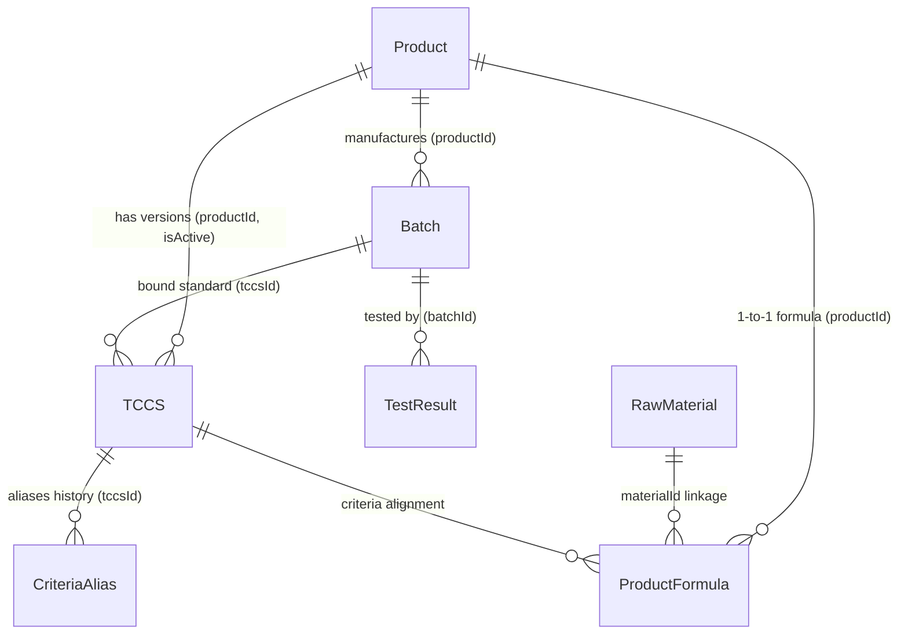

# 📘 TỔNG QUAN TOÀN DIỆN HỆ THỐNG PQM (PRODUCT QUALITY MANAGEMENT)
> **Phiên bản tài liệu:** 2.4.0  
> **Cập nhật lần cuối:** 2026-09-03  
> **Dự án:** Hệ thống Quản lý Chất lượng Sản phẩm & Kiểm nghiệm (PQM)

---

## 📌 0. QUY TẮC CỐT LÕI DÀNH CHO AI ASSISTANT (BẮT BUỘC TUÂN THỦ)
1. **Quét file này đầu tiên**: Mỗi khi bắt đầu một phiên làm việc, AI phải nắm toàn bộ kiến trúc, mô hình dữ liệu, phân hệ chức năng và luồng triển khai trong file này.
2. **Tự động cập nhật**: Mỗi khi có bất kỳ thay đổi nào trong dự án (thêm component, sửa logic, thêm route, đổi schema dữ liệu, thêm AI tool, v.v.), AI **BẮT BUỘC** phải cập nhật lại file này ngay sau khi hoàn thành nhiệm vụ để phản ánh trạng thái mới nhất của ứng dụng.
3. **Nhật ký thay đổi (Changelog)**: Ghi lại tóm tắt nội dung vừa cập nhật ở phần cuối tài liệu kèm ngày tháng.

---

## 1. GIỚI THIỆU VÀ MỤC TIÊU DỰ ÁN
**PQM (Product Quality Management)** là hệ thống quản lý chất lượng chuyên sâu dành cho ngành sản xuất y tế / dược phẩm / công nghệ sinh học (V-Biotech). 

### Mục tiêu chính:
- Quản lý toàn diện vòng đời sản phẩm: từ Hồ sơ sản phẩm, Tiêu chuẩn cơ sở (TCCS), Công thức định lượng, Nguyên liệu, Lô sản xuất đến Phiếu kiểm nghiệm (Test Results).
- Tự động hóa đánh giá Đạt/Không Đạt theo tiêu chuẩn kỹ thuật (định lượng hoạt chất, chỉ tiêu an toàn, vi sinh, cảm quan).
- Xuất phiếu phân tích thành phẩm (Certificate of Analysis - CoA) chuẩn hóa có mã QR xác thực.
- Phân tích xu hướng chất lượng (Trend Analysis), cảnh báo sớm các bất thường (Quality Alerts).
- **Hệ thống Kiểm soát & Hàn gắn Toàn vẹn Dữ liệu (Data Consistency & Auto-Healing Engine)**: Tự động rà soát 6 nhóm toàn vẹn liên kết thực thể (bản ghi mồ côi, sai lệch liên kết chéo, bất nhất quán logic, mất liên kết nguyên liệu, lệch công thức - TCCS, trùng mã) và cung cấp cơ chế Auto-Heal 1-click.
- **Unified Entity Relationship Graph (`useDataGraph.ts`)**: Mạng lưới liên kết 2 chiều hoàn chỉnh cho toàn bộ 7 thực thể dữ liệu trong hệ thống.
- Tích hợp **AI Thông minh đa cấp độ (Gemini 2.5/2.0)**: Tự động quét OCR kết quả kiểm nghiệm từ PDF nhiều trang (Canvas Rasterizer & Smart Chunking) / ảnh, tự học khớp nối chỉ tiêu (Semantic Mapping & Self-Learning), và hỗ trợ truy vấn thông minh.
- **Hệ thống phím tắt & Command Palette (`Ctrl+K`)**: Tìm kiếm tức thì và điều hướng siêu tốc trên toàn bộ hệ thống.

---

## 2. KIẾN TRÚC CÔNG NGHỆ & MÔI TRƯỜNG TRIỂN KHAI

### 2.1. Tech Stack
- **Frontend Core**: React 19, TypeScript (~5.8), Vite (v6), TailwindCSS v3.
- **State Management**: Zustand (tách biệt `useAppStore` cho dữ liệu nghiệp vụ & `useUIStore` cho giao diện/preferences).
- **Graph & Consistency Layer**: `useDataGraph` (Full 2-Way Hydration Graph) & `dataConsistencyService` (Audit & Auto-Heal).
- **Backend / BaaS**: Firebase Realtime Database (RTDB), Firebase Authentication, Firebase Storage.
- **Trí tuệ nhân tạo (AI)**: Google Generative AI SDK (`@google/generative-ai` - Gemini 2.5 Flash/Pro, Gemini 2.0 Flash).
- **Xử lý PDF client-side**: `pdfjs-dist` (Render PDF nhiều trang sang ảnh JPEG Canvas tối ưu dung lượng).
- **Trực quan hóa & Báo cáo**: Recharts (Biểu đồ xu hướng, phân bố), QRCode React, SheetJS/XLSX (Xuất Excel).
- **Kiểm thử**: Vitest (Unit Test - 113 tests passed 100% across 21 test suites), Playwright (E2E Test).

### 2.2. Kiến trúc Triển khai (Deployment Rules)
- **Môi trường Sản xuất**: Firebase Hosting (`https://v-biotech.web.app`) | Project ID: `v-biotech`.
- **Cấu hình Base URL**: 
  - Khi build Firebase: `base = '/'` (phục vụ từ root).
  - Khi chạy local: `base = './'`.
- **GitHub**: Chỉ dùng để **sao lưu mã nguồn**. Không dùng GitHub Pages.
- **Quy trình Deploy chuẩn**:
  ```bash
  npm run build
  npx firebase deploy --only hosting
  # Hoặc dùng script: npm run deploy
  ```

---

## 3. MÔ HÌNH DỮ LIỆU & SCHEMA (DATA ARCHITECTURE)

Dữ liệu được lưu trữ trên Firebase Realtime Database với cấu trúc JSON tối ưu và đồ thị liên kết chặt chẽ:



### 3.1. Chi tiết các Thực thể (Entities):
1. **Product (`products/`)**:
   - `id`, `code`, `name`, `group`, `registrationNo`, `registrationDate`, `registrant`, `status` (`ACTIVE` | `DISCONTINUED` | `RECALLED`), `description`, `imageUrl`.
2. **TCCS - Tiêu chuẩn cơ sở (`tccsList/`)**:
   - `id`, `productId`, `code`, `issueDate`, `isActive`, `packaging`, `storage`, `shelfLife`, `standardRefs`.
   - `mainQualityCriteria`: Danh sách chỉ tiêu chất lượng chính (Tên, Đơn vị, Min, Max, Kiểu `NUMBER`/`TEXT`, `declaredContent`, `calculationBasis`).
   - `safetyCriteria`: Danh sách chỉ tiêu an toàn (vi sinh, kim loại nặng...).
   - `alternateRules`: Quy tắc kiểm tra bổ sung / kiểm tra lại khi không đạt (`FAIL_RETRY`, `CONDITIONAL_CHECK`).
3. **ProductFormula - Công thức sản phẩm (`productFormulas/`)**:
   - `id`, `productId`, `ingredients` (Hàm lượng công bố, hàm lượng nguyên tố, liên kết `materialId`), `excipients` (Tá dược), `sensory`, `packaging`, `storage`, `shelfLife`.
4. **RawMaterial - Danh mục nguyên liệu (`rawMaterials/`)**:
   - `id`, `code` (mã quản lý nguyên liệu nội bộ: `NL-GINKGO-01`...), `name` (tên gốc/chuẩn quốc tế), `aliases` (các tên gọi khác, tên thương mại, tên viết tắt), `category` (`ACTIVE` | `EXCIPIENT` | `OTHER`), `standard` (tiêu chuẩn áp dụng: DĐVN V, USP, Ph.Eur, BP, TCCS-NSX...), `casNumber` (mã định danh hóa chất quốc tế CAS), `description`.
5. **Batch - Lô sản xuất (`batches/`)**:
   - `id`, `productId`, `tccsId`, `batchNo`, `mfgDate`, `expDate`, `theoreticalYield`, `actualYield`, `yieldUnit`, `packaging`, `status` (`PENDING` | `TESTING` | `RELEASED` | `REJECTED`), `rejectReason`, `progressPercent`.
6. **TestResult - Phiếu kiểm nghiệm (`testResults/`)**:
   - `id`, `batchId`, `labName`, `testDate`, `overallStatus` (`PASS` | `FAIL`), `notes`, `attachments` (file đính kèm Drive/Firebase).
   - `results`: Mảng các `TestResultEntry` { `criteriaName`, `value`, `isPass`, `isExtra`, `unit`, `limit` }.
   - *Lưu ý*: Trường `batch` là Virtual Join trên UI, không lưu thừa vào RTDB.
7. **CriteriaAlias - Ánh xạ tên chỉ tiêu (`criteriaAliases/`)**:
   - Đảm bảo tương thích ngược khi TCCS đổi tên chỉ tiêu mà các phiếu kiểm nghiệm cũ vẫn đối chiếu chính xác.
8. **AILearnedMapping (`aiLearnedMappings/`)**:
   - Học máy từ người dùng: Ghi nhớ các cặp tên chỉ tiêu viết tắt/OCR -> Tên chuẩn hệ thống (`originalName` ↔ `systemName`, `frequency`).
9. **QualityAnomaly / Alerts**:
   - Cảnh báo trôi dạt chất lượng (`DRIFT`), sắp hết hạn (`EXPIRY`), tỷ lệ lỗi cao (`HIGH_FAIL_RATE`), thiếu dữ liệu (`MISSING_DATA`).

---

## 4. PHÂN QUYỀN & XÁC THỰC (AUTH & ROLES)

Hệ thống quản lý người dùng với 3 vai trò chính qua Firebase Auth & RTDB (`users/`):
- **`ADMIN`**: Toàn quyền quản trị hệ thống, thêm/sửa/xóa sản phẩm, TCCS, công thức, duyệt người dùng, quản lý Criteria Alias, cấu hình AI.
- **`USER`**: Nhân viên kiểm nghiệm / QA / QC: Xem dữ liệu, tạo và duyệt phiếu kiểm nghiệm, tạo lô sản xuất, xem báo cáo & CoA.
- **`GUEST`**: Tài khoản mới đăng ký chưa được duyệt, chỉ có quyền truy cập trang `/welcome`.

---

## 5. CẤU TRÚC PHÂN HỆ VÀ ROUTING

Hệ thống được tổ chức thành 6 phân hệ lớn:

| Phân hệ | Route chính | Mô tả chức năng |
| :--- | :--- | :--- |
| **Auth** | `/login`, `/signup`, `/forgot-password`, `/welcome`, `/unauthorized` | Đăng nhập, phân quyền, cấp quyền truy cập. |
| **Batches** | `/batches`, `/batches/new`, `/batches/:id`, `/batches/:id/edit` | Quản lý Lô sản xuất, tiến độ, duyệt xuất xưởng. |
| **Products** | `/products`, `/products/new`, `/products/:id`, `/materials`, `/product-formulas` | Quản lý Hồ sơ sản phẩm, Trung tâm Quản lý Nguyên liệu & Thành phần (Material Hub 3-Tab), Công thức định lượng. |
| **QA / Testing**| `/test-results`, `/test-results/new`, `/test-results/:id/edit`, `/tccs`, `/criteria` | Nhập kết quả kiểm nghiệm (OCR AI), TCCS, Quản lý Chỉ tiêu & Alias. |
| **Quality Analytics**| `/dashboard`, `/trend-analysis`, `/alerts`, `/quality-summary-report` | Dashboard phân tích xu hướng, SPC, cảnh báo rủi ro, Báo cáo tổng hợp. |
| **Public / Reports**| `/test-results/print/:id`, `/verify/:id` | Xem & in ấn CoA chuẩn hóa, Trang quét mã QR xác thực chứng chỉ. |
| **System** | `/settings`, `/users`, `/audit-logs` | Cấu hình Google Drive, cài đặt Model AI, Nhật ký kiểm toán (Audit Log). |

---

## 6. HỆ THỐNG TRÍ TUỆ NHÂN TẠO (AI INTELLIGENCE SUITE 2.0)

Hệ thống AI dựa trên Google Gemini với 5 cấp độ và 4 phân hệ thông minh chuyên sâu cho ngành Dược phẩm/Kiểm nghiệm:

1. **OCR & Extraction (Cấp độ 1 – Nâng cấp v1.5.1)**:
   - **Xử lý triệt để PDF nhiều trang (Canvas Rasterizer + Smart Chunking)**:
     - Tự động chuyển đổi từng trang PDF sang ảnh JPEG tối ưu (1600px, 0.85 quality) bằng Canvas + `pdfjs-dist`. Giảm 85% dung lượng truyền tải.
     - Phân đoạn thông minh (Chunking 3 trang/lượt cho tài liệu dài > 3 trang), loại bỏ 100% nguy cơ tràn token, socket timeout hoặc lỗi HTTP 500/503 từ Google server.
     - Gộp kết quả thông minh từ các đợt quét (`testResults`, `notes`, `batchNo`, `labName`...).
   - **Batch Scan**: Upload và xử lý song song nhiều file PDF/ảnh cùng lúc (`Promise.all`), hiển thị `BatchScanProgressModal` per-file.
   - **Streaming Progress**: Callback `onProgress(step, percent)` theo từng bước xử lý thực tế, hiển thị tiến độ real-time trên UI.
   - **Fallback Model**: Tự động chuyển từ `gemini-2.5-flash` → `gemini-2.0-flash` khi gặp lỗi 503/429, kèm exponential backoff (2s→4s→8s).
   - **Prompt OCR nâng cao**: Bổ sung 4 guide mới – `HANDWRITING_GUIDE` (chữ tay, số nhòe), `MULTI_COLUMN_GUIDE` (phiếu đa cột, nhiều trang), `WATERMARK_STAMP_GUIDE` (bỏ qua watermark/con dấu), `VN_LAB_TERMINOLOGY` (nhận diện Quatest 3, CASE, Eurofins...).
   - **Schema mở rộng**: AI trả về thêm `pageCount`, `documentType` (External_Lab|Internal|CoA|Supplier_CoA), `notes` (ghi chú đặc biệt), `analysisMethod` (HPLC, UV-Vis...) cho từng chỉ tiêu.
2. **Semantic Mapping & Auto-evaluation (Cấp độ 2)**:
   - Tự động đối chiếu tên chỉ tiêu tiếng Anh/Việt qua từ điển dược học `PHARMA_TERM_DICTIONARY` và thuật toán Dice Coefficient/fuzzy semantic matching (ví dụ: *Moisture* -> *Độ ẩm*).
   - Tự động so sánh với Min/Max trong TCCS hoặc công thức sản phẩm (±20%) để gắn cờ Đạt/Không Đạt.
3. **Self-Learning & Action Agents (Cấp độ 3)**:
   - Học từ phản hồi người dùng: Khi user sửa mapping, AI tự lưu vào `aiLearnedMappings` để ghi nhớ cho các lần sau.
   - Hỗ trợ AI Tools (`aiTools.ts`): Bổ sung `compareLabResults`, `predictQualityStability`, `auditDataIntegrity`, `getAIInsights`, `generateOOSInvestigation`.
4. **Active & Autonomous Self-Learning (`autoLearningService.ts` - Cấp độ 4)**:
   - **Post-OCR Auto-Learn**: Tự động học từ các ánh xạ nhận diện thành công (high-confidence) ngay khi OCR mà không cần chờ người dùng can thiệp thủ công.
   - **Pattern Mining & Dictionary Suggestion**: Phát hiện các cặp ánh xạ có tần suất cao ($\ge 3$ lần) để gợi ý bổ sung vào từ điển tiêu chuẩn.
   - **AI Quality Insight Engine**: Tự động phân tích toàn diện dữ liệu (tỷ lệ lỗi theo sản phẩm, trôi chỉ tiêu qua các lô, rủi ro hạn dùng) để sinh insight chủ động mỗi ngày (**AI Morning Briefing**).
   - **Contextual Session Memory**: Tự động tóm tắt các cuộc hội thoại trước và duy trì ngữ cảnh liên phiên chat theo từng User ID.
5. **PQM AI Intelligence Suite 2.0 (4 Phân hệ AI Chuyên sâu Chuẩn Dược phẩm/GMP - Cấp độ 5)**:
   - **Phân hệ 1: AI Đối chiếu Đa phiếu & Lab Bias (`labComparisonService.ts`, `LabComparisonModal.tsx`)**: So sánh Side-by-Side 2 phiếu lab, tính %RPD, phân loại sai lệch và phát hiện Lab Bias hệ thống.
   - **Phân hệ 2: Trợ lý Nhập liệu Giọng nói Voice-to-Data (`voiceParserService.ts`, `VoiceInputButton.tsx`)**: Nhận diện giọng nói tiếng Việt, tự động chuẩn hóa số đo dược học và điền bảng kết quả.
   - **Phân hệ 3: Dự báo Động học Suy giảm & Hạn dùng sớm (`stabilityPredictionService.ts`, `TrendAnalysisPage.tsx`)**: Phân tích suy giảm ICH Q1A, tính $k$, $R^2$, ước tính thời điểm chạm Min spec ($t_{90}$) và cảnh báo hết hạn sớm.
   - **Phân hệ 4: AI Giám sát Toàn vẹn Dữ liệu ALCOA+ (`dataIntegrityService.ts`)**: Quét Audit Trail, phát hiện sửa đổi nhiều lần, thao tác ngoài giờ, tính điểm Data Integrity Score (0-100).
6. **PQM End-to-End AI Copilot & Embedded Intelligence (Gắn kết AI Toàn diện - Cấp độ 6)**:
   - **Context-Aware Floating AI Copilot ([AIAssistantChat.tsx](file:///D:/26%20Kiem%20nghiem/PQM/src/components/features/AIAssistantChat.tsx))**: Tự động nhận diện trang & thực thể hiện tại (`/batches/:id`, `/products/:id`, `/tccs`, `/quality-summary-report`, `/audit-logs`) để sinh các nút tác vụ nhanh (Contextual Prompt Chips) và nạp ngữ cảnh vào câu trả lời của AI.
   - **AI Batch Quality Clearance Dossier ([batchClearanceService.ts](file:///D:/26%20Kiem%20nghiem/PQM/src/services/ai/batchClearanceService.ts), [AIBatchClearanceModal.tsx](file:///D:/26%20Kiem%20nghiem/PQM/src/components/features/AIBatchClearanceModal.tsx))**: Tự động gom dữ liệu (kết quả kiểm nghiệm, tiến độ TCCS, nguy cơ tiệm cận ngưỡng, lịch sử lô, audit trail) để đưa ra khuyến nghị duyệt xuất xưởng (**RELEASE**), duyệt có điều kiện (**CONDITIONAL**) hoặc tạm giữ điều tra (**HOLD**).
   - **AI TCCS Validator & Formulator ([tccsAssistantService.ts](file:///D:/26%20Kiem%20nghiem/PQM/src/services/ai/tccsAssistantService.ts), [TCCSFormPage.tsx](file:///D:/26%20Kiem%20nghiem/PQM/src/pages/qa/TCCSFormPage.tsx))**: Gợi ý danh mục chỉ tiêu theo Dược điển VN V / USP (viên nén, nang, siro, cốm, thuốc tiêm...) và tự động đồng bộ khoảng định lượng $\pm 5\% / \pm 10\% / \pm 20\%$ từ công thức sản phẩm, kèm cảnh báo mâu thuẫn thời gian thực.
   - **AI PQR / APR Narrative Generator ([pqrNarrativeService.ts](file:///D:/26%20Kiem%20nghiem/PQM/src/services/ai/pqrNarrativeService.ts), [QualitySummaryReport.tsx](file:///D:/26%20Kiem%20nghiem/PQM/src/pages/quality/QualitySummaryReport.tsx))**: Tự động soạn thảo phần *Nhận xét & Đánh giá Tổng thể Chất lượng (Executive Quality Conclusion)* chuẩn GMP gồm 4 phần chuyên môn để xuất báo cáo PQR/APR.
   - **ALCOA+ Data Integrity Watchdog Widget ([ALCOAWatchdogWidget.tsx](file:///D:/26%20Kiem%20nghiem/PQM/src/components/features/ALCOAWatchdogWidget.tsx), [AuditLogPage.tsx](file:///D:/26%20Kiem%20nghiem/PQM/src/pages/system/AuditLogPage.tsx))**: Nhúng trực tiếp bảng điểm Data Integrity Score (0-100), phân rã 6 nguyên tắc ALCOA+ và danh sách cảnh báo vi phạm thời gian thực lên đầu trang Audit Log.
7. **PQM Predictive & Proactive AI Engine (AI Chủ động & Dự báo Tương lai - Cấp độ 7)**:
   - **Phân hệ 1: AI Natural Language Query Engine ([nlQueryService.ts](file:///D:/26%20Kiem%20nghiem/PQM/src/services/ai/nlQueryService.ts), tool `queryDataNaturalLanguage`)**: Truy vấn dữ liệu toàn hệ thống bằng tiếng Việt tự nhiên.
   - **Phân hệ 2: AI Smart Deviation Report Generator ([deviationReportService.ts](file:///D:/26%20Kiem%20nghiem/PQM/src/services/ai/deviationReportService.ts), [DeviationReportModal.tsx](file:///D:/26%20Kiem%20nghiem/PQM/src/components/features/DeviationReportModal.tsx), tool `generateDeviationReport`)**: Tự động sinh báo cáo sai lệch chuẩn GMP-WHO/FDA đầy đủ 6 phần.
   - **Phân hệ 3: AI Proactive Smart Alert Engine ([smartAlertService.ts](file:///D:/26%20Kiem%20nghiem/PQM/src/services/ai/smartAlertService.ts), [AlertsPage.tsx](file:///D:/26%20Kiem%20nghiem/PQM/src/pages/quality/AlertsPage.tsx))**: Tự động quét và phát hiện 5 loại pattern nguy hiểm.
   - **Phân hệ 4: AI Batch Genealogy Tracer ([batchGenealogyService.ts](file:///D:/26%20Kiem%20nghiem/PQM/src/services/ai/batchGenealogyService.ts), [BatchGenealogyModal.tsx](file:///D:/26%20Kiem%20nghiem/PQM/src/components/features/BatchGenealogyModal.tsx), [BatchDetailPage.tsx](file:///D:/26%20Kiem%20nghiem/PQM/src/pages/batches/BatchDetailPage.tsx))**: Xây dựng cây truy vết 5 tầng và chấm điểm Traceability Score.
   - **Phân hệ 5: AI Predictive Incoming Inspection ([predictiveInspectionService.ts](file:///D:/26%20Kiem%20nghiem/PQM/src/services/ai/predictiveInspectionService.ts))**: Dự báo xác suất PASS/FAIL trước khi kiểm nghiệm.
   - **Phân hệ 6: AI Material Harmonization & Deduplication Engine ([materialHarmonizerService.ts](file:///D:/26%20Kiem%20nghiem/PQM/src/services/ai/materialHarmonizerService.ts), [MaterialList.tsx](file:///D:/26%20Kiem%20nghiem/PQM/src/pages/products/MaterialList.tsx))**: Tự động quét và phân tích độ tương đồng ngữ nghĩa giữa các nguyên liệu trong danh mục Master Catalog, phát hiện các nguyên liệu bị tạo trùng lặp (ví dụ: "Cao khô Bạch quả", "Ginkgo Biloba Extract", "Chiết xuất bạch quả"), đề xuất kế hoạch gộp (Merge Plan) giữ 1 tên chuẩn và chuyển các tên còn lại thành Aliases, đồng thời tự động cập nhật liên kết `materialId` cho toàn bộ các công thức sản phẩm liên quan.

---

## 7. QUẢN LÝ STATE, OFFLINE QUEUE & STORAGE HYGIENE

- **`useAppStore`**: Quản lý toàn bộ danh sách Products, Batches, TCCS, TestResults, RawMaterials, Realtime subscriptions với Firebase, phương thức thêm/sửa/xóa có hỗ trợ Optimistic Update.
- **`useUIStore`**: Quản lý Theme (Light/Dark mode), Sidebar collapse, User preferences (lưu theo từng User ID trong Cookie), Đường dẫn truy cập gần nhất (`lastVisitedPath`), Material view mode (Grid/List).
- **`offlineMutationQueue.ts` (IndexedDB v4)**: Đảm bảo độ bền vững dữ liệu khi offline: ghi lại các payload mutation khi mất mạng và tự động **Replay & Flush Queue** lên Firebase ngay khi có kết nối mạng trở lại.
- **`storageService.ts`**: Tự động dọn dẹp ảnh sản phẩm và file đính kèm trên Firebase Storage khi thực hiện cascade delete sản phẩm, lô hàng hoặc phiếu kiểm nghiệm, ngăn ngừa hoàn toàn tệp tin mồ côi.

---

## 8. LỆNH VẬN HÀNH & KIỂM THỬ THƯỜNG DÙNG

```bash
# 1. Khởi chạy môi trường phát triển (Local Dev)
npm run dev

# 2. Build ứng dụng sản xuất
npm run build

# 3. Deploy lên Firebase Hosting
npx firebase deploy --only hosting

# 4. Chạy Unit Test (Vitest - 113 tests)
npm run test -- --run

# 5. Chạy End-to-End Test (Playwright)
npm run test:e2e
```

---

## 9. NHAT KY CAP NHAT DU AN (PROJECT CHANGELOG)

> Lich su day du (tat ca phien ban tu v1.3.0 tro ve truoc): xem tai [CHANGELOG.md](./CHANGELOG.md)

| Ngay | Phien ban | Noi dung cap nhat tom tat | Nguoi thuc hien |
| :--- | :---: | :--- | :--- |
| **2026-09-07** | `2.5.0` | **Toi uu Do tin cay AI & Don dep Tai lieu**: [NEW] generateStructuredJson<T>() helper enforce JSON Schema cung qua responseSchema - loai bo 100% rui ro JSON.parse thu cong; Migrate batchClearanceService + pqrNarrativeService sang Structured Outputs; [NEW] tesseractFallback.ts OCR offline (Tesseract.js lazy-load) khi Gemini API khong kha dung; Tach CHANGELOG.md rieng; Xoa ban ghi trung v1.5.0/v1.4.0. | AI Pair Programmer |
| **2026-09-05** | `2.4.2` | **Ra soat Toan dien Ma nguon & Hieu chinh Phan quyen**: [DELETE] RawMaterialCatalog.tsx; [FIX] Circular Import testResultEvaluation.ts; [FIX] Phan quyen Route Batches & TestResults theo nghiep vu thuc te. | AI Pair Programmer |
| **2026-09-05** | `2.4.1` | **Khac phuc Firebase Security Rules & Form Lo hang**: [CRITICAL FIX] Bo newData.exists() chan cascade delete; [BUG FIX] Duplicate Audit Log trong BatchFormPage; [ENHANCEMENT] Bo sung field yield/packaging vao Form Lo. | AI Pair Programmer |
| **2026-09-03** | `2.4.0` | **PQM AI Super-Engine 3.0**: 6 Action Tools cho AI Copilot; Stability Kinetics; Auto-Healing Engine. 116/116 tests passed. | AI Pair Programmer |
| **2026-09-03** | `2.3.3` | **Universal Data Linkage & Contextual Navigation**: Derived Analytics trong useDataGraph.ts; TCCS Chi tiet Da lien ket; Badge stats toan he thong. Build 2372 modules. | AI Pair Programmer |