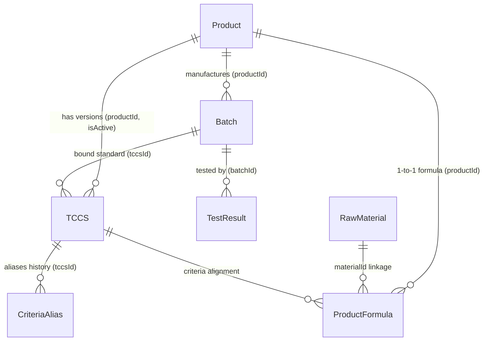

# ?? T?NG QUAN TOÀN DI?N H? TH?NG PQM (PRODUCT QUALITY MANAGEMENT)
> **Phiên b?n tài li?u:** 2.5.1  
> **C?p nh?t l?n cu?i:** 2026-09-08  
> **D? án:** H? th?ng Qu?n lý Ch?t lu?ng S?n ph?m & Ki?m nghi?m (PQM)

---

## ?? 0. QUY T?C C?T LÕI DÀNH CHO AI ASSISTANT (B?T BU?C TUÂN TH?)
1. **Quét file này d?u tiên**: M?i khi b?t d?u m?t phiên làm vi?c, AI ph?i n?m toàn b? ki?n trúc, mô hình d? li?u, phân h? ch?c nang và lu?ng tri?n khai trong file này.
2. **T? d?ng c?p nh?t**: M?i khi có b?t k? thay d?i nào trong d? án (thêm component, s?a logic, thêm route, d?i schema d? li?u, thêm AI tool, v.v.), AI **B?T BU?C** ph?i c?p nh?t l?i file này ngay sau khi hoàn thành nhi?m v? d? ph?n ánh tr?ng thái m?i nh?t c?a ?ng d?ng.
3. **Nh?t ký thay d?i (Changelog)**: Ghi l?i tóm t?t n?i dung v?a c?p nh?t ? ph?n cu?i tài li?u kèm ngày tháng.

---

## 1. GI?I THI?U VÀ M?C TIÊU D? ÁN
**PQM (Product Quality Management)** là h? th?ng qu?n lý ch?t lu?ng chuyên sâu dành cho ngành s?n xu?t y t? / du?c ph?m / công ngh? sinh h?c (V-Biotech). 

### M?c tiêu chính:
- Qu?n lý toàn di?n vòng d?i s?n ph?m: t? H? so s?n ph?m, Tiêu chu?n co s? (TCCS), Công th?c d?nh lu?ng, Nguyên li?u, Lô s?n xu?t d?n Phi?u ki?m nghi?m (Test Results).
- T? d?ng hóa dánh giá Ð?t/Không Ð?t theo tiêu chu?n k? thu?t (d?nh lu?ng ho?t ch?t, ch? tiêu an toàn, vi sinh, c?m quan).
- Xu?t phi?u phân tích thành ph?m (Certificate of Analysis - CoA) chu?n hóa có mã QR xác th?c.
- Phân tích xu hu?ng ch?t lu?ng (Trend Analysis), c?nh báo s?m các b?t thu?ng (Quality Alerts).
- **H? th?ng Ki?m soát & Hàn g?n Toàn v?n D? li?u (Data Consistency & Auto-Healing Engine)**: T? d?ng rà soát 6 nhóm toàn v?n liên k?t th?c th? (b?n ghi m? côi, sai l?ch liên k?t chéo, b?t nh?t quán logic, m?t liên k?t nguyên li?u, l?ch công th?c - TCCS, trùng mã) và cung c?p co ch? Auto-Heal 1-click.
- **Unified Entity Relationship Graph (`useDataGraph.ts`)**: M?ng lu?i liên k?t 2 chi?u hoàn ch?nh cho toàn b? 7 th?c th? d? li?u trong h? th?ng.
- Tích h?p **AI Thông minh da c?p d? (Gemini 2.5/2.0)**: T? d?ng quét OCR k?t qu? ki?m nghi?m t? PDF nhi?u trang (Canvas Rasterizer & Smart Chunking) / ?nh, t? h?c kh?p n?i ch? tiêu (Semantic Mapping & Self-Learning), và h? tr? truy v?n thông minh.
- **H? th?ng phím t?t & Command Palette (`Ctrl+K`)**: Tìm ki?m t?c thì và di?u hu?ng siêu t?c trên toàn b? h? th?ng.

---

## 2. KI?N TRÚC CÔNG NGH? & MÔI TRU?NG TRI?N KHAI

### 2.1. Tech Stack
- **Frontend Core**: React 19, TypeScript (~5.8), Vite (v6), TailwindCSS v3.
- **State Management**: Zustand (tách bi?t `useAppStore` cho d? li?u nghi?p v? & `useUIStore` cho giao di?n/preferences).
- **Graph & Consistency Layer**: `useDataGraph` (Full 2-Way Hydration Graph) & `dataConsistencyService` (Audit & Auto-Heal).
- **Backend / BaaS**: Firebase Realtime Database (RTDB), Firebase Authentication, Firebase Storage.
- **Trí tu? nhân t?o (AI)**: Google Generative AI SDK (`@google/generative-ai` - Gemini 2.5 Flash/Pro, Gemini 2.0 Flash).
- **X? lý PDF client-side**: `pdfjs-dist` (Render PDF nhi?u trang sang ?nh JPEG Canvas t?i uu dung lu?ng).
- **Tr?c quan hóa & Báo cáo**: Recharts (Bi?u d? xu hu?ng, phân b?), QRCode React, SheetJS/XLSX (Xu?t Excel).
- **Ki?m th?**: Vitest (Unit Test - 123 tests passed 100% across 22 test suites), Playwright (E2E Test - 6 tests passed 100% across 4 test suites).
- **CI/CD T? d?ng hóa**: GitHub Actions Pipeline 3 công do?n (`.github/workflows/ci-cd.yml`): Unit Test (Vitest) -> E2E Test (Playwright) -> Build & Deploy Firebase Hosting.

### 2.2. Ki?n trúc Tri?n khai (Deployment Rules)
- **Môi tru?ng S?n xu?t**: Firebase Hosting (`https://v-biotech.web.app`) | Project ID: `v-biotech`.
- **C?u hình Base URL**: 
  - Khi build Firebase: `base = '/'` (ph?c v? t? root).
  - Khi ch?y local: `base = './'`.
- **GitHub**: Ch? dùng d? **sao luu mã ngu?n**. Không dùng GitHub Pages.
- **Quy trình Deploy chu?n**:
  ```bash
  npm run build
  npx firebase deploy --only hosting
  # Ho?c dùng script: npm run deploy
  ```

---

## 3. MÔ HÌNH D? LI?U & SCHEMA (DATA ARCHITECTURE)

D? li?u du?c luu tr? trên Firebase Realtime Database v?i c?u trúc JSON t?i uu và d? th? liên k?t ch?t ch?:



### 3.1. Chi ti?t các Th?c th? (Entities):
1. **Product (`products/`)**:
   - `id`, `code`, `name`, `group`, `registrationNo`, `registrationDate`, `registrant`, `status` (`ACTIVE` | `DISCONTINUED` | `RECALLED`), `description`, `imageUrl`.
2. **TCCS - Tiêu chu?n co s? (`tccsList/`)**:
   - `id`, `productId`, `code`, `issueDate`, `isActive`, `packaging`, `storage`, `shelfLife`, `standardRefs`.
   - `mainQualityCriteria`: Danh sách ch? tiêu ch?t lu?ng chính (Tên, Ðon v?, Min, Max, Ki?u `NUMBER`/`TEXT`, `declaredContent`, `calculationBasis`).
   - `safetyCriteria`: Danh sách ch? tiêu an toàn (vi sinh, kim lo?i n?ng...).
   - `alternateRules`: Quy t?c ki?m tra b? sung / ki?m tra l?i khi không d?t (`FAIL_RETRY`, `CONDITIONAL_CHECK`).
3. **ProductFormula - Công th?c s?n ph?m (`productFormulas/`)**:
   - `id`, `productId`, `ingredients` (Hàm lu?ng công b?, hàm lu?ng nguyên t?, liên k?t `materialId`), `excipients` (Tá du?c), `sensory`, `packaging`, `storage`, `shelfLife`.
4. **RawMaterial - Danh m?c nguyên li?u (`rawMaterials/`)**:
   - `id`, `code` (mã qu?n lý nguyên li?u n?i b?: `NL-GINKGO-01`...), `name` (tên g?c/chu?n qu?c t?), `aliases` (các tên g?i khác, tên thuong m?i, tên vi?t t?t), `category` (`ACTIVE` | `EXCIPIENT` | `OTHER`), `standard` (tiêu chu?n áp d?ng: DÐVN V, USP, Ph.Eur, BP, TCCS-NSX...), `casNumber` (mã d?nh danh hóa ch?t qu?c t? CAS), `description`.
5. **Batch - Lô s?n xu?t (`batches/`)**:
   - `id`, `productId`, `tccsId`, `batchNo`, `mfgDate`, `expDate`, `theoreticalYield`, `actualYield`, `yieldUnit`, `packaging`, `status` (`PENDING` | `TESTING` | `RELEASED` | `REJECTED`), `rejectReason`, `progressPercent`.
6. **TestResult - Phi?u ki?m nghi?m (`testResults/`)**:
   - `id`, `batchId`, `labName`, `testDate`, `overallStatus` (`PASS` | `FAIL`), `notes`, `attachments` (file dính kèm Drive/Firebase).
   - `results`: M?ng các `TestResultEntry` { `criteriaName`, `value`, `isPass`, `isExtra`, `unit`, `limit` }.
   - *Luu ý*: Tru?ng `batch` là Virtual Join trên UI, không luu th?a vào RTDB.
7. **CriteriaAlias - Ánh x? tên ch? tiêu (`criteriaAliases/`)**:
   - Ð?m b?o tuong thích ngu?c khi TCCS d?i tên ch? tiêu mà các phi?u ki?m nghi?m cu v?n d?i chi?u chính xác.
8. **AILearnedMapping (`aiLearnedMappings/`)**:
   - H?c máy t? ngu?i dùng: Ghi nh? các c?p tên ch? tiêu vi?t t?t/OCR -> Tên chu?n h? th?ng (`originalName` ? `systemName`, `frequency`).
9. **QualityAnomaly / Alerts**:
   - C?nh báo trôi d?t ch?t lu?ng (`DRIFT`), s?p h?t h?n (`EXPIRY`), t? l? l?i cao (`HIGH_FAIL_RATE`), thi?u d? li?u (`MISSING_DATA`).

---

## 4. PHÂN QUY?N & XÁC TH?C (AUTH & ROLES)

H? th?ng qu?n lý ngu?i dùng v?i 3 vai trò chính qua Firebase Auth & RTDB (`users/`):
- **`ADMIN`**: Toàn quy?n qu?n tr? h? th?ng, thêm/s?a/xóa s?n ph?m, TCCS, công th?c, duy?t ngu?i dùng, qu?n lý Criteria Alias, c?u hình AI.
- **`USER`**: Nhân viên ki?m nghi?m / QA / QC: Xem d? li?u, t?o và duy?t phi?u ki?m nghi?m, t?o lô s?n xu?t, xem báo cáo & CoA.
- **`GUEST`**: Tài kho?n m?i dang ký chua du?c duy?t, ch? có quy?n truy c?p trang `/welcome`.

---

## 5. C?U TRÚC PHÂN H? VÀ ROUTING

H? th?ng du?c t? ch?c thành 6 phân h? l?n:

| Phân h? | Route chính | Mô t? ch?c nang |
| :--- | :--- | :--- |
| **Auth** | `/login`, `/signup`, `/forgot-password`, `/welcome`, `/unauthorized` | Ðang nh?p, phân quy?n, c?p quy?n truy c?p. |
| **Batches** | `/batches`, `/batches/new`, `/batches/:id`, `/batches/:id/edit` | Qu?n lý Lô s?n xu?t, ti?n d?, duy?t xu?t xu?ng. |
| **Products** | `/products`, `/products/new`, `/products/:id`, `/materials`, `/product-formulas` | Qu?n lý H? so s?n ph?m, Trung tâm Qu?n lý Nguyên li?u & Thành ph?n (Material Hub 3-Tab), Công th?c d?nh lu?ng. |
| **QA / Testing**| `/test-results`, `/test-results/new`, `/test-results/:id/edit`, `/tccs`, `/criteria` | Nh?p k?t qu? ki?m nghi?m (OCR AI), TCCS, Qu?n lý Ch? tiêu & Alias. |
| **Quality Analytics**| `/dashboard`, `/trend-analysis`, `/alerts`, `/quality-summary-report` | Dashboard phân tích xu hu?ng, SPC, c?nh báo r?i ro, Báo cáo t?ng h?p. |
| **Public / Reports**| `/test-results/print/:id`, `/verify/:id` | Xem & in ?n CoA chu?n hóa, Trang quét mã QR xác th?c ch?ng ch?. |
| **System** | `/settings`, `/users`, `/audit-logs` | C?u hình Google Drive, cài d?t Model AI, Nh?t ký ki?m toán (Audit Log). |

---

## 6. H? TH?NG TRÍ TU? NHÂN T?O (AI INTELLIGENCE SUITE 2.0)

H? th?ng AI d?a trên Google Gemini v?i 5 c?p d? và 4 phân h? thông minh chuyên sâu cho ngành Du?c ph?m/Ki?m nghi?m:

1. **OCR & Extraction (C?p d? 1 – Nâng c?p v1.5.1)**:
   - **X? lý tri?t d? PDF nhi?u trang (Canvas Rasterizer + Smart Chunking)**:
     - T? d?ng chuy?n d?i t?ng trang PDF sang ?nh JPEG t?i uu (1600px, 0.85 quality) b?ng Canvas + `pdfjs-dist`. Gi?m 85% dung lu?ng truy?n t?i.
     - Phân do?n thông minh (Chunking 3 trang/lu?t cho tài li?u dài > 3 trang), lo?i b? 100% nguy co tràn token, socket timeout ho?c l?i HTTP 500/503 t? Google server.
     - G?p k?t qu? thông minh t? các d?t quét (`testResults`, `notes`, `batchNo`, `labName`...).
   - **Batch Scan**: Upload và x? lý song song nhi?u file PDF/?nh cùng lúc (`Promise.all`), hi?n th? `BatchScanProgressModal` per-file.
   - **Streaming Progress**: Callback `onProgress(step, percent)` theo t?ng bu?c x? lý th?c t?, hi?n th? ti?n d? real-time trên UI.
   - **Fallback Model**: T? d?ng chuy?n t? `gemini-2.5-flash` ? `gemini-2.0-flash` khi g?p l?i 503/429, kèm exponential backoff (2s?4s?8s).
   - **Prompt OCR nâng cao**: B? sung 4 guide m?i – `HANDWRITING_GUIDE` (ch? tay, s? nhòe), `MULTI_COLUMN_GUIDE` (phi?u da c?t, nhi?u trang), `WATERMARK_STAMP_GUIDE` (b? qua watermark/con d?u), `VN_LAB_TERMINOLOGY` (nh?n di?n Quatest 3, CASE, Eurofins...).
   - **Schema m? r?ng**: AI tr? v? thêm `pageCount`, `documentType` (External_Lab|Internal|CoA|Supplier_CoA), `notes` (ghi chú d?c bi?t), `analysisMethod` (HPLC, UV-Vis...) cho t?ng ch? tiêu.
2. **Semantic Mapping & Auto-evaluation (C?p d? 2)**:
   - T? d?ng d?i chi?u tên ch? tiêu ti?ng Anh/Vi?t qua t? di?n du?c h?c `PHARMA_TERM_DICTIONARY` và thu?t toán Dice Coefficient/fuzzy semantic matching (ví d?: *Moisture* -> *Ð? ?m*).
   - T? d?ng so sánh v?i Min/Max trong TCCS ho?c công th?c s?n ph?m (±20%) d? g?n c? Ð?t/Không Ð?t.
3. **Self-Learning & Action Agents (C?p d? 3)**:
   - H?c t? ph?n h?i ngu?i dùng: Khi user s?a mapping, AI t? luu vào `aiLearnedMappings` d? ghi nh? cho các l?n sau.
   - H? tr? AI Tools (`aiTools.ts`): B? sung `compareLabResults`, `predictQualityStability`, `auditDataIntegrity`, `getAIInsights`, `generateOOSInvestigation`.
   - **Auto-Create Batch khi upload phi?u KN**: Khi AI d?c du?c `batchNo` t? phi?u KN nhung lô chua t?n t?i trong h? th?ng, t? d?ng m? `AutoCreateBatchModal` v?i thông tin pre-filled. Match s?n ph?m theo th? t? uu tiên: 1) `productCode` (exact/partial), 2) `productName` (fuzzy). Sau khi user xác nh?n, t?o lô m?i v?i `status=TESTING` và g?n ngay vào phi?u KN.
4. **Active & Autonomous Self-Learning (`autoLearningService.ts` - C?p d? 4)**:
   - **Post-OCR Auto-Learn**: T? d?ng h?c t? các ánh x? nh?n di?n thành công (high-confidence) ngay khi OCR mà không c?n ch? ngu?i dùng can thi?p th? công.
   - **Pattern Mining & Dictionary Suggestion**: Phát hi?n các c?p ánh x? có t?n su?t cao ($\ge 3$ l?n) d? g?i ý b? sung vào t? di?n tiêu chu?n.
   - **AI Quality Insight Engine**: T? d?ng phân tích toàn di?n d? li?u (t? l? l?i theo s?n ph?m, trôi ch? tiêu qua các lô, r?i ro h?n dùng) d? sinh insight ch? d?ng m?i ngày (**AI Morning Briefing**).
   - **Contextual Session Memory**: T? d?ng tóm t?t các cu?c h?i tho?i tru?c và duy trì ng? c?nh liên phiên chat theo t?ng User ID.
5. **PQM AI Intelligence Suite 2.0 (4 Phân h? AI Chuyên sâu Chu?n Du?c ph?m/GMP - C?p d? 5)**:
   - **Phân h? 1: AI Ð?i chi?u Ða phi?u & Directional Lab Bias Engine (`labComparisonService.ts`, `LabComparisonModal.tsx`)**:
     - So sánh Side-by-Side 2 phi?u lab (n?i b? vs QUATEST 3 / CASE / NIFC / Eurofins).
     - **Censored Data %RPD Algorithm (ICH Q2 & US EPA Substitution $L/2$)**: X? lý d? li?u ki?m nghi?m du?i ngu?ng phát hi?n (`KPH`, `< LOD`, `< LOQ`). $RPD=0\%$ khi c? hai d?u KPH ho?c giá tr? do $\le LOD$; C?nh báo b?t thu?ng khi giá tr? do th?c t? vu?t xa ngu?ng LOD c?a phòng ngo?i ki?m.
     - **Directional Lab Bias Engine (`computeLabBias`)**: Ðánh giá khuynh hu?ng sai s? h? th?ng có d?nh hu?ng (`SOURCE1_HIGHER`, `SOURCE2_HIGHER`, `BALANCED`), tính bias ratio % và m?c d? tin c?y (Confidence Level), t? d?ng xu?t khuy?n ngh? hành d?ng th?c ch?ng cho phòng Ð?m b?o Ch?t lu?ng (QA).
     - **Lab Comparison Modal UI**: Th? Lab Bias Overview tr?c quan v?i thanh do t? l? sai l?ch, huy hi?u phuong pháp th? và ngu?ng phát hi?n KPH/LOD cho t?ng ch? tiêu.
   - **Phân h? 2: Tr? lý Nh?p li?u Gi?ng nói Voice-to-Data (`voiceParserService.ts`, `VoiceInputButton.tsx`)**: Nh?n di?n gi?ng nói ti?ng Vi?t, t? d?ng chu?n hóa s? do du?c h?c và di?n b?ng k?t qu?.
   - **Phân h? 3: D? báo Ð?ng h?c Suy gi?m & H?n dùng s?m (`stabilityPredictionService.ts`, `TrendAnalysisPage.tsx`)**: Phân tích suy gi?m ICH Q1A, tính $k$, $R^2$, u?c tính th?i di?m ch?m Min spec ($t_{90}$) và c?nh báo h?t h?n s?m.
   - **Phân h? 4: AI Giám sát Toàn v?n D? li?u ALCOA+ (`dataIntegrityService.ts`)**: Quét Audit Trail, phát hi?n s?a d?i nhi?u l?n, thao tác ngoài gi?, tính di?m Data Integrity Score (0-100).
6. **PQM End-to-End AI Copilot & Embedded Intelligence (G?n k?t AI Toàn di?n - C?p d? 6)**:
   - **Context-Aware Floating AI Copilot ([AIAssistantChat.tsx](file:///D:/26%20Kiem%20nghiem/PQM/src/components/features/AIAssistantChat.tsx))**: T? d?ng nh?n di?n trang & th?c th? hi?n t?i (`/batches/:id`, `/products/:id`, `/tccs`, `/quality-summary-report`, `/audit-logs`) d? sinh các nút tác v? nhanh (Contextual Prompt Chips) và n?p ng? c?nh vào câu tr? l?i c?a AI.
   - **AI Batch Quality Clearance Dossier ([batchClearanceService.ts](file:///D:/26%20Kiem%20nghiem/PQM/src/services/ai/batchClearanceService.ts), [AIBatchClearanceModal.tsx](file:///D:/26%20Kiem%20nghiem/PQM/src/components/features/AIBatchClearanceModal.tsx))**: T? d?ng gom d? li?u (k?t qu? ki?m nghi?m, ti?n d? TCCS, nguy co ti?m c?n ngu?ng, l?ch s? lô, audit trail) d? dua ra khuy?n ngh? duy?t xu?t xu?ng (**RELEASE**), duy?t có di?u ki?n (**CONDITIONAL**) ho?c t?m gi? di?u tra (**HOLD**).
   - **AI TCCS Validator & Formulator ([tccsAssistantService.ts](file:///D:/26%20Kiem%20nghiem/PQM/src/services/ai/tccsAssistantService.ts), [TCCSFormPage.tsx](file:///D:/26%20Kiem%20nghiem/PQM/src/pages/qa/TCCSFormPage.tsx))**: G?i ý danh m?c ch? tiêu theo Du?c di?n VN V / USP (viên nén, nang, siro, c?m, thu?c tiêm...) và t? d?ng d?ng b? kho?ng d?nh lu?ng $\pm 5\% / \pm 10\% / \pm 20\%$ t? công th?c s?n ph?m, kèm c?nh báo mâu thu?n th?i gian th?c.
   - **AI PQR / APR Narrative Generator ([pqrNarrativeService.ts](file:///D:/26%20Kiem%20nghiem/PQM/src/services/ai/pqrNarrativeService.ts), [QualitySummaryReport.tsx](file:///D:/26%20Kiem%20nghiem/PQM/src/pages/quality/QualitySummaryReport.tsx))**: T? d?ng so?n th?o ph?n *Nh?n xét & Ðánh giá T?ng th? Ch?t lu?ng (Executive Quality Conclusion)* chu?n GMP g?m 4 ph?n chuyên môn d? xu?t báo cáo PQR/APR.
   - **ALCOA+ Data Integrity Watchdog Widget ([ALCOAWatchdogWidget.tsx](file:///D:/26%20Kiem%20nghiem/PQM/src/components/features/ALCOAWatchdogWidget.tsx), [AuditLogPage.tsx](file:///D:/26%20Kiem%20nghiem/PQM/src/pages/system/AuditLogPage.tsx))**: Nhúng tr?c ti?p b?ng di?m Data Integrity Score (0-100), phân rã 6 nguyên t?c ALCOA+ và danh sách c?nh báo vi ph?m th?i gian th?c lên d?u trang Audit Log.
7. **PQM Predictive & Proactive AI Engine (AI Ch? d?ng & D? báo Tuong lai - C?p d? 7)**:
   - **Phân h? 1: AI Natural Language Query Engine ([nlQueryService.ts](file:///D:/26%20Kiem%20nghiem/PQM/src/services/ai/nlQueryService.ts), tool `queryDataNaturalLanguage`)**: Truy v?n d? li?u toàn h? th?ng b?ng ti?ng Vi?t t? nhiên.
   - **Phân h? 2: AI Smart Deviation Report Generator ([deviationReportService.ts](file:///D:/26%20Kiem%20nghiem/PQM/src/services/ai/deviationReportService.ts), [DeviationReportModal.tsx](file:///D:/26%20Kiem%20nghiem/PQM/src/components/features/DeviationReportModal.tsx), tool `generateDeviationReport`)**: T? d?ng sinh báo cáo sai l?ch chu?n GMP-WHO/FDA d?y d? 6 ph?n.
   - **Phân h? 3: AI Proactive Smart Alert Engine ([smartAlertService.ts](file:///D:/26%20Kiem%20nghiem/PQM/src/services/ai/smartAlertService.ts), [AlertsPage.tsx](file:///D:/26%20Kiem%20nghiem/PQM/src/pages/quality/AlertsPage.tsx))**: T? d?ng quét và phát hi?n 5 lo?i pattern nguy hi?m.
   - **Phân h? 4: AI Batch Genealogy Tracer ([batchGenealogyService.ts](file:///D:/26%20Kiem%20nghiem/PQM/src/services/ai/batchGenealogyService.ts), [BatchGenealogyModal.tsx](file:///D:/26%20Kiem%20nghiem/PQM/src/components/features/BatchGenealogyModal.tsx), [BatchDetailPage.tsx](file:///D:/26%20Kiem%20nghiem/PQM/src/pages/batches/BatchDetailPage.tsx))**: Xây d?ng cây truy v?t 5 t?ng và ch?m di?m Traceability Score.
   - **Phân h? 5: AI Predictive Incoming Inspection ([predictiveInspectionService.ts](file:///D:/26%20Kiem%20nghiem/PQM/src/services/ai/predictiveInspectionService.ts))**: D? báo xác su?t PASS/FAIL tru?c khi ki?m nghi?m.
   - **Phân h? 6: AI Material Harmonization & Deduplication Engine ([materialHarmonizerService.ts](file:///D:/26%20Kiem%20nghiem/PQM/src/services/ai/materialHarmonizerService.ts), [MaterialList.tsx](file:///D:/26%20Kiem%20nghiem/PQM/src/pages/products/MaterialList.tsx))**: T? d?ng quét và phân tích d? tuong d?ng ng? nghia gi?a các nguyên li?u trong danh m?c Master Catalog, phát hi?n các nguyên li?u b? t?o trùng l?p (ví d?: "Cao khô B?ch qu?", "Ginkgo Biloba Extract", "Chi?t xu?t b?ch qu?"), d? xu?t k? ho?ch g?p (Merge Plan) gi? 1 tên chu?n và chuy?n các tên còn l?i thành Aliases, d?ng th?i t? d?ng c?p nh?t liên k?t `materialId` cho toàn b? các công th?c s?n ph?m liên quan.

---

## 7. QU?N LÝ STATE, OFFLINE QUEUE & STORAGE HYGIENE

- **`useAppStore`**: Qu?n lý toàn b? danh sách Products, Batches, TCCS, TestResults, RawMaterials, Realtime subscriptions v?i Firebase, phuong th?c thêm/s?a/xóa có h? tr? Optimistic Update.
- **`useUIStore`**: Qu?n lý Theme (Light/Dark mode), Sidebar collapse, User preferences (luu theo t?ng User ID trong Cookie), Ðu?ng d?n truy c?p g?n nh?t (`lastVisitedPath`), Material view mode (Grid/List).
- **`offlineMutationQueue.ts` (IndexedDB v4)**: Ð?m b?o d? b?n v?ng d? li?u khi offline: ghi l?i các payload mutation khi m?t m?ng và t? d?ng **Replay & Flush Queue** lên Firebase ngay khi có k?t n?i m?ng tr? l?i.
- **`storageService.ts`**: T? d?ng d?n d?p ?nh s?n ph?m và file dính kèm trên Firebase Storage khi th?c hi?n cascade delete s?n ph?m, lô hàng ho?c phi?u ki?m nghi?m, ngan ng?a hoàn toàn t?p tin m? côi.

---

## 8. L?NH V?N HÀNH & KI?M TH? THU?NG DÙNG

```bash
# 1. Kh?i ch?y môi tru?ng phát tri?n (Local Dev)
npm run dev

# 2. Build ?ng d?ng s?n xu?t
npm run build

# 3. Deploy lên Firebase Hosting
npx firebase deploy --only hosting

# 4. Ch?y Unit Test (Vitest - 113 tests)
npm run test -- --run

# 5. Ch?y End-to-End Test (Playwright)
npm run test:e2e
```

---

## 9. NHAT KY CAP NHAT DU AN (PROJECT CHANGELOG)

> Lich su day du (tat ca phien ban tu v1.3.0 tro ve truoc): xem tai [CHANGELOG.md](./CHANGELOG.md)

| Ngay | Phien ban | Noi dung cap nhat tom tat | Nguoi thuc hien |
| :--- | :---: | :--- | :--- |
| **2026-09-08** | `2.5.1` | **Hoan thien Lab Bias Detail UI & Toi uu CI/CD**: [ENHANCE] LabComparisonModal.tsx - thay banner don gian bang Lab Bias Detail Card day du: Directional Bias Bar (phan bo huong do), meanBiasPercent, potentialCauses & actionRecommendations; [ENHANCE] playwright.config.ts - screenshot/video on-failure, github reporter cho CI; 123/123 Unit Tests passed, Build 2402 modules. | AI Pair Programmer |
| **2026-09-07** | `2.5.0` | **Toi uu Do tin cay AI & Don dep Tai lieu**: [NEW] generateStructuredJson<T>() helper enforce JSON Schema cung qua responseSchema - loai bo 100% rui ro JSON.parse thu cong; Migrate batchClearanceService + pqrNarrativeService sang Structured Outputs; [NEW] tesseractFallback.ts OCR offline (Tesseract.js lazy-load) khi Gemini API khong kha dung; Tach CHANGELOG.md rieng; Xoa ban ghi trung v1.5.0/v1.4.0. | AI Pair Programmer |
| **2026-09-05** | `2.4.2` | **Ra soat Toan dien Ma nguon & Hieu chinh Phan quyen**: [DELETE] RawMaterialCatalog.tsx; [FIX] Circular Import testResultEvaluation.ts; [FIX] Phan quyen Route Batches & TestResults theo nghiep vu thuc te. | AI Pair Programmer |
| **2026-09-05** | `2.4.1` | **Khac phuc Firebase Security Rules & Form Lo hang**: [CRITICAL FIX] Bo newData.exists() chan cascade delete; [BUG FIX] Duplicate Audit Log trong BatchFormPage; [ENHANCEMENT] Bo sung field yield/packaging vao Form Lo. | AI Pair Programmer |
| **2026-09-03** | `2.4.0` | **PQM AI Super-Engine 3.0**: 6 Action Tools cho AI Copilot; Stability Kinetics; Auto-Healing Engine. 116/116 tests passed. | AI Pair Programmer |
| **2026-09-03** | `2.3.3` | **Universal Data Linkage & Contextual Navigation**: Derived Analytics trong useDataGraph.ts; TCCS Chi tiet Da lien ket; Badge stats toan he thong. Build 2372 modules. | AI Pair Programmer |