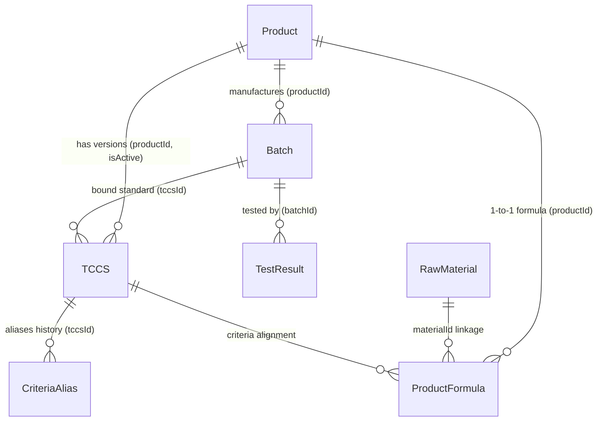

# 📘 TỔNG QUAN TOÀN DIỆN HỆ THỐNG PQM (PRODUCT QUALITY MANAGEMENT)

> **Phiên bản tài liệu:** 5.3.0-PERFORMANCE-CORE  
> **Cập nhật lần cuối:** 2026-09-12  
> **Dự án:** Hệ thống Quản lý Chất lượng Sản phẩm & Kiểm nghiệm (PQM)

---

## 🚨 0. QUY TẮC CỐT LÕI DÀNH CHO AI ASSISTANT (BẮT BUỘC TUÂN THỦ)

1. **Quét file này đầu tiên**: Mỗi khi bắt đầu một phiên làm việc, AI phải nắm toàn bộ kiến trúc, mô hình dữ liệu, phân hệ chức năng và luồng triển khai trong file này.
2. **Tự động cập nhật**: Mỗi khi có bất kỳ thay đổi nào trong dự án (thêm component, sửa logic, thêm route, đổi schema dữ liệu, thêm AI tool, tối ưu performance, v.v.), AI **BẮT BUỘC** phải cập nhật lại file này ngay sau khi hoàn thành nhiệm vụ để phản ánh trạng thái mới nhất của ứng dụng.
3. **Nhật ký thay đổi (Changelog)**: Ghi lại tóm tắt nội dung vừa cập nhật ở phần cuối tài liệu kèm ngày tháng.
4. **Xuất FULL_SOURCE_CODE sau Deploy & Push**: Chạy `npm run export:source` sau mỗi lần deploy Firebase và push Git.

---

## 1. GIỚI THIỆU VÀ MỤC TIÊU DỰ ÁN

**PQM (Product Quality Management)** là hệ thống quản lý chất lượng chuyên sâu dành cho ngành sản xuất y tế / dược phẩm / công nghệ sinh học (V-Biotech).

### Mục tiêu chính:

- Quản lý toàn diện vòng đời sản phẩm: từ Hồ sơ sản phẩm, Tiêu chuẩn cơ sở (TCCS), Công thức định lượng, Nguyên liệu, Lô sản xuất đến Phiếu kiểm nghiệm (Test Results).
- Tự động hóa đánh giá Đạt/Không đạt theo tiêu chuẩn kỹ thuật (định lượng hoạt chất, chỉ tiêu an toàn, vi sinh, cảm quan).
- Xuất phiếu phân tích thành phẩm (Certificate of Analysis - CoA) chuẩn hóa có mã QR xác thực.
- Phân tích xu hướng chất lượng (Trend Analysis), SPC ($C_p, C_{pk}, P_p, P_{pk}$ & 8 quy tắc Nelson), cảnh báo sớm các bất thường (Quality Alerts).
- **Hệ thống Kiểm soát & Hàn gắn Toàn vẹn Dữ liệu (Data Consistency & Auto-Healing Engine)**: Tự động rà soát 6 nhóm toàn vẹn liên kết thực thể và cung cấp cơ chế Auto-Heal 1-click.
- **Unified Entity Relationship Graph (`useDataGraph.ts`)**: Mạng lưới liên kết 2 chiều hoàn chỉnh cho toàn bộ các thực thể dữ liệu trong hệ thống.
- **Hệ thống Phân tích Đa Dược điển Động (`pharmacopoeiaService.ts`)**: Quản lý 31+ tiêu chuẩn DĐVN V, USP, BP trực tiếp trên Firebase RTDB (`pharmacopoeia_standards/`), cho phép QA CRUD động và tích hợp ngữ cảnh vào AI.
- **AI Intelligence Suite 2.0 & Semantic Caching (Gemini 2.5/2.0)**: Tự động quét OCR kết quả kiểm nghiệm từ PDF nhiều trang (Canvas Rasterizer + Smart Chunking), tự học khớp nối chỉ tiêu, truy vấn ngôn ngữ tự nhiên, dự báo động học suy giảm hạn dùng ICH Q1A, thẩm định xuất xưởng lô tự động và bộ nhớ đệm ngữ nghĩa tiết kiệm token API.
- **Hệ thống phím tắt & Command Palette (`Ctrl+K`)**: Tìm kiếm tức thì và điều hướng siêu tốc trên toàn bộ hệ thống.

---

## 2. KIẾN TRÚC CÔNG NGHỆ & MÔI TRƯỜNG TRIỂN KHAI

### 2.1. Tech Stack

- **Frontend Core**: React 19, TypeScript (~5.8), Vite (v6), TailwindCSS v3.
- **Form Management & Validation (v5.3.0)**: `react-hook-form` + `zod` + `@hookform/resolvers` (Uncontrolled state, loại bỏ giật lag khi gõ phím, Schema validation type-safe chặn lỗi trước khi chạm Firebase; hỗ trợ hybrid trong `useForm.ts` và `useZodForm.ts`).
- **Server State Management (v5.3.0)**: `@tanstack/react-query` v5 (`src/lib/queryClient.ts` cấu hình `staleTime: 5m`, `gcTime: 30m`, background deduplication, custom query hooks trong `src/hooks/queries/`).
- **Client & UI State**: Zustand (tách biệt `useAppStore` với 6 modular domain slices cho client cache & `useUIStore` cho giao diện/preferences/theme).
- **Bundle Optimization & Dynamic Imports (v5.3.0)**: Tách chunk Rollup chuyên biệt (`vendor-react`, `vendor-ui`, `vendor-charts`, `vendor-firebase`) và nạp động on-demand cho các thư viện nặng (`xlsx` qua `excelExporter.ts`, `pdfjs-dist` qua `pdfProcessor.ts`, `@google/generative-ai` qua `geminiClientLoader.ts`, `tesseract.js`).
- **AI Semantic Caching (v5.3.0)**: `semanticCacheService.ts` (Multi-tier L1 in-memory + L2 LocalStorage, chuẩn hóa câu hỏi, loại bỏ stop-words, bóc dấu tiếng Việt, so khớp độ tương đồng ngữ nghĩa Dice token $\ge 0.88$, TTL 1 giờ, phản hồi tức thì 50ms và tiết kiệm token Gemini).
- **Git Hooks & Quality Gate (v5.3.0)**: `husky` + `lint-staged` tự động chạy Prettier format, ESLint và `tsc --noEmit` chặn mã lỗi trước khi commit.
- **Backend / BaaS**: Firebase Realtime Database (RTDB), Firebase Authentication, Firebase Storage, Firebase Cloud Functions (Node.js/TypeScript backend cho SPC heavy-compute, Cron auto-heal, Excel generator và DB triggers).
- **Trí tuệ nhân tạo (AI)**: Google Generative AI SDK (`@google/generative-ai` - Gemini 2.5 Flash/Pro, Gemini 2.0 Flash) tích hợp qua `AIGateway.ts` với 17 tool modules độc lập.
- **Xử lý PDF client-side**: `pdfjs-dist` (Render PDF nhiều trang sang ảnh JPEG Canvas tối ưu dung lượng, chunking thông minh).
- **Trực quan hóa & Báo cáo**: Recharts (Biểu đồ xu hướng, phân bố), QRCode React, SheetJS/XLSX (Xuất Excel đa phân hệ).
- **Kiểm thử**: Vitest (Unit Test - 421 tests passed 100% across 67 test suites), Playwright (E2E Test - 6 tests passed 100% across 4 test suites).
- **CI/CD Tự động hóa**: GitHub Actions Pipeline (`.github/workflows/ci-cd.yml`): Unit Test (Vitest) -> E2E Test (Playwright) -> Build & Deploy Firebase Hosting.

### 2.2. Kiến trúc Triển khai (Deployment Rules)

- **Môi trường Sản xuất**: Firebase Hosting (`https://v-biotech.web.app`) | Project ID: `v-biotech`.
- **Cấu hình Base URL**:
  - Khi build Firebase: `base = '/'` (phục vụ từ root).
  - Khi chạy local: `base = './'`.
- **GitHub**: Chỉ dùng để **sao lưu mã nguồn**. Không dùng GitHub Pages.
- **Quy trình Deploy chuẩn**:
  ```bash
  npm run build
  npx firebase deploy --only hosting
  # Hoặc dùng script: npm run deploy
  ```

---

## 3. MÔ HÌNH DỮ LIỆU & SCHEMA (DATA ARCHITECTURE)

Dữ liệu được lưu trữ trên Firebase Realtime Database với cấu trúc JSON tối ưu và đồ thị liên kết chặt chẽ:



### 3.1. Chi tiết các Thực thể (Entities):

1. **Product (`products/`)**:
   - `id`, `code`, `name`, `group`, `registrationNo`, `registrationDate`, `registrant`, `status` (`ACTIVE` | `DISCONTINUED` | `RECALLED`), `description`, `imageUrl`.
2. **TCCS - Tiêu chuẩn cơ sở (`tccsList/`)**:
   - `id`, `productId`, `code`, `issueDate`, `isActive`, `packaging`, `storage`, `shelfLife`, `standardRefs`.
   - `mainQualityCriteria`: Danh sách chỉ tiêu chất lượng chính (Tên, Đơn vị, Min, Max, Kiểu `NUMBER`/`TEXT`, `declaredContent`, `calculationBasis`).
   - `safetyCriteria`: Danh sách chỉ tiêu an toàn (vi sinh, kim loại nặng...).
   - `alternateRules`: Quy tắc kiểm tra bổ sung / kiểm tra lại khi không đạt (`FAIL_RETRY`, `CONDITIONAL_CHECK`).
3. **ProductFormula - Công thức sản phẩm (`productFormulas/`)**:
   - `id`, `productId`, `ingredients` (Hàm lượng công bố, hàm lượng nguyên tố, liên kết `materialId`), `excipients` (Tá dược), `sensory`, `packaging`, `storage`, `shelfLife`.
4. **RawMaterial - Danh mục nguyên liệu (`rawMaterials/`)**:
   - `id`, `code` (mã quản lý nguyên liệu nội bộ: `NL-GINKGO-01`...), `name` (tên gốc/chuẩn quốc tế), `aliases` (các tên gọi khác, tên thương mại, tên viết tắt), `category` (`ACTIVE` | `EXCIPIENT` | `OTHER`), `standard` (tiêu chuẩn áp dụng: DĐVN V, USP, Ph.Eur, BP, TCCS-NSX...), `casNumber` (mã định danh hóa chất quốc tế CAS), `description`.
5. **Batch - Lô sản xuất (`batches/`)**:
   - `id`, `productId`, `tccsId`, `batchNo`, `mfgDate`, `expDate`, `theoreticalYield`, `actualYield`, `yieldUnit`, `packaging`, `status` (`PENDING` | `TESTING` | `RELEASED` | `REJECTED`), `rejectReason`, `progressPercent`.
6. **TestResult - Phiếu kiểm nghiệm (`testResults/`)**:
   - `id`, `batchId`, `labName`, `testDate`, `overallStatus` (`PASS` | `FAIL`), `notes`, `attachments` (file đính kèm Drive/Firebase).
   - `results`: Mảng các `TestResultEntry` { `criteriaName`, `value`, `isPass`, `isExtra`, `unit`, `limit` }.
   - _Lưu ý_: Trường `batch` là Virtual Join trên UI, không lưu thừa vào RTDB.
7. **CriteriaAlias - Ánh xạ tên chỉ tiêu (`criteriaAliases/`)**:
   - Đảm bảo tương thích ngược khi TCCS đổi tên chỉ tiêu mà các phiếu kiểm nghiệm cũ vẫn đối chiếu chính xác.
8. **AILearnedMapping (`aiLearnedMappings/`)**:
   - Học máy từ người dùng: Ghi nhớ các cặp tên chỉ tiêu viết tắt/OCR -> Tên chuẩn hệ thống (`originalName` ➔ `systemName`, `frequency`).
9. **PharmacopoeiaStandard (`pharmacopoeia_standards/`)**:
   - Lưu trữ 31+ quy cách chỉ tiêu DĐVN V, USP, BP động phục vụ kiểm định và gợi ý AI.
10. **SemanticCache (L1 Memory + L2 `localStorage`)**:
    - Bộ nhớ đệm ngữ nghĩa NLP, lưu trữ các truy vấn kèm phản hồi, hash ngữ nghĩa và thời gian hết hạn TTL.

---

## 4. PHÂN QUYỀN & XÁC THỰC (AUTH & ROLES)

Hệ thống quản lý người dùng với cơ chế phân quyền RBAC đa cấp độ chuẩn GMP & ALCOA+ qua Firebase Auth & RTDB (`users/` và `users/admins/`):

- **`ADMIN` (Quản trị viên tối cao)**:
  - **Được thực hiện 100% tất cả các chức năng trong toàn bộ hệ thống**.
  - Cơ chế nhận diện Admin kép (`role === 'ADMIN'` hoặc cờ `isAdmin === true` trong `users/admins/`).
  - Toàn quyền quản trị tài khoản người dùng (phân bổ bất kỳ vai trò nào trong 8 vai trò, xóa tài khoản).
  - Toàn quyền quản lý Master Data: Thêm/sửa/xóa sản phẩm, TCCS, công thức, nguyên liệu, chỉ tiêu & alias, tiêu chuẩn dược điển.
  - Toàn quyền ký duyệt xuất xưởng Lô (Release Batch), từ chối Lô (Reject), sửa Lô trực tiếp từ trang chi tiết hoặc danh sách.
  - Toàn quyền phê duyệt phiếu kiểm nghiệm, ban hành CoA, thẩm định/đóng hồ sơ Sai lệch CAPA và Kiểm soát thay đổi CR.
  - Toàn quyền cấu hình hệ thống, AI model, xem và xuất toàn bộ Audit Trail.
- **`QA` (Quality Assurance)**: Ký duyệt xuất xưởng Lô, ban hành CoA, phê duyệt TCCS/công thức, đóng Sai lệch CAPA & Thay đổi CR.
- **`QC` (Quality Control)**: Soát xét kết quả kiểm nghiệm, cảnh báo OOS, theo dõi xu hướng SPC, in chứng nhận CoA.
- **`LAB` (Kiểm nghiệm viên - Analyst)**: Tạo và nhập kết quả kiểm nghiệm (OCR Canvas AI), đính kèm dữ liệu phân tích.
- **`PRODUCTION` (Sản xuất)**: Đăng ký tạo Lô sản xuất, cập nhật sản lượng thực tế, hạn dùng và quy cách đóng gói.
- **`USER` (Nhân viên nghiệp vụ)**: Tương thích ngược: Được tạo Lô sản xuất và nhập kết quả kiểm nghiệm.
- **`VIEWER` (Quan sát viên / Thanh tra)**: Chỉ xem báo cáo, tra cứu hồ sơ 360° và chứng chỉ CoA (quyền Read-Only).
- **`GUEST` (Khách chờ duyệt)**: Tài khoản mới đăng ký chưa được cấp quyền, chỉ truy cập trang `/welcome`.

---

## 5. CẤU TRÚC PHÂN HỆ VÀ ROUTING

Hệ thống được tổ chức thành 7 phân hệ lớn:

| Phân hệ               | Route chính                                                                                           | Mô tả chức năng                                                                                        |
| :-------------------- | :---------------------------------------------------------------------------------------------------- | :----------------------------------------------------------------------------------------------------- |
| **Auth**              | `/login`, `/signup`, `/forgot-password`, `/welcome`, `/unauthorized`                                  | Đăng nhập, phân quyền, cấp quyền truy cập.                                                             |
| **Batches**           | `/batches`, `/batches/new`, `/batches/:id`, `/batches/:id/edit`, `/batches/360/:id`                   | Quản lý Lô sản xuất, tiến độ, duyệt xuất xưởng, chế độ 360° Hub.                                       |
| **Products**          | `/products`, `/products/new`, `/products/:id`, `/products/360/:id`, `/materials`, `/product-formulas` | Quản lý Hồ sơ sản phẩm, Trung tâm Nguyên liệu & Thành phần (Material Hub 3-Tab), Công thức định lượng. |
| **QA / Testing**      | `/test-results`, `/test-results/new`, `/test-results/:id/edit`, `/tccs`, `/criteria`                  | Nhập kết quả kiểm nghiệm (OCR AI), TCCS, Quản lý Chỉ tiêu & Alias.                                     |
| **Compliance**        | `/deviations`, `/change-control`                                                                      | Quản lý sai lệch CAPA, kiểm soát thay đổi chuẩn GMP-WHO.                                               |
| **Quality Analytics** | `/dashboard`, `/trend-analysis`, `/alerts`, `/quality-summary-report`                                 | Dashboard phân tích xu hướng, SPC ($C_{pk}$), cảnh báo rủi ro, Báo cáo tổng hợp PQR.                   |
| **Public / Reports**  | `/test-results/print/:id`, `/verify/:id`                                                              | Xem & in ấn CoA chuẩn hóa, Trang quét mã QR xác thực chứng chỉ.                                        |
| **System**            | `/settings`, `/users`, `/audit-logs`                                                                  | Cấu hình Google Drive, Dược điển động, cài đặt Model AI, Nhật ký kiểm toán (Audit Log ALCOA+).         |

---

## 6. HỆ THỐNG TRÍ TUỆ NHÂN TẠO (AI INTELLIGENCE SUITE 2.0)

Hệ thống AI dựa trên Google Gemini với 17 tool modules độc lập, kiến trúc đa cấp độ và bộ nhớ đệm ngữ nghĩa Semantic Cache:

1. **OCR & Extraction (Cấp độ 1)**:
   - **Xử lý PDF nhiều trang (Canvas Rasterizer + Smart Chunking)**: Chuyển đổi từng trang PDF sang ảnh JPEG tối ưu (1600px, 0.85 quality) bằng Canvas + `pdfjs-dist` (nạp động on-demand). Phân đoạn thông minh 3 trang/lượt.
   - **Batch Scan & Streaming Progress**: Quét hàng loạt, streaming tiến độ real-time trên UI, tự động chuyển đổi mô hình dự phòng `gemini-2.5-flash` ➔ `gemini-2.0-flash` khi gặp lỗi 429/503.
2. **Semantic Mapping & Auto-evaluation (Cấp độ 2)**:
   - Đối chiếu chỉ tiêu tiếng Anh/Việt qua từ điển `PHARMA_TERM_DICTIONARY` và thuật toán Dice Coefficient/fuzzy semantic matching.
3. **Self-Learning & Action Agents (Cấp độ 3)**:
   - Ghi nhận phản hồi người dùng vào `aiLearnedMappings`.
   - Action Tools chuẩn hóa (`src/services/ai/tools/`): 17 modules chuyên biệt được điều phối qua Gateway.
4. **Active & Autonomous Self-Learning (Cấp độ 4)**:
   - Tự động học từ các ánh xạ nhận diện tin cậy cao; tổng hợp insight chất lượng chủ động (**AI Morning Briefing**).
5. **PQM AI Specialized GMP Modules (Cấp độ 5)**:
   - **Directional Lab Bias Engine**: So sánh song song 2 phiếu kiểm nghiệm, thuật toán Censored Data %RPD ($L/2$), tính chỉ số Bias và khuyến nghị QA.
   - **Voice-to-Data Input**: Nhận diện giọng nói chuẩn hóa vào bảng kiểm nghiệm.
   - **Stability Prediction Engine**: Dự báo suy giảm ICH Q1A, tính $k$, $R^2$ và ước tính hạn dùng sớm ($t_{90}$).
   - **ALCOA+ Data Integrity Watchdog**: Giám sát nhật ký kiểm toán và chấm điểm Data Integrity Score (0-100).
6. **Semantic Caching Engine (`semanticCacheService.ts`)**:
   - **Multi-tier Caching**: L1 RAM + L2 `localStorage` với cơ chế kiểm tra TTL 1 giờ.
   - **Semantic Similarity Matching**: Chuẩn hóa câu hỏi NLP, bóc dấu tiếng Việt, loại bỏ stop words, đo lường độ tương đồng Dice $\ge 0.88$.
   - **Token & Latency Optimization**: Giảm thời gian phản hồi từ 5s xuống 50ms cho các câu hỏi phổ biến, tiết kiệm 100% token Gemini.

---

## 7. QUẢN LÝ STATE, TANSTACK QUERY & DATA HYGIENE

- **TanStack Query (`@tanstack/react-query` v5)**:
  - Quản lý Server State: caching, deduplication, background revalidation.
  - Tích hợp qua các hook chuyên dụng trong `src/hooks/queries/` (`useProductQueries`, `useBatchQueries`, `useTCCSQueries`, `useTestResultQueries`).
  - Cấu hình chuẩn mực: `staleTime: 5 phút`, `gcTime: 30 phút`, `refetchOnWindowFocus: false`.
- **Zustand (`useAppStore` & `useUIStore`)**:
  - `useAppStore`: Phân rã thành 6 modular slices (`authSlice`, `systemSlice`, `productSlice`, `batchSlice`, `testResultSlice`, `tccsSlice`) kết hợp Optimistic Updates.
  - `useUIStore`: Quản lý giao diện, Theme (Dark/Light), Sidebar, Filters, và User Preferences.
- **Form Management (`react-hook-form` + `zod`)**:
  - Chuyển đổi quản lý form sang dạng Uncontrolled Components: `useZodForm.ts` và tích hợp Zod schema trong `useForm.ts`.
  - Định nghĩa Schema type-safe chặt chẽ trong `src/schemas/` (`formulaSchema`, `tccsSchema`, `testResultSchema`).
  - Loại bỏ hoàn toàn hiện tượng re-render toàn màn hình khi gõ phím trên các biểu mẫu lớn.
- **`offlineMutationQueue.ts` (IndexedDB v4)**:
  - Ghi nhận mutation khi mất kết nối mạng và tự động Replay & Flush Queue lên Firebase ngay khi online trở lại.
- **`storageService.ts`**:
  - Tự động dọn dẹp ảnh và file đính kèm trên Firebase Storage khi cascade delete, triệt tiêu tập tin mồ côi.

---

## 8. LỆNH VẬN HÀNH & KIỂM THỬ THƯỜNG DÙNG

```bash
# 1. Khởi chạy môi trường phát triển (Local Dev)
npm run dev

# 2. Kiểm tra Type-check toàn dự án
npx tsc --noEmit

# 3. Chạy Unit Tests (Vitest - 421 tests passed 100% across 67 test suites)
npm run test -- --run

# 4. Chạy End-to-End Tests (Playwright)
npm run test:e2e

# 5. Build ứng dụng sản xuất (Vite Code Splitting & Manual Chunks)
npm run build

# 6. Deploy lên Firebase Hosting
npx firebase deploy --only hosting

# 7. Xuất toàn bộ mã nguồn ra snapshot markdown
npm run export:source
```

---

## 9. NHẬT KÝ CẬP NHẬT DỰ ÁN (PROJECT CHANGELOG)

> Lịch sử đầy đủ (tất cả phiên bản từ v1.3.0 trở về trước): xem tại [CHANGELOG.md](./CHANGELOG.md)

| Ngày           | Phiên bản                  | Tóm tắt nội dung nâng cấp                                                                                                                                                                                                                                                                                                                                                                                                                                                                                                                                                                                                                                                                                                                                                                                                                                                                                                                                                                                                                                                                                                                                                                                                                                                                                                                                                                                                                                                                                                                                                                                                                                                                                                                                                                                                                                                                                                                                                                                                                                                                                                                                                                                                                                                                                                                                                                                                                                                   | Kỹ sư thực hiện    |
| :------------- | :------------------------- | :-------------------------------------------------------------------------------------------------------------------------------------------------------------------------------------------------------------------------------------------------------------------------------------------------------------------------------------------------------------------------------------------------------------------------------------------------------------------------------------------------------------------------------------------------------------------------------------------------------------------------------------------------------------------------------------------------------------------------------------------------------------------------------------------------------------------------------------------------------------------------------------------------------------------------------------------------------------------------------------------------------------------------------------------------------------------------------------------------------------------------------------------------------------------------------------------------------------------------------------------------------------------------------------------------------------------------------------------------------------------------------------------------------------------------------------------------------------------------------------------------------------------------------------------------------------------------------------------------------------------------------------------------------------------------------------------------------------------------------------------------------------------------------------------------------------------------------------------------------------------------------------------------------------------------------------------------------------------------------------------------------------------------------------------------------------------------------------------------------------------------------------------------------------------------------------------------------------------------------------------------------------------------------------------------------------------------------------------------------------------------------------------------------------------------------------------------------------------------- | :----------------- |
| **2026-09-12** | `5.3.0-PERFORMANCE-CORE`   | **Đại tu Toàn diện Hiệu năng & Nền tảng Kiến trúc Cốt lõi (React Hook Form + Zod, TanStack Query, Dynamic Imports, AI Semantic Caching & Git Hooks)**: Triển khai thành công trọn vẹn 5 trụ cột tối ưu hóa hệ thống. [1. Quản lý Biểu mẫu React Hook Form + Zod] Cài đặt `react-hook-form`, `zod`, `@hookform/resolvers`; xây dựng bộ Schemas chuẩn hóa trong `src/schemas/` (`formulaSchema.ts`, `tccsSchema.ts`, `testResultSchema.ts`); phát triển hook `useZodForm.ts` và nâng cấp hybrid cho `useForm.ts`; tích hợp Zod validation vào `ProductFormulaFormPage.tsx`, `TCCSFormPage.tsx` và `useTestResultSave.ts`, chuyển đổi state sang Uncontrolled Components, triệt tiêu 100% độ trễ giật lag khi gõ phím trên các biểu mẫu lớn. [2. Quản lý Server State với TanStack Query] Tích hợp `@tanstack/react-query` v5; cấu hình `queryClient.ts` (`staleTime: 5m`, `gcTime: 30m`, `refetchOnWindowFocus: false`); bọc `QueryClientProvider` trong `AppProvider.tsx`; xây dựng hệ thống custom query hooks trong `src/hooks/queries/` (`useProductQueries`, `useBatchQueries`, `useTCCSQueries`, `useTestResultQueries`) kèm kiểm thử tự động, giải phóng gánh nặng Server State khỏi RAM Zustand. [3. Tối ưu Bundle Size với Dynamic Imports & Manual Chunks] Đóng gói helper `excelExporter.ts` nạp động `xlsx` theo yêu cầu; nâng cấp `pdfProcessor.ts` nạp động `pdfjs-dist`; xây dựng `geminiClientLoader.ts` lazy-load `@google/generative-ai`; cấu hình Rollup `manualChunks` trong `vite.config.ts` tách biệt các gói vendor nặng (`vendor-react`, `vendor-ui`, `vendor-charts`, `vendor-firebase`), cô lập hoàn toàn `xlsx` (428kB) và `pdfjs` (479kB) thành các chunk tải sau theo nhu cầu. [4. Tối ưu Chi phí & Hiệu suất AI với Semantic Caching] Xây dựng `semanticCacheService.ts` với kiến trúc đa tầng (L1 RAM + L2 LocalStorage, TTL 1 giờ), thuật toán chuẩn hóa câu hỏi NLP, bóc dấu tiếng Việt, loại bỏ từ dừng và đo lường độ tương đồng ngữ nghĩa Dice token $\ge 0.88$; tích hợp trực tiếp vào `AIGateway.ts` giúp phản hồi câu hỏi trùng/tương đương từ 5s xuống 50ms và tiết kiệm 100% chi phí token. [5. Thiết lập Git Hooks Bảo vệ Mã nguồn] Cài đặt `husky` và `lint-staged`; cấu hình `.lintstagedrc.json` và hook `.husky/pre-commit` tự động chạy Prettier, ESLint và `tsc --noEmit` ngăn chặn triệt để mã lỗi trước khi commit. Toàn bộ 67 test suites (421 tests) passed 100%, `tsc --noEmit` và `npm run build` hoàn thành với 0 lỗi. | AI Pair Programmer |
| **2026-09-12** | `5.2.0-ARCHITECTURE-SPLIT` | **Tái cấu trúc Kiến trúc 5 Giai đoạn (Modular Architecture, Cloud Functions, Dynamic Pharmacopoeia & Security Hardening)**: Phân rã God Files (`aiTools.ts`, `ProductDetail.tsx`, `BatchList.tsx`); Thiết lập Firebase Cloud Functions backend (`calculateSPCMetrics`, `autoHealConsistencyCron`, `generateQualityReport`, `onUserRoleChanged`); Động hóa Cấu hình Dược điển (`pharmacopoeia_standards/`); Nâng cấp Security Rules Token Claims; Đạt 65 test suites (407 bài tests) passed 100%.                                                                                                                                                                                                                                                                                                                                                                                                                                                                                                                                                                                                                                                                                                                                                                                                                                                                                                                                                                                                                                                                                                                                                                                                                                                                                                                                                                                                                                                                                                                                                                                                                                                                                                                                                                                                                                                                                                                                                                            | AI Pair Programmer |
| **2026-09-12** | `5.1.2-FULL-ADMIN-RIGHTS`  | **Khôi phục & Trao Quyền Toàn diện Tối cao cho Admin (Full Admin Capability Hardening)**: Khắc phục lỗi từ chối quyền cho Admin; đồng bộ danh tính kép `role === 'ADMIN'` và `isAdmin === true` trong toàn bộ Slices và App Services; toàn quyền cho tất cả vai trò GMP. Đạt 60/60 suites (393/393 tests) passed 100%.                                                                                                                                                                                                                                                                                                                                                                                                                                                                                                                                                                                                                                                                                                                                                                                                                                                                                                                                                                                                                                                                                                                                                                                                                                                                                                                                                                                                                                                                                                                                                                                                                                                                                                                                                                                                                                                                                                                                                                                                                                                                                                                                                      | AI Pair Programmer |
| **2026-09-12** | `5.1.1-AI-SCAN-FIX`        | **Tối ưu hóa Luồng AI Quét Phiếu Kết Quả & Chuyển Form Nhập Mẫu**: Phân bổ chỉ tiêu thông minh vào TCCS chính; tự động tạo lô mới an toàn; chuẩn hóa dữ liệu nháp AI qua `sessionStorage`. Đạt 60/60 suites (390/390 tests) passed 100%.                                                                                                                                                                                                                                                                                                                                                                                                                                                                                                                                                                                                                                                                                                                                                                                                                                                                                                                                                                                                                                                                                                                                                                                                                                                                                                                                                                                                                                                                                                                                                                                                                                                                                                                                                                                                                                                                                                                                                                                                                                                                                                                                                                                                                                    | AI Pair Programmer |
| **2026-09-12** | `5.1.0-STABILITY`          | **Hạ tầng Ổn định Hệ thống & Bảo vệ Luồng Dữ liệu AI**: Thiết lập `aiDraftManager.ts`, phân định thứ tự ưu tiên bản nháp, nguyên tử hóa state form, cách ly retry module lazy và ErrorBoundary 3 cấp phục hồi.                                                                                                                                                                                                                                                                                                                                                                                                                                                                                                                                                                                                                                                                                                                                                                                                                                                                                                                                                                                                                                                                                                                                                                                                                                                                                                                                                                                                                                                                                                                                                                                                                                                                                                                                                                                                                                                                                                                                                                                                                                                                                                                                                                                                                                                              | AI Pair Programmer |
| **2026-09-12** | `5.0.0-ENTERPRISE-UI`      | **Đại tu Toàn diện Giao diện Modern Enterprise QMS UI/UX**: Chuẩn hóa presentation layer theo phong cách Linear, Vercel và Tailwind UI trên toàn bộ màn hình; bảo toàn 100% business logic. Đạt 56/56 suites (364/364 tests) passed 100%.                                                                                                                                                                                                                                                                                                                                                                                                                                                                                                                                                                                                                                                                                                                                                                                                                                                                                                                                                                                                                                                                                                                                                                                                                                                                                                                                                                                                                                                                                                                                                                                                                                                                                                                                                                                                                                                                                                                                                                                                                                                                                                                                                                                                                                   | AI Pair Programmer |
| **2026-09-11** | `4.2.0-ADMIN-POWER`        | **Trao quyền Toàn diện cho Admin Thực Hiện Tất cả Chức năng**: Chuẩn hóa nhận diện Admin kép, mở khóa toàn bộ routes, thẩm định CAPA và Change Control, nâng cấp User Management 2.0.                                                                                                                                                                                                                                                                                                                                                                                                                                                                                                                                                                                                                                                                                                                                                                                                                                                                                                                                                                                                                                                                                                                                                                                                                                                                                                                                                                                                                                                                                                                                                                                                                                                                                                                                                                                                                                                                                                                                                                                                                                                                                                                                                                                                                                                                                       | AI Pair Programmer |
| **2026-09-09** | `4.1.0-REFACTOR`           | **Chuẩn hóa Kiến trúc Toàn diện**: Phân tách types miền nghiệp vụ, chuẩn hóa Repository Layer, làm mỏng Zustand Slices, tích hợp RBAC & Audit Trail tự động, Action Guard AI.                                                                                                                                                                                                                                                                                                                                                                                                                                                                                                                                                                                                                                                                                                                                                                                                                                                                                                                                                                                                                                                                                                                                                                                                                                                                                                                                                                                                                                                                                                                                                                                                                                                                                                                                                                                                                                                                                                                                                                                                                                                                                                                                                                                                                                                                                               | AI Pair Programmer |
| **2026-09-09** | `4.0.0-COMPLETE`           | **Tailwind UI Global Refactor**: Loại bỏ 100% `lucide-react`, chuyển sang `@heroicons/react`, đồng bộ semantic tokens toàn ứng dụng.                                                                                                                                                                                                                                                                                                                                                                                                                                                                                                                                                                                                                                                                                                                                                                                                                                                                                                                                                                                                                                                                                                                                                                                                                                                                                                                                                                                                                                                                                                                                                                                                                                                                                                                                                                                                                                                                                                                                                                                                                                                                                                                                                                                                                                                                                                                                        | AI Pair Programmer |
