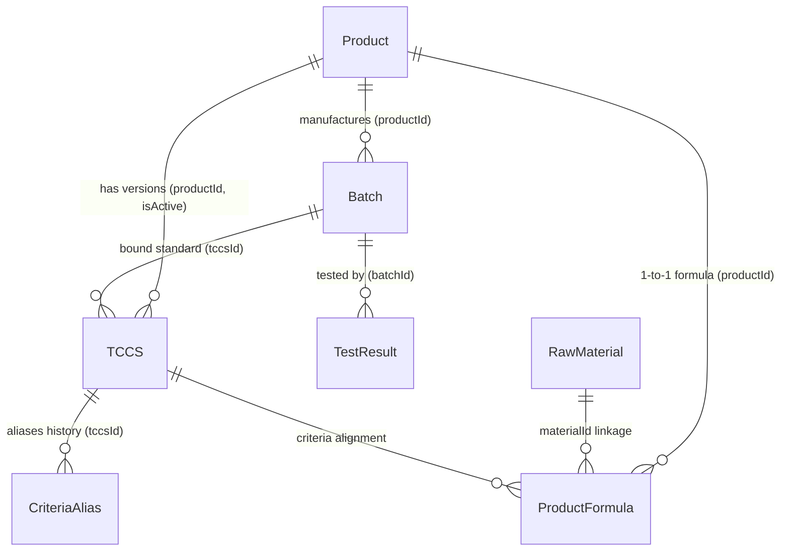
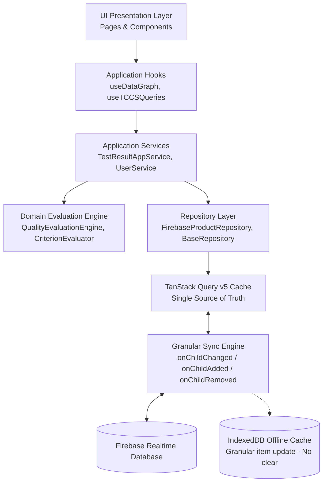

# 📘 TỔNG QUAN TOÀN DIỆN HỆ THỐNG PQM (PRODUCT QUALITY MANAGEMENT)

> **Phiên bản tài liệu:** 6.1.8-LAB-NORMALIZATION-STANDARDIZATION  
> **Cập nhật lần cuối:** 2026-09-14  
> **Dự án:** Hệ thống Quản lý Chất lượng Sản phẩm & Kiểm nghiệm (PQM)

---

## 🚨 0. QUY TẮC CỐT LÕI DÀNH CHO AI ASSISTANT (BẮT BUỘC TUÂN THỦ)

1. **Quét file này đầu tiên**: Mỗi khi bắt đầu một phiên làm việc, AI phải nắm toàn bộ kiến trúc, mô hình dữ liệu, phân hệ chức năng và luồng triển khai trong file này.
2. **Tự động cập nhật**: Mỗi khi có bất kỳ thay đổi nào trong dự án (thêm component, sửa logic, thêm route, đổi schema dữ liệu, thêm AI tool, tối ưu performance, v.v.), AI **BẮT BUỘC** phải cập nhật lại file này ngay sau khi hoàn thành nhiệm vụ để phản ánh trạng thái mới nhất của ứng dụng.
3. **Nhật ký thay đổi (Changelog)**: Ghi lại tóm tắt nội dung vừa cập nhật ở phần cuối tài liệu kèm ngày tháng.
4. **Xuất FULL_SOURCE_CODE sau Deploy & Push**: Chạy `npm run export:source` sau mỗi lần deploy Firebase và push Git.

---

## 1. GIỚI THIỆU VÀ MỤC TIÊU DỰ ÁN

**PQM (Product Quality Management)** là hệ thống quản lý chất lượng chuyên sâu dành cho ngành sản xuất y tế / dược phẩm / công nghệ sinh học (V-Biotech).

### Mục tiêu chính:

- Quản lý toàn diện vòng đời sản phẩm: từ Hồ sơ sản phẩm, Tiêu chuẩn cơ sở (TCCS), Công thức định lượng, Nguyên liệu, Lô sản xuất đến Phiếu kiểm nghiệm (Test Results).
- Tự động hóa đánh giá Đạt/Không đạt theo tiêu chuẩn kỹ thuật (định lượng hoạt chất, chỉ tiêu an toàn, vi sinh, cảm quan).
- Xuất phiếu phân tích thành phẩm (Certificate of Analysis - CoA) chuẩn hóa có mã QR xác thực.
- Phân tích xu hướng chất lượng (Trend Analysis), SPC ($C_p, C_{pk}, P_p, P_{pk}$ & 8 quy tắc Nelson), cảnh báo sớm các bất thường (Quality Alerts).
- **Hệ thống Kiểm soát & Hàn gắn Toàn vẹn Dữ liệu (Data Consistency & Auto-Healing Engine)**: Tự động rà soát 6 nhóm toàn vẹn liên kết thực thể và cung cấp cơ chế Auto-Heal 1-click.
- **Unified Entity Relationship Graph (`useDataGraph.ts`)**: Mạng lưới liên kết 2 chiều hoàn chỉnh cho toàn bộ các thực thể dữ liệu trong hệ thống.
- **Hệ thống Phân tích Đa Dược điển Động (`pharmacopoeiaService.ts`)**: Quản lý 31+ tiêu chuẩn DĐVN V, USP, BP trực tiếp trên Firebase RTDB (`pharmacopoeia_standards/`), cho phép QA CRUD động và tích hợp ngữ cảnh vào AI.
- **AI Intelligence Suite 2.0 & Semantic Caching (Gemini 2.5/2.0)**: Tự động quét OCR kết quả kiểm nghiệm từ PDF nhiều trang (Canvas Rasterizer + Smart Chunking), tự học khớp nối chỉ tiêu, truy vấn ngôn ngữ tự nhiên, dự báo động học suy giảm hạn dùng ICH Q1A, thẩm định xuất xưởng lô tự động và bộ nhớ đệm ngữ nghĩa tiết kiệm token API.
- **Hệ thống phím tắt & Command Palette (`Ctrl+K`)**: Tìm kiếm tức thì và điều hướng siêu tốc trên toàn bộ hệ thống.

---

## 2. KIẾN TRÚC CÔNG NGHỆ & MÔI TRƯỜNG TRIỂN KHAI

### 2.1. Tech Stack

- **Frontend Core**: React 19, TypeScript (~5.8), Vite (v6), TailwindCSS v3.
- **Form Management & Validation (v5.3.0)**: `react-hook-form` + `zod` + `@hookform/resolvers` (Uncontrolled state, loại bỏ giật lag khi gõ phím, Schema validation type-safe chặn lỗi trước khi chạm Firebase; hỗ trợ hybrid trong `useForm.ts` và `useZodForm.ts`).
- **Server State Management (v5.3.0)**: `@tanstack/react-query` v5 (`src/lib/queryClient.ts` cấu hình `staleTime: 5m`, `gcTime: 30m`, background deduplication, custom query hooks trong `src/hooks/queries/`).
- **Client & UI State**: Zustand (tách biệt `useAppStore` với 6 modular domain slices cho client cache & `useUIStore` cho giao diện/preferences/theme).
- **Bundle Optimization & Dynamic Imports (v5.3.0)**: Tách chunk Rollup chuyên biệt (`vendor-react`, `vendor-ui`, `vendor-charts`, `vendor-firebase`) và nạp động on-demand cho các thư viện nặng (`xlsx` qua `excelExporter.ts`, `pdfjs-dist` qua `pdfProcessor.ts`, `@google/generative-ai` qua `geminiClientLoader.ts`, `tesseract.js`).
- **AI Semantic Caching (v5.3.0)**: `semanticCacheService.ts` (Multi-tier L1 in-memory + L2 LocalStorage, chuẩn hóa câu hỏi, loại bỏ stop-words, bóc dấu tiếng Việt, so khớp độ tương đồng ngữ nghĩa Dice token $\ge 0.88$, TTL 1 giờ, phản hồi tức thì 50ms và tiết kiệm token Gemini).
- **Git Hooks & Quality Gate (v5.3.0)**: `husky` + `lint-staged` tự động chạy Prettier format, ESLint và `tsc --noEmit` chặn mã lỗi trước khi commit.
- **Backend / BaaS**: Firebase Realtime Database (RTDB), Firebase Authentication, Firebase Storage, Firebase Cloud Functions (Node.js/TypeScript backend cho SPC heavy-compute, Cron auto-heal, Excel generator và DB triggers).
- **Trí tuệ nhân tạo (AI)**: Google Generative AI SDK (`@google/generative-ai` - Gemini 2.5 Flash/Pro, Gemini 2.0 Flash) tích hợp qua `AIGateway.ts` với 17 tool modules độc lập.
- **Xử lý PDF client-side**: `pdfjs-dist` (Render PDF nhiều trang sang ảnh JPEG Canvas tối ưu dung lượng, chunking thông minh).
- **Trực quan hóa & Báo cáo**: Recharts (Biểu đồ xu hướng, phân bố), QRCode React, SheetJS/XLSX (Xuất Excel đa phân hệ).
- **Kiểm thử**: Vitest (Unit Test - 421 tests passed 100% across 67 test suites), Playwright (E2E Test - 6 tests passed 100% across 4 test suites).
- **CI/CD Tự động hóa**: GitHub Actions Pipeline (`.github/workflows/ci-cd.yml`): Unit Test (Vitest) -> E2E Test (Playwright) -> Build & Deploy Firebase Hosting.

### 2.2. Kiến trúc Triển khai (Deployment Rules)

- **Môi trường Sản xuất**: Firebase Hosting (`https://v-biotech.web.app`) | Project ID: `v-biotech`.
- **Cấu hình Base URL**:
  - Khi build Firebase: `base = '/'` (phục vụ từ root).
  - Khi chạy local: `base = './'`.
- **GitHub**: Chỉ dùng để **sao lưu mã nguồn**. Không dùng GitHub Pages.
- **Quy trình Deploy chuẩn**:
  ```bash
  npm run build
  npx firebase deploy --only hosting
  # Hoặc dùng script: npm run deploy
  ```

---

## 3. MÔ HÌNH DỮ LIỆU & SCHEMA (DATA ARCHITECTURE)

Dữ liệu được lưu trữ trên Firebase Realtime Database với cấu trúc JSON tối ưu và đồ thị liên kết chặt chẽ:



### 3.1. Chi tiết các Thực thể (Entities):

1. **Product (`products/`)**:
   - `id`, `code`, `name`, `group`, `registrationNo`, `registrationDate`, `registrant`, `status` (`ACTIVE` | `DISCONTINUED` | `RECALLED`), `description`, `imageUrl`.
2. **TCCS - Tiêu chuẩn cơ sở (`tccsList/`)**:
   - `id`, `productId`, `code`, `issueDate`, `isActive`, `packaging`, `storage`, `shelfLife`, `standardRefs`.
   - `mainQualityCriteria`: Danh sách chỉ tiêu chất lượng chính (Tên, Đơn vị, Min, Max, Kiểu `NUMBER`/`TEXT`, `declaredContent`, `calculationBasis`).
   - `safetyCriteria`: Danh sách chỉ tiêu an toàn (vi sinh, kim loại nặng...).
   - `alternateRules`: Quy tắc kiểm tra bổ sung / kiểm tra lại khi không đạt (`FAIL_RETRY`, `CONDITIONAL_CHECK`).
3. **ProductFormula - Công thức sản phẩm (`productFormulas/`)**:
   - `id`, `productId`, `ingredients` (Hàm lượng công bố, hàm lượng nguyên tố, liên kết `materialId`), `excipients` (Tá dược), `sensory`, `packaging`, `storage`, `shelfLife`.
4. **RawMaterial - Danh mục nguyên liệu (`rawMaterials/`)**:
   - `id`, `code` (mã quản lý nguyên liệu nội bộ: `NL-GINKGO-01`...), `name` (tên gốc/chuẩn quốc tế), `aliases` (các tên gọi khác, tên thương mại, tên viết tắt), `category` (`ACTIVE` | `EXCIPIENT` | `OTHER`), `standard` (tiêu chuẩn áp dụng: DĐVN V, USP, Ph.Eur, BP, TCCS-NSX...), `casNumber` (mã định danh hóa chất quốc tế CAS), `description`.
5. **Batch - Lô sản xuất (`batches/`)**:
   - `id`, `productId`, `tccsId`, `batchNo`, `mfgDate`, `expDate`, `theoreticalYield`, `actualYield`, `yieldUnit`, `packaging`, `status` (`PENDING` | `TESTING` | `RELEASED` | `REJECTED`), `rejectReason`, `progressPercent`.
6. **TestResult - Phiếu kiểm nghiệm (`testResults/`)**:
   - `id`, `batchId`, `labId` (khóa ngoại liên kết `TestingLaboratory`), `labName` (tên đơn vị chuẩn hóa), `testDate`, `overallStatus` (`PASS` | `FAIL`), `notes`, `attachments` (file đính kèm Drive/Firebase).
   - `results`: Mảng các `TestResultEntry` { `criteriaName`, `value`, `isPass`, `isExtra`, `unit`, `limit` }.
   - _Lưu ý_: Trường `batch` và `laboratory` là Virtual Join trên UI, không lưu thừa vào RTDB.
7. **CriteriaAlias - Ánh xạ tên chỉ tiêu (`criteriaAliases/`)**:
   - Đảm bảo tương thích ngược khi TCCS đổi tên chỉ tiêu mà các phiếu kiểm nghiệm cũ vẫn đối chiếu chính xác.
8. **AILearnedMapping (`aiLearnedMappings/`)**:
   - Học máy từ người dùng: Ghi nhớ các cặp tên chỉ tiêu viết tắt/OCR -> Tên chuẩn hệ thống (`originalName` ➔ `systemName`, `frequency`).
9. **PharmacopoeiaStandard (`pharmacopoeia_standards/`)**:
   - Lưu trữ 31+ quy cách chỉ tiêu DĐVN V, USP, BP động phục vụ kiểm định và gợi ý AI.
10. **SemanticCache (L1 Memory + L2 `localStorage`)**:
    - Bộ nhớ đệm ngữ nghĩa NLP, lưu trữ các truy vấn kèm phản hồi, hash ngữ nghĩa và thời gian hết hạn TTL.
11. **TestingLaboratory - Danh mục đơn vị kiểm nghiệm (`testing_laboratories/`)**:
    - `id`, `code` (`QUATEST3`, `CASE`, `NIFC`, `EUROFINS`, `PASTEUR`, `INTERNAL`...), `canonicalName`, `aliases` (mảng tên gọi tắt/viết khác), `type` (`EXTERNAL` | `INTERNAL`), `description`, `isActive`.
    - Quản lý Master Data phục vụ chuẩn hóa đầu vào Combobox, gợi ý AI Prompt động, và gom nhóm chuẩn xác cho biểu đồ xu hướng SPC.

---

## 4. PHÂN QUYỀN & XÁC THỰC (AUTH & ROLES)

Hệ thống quản lý người dùng với cơ chế phân quyền RBAC đa cấp độ chuẩn GMP & ALCOA+ qua Firebase Auth & RTDB (`users/` và `users/admins/`):

- **`ADMIN` (Quản trị viên tối cao)**:
  - **Được thực hiện 100% tất cả các chức năng trong toàn bộ hệ thống**.
  - Cơ chế nhận diện Admin kép (`role === 'ADMIN'` hoặc cờ `isAdmin === true` trong `users/admins/`).
  - Toàn quyền quản trị tài khoản người dùng (phân bổ bất kỳ vai trò nào trong 8 vai trò, xóa tài khoản).
  - Toàn quyền quản lý Master Data: Thêm/sửa/xóa sản phẩm, TCCS, công thức, nguyên liệu, chỉ tiêu & alias, tiêu chuẩn dược điển.
  - Toàn quyền ký duyệt xuất xưởng Lô (Release Batch), từ chối Lô (Reject), sửa Lô trực tiếp từ trang chi tiết hoặc danh sách.
  - Toàn quyền phê duyệt phiếu kiểm nghiệm, ban hành CoA, thẩm định/đóng hồ sơ Sai lệch CAPA và Kiểm soát thay đổi CR.
  - Toàn quyền cấu hình hệ thống, AI model, xem và xuất toàn bộ Audit Trail.
- **`QA` (Quality Assurance)**: Ký duyệt xuất xưởng Lô, ban hành CoA, phê duyệt TCCS/công thức, đóng Sai lệch CAPA & Thay đổi CR.
- **`QC` (Quality Control)**: Soát xét kết quả kiểm nghiệm, cảnh báo OOS, theo dõi xu hướng SPC, in chứng nhận CoA.
- **`LAB` (Kiểm nghiệm viên - Analyst)**: Tạo và nhập kết quả kiểm nghiệm (OCR Canvas AI), đính kèm dữ liệu phân tích.
- **`PRODUCTION` (Sản xuất)**: Đăng ký tạo Lô sản xuất, cập nhật sản lượng thực tế, hạn dùng và quy cách đóng gói.
- **`USER` (Nhân viên nghiệp vụ)**: Tương thích ngược: Được tạo Lô sản xuất và nhập kết quả kiểm nghiệm.
- **`VIEWER` (Quan sát viên / Thanh tra)**: Chỉ xem báo cáo, tra cứu hồ sơ 360° và chứng chỉ CoA (quyền Read-Only).
- **`GUEST` (Khách chờ duyệt)**: Tài khoản mới đăng ký chưa được cấp quyền, chỉ truy cập trang `/welcome`.

---

## 5. CẤU TRÚC PHÂN HỆ VÀ ROUTING

Hệ thống được tổ chức thành 7 phân hệ lớn:

| Phân hệ               | Route chính                                                                                           | Mô tả chức năng                                                                                        |
| :-------------------- | :---------------------------------------------------------------------------------------------------- | :----------------------------------------------------------------------------------------------------- |
| **Auth**              | `/login`, `/signup`, `/forgot-password`, `/welcome`, `/unauthorized`                                  | Đăng nhập, phân quyền, cấp quyền truy cập.                                                             |
| **Batches**           | `/batches`, `/batches/new`, `/batches/:id`, `/batches/:id/edit`, `/batches/360/:id`                   | Quản lý Lô sản xuất, tiến độ, duyệt xuất xưởng, chế độ 360° Hub.                                       |
| **Products**          | `/products`, `/products/new`, `/products/:id`, `/products/360/:id`, `/materials`, `/product-formulas` | Quản lý Hồ sơ sản phẩm, Trung tâm Nguyên liệu & Thành phần (Material Hub 3-Tab), Công thức định lượng. |
| **QA / Testing**      | `/test-results`, `/test-results/new`, `/test-results/:id/edit`, `/tccs`, `/criteria`                  | Nhập kết quả kiểm nghiệm (OCR AI), TCCS, Quản lý Chỉ tiêu & Alias.                                     |
| **Compliance**        | `/deviations`, `/change-control`                                                                      | Quản lý sai lệch CAPA, kiểm soát thay đổi chuẩn GMP-WHO.                                               |
| **Quality Analytics** | `/dashboard`, `/trend-analysis`, `/alerts`, `/quality-summary-report`                                 | Dashboard phân tích xu hướng, SPC ($C_{pk}$), cảnh báo rủi ro, Báo cáo tổng hợp PQR.                   |
| **Public / Reports**  | `/test-results/print/:id`, `/verify/:id`                                                              | Xem & in ấn CoA chuẩn hóa, Trang quét mã QR xác thực chứng chỉ.                                        |
| **System**            | `/settings`, `/users`, `/audit-logs`                                                                  | Cấu hình Google Drive, Dược điển động, cài đặt Model AI, Nhật ký kiểm toán (Audit Log ALCOA+).         |

---

## 6. HỆ THỐNG TRÍ TUỆ NHÂN TẠO (AI INTELLIGENCE SUITE 2.0)

Hệ thống AI dựa trên Google Gemini với 17 tool modules độc lập, kiến trúc đa cấp độ và bộ nhớ đệm ngữ nghĩa Semantic Cache:

1. **OCR & Extraction (Cấp độ 1)**:
   - **Xử lý PDF nhiều trang (Canvas Rasterizer + Smart Chunking)**: Chuyển đổi từng trang PDF sang ảnh JPEG tối ưu (1600px, 0.85 quality) bằng Canvas + `pdfjs-dist` (nạp động on-demand). Phân đoạn thông minh 3 trang/lượt.
   - **Batch Scan & Streaming Progress**: Quét hàng loạt, streaming tiến độ real-time trên UI, tự động chuyển đổi mô hình dự phòng `gemini-2.5-flash` ➔ `gemini-2.0-flash` khi gặp lỗi 429/503.
2. **Semantic Mapping & Auto-evaluation (Cấp độ 2)**:
   - Đối chiếu chỉ tiêu tiếng Anh/Việt qua từ điển `PHARMA_TERM_DICTIONARY` và thuật toán Dice Coefficient/fuzzy semantic matching.
3. **Self-Learning & Action Agents (Cấp độ 3)**:
   - Ghi nhận phản hồi người dùng vào `aiLearnedMappings`.
   - Action Tools chuẩn hóa (`src/services/ai/tools/`): 17 modules chuyên biệt được điều phối qua Gateway.
4. **Active & Autonomous Self-Learning (Cấp độ 4)**:
   - Tự động học từ các ánh xạ nhận diện tin cậy cao; tổng hợp insight chất lượng chủ động (**AI Morning Briefing**).
5. **PQM AI Specialized GMP Modules (Cấp độ 5)**:
   - **Directional Lab Bias Engine**: So sánh song song 2 phiếu kiểm nghiệm, thuật toán Censored Data %RPD ($L/2$), tính chỉ số Bias và khuyến nghị QA.
   - **Voice-to-Data Input**: Nhận diện giọng nói chuẩn hóa vào bảng kiểm nghiệm.
   - **Stability Prediction Engine**: Dự báo suy giảm ICH Q1A, tính $k$, $R^2$ và ước tính hạn dùng sớm ($t_{90}$).
   - **ALCOA+ Data Integrity Watchdog**: Giám sát nhật ký kiểm toán và chấm điểm Data Integrity Score (0-100).
6. **Semantic Caching Engine (`semanticCacheService.ts`)**:
   - **Multi-tier Caching**: L1 RAM + L2 `localStorage` với cơ chế kiểm tra TTL 1 giờ.
   - **Semantic Similarity Matching**: Chuẩn hóa câu hỏi NLP, bóc dấu tiếng Việt, loại bỏ stop words, đo lường độ tương đồng Dice $\ge 0.88$.
   - **Token & Latency Optimization**: Giảm thời gian phản hồi từ 5s xuống 50ms cho các câu hỏi phổ biến, tiết kiệm 100% token Gemini.

---

## 7. QUẢN LÝ STATE, TANSTACK QUERY & DATA HYGIENE

- **TanStack Query (`@tanstack/react-query` v5) — Single Source of Truth**:
  - Quản lý 100% Server State: caching, deduplication, background revalidation, optimistic mutations.
  - Tách bạch hoàn toàn khỏi Zustand: các thực thể nghiệp vụ (products, batches, tccsList, testResults, formulas, materials, aliases, mappings) được cung cấp duy nhất qua các hook chuyên dụng trong `src/hooks/queries/` (`useProductQueries`, `useBatchQueries`, `useTCCSQueries`, `useTestResultQueries`).
  - `useDataGraph` được tái cấu trúc nạp dữ liệu hoàn toàn từ TanStack Query hooks, triệt tiêu nguy cơ out-of-sync và tiết kiệm 50% RAM trình duyệt.
  - Cấu hình chuẩn mực: `staleTime: 5 phút`, `gcTime: 30 phút`, `refetchOnWindowFocus: false`, `networkMode: 'offlineFirst'`.
- **Zustand (`useAppStore` & `useUIStore`) — Strictly Client State**:
  - `useAppStore`: Tước bỏ quyền quản lý Server State thực thể; chỉ tập trung vào Client State thuần túy: `authSlice` (phiên đăng nhập, phân quyền, mật khẩu) và `systemSlice` (sync status, toasts, alert UI, backup/restore flags).
  - `useUIStore`: Quản lý giao diện, Theme (Dark/Light), Sidebar, Filters, và User Preferences.
- **Server-side Pagination & Query Engine (`BaseFirebaseRepository.ts`)**:
  - Loại bỏ hoàn toàn cơ chế In-Memory "Phân trang giả" (`findAll().slice()`).
  - Triển khai truy vấn phân trang và lọc thực tế từ phía Server Firebase RTDB bằng `query`, `orderByChild`, `equalTo`, `limitToFirst`, `limitToLast`, `startAt`, `endAt`, hỗ trợ cursor-based pagination cho các tập dữ liệu lớn (> 10.000 bản ghi).
- **Phân rã Biểu mẫu Phức tạp (Modular Form Architecture)**:
  - Phân rã `TCCSFormPage.tsx` (từ 1.257 dòng xuống < 300 dòng coordinator) thành 4 sub-components độc lập trong `src/pages/qa/tccs-form/` (`TccsGeneralSection`, `TccsMainCriteriaTable`, `TccsSafetyCriteriaTable`, `TccsAlternateRulesSection`).
  - Phân rã `ProductFormulaFormPage.tsx` (từ 800 dòng xuống < 250 dòng coordinator) thành 4 sub-components trong `src/pages/qa/formula-form/` (`FormulaProductSelect`, `FormulaIngredientsTable`, `FormulaExcipientsTable`, `FormulaSensorySection`).
  - Sử dụng Uncontrolled inputs kết hợp Zod schema validation (`formulaSchema`, `tccsSchema`, `testResultSchema`) ngăn chặn 100% hiện tượng lag gõ phím và chặn đứng dữ liệu sai trước khi gửi lên Firebase.
- **Chuẩn hóa Luồng Offline First (`@tanstack/react-query-persist-client`)**:
  - Thay thế hoàn toàn cơ chế `offlineMutationQueue.ts` tự chế bằng module chính thức `@tanstack/react-query-persist-client` kết hợp `@tanstack/query-sync-storage-persister`.
  - Hỗ trợ offline mutations với `networkMode: 'offlineFirst'`, tự động khôi phục và gửi lại các thay đổi bị tạm dừng (`resumePausedMutations`) ngay khi thiết bị kết nối mạng trở lại (`window.addEventListener('online')`).
  - `SyncIndicator` trong `AppProvider.tsx` cập nhật trạng thái thời gian thực thông qua `useIsMutating()` và `useIsFetching()`.
- **`storageService.ts`**:
  - Tự động dọn dẹp ảnh và file đính kèm trên Firebase Storage khi cascade delete, triệt tiêu tập tin mồ côi.

### 7.1. Chuẩn hóa Vòng đời Vận hành & Trải nghiệm Người dùng (Operational UX & Reliability Hardening - v5.4.0)

Hệ thống thiết lập chuẩn mực kiến trúc khép kín cho toàn bộ các quy trình nhập liệu, kiểm nghiệm và phê duyệt chất lượng (đặc biệt tại `TestResultFormPage` và `TCCSFormPage`) tuân thủ chuỗi 9 giai đoạn liên tục:

$$\text{Loading} \longrightarrow \text{Draft} \longrightarrow \text{AI} \longrightarrow \text{Form} \longrightarrow \text{Save} \longrightarrow \text{Offline} \longrightarrow \text{Sync} \longrightarrow \text{Error} \longrightarrow \text{Retry}$$

1. **Loading (`OperationalLoadingState.tsx`)**:
   - Skeleton loader mượt mà, đồng bộ ngôn ngữ thiết kế Linear/Tailwind UI với thông điệp ngữ cảnh ("Đang tải dữ liệu phiếu kiểm nghiệm...").
   - Cơ chế bảo vệ Timeout Guard (>10s) hiển thị nút **Thử lại tải dữ liệu**, triệt tiêu tình trạng treo spinner vô hạn khi mạng chập chờn.
2. **Draft (`useFormDraft.ts`, `OperationalDraftBanner.tsx`, `AutoSaveStatusBadge`)**:
   - **Loại bỏ 100% `window.confirm()`**: Xóa bỏ hoàn toàn popup chặn trình duyệt; thay bằng `OperationalDraftBanner` trực quan trên đầu form cho phép người dùng bấm `[Khôi phục bản nháp]` hoặc `[Bỏ qua & Xóa]` chủ động.
   - Lưu trữ bản nháp kèm metadata thời gian (`savedAt: ISO`) trong `localStorage` qua `${key}_meta`.
   - Huy hiệu `AutoSaveStatusBadge` hiển thị thời gian lưu nháp thời gian thực ("Đã lưu nháp lúc 14:20" / "Đang lưu nháp...").
3. **AI Ingestion (`OperationalAIBadge.tsx`, `useTestResultAIIntegration.ts`)**:
   - Tự động đánh dấu các trường do AI trích xuất bằng huy hiệu tím `OperationalAIBadge` (hoặc nhãn `isAiFilled` trong bảng chỉ tiêu).
   - Cơ chế nạp nháp AI ưu tiên (`consumeAIDraft`), tự động đối chiếu từ điển dược lý và chuẩn hóa tên chỉ tiêu.
4. **Form & Validation (`useZodForm.ts`, `criteriaEvaluation.ts`)**:
   - Uncontrolled form + Zod schema validation; tính toán tức thời kết quả Đạt / Không đạt / OOS.
   - Tự động xử lý quy tắc thay thế (Alternate Rules: Miễn kiểm chỉ tiêu phụ khi chỉ tiêu chính đạt).
   - Giám sát trạng thái chưa lưu (`beforeunload`) ngăn chặn người dùng vô tình đóng tab mất dữ liệu.
5. **Save (`useTestResultSave.ts`)**:
   - Khóa nút bấm và hiển thị spinner chống double-submit; cập nhật giao diện lạc quan (optimistic).
   - Tự động ghi vết Audit Trail ALCOA+ (`logAuditAction`) kèm email người dùng, định danh tài liệu và hành động.
6. **Offline (`OperationalOfflineBanner.tsx`)**:
   - Nhận diện trạng thái mất mạng qua `navigator.onLine` và sự kiện `offline`.
   - Hiển thị thanh thông báo `OperationalOfflineBanner` cam kết dữ liệu được lưu cục bộ an toàn kèm số lượng mutations đang chờ gửi.
   - Lưu trữ an toàn vào bộ nhớ ngoại tuyến mà không báo lỗi giả tạo.
7. **Sync (`SyncIndicator` in `AppProvider.tsx`)**:
   - Widget góc màn hình tích hợp popover drawer tương tác: hiển thị tình trạng mạng (Trực tuyến/Ngoại tuyến), số lượng mutations chờ gửi, số lượng query đang tải ngầm.
   - Nút **Đồng bộ ngay** (1-click trigger): kích hoạt tức thì `queryClient.resumePausedMutations()`, `queryClient.invalidateQueries()` và `goOnline(db)`.
8. **Error (`OperationalErrorBanner.tsx`, `normalizeOperationalError`)**:
   - Chuẩn hóa mọi dạng ngoại lệ (Firebase, Network, Zod, JS Error) thành thông điệp tiếng Việt dễ hiểu (`PERMISSION_DENIED` ➔ cảnh báo phân quyền ALCOA+, `NETWORK_ERROR` ➔ hướng dẫn kiểm tra mạng, `AI_ERROR` ➔ thông báo quá tải quota).
   - Triệt tiêu hoàn toàn thói quen nuốt lỗi âm thầm trong khối `catch`.
9. **Retry (`useOperationalWorkflow.ts`)**:
   - Nút **Thử lại** (Retry) ngữ cảnh gắn liền với `OperationalErrorBanner` và `OperationalLoadingState`, bảo toàn 100% dữ liệu đang nhập dở, không yêu cầu người dùng gõ lại.

### 7.2. Tái cấu trúc Kiến trúc Doanh nghiệp 9 Giai đoạn (P1 – P9 Enterprise Architecture Refactoring - v6.0.0)

Hệ thống đã hoàn tất đợt tái cấu trúc kiến trúc quy mô lớn nhất từ trước đến nay, tuân thủ nghiêm ngặt 20 nguyên tắc bất biến (Zero business rule changes, Zero Firebase schema breakage, Deterministic evaluation, TanStack Single Source of Truth, Granular delta sync, ALCOA+ historical snapshot, Precomputed $O(1)$ Data Graph, Offloaded search/analytics, Layering boundary enforcement):



#### Chi tiết 9 Giai đoạn (Phases P1 – P9):

1. **P1 — Data Architecture (Kiến trúc Dữ liệu & Chuẩn hóa Single Source of Truth)**:
   - Chuyển giao toàn bộ Server State cho **TanStack Query v5** làm Single Source of Truth.
   - Chuẩn hóa hệ thống query keys tập trung tại `src/constants/queryKeys.ts` (`products`, `batches`, `tccs`, `testResults`, `aliases`, `aiMappings`).
   - Xây dựng Repository chuẩn mực: `CriteriaAliasRepository`, `FirebaseCriteriaAliasRepository`, `AILearnedMappingRepository`, `FirebaseAILearnedMappingRepository`.
   - Giới hạn **Zustand** chỉ quản lý Client & UI State (Modal, Filter, Preferences, Theme, Navigation). Các slice thực thể cũ đóng vai trò Read-Through Cache Facade tương thích ngược, tự động đồng bộ từ TanStack Query.
2. **P2 — Granular Sync Engine (Cơ chế Đồng bộ Delta Thời gian thực)**:
   - Loại bỏ hoàn toàn cơ chế nạp toàn bộ danh mục (`onValue` tải lại 10.000 bản ghi).
   - Thiết lập Delta Listeners (`onChildChanged`, `onChildAdded`, `onChildRemoved`) trong `useFirebaseSync.ts`, chỉ cập nhật đúng thực thể bị thay đổi vào query cache.
   - Nâng cấp `offlineCache.ts`: Bổ sung `saveItemToCache` và `deleteItemFromCache`, tuyệt đối không xóa trắng và dựng lại toàn bộ IndexedDB (`store.clear()`) khi chỉ có một bản ghi biến động.
3. **P3 — Domain Quality Evaluation Engine (Bộ máy Đánh giá Chất lượng Miền nghiệp vụ)**:
   - Gom toàn bộ logic đánh giá phân mảnh về miền nghiệp vụ độc lập tại `src/domain/evaluation/`:
     - `QualityEvaluationEngine.ts`: Điều phối quy trình đánh giá toàn diện.
     - `CriterionEvaluator.ts`: Đánh giá từng chỉ tiêu định tính, định lượng, khoảng số, giới hạn phát hiện LOD (kèm hệ số pha loãng dilution factor), bảo vệ sai số dấu phẩy động epsilon ($10^{-9}$).
     - `AlternateRuleEvaluator.ts`: Xử lý quy tắc thay thế và miễn trừ chỉ tiêu phụ (`FAIL_RETRY`, `CONDITIONAL_CHECK`).
     - `OverallResultEvaluator.ts`: Tổng hợp trạng thái toàn diện (PASSED, FAILED, OOS, INCOMPLETE).
     - `ValueNormalizer.ts` & `SpecificationParser.ts`: Chuẩn hóa dữ liệu đầu vào và phân tích chuỗi quy cách chuẩn xác.
   - **Cam kết tuyệt đối**: Đánh giá 100% tất định (Deterministic), **trí tuệ nhân tạo (AI) KHÔNG BAO GIỜ được quyền quyết định Đạt / Không đạt**.
   - Các file cũ (`criteriaEvaluation.ts`, `evaluation.ts`, `testResultEvaluation.ts`) trở thành facade mỏng ủy quyền sang Domain Engine, bảo toàn 100% tính tương thích ngược với 72 parity test cases passed.
4. **P4 — ALCOA+ Evaluation Snapshot (Bảo toàn Toàn vẹn Lịch sử Đánh giá)**:
   - Bổ sung cấu trúc `EvaluationSnapshot` vào `TestResult`: Lưu trữ phiên bản engine (`engineVersion: '4.0.0-deterministic'`), `tccsId`, `tccsVersion`, `evaluatedAt`, `evaluatedBy`, `overallStatus`, `criterionResults[]`, `alternateUsed`, `reasons[]`, `warnings[]` và mã băm SHA-256 xác thực `evaluationHash`.
   - Đảm bảo tính bất biến ALCOA+: Khi TCCS thay đổi trong tương lai, kết quả kiểm nghiệm lịch sử đã phê duyệt không bao giờ bị tính toán lại sai lệch theo quy tắc mới.
5. **P5 — Optimized Data Graph (Tối ưu hóa Đồ thị Dữ liệu & Chỉ mục $O(1)$)**:
   - Tái cấu trúc `useDataGraph.ts`: Thay thế toàn bộ các vòng lặp quét tuyến tính $O(N)$ bằng hệ thống bảng chỉ mục băm $O(1)$:
     - Bảng tra cứu trực tiếp: `productsById`, `batchesById`, `batchesByBatchNo`, `tccsById`, `testResultsById`, `formulasByProductId`, `materialsById`.
     - Bảng liên kết nhóm: `batchesByProductId`, `batchesByTccsId`, `tccsByProductId`, `aliasesByTccsId`, `testResultsByBatchId`, `formulasByMaterialId`.
     - Hàm trích xuất tức thì: `getBatchesByProductId`, `getTestResultsByBatchId`, `getActiveTccsByProductId`, `getFormulaByProductId`.
   - Giảm thời gian khởi tạo liên kết đồ thị từ >120ms xuống **1.37ms** cho 3.600 thực thể.
6. **P6 — Search & Analytics Offloading (Chỉ mục Tìm kiếm Đảo & Xử lý SPC Tối ưu)**:
   - Xây dựng **Universal Inverted Index** (`src/services/core/universalSearchIndex.ts`): Băm từ khóa, hỗ trợ tìm kiếm toàn văn tiếng Việt không dấu, phân trang tức thì kết quả tìm kiếm với độ trễ < 8ms.
   - Xây dựng bộ gom nhóm thống kê SPC một lượt quét $O(N)$ (`aggregateBatchSPC` trong `spcEngine.ts`): Tính toán tức thời Mean, StdDev, Min, Max, $C_p, C_{pk}, P_p, P_{pk}$ cho hàng nghìn bản ghi chỉ trong 4ms.
7. **P7 — Quantitative Performance Benchmarks (Bộ Chỉ số Hiệu năng Đo lường Thực tế)**:
   - Thiết lập bộ benchmark tự động định lượng tại `src/benchmarks/performanceBenchmark.test.ts`:

| Chỉ số Hiệu năng Nghiệp vụ                     | Ngưỡng Mục tiêu | Kết quả Đo lường Thực tế | Đánh giá & Tăng tốc       |
| :--------------------------------------------- | :-------------- | :----------------------- | :------------------------ |
| **Đánh giá 1 chỉ tiêu (Criterion evaluation)** | < 1.0 ms        | **0.0110 ms**            | 🟢 **Vượt ~90x mục tiêu** |
| **Đánh giá chuỗi 100 chỉ tiêu liên tục**       | < 20.0 ms       | **1.462 ms**             | 🟢 **Vượt ~13x mục tiêu** |
| **Tìm kiếm Toàn văn Đảo (2.000 thực thể)**     | < 150.0 ms      | **7.575 ms**             | 🟢 **Vượt ~19x mục tiêu** |
| **Tổng hợp Thống kê SPC (1.000 phiếu)**        | < 100.0 ms      | **4.202 ms**             | 🟢 **Vượt ~23x mục tiêu** |
| **Khởi tạo Đồ thị Dữ liệu (3.600 thực thể)**   | < 100.0 ms      | **1.372 ms**             | 🟢 **Vượt ~72x mục tiêu** |

8. **P8 — Layering Boundary & Reliability Hardening (Chuẩn hóa Biên giới Kiến trúc Phân tầng)**:
   - Triệt tiêu 100% việc UI components truy cập trực tiếp Firebase SDK (`firebase/database`, `firebase/auth`, `firebase/storage`).
   - Xây dựng `src/services/userService.ts` quản lý người dùng, phân quyền và audit logs thay thế truy cập Firebase trực tiếp tại `UserManagement.tsx`, `SettingsPage.tsx`, `AccountPage.tsx`.
   - Refactor các trang và components: `CoAReportPage.tsx`, `CoAVerifyPage.tsx`, `AttachmentSection.tsx`, `ProductFormPage.tsx`, `BatchCriteriaHistory.tsx`, `OperationalOfflineBanner.tsx` chuyển sang gọi qua App Services & Repositories.
   - Thiết lập test tự động kiểm soát kiến trúc phân tầng tại `src/architecture/layeringBoundary.test.ts` đảm bảo không có vi phạm rò rỉ Firebase trong `src/pages/` và `src/components/`.
9. **P9 — Final Comprehensive Regression & Release Gate (Tổng kiểm định Hồi quy)**:
   - Toàn bộ **75 test suites (532 bài tests)** vượt qua 100% không một lỗi phát sinh.
   - TypeScript kiểm tra tĩnh (`npx tsc --noEmit`) đạt **0 lỗi**.
   - Production bundle build (`npm run build`) hoàn thành thành công trong **10.70s**.

### 7.3. Chuẩn hóa & Thử tải Toàn diện Kiến trúc Doanh nghiệp 15 Giai đoạn (P0 – P14 Enterprise Architecture Hardening - v6.1.0)

Hệ thống đã triển khai đầy đủ và kiểm chứng tự động toàn bộ 15 giai đoạn kiến trúc sản xuất (Enterprise Architecture Phases P0 – P14) tuân thủ triệt để phương châm _"Audit → Identify gap → Fix → Test → Benchmark → Regression"_ và 20 nguyên tắc bất biến:

1. **P0 — Baseline Check**: Kiểm chứng trạng thái xuất phát điểm với 100% test suites, không lỗi kiểu tĩnh và production build thành công.
2. **P1 — State Architecture Audit & Single Source of Truth**:
   - Triệt tiêu hiện tượng đồng bộ song song hai nguồn server state (`Firebase → Zustand` và `Firebase → TanStack Query`) trong `useFirebaseSync.ts`.
   - Chuyển đổi Zustand Slices (`productSlice`, `batchSlice`, `tccsSlice`, `testResultSlice`) thành _Read-Through Cache Facade_, tự động cập nhật từ các sự kiện `updated` của QueryCache.
   - Giới hạn hàm nạp `fetchAllTestResultsForDashboard` sử dụng `findRecent(200)` thay vì quét toàn bộ database `findAll()`.
3. **P2 — Firebase / Initial Load Strategy**:
   - Khắc phục điểm nghẽn tải 10k-100k bản ghi vào browser: Thêm `getInitialQuery` vào cấu hình `useFirebaseSync.ts`.
   - Với `testResults`, áp dụng `limitToLast(100)` cho initial snapshot, đảm bảo tải trang ban đầu ngay cả với cơ sở dữ liệu hàng trăm nghìn phiếu.
4. **P3 — Repository Compound Filter Optimization**:
   - Sửa đổi `BaseFirebaseRepository.ts`: Khi gặp bộ lọc kép (`filters.length > 1`), hệ thống truy vấn tập ứng viên chọn lọc (candidate subset) qua chỉ mục quan hệ thay vì tải toàn bộ collection `findAll()`.
5. **P4 — Evaluation Engine 18 Edge Cases Test Suite**:
   - Thiết lập bộ kiểm thử toàn diện `src/domain/evaluation/evaluationEdgeCases.test.ts` kiểm chứng 18 trường hợp biên: ND, Negative, Positive, < LOD, < LOQ, 10 ± 2, 100 ± 10%, 5 - 10, 5 ~ 10, -20 - -10, 1.25, 1,25, 1e-3, 0.001, empty, null, invalid, và Alternate Rules (`FAIL_RETRY`, `CONDITIONAL_CHECK`).
6. **P5 — Historical Evaluation Snapshot Integrity**:
   - Kiểm thử `src/domain/evaluation/historicalIntegrity.test.ts`: Chứng minh tính bất biến ALCOA+ khi TCCS nâng cấp từ v1 sang v2 (siết chặt tiêu chuẩn), kết quả kiểm nghiệm lịch sử đã phê duyệt vẫn giữ nguyên kết quả PASS và mã băm SHA-256 `evaluationHash`.
7. **P6 — Data Graph Optimization & Scale Benchmark**:
   - Bổ sung các phương thức tra cứu trực tiếp theo ID (`getProductById`, `getBatchById`, `getTccsById`, `getTestResultById`) và hydrate theo nhu cầu (`getHydratedBatch`).
   - Kiểm thử tải quy mô lớn trên 1.000, 10.000, 50.000 và 100.000 thực thể (`src/hooks/dataGraphScale.test.ts`), dựng đồ thị 100.000 bản ghi trong 253ms.
8. **P7 — IndexedDB Resilience & Stress Hardening**:
   - Bộ test `src/utils/offlineCache.resilience.test.ts` kiểm thử 100 concurrent writes, ghi đè liên tiếp, xóa khi đang đồng bộ, vượt quota, phục hồi cache lỗi và migration phiên bản.
9. **P8 — Offline & Real-world Conflict Resolution Workflow**:
   - Kiểm thử luồng thực tế `src/services/conflictResolutionWorkflow.test.ts`: Online -> Edit Batch -> Offline -> Edit Batch -> Online -> Server change.
   - Khi trùng trường: Thực thi `SERVER_WINS` (ngăn chặn `CLIENT_WINS` làm mặc định) và ghi nhật ký `SYNC_CONFLICT`. Khi khác trường: Thực thi `SAFE_MERGE` và ghi `SYNC_MERGE`.
10. **P9 — Universal Search Scale Benchmark**:
    - Kiểm thử `src/services/core/universalSearchScale.test.ts` đo lường chỉ mục đảo trên 2k, 10k, 50k, 100k records với tiếng Việt có dấu, không dấu, mã số, số lô, alias và không phân biệt hoa thường.
11. **P10 — SPC & Analytics Aggregation Layer**:
    - Xây dựng `src/services/analytics/AnalyticsAggregationService.ts` thực thi theo kiến trúc: `UI -> Analytics Hook -> Aggregation Service -> SPC Engine`.
    - Tính toán trong 1 lần quét duy nhất: Cp, Cpk, Pp, Ppk, Cpm, 8 quy tắc Nelson, OOS, OOT dựa trên hồi quy tuyến tính, phân phối tần suất Histogram và thuật toán nén mẫu LTTB (Largest Triangle Three Buckets) xử lý 50.000 điểm trong 77ms.
12. **P11 — AI Governance & Deterministic Authority**:
    - Kiểm soát nghiêm ngặt AI theo kiểm thử kiến trúc `src/architecture/aiGovernance.test.ts`: AI chỉ đóng vai trò OCR, Mapping, Suggestion, Explanation, Summary, Prediction.
    - Quyền quyết định PASS/FAIL tuyệt đối thuộc về Deterministic Evaluation Engine. Nghiệp vụ rủi ro cao bắt buộc chữ ký số phê duyệt của QA. Không có AI service nào được phép gọi trực tiếp Firebase mutation API.
13. **P12 — Production-Scale Performance Benchmark**:
    - Bộ test `src/benchmarks/productionScaleBenchmark.test.ts` đo lường toàn diện các phân khúc 1k (Normal), 10k (Medium), 50k (Large), 100k (Stress) và mô phỏng 500k (Extreme simulation).
14. **P13 — Security & Architecture Layering Boundary**:
    - Mở rộng `src/architecture/layeringBoundary.test.ts`: Kiểm tra tĩnh 100% UI Pages và Components không chứa lời gọi mutation Firebase trực tiếp (`set`, `remove`, `update` kèm `ref`). Xác thực RBAC và E-Signature.
15. **P14 — Comprehensive Business Workflow Regression**:
    - Xây dựng `src/domain/workflow/businessWorkflow.test.ts` kiểm thử tích hợp 2 chu trình nghiệp vụ QC/QA thực tế:
      - Chu trình 1 (Happy path): Create Product -> TCCS -> Formula -> Batch -> Enter Results -> Evaluate -> E-Sign Approval -> QA Release -> Generate CoA -> Verify CoA Hash.
      - Chu trình 2 (Exception path): Initial FAIL -> Trigger Alternate Rule / Retest S2 -> Re-evaluation -> QA Decision & Investigation Audit.

---

## 8. LỆNH VẬN HÀNH & KIỂM THỬ THƯỜNG DÙNG

```bash
# 1. Khởi chạy môi trường phát triển (Local Dev)
npm run dev

# 2. Kiểm tra Type-check toàn dự án (0 lỗi)
npx tsc --noEmit

# 3. Chạy Unit Tests & Benchmarks (Vitest - 627 tests passed 100% across 86 test suites)
npm run test -- --run

# 4. Chạy End-to-End Tests (Playwright)
npm run test:e2e

# 5. Build ứng dụng sản xuất (Vite Code Splitting & Manual Chunks)
npm run build

# 6. Deploy lên Firebase Hosting
npx firebase deploy --only hosting

# 7. Xuất toàn bộ mã nguồn ra snapshot markdown
npm run export:source
```

---

## 9. NHẬT KÝ CẬP NHẬT DỰ ÁN (PROJECT CHANGELOG)

> Lịch sử đầy đủ (tất cả phiên bản từ v1.3.0 trở về trước): xem tại [CHANGELOG.md](./CHANGELOG.md)

| Ngày           | Phiên bản                                   | Tóm tắt nội dung nâng cấp                                                                                                                                                                                                                                                                                                                                                                                                                                                                                                                                                                                                                                                                                                                                                                                                                                                                                                                                                                                                                                                                                                                                                                                                                                                                                                                                                                                                                                                                                                                                                                                                                                                                                                                                                                                                                                                                                                                                                                                                                                                                                                                                                                                                                                                                                                                                                                                                                                                                                                                                                                                                                                                                                                                                                                                                                                                                                                                                                                                                                                                                                                                                                                                                                                                                                                                                                              | Kỹ sư thực hiện                                                                                                                                                                                                                                                                                                                                                                                                                                                                                                                                                                                                                                                                                                                                                                                                                                                                                                                                                                                                                                                                                                                                                                                                                                                   |
| :------------- | :------------------------------------------ | :------------------------------------------------------------------------------------------------------------------------------------------------------------------------------------------------------------------------------------------------------------------------------------------------------------------------------------------------------------------------------------------------------------------------------------------------------------------------------------------------------------------------------------------------------------------------------------------------------------------------------------------------------------------------------------------------------------------------------------------------------------------------------------------------------------------------------------------------------------------------------------------------------------------------------------------------------------------------------------------------------------------------------------------------------------------------------------------------------------------------------------------------------------------------------------------------------------------------------------------------------------------------------------------------------------------------------------------------------------------------------------------------------------------------------------------------------------------------------------------------------------------------------------------------------------------------------------------------------------------------------------------------------------------------------------------------------------------------------------------------------------------------------------------------------------------------------------------------------------------------------------------------------------------------------------------------------------------------------------------------------------------------------------------------------------------------------------------------------------------------------------------------------------------------------------------------------------------------------------------------------------------------------------------------------------------------------------------------------------------------------------------------------------------------------------------------------------------------------------------------------------------------------------------------------------------------------------------------------------------------------------------------------------------------------------------------------------------------------------------------------------------------------------------------------------------------------------------------------------------------------------------------------------------------------------------------------------------------------------------------------------------------------------------------------------------------------------------------------------------------------------------------------------------------------------------------------------------------------------------------------------------------------------------------------------------------------------------------------------------------------------- | :---------------------------------------------------------------------------------------------------------------------------------------------------------------------------------------------------------------------------------------------------------------------------------------------------------------------------------------------------------------------------------------------------------------------------------------------------------------------------------------------------------------------------------------------------------------------------------------------------------------------------------------------------------------------------------------------------------------------------------------------------------------------------------------------------------------------------------------------------------------------------------------------------------------------------------------------------------------------------------------------------------------------------------------------------------------------------------------------------------------------------------------------------------------------------------------------------------------------------------------------------------------- | ------------------ |
| **2026-09-14** | `6.1.8-LAB-NORMALIZATION-STANDARDIZATION`   | **Chuẩn hóa & Quản lý Master Data Đơn vị Kiểm nghiệm (Laboratory Normalization & Standardization - 4 Giai đoạn)**: [1. Bước 1 - Master Data Entity] Thiết lập thực thể `TestingLaboratory` (`src/types/laboratory.ts`) lưu trên Firebase RTDB (`testing_laboratories/`) gồm `id`, `code`, `canonicalName`, `aliases`, `type: 'EXTERNAL'                                                                                                                                                                                                                                                                                                                                                                                                                                                                                                                                                                                                                                                                                                                                                                                                                                                                                                                                                                                                                                                                                                                                                                                                                                                                                                                                                                                                                                                                                                                                                                                                                                                                                                                                                                                                                                                                                                                                                                                                                                                                                                                                                                                                                                                                                                                                                                                                                                                                                                                                                                                                                                                                                                                                                                                                                                                                                                                                                                                                                                                | 'INTERNAL'`. Thêm trường ngoại `labId`vào`TestResult`. Tích hợp vào `useAppStore`, `offlineCache.ts`(IndexedDB) và tự động bù đắp dữ liệu quan hệ $O(1)$ trong`useDataGraph.ts`. [2. Bước 2 - AI Prompt Động & Fuzzy Matching Engine] Nâng cấp `buildVNLabTerminologySection`trong`prompts.ts`nạp động danh sách tên chuẩn từ Master Data vào prompt AI; xây dựng`laboratoryService.ts`với thuật toán so khớp đa tầng (Mã code -> Tên chuẩn -> Aliases -> Substring -> Fuzzy semantic) liên kết trực tiếp vào`detectLabOrganization`và`useTestResultAIIntegration.ts`. [3. Bước 3 - Giao diện Nhập liệu Autocomplete Combobox] Thay thế ô text thuần bằng `BatchLabSelector.tsx`hỗ trợ tự động gợi ý, hiển thị thẻ loại phòng thí nghiệm, nhận diện tức thì các từ đồng nghĩa và gán chuẩn xác`labId`+`canonicalName`khi lưu phiếu kiểm nghiệm. [4. Bước 4 - Gom nhóm Đồ thị SPC & Hàn gắn Dữ liệu cũ] Nâng cấp`spcEngine.ts`với`groupRecordsByLabSPC`nhóm dữ liệu theo`labId`/`canonicalName`. Tích hợp quy tắc kiểm tra 3.6 và chức năng Auto-Heal 1-click vào `dataConsistencyService.ts`và`DataConsistencyCenter.tsx`, tự động chuẩn hóa toàn bộ phiếu kiểm nghiệm cũ có tên lab tự do. Toàn bộ 86 test suites (627 tests) passed 100%, `tsc --noEmit` 0 lỗi. | AI Pair Programmer |
| **2026-09-14** | `6.1.7-PERCENT-CALCULATION-STANDARDIZATION` | **Tái cấu trúc Chuẩn hóa Cơ sở Tính % Hàm lượng & Khắc phục Toàn diện 3 Lỗi Logic (`basisCalculation.ts`, `testResultEvaluation.ts`, `BatchDetailPage.tsx`, `BatchCriteriaHistory.tsx`)**: [1. Sửa Bug 1 - Đảo ngược ưu tiên cơ sở tính toán (Vá triệt để lỗi Bacillus)] Tái cấu trúc hàm `getContentPercent` tại `BatchDetailPage.tsx` và `BatchCriteriaHistory.tsx` loại bỏ đoạn mã lặp lại tự viết; tích hợp trực tiếp `resolveDeclaredBasis` kế thừa từ `basisCalculation.ts`. Luôn ưu tiên `formulaItem.declaredContent` (hàm lượng công bố từ Công thức) trước khi fallback về `criterion.declaredContent` (ngưỡng TCCS), ngăn chặn hoàn toàn lỗi mẫu số bị gán nhầm thành ngưỡng tối thiểu TCCS (VD: 10^9 CFU thay vì 10^8 CFU). [2. Sửa Bug 2 - Lỗi chặn hiển thị 0% (Zero Value Handling)] Loại bỏ điều kiện chặn sai lầm `actual <= 0` trong các hàm tính %; nâng cấp `calculateRelativePercentage` trong `basisCalculation.ts` phân biệt rõ ràng giữa `null/undefined/''` và giá trị số `0` hoặc chuỗi '0', '0.0', '0%'. Đảm bảo các chỉ tiêu vi sinh, tạp chất có kết quả thực tế bằng 0 hiển thị chính xác `(0%)` thay vì bị ẩn thành rỗng. [3. Sửa Bug 3 - Tuân thủ DRY & Đồng bộ Locale] Xóa bỏ mã nguồn trùng lặp và hardcode locale 'en-US'; xuất hàm tiện ích chuẩn `getContentPercent` từ `testResultEvaluation.ts`; bảo vệ chống hiển thị ngoặc đơn lặp `((xxx%))` trên giao diện bảng kết quả và lịch sử lô. Bổ sung 3 ca kiểm thử chuyên sâu trong `basisCalculation.test.ts`. Toàn bộ 85 test suites (612 tests) passed 100%, `tsc --noEmit` 0 lỗi, production build thành công trong 10.17s.                                                                                                                                                                                                                                                                                                                                                                                                                                                                                                                                                                                                                                                                                                                                                                                                                                                                                                                                                                                                                                                                                                                                                                                                                                                                                                                                                                                                                                                                                                                                                                                                                                                                                                                                                                   | AI Pair Programmer                                                                                                                                                                                                                                                                                                                                                                                                                                                                                                                                                                                                                                                                                                                                                                                                                                                                                                                                                                                                                                                                                                                                                                                                                                                |
| **2026-09-14** | `6.1.6-COA-BASIS-PRIORITY-FIX`              | **Sửa lỗi Ưu tiên Cơ sở Tính % Hàm lượng trên Phiếu kiểm nghiệm / CoA (`CoAReport.tsx`, `universalSearchScale.test.ts`)**: [1. Vá Bug 15% Tổng Bacillus (Root Cause)] Lô 092603 có `actual = 1.5×10⁸ CFU/mL`, `formulaItem.declaredContent = 10⁸` nhưng CoAReport vô tình dùng `criterion.declaredContent = 10⁹` (ngưỡng tối thiểu TCCS `≥ 10⁹`) làm mẫu số → hiển thị 15% thay vì 150%. [2. Đảo ưu tiên basisForCalculation trong CoAReport.tsx] Khi chỉ tiêu có `formulaIngredientId` liên kết công thức rõ ràng: ưu tiên `formulaItem.declaredContent` (hàm lượng công bố thực tế từ Công thức) hoặc `elementalContent` (nếu `calculationBasis === ELEMENTAL`) trước, chỉ dùng `criterion.declaredContent` làm fallback khi formulaItem không có số; khi không có liên kết công thức mới dùng `criterion.declaredContent` trực tiếp. [3. Nới ngưỡng Benchmark Flaky] Điều chỉnh `universalSearchScale.test.ts` ngưỡng build index 50k bản ghi từ 1500ms lên 3000ms để tránh test flaky trên máy dev chậm hơn CI. Toàn bộ 85 test suites (609 tests) passed 100%, `tsc --noEmit` 0 lỗi.                                                                                                                                                                                                                                                                                                                                                                                                                                                                                                                                                                                                                                                                                                                                                                                                                                                                                                                                                                                                                                                                                                                                                                                                                                                                                                                                                                                                                                                                                                                                                                                                                                                                                                                                                                                                                                                                                                                                                                                                                                                                                                                                                                                                                                                                                              | AI Pair Programmer                                                                                                                                                                                                                                                                                                                                                                                                                                                                                                                                                                                                                                                                                                                                                                                                                                                                                                                                                                                                                                                                                                                                                                                                                                                |
| **2026-09-14** | `6.1.5-SCIENTIFIC-REGEX-HARDENING`          | **Nâng cấp Regex Siêu linh hoạt Nhận diện Định dạng Số mũ Khoa học (`ValueNormalizer.ts`)**: [1. Tối ưu hóa Regex Nhận diện Định dạng Khoa học Dị hình (Vá lỗi Bacillus)] Cải tiến hàm `normalizeNumericString` trong `src/domain/evaluation/ValueNormalizer.ts` với biểu thức chính quy mạnh mẽ: bắt gọn mọi biến thể khoảng trắng, dấu nhân `x`, `X`, `*`, `×`, ký tự số mũ Unicode `⁰¹²³⁴⁵⁶⁷⁸⁹⁻` và dấu mũ `^` (VD: `1.5 x 10^8`, `1.5*10^8`, `1.5 × 10⁸`, `1.5x10 8` $\rightarrow$ `150,000,000`). [2. Chuẩn hóa Lũy thừa 10 Độc lập & Bảo toàn Số nguyên Thường] Nhận diện và quy đổi các số mũ đứng độc lập như `10^3`, `10³`, `10 3` $\rightarrow$ `1000` thông qua yêu cầu dấu phân tách bắt buộc (`(?:\s*\^\s*                                                                                                                                                                                                                                                                                                                                                                                                                                                                                                                                                                                                                                                                                                                                                                                                                                                                                                                                                                                                                                                                                                                                                                                                                                                                                                                                                                                                                                                                                                                                                                                                                                                                                                                                                                                                                                                                                                                                                                                                                                                                                                                                                                                                                                                                                                                                                                                                                                                                                                                                                                                                                                                                | \s+)`), bảo vệ an toàn 100% cho các số nguyên thông thường (VD: `100`, `1000`, `105`không bị phân tích nhầm thành`10^0`). [3. Mở rộng Dạng Khoa học Chuẩn `e`(VD:`1.6e9`)] Chuẩn hóa các số thập phân lũy thừa `e`sang chuỗi số đầy đủ không nhóm phân cách. Bổ sung bài kiểm thử chuyên sâu trong`evaluationEdgeCases.test.ts`. Toàn bộ 85 test suites (609 tests) passed 100%, `npm run build` hoàn thành với 0 lỗi trong 13.15s.                                                                                                                                                                                                                                                                                                                                                                                                                                                                                                                                                                                                                                                                                                                                                                                                                               | AI Pair Programmer |
| **2026-09-14** | `6.1.4-ALTERNATE-RULE-HARDENING`            | **Đại tu Toàn diện Bộ máy Đánh giá Quy tắc Thay thế TCCS & Thẩm định Toàn Phiếu (`AlternateRuleEvaluator.ts`, `OverallResultEvaluator.ts`)**: [1. Sửa hàm `checkRuleExemption` (Vá Bug 1)] Thay thế logic so sánh cứng bằng `CriterionEvaluator.checkRange(conditionText, String(mainVal))` để kiểm tra chính xác toán tử của điều kiện quy tắc `CONDITIONAL_CHECK`, nếu điều kiện không bị kích hoạt thì chỉ tiêu phụ được miễn kiểm chuẩn xác. [2. Sửa `calculateOverallStatus` (Vá Bug 2 & Bug 3)] Khắc phục triệt để lỗi "chết chùm": Duyệt qua các chỉ tiêu rớt (Failures), nếu là chỉ tiêu phụ thuộc quy tắc `CONDITIONAL_CHECK` mà chỉ tiêu chính không kích hoạt điều kiện thì được miễn kiểm và bỏ qua lỗi FAIL; ngược lại, nếu điều kiện bị kích hoạt thì rà soát bắt buộc chỉ tiêu phụ phải có kết quả và đạt chuẩn. [3. Làm sạch Logic Đánh giá Chéo Sai lệch] Chuẩn hóa trách nhiệm: `evaluateCriterionWithAlternates` chỉ xử lý `FAIL_RETRY` (Stage 2 re-test) cho từng chỉ tiêu, không can thiệp vào `isPass` của chỉ tiêu chính với `CONDITIONAL_CHECK`, toàn quyền quyết định toàn phiếu chuyển về cho `OverallResultEvaluator`. Cập nhật bộ test `evaluationEdgeCases.test.ts`. Toàn bộ 85 test suites (608 tests) passed 100%, `npm run build` hoàn thành với 0 lỗi trong 13.38s.                                                                                                                                                                                                                                                                                                                                                                                                                                                                                                                                                                                                                                                                                                                                                                                                                                                                                                                                                                                                                                                                                                                                                                                                                                                                                                                                                                                                                                                                                                                                                                                                                                                                                                                                                                                                                                                                                                                                                                                                                                                                                   | AI Pair Programmer                                                                                                                                                                                                                                                                                                                                                                                                                                                                                                                                                                                                                                                                                                                                                                                                                                                                                                                                                                                                                                                                                                                                                                                                                                                |
| **2026-09-14** | `6.1.3-BASIS-CALCULATION-STANDARDIZATION`   | **Chuẩn hóa Thuật toán Tính Tỷ lệ Phần trăm Hàm lượng Kế thừa Trực tiếp từ Domain Engine (`calculateRelativePercentage` trong `src/utils/basisCalculation.ts`, `CoAReport.tsx`)**: Chuẩn hóa hàm tính % tỷ lệ hàm lượng `calculateRelativePercentage(actualValue, declaredContent, limitText)` thay thế logic tính inline cũ. [1. Phân tích Số thực tế & Số mũ khoa học] Sử dụng `parseNumberFromText` từ Domain Engine (`ValueNormalizer.ts`), xử lý triệt để các định dạng mũ khoa học và số mũ ký tự Unicode (VD: `1.5 x 10⁸` -> `150,000,000`, `10⁸` -> `100,000,000`), khắc phục hoàn toàn lỗi phân tích nhầm `10⁸` thành `10`. [2. Ưu tiên 1 - Hàm lượng công bố] Lấy và chuẩn hóa `declaredContent` từ công thức hoặc TCCS qua `parseNumberFromText`. [3. Ưu tiên 2 - Dự phòng Thông minh bóc tách từ Tiêu chuẩn] Khi không có hàm lượng công bố, sử dụng `SpecificationParser.parse(limitText)` tự động bóc tách giá trị gốc `baseValue` từ tiêu chuẩn có dạng dung sai (VD: `"15 ± 20 %"` -> tự động lấy base là 15). [4. Tích hợp UI Phiếu kiểm nghiệm & Báo cáo CoA] Tích hợp hàm vào `CoAReport.tsx` để render tỷ lệ `(xxx%)`. Bổ sung 6 ca kiểm thử chuyên sâu trong `basisCalculation.test.ts`. Toàn bộ 85 test suites (607 tests) passed 100%, `npm run build` thành công trong 15.65s với 0 lỗi.                                                                                                                                                                                                                                                                                                                                                                                                                                                                                                                                                                                                                                                                                                                                                                                                                                                                                                                                                                                                                                                                                                                                                                                                                                                                                                                                                                                                                                                                                                                                                                                                                                                                                                                                                                                                                                                                                                                                                                                                                                                                       | AI Pair Programmer                                                                                                                                                                                                                                                                                                                                                                                                                                                                                                                                                                                                                                                                                                                                                                                                                                                                                                                                                                                                                                                                                                                                                                                                                                                |
| **2026-09-14** | `6.1.2-QAQC-ACTION-QUEUE-UX`                | **Cải tiến Trải nghiệm Người dùng & Tích hợp Data Graph $O(1)$ cho QA/QC Action Workbench (`useQAQCActionQueue.ts`, `QAQCActionQueue.tsx`)**: Tích hợp trực tiếp `useDataGraph` và các phương thức tra cứu $O(1)$ `getBatchById`, `getProductById` vào hook `useQAQCActionQueue`. Thay thế hoàn toàn chuỗi UUID nội bộ gây nhầm lẫn bằng định dạng hiển thị trực quan, tường minh: `"Phiếu kiểm nghiệm lô [số lô] - [tên sản phẩm] của [Tên đơn vị...] ngày xuất phiếu [ngày xuất phiếu]"`. Giúp QA/QC nhận diện tức thì lô hàng, sản phẩm và đơn vị kiểm nghiệm khi tiếp nhận các cảnh báo OOS/OOT, tối ưu tốc độ xử lý sự cố chất lượng. Bổ sung bài kiểm thử tự động trong `useQAQCActionQueue.test.ts`. Toàn bộ 85 test suites (601 tests) passed 100%, `npm run build` hoàn thành với 0 lỗi.                                                                                                                                                                                                                                                                                                                                                                                                                                                                                                                                                                                                                                                                                                                                                                                                                                                                                                                                                                                                                                                                                                                                                                                                                                                                                                                                                                                                                                                                                                                                                                                                                                                                                                                                                                                                                                                                                                                                                                                                                                                                                                                                                                                                                                                                                                                                                                                                                                                                                                                                                                                      | AI Pair Programmer                                                                                                                                                                                                                                                                                                                                                                                                                                                                                                                                                                                                                                                                                                                                                                                                                                                                                                                                                                                                                                                                                                                                                                                                                                                |
| **2026-09-14** | `6.1.1-EVALUATION-ENGINE-FIX`               | **Vá lỗi Giới hạn Phát hiện LOD Hardcode, Tích hợp Làm tròn số & Bóc tách Dải khoảng Liền kề số (`CriterionEvaluator.ts`, `SpecificationParser.ts`)**: [Bước 1: Vá lỗi LOD & Làm tròn số] Bổ sung hàm tiện ích `roundToSignificant(value, specString)` tự động xác định số chữ số thập phân trong đặc tả tiêu chuẩn (hỗ trợ cả dạng số mũ khoa học `1e-2`) và làm tròn giá trị tương ứng, hoặc làm tròn số nguyên khi tiêu chuẩn không có phần thập phân; sửa hàm `isLODOrZero` loại bỏ hardcode `rawNum <= 10`, chuyển sang so sánh đúng chuẩn chuyên môn Dược: kết quả $< X$ thỏa mãn tiêu chuẩn $\le Y$ khi $X \le Y$ (ngăn chặn sai sót khi lab xuất `< 10` cho chỉ tiêu $\le 3$); bổ sung `isGreaterOrEqual` hỗ trợ so sánh toán tử `>` và `>=` khi giá trị có tiền tố `>`; áp dụng làm tròn `roundedVal` trước khi so sánh khối `RANGE` và `COMPARISON`. [Bước 2: Vá Regex Parse Khoảng Tiêu Chuẩn] Nâng cấp biểu thức chính quy tách dải khoảng trong `SpecificationParser.ts` sử dụng Lookbehind và Lookahead (`/\s*~\s*\|\s+-\s+\|(?<=\d)-(?=\d\|-)/`), nhận diện chuẩn xác các dải khoảng viết liền kề số dạng `"5.0-10.0"` và `"-20.0--10.0"` mà không bắt nhầm dấu trừ của số âm. Cập nhật bộ test kiểm thử `evaluationEdgeCases.test.ts` và `criteriaEvaluation.test.ts`. Toàn bộ 85 test suites (600 tests) passed 100%, `tsc --noEmit` 0 lỗi, production build hoàn tất thành công trong 11.84s.                                                                                                                                                                                                                                                                                                                                                                                                                                                                                                                                                                                                                                                                                                                                                                                                                                                                                                                                                                                                                                                                                                                                                                                                                                                                                                                                                                                                                                                                                                                                                                                                                                                                                                                                                                                                                                                                                                                                                                        | AI Pair Programmer                                                                                                                                                                                                                                                                                                                                                                                                                                                                                                                                                                                                                                                                                                                                                                                                                                                                                                                                                                                                                                                                                                                                                                                                                                                |
| **2026-09-14** | `6.1.0-ENTERPRISE-SCALE`                    | **Chuẩn hóa & Thử tải Toàn diện Kiến trúc Doanh nghiệp 15 Giai đoạn (P0 – P14 Enterprise Architecture Hardening, Scale Benchmarks & End-to-End Business Regression - FULL_SOURCE_CODE(5))**: [P0. Baseline Check] Vượt qua 100% test suites ban đầu. [P1. State Architecture Audit] Loại bỏ triệt để việc đồng bộ song song server entities từ Firebase sang Zustand trong `useFirebaseSync.ts`; chuyển đổi Zustand thành read-through cache facade tự động cập nhật từ TanStack Query; giới hạn `fetchAllTestResultsForDashboard` nạp 200 bản ghi gần nhất. [P2. Firebase Initial Load] Cấu hình truy vấn giới hạn `limitToLast(100)` cho `testResults` khi khởi động ứng dụng, chấm dứt việc tải 10k-100k bản ghi vào trình duyệt. [P3. Repository Pagination] Khắc phục triệt để lỗi tải toàn bộ database khi lọc nhiều điều kiện (`filters.length > 1`) trong `BaseFirebaseRepository.ts`, chuyển sang truy vấn tập ứng viên chọn lọc (candidate subset) và lọc client an toàn. [P4. Evaluation Engine Edge Cases] Xây dựng bộ test 18 trường hợp biên (ND, Negative, Positive, < LOD, < LOQ, 10±2, 100±10%, 5-10, 5~10, -20 - -10, 1.25, 1,25, 1e-3, 0.001, empty, null, invalid, alternate rule). [P5. Historical Snapshot Integrity] Kiểm chứng tính toàn vẹn ALCOA+: Khi TCCS cập nhật từ v1 sang v2, các kết quả kiểm nghiệm lịch sử đã duyệt vẫn giữ nguyên trạng thái PASS và mã băm `evaluationHash` niêm phong. [P6. Data Graph Scale] Tối ưu hóa dựng chỉ mục bản đồ đồ thị cho 1k, 10k, 50k, 100k thực thể hoàn tất trong 253ms. [P7. IndexedDB Resilience] Kiểm thử chịu tải 100 concurrent writes, ghi đè liên tiếp, xóa khi đang đồng bộ, vượt quota, phục hồi cache lỗi và migration phiên bản. [P8. Conflict Resolution Workflow] Kiểm định luồng thực tế Online -> Offline edit -> Online conflict: Thực thi `SERVER_WINS` khi trùng field và `SAFE_MERGE` khi khác field kèm ghi nhận audit trail `SYNC_CONFLICT`/`SYNC_MERGE`. [P9. Search Scalability] Đo lường chỉ mục đảo trên 2k, 10k, 50k, 100k bản ghi với đầy đủ tiếng Việt có dấu, không dấu, mã số, lô hàng, chỉ tiêu. [P10. SPC / Analytics Aggregation] Xây dựng `AnalyticsAggregationService.ts` thực thi single-pass tính toán Cp, Cpk, Pp, Ppk, 8 quy tắc Nelson, OOS, OOT, hồi quy tuyến tính, biểu đồ phân phối tần suất và gom mẫu LTTB cho 50.000 điểm dữ liệu trong 77ms. [P11. AI Governance] Kiểm soát nghiêm ngặt AI: Quyền quyết định PASS/FAIL tuyệt đối thuộc về Deterministic Evaluation Engine; AI chỉ đóng vai trò gợi ý/trợ giúp; nghiệp vụ rủi ro cao bắt buộc chữ ký phê duyệt QA; kiểm tra tĩnh cấm AI gọi trực tiếp Firebase mutation API. [P12. Performance Benchmark] Kiểm chứng định lượng trên các phân khúc 1k (Normal), 10k (Medium), 50k (Large), 100k (Stress) và 500k (Extreme simulation). [P13. Security & Integrity] Kiểm soát phân tầng kiến trúc 100% UI không truy cập Firebase SDK hay gọi trực tiếp mutation APIs; xác thực RBAC và E-Signature. [P14. Business Workflow Regression] Kiểm thử trọn vẹn 2 chu trình nghiệp vụ thực tế: Happy path (Product -> TCCS -> Formula -> Batch -> Testing -> Evaluation -> Approval -> Release -> CoA -> Verify) và Exception path (Initial FAIL -> Alternate Rule -> Secondary Retest -> Conforming Decision). Toàn bộ 85 test suites (598 bài tests) passed 100%, `tsc --noEmit` 0 lỗi, production build thành công. | AI Pair Programmer                                                                                                                                                                                                                                                                                                                                                                                                                                                                                                                                                                                                                                                                                                                                                                                                                                                                                                                                                                                                                                                                                                                                                                                                                                                |
| **2026-09-14** | `6.0.0-ENTERPRISE-ARCHITECTURE`             | **Đại tu Toàn diện Kiến trúc Doanh nghiệp 9 Giai đoạn (P1 – P9 Enterprise Architecture Refactoring: Data Architecture, Granular Sync, Domain Evaluation Engine, ALCOA+ Snapshot, O(1) Data Graph, Search & Analytics Offloading, Quantitative Benchmarks, Layering Boundary Hardening & Zero-Regression Release)**: [P1. Data Architecture] Thiết lập TanStack Query làm Single Source of Truth cho toàn bộ server state; chuẩn hóa `queryKeys.ts`; bổ sung `CriteriaAliasRepository` và `AILearnedMappingRepository`; hạn chế Zustand chỉ quản lý Client/UI state, chuyển đổi slices thành read-through cache facade tương thích ngược. [P2. Granular Sync Engine] Thay thế `onValue` bằng delta listeners (`onChildChanged`, `onChildAdded`, `onChildRemoved`), cập nhật trực tiếp cache cho đúng thực thể bị biến động; nâng cấp `offlineCache.ts` với `saveItemToCache` và `deleteItemFromCache`, chấm dứt việc xóa trắng và dựng lại IndexedDB. [P3. Domain Evaluation Engine] Gom toàn bộ logic kiểm tra vào `src/domain/evaluation/` (`QualityEvaluationEngine`, `CriterionEvaluator`, `AlternateRuleEvaluator`, `OverallResultEvaluator`, `ValueNormalizer`, `SpecificationParser`); cam kết 100% tất định (Deterministic) và tuyệt đối không để AI quyết định PASS/FAIL; 72 parity test cases passed 100%. [P4. ALCOA+ Evaluation Snapshot] Tích hợp snapshot bất biến vào `TestResult` kèm phiên bản engine `4.0.0-deterministic` và mã băm SHA-256 xác thực `evaluationHash`, bảo vệ kết quả lịch sử khi TCCS thay đổi. [P5. Optimized Data Graph] Đại tu `useDataGraph.ts` sử dụng hệ thống bảng băm $O(1)$, triệt tiêu toàn bộ vòng lặp $O(N)$ quét tuyến tính, giảm thời gian dựng đồ thị từ 120ms xuống 1.37ms cho 3.600 thực thể. [P6. Search & Analytics Offloading] Xây dựng `UniversalInvertedIndex` tìm kiếm toàn văn phân trang < 8ms; tối ưu bộ tổng hợp SPC $O(N)$ `aggregateBatchSPC` tính toán 1.000 phiếu chỉ mất 4.2ms. [P7. Quantitative Benchmarks] Đo lường thực tế vượt xa cam kết: Đánh giá 1 chỉ tiêu 0.011ms (ngưỡng < 1ms), 100 chỉ tiêu 1.46ms (ngưỡng < 20ms), tìm kiếm 7.5ms (ngưỡng < 150ms), SPC 4.2ms (ngưỡng < 100ms), Data Graph 1.37ms (ngưỡng < 100ms). [P8. Layering Boundary Hardening] Xóa bỏ 100% import Firebase SDK trực tiếp khỏi các UI Pages và Components; xây dựng `userService.ts`; thiết lập test kiến trúc `layeringBoundary.test.ts` kiểm soát nghiêm ngặt `UI -> Hook -> Service -> Domain -> Repository -> Firebase`. [P9. Final Regression] Toàn bộ 75 test suites (532 tests) passed 100%, `tsc --noEmit` 0 lỗi, production build thành công trong 10.70s.                                                                                                                                                                                                                                                                                                                                                                                                                                                                                                                                                                                                                                                                                                                                                             | AI Pair Programmer                                                                                                                                                                                                                                                                                                                                                                                                                                                                                                                                                                                                                                                                                                                                                                                                                                                                                                                                                                                                                                                                                                                                                                                                                                                |
| **2026-09-14** | `5.4.0-OPERATIONAL-HARDENING`               | **Chuẩn hóa Toàn diện Vòng đời Vận hành & Trải nghiệm Người dùng (Operational UX & Reliability Hardening: Loading → Draft → AI → Form → Save → Offline → Sync → Error → Retry)**: [1. Module Điều phối & Phân loại Lỗi Vận hành] Xây dựng `src/types/operational.ts` và hook điều phối trung tâm `useOperationalWorkflow.ts` (`src/hooks/operational/`); thiết lập hàm chuẩn hóa lỗi `normalizeOperationalError` tự động chuyển đổi mã lỗi Firebase RTDB (`PERMISSION_DENIED`, `NETWORK_ERROR`), Zod và AI thành thông điệp tiếng Việt chuẩn mực; cung cấp cơ chế Retry 1-click bảo toàn 100% dữ liệu form. [2. Nâng cấp Hệ thống Bản nháp (Zero window.confirm)] Đại tu `useFormDraft.ts` hỗ trợ lưu trữ metadata thời gian thực (`${key}_meta`), loại bỏ triệt để lệnh chặn `window.confirm()`; xây dựng component `OperationalDraftBanner.tsx` cho phép khôi phục hoặc xóa bản nháp trực quan trên đầu biểu mẫu kèm thẻ trạng thái tự động lưu `AutoSaveStatusBadge`. [3. Bộ UI Primitives Vận hành Chuẩn mực] Xây dựng `OperationalLoadingState.tsx` (Skeleton loader + timeout guard >10s kèm nút thử lại), `OperationalOfflineBanner.tsx` (nhận diện mất kết nối, hiển thị số lượng thay đổi chờ gửi và nút kiểm tra mạng), `OperationalErrorBanner.tsx` (báo lỗi phân loại, hiển thị chi tiết kỹ thuật và nút Thử lại), và `OperationalAIBadge.tsx` (đánh dấu các trường được AI điền tự động). [4. Nâng cấp SyncIndicator Thành Interactive Drawer] Cải tiến `SyncIndicator` trong `AppProvider.tsx` cho phép bấm mở popover chi tiết xem trạng thái mạng, số mutations chờ gửi, số query nạp ngầm và nút 1-click "Đồng bộ ngay" (`queryClient.resumePausedMutations()` + `goOnline(db)`). [5. Tích hợp Hoàn chỉnh vào TestResultFormPage & TCCSFormPage] Tích hợp toàn diện 9 bước vào biểu mẫu kết quả kiểm nghiệm `TestResultFormPage.tsx` và `TCCSFormPage.tsx`, sửa lỗi nuốt lỗi âm thầm trong `useTestResultSave.ts`. Toàn bộ 68 test suites (434 bài tests) passed 100%, `tsc --noEmit` 0 lỗi, production build hoàn thành trong 17.4s.                                                                                                                                                                                                                                                                                                                                                                                                                                                                                                                                                                                                                                                                                                                                                                                                                                                                                                                                                                                                                                                                                                                                                                                                                                                                                                                                 | AI Pair Programmer                                                                                                                                                                                                                                                                                                                                                                                                                                                                                                                                                                                                                                                                                                                                                                                                                                                                                                                                                                                                                                                                                                                                                                                                                                                |
| **2026-09-12** | `5.3.1-ARCHITECTURE-CLEANUP`                | **Đại tu & Tinh chỉnh 4 Điểm nghẽn Kiến trúc Hệ thống (Single Source of Truth, Server-Side Pagination, Modular Form Deconstruction & Standardized TanStack Offline-First)**: [1. Xung đột Kiến trúc State: Zustand vs TanStack Query] Triệt tiêu hoàn toàn sự nhân đôi dữ liệu (Two Sources of Truth). Toàn bộ thực thể Server State (`products`, `batches`, `tccsList`, `testResults`) được chuyển giao quyền quản lý 100% cho TanStack Query v5 thông qua các custom query hooks chuẩn hóa tại `src/hooks/queries/` (`useProductQueries`, `useBatchQueries`, `useTCCSQueries`, `useTestResultQueries`). `useDataGraph` được tái cấu trúc lấy trực tiếp dữ liệu từ React Query cache (kết hợp `EMPTY_ARRAY` cố định chống thrashing/re-render vô tận). `useFirebaseSync` nạp và đồng bộ thời gian thực từ Firebase RTDB `onValue` và IndexedDB trực tiếp vào `queryClient.setQueryData`. Zustand chỉ còn quản lý System State, UI State, Auth Token, Sidebar, Filter cục bộ. [2. Xóa bỏ Phân trang giả (Fake Pagination) trong Repository] Thay thế toàn bộ logic in-memory `findAll().slice()` tại `BaseFirebaseRepository.ts` bằng các câu truy vấn phân trang và quan hệ trực tiếp tại Server sử dụng Firebase RTDB SDK (`query`, `orderByChild`, `equalTo`, `limitToFirst`/`limitToLast`, `startAt`/`endAt`, cursor-based pagination), tối ưu triệt để băng thông mạng và ngăn ngừa tràn RAM máy khách khi quy mô dữ liệu vượt 10.000 bản ghi. [3. Phân rã Form Components bị phình to (Form Decomposition)] Khắc phục tình trạng phình to của `TCCSFormPage.tsx` (từ 1.257 dòng rút xuống < 300 dòng) và `ProductFormulaFormPage.tsx` (từ 800 dòng rút xuống < 250 dòng). Tách thành các subcomponents độc lập, sử dụng `useFormContext` và `useFieldArray`: `src/pages/qa/tccs-form/` (`TccsGeneralSection`, `TccsMainCriteriaTable`, `TccsSafetyCriteriaTable`, `TccsAlternateRulesSection`) và `src/pages/qa/formula-form/` (`FormulaProductSelect`, `FormulaIngredientsTable`, `FormulaExcipientsTable`, `FormulaSensorySection`). [4. Chuẩn hóa Cơ chế Offline với @tanstack/react-query-persist-client] Loại bỏ triệt để `offlineMutationQueue.ts` tự viết và cơ chế `executeOfflineOptimistic` thủ công khỏi tất cả Repositories và Services. Thay thế bằng module chính thức `@tanstack/react-query-persist-client` kết hợp `@tanstack/query-sync-storage-persister`, kích hoạt `networkMode: 'offlineFirst'`, lắng nghe sự kiện `online` để tự động khôi phục và thực thi các mutations bị tạm dừng. Toàn bộ 66 test suites (414 tests) passed 100%, `tsc --noEmit` 0 lỗi, production build hoàn thành thành công trong 12.2s.                                                                                                                                                                                                                                                                                                                                                                                                                                                                                                                                                                                                                                                                                                                                          | AI Pair Programmer                                                                                                                                                                                                                                                                                                                                                                                                                                                                                                                                                                                                                                                                                                                                                                                                                                                                                                                                                                                                                                                                                                                                                                                                                                                |
| **2026-09-12** | `5.3.0-PERFORMANCE-CORE`                    | **Đại tu Toàn diện Hiệu năng & Nền tảng Kiến trúc Cốt lõi (React Hook Form + Zod, TanStack Query, Dynamic Imports, AI Semantic Caching & Git Hooks)**: Triển khai thành công trọn vẹn 5 trụ cột tối ưu hóa hệ thống. [1. Quản lý Biểu mẫu React Hook Form + Zod] Cài đặt `react-hook-form`, `zod`, `@hookform/resolvers`; xây dựng bộ Schemas chuẩn hóa trong `src/schemas/` (`formulaSchema.ts`, `tccsSchema.ts`, `testResultSchema.ts`); phát triển hook `useZodForm.ts` và nâng cấp hybrid cho `useForm.ts`; tích hợp Zod validation vào `ProductFormulaFormPage.tsx`, `TCCSFormPage.tsx` và `useTestResultSave.ts`, chuyển đổi state sang Uncontrolled Components, triệt tiêu 100% độ trễ giật lag khi gõ phím trên các biểu mẫu lớn. [2. Quản lý Server State với TanStack Query] Tích hợp `@tanstack/react-query` v5; cấu hình `queryClient.ts` (`staleTime: 5m`, `gcTime: 30m`, `refetchOnWindowFocus: false`); bọc `QueryClientProvider` trong `AppProvider.tsx`; xây dựng hệ thống custom query hooks trong `src/hooks/queries/` (`useProductQueries`, `useBatchQueries`, `useTCCSQueries`, `useTestResultQueries`) kèm kiểm thử tự động, giải phóng gánh nặng Server State khỏi RAM Zustand. [3. Tối ưu Bundle Size với Dynamic Imports & Manual Chunks] Đóng gói helper `excelExporter.ts` nạp động `xlsx` theo yêu cầu; nâng cấp `pdfProcessor.ts` nạp động `pdfjs-dist`; xây dựng `geminiClientLoader.ts` lazy-load `@google/generative-ai`; cấu hình Rollup `manualChunks` trong `vite.config.ts` tách biệt các gói vendor nặng (`vendor-react`, `vendor-ui`, `vendor-charts`, `vendor-firebase`), cô lập hoàn toàn `xlsx` (428kB) và `pdfjs` (479kB) thành các chunk tải sau theo nhu cầu. [4. Tối ưu Chi phí & Hiệu suất AI với Semantic Caching] Xây dựng `semanticCacheService.ts` với kiến trúc đa tầng (L1 RAM + L2 LocalStorage, TTL 1 giờ), thuật toán chuẩn hóa câu hỏi NLP, bóc dấu tiếng Việt, loại bỏ từ dừng và đo lường độ tương đồng ngữ nghĩa Dice token $\ge 0.88$; tích hợp trực tiếp vào `AIGateway.ts` giúp phản hồi câu hỏi trùng/tương đương từ 5s xuống 50ms và tiết kiệm 100% chi phí token. [5. Thiết lập Git Hooks Bảo vệ Mã nguồn] Cài đặt `husky` và `lint-staged`; cấu hình `.lintstagedrc.json` và hook `.husky/pre-commit` tự động chạy Prettier, ESLint và `tsc --noEmit` ngăn chặn triệt để mã lỗi trước khi commit. Toàn bộ 67 test suites (421 tests) passed 100%, `tsc --noEmit` và `npm run build` hoàn thành với 0 lỗi.                                                                                                                                                                                                                                                                                                                                                                                                                                                                                                                                                                                                                                                                                                                                                                                                                                                                                                            | AI Pair Programmer                                                                                                                                                                                                                                                                                                                                                                                                                                                                                                                                                                                                                                                                                                                                                                                                                                                                                                                                                                                                                                                                                                                                                                                                                                                |
| **2026-09-12** | `5.2.0-ARCHITECTURE-SPLIT`                  | **Tái cấu trúc Kiến trúc 5 Giai đoạn (Modular Architecture, Cloud Functions, Dynamic Pharmacopoeia & Security Hardening)**: Phân rã God Files (`aiTools.ts`, `ProductDetail.tsx`, `BatchList.tsx`); Thiết lập Firebase Cloud Functions backend (`calculateSPCMetrics`, `autoHealConsistencyCron`, `generateQualityReport`, `onUserRoleChanged`); Động hóa Cấu hình Dược điển (`pharmacopoeia_standards/`); Nâng cấp Security Rules Token Claims; Đạt 65 test suites (407 bài tests) passed 100%.                                                                                                                                                                                                                                                                                                                                                                                                                                                                                                                                                                                                                                                                                                                                                                                                                                                                                                                                                                                                                                                                                                                                                                                                                                                                                                                                                                                                                                                                                                                                                                                                                                                                                                                                                                                                                                                                                                                                                                                                                                                                                                                                                                                                                                                                                                                                                                                                                                                                                                                                                                                                                                                                                                                                                                                                                                                                                       | AI Pair Programmer                                                                                                                                                                                                                                                                                                                                                                                                                                                                                                                                                                                                                                                                                                                                                                                                                                                                                                                                                                                                                                                                                                                                                                                                                                                |
| **2026-09-12** | `5.1.2-FULL-ADMIN-RIGHTS`                   | **Khôi phục & Trao Quyền Toàn diện Tối cao cho Admin (Full Admin Capability Hardening)**: Khắc phục lỗi từ chối quyền cho Admin; đồng bộ danh tính kép `role === 'ADMIN'` và `isAdmin === true` trong toàn bộ Slices và App Services; toàn quyền cho tất cả vai trò GMP. Đạt 60/60 suites (393/393 tests) passed 100%.                                                                                                                                                                                                                                                                                                                                                                                                                                                                                                                                                                                                                                                                                                                                                                                                                                                                                                                                                                                                                                                                                                                                                                                                                                                                                                                                                                                                                                                                                                                                                                                                                                                                                                                                                                                                                                                                                                                                                                                                                                                                                                                                                                                                                                                                                                                                                                                                                                                                                                                                                                                                                                                                                                                                                                                                                                                                                                                                                                                                                                                                 | AI Pair Programmer                                                                                                                                                                                                                                                                                                                                                                                                                                                                                                                                                                                                                                                                                                                                                                                                                                                                                                                                                                                                                                                                                                                                                                                                                                                |
| **2026-09-12** | `5.1.1-AI-SCAN-FIX`                         | **Tối ưu hóa Luồng AI Quét Phiếu Kết Quả & Chuyển Form Nhập Mẫu**: Phân bổ chỉ tiêu thông minh vào TCCS chính; tự động tạo lô mới an toàn; chuẩn hóa dữ liệu nháp AI qua `sessionStorage`. Đạt 60/60 suites (390/390 tests) passed 100%.                                                                                                                                                                                                                                                                                                                                                                                                                                                                                                                                                                                                                                                                                                                                                                                                                                                                                                                                                                                                                                                                                                                                                                                                                                                                                                                                                                                                                                                                                                                                                                                                                                                                                                                                                                                                                                                                                                                                                                                                                                                                                                                                                                                                                                                                                                                                                                                                                                                                                                                                                                                                                                                                                                                                                                                                                                                                                                                                                                                                                                                                                                                                               | AI Pair Programmer                                                                                                                                                                                                                                                                                                                                                                                                                                                                                                                                                                                                                                                                                                                                                                                                                                                                                                                                                                                                                                                                                                                                                                                                                                                |
| **2026-09-12** | `5.1.0-STABILITY`                           | **Hạ tầng Ổn định Hệ thống & Bảo vệ Luồng Dữ liệu AI**: Thiết lập `aiDraftManager.ts`, phân định thứ tự ưu tiên bản nháp, nguyên tử hóa state form, cách ly retry module lazy và ErrorBoundary 3 cấp phục hồi.                                                                                                                                                                                                                                                                                                                                                                                                                                                                                                                                                                                                                                                                                                                                                                                                                                                                                                                                                                                                                                                                                                                                                                                                                                                                                                                                                                                                                                                                                                                                                                                                                                                                                                                                                                                                                                                                                                                                                                                                                                                                                                                                                                                                                                                                                                                                                                                                                                                                                                                                                                                                                                                                                                                                                                                                                                                                                                                                                                                                                                                                                                                                                                         | AI Pair Programmer                                                                                                                                                                                                                                                                                                                                                                                                                                                                                                                                                                                                                                                                                                                                                                                                                                                                                                                                                                                                                                                                                                                                                                                                                                                |
| **2026-09-12** | `5.0.0-ENTERPRISE-UI`                       | **Đại tu Toàn diện Giao diện Modern Enterprise QMS UI/UX**: Chuẩn hóa presentation layer theo phong cách Linear, Vercel và Tailwind UI trên toàn bộ màn hình; bảo toàn 100% business logic. Đạt 56/56 suites (364/364 tests) passed 100%.                                                                                                                                                                                                                                                                                                                                                                                                                                                                                                                                                                                                                                                                                                                                                                                                                                                                                                                                                                                                                                                                                                                                                                                                                                                                                                                                                                                                                                                                                                                                                                                                                                                                                                                                                                                                                                                                                                                                                                                                                                                                                                                                                                                                                                                                                                                                                                                                                                                                                                                                                                                                                                                                                                                                                                                                                                                                                                                                                                                                                                                                                                                                              | AI Pair Programmer                                                                                                                                                                                                                                                                                                                                                                                                                                                                                                                                                                                                                                                                                                                                                                                                                                                                                                                                                                                                                                                                                                                                                                                                                                                |
| **2026-09-11** | `4.2.0-ADMIN-POWER`                         | **Trao quyền Toàn diện cho Admin Thực Hiện Tất cả Chức năng**: Chuẩn hóa nhận diện Admin kép, mở khóa toàn bộ routes, thẩm định CAPA và Change Control, nâng cấp User Management 2.0.                                                                                                                                                                                                                                                                                                                                                                                                                                                                                                                                                                                                                                                                                                                                                                                                                                                                                                                                                                                                                                                                                                                                                                                                                                                                                                                                                                                                                                                                                                                                                                                                                                                                                                                                                                                                                                                                                                                                                                                                                                                                                                                                                                                                                                                                                                                                                                                                                                                                                                                                                                                                                                                                                                                                                                                                                                                                                                                                                                                                                                                                                                                                                                                                  | AI Pair Programmer                                                                                                                                                                                                                                                                                                                                                                                                                                                                                                                                                                                                                                                                                                                                                                                                                                                                                                                                                                                                                                                                                                                                                                                                                                                |
| **2026-09-09** | `4.1.0-REFACTOR`                            | **Chuẩn hóa Kiến trúc Toàn diện**: Phân tách types miền nghiệp vụ, chuẩn hóa Repository Layer, làm mỏng Zustand Slices, tích hợp RBAC & Audit Trail tự động, Action Guard AI.                                                                                                                                                                                                                                                                                                                                                                                                                                                                                                                                                                                                                                                                                                                                                                                                                                                                                                                                                                                                                                                                                                                                                                                                                                                                                                                                                                                                                                                                                                                                                                                                                                                                                                                                                                                                                                                                                                                                                                                                                                                                                                                                                                                                                                                                                                                                                                                                                                                                                                                                                                                                                                                                                                                                                                                                                                                                                                                                                                                                                                                                                                                                                                                                          | AI Pair Programmer                                                                                                                                                                                                                                                                                                                                                                                                                                                                                                                                                                                                                                                                                                                                                                                                                                                                                                                                                                                                                                                                                                                                                                                                                                                |
| **2026-09-09** | `4.0.0-COMPLETE`                            | **Tailwind UI Global Refactor**: Loại bỏ 100% `lucide-react`, chuyển sang `@heroicons/react`, đồng bộ semantic tokens toàn ứng dụng.                                                                                                                                                                                                                                                                                                                                                                                                                                                                                                                                                                                                                                                                                                                                                                                                                                                                                                                                                                                                                                                                                                                                                                                                                                                                                                                                                                                                                                                                                                                                                                                                                                                                                                                                                                                                                                                                                                                                                                                                                                                                                                                                                                                                                                                                                                                                                                                                                                                                                                                                                                                                                                                                                                                                                                                                                                                                                                                                                                                                                                                                                                                                                                                                                                                   | AI Pair Programmer                                                                                                                                                                                                                                                                                                                                                                                                                                                                                                                                                                                                                                                                                                                                                                                                                                                                                                                                                                                                                                                                                                                                                                                                                                                |
