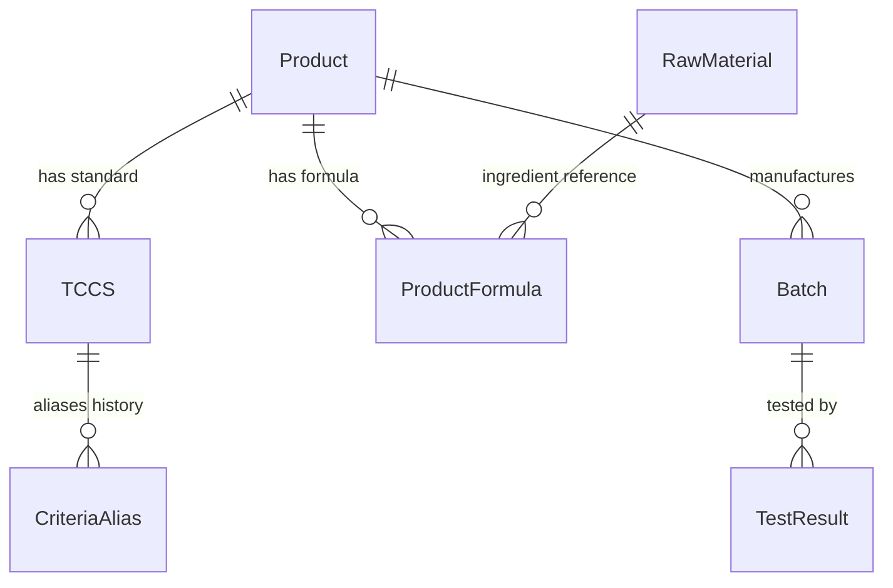

# 📘 TỔNG QUAN TOÀN DIỆN HỆ THỐNG PQM (PRODUCT QUALITY MANAGEMENT)
> **Phiên bản tài liệu:** 1.1.0  
> **Cập nhật lần cuối:** 2026-08-15  
> **Dự án:** Hệ thống Quản lý Chất lượng Sản phẩm & Kiểm nghiệm (PQM)

---

## 📌 0. QUY TẮC CỐT LÕI DÀNH CHO AI ASSISTANT (BẮT BUỘC TUÂN THỦ)
1. **Quét file này đầu tiên**: Mỗi khi bắt đầu một phiên làm việc, AI phải nắm toàn bộ kiến trúc, mô hình dữ liệu, phân hệ chức năng và luồng triển khai trong file này.
2. **Tự động cập nhật**: Mỗi khi có bất kỳ thay đổi nào trong dự án (thêm component, sửa logic, thêm route, đổi schema dữ liệu, thêm AI tool, v.v.), AI **BẮT BUỘC** phải cập nhật lại file này ngay sau khi hoàn thành nhiệm vụ để phản ánh trạng thái mới nhất của ứng dụng.
3. **Nhật ký thay đổi (Changelog)**: Ghi lại tóm tắt nội dung vừa cập nhật ở phần cuối tài liệu kèm ngày tháng.

---

## 1. GIỚI THIỆU VÀ MỤC TIÊU DỰ ÁN
**PQM (Product Quality Management)** là hệ thống quản lý chất lượng chuyên sâu dành cho ngành sản xuất y tế / dược phẩm / công nghệ sinh học (V-Biotech). 

### Mục tiêu chính:
- Quản lý toàn diện vòng đời sản phẩm: từ Hồ sơ sản phẩm, Tiêu chuẩn cơ sở (TCCS), Công thức định lượng, Nguyên liệu, Lô sản xuất đến Phiếu kiểm nghiệm (Test Results).
- Tự động hóa đánh giá Đạt/Không Đạt theo tiêu chuẩn kỹ thuật (định lượng hoạt chất, chỉ tiêu an toàn, vi sinh, cảm quan).
- Xuất phiếu phân tích thành phẩm (Certificate of Analysis - CoA) chuẩn hóa có mã QR xác thực.
- Phân tích xu hướng chất lượng (Trend Analysis), cảnh báo sớm các bất thường (Quality Alerts).
- Tích hợp **AI Thông minh đa cấp độ (Gemini 2.0)**: Tự động quét OCR kết quả kiểm nghiệm từ PDF/ảnh, tự học khớp nối chỉ tiêu (Semantic Mapping & Self-Learning), và hỗ trợ truy vấn thông minh.
- **Hệ thống phím tắt & Command Palette (`Ctrl+K`)**: Tìm kiếm tức thì và điều hướng siêu tốc trên toàn bộ hệ thống.

---

## 2. KIẾN TRÚC CÔNG NGHỆ & MÔI TRƯỜNG TRIỂN KHAI

### 2.1. Tech Stack
- **Frontend Core**: React 19, TypeScript (~5.8), Vite (v6), TailwindCSS v3.
- **State Management**: Zustand (tách biệt `useAppStore` cho dữ liệu nghiệp vụ & `useUIStore` cho giao diện/preferences).
- **Backend / BaaS**: Firebase Realtime Database (RTDB), Firebase Authentication, Firebase Storage.
- **Trí tuệ nhân tạo (AI)**: Google Generative AI SDK (`@google/generative-ai` - Gemini 2.0 Flash/Pro).
- **Trực quan hóa & Báo cáo**: Recharts (Biểu đồ xu hướng, phân bố), QRCode React, SheetJS/XLSX (Xuất Excel).
- **Kiểm thử**: Vitest (Unit Test - 40 tests passed), Playwright (E2E Test).

### 2.2. Kiến trúc Triển khai (Deployment Rules)
- **Môi trường Sản xuất**: Firebase Hosting (`https://v-biotech.web.app`) | Project ID: `v-biotech`.
- **Cấu hình Base URL**: 
  - Khi build Firebase: `base = '/'` (phục vụ từ root).
  - Khi chạy local: `base = './'`.
- **GitHub**: Chỉ dùng để **sao lưu mã nguồn**. Không dùng GitHub Pages.
- **Quy trình Deploy chuẩn**:
  ```bash
  npm run build
  npx firebase deploy --only hosting
  # Hoặc dùng script: npm run deploy
  ```

---

## 3. MÔ HÌNH DỮ LIỆU & SCHEMA (DATA ARCHITECTURE)

Dữ liệu được lưu trữ trên Firebase Realtime Database với cấu trúc JSON tối ưu:



### 3.1. Chi tiết các Thực thể (Entities):
1. **Product (`products/`)**:
   - `id`, `code`, `name`, `group`, `registrationNo`, `registrationDate`, `registrant`, `status` (`ACTIVE` | `DISCONTINUED` | `RECALLED`), `description`, `imageUrl`.
2. **TCCS - Tiêu chuẩn cơ sở (`tccsList/`)**:
   - `id`, `productId`, `code`, `issueDate`, `isActive`, `packaging`, `storage`, `shelfLife`, `standardRefs`.
   - `mainQualityCriteria`: Danh sách chỉ tiêu chất lượng chính (Tên, Đơn vị, Min, Max, Kiểu `NUMBER`/`TEXT`, `declaredContent`, `calculationBasis`).
   - `safetyCriteria`: Danh sách chỉ tiêu an toàn (vi sinh, kim loại nặng...).
   - `alternateRules`: Quy tắc kiểm tra bổ sung / kiểm tra lại khi không đạt (`FAIL_RETRY`, `CONDITIONAL_CHECK`).
3. **ProductFormula - Công thức sản phẩm (`productFormulas/`)**:
   - `id`, `productId`, `ingredients` (Hàm lượng công bố, hàm lượng nguyên tố, liên kết `materialId`), `excipients` (Tá dược), `sensory`, `packaging`, `storage`, `shelfLife`.
4. **RawMaterial - Danh mục nguyên liệu (`rawMaterials/`)**:
   - `id`, `code`, `name` (tên chuẩn), `aliases` (các tên gọi khác), `category` (`ACTIVE` | `EXCIPIENT` | `OTHER`), `description`.
5. **Batch - Lô sản xuất (`batches/`)**:
   - `id`, `productId`, `tccsId`, `batchNo`, `mfgDate`, `expDate`, `theoreticalYield`, `actualYield`, `yieldUnit`, `packaging`, `status` (`PENDING` | `TESTING` | `RELEASED` | `REJECTED`), `rejectReason`, `progressPercent`.
6. **TestResult - Phiếu kiểm nghiệm (`testResults/`)**:
   - `id`, `batchId`, `labName`, `testDate`, `overallStatus` (`PASS` | `FAIL`), `notes`, `attachments` (file đính kèm Drive/Firebase).
   - `results`: Mảng các `TestResultEntry` { `criteriaName`, `value`, `isPass`, `isExtra`, `unit`, `limit` }.
   - *Lưu ý*: Trường `batch` là Virtual Join trên UI, không lưu thừa vào RTDB.
7. **CriteriaAlias - Ánh xạ tên chỉ tiêu (`criteriaAliases/`)**:
   - Đảm bảo tương thích ngược khi TCCS đổi tên chỉ tiêu mà các phiếu kiểm nghiệm cũ vẫn đối chiếu chính xác.
8. **AILearnedMapping (`aiLearnedMappings/`)**:
   - Học máy từ người dùng: Ghi nhớ các cặp tên chỉ tiêu viết tắt/OCR -> Tên chuẩn hệ thống (`originalName` ↔ `systemName`, `frequency`).
9. **QualityAnomaly / Alerts**:
   - Cảnh báo trôi dạt chất lượng (`DRIFT`), sắp hết hạn (`EXPIRY`), tỷ lệ lỗi cao (`HIGH_FAIL_RATE`), thiếu dữ liệu (`MISSING_DATA`).

---

## 4. PHÂN QUYỀN & XÁC THỰC (AUTH & ROLES)

Hệ thống quản lý người dùng với 3 vai trò chính qua Firebase Auth & RTDB (`users/`):
- **`ADMIN`**: Toàn quyền quản trị hệ thống, thêm/sửa/xóa sản phẩm, TCCS, công thức, duyệt người dùng, quản lý Criteria Alias, cấu hình AI.
- **`USER`**: Nhân viên kiểm nghiệm / QA / QC: Xem dữ liệu, tạo và duyệt phiếu kiểm nghiệm, tạo lô sản xuất, xem báo cáo & CoA.
- **`GUEST`**: Tài khoản mới đăng ký chưa được duyệt, chỉ có quyền truy cập trang `/welcome`.

### Route Guards:
- `<ProtectedRoute>`: Yêu cầu đăng nhập và role khác GUEST.
- `<AdminRoute>`: Yêu cầu role ADMIN.
- `<GuestRoute>`: Dành cho role GUEST.
- `<PrintRoute>`: Cho phép xem/in CoA trực tiếp không có sidebar nhưng bắt buộc đã xác thực.

---

## 5. CẤU TRÚC THƯ MỤC & CÁC TRANG CHỨC NĂNG

```
src/
├── components/           # Component dùng chung (UI, Layout, Modal, Forms)
│   ├── features/         # Component nghiệp vụ chuyên sâu (AI, OCR, Charts)
│   ├── layout/           # Header, Sidebar, AppLayout, GlobalCommandPalette.tsx
│   └── ui/               # Button, Input, Modal, Badge, Skeleton, Toast...
├── hooks/                # Custom React Hooks (useKeyboardShortcuts, useCriteriaResolver...)
├── pages/                # Các trang chức năng chính
│   ├── auth/             # Login, Signup, ForgotPassword, Welcome, Unauthorized
│   ├── batches/          # Quản lý Lô sản xuất (List, Form, Detail)
│   ├── products/         # Quản lý Sản phẩm & Nguyên liệu (List, Form, Detail, Catalog)
│   ├── qa/               # Quản lý TCCS, Công thức, Chỉ tiêu, Phiếu kiểm nghiệm, CoA
│   ├── quality/          # Báo cáo tổng hợp, Phân tích xu hướng, Cảnh báo chất lượng
│   └── system/           # Dashboard, Quản lý User, Alias Manager, Settings, Search
├── providers/            # AppProvider, AuthProvider, v.v.
├── services/             # Giao tiếp Firebase, Storage & Business Logic
│   ├── ai/               # geminiService.ts, prompts.ts, aiTools.ts
│   ├── auditService.ts   # Ghi vết hoạt động người dùng
│   ├── authService.ts    # Đăng nhập, đăng ký, phân quyền
│   ├── criteriaAliasService.ts # Xử lý tương thích chỉ tiêu TCCS
│   ├── databaseService.ts# CRUD Firebase RTDB + Cascade Delete
│   ├── reportService.ts  # Tổng hợp dữ liệu & báo cáo thống kê
│   ├── storageService.ts # Dọn dẹp tệp tin mồ côi trên Firebase Storage
│   └── testResultService.ts # Xử lý kết quả kiểm nghiệm & tra cứu theo suffix
├── store/                # Zustand Stores (useAppStore, useUIStore)
├── types.ts              # TypeScript interfaces, enums, types toàn dự án
└── utils/                # Helper functions, offlineCache.ts, offlineMutationQueue.ts
```

---

## 6. HỆ THỐNG TRÍ TUỆ NHÂN TẠO (AI INTELLIGENCE SUITE)

Hệ thống AI dựa trên Google Gemini với 3 cấp độ:

1. **OCR & Extraction (Cấp độ 1)**:
   - Đọc trực tiếp file ảnh hoặc PDF phiếu kiểm nghiệm từ phòng Lab bên ngoài.
   - Nhận diện bảng chỉ tiêu, đơn vị tính, phương pháp và kết quả đo.
2. **Semantic Mapping & Auto-evaluation (Cấp độ 2)**:
   - Tự động đối chiếu tên chỉ tiêu tiếng Anh/Việt (ví dụ: *Moisture* -> *Độ ẩm*).
   - Tự động so sánh với Min/Max trong TCCS để gắn cờ Đạt/Không Đạt.
3. **Self-Learning & Action Agents (Cấp độ 3)**:
   - Học từ phản hồi người dùng: Khi user sửa mapping, AI tự lưu vào `aiLearnedMappings` để ghi nhớ cho các lần sau.
   - Hỗ trợ AI Tools (`aiTools.ts`): Tự động tìm kiếm sản phẩm, kiểm tra tồn kho lô, phân tích cảnh báo và soạn thảo đề xuất xử lý.

---

## 7. QUẢN LÝ STATE, OFFLINE QUEUE & STORAGE HYGIENE

- **`useAppStore`**: Quản lý toàn bộ danh sách Products, Batches, TCCS, TestResults, Realtime subscriptions với Firebase, phương thức thêm/sửa/xóa có hỗ trợ Optimistic Update.
- **`useUIStore`**: Quản lý Theme (Light/Dark mode), Sidebar collapse, User preferences (lưu theo từng User ID trong Cookie), Đường dẫn truy cập gần nhất (`lastVisitedPath`).
- **`offlineMutationQueue.ts` (IndexedDB v4)**: Đảm bảo độ bền vững dữ liệu khi offline: ghi lại các payload mutation khi mất mạng và tự động **Replay & Flush Queue** lên Firebase ngay khi có kết nối mạng trở lại.
- **`storageService.ts`**: Tự động dọn dẹp ảnh sản phẩm và file đính kèm trên Firebase Storage khi thực hiện cascade delete sản phẩm, lô hàng hoặc phiếu kiểm nghiệm, ngăn ngừa hoàn toàn tệp tin mồ côi.

---

## 8. LỆNH VẬN HÀNH & KIỂM THỬ THƯỜNG DÙNG

```bash
# 1. Khởi chạy môi trường phát triển (Local Dev)
npm run dev

# 2. Build ứng dụng sản xuất
npm run build

# 3. Deploy lên Firebase Hosting
npm run deploy

# 4. Chạy Unit Test (Vitest - 40 tests)
npm run test -- --run

# 5. Chạy End-to-End Test (Playwright)
npm run test:e2e
```

---

## 9. NHẬT KÝ CẬP NHẬT DỰ ÁN (PROJECT CHANGELOG)

| Ngày | Phiên bản | Nội dung thay đổi | Người thực hiện |
| :--- | :--- | :--- | :--- |
| **2026-08-15** | `1.1.7` | **Sửa lỗi tính toán giới hạn 0-0 và hiển thị danh sách Lô vượt giới hạn (Fail Batches)**: <br/>- Sửa lỗi khi TCCS chưa cấu hình Min/Max (hoặc giá trị 0-0) bị đánh dấu fail oan toàn bộ các lô đạt chuẩn trong [QualitySummaryReport.tsx](file:///d:/26%20Kiem%20nghiem/PQM/src/pages/quality/QualitySummaryReport.tsx).<br/>- Bổ sung helper `getCriterionLimitText` tự động fallback theo mức giới hạn thực tế của phiếu (`entry.limit`) hoặc hàm lượng công bố.<br/>- Đạt 45/45 tests passed 100% trong Vitest. | AI Pair Programmer |
| **2026-08-15** | `1.1.6` | **Nâng cấp Xử lý Lũy thừa & Tính toán Tỷ lệ % cho Mức yêu cầu / Vi sinh Probiotics**: <br/>- Chuẩn hóa phân tích giá trị dạng số khoa học / lũy thừa (`10^9`, `1.5 x 10^9 CFU/g`, `≥ 10^9`...) trong [criteriaEvaluation.ts](file:///d:/26%20Kiem%20nghiem/PQM/src/utils/criteriaEvaluation.ts).<br/>- Bổ sung cơ chế Fallback Basis thông minh trong [QualitySummaryReport.tsx](file:///d:/26%20Kiem%20nghiem/PQM/src/pages/quality/QualitySummaryReport.tsx) và [TrendAnalysisPage.tsx](file:///d:/26%20Kiem%20nghiem/PQM/src/pages/quality/TrendAnalysisPage.tsx) (`declaredContent` $\rightarrow$ `Min (≥)` $\rightarrow$ `Midpoint (Min+Max)/2` $\rightarrow$ `Max (≤)`), giúp tự động tính đúng 100% tỷ lệ % so với mức yêu cầu của TCCS/Công thức.<br/>- Đạt 45/45 tests passed 100% trong Vitest. | AI Pair Programmer |
| **2026-08-15** | `1.1.5` | **Mở rộng Tự động Nhận diện & Đối chiếu Chỉ tiêu Cũ/Mới trong Báo cáo tổng hợp**: <br/>- Nâng cấp `resolveCriteriaName` ([criteriaAliasService.ts](file:///d:/26%20Kiem%20nghiem/PQM/src/services/criteriaAliasService.ts)) & `useCriteriaResolver.ts` tự động fallback tra cứu qua Từ điển Dược khoa & AI Semantic Matching khi TCCS chưa khai báo alias thủ công.<br/>- Tích hợp `useCriteriaResolver` vào [QualitySummaryReport.tsx](file:///d:/26%20Kiem%20nghiem/PQM/src/pages/quality/QualitySummaryReport.tsx) và [reportService.ts](file:///d:/26%20Kiem%20nghiem/PQM/src/services/reportService.ts), giúp các phiếu kiểm nghiệm cũ dùng tên dài `probiotics (...)` tự động tổng hợp đầy đủ vào chỉ tiêu mới `Tổng số lợi khuẩn Bacillus`.<br/>- Đạt 44/44 tests passed 100% trong Vitest. | AI Pair Programmer |
| **2026-08-15** | `1.1.4` | **Nâng cấp Từ điển Dược khoa & AI Semantic Mapping cho Probiotics / Men vi sinh**: <br/>- Bổ sung nhóm chỉ tiêu `Tổng số lợi khuẩn Bacillus` cùng các biến thể probiotics (`Bacillus clausii`, `Bacillus subtilis`, `Lactobacillus sporogenes`, `Bào tử lợi khuẩn...`) vào `PHARMA_TERM_DICTIONARY` ([aiMapping.ts](file:///d:/26%20Kiem%20nghiem/PQM/src/utils/aiMapping.ts)).<br/>- Nâng cấp thuật toán `lookupPharmaTerm` với cơ chế ưu tiên Khớp chính xác và Longest Substring Match để tránh sai lệch do từ viết tắt ngắn.<br/>- Đạt 43 tests passed 100% trong Vitest. | AI Pair Programmer |
| **2026-08-15** | `1.1.3` | **Quét và rà soát toàn diện 34 trang nội dung (Comprehensive Content Pages Audit)**: <br/>- Rà soát toàn bộ 6 phân hệ (Auth, Batches, Products, QA, Quality Analytics, System).<br/>- Sửa triệt để lỗi tra cứu `batches` trong `CriteriaFormPage.tsx` khi đổi tên chỉ tiêu theo sản phẩm.<br/>- Bổ sung fallback an toàn cho mã lô và tên sản phẩm trong `TestResultList.tsx`.<br/>- Toàn bộ TypeScript Typecheck đạt 100% không lỗi (0 errors). | AI Pair Programmer |
| **2026-08-15** | `1.1.2` | **Nâng cấp AI Semantic Mapping nhận diện Nguyên tố & Dạng muối**: <br/>- Mở rộng `prompts.ts` bổ sung quy tắc suy luận đối chiếu nguyên tố (Zn, Fe, Ca, Mg...) $\leftrightarrow$ dạng muối (Kẽm gluconat, Sắt fumarat...).<br/>- Mở rộng `PHARMA_TERM_DICTIONARY` và thuật toán `isCriteriaMatch` tự động so khớp đồng nhóm hoạt chất.<br/>- Đạt 42 tests passed 100%. | AI Pair Programmer |
| **2026-08-15** | `1.1.1` | **Sửa lỗi hiển thị sản phẩm không rõ trong Danh mục Chỉ tiêu**: <br/>- Chuẩn hóa tra cứu quan hệ `testResults` $\rightarrow$ `batches` $\rightarrow$ `products` (khắc phục lỗi đọc thuộc tính `result.batch` ảo).<br/>- Xử lý nhãn rõ ràng cho các chỉ tiêu thuộc TCCS/Lô mồ côi (`Sản phẩm đã xóa`). | AI Pair Programmer |
| **2026-08-15** | `1.1.0` | **Nâng cấp chuẩn 10/10 Enterprise**: <br/>- Bổ sung `storageService.ts` dọn dẹp Storage cascade delete triệt để.<br/>- Bổ sung `offlineMutationQueue.ts` (IndexedDB v4) hàng đợi ngoại tuyến tự động Replay.<br/>- Bổ sung `GlobalCommandPalette.tsx` & `useKeyboardShortcuts.ts` (`Ctrl+K`, `Esc`, `Ctrl+S`).<br/>- Mở rộng Unit Test Suite đạt 40 tests passed 100%. | AI Pair Programmer |
| **2026-08-15** | `1.0.0` | Khởi tạo tài liệu Tổng quan toàn diện hệ thống PQM (`PROJECT_OVERVIEW.md`) và thiết lập quy tắc tự động quét & cập nhật trong `.agents/AGENTS.md`. | AI Pair Programmer |

---
*(Tài liệu này được tự động duy trì và cập nhật liên tục bởi AI Assistant)*
