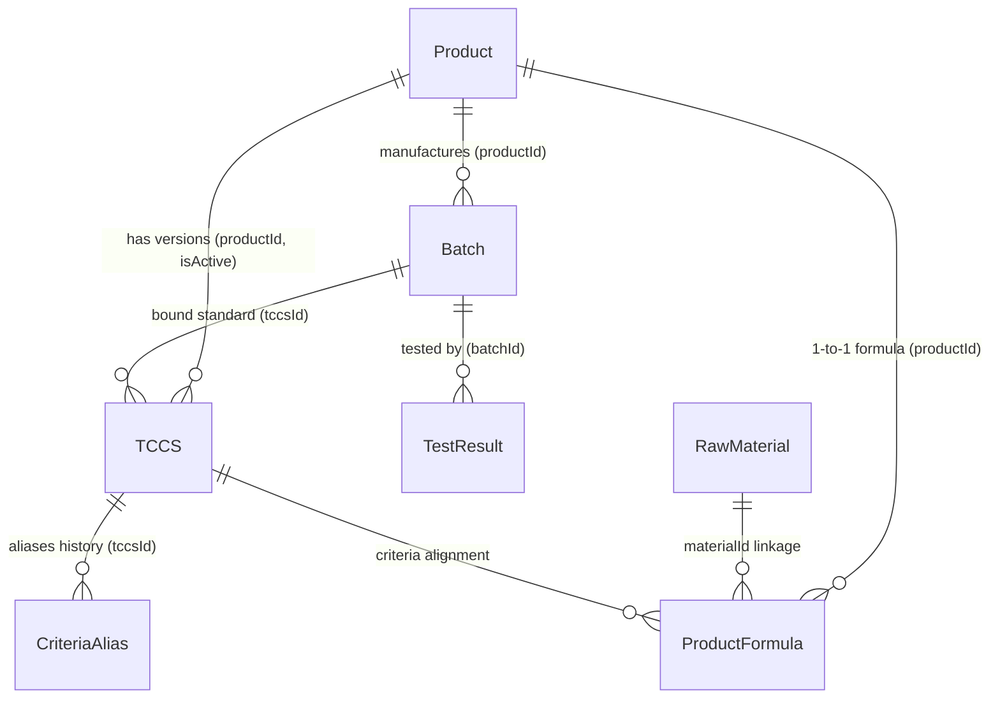

# ?? T?NG QUAN TO�N DI?N H? TH?NG PQM (PRODUCT QUALITY MANAGEMENT)
> **Phiên bản tài liệu:** 3.0.0-final  
> **Cập nhật lần cuối:** 2026-09-09  
> **D? �n:** H? th?ng Qu?n l� Ch?t lu?ng S?n ph?m & Ki?m nghi?m (PQM)

---

## ?? 0. QUY T?C C?T L�I D�NH CHO AI ASSISTANT (B?T BU?C TU�N TH?)
1. **Qu�t file n�y d?u ti�n**: M?i khi b?t d?u m?t phi�n l�m vi?c, AI ph?i n?m to�n b? ki?n tr�c, m� h�nh d? li?u, ph�n h? ch?c nang v� lu?ng tri?n khai trong file n�y.
2. **T? d?ng c?p nh?t**: M?i khi c� b?t k? thay d?i n�o trong d? �n (th�m component, s?a logic, th�m route, d?i schema d? li?u, th�m AI tool, v.v.), AI **B?T BU?C** ph?i c?p nh?t l?i file n�y ngay sau khi ho�n th�nh nhi?m v? d? ph?n �nh tr?ng th�i m?i nh?t c?a ?ng d?ng.
3. **Nh?t k� thay d?i (Changelog)**: Ghi l?i t�m t?t n?i dung v?a c?p nh?t ? ph?n cu?i t�i li?u k�m ng�y th�ng.

---

## 1. GI?I THI?U V� M?C TI�U D? �N
**PQM (Product Quality Management)** l� h? th?ng qu?n l� ch?t lu?ng chuy�n s�u d�nh cho ng�nh s?n xu?t y t? / du?c ph?m / c�ng ngh? sinh h?c (V-Biotech). 

### M?c ti�u ch�nh:
- Qu?n l� to�n di?n v�ng d?i s?n ph?m: t? H? so s?n ph?m, Ti�u chu?n co s? (TCCS), C�ng th?c d?nh lu?ng, Nguy�n li?u, L� s?n xu?t d?n Phi?u ki?m nghi?m (Test Results).
- T? d?ng h�a d�nh gi� �?t/Kh�ng �?t theo ti�u chu?n k? thu?t (d?nh lu?ng ho?t ch?t, ch? ti�u an to�n, vi sinh, c?m quan).
- Xu?t phi?u ph�n t�ch th�nh ph?m (Certificate of Analysis - CoA) chu?n h�a c� m� QR x�c th?c.
- Ph�n t�ch xu hu?ng ch?t lu?ng (Trend Analysis), c?nh b�o s?m c�c b?t thu?ng (Quality Alerts).
- **H? th?ng Ki?m so�t & H�n g?n To�n v?n D? li?u (Data Consistency & Auto-Healing Engine)**: T? d?ng r� so�t 6 nh�m to�n v?n li�n k?t th?c th? (b?n ghi m? c�i, sai l?ch li�n k?t ch�o, b?t nh?t qu�n logic, m?t li�n k?t nguy�n li?u, l?ch c�ng th?c - TCCS, tr�ng m�) v� cung c?p co ch? Auto-Heal 1-click.
- **Unified Entity Relationship Graph (`useDataGraph.ts`)**: M?ng lu?i li�n k?t 2 chi?u ho�n ch?nh cho to�n b? 7 th?c th? d? li?u trong h? th?ng.
- T�ch h?p **AI Th�ng minh da c?p d? (Gemini 2.5/2.0)**: T? d?ng qu�t OCR k?t qu? ki?m nghi?m t? PDF nhi?u trang (Canvas Rasterizer & Smart Chunking) / ?nh, t? h?c kh?p n?i ch? ti�u (Semantic Mapping & Self-Learning), v� h? tr? truy v?n th�ng minh.
- **H? th?ng ph�m t?t & Command Palette (`Ctrl+K`)**: T�m ki?m t?c th� v� di?u hu?ng si�u t?c tr�n to�n b? h? th?ng.

---

## 2. KI?N TR�C C�NG NGH? & M�I TRU?NG TRI?N KHAI

### 2.1. Tech Stack
- **Frontend Core**: React 19, TypeScript (~5.8), Vite (v6), TailwindCSS v3.
- **State Management**: Zustand (t�ch bi?t `useAppStore` cho d? li?u nghi?p v? & `useUIStore` cho giao di?n/preferences).
- **Graph & Consistency Layer**: `useDataGraph` (Full 2-Way Hydration Graph) & `dataConsistencyService` (Audit & Auto-Heal).
- **Backend / BaaS**: Firebase Realtime Database (RTDB), Firebase Authentication, Firebase Storage.
- **Tr� tu? nh�n t?o (AI)**: Google Generative AI SDK (`@google/generative-ai` - Gemini 2.5 Flash/Pro, Gemini 2.0 Flash).
- **X? l� PDF client-side**: `pdfjs-dist` (Render PDF nhi?u trang sang ?nh JPEG Canvas t?i uu dung lu?ng).
- **Tr?c quan h�a & B�o c�o**: Recharts (Bi?u d? xu hu?ng, ph�n b?), QRCode React, SheetJS/XLSX (Xu?t Excel).
- **Kiểm thử**: Vitest (Unit Test - 390 tests passed 100% across 60 test suites), Playwright (E2E Test - 6 tests passed 100% across 4 test suites).
- **CI/CD T? d?ng h�a**: GitHub Actions Pipeline 3 c�ng do?n (`.github/workflows/ci-cd.yml`): Unit Test (Vitest) -> E2E Test (Playwright) -> Build & Deploy Firebase Hosting.

### 2.2. Ki?n tr�c Tri?n khai (Deployment Rules)
- **M�i tru?ng S?n xu?t**: Firebase Hosting (`https://v-biotech.web.app`) | Project ID: `v-biotech`.
- **C?u h�nh Base URL**: 
  - Khi build Firebase: `base = '/'` (ph?c v? t? root).
  - Khi ch?y local: `base = './'`.
- **GitHub**: Ch? d�ng d? **sao luu m� ngu?n**. Kh�ng d�ng GitHub Pages.
- **Quy tr�nh Deploy chu?n**:
  ```bash
  npm run build
  npx firebase deploy --only hosting
  # Ho?c d�ng script: npm run deploy
  ```

---

## 3. M� H�NH D? LI?U & SCHEMA (DATA ARCHITECTURE)

D? li?u du?c luu tr? tr�n Firebase Realtime Database v?i c?u tr�c JSON t?i uu v� d? th? li�n k?t ch?t ch?:



### 3.1. Chi ti?t c�c Th?c th? (Entities):
1. **Product (`products/`)**:
   - `id`, `code`, `name`, `group`, `registrationNo`, `registrationDate`, `registrant`, `status` (`ACTIVE` | `DISCONTINUED` | `RECALLED`), `description`, `imageUrl`.
2. **TCCS - Ti�u chu?n co s? (`tccsList/`)**:
   - `id`, `productId`, `code`, `issueDate`, `isActive`, `packaging`, `storage`, `shelfLife`, `standardRefs`.
   - `mainQualityCriteria`: Danh s�ch ch? ti�u ch?t lu?ng ch�nh (T�n, �on v?, Min, Max, Ki?u `NUMBER`/`TEXT`, `declaredContent`, `calculationBasis`).
   - `safetyCriteria`: Danh s�ch ch? ti�u an to�n (vi sinh, kim lo?i n?ng...).
   - `alternateRules`: Quy t?c ki?m tra b? sung / ki?m tra l?i khi kh�ng d?t (`FAIL_RETRY`, `CONDITIONAL_CHECK`).
3. **ProductFormula - C�ng th?c s?n ph?m (`productFormulas/`)**:
   - `id`, `productId`, `ingredients` (H�m lu?ng c�ng b?, h�m lu?ng nguy�n t?, li�n k?t `materialId`), `excipients` (T� du?c), `sensory`, `packaging`, `storage`, `shelfLife`.
4. **RawMaterial - Danh m?c nguy�n li?u (`rawMaterials/`)**:
   - `id`, `code` (m� qu?n l� nguy�n li?u n?i b?: `NL-GINKGO-01`...), `name` (t�n g?c/chu?n qu?c t?), `aliases` (c�c t�n g?i kh�c, t�n thuong m?i, t�n vi?t t?t), `category` (`ACTIVE` | `EXCIPIENT` | `OTHER`), `standard` (ti�u chu?n �p d?ng: D�VN V, USP, Ph.Eur, BP, TCCS-NSX...), `casNumber` (m� d?nh danh h�a ch?t qu?c t? CAS), `description`.
5. **Batch - L� s?n xu?t (`batches/`)**:
   - `id`, `productId`, `tccsId`, `batchNo`, `mfgDate`, `expDate`, `theoreticalYield`, `actualYield`, `yieldUnit`, `packaging`, `status` (`PENDING` | `TESTING` | `RELEASED` | `REJECTED`), `rejectReason`, `progressPercent`.
6. **TestResult - Phi?u ki?m nghi?m (`testResults/`)**:
   - `id`, `batchId`, `labName`, `testDate`, `overallStatus` (`PASS` | `FAIL`), `notes`, `attachments` (file d�nh k�m Drive/Firebase).
   - `results`: M?ng c�c `TestResultEntry` { `criteriaName`, `value`, `isPass`, `isExtra`, `unit`, `limit` }.
   - *Luu �*: Tru?ng `batch` l� Virtual Join tr�n UI, kh�ng luu th?a v�o RTDB.
7. **CriteriaAlias - �nh x? t�n ch? ti�u (`criteriaAliases/`)**:
   - �?m b?o tuong th�ch ngu?c khi TCCS d?i t�n ch? ti�u m� c�c phi?u ki?m nghi?m cu v?n d?i chi?u ch�nh x�c.
8. **AILearnedMapping (`aiLearnedMappings/`)**:
   - H?c m�y t? ngu?i d�ng: Ghi nh? c�c c?p t�n ch? ti�u vi?t t?t/OCR -> T�n chu?n h? th?ng (`originalName` ? `systemName`, `frequency`).
9. **QualityAnomaly / Alerts**:
   - C?nh b�o tr�i d?t ch?t lu?ng (`DRIFT`), s?p h?t h?n (`EXPIRY`), t? l? l?i cao (`HIGH_FAIL_RATE`), thi?u d? li?u (`MISSING_DATA`).

---

## 4. PH�N QUY?N & X�C TH?C (AUTH & ROLES)

H? th?ng qu?n l� ngu?i d�ng v?i 3 vai tr� ch�nh qua Firebase Auth & RTDB (`users/`):
- **`ADMIN`**: To�n quy?n qu?n tr? h? th?ng, th�m/s?a/x�a s?n ph?m, TCCS, c�ng th?c, duy?t ngu?i d�ng, qu?n l� Criteria Alias, c?u h�nh AI.
- **`USER`**: Nh�n vi�n ki?m nghi?m / QA / QC: Xem d? li?u, t?o v� duy?t phi?u ki?m nghi?m, t?o l� s?n xu?t, xem b�o c�o & CoA.
- **`GUEST`**: T�i kho?n m?i dang k� chua du?c duy?t, ch? c� quy?n truy c?p trang `/welcome`.

---

## 5. C?U TR�C PH�N H? V� ROUTING

H? th?ng du?c t? ch?c th�nh 6 ph�n h? l?n:

| Ph�n h? | Route ch�nh | M� t? ch?c nang |
| :--- | :--- | :--- |
| **Auth** | `/login`, `/signup`, `/forgot-password`, `/welcome`, `/unauthorized` | �ang nh?p, ph�n quy?n, c?p quy?n truy c?p. |
| **Batches** | `/batches`, `/batches/new`, `/batches/:id`, `/batches/:id/edit` | Qu?n l� L� s?n xu?t, ti?n d?, duy?t xu?t xu?ng. |
| **Products** | `/products`, `/products/new`, `/products/:id`, `/materials`, `/product-formulas` | Qu?n l� H? so s?n ph?m, Trung t�m Qu?n l� Nguy�n li?u & Th�nh ph?n (Material Hub 3-Tab), C�ng th?c d?nh lu?ng. |
| **QA / Testing**| `/test-results`, `/test-results/new`, `/test-results/:id/edit`, `/tccs`, `/criteria` | Nh?p k?t qu? ki?m nghi?m (OCR AI), TCCS, Qu?n l� Ch? ti�u & Alias. |
| **Quality Analytics**| `/dashboard`, `/trend-analysis`, `/alerts`, `/quality-summary-report` | Dashboard ph�n t�ch xu hu?ng, SPC, c?nh b�o r?i ro, B�o c�o t?ng h?p. |
| **Public / Reports**| `/test-results/print/:id`, `/verify/:id` | Xem & in ?n CoA chu?n h�a, Trang qu�t m� QR x�c th?c ch?ng ch?. |
| **System** | `/settings`, `/users`, `/audit-logs` | C?u h�nh Google Drive, c�i d?t Model AI, Nh?t k� ki?m to�n (Audit Log). |

---

## 6. H? TH?NG TR� TU? NH�N T?O (AI INTELLIGENCE SUITE 2.0)

H? th?ng AI d?a tr�n Google Gemini v?i 5 c?p d? v� 4 ph�n h? th�ng minh chuy�n s�u cho ng�nh Du?c ph?m/Ki?m nghi?m:

1. **OCR & Extraction (C?p d? 1 � N�ng c?p v1.5.1)**:
   - **X? l� tri?t d? PDF nhi?u trang (Canvas Rasterizer + Smart Chunking)**:
     - T? d?ng chuy?n d?i t?ng trang PDF sang ?nh JPEG t?i uu (1600px, 0.85 quality) b?ng Canvas + `pdfjs-dist`. Gi?m 85% dung lu?ng truy?n t?i.
     - Ph�n do?n th�ng minh (Chunking 3 trang/lu?t cho t�i li?u d�i > 3 trang), lo?i b? 100% nguy co tr�n token, socket timeout ho?c l?i HTTP 500/503 t? Google server.
     - G?p k?t qu? th�ng minh t? c�c d?t qu�t (`testResults`, `notes`, `batchNo`, `labName`...).
   - **Batch Scan**: Upload v� x? l� song song nhi?u file PDF/?nh c�ng l�c (`Promise.all`), hi?n th? `BatchScanProgressModal` per-file.
   - **Streaming Progress**: Callback `onProgress(step, percent)` theo t?ng bu?c x? l� th?c t?, hi?n th? ti?n d? real-time tr�n UI.
   - **Fallback Model**: T? d?ng chuy?n t? `gemini-2.5-flash` ? `gemini-2.0-flash` khi g?p l?i 503/429, k�m exponential backoff (2s?4s?8s).
   - **Prompt OCR n�ng cao**: B? sung 4 guide m?i � `HANDWRITING_GUIDE` (ch? tay, s? nh�e), `MULTI_COLUMN_GUIDE` (phi?u da c?t, nhi?u trang), `WATERMARK_STAMP_GUIDE` (b? qua watermark/con d?u), `VN_LAB_TERMINOLOGY` (nh?n di?n Quatest 3, CASE, Eurofins...).
   - **Schema m? r?ng**: AI tr? v? th�m `pageCount`, `documentType` (External_Lab|Internal|CoA|Supplier_CoA), `notes` (ghi ch� d?c bi?t), `analysisMethod` (HPLC, UV-Vis...) cho t?ng ch? ti�u.
2. **Semantic Mapping & Auto-evaluation (C?p d? 2)**:
   - T? d?ng d?i chi?u t�n ch? ti�u ti?ng Anh/Vi?t qua t? di?n du?c h?c `PHARMA_TERM_DICTIONARY` v� thu?t to�n Dice Coefficient/fuzzy semantic matching (v� d?: *Moisture* -> *�? ?m*).
   - T? d?ng so s�nh v?i Min/Max trong TCCS ho?c c�ng th?c s?n ph?m (�20%) d? g?n c? �?t/Kh�ng �?t.
3. **Self-Learning & Action Agents (C?p d? 3)**:
   - H?c t? ph?n h?i ngu?i d�ng: Khi user s?a mapping, AI t? luu v�o `aiLearnedMappings` d? ghi nh? cho c�c l?n sau.
   - H? tr? AI Tools (`aiTools.ts`): B? sung `compareLabResults`, `predictQualityStability`, `auditDataIntegrity`, `getAIInsights`, `generateOOSInvestigation`.
   - **Auto-Create Batch khi upload phi?u KN**: Khi AI d?c du?c `batchNo` t? phi?u KN nhung l� chua t?n t?i trong h? th?ng, t? d?ng m? `AutoCreateBatchModal` v?i th�ng tin pre-filled. Match s?n ph?m theo th? t? uu ti�n: 1) `productCode` (exact/partial), 2) `productName` (fuzzy). Sau khi user x�c nh?n, t?o l� m?i v?i `status=TESTING` v� g?n ngay v�o phi?u KN.
4. **Active & Autonomous Self-Learning (`autoLearningService.ts` - C?p d? 4)**:
   - **Post-OCR Auto-Learn**: T? d?ng h?c t? c�c �nh x? nh?n di?n th�nh c�ng (high-confidence) ngay khi OCR m� kh�ng c?n ch? ngu?i d�ng can thi?p th? c�ng.
   - **Pattern Mining & Dictionary Suggestion**: Ph�t hi?n c�c c?p �nh x? c� t?n su?t cao ($\ge 3$ l?n) d? g?i � b? sung v�o t? di?n ti�u chu?n.
   - **AI Quality Insight Engine**: T? d?ng ph�n t�ch to�n di?n d? li?u (t? l? l?i theo s?n ph?m, tr�i ch? ti�u qua c�c l�, r?i ro h?n d�ng) d? sinh insight ch? d?ng m?i ng�y (**AI Morning Briefing**).
   - **Contextual Session Memory**: T? d?ng t�m t?t c�c cu?c h?i tho?i tru?c v� duy tr� ng? c?nh li�n phi�n chat theo t?ng User ID.
5. **PQM AI Intelligence Suite 2.0 (4 Ph�n h? AI Chuy�n s�u Chu?n Du?c ph?m/GMP - C?p d? 5)**:
   - **Ph�n h? 1: AI �?i chi?u �a phi?u & Directional Lab Bias Engine (`labComparisonService.ts`, `LabComparisonModal.tsx`)**:
     - So s�nh Side-by-Side 2 phi?u lab (n?i b? vs QUATEST 3 / CASE / NIFC / Eurofins).
     - **Censored Data %RPD Algorithm (ICH Q2 & US EPA Substitution $L/2$)**: X? l� d? li?u ki?m nghi?m du?i ngu?ng ph�t hi?n (`KPH`, `< LOD`, `< LOQ`). $RPD=0\%$ khi c? hai d?u KPH ho?c gi� tr? do $\le LOD$; C?nh b�o b?t thu?ng khi gi� tr? do th?c t? vu?t xa ngu?ng LOD c?a ph�ng ngo?i ki?m.
     - **Directional Lab Bias Engine (`computeLabBias`)**: ��nh gi� khuynh hu?ng sai s? h? th?ng c� d?nh hu?ng (`SOURCE1_HIGHER`, `SOURCE2_HIGHER`, `BALANCED`), t�nh bias ratio % v� m?c d? tin c?y (Confidence Level), t? d?ng xu?t khuy?n ngh? h�nh d?ng th?c ch?ng cho ph�ng �?m b?o Ch?t lu?ng (QA).
     - **Lab Comparison Modal UI**: Th? Lab Bias Overview tr?c quan v?i thanh do t? l? sai l?ch, huy hi?u phuong ph�p th? v� ngu?ng ph�t hi?n KPH/LOD cho t?ng ch? ti�u.
   - **Ph�n h? 2: Tr? l� Nh?p li?u Gi?ng n�i Voice-to-Data (`voiceParserService.ts`, `VoiceInputButton.tsx`)**: Nh?n di?n gi?ng n�i ti?ng Vi?t, t? d?ng chu?n h�a s? do du?c h?c v� di?n b?ng k?t qu?.
   - **Ph�n h? 3: D? b�o �?ng h?c Suy gi?m & H?n d�ng s?m (`stabilityPredictionService.ts`, `TrendAnalysisPage.tsx`)**: Ph�n t�ch suy gi?m ICH Q1A, t�nh $k$, $R^2$, u?c t�nh th?i di?m ch?m Min spec ($t_{90}$) v� c?nh b�o h?t h?n s?m.
   - **Ph�n h? 4: AI Gi�m s�t To�n v?n D? li?u ALCOA+ (`dataIntegrityService.ts`)**: Qu�t Audit Trail, ph�t hi?n s?a d?i nhi?u l?n, thao t�c ngo�i gi?, t�nh di?m Data Integrity Score (0-100).
6. **PQM End-to-End AI Copilot & Embedded Intelligence (G?n k?t AI To�n di?n - C?p d? 6)**:
   - **Context-Aware Floating AI Copilot ([AIAssistantChat.tsx](file:///D:/26%20Kiem%20nghiem/PQM/src/components/features/AIAssistantChat.tsx))**: T? d?ng nh?n di?n trang & th?c th? hi?n t?i (`/batches/:id`, `/products/:id`, `/tccs`, `/quality-summary-report`, `/audit-logs`) d? sinh c�c n�t t�c v? nhanh (Contextual Prompt Chips) v� n?p ng? c?nh v�o c�u tr? l?i c?a AI.
   - **AI Batch Quality Clearance Dossier ([batchClearanceService.ts](file:///D:/26%20Kiem%20nghiem/PQM/src/services/ai/batchClearanceService.ts), [AIBatchClearanceModal.tsx](file:///D:/26%20Kiem%20nghiem/PQM/src/components/features/AIBatchClearanceModal.tsx))**: T? d?ng gom d? li?u (k?t qu? ki?m nghi?m, ti?n d? TCCS, nguy co ti?m c?n ngu?ng, l?ch s? l�, audit trail) d? dua ra khuy?n ngh? duy?t xu?t xu?ng (**RELEASE**), duy?t c� di?u ki?n (**CONDITIONAL**) ho?c t?m gi? di?u tra (**HOLD**).
   - **AI TCCS Validator & Formulator ([tccsAssistantService.ts](file:///D:/26%20Kiem%20nghiem/PQM/src/services/ai/tccsAssistantService.ts), [TCCSFormPage.tsx](file:///D:/26%20Kiem%20nghiem/PQM/src/pages/qa/TCCSFormPage.tsx))**: G?i � danh m?c ch? ti�u theo Du?c di?n VN V / USP (vi�n n�n, nang, siro, c?m, thu?c ti�m...) v� t? d?ng d?ng b? kho?ng d?nh lu?ng $\pm 5\% / \pm 10\% / \pm 20\%$ t? c�ng th?c s?n ph?m, k�m c?nh b�o m�u thu?n th?i gian th?c.
   - **AI PQR / APR Narrative Generator ([pqrNarrativeService.ts](file:///D:/26%20Kiem%20nghiem/PQM/src/services/ai/pqrNarrativeService.ts), [QualitySummaryReport.tsx](file:///D:/26%20Kiem%20nghiem/PQM/src/pages/quality/QualitySummaryReport.tsx))**: T? d?ng so?n th?o ph?n *Nh?n x�t & ��nh gi� T?ng th? Ch?t lu?ng (Executive Quality Conclusion)* chu?n GMP g?m 4 ph?n chuy�n m�n d? xu?t b�o c�o PQR/APR.
   - **ALCOA+ Data Integrity Watchdog Widget ([ALCOAWatchdogWidget.tsx](file:///D:/26%20Kiem%20nghiem/PQM/src/components/features/ALCOAWatchdogWidget.tsx), [AuditLogPage.tsx](file:///D:/26%20Kiem%20nghiem/PQM/src/pages/system/AuditLogPage.tsx))**: Nh�ng tr?c ti?p b?ng di?m Data Integrity Score (0-100), ph�n r� 6 nguy�n t?c ALCOA+ v� danh s�ch c?nh b�o vi ph?m th?i gian th?c l�n d?u trang Audit Log.
7. **PQM Predictive & Proactive AI Engine (AI Ch? d?ng & D? b�o Tuong lai - C?p d? 7)**:
   - **Ph�n h? 1: AI Natural Language Query Engine ([nlQueryService.ts](file:///D:/26%20Kiem%20nghiem/PQM/src/services/ai/nlQueryService.ts), tool `queryDataNaturalLanguage`)**: Truy v?n d? li?u to�n h? th?ng b?ng ti?ng Vi?t t? nhi�n.
   - **Ph�n h? 2: AI Smart Deviation Report Generator ([deviationReportService.ts](file:///D:/26%20Kiem%20nghiem/PQM/src/services/ai/deviationReportService.ts), [DeviationReportModal.tsx](file:///D:/26%20Kiem%20nghiem/PQM/src/components/features/DeviationReportModal.tsx), tool `generateDeviationReport`)**: T? d?ng sinh b�o c�o sai l?ch chu?n GMP-WHO/FDA d?y d? 6 ph?n.
   - **Ph�n h? 3: AI Proactive Smart Alert Engine ([smartAlertService.ts](file:///D:/26%20Kiem%20nghiem/PQM/src/services/ai/smartAlertService.ts), [AlertsPage.tsx](file:///D:/26%20Kiem%20nghiem/PQM/src/pages/quality/AlertsPage.tsx))**: T? d?ng qu�t v� ph�t hi?n 5 lo?i pattern nguy hi?m.
   - **Ph�n h? 4: AI Batch Genealogy Tracer ([batchGenealogyService.ts](file:///D:/26%20Kiem%20nghiem/PQM/src/services/ai/batchGenealogyService.ts), [BatchGenealogyModal.tsx](file:///D:/26%20Kiem%20nghiem/PQM/src/components/features/BatchGenealogyModal.tsx), [BatchDetailPage.tsx](file:///D:/26%20Kiem%20nghiem/PQM/src/pages/batches/BatchDetailPage.tsx))**: X�y d?ng c�y truy v?t 5 t?ng v� ch?m di?m Traceability Score.
   - **Ph�n h? 5: AI Predictive Incoming Inspection ([predictiveInspectionService.ts](file:///D:/26%20Kiem%20nghiem/PQM/src/services/ai/predictiveInspectionService.ts))**: D? b�o x�c su?t PASS/FAIL tru?c khi ki?m nghi?m.
   - **Ph�n h? 6: AI Material Harmonization & Deduplication Engine ([materialHarmonizerService.ts](file:///D:/26%20Kiem%20nghiem/PQM/src/services/ai/materialHarmonizerService.ts), [MaterialList.tsx](file:///D:/26%20Kiem%20nghiem/PQM/src/pages/products/MaterialList.tsx))**: T? d?ng qu�t v� ph�n t�ch d? tuong d?ng ng? nghia gi?a c�c nguy�n li?u trong danh m?c Master Catalog, ph�t hi?n c�c nguy�n li?u b? t?o tr�ng l?p (v� d?: "Cao kh� B?ch qu?", "Ginkgo Biloba Extract", "Chi?t xu?t b?ch qu?"), d? xu?t k? ho?ch g?p (Merge Plan) gi? 1 t�n chu?n v� chuy?n c�c t�n c�n l?i th�nh Aliases, d?ng th?i t? d?ng c?p nh?t li�n k?t `materialId` cho to�n b? c�c c�ng th?c s?n ph?m li�n quan.

---

## 7. QU?N L� STATE, OFFLINE QUEUE & STORAGE HYGIENE

- **`useAppStore`**: Qu?n l� to�n b? danh s�ch Products, Batches, TCCS, TestResults, RawMaterials, Realtime subscriptions v?i Firebase, phuong th?c th�m/s?a/x�a c� h? tr? Optimistic Update.
- **`useUIStore`**: Qu?n l� Theme (Light/Dark mode), Sidebar collapse, User preferences (luu theo t?ng User ID trong Cookie), �u?ng d?n truy c?p g?n nh?t (`lastVisitedPath`), Material view mode (Grid/List).
- **`offlineMutationQueue.ts` (IndexedDB v4)**: �?m b?o d? b?n v?ng d? li?u khi offline: ghi l?i c�c payload mutation khi m?t m?ng v� t? d?ng **Replay & Flush Queue** l�n Firebase ngay khi c� k?t n?i m?ng tr? l?i.
- **`storageService.ts`**: T? d?ng d?n d?p ?nh s?n ph?m v� file d�nh k�m tr�n Firebase Storage khi th?c hi?n cascade delete s?n ph?m, l� h�ng ho?c phi?u ki?m nghi?m, ngan ng?a ho�n to�n t?p tin m? c�i.

---

## 8. L?NH V?N H�NH & KI?M TH? THU?NG D�NG

```bash
# 1. Kh?i ch?y m�i tru?ng ph�t tri?n (Local Dev)
npm run dev

# ?? T?NG QUAN TON DI?N H? TH?NG PQM (PRODUCT QUALITY MANAGEMENT)
> **Phiên bản tài liệu:** 3.0.0-final  
> **Cập nhật lần cuối:** 2026-09-09  
> **D? n:** H? th?ng Qu?n l Ch?t lu?ng S?n ph?m & Ki?m nghi?m (PQM)

---

## ?? 0. QUY T?C C?T LI DNH CHO AI ASSISTANT (B?T BU?C TUN TH?)
1. **Qut file ny d?u tin**: M?i khi b?t d?u m?t phin lm vi?c, AI ph?i n?m ton b? ki?n trc, m hnh d? li?u, phn h? ch?c nang v lu?ng tri?n khai trong file ny.
2. **T? d?ng c?p nh?t**: M?i khi c b?t k? thay d?i no trong d? n (thm component, s?a logic, thm route, d?i schema d? li?u, thm AI tool, v.v.), AI **B?T BU?C** ph?i c?p nh?t l?i file ny ngay sau khi hon thnh nhi?m v? d? ph?n nh tr?ng thi m?i nh?t c?a ?ng d?ng.
3. **Nh?t k thay d?i (Changelog)**: Ghi l?i tm t?t n?i dung v?a c?p nh?t ? ph?n cu?i ti li?u km ngy thng.

---

## 1. GI?I THI?U V M?C TIU D? N
**PQM (Product Quality Management)** l h? th?ng qu?n l ch?t lu?ng chuyn su dnh cho ngnh s?n xu?t y t? / du?c ph?m / cng ngh? sinh h?c (V-Biotech). 

### M?c tiu chnh:
- Qu?n l ton di?n vng d?i s?n ph?m: t? H? so s?n ph?m, Tiu chu?n co s? (TCCS), Cng th?c d?nh lu?ng, Nguyn li?u, L s?n xu?t d?n Phi?u ki?m nghi?m (Test Results).
- T? d?ng ha dnh gi ?t/Khng ?t theo tiu chu?n k? thu?t (d?nh lu?ng ho?t ch?t, ch? tiu an ton, vi sinh, c?m quan).
- Xu?t phi?u phn tch thnh ph?m (Certificate of Analysis - CoA) chu?n ha c m QR xc th?c.
- Phn tch xu hu?ng ch?t lu?ng (Trend Analysis), c?nh bo s?m cc b?t thu?ng (Quality Alerts).
- **H? th?ng Ki?m sot & Hn g?n Ton v?n D? li?u (Data Consistency & Auto-Healing Engine)**: T? d?ng r sot 6 nhm ton v?n lin k?t th?c th? (b?n ghi m? ci, sai l?ch lin k?t cho, b?t nh?t qun logic, m?t lin k?t nguyn li?u, l?ch cng th?c - TCCS, trng m) v cung c?p co ch? Auto-Heal 1-click.
- **Unified Entity Relationship Graph (`useDataGraph.ts`)**: M?ng lu?i lin k?t 2 chi?u hon ch?nh cho ton b? 7 th?c th? d? li?u trong h? th?ng.
- Tch h?p **AI Thng minh da c?p d? (Gemini 2.5/2.0)**: T? d?ng qut OCR k?t qu? ki?m nghi?m t? PDF nhi?u trang (Canvas Rasterizer & Smart Chunking) / ?nh, t? h?c kh?p n?i ch? tiu (Semantic Mapping & Self-Learning), v h? tr? truy v?n thng minh.
- **H? th?ng phm t?t & Command Palette (`Ctrl+K`)**: Tm ki?m t?c th v di?u hu?ng siu t?c trn ton b? h? th?ng.

---

## 2. KI?N TRC CNG NGH? & MI TRU?NG TRI?N KHAI

### 2.1. Tech Stack
- **Frontend Core**: React 19, TypeScript (~5.8), Vite (v6), TailwindCSS v3.
- **State Management**: Zustand (tch bi?t `useAppStore` cho d? li?u nghi?p v? & `useUIStore` cho giao di?n/preferences).
- **Graph & Consistency Layer**: `useDataGraph` (Full 2-Way Hydration Graph) & `dataConsistencyService` (Audit & Auto-Heal).
- **Backend / BaaS**: Firebase Realtime Database (RTDB), Firebase Authentication, Firebase Storage.
- **Tr tu? nhn t?o (AI)**: Google Generative AI SDK (`@google/generative-ai` - Gemini 2.5 Flash/Pro, Gemini 2.0 Flash).
- **X? l PDF client-side**: `pdfjs-dist` (Render PDF nhi?u trang sang ?nh JPEG t?i uu dung lu?ng).
- **Tr?c quan ha & Bo co**: Recharts (Bi?u d? xu hu?ng, phn b?), QRCode React, SheetJS/XLSX (Xu?t Excel).
- **Ki?m th?**: Vitest (Unit Test - 339 tests passed 100% across 51 test suites), Playwright (E2E Test - 6 tests passed 100% across 4 test suites).
- **CI/CD T? d?ng ha**: GitHub Actions Pipeline 3 cng do?n (`.github/workflows/ci-cd.yml`): Unit Test (Vitest) -> E2E Test (Playwright) -> Build & Deploy Firebase Hosting.

### 2.2. Ki?n trc Tri?n khai (Deployment Rules)
- **Mi tru?ng S?n xu?t**: Firebase Hosting (`https://v-biotech.web.app`) | Project ID: `v-biotech`.
- **C?u hnh Base URL**: 
  - Khi build Firebase: `base = '/'` (ph?c v? t? root).
  - Khi ch?y local: `base = './'`.
- **GitHub**: Ch? dng d? **sao luu m ngu?n**. Khng d?ng GitHub Pages.
- **Quy trnh Deploy chu?n**:
  ```bash
  npm run build
  npx firebase deploy --only hosting
  # Ho?c dng script: npm run deploy
  ```

---

## 3. M HNH D? LI?U & SCHEMA (DATA ARCHITECTURE)

D? li?u du?c luu tr? trn Firebase Realtime Database v?i c?u trc JSON t?i uu v d? th? lin k?t ch?t ch?:


### 3.1. Chi ti?t cc Th?c th? (Entities):
1. **Product (`products/`)**:
   - `id`, `code`, `name`, `group`, `registrationNo`, `registrationDate`, `registrant`, `status` (`ACTIVE` | `DISCONTINUED` | `RECALLED`), `description`, `imageUrl`.
2. **TCCS - Tiu chu?n co s? (`tccsList/`)**:
   - `id`, `productId`, `code`, `issueDate`, `isActive`, `packaging`, `storage`, `shelfLife`, `standardRefs`.
   - `mainQualityCriteria`: Danh sch ch? tiu ch?t lu?ng chnh (Tn, on v?, Min, Max, Ki?u `NUMBER`/`TEXT`, `declaredContent`, `calculationBasis`).
   - `safetyCriteria`: Danh sch ch? tiu an ton (vi sinh, kim lo?i n?ng...).
   - `alternateRules`: Quy t?c ki?m tra b? sung / ki?m tra l?i khi khng d?t (`FAIL_RETRY`, `CONDITIONAL_CHECK`).
3. **ProductFormula - Cng th?c s?n ph?m (`productFormulas/`)**:
   - `id`, `productId`, `ingredients` (Hm lu?ng cng b?, hm lu?ng nguyn t?, lin k?t `materialId`), `excipients` (T du?c), `sensory`, `packaging`, `storage`, `shelfLife`.
4. **RawMaterial - Danh m?c nguyn li?u (`rawMaterials/`)**:
   - `id`, `code` (m qu?n l nguyn li?u n?i b?: `NL-GINKGO-01`...), `name` (tn g?c/chu?n qu?c t?), `aliases` (cc tn g?i khc, tn thuong m?i, tn vi?t t?t), `category` (`ACTIVE` | `EXCIPIENT` | `OTHER`), `standard` (tiu chu?n p d?ng: DVN V, USP, Ph.Eur, BP, TCCS-NSX...), `casNumber` (m d?nh danh ha ch?t qu?c t? CAS), `description`.
5. **Batch - L s?n xu?t (`batches/`)**:
   - `id`, `productId`, `tccsId`, `batchNo`, `mfgDate`, `expDate`, `theoreticalYield`, `actualYield`, `yieldUnit`, `packaging`, `status` (`PENDING` | `TESTING` | `RELEASED` | `REJECTED`), `rejectReason`, `progressPercent`.
6. **TestResult - Phi?u ki?m nghi?m (`testResults/`)**:
   - `id`, `batchId`, `labName`, `testDate`, `overallStatus` (`PASS` | `FAIL`), `notes`, `attachments` (file dnh km Drive/Firebase).
   - `results`: M?ng cc `TestResultEntry` { `criteriaName`, `value`, `isPass`, `isExtra`, `unit`, `limit` }.
   - *Luu *: Tru?ng `batch` l Virtual Join trn UI, khng luu th?a vo RTDB.
7. **CriteriaAlias - nh x? tn ch? tiu (`criteriaAliases/`)**:
   - ?m b?o tuong thch ngu?c khi TCCS d?i tn ch? tiu m cc phi?u ki?m nghi?m cu v?n d?i chi?u chnh xc.
8. **AILearnedMapping (`aiLearnedMappings/`)**:
   - H?c my t? ngu?i dng: Ghi nh? cc c?p tn ch? tiu vi?t t?t/OCR -> Tn chu?n h? th?ng (`originalName` ? `systemName`, `frequency`).
9. **QualityAnomaly / Alerts**:
   - C?nh bo tri d?t ch?t lu?ng (`DRIFT`), s?p h?t h?n (`EXPIRY`), t? l? l?i cao (`HIGH_FAIL_RATE`), thi?u d? li?u (`MISSING_DATA`).

---

## 4. PHÂN QUYỀN & XÁC THỰC (AUTH & ROLES)

Hệ thống quản lý người dùng với cơ chế phân quyền RBAC đa cấp độ chuẩn GMP & ALCOA+ qua Firebase Auth & RTDB (`users/` và `users/admins/`):
- **`ADMIN` (Quản trị viên tối cao)**: 
  - **Được thực hiện 100% tất cả các chức năng trong toàn bộ hệ thống**.
  - Cơ chế nhận diện Admin kép (`role === 'ADMIN'` hoặc cờ `isAdmin === true` trong `users/admins/`).
  - Toàn quyền quản trị tài khoản người dùng (phân bổ bất kỳ vai trò nào trong 8 vai trò, xóa tài khoản).
  - Toàn quyền quản lý Master Data: Thêm/sửa/xóa sản phẩm, TCCS, công thức, nguyên liệu, chỉ tiêu & alias.
  - Toàn quyền ký duyệt xuất xưởng Lô (Release Batch), từ chối Lô (Reject), sửa Lô trực tiếp từ trang chi tiết hoặc danh sách.
  - Toàn quyền phê duyệt phiếu kiểm nghiệm, ban hành CoA, thẩm định/đóng hồ sơ Sai lệch CAPA và Kiểm soát thay đổi CR.
  - Toàn quyền cấu hình hệ thống, AI model, xem và xuất toàn bộ Audit Trail.
- **`QA` (Quality Assurance)**: Ký duyệt xuất xưởng Lô, ban hành CoA, phê duyệt TCCS/công thức, đóng Sai lệch CAPA & Thay đổi CR.
- **`QC` (Quality Control)**: Soát xét kết quả kiểm nghiệm, cảnh báo OOS, theo dõi xu hướng SPC, in chứng nhận CoA.
- **`LAB` (Kiểm nghiệm viên - Analyst)**: Tạo và nhập kết quả kiểm nghiệm (OCR Canvas AI), đính kèm dữ liệu phân tích.
- **`PRODUCTION` (Sản xuất)**: Đăng ký tạo Lô sản xuất, cập nhật sản lượng thực tế, hạn dùng và quy cách đóng gói.
- **`USER` (Nhân viên nghiệp vụ)**: Tương thích ngược: Được tạo Lô sản xuất và nhập kết quả kiểm nghiệm.
- **`VIEWER` (Quan sát viên / Thanh tra)**: Chỉ xem báo cáo, tra cứu hồ sơ 360° và chứng chỉ CoA (quyền Read-Only).
- **`GUEST` (Khách chờ duyệt)**: Tài khoản mới đăng ký chưa được cấp quyền, chỉ truy cập trang `/welcome`.

---

## 5. C?U TRC PHN H? V ROUTING

H? th?ng du?c t? ch?c thnh 6 phn h? l?n:

| Phn h? | Route chnh | M t? ch?c nang |
| :--- | :--- | :--- |
| **Auth** | `/login`, `/signup`, `/forgot-password`, `/welcome`, `/unauthorized` | ang nh?p, phn quy?n, c?p quy?n truy c?p. |
| **Batches** | `/batches`, `/batches/new`, `/batches/:id`, `/batches/:id/edit` | Qu?n l L s?n xu?t, ti?n d?, duy?t xu?t xu?ng. |
| **Products** | `/products`, `/products/new`, `/products/:id`, `/materials`, `/product-formulas` | Qu?n l H? so s?n ph?m, Trung tm Qu?n l Nguyn li?u & Thnh ph?n (Material Hub 3-Tab), Cng th?c d?nh lu?ng. |
| **QA / Testing**| `/test-results`, `/test-results/new`, `/test-results/:id/edit`, `/tccs`, `/criteria` | Nh?p k?t qu? ki?m nghi?m (OCR AI), TCCS, Qu?n l Ch? tiu & Alias. |
| **Quality Analytics**| `/dashboard`, `/trend-analysis`, `/alerts`, `/quality-summary-report` | Dashboard phn tch xu hu?ng, SPC, c?nh bo r?i ro, Bo co t?ng h?p. |
| **Public / Reports**| `/test-results/print/:id`, `/verify/:id` | Xem & in ?n CoA chu?n ha, Trang qut m QR xc th?c ch?ng ch?. |
| **System** | `/settings`, `/users`, `/audit-logs` | C?u hnh Google Drive, ci d?t Model AI, Nh?t k ki?m ton (Audit Log). |

---

## 6. H? TH?NG TR TU? NHN T?O (AI INTELLIGENCE SUITE 2.0)

H? th?ng AI d?a trn Google Gemini v?i 5 c?p d? v 4 phn h? thng minh chuyn su cho ngnh Du?c ph?m/Ki?m nghi?m:

1. **OCR & Extraction (C?p d? 1  Nng c?p v1.5.1)**:
   - **X? l tri?t d? PDF nhi?u trang (Canvas Rasterizer + Smart Chunking)**:
     - T? d?ng chuy?n d?i t?ng trang PDF sang ?nh JPEG t?i uu (1600px, 0.85 quality) b?ng Canvas + `pdfjs-dist`. Gi?m 85% dung lu?ng truy?n t?i.
     - Phn do?n thng minh (Chunking 3 trang/lu?t cho ti li?u di > 3 trang), lo?i b? 100% nguy co trn token, socket timeout ho?c l?i HTTP 500/503 t? Google server.
     - G?p k?t qu? thng minh t? cc d?t qut (`testResults`, `notes`, `batchNo`, `labName`...).
   - **Batch Scan**: Upload v x? l song song nhi?u file PDF/?nh cng lc (`Promise.all`), hi?n th? `BatchScanProgressModal` per-file.
   - **Streaming Progress**: Callback `onProgress(step, percent)` theo t?ng bu?c x? l th?c t?, hi?n th? ti?n d? real-time trn UI.
   - **Fallback Model**: T? d?ng chuy?n t? `gemini-2.5-flash` ? `gemini-2.0-flash` khi g?p l?i 503/429, km exponential backoff (2s?4s?8s).
   - **Prompt OCR nng cao**: B? sung 4 guide m?i  `HANDWRITING_GUIDE` (ch? tay, s? nhe), `MULTI_COLUMN_GUIDE` (phi?u da c?t, nhi?u trang), `WATERMARK_STAMP_GUIDE` (b? qua watermark/con d?u), `VN_LAB_TERMINOLOGY` (nh?n di?n Quatest 3, CASE, Eurofins...).
   - **Schema m? r?ng**: AI tr? v? thm `pageCount`, `documentType` (External_Lab|Internal|CoA|Supplier_CoA), `notes` (ghi ch d?c bi?t), `analysisMethod` (HPLC, UV-Vis...) cho t?ng ch? tiu.
2. **Semantic Mapping & Auto-evaluation (C?p d? 2)**:
   - T? d?ng d?i chi?u tn ch? tiu ti?ng Anh/Vi?t qua t? di?n du?c h?c `PHARMA_TERM_DICTIONARY` v thu?t ton Dice Coefficient/fuzzy semantic matching (v d?: *Moisture* -> *? ?m*).
   - T? d?ng so snh v?i Min/Max trong TCCS ho?c cng th?c s?n ph?m (20%) d? g?n c? ?t/Khng ?t.
3. **Self-Learning & Action Agents (C?p d? 3)**:
   - H?c t? ph?n h?i ngu?i dng: Khi user s?a mapping, AI t? luu vo `aiLearnedMappings` d? ghi nh? cho cc l?n sau.
   - H? tr? AI Tools (`aiTools.ts`): B? sung `compareLabResults`, `predictQualityStability`, `auditDataIntegrity`, `getAIInsights`, `generateOOSInvestigation`.
   - **Auto-Create Batch khi upload phi?u KN**: Khi AI d?c du?c `batchNo` t? phi?u KN nhung l chua t?n t?i trong h? th?ng, t? d?ng m? `AutoCreateBatchModal` v?i thng tin pre-filled. Match s?n ph?m theo th? t? uu tin: 1) `productCode` (exact/partial), 2) `productName` (fuzzy). Sau khi user xc nh?n, t?o l m?i v?i `status=TESTING` v g?n ngay vo phi?u KN.
4. **Active & Autonomous Self-Learning (`autoLearningService.ts` - C?p d? 4)**:
   - **Post-OCR Auto-Learn**: T? d?ng h?c t? cc nh x? nh?n di?n thnh cng (high-confidence) ngay khi OCR m khng c?n ch? ngu?i dng can thi?p th? cng.
   - **Pattern Mining & Dictionary Suggestion**: Pht hi?n cc c?p nh x? c t?n su?t cao ($\ge 3$ l?n) d? g?i  b? sung vo t? di?n tiu chu?n.
   - **AI Quality Insight Engine**: T? d?ng phn tch ton di?n d? li?u (t? l? l?i theo s?n ph?m, tri ch? tiu qua cc l, r?i ro h?n dng) d? sinh insight ch? d?ng m?i ngy (**AI Morning Briefing**).
   - **Contextual Session Memory**: T? d?ng tm t?t cc cu?c h?i tho?i tru?c v duy tr ng? c?nh lin phin chat theo t?ng User ID.
5. **PQM AI Intelligence Suite 2.0 (4 Phn h? AI Chuyn su Chu?n Du?c ph?m/GMP - C?p d? 5)**:
   - **Phn h? 1: AI ?i chi?u a phi?u & Directional Lab Bias Engine (`labComparisonService.ts`, `LabComparisonModal.tsx`)**:
     - So snh Side-by-Side 2 phi?u lab (n?i b? vs QUATEST 3 / CASE / NIFC / Eurofins).
     - **Censored Data %RPD Algorithm (ICH Q2 & US EPA Substitution $L/2$)**: X? l d? li?u ki?m nghi?m du?i ngu?ng pht hi?n (`KPH`, `< LOD`, `< LOQ`). $RPD=0\%$ khi c? hai d?u KPH ho?c gi tr? do $\le LOD$; C?nh bo b?t thu?ng khi gi tr? do th?c t? vu?t xa ngu?ng LOD c?a phng ngo?i ki?m.
     - **Directional Lab Bias Engine (`computeLabBias`)**: nh gi khuynh hu?ng sai s? h? th?ng c d?nh hu?ng (`SOURCE1_HIGHER`, `SOURCE2_HIGHER`, `BALANCED`), tnh bias ratio % v m?c d? tin c?y (Confidence Level), t? d?ng xu?t khuy?n ngh? hnh d?ng th?c ch?ng cho phng ?m b?o Ch?t lu?ng (QA).
     - **Lab Comparison Modal UI**: Th? Lab Bias Overview tr?c quan v?i thanh do t? l? sai l?ch, huy hi?u phuong php th? v ngu?ng pht hi?n KPH/LOD cho t?ng ch? tiu.
   - **Phn h? 2: Tr? l Nh?p li?u Gi?ng ni Voice-to-Data (`voiceParserService.ts`, `VoiceInputButton.tsx`)**: Nh?n di?n gi?ng ni ti?ng Vi?t, t? d?ng chu?n ha s? do du?c h?c v di?n b?ng k?t qu?.
   - **Phn h? 3: D? bo ?ng h?c Suy gi?m & H?n dng s?m (`stabilityPredictionService.ts`, `TrendAnalysisPage.tsx`)**: Phn tch suy gi?m ICH Q1A, tnh $k$, $R^2$, u?c tnh th?i di?m ch?m Min spec ($t_{90}$) v c?nh bo h?t h?n s?m.
   - **Phn h? 4: AI Gim st Ton v?n D? li?u ALCOA+ (`dataIntegrityService.ts`)**: Qut Audit Trail, pht hi?n s?a d?i nhi?u l?n, thao tc ngoi gi?, tnh di?m Data Integrity Score (0-100).
6. **PQM End-to-End AI Copilot & Embedded Intelligence (G?n k?t AI Ton di?n - C?p d? 6)**:
   - **Context-Aware Floating AI Copilot ([AIAssistantChat.tsx](file:///D:/26%20Kiem%20nghiem/PQM/src/components/features/AIAssistantChat.tsx))**: T? d?ng nh?n di?n trang & th?c th? hi?n t?i (`/batches/:id`, `/products/:id`, `/tccs`, `/quality-summary-report`, `/audit-logs`) d? sinh cc nt tc v? nhanh (Contextual Prompt Chips) v n?p ng? c?nh vo cu tr? l?i c?a AI.
   - **AI Batch Quality Clearance Dossier ([batchClearanceService.ts](file:///D:/26%20Kiem%20nghiem/PQM/src/services/ai/batchClearanceService.ts), [AIBatchClearanceModal.tsx](file:///D:/26%20Kiem%20nghiem/PQM/src/components/features/AIBatchClearanceModal.tsx))**: T? d?ng gom d? li?u (k?t qu? ki?m nghi?m, ti?n d? TCCS, nguy co ti?m c?n ngu?ng, l?ch s? l, audit trail) d? dua ra khuy?n ngh? duy?t xu?t xu?ng (**RELEASE**), duy?t c di?u ki?n (**CONDITIONAL**) ho?c t?m gi? di?u tra (**HOLD**).
   - **AI TCCS Validator & Formulator ([tccsAssistantService.ts](file:///D:/26%20Kiem%20nghiem/PQM/src/services/ai/tccsAssistantService.ts), [TCCSFormPage.tsx](file:///D:/26%20Kiem%20nghiem/PQM/src/pages/qa/TCCSFormPage.tsx))**: G?i  danh m?c ch? tiu theo Du?c di?n VN V / USP (vin nn, nang, siro, c?m, thu?c tim...) v t? d?ng d?ng b? kho?ng d?nh lu?ng $\pm 5\% / \pm 10\% / \pm 20\%$ t? cng th?c s?n ph?m, km c?nh bo mu thu?n th?i gian th?c.
   - **AI PQR / APR Narrative Generator ([pqrNarrativeService.ts](file:///D:/26%20Kiem%20nghiem/PQM/src/services/ai/pqrNarrativeService.ts), [QualitySummaryReport.tsx](file:///D:/26%20Kiem%20nghiem/PQM/src/pages/quality/QualitySummaryReport.tsx))**: T? d?ng so?n th?o ph?n *Nh?n xt & nh gi T?ng th? Ch?t lu?ng (Executive Quality Conclusion)* chu?n GMP g?m 4 ph?n chuyn mn d? xu?t bo co PQR/APR.
   - **ALCOA+ Data Integrity Watchdog Widget ([ALCOAWatchdogWidget.tsx](file:///D:/26%20Kiem%20nghiem/PQM/src/components/features/ALCOAWatchdogWidget.tsx), [AuditLogPage.tsx](file:///D:/26%20Kiem%20nghiem/PQM/src/pages/system/AuditLogPage.tsx))**: Nhng tr?c ti?p b?ng di?m Data Integrity Score (0-100), phn r 6 nguyn t?c ALCOA+ v danh sch c?nh bo vi ph?m th?i gian th?c ln d?u trang Audit Log.
7. **PQM Predictive & Proactive AI Engine (AI Ch? d?ng & D? bo Tuong lai - C?p d? 7)**:
   - **Phn h? 1: AI Natural Language Query Engine ([nlQueryService.ts](file:///D:/26%20Kiem%20nghiem/PQM/src/services/ai/nlQueryService.ts), tool `queryDataNaturalLanguage`)**: Truy v?n d? li?u ton h? th?ng b?ng ti?ng Vi?t t? nhin.
   - **Phn h? 2: AI Smart Deviation Report Generator ([deviationReportService.ts](file:///D:/26%20Kiem%20nghiem/PQM/src/services/ai/deviationReportService.ts), [DeviationReportModal.tsx](file:///D:/26%20Kiem%20nghiem/PQM/src/components/features/DeviationReportModal.tsx), tool `generateDeviationReport`)**: T? d?ng sinh bo co sai l?ch chu?n GMP-WHO/FDA d?y d? 6 ph?n.
   - **Phn h? 3: AI Proactive Smart Alert Engine ([smartAlertService.ts](file:///D:/26%20Kiem%20nghiem/PQM/src/services/ai/smartAlertService.ts), [AlertsPage.tsx](file:///D:/26%20Kiem%20nghiem/PQM/src/pages/quality/AlertsPage.tsx))**: T? d?ng qut v pht hi?n 5 lo?i pattern nguy hi?m.
   - **Phn h? 4: AI Batch Genealogy Tracer ([batchGenealogyService.ts](file:///D:/26%20Kiem%20nghiem/PQM/src/services/ai/batchGenealogyService.ts), [BatchGenealogyModal.tsx](file:///D:/26%20Kiem%20nghiem/PQM/src/components/features/BatchGenealogyModal.tsx), [BatchDetailPage.tsx](file:///D:/26%20Kiem%20nghiem/PQM/src/pages/batches/BatchDetailPage.tsx))**: Xy d?ng cy truy v?t 5 t?ng v ch?m di?m Traceability Score.
   - **Phn h? 5: AI Predictive Incoming Inspection ([predictiveInspectionService.ts](file:///D:/26%20Kiem%20nghiem/PQM/src/services/ai/predictiveInspectionService.ts))**: D? bo xc su?t PASS/FAIL tru?c khi ki?m nghi?m.
   - **Phn h? 6: AI Material Harmonization & Deduplication Engine ([materialHarmonizerService.ts](file:///D:/26%20Kiem%20nghiem/PQM/src/services/ai/materialHarmonizerService.ts), [MaterialList.tsx](file:///D:/26%20Kiem%20nghiem/PQM/src/pages/products/MaterialList.tsx))**: T? d?ng qut v phn tch d? tuong d?ng ng? nghia gi?a cc nguyn li?u trong danh m?c Master Catalog, pht hi?n cc nguyn li?u b? t?o trng l?p (v d?: "Cao kh B?ch qu?", "Ginkgo Biloba Extract", "Chi?t xu?t b?ch qu?"), d? xu?t k? ho?ch g?p (Merge Plan) gi? 1 tn chu?n v chuy?n cc tn cn l?i thnh Aliases, d?ng th?i t? d?ng c?p nh?t lin k?t `materialId` cho ton b? cc cng th?c s?n ph?m lin quan.

---

## 7. QU?N L STATE, OFFLINE QUEUE & STORAGE HYGIENE

- **`useAppStore`**: Qu?n l ton b? danh sch Products, Batches, TCCS, TestResults, RawMaterials, Realtime subscriptions v?i Firebase, phuong th?c thm/s?a/xa c h? tr? Optimistic Update.
- **`useUIStore`**: Qu?n l Theme (Light/Dark mode), Sidebar collapse, User preferences (luu theo t?ng User ID trong Cookie), u?ng d?n truy c?p g?n nh?t (`lastVisitedPath`), Material view mode (Grid/List).
- **`offlineMutationQueue.ts` (IndexedDB v4)**: ?m b?o d? b?n v?ng d? li?u khi offline: ghi l?i cc payload mutation khi m?t m?ng v t? d?ng **Replay & Flush Queue** ln Firebase ngay khi c k?t n?i m?ng tr? l?i.
- **`storageService.ts`**: Tự động dọn dẹp ảnh sản phẩm và file đính kèm trên Firebase Storage khi thực hiện cascade delete sản phẩm, lô hàng hoặc phiếu kiểm nghiệm, ngăn ngừa hoàn toàn tập tin mồ côi.
- **`aiDraftManager.ts` (AI Draft Envelope Channel)**: Kênh trung chuyển dữ liệu AI an toàn, khép kín trong `sessionStorage` với cơ chế TTL (10 phút), UUID định danh, validation shape runtime và tiêu thụ đơn kỳ (`consumeAIDraft`), thay thế hoàn toàn Router `location.state` để loại trừ triệt để lỗi màn hình trắng khi điều hướng.
- **`lazyWithRetry.ts` (Isolated Lazy Chunk Retry)**: Cơ chế nạp trễ độc lập theo từng module và build version (`pqm:lazy-retry:<buildId>:<moduleKey>`), giới hạn retry 1 lần tại client trước khi chuyển quyền xử lý cho ErrorBoundary, không gây vòng lặp reload toàn trang.

---

## 8. L?NH V?N HNH & KI?M TH? THU?NG DNG

```bash
# 1. Kh?i ch?y mi tru?ng pht tri?n (Local Dev)
npm run dev

# 2. Build ?ng d?ng s?n xu?t
npm run build

# 3. Deploy ln Firebase Hosting
npx firebase deploy --only hosting

# 4. Ch?y Unit Test (Vitest - 362 tests passed 100% across 56 suites)
npm run test -- --run

# 5. Ch?y End-to-End Test (Playwright)
npm run test:e2e
```

---

## 9. NHAT KY CAP NHAT DU AN (PROJECT CHANGELOG)

> Lich su day du (tat ca phien ban tu v1.3.0 tro ve truoc): xem tai [CHANGELOG.md](./CHANGELOG.md)

| **2026-09-12** | `5.1.0-STABILITY` | **Hạ tầng Ổn định Hệ thống & Bảo vệ Luồng Dữ liệu AI (PQM Stability Hardening)**: Khắc phục triệt để lỗi màn hình trắng / gián đoạn điều hướng khi AI mở biểu mẫu Phiếu Kiểm Nghiệm (`/test-results/new`), chuẩn hóa luồng khởi tạo và năng lực phục hồi runtime mà không làm thay đổi logic nghiệp vụ. [1. AI Draft Manager (`aiDraftManager.ts`)] Thiết lập kênh chuyển tiếp dữ liệu bền vững qua `sessionStorage` với cơ chế TTL (10 phút), UUID định danh, validation shape runtime và dọn dẹp sau một lần nạp (`consumeAIDraft`); loại bỏ hoàn toàn việc truyền tải payload lớn qua Router `location.state`. [2. Phân định Thứ tự Ưu tiên Bản nháp] Nâng cấp `useFormDraft` với tùy chọn `shouldRestoreDraft` và bộ lọc dữ liệu an toàn; ưu tiên tuyệt đối dữ liệu AI mới so với bản nháp thủ công cũ còn lưu trong localStorage. [3. Nguyên tử hóa State Biểu mẫu & Hook AI] Tái cấu trúc `useTestResultAIIntegration` với `useCallback`, chuẩn hóa đầu vào (`normalizeAIData`), ID chỉ tiêu phụ ngẫu nhiên chuẩn UUID, cập nhật atomic state form (`setFormValues`), và bảo vệ unmount (`mountedRef`). [4. Quản lý Vòng đời Khởi tạo] Bổ sung cờ `isFormInitialized` trong `useTestResultForm` để đồng bộ chính xác thời điểm sẵn sàng trước khi nạp dữ liệu AI, chống lặp effect trong React StrictMode. [5. Cách ly Retry Module Lazy (`lazyWithRetry.ts`)] Thay thế cờ retry toàn cục `page-has-reloaded-for-chunk` bằng cơ chế retry giới hạn theo từng module và build version (`pqm:lazy-retry:<buildId>:<moduleKey>`), loại bỏ vĩnh viễn hanging Promise. [6. ErrorBoundary 3 Cấp Phục hồi] Nâng cấp màn hình sự cố với định danh `errorId`, cung cấp 3 nút tác vụ: Khôi phục cục bộ (`handleRecover`), Điều hướng an toàn (`/test-results`), và Tải lại trang (`reload`); hiển thị chi tiết lỗi chỉ trong môi trường phát triển (DEV). Đạt 60/60 suites (390/390 tests) passed 100%, `tsc --noEmit` và `npm run build` hoàn thành với 0 lỗi. | AI Pair Programmer |
| **2026-09-12** | `5.0.0-ENTERPRISE-UI` | **Đại tu Toàn diện Giao diện Modern Enterprise QMS UI/UX (Clean Data Workspace & Minimalist SaaS)**: Thực hiện nâng cấp toàn diện presentation layer và trải nghiệm người dùng trên toàn bộ ứng dụng theo phong cách Linear, Vercel và Tailwind UI. Bảo toàn nguyên vẹn 100% business logic, Firebase RTDB schemas, Zustand store slices, RBAC permissions, routes, form validations, calculations và event callbacks. [Phase 1: Global Tokens & Clean CSS] Dọn dẹp ~1,300 dòng CSS thừa, loại bỏ triệt để dot-pattern và tone vàng ivory; chuẩn hóa neutral zinc palette, semantic tokens `ink.muted`, `border-border`, và bộ shadow tinh tế (`2xs`, `xs`, `card`). [Phase 2: UI Primitives] Chuẩn hóa `Surface`, `PageHeader`, `DataTable 2.0`, `StatusBadge`, `CrudControls`, `CommonUI`, `WorkflowSteps`, `ErrorBoundary`, và `ActionBar` với prop API tương thích ngược 100%. [Phase 3: Shell & Navigation] Tối ưu `Layout`, Sidebar (indicator viền trái emerald), Topbar (`h-16`, search `Ctrl+K`, avatar popup, command palette) và `ReloadPrompt`. [Phase 4: Dashboard & Workbenches] Thiết kế lại Dashboard thành trung tâm chỉ huy điều hành ("What needs attention today?") với action queue và metric cards tinh gọn. [Phase 5: List Pages & Filter Bars] Chuẩn hóa `BatchList`, `ProductList`, `MaterialListPage`, `TCCSList`, `TestResultList`, `DeviationListPage`, `ChangeControlListPage`. [Phase 6: Detail Pages & 360 Cockpit] Đại tu `BatchDetailPage`, `Batch360Page`, `ProductDetail`, `Product360Page`, `TccsDetailPage`. [Phase 7: Forms & Workflow] Nâng cấp `TestResultFormPage` (4 bước ISO/GMP + sticky Action Bar), `BatchFormPage`, `ProductFormPage`, `MaterialFormPage`, `TCCSFormPage`, `ProductFormulaFormPage`. [Phase 8: System, User Management & Search] Tinh chỉnh `UserManagement`, `SettingsPage` (hệ thống tab phân tách, compact system info panel), `SearchPage` (nhóm kết quả 5 phân hệ). [Phase 9: Auth & Public Pages] Tối giản hóa `LoginPage`, `SignupPage`, `ForgotPasswordPage`, `WelcomePage`, `CoAVerifyPage`. Đạt 56/56 suites (364/364 tests) passed 100%, `tsc --noEmit` và `npm run build` hoàn thành với 0 lỗi. | AI Pair Programmer |
| **2026-09-11** | `4.2.0-ADMIN-POWER` | **Trao quyền Toàn diện cho Admin Thực Hiện Tất cả Chức năng (Full Admin Capability Engine)**: Chuẩn hóa cơ chế phân quyền nhận diện Admin kép (`role === 'ADMIN'` hoặc cờ `isAdmin === true`) trên toàn hệ sinh thái PQM. [PermissionService & Route Guards] Chuẩn hóa `normalizeUser` và `isAdmin`, cập nhật `AdminRoute`, `ProtectedRoute`, `GuestRoute` trong `App.tsx` và menu lọc `Layout.tsx` để Admin không bao giờ bị chặn truy cập bất kỳ trang nào. [GMP Workflows] Trao quyền ký duyệt xuất xưởng Lô sản xuất (`BatchDetailPage`), thêm nút Sửa Lô trực tiếp trên Header chi tiết Lô; cho phép Admin thẩm định và đóng hồ sơ Sai lệch CAPA (`DeviationAppService`, `DeviationWorkflowModal`) và hồ sơ Kiểm soát thay đổi CR (`ChangeControlAppService`, `ChangeControlListPage`). [User Management 2.0] Đại tu toàn diện `UserManagement.tsx`, cho phép Admin phân bổ tự do đầy đủ 8 vai trò người dùng chuẩn GMP (`ADMIN`, `QA`, `QC`, `LAB`, `PRODUCTION`, `VIEWER`, `USER`, `GUEST`) kèm mô tả chi tiết, tự động đồng bộ `users/admins/{uid}`, bổ sung chức năng xóa người dùng kèm xác nhận bảo mật và ghi vết Audit Trail ALCOA+. Đạt 364/364 unit tests (56 suites) passed 100%. | AI Pair Programmer |
| **2026-09-09** | `4.1.0-REFACTOR` | **Chuẩn hóa Kiến trúc Toàn diện (5 Phases Architecture & Domain Refactor)**: Hoàn thành 100% 5 Phase tái cấu trúc cốt lõi: **Phase 1**: Phân tách `src/types.ts` phình to thành các module miền nghiệp vụ trong `src/types/` (`product.ts`, `batch.ts`, `testResult.ts`, `tccs.ts`, `common.ts`) và thiết lập `src/types/index.ts` làm Barrel export tập trung; **Phase 2**: Hoàn thiện tầng Repository (`src/repositories/firebase/`), đảm bảo 100% kế thừa `BaseFirebaseRepository`, tích hợp `enqueueOfflineMutation` trong khối catch của các thao tác ghi, loại bỏ triệt để RBAC/UI toasts; **Phase 3**: Làm mỏng các Zustand Slices (`batchSlice`, `productSlice`, `tccsSlice`, `testResultSlice`), di dời toàn bộ logic tính toán, ràng buộc và tương tác Firebase sang các App Services tương ứng (`TCCSAppService`, `BatchAppService`, `ProductAppService`, v.v.); **Phase 4**: Tích hợp Cross-Cutting RBAC & ALCOA+ Audit Trail tự động cho mọi thao tác CUD trong `src/services/app/`, ném lỗi 'Từ chối quyền' trước khi chạm Database và ghi nhật ký kiểm toán ALCOA+; **Phase 5**: Chuẩn hóa AI Tools & Action Guard (`aiTools.ts`, `aiActionGuard.ts`), bọc các thao tác ghi qua `validateAIAction`, trả về `AIActionProposal` ở trạng thái `PENDING_APPROVAL` cho các hành động `isRegulated`. Toàn bộ Unit Tests và `npx tsc --noEmit` đạt 100% không lỗi. | AI Pair Programmer |
| **2026-09-09** | `4.0.0-COMPLETE` | **Tailwind UI Global Refactor - HOÀN THÀNH TOÀN BỘ 8 PHASES (100% Loại bỏ `lucide-react`)**: Hoàn thành toàn diện cuộc đại tu UI lớn nhất toàn bộ hệ sinh thái PQM theo chuẩn Tailwind UI & Headless UI. Loại bỏ hoàn toàn 100% gói `lucide-react` khỏi toàn bộ codebase (`0 matches`), thay thế bằng `@heroicons/react/24/outline` kết hợp custom SVG chuyên biệt. Đồng bộ 100% semantic color tokens (`bg-surface`, `bg-surface-2`, `text-ink`, `text-ink-soft`, `text-ink-muted`, `border-border`, `emerald-*`). Hoàn tất các Phase 1 -> Phase 8: Setup & Primitives, Global Layout, List Pages & Data Tables, Detail & 360° Views, Form Pages & Workflow Modals, Dialogs & Flyouts & Specialized Modals, Dashboard, Analytics & Reports, System, Auth, Edge Cases & Polish (`SettingsPage`, `UserManagement`, `AuditLogPage`, `AccountPage`, `SearchPage`, `NotFoundPage`, `UnauthorizedPage`, `WelcomePage`, `LoginPage`, `SignupPage`, `ForgotPasswordPage`, `CoAVerifyPage`, `AppProvider`). Bảo toàn nguyên vẹn 100% business logic, store Zustand, Alcoa+ audit log, quyền RBAC, AI gateway Gemini, export data. `npx tsc --noEmit` và `npm run build` vượt qua 100% với 0 lỗi. | AI Pair Programmer |
| **2026-09-09** | `4.0.0-p3` | **Tailwind UI Global Refactor - Hoàn thành Phase 3 (List Pages & Data Tables)**: Đại tu toàn diện 10/10 màn hình danh sách và bảng dữ liệu chính sang mẫu Card / Sticky Table / Two-Column Filters của Tailwind UI. Thay thế toàn bộ icon `lucide-react` thành `@heroicons/react/24/outline` (`BatchList`, `ProductList`, `MaterialListPage` + 7 subcomponents, `TCCSList`, `TestResultList`, `CriteriaList`, `ProductFormulaList`, `DeviationListPage` + `DeviationMetricsBar` + `CAPATrackerView` + `DeviationWorkflowModal`, `ChangeControlListPage` + `ChangeControlDetailModal`). Áp dụng chuẩn hệ thống token (`bg-surface`, `bg-surface-2`, `text-ink`, `text-ink-soft`, `text-ink-muted`, `border-border`, `emerald-*`). Bảo toàn 100% logic nghiệp vụ, RBAC, hooks, gateway AI và state Zustand. `npx tsc --noEmit` đạt 0 lỗi type. | AI Pair Programmer |
| **2026-09-09** | `4.0.0-p2` | **Tailwind UI Global Refactor - Hoàn thành Phase 2 (Global Layout & Navigation Shell)**: Đại tu toàn diện `src/components/layout/Layout.tsx`, `GlobalCommandPalette.tsx`, `ReloadPrompt.tsx` sang mẫu "Application Shell with Sidebar" của Tailwind UI. Tích hợp trực tiếp state `sidebarCollapsed` và `toggleSidebar` từ `useUIStore`. Chuyển 100% icon điều hướng sang `@heroicons/react`. Nâng cấp Topbar với thanh tìm kiếm nhanh toàn hệ thống (`Ctrl+K`), User Profile Menu với Headless UI `Menu`, dark/light mode toggle và alert badge. Kiểm tra `tsc --noEmit` và build production thành công 100%. | AI Pair Programmer |
| **2026-09-09** | `4.0.0-p1` | **Tailwind UI Global Refactor - Hoàn thành Phase 1 (Setup & Core Primitives)**: Cài đặt `@headlessui/react` và `@heroicons/react`. Tái cấu trúc toàn bộ 12 Core Primitives trong `src/components/ui/` (`Surface`, `DataTable`, `StatusBadge`, `CommonUI`, `DesignSystem`, `PageHeader`, `ActionBar`, `CrudControls`, `WorkflowSteps`, `SpecialCharToolbar`, `ErrorBoundary`, `CookieConsentBanner`) theo chuẩn Tailwind UI. Chuyển đổi 100% icon trong `src/components/ui/` sang `@heroicons/react`. Áp dụng biến token hệ thống `bg-surface`, `bg-surface-2`, `text-ink`, `text-ink-faint`, `border-border` và màu thương hiệu `emerald-*`. Giữ nguyên 100% Props API. Unit test primitives và `npm run build` thành công 100%. | AI Pair Programmer |
| **2026-09-09** | `2.6.1` | **Merge thông minh UI Primitives & GaugeChart SVG (MỤC I + WORKBENCH)**: [StatusBadge] Bổ sung 2 trạng thái GMP mới `LOGGED` (xanh dương - Đã ghi nhận) và `CAPA_PLANNED` (tím - Đã lập CAPA) vào `statusConfig`; export type alias `GMPStatus = QMSStatusType` để backward compat với các workbench component mới. [Surface] Bổ sung prop `intensity: 'flat'|'raised'|'glass'` map sang `variant` tương ứng với fallback `default`; giữ nguyên toàn bộ API `variant/padding/rounded/bordered` hiện có. [Dashboard] Thay thế `GaugeChart` dùng CSS gauge-class external bằng SVG Inline Needle Gauge thuần túy (3 vùng màu đỏ/vàng/xanh, kim xoay `transition-transform duration-1000`, không phụ thuộc CSS external). Giữ nguyên 100% business logic, RBAC, hooks, và các panel phụ. | AI Pair Programmer |
| **2026-09-09** | `2.6.0` | **Nang cap toan dien Enterprise QMS/PQM Workbench UI/UX (Design System 2.0 - P0 -> P2)**: [P0] Xay dung bo UI Primitives chuan muc SaaS & Modern QMS (`Surface`, `PageHeader` 2 tang, `StatusBadge` 16 trang thai GMP, `DataTable 2.0` density compact, `WorkflowSteps`, `ActionBar` sticky, `FilterBar`); [P1] Chuyen doi man hinh trong tam sang Workbench Pattern: `TestResultFormPage` (4 buoc workflow chuan ISO/GMP + sticky Action Bar), `BatchList` & `BatchDetailPage` (360° workspace view, surface phang, status badge), `ProductDetail` (thay the card noi bang Surface va PageHeader), `MaterialListPage` (tab Surface va metrics bar), `TrendAnalysisPage` & `QualitySummaryReportPage` (toi uu Surface va visual hierarchy); [P2] Nâng cap `Dashboard` thanh Action-oriented Operations Cockpit ("What needs attention today?"). Giu nguyen 100% click handlers, business logic, RBAC va data flow. Dat 362/362 unit tests (56 suites) passed 100%. Build production 2502 modules thanh cong. | AI Pair Programmer |
| **2026-09-09** | `2.5.8` | **Hoan thanh Batch 3 (TASK-017 -> TASK-020) - 360° Views, Universal Search & Advanced SPC Engine**: [TASK-017] Batch 360° Quality Hub (`Batch360Page`, `BatchGenealogyTree`, `BatchAuditHistoryTimeline`, route `/batches/360/:id`); [TASK-018] Product 360° Quality Cockpit (`Product360Page`, `ProductTccsHistory`, `ProductBatchReleaseMatrix`, route `/products/360/:id`); [TASK-019] Universal Search Engine & Global Command Palette 2.0 (`Ctrl+K`, in-memory inverted token index, tim kiem tieng Viet khong dau 7 phan he); [TASK-020] Thư vien toan hoc SPC chuan quoc te (`spcEngine.ts`, $C_p, C_{pk}, P_p, P_{pk}, C_{pm}$ va bo phat hien 8 Quy tac Nelson). Dat 357/357 unit tests (55 suites) passed 100%. Build production thanh cong. | AI Pair Programmer |
| **2026-09-09** | `2.5.7` | **Hoan thanh Batch 2 (TASK-014 -> TASK-016) - Core QMS Workflow & Compliance**: [TASK-014] TCCS Versioning UI & Approval Workflow (`TccsVersionDiffModal`, `TccsImpactAssessmentModal`, tich hop `ApprovalWorkflowService` & `ESignatureModal` vao `TccsDetailPage`); [TASK-015] Deviation & CAPA Complete Engine (`DeviationMetricsBar`, `CAPATrackerView`, `DeviationWorkflowModal`, rang buoc tham quyen QA/Admin khi dong sai lech); [TASK-016] Module Quan ly Thay doi Chuan GMP (Change Control Module: data types, `ChangeControlAppService`, `ChangeControlListPage`, `ChangeControlDetailModal`, danh gia rui ro FMEA, route `/change-control`, menu Layout). Dat 339/339 unit tests (51 suites) passed 100%. Build production thanh cong. | AI Pair Programmer |
| **2026-09-09** | `2.5.4` | **Chuan hoa Repository Layer, Server-Side Filter & Pagination (TASK-004)**: Nang cap toan bo 7 Repositories ke thua `BaseFirebaseRepository`; mo rong `IRepository` voi `findPaginated`, `count`, `findByRelation`; xay dung `paginationHelper.ts` (loc da tieu chi, sap xep ISO date/so, cursor & offset pagination); tao hook `usePaginatedQuery`; viet 12 unit tests moi cho pagination. Toan bo 276/276 unit tests (39 suites) passed 100%. Build 2446 modules thanh cong. | AI Pair Programmer |
| **2026-09-09** | `2.5.3` | **Phan ra useAppStore thanh Modular Slices (TASK-003)**: Tieu bien God Store (~800 dong) thanh 6 domain slices doc lap (`authSlice`, `systemSlice`, `productSlice`, `batchSlice`, `testResultSlice`, `tccsSlice`) trong `src/store/slices/`; trich xuat `storeHelpers.ts` quan ly mutation offline va chuan hoa cong thuc; bo sung cac selector hooks chuyen biet (`useAppAuth`, `useAppProducts`, `useAppBatches`, v.v.); viet unit test bao phu cac slice. Toan bo 264/264 unit tests (38 suites) va Playwright E2E passed. Build 2443 modules thanh cong. | AI Pair Programmer |
| **2026-09-05** | `2.4.1` | **Khac phuc Firebase Security Rules & Form Lo hang**: [CRITICAL FIX] Bo newData.exists() chan cascade delete; [BUG FIX] Duplicate Audit Log trong BatchFormPage; [ENHANCEMENT] Bo sung field yield/packaging vao Form Lo. | AI Pair Programmer |
| **2026-09-03** | `2.4.0` | **PQM AI Super-Engine 3.0**: 6 Action Tools cho AI Copilot; Stability Kinetics; Auto-Healing Engine. 116/116 tests passed. | AI Pair Programmer |