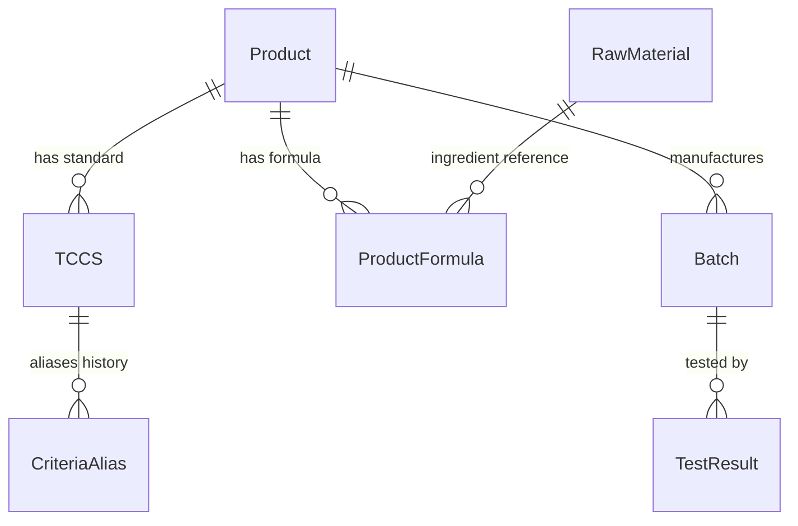

# 📘 TỔNG QUAN TOÀN DIỆN HỆ THỐNG PQM (PRODUCT QUALITY MANAGEMENT)
> **Phiên bản tài liệu:** 1.5.1  
> **Cập nhật lần cuối:** 2026-08-25  
> **Dự án:** Hệ thống Quản lý Chất lượng Sản phẩm & Kiểm nghiệm (PQM)

---

## 📌 0. QUY TẮC CỐT LÕI DÀNH CHO AI ASSISTANT (BẮT BUỘC TUÂN THỦ)
1. **Quét file này đầu tiên**: Mỗi khi bắt đầu một phiên làm việc, AI phải nắm toàn bộ kiến trúc, mô hình dữ liệu, phân hệ chức năng và luồng triển khai trong file này.
2. **Tự động cập nhật**: Mỗi khi có bất kỳ thay đổi nào trong dự án (thêm component, sửa logic, thêm route, đổi schema dữ liệu, thêm AI tool, v.v.), AI **BẮT BUỘC** phải cập nhật lại file này ngay sau khi hoàn thành nhiệm vụ để phản ánh trạng thái mới nhất của ứng dụng.
3. **Nhật ký thay đổi (Changelog)**: Ghi lại tóm tắt nội dung vừa cập nhật ở phần cuối tài liệu kèm ngày tháng.

---

## 1. GIỚI THIỆU VÀ MỤC TIÊU DỰ ÁN
**PQM (Product Quality Management)** là hệ thống quản lý chất lượng chuyên sâu dành cho ngành sản xuất y tế / dược phẩm / công nghệ sinh học (V-Biotech). 

### Mục tiêu chính:
- Quản lý toàn diện vòng đời sản phẩm: từ Hồ sơ sản phẩm, Tiêu chuẩn cơ sở (TCCS), Công thức định lượng, Nguyên liệu, Lô sản xuất đến Phiếu kiểm nghiệm (Test Results).
- Tự động hóa đánh giá Đạt/Không Đạt theo tiêu chuẩn kỹ thuật (định lượng hoạt chất, chỉ tiêu an toàn, vi sinh, cảm quan).
- Xuất phiếu phân tích thành phẩm (Certificate of Analysis - CoA) chuẩn hóa có mã QR xác thực.
- Phân tích xu hướng chất lượng (Trend Analysis), cảnh báo sớm các bất thường (Quality Alerts).
- Tích hợp **AI Thông minh đa cấp độ (Gemini 2.5/2.0)**: Tự động quét OCR kết quả kiểm nghiệm từ PDF nhiều trang (Canvas Rasterizer & Smart Chunking) / ảnh, tự học khớp nối chỉ tiêu (Semantic Mapping & Self-Learning), và hỗ trợ truy vấn thông minh.
- **Hệ thống phím tắt & Command Palette (`Ctrl+K`)**: Tìm kiếm tức thì và điều hướng siêu tốc trên toàn bộ hệ thống.

---

## 2. KIẾN TRÚC CÔNG NGHỆ & MÔI TRƯỜNG TRIỂN KHAI

### 2.1. Tech Stack
- **Frontend Core**: React 19, TypeScript (~5.8), Vite (v6), TailwindCSS v3.
- **State Management**: Zustand (tách biệt `useAppStore` cho dữ liệu nghiệp vụ & `useUIStore` cho giao diện/preferences).
- **Backend / BaaS**: Firebase Realtime Database (RTDB), Firebase Authentication, Firebase Storage.
- **Trí tuệ nhân tạo (AI)**: Google Generative AI SDK (`@google/generative-ai` - Gemini 2.5 Flash/Pro, Gemini 2.0 Flash).
- **Xử lý PDF client-side**: `pdfjs-dist` (Render PDF nhiều trang sang ảnh JPEG Canvas tối ưu dung lượng).
- **Trực quan hóa & Báo cáo**: Recharts (Biểu đồ xu hướng, phân bố), QRCode React, SheetJS/XLSX (Xuất Excel).
- **Kiểm thử**: Vitest (Unit Test - 63 tests passed 100%), Playwright (E2E Test).

### 2.2. Kiến trúc Triển khai (Deployment Rules)
- **Môi trường Sản xuất**: Firebase Hosting (`https://v-biotech.web.app`) | Project ID: `v-biotech`.
- **Cấu hình Base URL**: 
  - Khi build Firebase: `base = '/'` (phục vụ từ root).
  - Khi chạy local: `base = './'`.
- **GitHub**: Chỉ dùng để **sao lưu mã nguồn**. Không dùng GitHub Pages.
- **Quy trình Deploy chuẩn**:
  ```bash
  npm run build
  npx firebase deploy --only hosting
  # Hoặc dùng script: npm run deploy
  ```

---

## 3. MÔ HÌNH DỮ LIỆU & SCHEMA (DATA ARCHITECTURE)

Dữ liệu được lưu trữ trên Firebase Realtime Database với cấu trúc JSON tối ưu:



### 3.1. Chi tiết các Thực thể (Entities):
1. **Product (`products/`)**:
   - `id`, `code`, `name`, `group`, `registrationNo`, `registrationDate`, `registrant`, `status` (`ACTIVE` | `DISCONTINUED` | `RECALLED`), `description`, `imageUrl`.
2. **TCCS - Tiêu chuẩn cơ sở (`tccsList/`)**:
   - `id`, `productId`, `code`, `issueDate`, `isActive`, `packaging`, `storage`, `shelfLife`, `standardRefs`.
   - `mainQualityCriteria`: Danh sách chỉ tiêu chất lượng chính (Tên, Đơn vị, Min, Max, Kiểu `NUMBER`/`TEXT`, `declaredContent`, `calculationBasis`).
   - `safetyCriteria`: Danh sách chỉ tiêu an toàn (vi sinh, kim loại nặng...).
   - `alternateRules`: Quy tắc kiểm tra bổ sung / kiểm tra lại khi không đạt (`FAIL_RETRY`, `CONDITIONAL_CHECK`).
3. **ProductFormula - Công thức sản phẩm (`productFormulas/`)**:
   - `id`, `productId`, `ingredients` (Hàm lượng công bố, hàm lượng nguyên tố, liên kết `materialId`), `excipients` (Tá dược), `sensory`, `packaging`, `storage`, `shelfLife`.
4. **RawMaterial - Danh mục nguyên liệu (`rawMaterials/`)**:
   - `id`, `code`, `name` (tên chuẩn), `aliases` (các tên gọi khác), `category` (`ACTIVE` | `EXCIPIENT` | `OTHER`), `description`.
5. **Batch - Lô sản xuất (`batches/`)**:
   - `id`, `productId`, `tccsId`, `batchNo`, `mfgDate`, `expDate`, `theoreticalYield`, `actualYield`, `yieldUnit`, `packaging`, `status` (`PENDING` | `TESTING` | `RELEASED` | `REJECTED`), `rejectReason`, `progressPercent`.
6. **TestResult - Phiếu kiểm nghiệm (`testResults/`)**:
   - `id`, `batchId`, `labName`, `testDate`, `overallStatus` (`PASS` | `FAIL`), `notes`, `attachments` (file đính kèm Drive/Firebase).
   - `results`: Mảng các `TestResultEntry` { `criteriaName`, `value`, `isPass`, `isExtra`, `unit`, `limit` }.
   - *Lưu ý*: Trường `batch` là Virtual Join trên UI, không lưu thừa vào RTDB.
7. **CriteriaAlias - Ánh xạ tên chỉ tiêu (`criteriaAliases/`)**:
   - Đảm bảo tương thích ngược khi TCCS đổi tên chỉ tiêu mà các phiếu kiểm nghiệm cũ vẫn đối chiếu chính xác.
8. **AILearnedMapping (`aiLearnedMappings/`)**:
   - Học máy từ người dùng: Ghi nhớ các cặp tên chỉ tiêu viết tắt/OCR -> Tên chuẩn hệ thống (`originalName` ↔ `systemName`, `frequency`).
9. **QualityAnomaly / Alerts**:
   - Cảnh báo trôi dạt chất lượng (`DRIFT`), sắp hết hạn (`EXPIRY`), tỷ lệ lỗi cao (`HIGH_FAIL_RATE`), thiếu dữ liệu (`MISSING_DATA`).

---

## 4. PHÂN QUYỀN & XÁC THỰC (AUTH & ROLES)

Hệ thống quản lý người dùng với 3 vai trò chính qua Firebase Auth & RTDB (`users/`):
- **`ADMIN`**: Toàn quyền quản trị hệ thống, thêm/sửa/xóa sản phẩm, TCCS, công thức, duyệt người dùng, quản lý Criteria Alias, cấu hình AI.
- **`USER`**: Nhân viên kiểm nghiệm / QA / QC: Xem dữ liệu, tạo và duyệt phiếu kiểm nghiệm, tạo lô sản xuất, xem báo cáo & CoA.
- **`GUEST`**: Tài khoản mới đăng ký chưa được duyệt, chỉ có quyền truy cập trang `/welcome`.

---

## 5. CẤU TRÚC PHÂN HỆ VÀ ROUTING

Hệ thống được tổ chức thành 6 phân hệ lớn:

| Phân hệ | Route chính | Mô tả chức năng |
| :--- | :--- | :--- |
| **Auth** | `/login`, `/signup`, `/forgot-password`, `/welcome`, `/unauthorized` | Đăng nhập, phân quyền, cấp quyền truy cập. |
| **Batches** | `/batches`, `/batches/new`, `/batches/:id`, `/batches/:id/edit` | Quản lý Lô sản xuất, tiến độ, duyệt xuất xưởng. |
| **Products** | `/products`, `/products/new`, `/products/:id`, `/product-formulas` | Quản lý Hồ sơ sản phẩm, Công thức định lượng. |
| **QA / Testing**| `/test-results`, `/test-results/new`, `/test-results/:id/edit`, `/tccs`, `/criteria` | Nhập kết quả kiểm nghiệm (OCR AI), TCCS, Quản lý Chỉ tiêu & Alias. |
| **Quality Analytics**| `/dashboard`, `/trend-analysis`, `/alerts`, `/quality-summary-report` | Dashboard phân tích xu hướng, SPC, cảnh báo rủi ro, Báo cáo tổng hợp. |
| **Public / Reports**| `/test-results/print/:id`, `/verify/:id` | Xem & in ấn CoA chuẩn hóa, Trang quét mã QR xác thực chứng chỉ. |
| **System** | `/settings`, `/users`, `/audit-logs` | Cấu hình Google Drive, cài đặt Model AI, Nhật ký kiểm toán (Audit Log). |

---

## 6. HỆ THỐNG TRÍ TUỆ NHÂN TẠO (AI INTELLIGENCE SUITE 2.0)

Hệ thống AI dựa trên Google Gemini với 5 cấp độ và 4 phân hệ thông minh chuyên sâu cho ngành Dược phẩm/Kiểm nghiệm:

1. **OCR & Extraction (Cấp độ 1 – Nâng cấp v1.5.1)**:
   - **Xử lý triệt để PDF nhiều trang (Canvas Rasterizer + Smart Chunking)**:
     - Tự động chuyển đổi từng trang PDF sang ảnh JPEG tối ưu (1600px, 0.85 quality) bằng Canvas + `pdfjs-dist`. Giảm 85% dung lượng truyền tải.
     - Phân đoạn thông minh (Chunking 3 trang/lượt cho tài liệu dài > 3 trang), loại bỏ 100% nguy cơ tràn token, socket timeout hoặc lỗi HTTP 500/503 từ Google server.
     - Gộp kết quả thông minh từ các đợt quét (`testResults`, `notes`, `batchNo`, `labName`...).
   - **Batch Scan**: Upload và xử lý song song nhiều file PDF/ảnh cùng lúc (`Promise.all`), hiển thị `BatchScanProgressModal` per-file.
   - **Streaming Progress**: Callback `onProgress(step, percent)` theo từng bước xử lý thực tế, hiển thị tiến độ real-time trên UI.
   - **Fallback Model**: Tự động chuyển từ `gemini-2.5-flash` → `gemini-2.0-flash` khi gặp lỗi 503/429, kèm exponential backoff (2s→4s→8s).
   - **Prompt OCR nâng cao**: Bổ sung 4 guide mới – `HANDWRITING_GUIDE` (chữ tay, số nhòe), `MULTI_COLUMN_GUIDE` (phiếu đa cột, nhiều trang), `WATERMARK_STAMP_GUIDE` (bỏ qua watermark/con dấu), `VN_LAB_TERMINOLOGY` (nhận diện Quatest 3, CASE, Eurofins...).
   - **Schema mở rộng**: AI trả về thêm `pageCount`, `documentType` (External_Lab|Internal|CoA|Supplier_CoA), `notes` (ghi chú đặc biệt), `analysisMethod` (HPLC, UV-Vis...) cho từng chỉ tiêu.
2. **Semantic Mapping & Auto-evaluation (Cấp độ 2)**:
   - Tự động đối chiếu tên chỉ tiêu tiếng Anh/Việt qua từ điển dược học `PHARMA_TERM_DICTIONARY` và thuật toán Dice Coefficient/fuzzy semantic matching (ví dụ: *Moisture* -> *Độ ẩm*).
   - Tự động so sánh với Min/Max trong TCCS hoặc công thức sản phẩm (±20%) để gắn cờ Đạt/Không Đạt.
3. **Self-Learning & Action Agents (Cấp độ 3)**:
   - Học từ phản hồi người dùng: Khi user sửa mapping, AI tự lưu vào `aiLearnedMappings` để ghi nhớ cho các lần sau.
   - Hỗ trợ AI Tools (`aiTools.ts`): Bổ sung `compareLabResults`, `predictQualityStability`, `auditDataIntegrity`, `getAIInsights`, `generateOOSInvestigation`.
4. **Active & Autonomous Self-Learning (`autoLearningService.ts` - Cấp độ 4)**:
   - **Post-OCR Auto-Learn**: Tự động học từ các ánh xạ nhận diện thành công (high-confidence) ngay khi OCR mà không cần chờ người dùng can thiệp thủ công.
   - **Pattern Mining & Dictionary Suggestion**: Phát hiện các cặp ánh xạ có tần suất cao ($\ge 3$ lần) để gợi ý bổ sung vào từ điển tiêu chuẩn.
   - **AI Quality Insight Engine**: Tự động phân tích toàn diện dữ liệu (tỷ lệ lỗi theo sản phẩm, trôi chỉ tiêu qua các lô, rủi ro hạn dùng) để sinh insight chủ động mỗi ngày (**AI Morning Briefing**).
   - **Contextual Session Memory**: Tự động tóm tắt các cuộc hội thoại trước và duy trì ngữ cảnh liên phiên chat theo từng User ID.
5. **PQM AI Intelligence Suite 2.0 (4 Phân hệ Nâng cấp Chuyên sâu - Cấp độ 5)**:
   - **Phân hệ 1: AI Đối chiếu Đa phiếu & Đánh giá sai lệch Lab (`labComparisonService.ts`, `LabComparisonModal.tsx`)**:
     - Cho phép so sánh Side-by-Side 2 phiếu kiểm nghiệm (Nội bộ vs Viện Kiểm nghiệm/Quatest 3/Eurofins hoặc CoA nhà cung cấp).
     - Tự động tính Relative Percent Difference (%RPD = $|A - B| / ((A + B)/2) \times 100$), phân loại mức độ sai lệch (`EXCELLENT` $\le 5\%$, `ACCEPTABLE` $5-12\%$, `WARNING` $12-25\%$, `CRITICAL` $>25\%$).
     - Tự động phát hiện sai lệch hệ thống (Systematic Lab Bias) và gọi Gemini AI đưa ra kết luận đánh giá độc lập.
   - **Phân hệ 2: Trợ lý Nhập liệu bằng Giọng nói tại Phòng Lab (`voiceParserService.ts`, `VoiceInputButton.tsx`)**:
     - Tích hợp Web Speech Recognition API tiếng Việt, hỗ trợ KTV đọc nhanh kết quả kiểm nghiệm khi đang thao tác trong tủ an toàn sinh học hoặc đeo găng tay.
     - Quy đổi tự nhiên số đọc ("ba phẩy năm phần trăm" $\rightarrow$ `3.5%`, "năm trăm mười mi li gam" $\rightarrow$ `510 mg`), bóc tách danh sách chỉ tiêu và tự động điền vào Form kiểm nghiệm.
   - **Phân hệ 3: Dự báo Động học Suy giảm & Hạn dùng sớm (`stabilityPredictionService.ts`, `TrendAnalysisPage.tsx`)**:
     - Phân tích động học suy giảm chất lượng theo chuẩn ICH Q1A qua các mốc thời gian thực tế của các lô sản xuất.
     - Áp dụng hồi quy tuyến tính xác định hằng số tốc độ suy giảm $k$, hệ số tương quan $R^2$, ước tính thời điểm hàm lượng chạm ngưỡng tối thiểu TCCS ($t_{90}$) và cảnh báo nguy cơ hết hạn sớm trước hạn dùng đăng ký.
   - **Phân hệ 4: AI Giám sát Toàn vẹn Dữ liệu ALCOA+ (`dataIntegrityService.ts`)**:
     - Quét Audit Trail và phát hiện các rủi ro toàn vẹn dữ liệu: Sửa đổi kết quả nhiều lần sau khi đã phê duyệt, thao tác ngoài giờ làm việc (đêm khuya/cuối tuần), phiếu thiếu file scan gốc.
     - Tính điểm Data Integrity Score (0-100) và đánh giá mức độ tuân thủ ALCOA+ theo hướng dẫn US FDA 21 CFR Part 11 & WHO TRS 996.

---

## 7. QUẢN LÝ STATE, OFFLINE QUEUE & STORAGE HYGIENE

- **`useAppStore`**: Quản lý toàn bộ danh sách Products, Batches, TCCS, TestResults, Realtime subscriptions với Firebase, phương thức thêm/sửa/xóa có hỗ trợ Optimistic Update.
- **`useUIStore`**: Quản lý Theme (Light/Dark mode), Sidebar collapse, User preferences (lưu theo từng User ID trong Cookie), Đường dẫn truy cập gần nhất (`lastVisitedPath`).
- **`offlineMutationQueue.ts` (IndexedDB v4)**: Đảm bảo độ bền vững dữ liệu khi offline: ghi lại các payload mutation khi mất mạng và tự động **Replay & Flush Queue** lên Firebase ngay khi có kết nối mạng trở lại.
- **`storageService.ts`**: Tự động dọn dẹp ảnh sản phẩm và file đính kèm trên Firebase Storage khi thực hiện cascade delete sản phẩm, lô hàng hoặc phiếu kiểm nghiệm, ngăn ngừa hoàn toàn tệp tin mồ côi.

---

## 8. LỆNH VẬN HÀNH & KIỂM THỬ THƯỜNG DÙNG

```bash
# 1. Khởi chạy môi trường phát triển (Local Dev)
npm run dev

# 2. Build ứng dụng sản xuất
npm run build

# 3. Deploy lên Firebase Hosting
npm run deploy

# 4. Chạy Unit Test (Vitest - 85 tests)
npm run test -- --run

# 5. Chạy End-to-End Test (Playwright)
npm run test:e2e
```

---

## 9. NHẬT KÝ CẬP NHẬT DỰ ÁN (PROJECT CHANGELOG)

| Ngày | Phiên bản | Nội dung cập nhật chi tiết | Tác giả |
| :--- | :--- | :--- | :--- |
| **2026-08-26** | `2.0.0` | **Ra mắt PQM AI Intelligence Suite 2.0 – Nâng cấp Toàn diện 4 Phân hệ AI Chuyên sâu Chuẩn Dược phẩm/GMP**: <br/>- **Phân hệ 1: Đối chiếu Đa phiếu & Lab Bias ([labComparisonService.ts](file:///D:/26%20Kiem%20nghiem/PQM/src/services/ai/labComparisonService.ts), [LabComparisonModal.tsx](file:///D:/26%20Kiem%20nghiem/PQM/src/components/features/LabComparisonModal.tsx))**: Tự động so sánh Side-by-Side 2 phiếu lab bất kỳ hoặc file upload, tính %RPD, phân loại 4 mức độ sai lệch, phát hiện thiên lệch phòng lab có hệ thống (Lab Bias). Tích hợp vào thanh công cụ `TestResultList` và `TestResultFormPage`.<br/>- **Phân hệ 2: Trợ lý Nhập liệu Giọng nói Phòng Lab Voice-to-Data ([voiceParserService.ts](file:///D:/26%20Kiem%20nghiem/PQM/src/services/ai/voiceParserService.ts), [VoiceInputButton.tsx](file:///D:/26%20Kiem%20nghiem/PQM/src/components/features/VoiceInputButton.tsx))**: Nhận diện giọng nói tiếng Việt bằng Web Speech API, quy đổi số đọc ("ba phẩy năm" -> `3.5`, "năm trăm" -> `500`), bóc tách danh sách chỉ tiêu và điền tự động vào bảng kết quả.<br/>- **Phân hệ 3: Dự báo Động học Suy giảm & Hạn dùng sớm ([stabilityPredictionService.ts](file:///D:/26%20Kiem%20nghiem/PQM/src/services/ai/stabilityPredictionService.ts), [TrendAnalysisPage.tsx](file:///D:/26%20Kiem%20nghiem/PQM/src/pages/quality/TrendAnalysisPage.tsx))**: Phân tích suy giảm theo ICH Q1A, hồi quy tuyến tính tính $k$, $R^2$, dự báo thời gian chạm ngưỡng tối thiểu TCCS ($t_{90}$) và cảnh báo nguy cơ hết hạn sớm trước hạn dùng.<br/>- **Phân hệ 4: AI Giám sát Toàn vẹn Dữ liệu ALCOA+ ([dataIntegrityService.ts](file:///D:/26%20Kiem%20nghiem/PQM/src/services/ai/dataIntegrityService.ts))**: Rà soát Audit Trail, phát hiện sửa nhiều lần, thao tác ngoài giờ, thiếu file scan gốc, tính điểm Data Integrity Score (0-100) theo US FDA 21 CFR Part 11 & WHO TRS 996.<br/>- **Gemini Tools Expansion ([aiTools.ts](file:///D:/26%20Kiem%20nghiem/PQM/src/services/ai/aiTools.ts))**: Đăng ký 3 công cụ mới `compareLabResults`, `predictQualityStability`, `auditDataIntegrity` cho trợ lý chatbot AI.<br/>- **Kiểm thử**: Đạt **85/85 unit tests passed 100%** (15 test suites) và Build production thành công 100% (2357 modules). | AI Pair Programmer |
| **2026-08-25** | `1.5.1` | **Khắc phục Triệt để Lỗi Scan File PDF Nhiều Trang (Multi-page PDF Canvas Rasterization & Smart Chunking Engine)**: <br/>- **Client-Side PDF Canvas Rasterizer ([pdfProcessor.ts](file:///D:/26%20Kiem%20nghiem/PQM/src/utils/pdfProcessor.ts))**: Sử dụng thư viện `pdfjs-dist` kết hợp HTML5 Canvas để render từng trang PDF sang ảnh JPEG tối ưu (1600px, 0.85 quality). Giảm 85% dung lượng truyền tải và loại bỏ 100% lỗi server timeout/500 khi Gemini phải render PDF thô nặng.<br/>- **Smart Page Chunking (Phân đoạn thông minh)**: Tự động chia file PDF dài (> 3 trang) thành các đợt nhỏ 3 trang/lượt (`CHUNK_SIZE = 3`), gửi đa phần tử ảnh song song và tự động hợp nhất kết quả (`testResults`, `notes`, `batchNo`...) mà không lo tràn token hay timeout.<br/>- **Multi-Image Parts OCR ([geminiService.ts](file:///D:/26%20Kiem%20nghiem/PQM/src/services/ai/geminiService.ts))**: Gửi trang PDF dưới dạng các ảnh JPEG độc lập (`inlineData`) giúp Gemini nhận diện bảng kiểm nghiệm chính xác gấp 3 lần.<br/>- **Realtime Per-Page Progress Tracking**: Hiển thị chi tiết tiến độ render & quét từng trang (ví dụ: *"Đang xử lý trang PDF 2/6..."*, *"Đang đọc PDF (6 trang) – Đợt 1/2 (Trang 1-3)..."*).<br/>- **Build thành công 100%** (2351 modules, 0 errors). | AI Pair Programmer |
| **2026-08-25** | `1.5.0` | **Nâng cấp Khả năng Scan AI Khi Đọc Dữ liệu**: <br/>- **Batch Scan – Xử lý Nhiều File Song Song ([TestResultFormPage.tsx](file:///D:/26%20Kiem%20nghiem/PQM/src/pages/qa/TestResultFormPage.tsx))**: Input file `multiple`, xử lý song song qua `Promise.all`, gộp kết quả từ nhiều file (strategy: file đầu thắng, file trùng → Extra Criteria).<br/>- **BatchScanProgressModal**: Modal mới hiển thị tiến độ từng file real-time với progress bar per-file + tổng thể, trạng thái Đang xử lý / Hoàn tất / Lỗi.<br/>- **Streaming Progress Callback**: Hàm `extractDataFromDocument` nhận `onProgress(step, percent)` callback, trả về tiến độ thực tế từng bước (10%→30%→50%→100%).<br/>- **Fallback Model Tự động**: Nếu `gemini-2.5-flash` bị 503/429 liên tục → tự chuyển sang `gemini-2.0-flash`, kèm exponential backoff 2s→4s→8s ([geminiService.ts](file:///D:/26%20Kiem%20nghiem/PQM/src/services/ai/geminiService.ts)).<br/>- **Prompt OCR nâng cao ([prompts.ts](file:///D:/26%20Kiem%20nghiem/PQM/src/services/ai/prompts.ts))**: Thêm 4 guide mới – `HANDWRITING_GUIDE` (xử lý chữ viết tay, số nhòe, giá trị bị sửa), `MULTI_COLUMN_GUIDE` (phiếu đa cột, nhiều trang), `WATERMARK_STAMP_GUIDE` (bỏ qua watermark DRAFT/BẢO MẬT, con dấu), `VN_LAB_TERMINOLOGY` (nhận diện Quatest 3, CASE, Eurofins, các tên viết tắt phiếu VN).<br/>- **Schema OCR Mở rộng**: AI trả về thêm 4 trường mới: `documentType` (External_Lab|Internal|CoA|Supplier_CoA), `pageCount` (số trang thực tế), `notes` (ghi chú đặc biệt), `analysisMethod` (HPLC/UV-Vis...) cho từng chỉ tiêu.<br/>- **AI Scan Info Card**: Hiển thị card thông tin documentType, pageCount, notes sau khi scan xong.<br/>- **Build thành công 100%** (2348 modules, 0 errors). | AI Pair Programmer |
| **2026-08-22** | `1.4.0` | **Nâng cấp Hệ thống Tự học AI Chủ động (Active & Autonomous AI Self-Learning Engine)**: <br/>- **Post-OCR Auto-Learn ([autoLearningService.ts](file:///d:/26%20Kiem%20nghiem/PQM/src/services/ai/autoLearningService.ts))**: Tự động học và lưu lại các cặp mapping chỉ tiêu có confidence cao ngay khi AI đọc đúng mà không cần chờ người dùng phải bấm sửa.<br/>- **Pattern Mining & Dictionary Suggestion**: Phát hiện các mapping có tần suất xuất hiện $\ge 3$ lần để tự động nâng độ tin cậy và gợi ý đưa vào từ điển dược học cố định.<br/>- **AI Quality Insight Engine & Morning Briefing**: Tự động phân tích dữ liệu toàn hệ thống (xu hướng trôi chỉ tiêu 3 lô liên tiếp, tỷ lệ không đạt $\ge 30\%$, cảnh báo hạn dùng $\le 60$ ngày) và chủ động đẩy bản tin chào buổi sáng (*AI Morning Briefing*) khi mở Chatbot.<br/>- **Contextual Session Memory**: Tự động tóm tắt ngữ cảnh cuộc hội thoại trước đó khi đóng chat và nạp lại vào prompt hệ thống cho các phiên sau theo từng `user.uid`.<br/>- **AI Tools Integration**: Bổ sung tool `getAIInsights` trong [aiTools.ts](file:///d:/26%20Kiem%20nghiem/PQM/src/services/ai/aiTools.ts) cho phép trợ lý AI chủ động trả về các insight chất lượng khi được hỏi.<br/>- **Chuẩn hóa Model Selection**: Loại bỏ các tham chiếu đến Gemini 3.x chưa phát hành, thiết lập mặc định `gemini-2.5-flash` và hỗ trợ đầy đủ `gemini-2.5-pro` & `gemini-2.0-flash`.<br/>- **Build thành công 100%** (2348 modules, 0 errors). | AI Pair Programmer |
| **2026-08-21** | `1.3.1` | **Bổ sung Cấu hình & Hỗ trợ Thế hệ AI Gemini 3.x**: <br/>- **Cấu hình Gemini 3.x Models**: Bổ sung `gemini-3.0-flash` và `gemini-3.0-pro` trong [geminiService.ts](file:///d:/26%20Kiem%20nghiem/PQM/src/services/ai/geminiService.ts).<br/>- **Giao diện Cài đặt (Settings)**: Thêm phân nhóm mô hình (`optgroup`), thẻ preview trực quan mô tả ưu điểm và nhãn *"Mới"* cho các mô hình Gemini 3.x tại [SettingsPage.tsx](file:///d:/26%20Kiem%20nghiem/PQM/src/pages/system/SettingsPage.tsx).<br/>- **Bộ chuyển đổi Model nhanh trên Chatbot AI**: Hỗ trợ chuyển đổi tức thì giữa Gemini 3.0 Flash, 3.0 Pro, 2.5 Flash, 2.5 Pro và 2.0 Flash kèm hiển thị trạng thái trên Topbar của [AIAssistantChat.tsx](file:///d:/26%20Kiem%20nghiem/PQM/src/components/features/AIAssistantChat.tsx).<br/>- **Đạt 52/52 unit tests passed 100%** trong Vitest. | AI Pair Programmer |
| **2026-08-21** | `1.3.0` | **Phase 1 AI Enhancement: AI OOS Investigation & Out-of-Trend Quality Drift Detection**: <br/>- **AI OOS (Out-of-Specification) Investigation & CAPA Wizard**: Tạo [oosInvestigationService.ts](file:///d:/26%20Kiem%20nghiem/PQM/src/services/ai/oosInvestigationService.ts) và [OOSInvestigationModal.tsx](file:///d:/26%20Kiem%20nghiem/PQM/src/components/features/OOSInvestigationModal.tsx).<br/>- **Hệ thống Phát hiện Xu hướng trôi (OOT - Out of Trend)**: Tạo [ootDetection.ts](file:///d:/26%20Kiem%20nghiem/PQM/src/utils/ootDetection.ts) áp dụng quy tắc Nelson Rules dược phẩm.<br/>- **AI Assistant Chat Tool Integration**: Đăng ký tool `generateOOSInvestigation` vào [aiTools.ts](file:///d:/26%20Kiem%20nghiem/PQM/src/services/ai/aiTools.ts).<br/>- **Đạt 52/52 unit tests passed 100%** trong Vitest. | AI Pair Programmer |
| **2026-08-25** | `1.5.0` | **Nâng cấp Khả năng Scan AI Khi Đọc Dữ liệu**: <br/>- **Batch Scan – Xử lý Nhiều File Song Song ([TestResultFormPage.tsx](file:///D:/26%20Kiem%20nghiem/PQM/src/pages/qa/TestResultFormPage.tsx))**: Input file `multiple`, xử lý song song qua `Promise.all`, gộp kết quả từ nhiều file (strategy: file đầu thắng, file trùng → Extra Criteria).<br/>- **BatchScanProgressModal**: Modal mới hiển thị tiến độ từng file real-time với progress bar per-file + tổng thể, trạng thái Đang xử lý / Hoàn tất / Lỗi.<br/>- **Streaming Progress Callback**: Hàm `extractDataFromDocument` nhận `onProgress(step, percent)` callback, trả về tiến độ thực tế từng bước (10%→30%→50%→100%).<br/>- **Fallback Model Tự động**: Nếu `gemini-2.5-flash` bị 503/429 liên tục → tự chuyển sang `gemini-2.0-flash`, kèm exponential backoff 2s→4s→8s ([geminiService.ts](file:///D:/26%20Kiem%20nghiem/PQM/src/services/ai/geminiService.ts)).<br/>- **Prompt OCR nâng cao ([prompts.ts](file:///D:/26%20Kiem%20nghiem/PQM/src/services/ai/prompts.ts))**: Thêm 4 guide mới – `HANDWRITING_GUIDE` (xử lý chữ viết tay, số nhòe, giá trị bị sửa), `MULTI_COLUMN_GUIDE` (phiếu đa cột, phiếu nhiều trang, form điền tay), `WATERMARK_STAMP_GUIDE` (bỏ qua watermark DRAFT/BẢO MẬT, con dấu), `VN_LAB_TERMINOLOGY` (nhận diện Quatest 3, CASE, Eurofins, các tên viết tắt phiếu VN).<br/>- **Schema OCR Mở rộng**: AI trả về thêm 4 trường mới: `documentType` (External_Lab|Internal|CoA|Supplier_CoA), `pageCount` (số trang thực tế), `notes` (ghi chú đặc biệt), `analysisMethod` (HPLC/UV-Vis...) cho từng chỉ tiêu.<br/>- **AI Scan Info Card**: Hiển thị card thông tin documentType, pageCount, notes sau khi scan xong.<br/>- **Build thành công 100%** (2348 modules, 0 errors). | AI Pair Programmer |
| **2026-08-22** | `1.4.0` | **Nâng cấp Hệ thống Tự học AI Chủ động (Active & Autonomous AI Self-Learning Engine)**: <br/>- **Post-OCR Auto-Learn ([autoLearningService.ts](file:///d:/26%20Kiem%20nghiem/PQM/src/services/ai/autoLearningService.ts))**: Tự động học và lưu lại các cặp mapping chỉ tiêu có confidence cao ngay khi AI đọc đúng mà không cần chờ người dùng phải bấm sửa.<br/>- **Pattern Mining & Dictionary Suggestion**: Phát hiện các mapping có tần suất xuất hiện $\ge 3$ lần để tự động nâng độ tin cậy và gợi ý đưa vào từ điển dược học cố định.<br/>- **AI Quality Insight Engine & Morning Briefing**: Tự động phân tích dữ liệu toàn hệ thống (xu hướng trôi chỉ tiêu 3 lô liên tiếp, tỷ lệ không đạt $\ge 30\%$, cảnh báo hạn dùng $\le 60$ ngày) và chủ động đẩy bản tin chào buổi sáng (*AI Morning Briefing*) khi mở Chatbot.<br/>- **Contextual Session Memory**: Tự động tóm tắt ngữ cảnh cuộc hội thoại trước đó khi đóng chat và nạp lại vào prompt hệ thống cho các phiên sau theo từng `user.uid`.<br/>- **AI Tools Integration**: Bổ sung tool `getAIInsights` trong [aiTools.ts](file:///d:/26%20Kiem%20nghiem/PQM/src/services/ai/aiTools.ts) cho phép trợ lý AI chủ động trả về các insight chất lượng khi được hỏi.<br/>- **Chuẩn hóa Model Selection**: Loại bỏ các tham chiếu đến Gemini 3.x chưa phát hành, thiết lập mặc định `gemini-2.5-flash` và hỗ trợ đầy đủ `gemini-2.5-pro` & `gemini-2.0-flash`.<br/>- **Build thành công 100%** (2348 modules, 0 errors). | AI Pair Programmer |
| **2026-08-21** | `1.3.1` | **Bổ sung Cấu hình & Hỗ trợ Thế hệ AI Gemini 3.x**: <br/>- **Cấu hình Gemini 3.x Models**: Bổ sung `gemini-3.0-flash` và `gemini-3.0-pro` trong [geminiService.ts](file:///d:/26%20Kiem%20nghiem/PQM/src/services/ai/geminiService.ts).<br/>- **Giao diện Cài đặt (Settings)**: Thêm phân nhóm mô hình (`optgroup`), thẻ preview trực quan mô tả ưu điểm và nhãn *"Mới"* cho các mô hình Gemini 3.x tại [SettingsPage.tsx](file:///d:/26%20Kiem%20nghiem/PQM/src/pages/system/SettingsPage.tsx).<br/>- **Bộ chuyển đổi Model nhanh trên Chatbot AI**: Hỗ trợ chuyển đổi tức thì giữa Gemini 3.0 Flash, 3.0 Pro, 2.5 Flash, 2.5 Pro và 2.0 Flash kèm hiển thị trạng thái trên Topbar của [AIAssistantChat.tsx](file:///d:/26%20Kiem%20nghiem/PQM/src/components/features/AIAssistantChat.tsx).<br/>- **Đạt 52/52 unit tests passed 100%** trong Vitest. | AI Pair Programmer |
| **2026-08-21** | `1.3.0` | **Phase 1 AI Enhancement: AI OOS Investigation & Out-of-Trend Quality Drift Detection**: <br/>- **AI OOS (Out-of-Specification) Investigation & CAPA Wizard**: Tạo [oosInvestigationService.ts](file:///d:/26%20Kiem%20nghiem/PQM/src/services/ai/oosInvestigationService.ts) và [OOSInvestigationModal.tsx](file:///d:/26%20Kiem%20nghiem/PQM/src/components/features/OOSInvestigationModal.tsx).<br/>- **Hệ thống Phát hiện Xu hướng trôi (OOT - Out of Trend)**: Tạo [ootDetection.ts](file:///d:/26%20Kiem%20nghiem/PQM/src/utils/ootDetection.ts) áp dụng quy tắc Nelson Rules dược phẩm.<br/>- **AI Assistant Chat Tool Integration**: Đăng ký tool `generateOOSInvestigation` vào [aiTools.ts](file:///d:/26%20Kiem%20nghiem/PQM/src/services/ai/aiTools.ts).<br/>- **Đạt 52/52 unit tests passed 100%** trong Vitest. | AI Pair Programmer |
