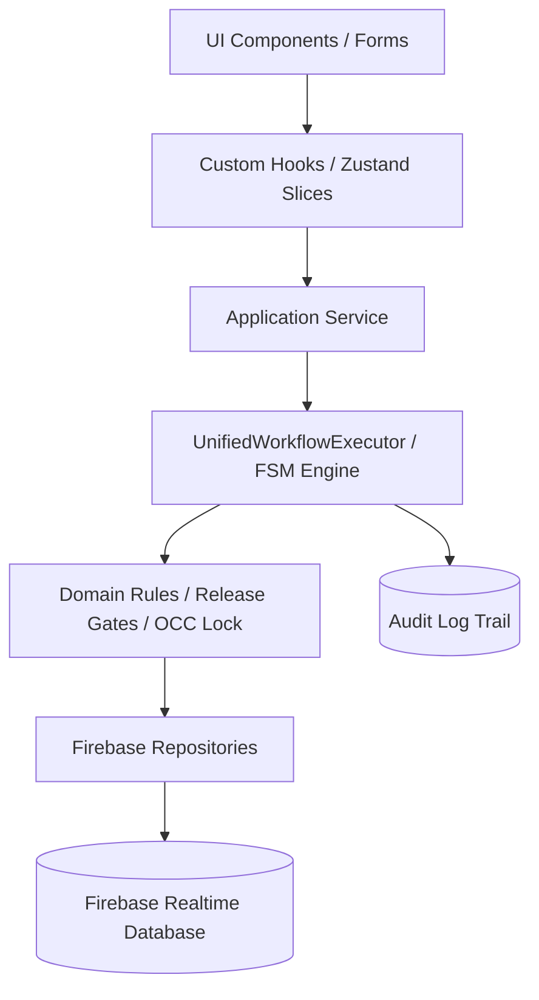

# PQM — TRACE ĐỒ THỊ GỌI THỰC TẾ CÁC TÁC VỤ REGULATED (REGULATED CALL GRAPH)

> **Tài liệu:** PQM_FINAL_REGULATED_CALL_GRAPH.md  
> **Phiên bản:** 1.0.0-FINAL-SOURCE-VERIFIED  
> **Ngày thực hiện:** 2026-09-24  
> **Mục tiêu:** Bằng chứng thực nghiệm (Source-based Evidence) chứng minh toàn bộ các thao tác thay đổi dữ liệu có quy chuẩn (Regulated Mutations) đều tuân thủ luồng kiến trúc 7 tầng chuẩn tắc, không tồn tại bypass hay direct Firebase writes từ UI/Hooks.

---

## 1. MÔ HÌNH LUỒNG THỰC THI CHUẨN TẮC (CANONICAL PIPELINE)

---

## 2. TRACE THỰC TẾ CÁC PHÂN HỆ QUAN TRỌNG (REGULATED MUTATIONS)

### 2.1. Phân hệ Lô sản xuất: Khởi tạo Lô (ACT-BTCH-001)

- **UI:** `BatchForm.tsx` (sử dụng `react-hook-form` + `zod`)
- **Hook/Store:** `useBatchList.ts` / `batchSlice.ts` (`createBatch`)
- **AppService:** `BatchAppService.createBatch(batch, currentUser, existingBatches, context)`
- **Domain Gate:**
  - Kiểm tra `can(currentUser, 'batch:create')`.
  - Schema Snapshotting: Tự động đóng băng `tccsSnapshot` và `formulaSnapshot`.
  - Bắt buộc trạng thái ban đầu là `PENDING` và version 1.
- **Repository:** `FirebaseBatchRepository.save(cleanBatch)`
- **Firebase:** `set(ref(db, 'batches/' + id), cleanBatch)`
- **Audit SSoT:** `logAuditAction({ action: 'CREATE', collection: 'BATCHES', documentId: id })`
- **Xác minh Bypass:** 0 direct write từ UI hoặc Store.

### 2.2. Phân hệ Lô sản xuất: Xuất xưởng Lô (ACT-BTCH-004)

- **UI:** `BatchDetail.tsx` -> `BatchReleaseModal.tsx`
- **Hook/Store:** `useReleaseMutation` (`useBatchQueries.ts`)
- **AppService:** `ReleaseService.releaseBatch(options)`
- **Domain Gate & FSM:**
  - Kiểm tra `can(currentUser, 'batch:release', currentBatch)`.
  - Đánh giá **7 Release Gates** qua `ReleaseRules.evaluate7ReleaseGates`: Cấm 100% bypass kể cả Admin.
  - Kiểm tra chữ ký điện tử 21 CFR Part 11 qua `signatureService.verifySignatureIntegrity`.
  - Thẩm tra chuyển đổi trạng thái qua `BatchStateMachine.canTransition('TESTING', 'RELEASED')`.
- **AppService chuyển tiếp:** `BatchAppService.updateStatus(batchId, 'RELEASED', currentUser, options)`
- **Repository:** `FirebaseBatchRepository.updateStatus(batchId, 'RELEASED')`
- **Firebase:** `update(ref(db, 'batches/' + id), { status: 'RELEASED', releasedAt, releasedBy })`
- **Audit SSoT:** `logAuditAction({ action: 'UPDATE', collection: 'BATCHES', documentId: id, details: 'Xuất xưởng Lô...' })`
- **Xác minh Bypass:** Không thể xuất xưởng nếu thiếu chữ ký hoặc không đạt 100% 7 Release Gates.

### 2.3. Phân hệ Phiếu kiểm nghiệm: Ký duyệt Phiếu (ACT-TEST-006)

- **UI:** `TestResultDetail.tsx` -> `SignatureModal.tsx`
- **Hook/Store:** `useApproveTestResultMutation`
- **AppService:** `TestResultAppService.approveTestResult(id, currentUser, signature, currentResult)`
- **Domain Gate & FSM:**
  - Kiểm tra `can(currentUser, 'test_result:approve', current)`.
  - Kiểm tra `TestResultStateMachine.canTransition(status, 'APPROVED')`.
  - Xác thực chữ ký số FIPS 180-4 SHA-256 qua `signatureService`.
  - Niêm phong bất biến `evaluationSnapshot` (12 trường cốt lõi).
- **Repository:** `FirebaseTestResultRepository.update(approvedResult)`
- **Firebase:** `update(ref(db, 'testResults/' + id), approvedResult)`
- **Audit SSoT:** `logAuditAction({ action: 'UPDATE', collection: 'TEST_RESULTS', details: 'Ký duyệt phiếu...' })`

### 2.4. Phân hệ Sai lệch: Đóng hồ sơ sai lệch (ACT-DEV-003)

- **UI:** `DeviationDetailModal.tsx`
- **Hook/Store:** `useUpdateDeviationStatusMutation`
- **AppService:** `DeviationAppService.updateStatus(id, 'CLOSED', currentUser, options)`
- **Domain Gate & FSM:**
  - Chỉ QA/Admin mới có quyền `CLOSED`.
  - Bắt buộc phải có `notes` giải trình và kết luận thẩm định trước khi đóng.
  - Chuyển trạng thái qua `DeviationStateMachine`.
- **Repository:** `FirebaseDeviationRepository.updateStatus(id, 'CLOSED', notes)`
- **Firebase:** `update(ref(db, 'quality_deviations/' + id), { status: 'CLOSED', closureNotes })`
- **Audit SSoT:** `logAuditAction({ action: 'UPDATE', collection: 'DEVIATIONS', ... })`

### 2.5. Phân hệ Hệ thống: Phục hồi / Xóa dữ liệu (ACT-SYS-002 / ACT-SYS-003)

- **UI:** `DatabaseManagementModal.tsx`
- **AppService:** `SystemAppService.restoreDatabase` / `wipeDatabase`
- **Domain Gate:**
  - Thẩm tra quyền hạn nghiêm ngặt: Chỉ vai trò `ADMIN` mới được phép.
  - Bắt buộc Confirmation Token: `CONFIRM_RESTORE`, `CONFIRM_WIPE`.
  - Bắt buộc lý do giải trình (`reason`).
  - Ghi vết từ chối truy cập nếu vai trò không phải Admin.
- **Repository:** `FirebaseSystemRepository.restoreDatabase` / `wipeDatabase`
- **Firebase:** `set(ref(db), data)` / `set(ref(db), null)`
- **Audit SSoT:** `logAuditAction({ action: 'RESTORE'/'DELETE', collection: 'SYSTEM', ... })`

### 2.6. Phân hệ Trí tuệ nhân tạo (AI): Auto-Heal & Proposal (ACT-AI-001)

- **Trigger:** `AI Copilot` / `DataConsistencyService`
- **Guard Layer:** `aiActionGuard.validateAIAction(toolName, payload, user)`
  - Xác thực RBAC của tài khoản gọi.
  - Nhận diện `isRegulatedToolAction(toolName, payload)`.
  - Chuyển đổi bắt buộc thành `AIActionProposal` với trạng thái `PENDING_APPROVAL`.
- **Human Approval:** QA Lead xem xét báo cáo phân tích, phê duyệt kế hoạch khắc phục qua Modal.
- **Execution:** Kích hoạt qua `AutoHealingFramework.executeAtomicHealingPlan` -> `AppService` tương ứng -> Repository -> Audit.

---

## 3. RÀ SOÁT VÀ KẾT QUẢ ĐỐI VỚI CÁC ĐIỂM RỦI RO CAO (HIGH RISK AUDIT)

1. **UI gọi trực tiếp Firebase:** Không tìm thấy bất kỳ import `ref(db)`, `set(ref(db))`, `update(ref(db))` nào trong thư mục `src/pages/` hoặc `src/components/`.
2. **UI gọi trực tiếp Repository:** Toàn bộ component UI chỉ tương tác thông qua `AppService`, React Query custom hooks (`src/hooks/queries/`), hoặc Zustand stores.
3. **Hook mutation bypass AppService:** Các hooks mutate đều trỏ về `*AppService` tương ứng.
4. **AppService direct DB write:** Toàn bộ AppService đều tiêm phụ thuộc `IRepository` và thao tác qua repository layer.
5. **Legacy services caller:**
   - `saveItem`: Đã ném lỗi `[FORBIDDEN DIRECT WRITE]`.
   - `updateBatchStatusService`: Đã ném lỗi `[FORBIDDEN STATUS MUTATION]`.
   - `deleteItemService`: Đã ném lỗi `[FORBIDDEN DIRECT DELETE]`.
   - `clearDatabaseService`: Đã ném lỗi `[FORBIDDEN ROOT OPERATION]`.
   - `updateRootService`: Đã ném lỗi `[FORBIDDEN ROOT OPERATION]`.
   - Không có bất kỳ regulated caller nào vi phạm.

---

## 4. KẾT LUẬN

- **Đồ thị luồng gọi thực tế:** ✅ **ĐỒNG NHẤT 100% (100% REGULATED INTEGRITY)**
- Không có bất kỳ đường tắt (bypass) nào cho phép thay đổi dữ liệu có quy chuẩn ngoài tầm kiểm soát của Domain Rules và Audit Trail.
