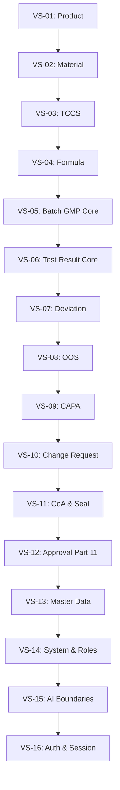

# PQM — BẢNG ÁNH XẠ DI CHUYỂN NGUỒN TÁI CẤU TRÚC TOÀN DIỆN (SOURCE MIGRATION MAP V1)

> **Tài liệu**: `docs/audit/PQM_REBUILD_SOURCE_MIGRATION_MAP_V1.md`  
> **Phiên bản**: `1.0.0-REBUILD-BASELINE`  
> **Giai đoạn**: **REBUILD PHASE 1 — SOURCE TREE PREPARATION**  
> **Nguyên tắc**: _Không move code kinh doanh trong phase này; không thay đổi behavior; không thay đổi contract; đối soát 100% mã nguồn._

---

## 📑 MỤC LỤC

1. [Nguyên tắc bất biến & Chỉ dẫn thực thi](#1-nguyên-tắc-bất-biến--chỉ-dẫn-thực-thi)
2. [Target Architecture Specification](#2-target-architecture-specification)
3. [Quy chuẩn định dạng bảng Migration Map](#3-quy-chuẩn-định-dạng-bảng-migration-map)
4. [Bảng ánh xạ di chuyển nguồn chi tiết (Detailed Source Migration Map)](#4-bảng-ánh-xạ-di-chuyển-nguồn-chi-tiết)
   - [4.1. Nhóm Workflow Kernel & Facade](#41-nhóm-workflow-kernel--facade)
   - [4.2. Nhóm Repository Interfaces & Infrastructure](#42-nhóm-repository-interfaces--infrastructure)
   - [4.3. Nhóm Domain & Business Rules](#43-nhóm-domain--business-rules)
   - [4.4. Nhóm Application Services & Use Cases](#44-nhóm-application-services--use-cases)
   - [4.5. Nhóm AI Boundary & Proposal Engine](#45-nhóm-ai-boundary--proposal-engine)
   - [4.6. Nhóm UI Pages, Components & Feature Hooks](#46-nhóm-ui-pages-components--feature-hooks)
   - [4.7. Nhóm Shared Types, Utilities, Constants & Schemas](#47-nhóm-shared-types-utilities-constants--schemas)
   - [4.8. Nhóm Architecture & Automated Regression Tests](#48-nhóm-architecture--automated-regression-tests)
5. [Lộ trình di chuyển theo 16 Vertical Slices](#5-lộ-trình-di-chuyển-theo-16-vertical-slices)
6. [Kế hoạch cô lập và xử lý mã cũ (Legacy Retirement Protocol)](#6-kế-hoạch-cô-lập-và-xử-lý-mã-cũ)
7. [Kiểm chứng Baseline & Architecture Gates](#7-kiểm-chứng-baseline--architecture-gates)

---

## 1. NGUYÊN TẮC BẤT BIẾN & CHỈ DẪN THỰC THI

1. **Không thay đổi Behavior (Zero Logic Alteration)**:
   - Toàn bộ business rules, FSM transitions, permissions, validation formulas, RTDB schemas, ALCOA+ audit trails và UI behavior phải được bảo toàn 100%. Rebuild là tái cấu trúc kiến trúc (Architecture Refactoring), không phải viết lại nghiệp vụ.
2. **Không di chuyển mù (Zero Blind Move)**:
   - Nghiêm cấm `mv file -> fix import -> build pass`. Mỗi file/module phải trải qua quy trình:  
     `AUDIT -> CLASSIFY -> MOVE -> REWIRE -> TEST -> VERIFY -> REMOVE LEGACY`.
3. **Không tạo Workflow thứ hai (Zero Alternative Workflow)**:
   - Nghiêm cấm tạo các abstraction trung gian như `NewWorkflow`, `RebuildWorkflow`, `V2Workflow`. Toàn bộ hoạt động tiếp tục đi qua canonical workflow kernel tại `src/workflow/`.
4. **Quy tắc Phase 1 (Source Tree Preparation)**:
   - Trong phase này, **tuyệt đối không di chuyển bất kỳ file code kinh doanh nào**. Chỉ lập bản đồ ánh xạ chi tiết, xác thực baseline xanh 100% (Typecheck, Vitest, Architecture Guard, Build) và trình phê duyệt kế hoạch.

---

## 2. TARGET ARCHITECTURE SPECIFICATION

Toàn bộ codebase sẽ hội tụ về cấu trúc phân tầng chuẩn DDD / Clean Architecture:

```text
src/
│
├── workflow/                         # SSoT Workflow Engine
│   ├── contracts/                    # actions.ts, events.ts, workflow.ts
│   ├── registry/                     # actionRegistry.ts (122 actions)
│   ├── kernel/                       # workflowExecutor.ts, context, result
│   ├── guards/                       # auth, validation, fsm, integrity
│   ├── handlers/                     # orchestration handlers per context
│   └── events/                       # outbox audit queue (ALCOA+ Fail-closed)
│
├── domains/                          # Pure Domain Slices (Zero I/O, Zero Firebase)
│   ├── product/                      # types, rules, fsm
│   ├── material/                     # types, rules, fsm
│   ├── tccs/                         # types, rules, fsm, criterion evaluation
│   ├── formula/                      # types, rules, fsm
│   ├── batch/                        # types, rules, 7 release gates
│   ├── test-result/                  # types, rules, quality evaluation engine
│   ├── deviation/                    # types, rules, fsm
│   ├── oos/                          # types, rules, fsm
│   ├── capa/                         # types, rules, fsm
│   ├── change-request/               # types, rules, fsm
│   ├── coa/                          # types, rules, hashing seal
│   ├── approval/                     # types, rules, fsm, 21 CFR Part 11
│   ├── master-data/                  # types, rules, criteria, labs
│   └── system/                       # types, rules, roles, tokens
│
├── application/                      # Application Services & Queries
│   ├── product/                      # ProductAppService, productQueries
│   ├── material/                     # MaterialAppService, materialQueries
│   ├── tccs/                         # TCCSAppService, tccsQueries
│   ├── formula/                      # FormulaAppService, formulaQueries
│   ├── batch/                        # BatchAppService, ReleaseService
│   ├── test-result/                  # TestResultAppService, labQueries
│   ├── deviation/                    # DeviationAppService
│   ├── oos/                          # OOSService
│   ├── capa/                         # CAPAService
│   ├── change-request/               # ChangeControlAppService
│   ├── coa/                          # CoAService
│   └── master-data/                  # Criteria, Pharmacopoeia, Lab services
│
├── infrastructure/                   # I/O, Persistence & Third-party Integrations
│   ├── firebase/                     # Firebase clients, database refs, auth
│   ├── repositories/                 # Firebase repository implementations
│   ├── audit/                        # Outbox queue, audit logging persistence
│   └── storage/                      # Cloud Storage, file uploads
│
├── repositories/                     # Repository Interfaces (DDD Port)
│   └── interfaces/                   # IBatchRepository, IProductRepository, ...
│
├── ui/                               # Presentation Layer
│   ├── pages/                        # Routable page components
│   ├── components/                   # Presentational & feature UI components
│   └── hooks/                        # Feature query hooks & useWorkflowActions
│
└── shared/                           # Cross-cutting primitives
    ├── types/                        # Global shared types
    ├── utils/                        # Pure utility functions
    ├── constants/                    # Application constants
    └── errors/                       # Workflow & Domain error definitions
```

---

## 3. QUY CHUẨN ĐỊNH DẠNG BẢNG MIGRATION MAP

Mỗi entry di chuyển nguồn được định dạng thống nhất:

- **CURRENT PATH**: Đường dẫn file hiện tại trong repository.
- **TARGET PATH**: Đường dẫn mục tiêu theo Target Architecture.
- **DOMAIN**: Phân vùng nghiệp vụ (Product, Batch, Test Result, Workflow Kernel, Shared...).
- **LAYER**: Tầng kiến trúc (`UI`, `UI_HOOK`, `APPLICATION`, `WORKFLOW`, `DOMAIN`, `REPOSITORY`, `INFRASTRUCTURE`, `UTILITY`, `TYPE`, `TEST`).
- **DEPENDENCIES**: Phụ thuộc vào file/layer nào (Inbound / Outbound).
- **WORKFLOW ACTIONS**: Các Action ID điều phối qua file này.
- **MIGRATION ORDER**: Giai đoạn và thứ tự di chuyển (`P-04`, `P-05`, `VS-01` -> `VS-16`, `P-18`...).
- **RISK**: Mức độ rủi ro nghiệp vụ và biện pháp kiểm soát (`Low`, `Medium`, `High`, `Critical`).

---

## 4. BẢNG ÁNH XẠ DI CHUYỂN NGUỒN CHI TIẾT

### 4.1. Nhóm Workflow Kernel & Facade

| CURRENT PATH                                             | TARGET PATH                                              | DOMAIN          | LAYER      | DEPENDENCIES                               | WORKFLOW ACTIONS              |    MIGRATION ORDER     |    RISK     |
| :------------------------------------------------------- | :------------------------------------------------------- | :-------------- | :--------- | :----------------------------------------- | :---------------------------- | :--------------------: | :---------: |
| `src/workflow/UnifiedWorkflowExecutor.ts`                | `src/workflow/kernel/workflowExecutor.ts`                | Workflow Kernel | `WORKFLOW` | In: Facade, Out: Guards, Handlers, Events  | ALL (122 actions)             |   **P-04 (Kernel)**    | 🔴 Critical |
| `src/workflow/WorkflowFacade.ts`                         | `src/workflow/kernel/WorkflowFacade.ts`                  | Workflow Kernel | `WORKFLOW` | In: Hooks, UI, Services; Out: Executor     | ALL (122 actions)             |   **P-04 (Kernel)**    | 🔴 Critical |
| `src/workflow/registry.ts`                               | `src/workflow/registry/actionRegistry.ts`                | Workflow Kernel | `WORKFLOW` | In: Executor; Out: Handlers                | ALL (122 actions)             |   **P-04 (Kernel)**    | 🔴 Critical |
| `src/workflow/contracts/actions.ts`                      | `src/workflow/contracts/actions.ts`                      | Workflow Kernel | `CONTRACT` | Đã chuẩn hóa SSoT                          | ALL (122 actions)             |   **P-04 (Kernel)**    |  🟡 Medium  |
| `src/workflow/contracts/events.ts`                       | `src/workflow/contracts/events.ts`                       | Workflow Kernel | `CONTRACT` | Đã chuẩn hóa SSoT                          | ALL (122 actions)             |   **P-04 (Kernel)**    |  🟡 Medium  |
| `src/workflow/contracts/workflow.ts`                     | `src/workflow/contracts/workflow.ts`                     | Workflow Kernel | `CONTRACT` | Đã chuẩn hóa SSoT                          | ALL (122 actions)             |   **P-04 (Kernel)**    |  🟡 Medium  |
| `src/workflow/definitions/CANONICAL_ACTION_REGISTRY.ts`  | `src/workflow/registry/actionDefinitions.ts`             | Workflow Kernel | `WORKFLOW` | In: Executor, Guards; Out: Types           | ALL (122 actions)             |   **P-04 (Kernel)**    |   🔴 High   |
| `src/workflow/events/AwaitedOutboxAuditQueue.ts`         | `src/workflow/events/awaitedOutboxAuditQueue.ts`         | Workflow Kernel | `WORKFLOW` | In: Executor; Out: Firebase Audit Repo     | ALL (Fail-Closed)             |   **P-04 (Kernel)**    | 🔴 Critical |
| `src/workflow/guards/rbacGuard.ts`                       | `src/workflow/guards/authorization/rbacGuard.ts`         | Workflow Kernel | `WORKFLOW` | In: Executor; Out: Permission Matrix       | ALL (122 actions)             |   **P-04 (Kernel)**    |   🔴 High   |
| `src/workflow/guards/reasonGuard.ts`                     | `src/workflow/guards/validation/reasonGuard.ts`          | Workflow Kernel | `WORKFLOW` | In: Executor; Out: String utils            | Regulated actions             |   **P-04 (Kernel)**    |  🟡 Medium  |
| `src/workflow/guards/signatureGuard.ts`                  | `src/workflow/guards/integrity/signatureGuard.ts`        | Workflow Kernel | `WORKFLOW` | In: Executor; Out: Crypto                  | Approval actions              |   **P-04 (Kernel)**    |   🔴 High   |
| `src/workflow/guards/destructiveActionGuard.ts`          | `src/workflow/guards/security/destructiveActionGuard.ts` | Workflow Kernel | `WORKFLOW` | In: Executor; Out: Token verifier          | DELETE / PURGE                |   **P-04 (Kernel)**    |   🔴 High   |
| `src/workflow/handlers/batchWorkflowHandlers.ts`         | `src/workflow/handlers/batchWorkflowHandlers.ts`         | Batch           | `WORKFLOW` | In: Executor; Out: BatchAppService         | BATCH\_\* (11 actions)        |   **VS-05 (Batch)**    | 🔴 Critical |
| `src/workflow/handlers/testResultWorkflowHandlers.ts`    | `src/workflow/handlers/testResultWorkflowHandlers.ts`    | Test Result     | `WORKFLOW` | In: Executor; Out: TestResultAppService    | TEST*RESULT*\* (9 actions)    | **VS-06 (TestResult)** | 🔴 Critical |
| `src/workflow/handlers/approvalWorkflowHandlers.ts`      | `src/workflow/handlers/approvalWorkflowHandlers.ts`      | Approval        | `WORKFLOW` | In: Executor; Out: ApprovalService         | APPROVAL\_\* (5 actions)      |  **VS-12 (Approval)**  |   🔴 High   |
| `src/workflow/handlers/deviationWorkflowHandlers.ts`     | `src/workflow/handlers/deviationWorkflowHandlers.ts`     | Deviation       | `WORKFLOW` | In: Executor; Out: DeviationAppService     | DEVIATION\_\* (6 actions)     | **VS-07 (Deviation)**  |   🔴 High   |
| `src/workflow/handlers/changeControlWorkflowHandlers.ts` | `src/workflow/handlers/changeControlWorkflowHandlers.ts` | Change Control  | `WORKFLOW` | In: Executor; Out: ChangeControlAppService | CHANGE*REQUEST*\* (6 actions) |   **VS-10 (Change)**   |   🔴 High   |

---

### 4.2. Nhóm Repository Interfaces & Infrastructure

| CURRENT PATH                                                     | TARGET PATH                                                            | DOMAIN         | LAYER            | DEPENDENCIES                     | WORKFLOW ACTIONS      |    MIGRATION ORDER     |    RISK     |
| :--------------------------------------------------------------- | :--------------------------------------------------------------------- | :------------- | :--------------- | :------------------------------- | :-------------------- | :--------------------: | :---------: |
| `src/repositories/ProductRepository.ts`                          | `src/repositories/interfaces/IProductRepository.ts`                    | Product        | `REPOSITORY`     | Pure interface, 0 Firebase       | PRODUCT\_\*           | **P-05 (Repo Bound)**  |   🟡 Low    |
| `src/repositories/MaterialRepository.ts`                         | `src/repositories/interfaces/IMaterialRepository.ts`                   | Material       | `REPOSITORY`     | Pure interface, 0 Firebase       | MATERIAL\_\*          | **P-05 (Repo Bound)**  |   🟡 Low    |
| `src/repositories/TCCSRepository.ts`                             | `src/repositories/interfaces/ITCCSRepository.ts`                       | TCCS           | `REPOSITORY`     | Pure interface, 0 Firebase       | TCCS\_\*              | **P-05 (Repo Bound)**  |   🟡 Low    |
| `src/repositories/FormulaRepository.ts`                          | `src/repositories/interfaces/IFormulaRepository.ts`                    | Formula        | `REPOSITORY`     | Pure interface, 0 Firebase       | FORMULA\_\*           | **P-05 (Repo Bound)**  |   🟡 Low    |
| `src/repositories/BatchRepository.ts`                            | `src/repositories/interfaces/IBatchRepository.ts`                      | Batch          | `REPOSITORY`     | Pure interface, 0 Firebase       | BATCH\_\*             | **P-05 (Repo Bound)**  |   🔴 High   |
| `src/repositories/TestResultRepository.ts`                       | `src/repositories/interfaces/ITestResultRepository.ts`                 | Test Result    | `REPOSITORY`     | Pure interface, 0 Firebase       | TEST*RESULT*\*        | **P-05 (Repo Bound)**  |   🔴 High   |
| `src/repositories/IDeviationRepository.ts`                       | `src/repositories/interfaces/IDeviationRepository.ts`                  | Deviation      | `REPOSITORY`     | Pure interface, 0 Firebase       | DEVIATION\_\*         | **P-05 (Repo Bound)**  |   🟡 Low    |
| `src/repositories/IChangeControlRepository.ts`                   | `src/repositories/interfaces/IChangeControlRepository.ts`              | Change Control | `REPOSITORY`     | Pure interface, 0 Firebase       | CHANGE*REQUEST*\*     | **P-05 (Repo Bound)**  |   🟡 Low    |
| `src/repositories/IApprovalTaskRepository.ts`                    | `src/repositories/interfaces/IApprovalTaskRepository.ts`               | Approval       | `REPOSITORY`     | Pure interface, 0 Firebase       | APPROVAL\_\*          | **P-05 (Repo Bound)**  |   🟡 Low    |
| `src/repositories/MasterCriterionRepository.ts`                  | `src/repositories/interfaces/IMasterCriterionRepository.ts`            | Master Data    | `REPOSITORY`     | Pure interface, 0 Firebase       | MASTER*CRITERIA*\*    | **P-05 (Repo Bound)**  |   🟡 Low    |
| `src/repositories/IPharmacopoeiaRepository.ts`                   | `src/repositories/interfaces/IPharmacopoeiaRepository.ts`              | Master Data    | `REPOSITORY`     | Pure interface, 0 Firebase       | PHARMACOPOEIA\_\*     | **P-05 (Repo Bound)**  |   🟡 Low    |
| `src/repositories/ILaboratoryRepository.ts`                      | `src/repositories/interfaces/ILaboratoryRepository.ts`                 | Master Data    | `REPOSITORY`     | Pure interface, 0 Firebase       | LABORATORY\_\*        | **P-05 (Repo Bound)**  |   🟡 Low    |
| `src/repositories/ISystemRepository.ts`                          | `src/repositories/interfaces/ISystemRepository.ts`                     | System         | `REPOSITORY`     | Pure interface, 0 Firebase       | SYSTEM\_\*            | **P-05 (Repo Bound)**  |   🟡 Low    |
| `src/repositories/firebase/BaseFirebaseRepository.ts`            | `src/infrastructure/repositories/BaseFirebaseRepository.ts`            | Infra          | `INFRASTRUCTURE` | Firebase RTDB primitives         | ALL reads/writes      | **P-05 (Repo Bound)**  | 🔴 Critical |
| `src/repositories/firebase/FirebaseProductRepository.ts`         | `src/infrastructure/repositories/FirebaseProductRepository.ts`         | Product        | `INFRASTRUCTURE` | Implements IProductRepository    | PRODUCT\_\*           |  **VS-01 (Product)**   |  🟡 Medium  |
| `src/repositories/firebase/FirebaseMaterialRepository.ts`        | `src/infrastructure/repositories/FirebaseMaterialRepository.ts`        | Material       | `INFRASTRUCTURE` | Implements IMaterialRepository   | MATERIAL\_\*          |  **VS-02 (Material)**  |  🟡 Medium  |
| `src/repositories/firebase/FirebaseTCCSRepository.ts`            | `src/infrastructure/repositories/FirebaseTCCSRepository.ts`            | TCCS           | `INFRASTRUCTURE` | Implements ITCCSRepository       | TCCS\_\*              |    **VS-03 (TCCS)**    |   🔴 High   |
| `src/repositories/firebase/FirebaseFormulaRepository.ts`         | `src/infrastructure/repositories/FirebaseFormulaRepository.ts`         | Formula        | `INFRASTRUCTURE` | Implements IFormulaRepository    | FORMULA\_\*           |  **VS-04 (Formula)**   |  🟡 Medium  |
| `src/repositories/firebase/FirebaseBatchRepository.ts`           | `src/infrastructure/repositories/FirebaseBatchRepository.ts`           | Batch          | `INFRASTRUCTURE` | Implements IBatchRepository      | BATCH\_\*             |   **VS-05 (Batch)**    | 🔴 Critical |
| `src/repositories/firebase/FirebaseTestResultRepository.ts`      | `src/infrastructure/repositories/FirebaseTestResultRepository.ts`      | Test Result    | `INFRASTRUCTURE` | Implements ITestResultRepository | TEST*RESULT*\*        | **VS-06 (TestResult)** | 🔴 Critical |
| `src/repositories/firebase/FirebaseDeviationRepository.ts`       | `src/infrastructure/repositories/FirebaseDeviationRepository.ts`       | Deviation      | `INFRASTRUCTURE` | Implements IDeviationRepository  | DEVIATION\_\*         | **VS-07 (Deviation)**  |   🔴 High   |
| `src/repositories/firebase/FirebaseChangeControlRepository.ts`   | `src/infrastructure/repositories/FirebaseChangeControlRepository.ts`   | Change Control | `INFRASTRUCTURE` | Implements IChangeControlRepo    | CHANGE*REQUEST*\*     |   **VS-10 (Change)**   |   🔴 High   |
| `src/repositories/firebase/FirebaseApprovalTaskRepository.ts`    | `src/infrastructure/repositories/FirebaseApprovalTaskRepository.ts`    | Approval       | `INFRASTRUCTURE` | Implements IApprovalTaskRepo     | APPROVAL\_\*          |  **VS-12 (Approval)**  |   🔴 High   |
| `src/repositories/firebase/FirebaseMasterCriterionRepository.ts` | `src/infrastructure/repositories/FirebaseMasterCriterionRepository.ts` | Master Data    | `INFRASTRUCTURE` | Implements IMasterCriterionRepo  | MASTER*CRITERIA*\*    | **VS-13 (MasterData)** |  🟡 Medium  |
| `src/repositories/firebase/FirebasePharmacopoeiaRepository.ts`   | `src/infrastructure/repositories/FirebasePharmacopoeiaRepository.ts`   | Master Data    | `INFRASTRUCTURE` | Implements IPharmacopoeiaRepo    | PHARMACOPOEIA\_\*     | **VS-13 (MasterData)** |  🟡 Medium  |
| `src/repositories/firebase/FirebaseLaboratoryRepository.ts`      | `src/infrastructure/repositories/FirebaseLaboratoryRepository.ts`      | Master Data    | `INFRASTRUCTURE` | Implements ILaboratoryRepo       | LABORATORY\_\*        | **VS-13 (MasterData)** |  🟡 Medium  |
| `src/repositories/firebase/FirebaseSystemRepository.ts`          | `src/infrastructure/repositories/FirebaseSystemRepository.ts`          | System         | `INFRASTRUCTURE` | Implements ISystemRepository     | SYSTEM\_\*            |   **VS-14 (System)**   |  🟡 Medium  |
| `src/firebase.ts`                                                | `src/infrastructure/firebase/firebaseConfig.ts`                        | Infra          | `INFRASTRUCTURE` | Firebase SDK App & Database init | Global Firebase       | **P-05 (Repo Bound)**  | 🔴 Critical |
| `src/services/storageService.ts`                                 | `src/infrastructure/storage/storageService.ts`                         | Infra          | `INFRASTRUCTURE` | Firebase Storage upload/download | COA, PDF, Attachments | **P-05 (Repo Bound)**  |  🟡 Medium  |

---

### 4.3. Nhóm Domain & Business Rules

| CURRENT PATH                                       | TARGET PATH                                                 | DOMAIN             | LAYER    | DEPENDENCIES                | WORKFLOW ACTIONS                 |    MIGRATION ORDER     |    RISK     |
| :------------------------------------------------- | :---------------------------------------------------------- | :----------------- | :------- | :-------------------------- | :------------------------------- | :--------------------: | :---------: |
| `src/domain/evaluation/QualityEvaluationEngine.ts` | `src/domains/test-result/domain/qualityEvaluationEngine.ts` | Test Result        | `DOMAIN` | Pure logic, 0 I/O           | TEST_RESULT_EVALUATE             | **VS-06 (TestResult)** | 🔴 Critical |
| `src/domain/evaluation/CriterionEvaluator.ts`      | `src/domains/tccs/domain/criterionEvaluator.ts`             | TCCS               | `DOMAIN` | Pure comparison, 0 I/O      | TEST_RESULT_EVALUATE             |    **VS-03 (TCCS)**    |   🔴 High   |
| `src/domain/evaluation/AlternateRuleEvaluator.ts`  | `src/domains/tccs/domain/alternateRuleEvaluator.ts`         | TCCS               | `DOMAIN` | Pure rule matching, 0 I/O   | TCCS_RULE_EVAL                   |    **VS-03 (TCCS)**    |  🟡 Medium  |
| `src/domain/rules/ReleaseRules.ts`                 | `src/domains/batch/domain/releaseRules.ts`                  | Batch              | `DOMAIN` | Pure 7 Release Gates, 0 I/O | BATCH_RELEASE, HOLD              |   **VS-05 (Batch)**    | 🔴 Critical |
| `src/domain/canonical/canonicalResolver.ts`        | `src/domains/system/domain/canonicalResolver.ts`            | System / Canonical | `DOMAIN` | Pure status mapping, 0 I/O  | ALL Status Resolvers             |   **VS-14 (System)**   |   🔴 High   |
| `src/domain/batch/batchStateMachine.ts`            | `src/domains/batch/domain/batchStateMachine.ts`             | Batch              | `DOMAIN` | Pure FSM transitions        | BATCH\_\* (Start, Hold, Release) |   **VS-05 (Batch)**    | 🔴 Critical |
| `src/domain/test-result/testResultStateMachine.ts` | `src/domains/test-result/domain/testResultStateMachine.ts`  | Test Result        | `DOMAIN` | Pure FSM transitions        | TEST*RESULT*\*                   | **VS-06 (TestResult)** | 🔴 Critical |
| `src/domain/audit/immutableSeal.ts`                | `src/domains/coa/domain/immutableSeal.ts`                   | CoA / Audit        | `DOMAIN` | SHA-256 seal generator      | COA_GENERATE, RELEASE            |    **VS-11 (CoA)**     |   🔴 High   |
| `src/domain/concurrency/occGuard.ts`               | `src/domains/system/domain/occGuard.ts`                     | Concurrency        | `DOMAIN` | Pure version comparison     | ALL Concurrent Mutate            |   **VS-14 (System)**   |  🟡 Medium  |

---

### 4.4. Nhóm Application Services & Use Cases

| CURRENT PATH                                    | TARGET PATH                                                 | DOMAIN         | LAYER         | DEPENDENCIES                                       | WORKFLOW ACTIONS                 |    MIGRATION ORDER     |    RISK     |
| :---------------------------------------------- | :---------------------------------------------------------- | :------------- | :------------ | :------------------------------------------------- | :------------------------------- | :--------------------: | :---------: |
| `src/services/app/ProductAppService.ts`         | `src/application/product/ProductAppService.ts`              | Product        | `APPLICATION` | In: Facade/Handler, Out: ProductRepo               | PRODUCT_CREATE, UPDATE, DELETE   |  **VS-01 (Product)**   |  🟡 Medium  |
| `src/services/app/MaterialAppService.ts`        | `src/application/material/MaterialAppService.ts`            | Material       | `APPLICATION` | In: Facade/Handler, Out: MaterialRepo              | MATERIAL_CREATE, UPDATE, DELETE  |  **VS-02 (Material)**  |  🟡 Medium  |
| `src/services/app/TCCSAppService.ts`            | `src/application/tccs/TCCSAppService.ts`                    | TCCS           | `APPLICATION` | In: Facade/Handler, Out: TCCSRepo                  | TCCS_CREATE, SUBMIT, APPROVE     |    **VS-03 (TCCS)**    |   🔴 High   |
| `src/services/app/FormulaAppService.ts`         | `src/application/formula/FormulaAppService.ts`              | Formula        | `APPLICATION` | In: Facade/Handler, Out: FormulaRepo               | FORMULA_CREATE, UPDATE, DELETE   |  **VS-04 (Formula)**   |  🟡 Medium  |
| `src/services/app/BatchAppService.ts`           | `src/application/batch/BatchAppService.ts`                  | Batch          | `APPLICATION` | In: Facade/Handler, Out: BatchRepo, ReleaseService | BATCH_CREATE, START, HOLD, CLOSE |   **VS-05 (Batch)**    | 🔴 Critical |
| `src/services/app/ReleaseService.ts`            | `src/application/batch/ReleaseService.ts`                   | Batch          | `APPLICATION` | In: BatchAppService, Out: ReleaseRules             | BATCH_RELEASE (Gate 1->7)        |   **VS-05 (Batch)**    | 🔴 Critical |
| `src/services/app/TestResultAppService.ts`      | `src/application/test-result/TestResultAppService.ts`       | Test Result    | `APPLICATION` | In: Facade/Handler, Out: TestResultRepo            | TEST_RESULT_SAVE_DRAFT, SUBMIT   | **VS-06 (TestResult)** | 🔴 Critical |
| `src/services/app/DeviationAppService.ts`       | `src/application/deviation/DeviationAppService.ts`          | Deviation      | `APPLICATION` | In: Facade/Handler, Out: DeviationRepo             | DEVIATION_CREATE, INVESTIGATE    | **VS-07 (Deviation)**  |   🔴 High   |
| `src/services/app/OOSService.ts`                | `src/application/oos/OOSService.ts`                         | OOS            | `APPLICATION` | In: Facade/Handler, Out: OOSRepo                   | OOS_OPEN, INVESTIGATE            |    **VS-08 (OOS)**     |   🔴 High   |
| `src/services/app/CAPAService.ts`               | `src/application/capa/CAPAService.ts`                       | CAPA           | `APPLICATION` | In: Facade/Handler, Out: CAPARepo                  | CAPA_CREATE, IMPLEMENT           |    **VS-09 (CAPA)**    |   🔴 High   |
| `src/services/app/ChangeControlAppService.ts`   | `src/application/change-request/ChangeControlAppService.ts` | Change Control | `APPLICATION` | In: Facade/Handler, Out: ChangeControlRepo         | CHANGE_REQUEST_CREATE, APPROVE   |   **VS-10 (Change)**   |   🔴 High   |
| `src/services/app/CoAService.ts`                | `src/application/coa/CoAService.ts`                         | CoA            | `APPLICATION` | In: Facade/Handler, Out: Storage, Seal             | COA_GENERATE, SIGN, REVOKE       |    **VS-11 (CoA)**     |   🔴 High   |
| `src/services/app/ApprovalWorkflowService.ts`   | `src/application/approval/ApprovalWorkflowService.ts`       | Approval       | `APPLICATION` | In: Facade/Handler, Out: ApprovalRepo              | APPROVAL_SUBMIT, APPROVE, REJECT |  **VS-12 (Approval)**  |   🔴 High   |
| `src/services/app/MasterCriterionAppService.ts` | `src/application/master-data/MasterCriterionAppService.ts`  | Master Data    | `APPLICATION` | In: Facade/Handler, Out: MasterCriterionRepo       | MASTER_CRITERIA_CREATE, UPDATE   | **VS-13 (MasterData)** |  🟡 Medium  |
| `src/services/app/PharmacopoeiaAppService.ts`   | `src/application/master-data/PharmacopoeiaAppService.ts`    | Master Data    | `APPLICATION` | In: Facade/Handler, Out: PharmacopoeiaRepo         | PHARMACOPOEIA_SYNC, IMPORT       | **VS-13 (MasterData)** |  🟡 Medium  |
| `src/services/app/LaboratoryAppService.ts`      | `src/application/master-data/LaboratoryAppService.ts`       | Master Data    | `APPLICATION` | In: Facade/Handler, Out: LaboratoryRepo            | LABORATORY_CREATE, UPDATE        | **VS-13 (MasterData)** |  🟡 Medium  |
| `src/services/app/SystemAppService.ts`          | `src/application/system/SystemAppService.ts`                | System         | `APPLICATION` | In: Facade/Handler, Out: SystemRepo                | SYSTEM_CONFIG_UPDATE, REPAIR     |   **VS-14 (System)**   |  🟡 Medium  |
| `src/services/userService.ts`                   | `src/application/system/userService.ts`                     | System         | `APPLICATION` | In: UI/Admin, Out: UserRepo                        | USER_CREATE, UPDATE_ROLE         |   **VS-14 (System)**   |  🟡 Medium  |
| `src/services/permissionService.ts`             | `src/application/system/permissionService.ts`               | System         | `APPLICATION` | In: Workflow RBAC Guard, Out: Roles                | Check permissions                |   **VS-14 (System)**   |   🔴 High   |
| `src/services/auditService.ts`                  | `src/application/system/auditService.ts`                    | System         | `APPLICATION` | In: Outbox Queue, Out: AuditRepo                   | AUDIT_LOG_WRITE                  |   **VS-14 (System)**   | 🔴 Critical |
| `src/services/authService.ts`                   | `src/application/auth/authService.ts`                       | Auth           | `APPLICATION` | In: AuthProvider, Out: Firebase Auth               | USER_LOGIN, LOGOUT, REFRESH      |    **VS-16 (Auth)**    |   🔴 High   |

---

### 4.5. Nhóm AI Boundary & Proposal Engine

| CURRENT PATH                                     | TARGET PATH                                                   | DOMAIN      | LAYER          | DEPENDENCIES                             | WORKFLOW ACTIONS                    | MIGRATION ORDER |   RISK    |
| :----------------------------------------------- | :------------------------------------------------------------ | :---------- | :------------- | :--------------------------------------- | :---------------------------------- | :-------------: | :-------: |
| `src/services/ai/aiActionGuard.ts`               | `src/interfaces/ai/guards/aiActionGuard.ts`                   | AI Boundary | `AI_GUARD`     | In: AI Tools; Out: Proposal Envelope     | Converts mutate -> AIActionProposal | **VS-15 (AI)**  |  🔴 High  |
| `src/services/ai/aiDraftManager.ts`              | `src/interfaces/ai/services/aiDraftManager.ts`                | AI Boundary | `AI_SERVICE`   | In: UI Components; Out: Local draft      | Local drafts, 0 Firebase write      | **VS-15 (AI)**  | 🟡 Medium |
| `src/services/ai/geminiService.ts`               | `src/interfaces/ai/engine/geminiService.ts`                   | AI Boundary | `AI_ENGINE`    | In: AI Assistants; Out: Google GenAI SDK | Read-only analysis & proposals      | **VS-15 (AI)**  | 🟡 Medium |
| `src/services/ai/tccsAssistantService.ts`        | `src/interfaces/ai/assistants/tccsAssistantService.ts`        | AI Boundary | `AI_ASSISTANT` | In: UI; Out: Proposal Envelope           | AI Suggest criteria / TCCS          | **VS-15 (AI)**  | 🟡 Medium |
| `src/services/ai/predictiveInspectionService.ts` | `src/interfaces/ai/assistants/predictiveInspectionService.ts` | AI Boundary | `AI_ASSISTANT` | In: UI; Out: Analytical charts           | Read-only predictive trends         | **VS-15 (AI)**  |  🟡 Low   |
| `src/services/ai/materialHarmonizerService.ts`   | `src/interfaces/ai/assistants/materialHarmonizerService.ts`   | AI Boundary | `AI_ASSISTANT` | In: UI; Out: Mapping Proposal            | AI Material Mapping Proposal        | **VS-15 (AI)**  | 🟡 Medium |
| `src/services/ai/dataIntegrityService.ts`        | `src/interfaces/ai/assistants/dataIntegrityService.ts`        | AI Boundary | `AI_ASSISTANT` | In: UI; Out: Discrepancy report          | Audit trail anomaly check           | **VS-15 (AI)**  |  🟡 Low   |

---

### 4.6. Nhóm UI Pages, Components & Feature Hooks

| CURRENT PATH                                            | TARGET PATH                                          | DOMAIN            | LAYER     | DEPENDENCIES                           | WORKFLOW ACTIONS               |   MIGRATION ORDER    |    RISK     |
| :------------------------------------------------------ | :--------------------------------------------------- | :---------------- | :-------- | :------------------------------------- | :----------------------------- | :------------------: | :---------: |
| `src/pages/products/ProductFormPage.tsx`                | `src/ui/pages/products/ProductFormPage.tsx`          | Product           | `UI`      | In: Router; Out: useWorkflowActions    | PRODUCT_CREATE, UPDATE         | **P-18 (UI Slices)** |  🟡 Medium  |
| `src/pages/products/ProductList.tsx`                    | `src/ui/pages/products/ProductList.tsx`              | Product           | `UI`      | In: Router; Out: productQueries        | READ Product                   | **P-18 (UI Slices)** |   🟡 Low    |
| `src/pages/products/materials/MaterialFormPage.tsx`     | `src/ui/pages/materials/MaterialFormPage.tsx`        | Material          | `UI`      | In: Router; Out: useWorkflowActions    | MATERIAL_CREATE, UPDATE        | **P-18 (UI Slices)** |  🟡 Medium  |
| `src/pages/products/materials/MaterialList.tsx`         | `src/ui/pages/materials/MaterialList.tsx`            | Material          | `UI`      | In: Router; Out: materialQueries       | READ Material                  | **P-18 (UI Slices)** |   🟡 Low    |
| `src/pages/qa/TCCSFormPage.tsx`                         | `src/ui/pages/tccs/TCCSFormPage.tsx`                 | TCCS              | `UI`      | In: Router; Out: useWorkflowActions    | TCCS_CREATE, UPDATE, SUBMIT    | **P-18 (UI Slices)** |   🔴 High   |
| `src/pages/qa/TccsDetailPage.tsx`                       | `src/ui/pages/tccs/TccsDetailPage.tsx`               | TCCS              | `UI`      | In: Router; Out: useWorkflowActions    | TCCS_APPROVE, REJECT           | **P-18 (UI Slices)** |   🔴 High   |
| `src/pages/products/formula/ProductFormulaFormPage.tsx` | `src/ui/pages/formula/ProductFormulaFormPage.tsx`    | Formula           | `UI`      | In: Router; Out: useWorkflowActions    | FORMULA_CREATE, UPDATE         | **P-18 (UI Slices)** |  🟡 Medium  |
| `src/pages/batches/BatchFormPage.tsx`                   | `src/ui/pages/batches/BatchFormPage.tsx`             | Batch             | `UI`      | In: Router; Out: useWorkflowActions    | BATCH_CREATE, UPDATE           | **P-18 (UI Slices)** |   🔴 High   |
| `src/pages/batches/BatchDetailPage.tsx`                 | `src/ui/pages/batches/BatchDetailPage.tsx`           | Batch             | `UI`      | In: Router; Out: useWorkflowActions    | BATCH_START, HOLD, RELEASE     | **P-18 (UI Slices)** | 🔴 Critical |
| `src/pages/qa/TestResultFormPage.tsx`                   | `src/ui/pages/test-results/TestResultFormPage.tsx`   | Test Result       | `UI`      | In: Router; Out: useWorkflowActions    | TEST_RESULT_SAVE_DRAFT, SUBMIT | **P-18 (UI Slices)** | 🔴 Critical |
| `src/pages/qa/DeviationListPage.tsx`                    | `src/ui/pages/deviations/DeviationListPage.tsx`      | Deviation         | `UI`      | In: Router; Out: useWorkflowActions    | DEVIATION_CREATE, CLOSE        | **P-18 (UI Slices)** |   🔴 High   |
| `src/pages/qa/CoAReportPage.tsx`                        | `src/ui/pages/coa/CoAReportPage.tsx`                 | CoA               | `UI`      | In: Router; Out: useWorkflowActions    | COA_GENERATE, SIGN             | **P-18 (UI Slices)** |   🔴 High   |
| `src/pages/public/CoAVerifyPage.tsx`                    | `src/ui/pages/coa/CoAVerifyPage.tsx`                 | CoA Public        | `UI`      | In: Router; Out: Public verify queries | READ & VERIFY SEAL             | **P-18 (UI Slices)** |   🟡 Low    |
| `src/pages/system/SettingsPage.tsx`                     | `src/ui/pages/system/SettingsPage.tsx`               | System            | `UI`      | In: Router; Out: useWorkflowActions    | SYSTEM_CONFIG_UPDATE           | **P-18 (UI Slices)** |  🟡 Medium  |
| `src/hooks/useWorkflowActions.ts`                       | `src/ui/hooks/useWorkflowActions.ts`                 | Presentation Hook | `UI_HOOK` | In: UI Forms; Out: WorkflowFacade      | ALL CANONICAL ACTIONS          | **P-18 (UI Slices)** | 🔴 Critical |
| `src/components/features/ESignatureModal.tsx`           | `src/ui/components/features/ESignatureModal.tsx`     | Part 11 Signature | `UI`      | In: Form Pages; Out: Signature Service | E-Signature Token Generation   | **P-18 (UI Slices)** |   🔴 High   |
| `src/components/features/ALCOAWatchdogWidget.tsx`       | `src/ui/components/features/ALCOAWatchdogWidget.tsx` | Telemetry UI      | `UI`      | In: AuditLogPage; Out: Telemetry Store | Observability / Telemetry View | **P-18 (UI Slices)** |   🟡 Low    |

---

### 4.7. Nhóm Shared Types, Utilities, Constants & Schemas

| CURRENT PATH               | TARGET PATH                                | DOMAIN           | LAYER      | DEPENDENCIES                    | WORKFLOW ACTIONS          |  MIGRATION ORDER  |   RISK    |
| :------------------------- | :----------------------------------------- | :--------------- | :--------- | :------------------------------ | :------------------------ | :---------------: | :-------: |
| `src/types.ts`             | `src/shared/types/legacyAggregateTypes.ts` | Shared Types     | `TYPE`     | Chứa type dùng chung            | Global                    | **P-05 / Slices** | 🟡 Medium |
| `src/types/index.ts`       | `src/shared/types/index.ts`                | Shared Types     | `TYPE`     | Re-export aggregate types       | Global                    | **P-05 / Slices** | 🟡 Medium |
| `src/constants/index.ts`   | `src/shared/constants/index.ts`            | Shared Constants | `CONSTANT` | Constant định nghĩa toàn app    | Global                    |  **P-04 / P-05**  |  🟡 Low   |
| `src/utils/spcEngine.ts`   | `src/shared/utils/spcEngine.ts`            | Statistics       | `UTILITY`  | Thuật toán SPC/Wee rules, 0 I/O | Analytical evaluation     |     **P-05**      |  🟡 Low   |
| `src/utils/concurrency.ts` | `src/shared/utils/concurrency.ts`          | Concurrency      | `UTILITY`  | Mutex, debounce, atomic queue   | Outbox & Concurrent write |     **P-04**      | 🟡 Medium |
| `src/utils/urlUtils.ts`    | `src/shared/utils/urlUtils.ts`             | Router / URL     | `UTILITY`  | Base URL & navigation helpers   | Public links              |     **P-05**      |  🟡 Low   |
| `src/schemas/`             | `src/shared/schemas/`                      | Validation       | `SCHEMA`   | Zod schemas validate form       | Form inputs               |     **P-05**      |  🟡 Low   |

---

### 4.8. Nhóm Architecture & Automated Regression Tests

| CURRENT PATH                                             | TARGET PATH                                              | DOMAIN            | LAYER  | DEPENDENCIES                            | WORKFLOW ACTIONS  |    MIGRATION ORDER    |    RISK     |
| :------------------------------------------------------- | :------------------------------------------------------- | :---------------- | :----- | :-------------------------------------- | :---------------- | :-------------------: | :---------: |
| `tests/architecture/noOrphanWorkflowActions.test.ts`     | `tests/architecture/noOrphanWorkflowActions.test.ts`     | Architecture Gate | `TEST` | Quét Action Registry & Inventory        | ALL (122 actions) |   **P-21 (Gates)**    |   🔴 High   |
| `tests/architecture/unifiedWorkflowArchitecture.test.ts` | `tests/architecture/unifiedWorkflowArchitecture.test.ts` | Architecture Gate | `TEST` | Kiểm tra tính nhất quán kiến trúc       | Unified Workflow  |   **P-21 (Gates)**    |   🔴 High   |
| `tests/security/workflowBypass.test.ts`                  | `tests/security/workflowBypass.test.ts`                  | Security Gate     | `TEST` | Kiểm chứng client không thể bypass RTDB | Security rules    |   **P-21 (Gates)**    | 🔴 Critical |
| `tests/e2e/e2eWorkflowScenarios.test.ts`                 | `tests/e2e/e2eWorkflowScenarios.test.ts`                 | E2E Scenarios     | `TEST` | Kịch bản trọn đời S-001 -> S-006        | E2E journeys      | **P-23 (Regression)** | 🔴 Critical |
| `tests/domain/pqmWorkflow.test.ts`                       | `tests/domain/pqmWorkflow.test.ts`                       | Full Lifecycle    | `TEST` | Kiểm thử toàn diện 20 module workflows  | All workflows     | **P-23 (Regression)** | 🔴 Critical |

---

## 5. LỘ TRÌNH DI CHUYỂN THEO 16 VERTICAL SLICES

Quá trình di chuyển mã nguồn nghiệp vụ thực hiện tuần tự theo 16 lát dọc độc lập (Phase 6):



### Chu trình chuẩn cho từng Vertical Slice (5 bước):

1. **AUDIT**: Kiểm tra toàn bộ imports, dependencies và các Action IDs gắn liền với Slice.
2. **MOVE & REWIRE**: Di chuyển code domain, application service, repository interface và implementation vào cây thư mục mới; cập nhật imports nội bộ.
3. **TEST**: Chạy test unit và integration riêng của domain slice đó.
4. **VERIFY**: Chạy `npm run workflow:guard`, `npx tsc --noEmit` và `npm test`.
5. **COMMIT**: Tạo commit độc lập cho từng domain theo quy ước:
   `refactor(rebuild): migrate <domain> domain to canonical architecture`.

---

## 6. KẾ HOẠCH CÔ LẬP VÀ XỬ LÝ MÃ CŨ (LEGACY RETIREMENT PROTOCOL)

Khi mã nguồn được di chuyển sang cấu trúc mới, mã cũ được kiểm soát theo 3 trạng thái phân định rõ ràng trong `docs/audit/PQM_LEGACY_REMOVAL_REGISTER_V1.md`:

1. **`MIGRATED`**: Mã nguồn đã được chuyển dịch hoàn toàn sang thư mục mới; caller đã được cập nhật 100%; unit tests của module mới đã PASS. File cũ được đánh dấu deprecated hoặc adapter chuyển tiếp tạm thời.
2. **`EXPLICITLY RETAINED`**: Mã nguồn đóng vai trò adapter chuyển tiếp hoặc duy trì tính tương thích ngược cho read-path trong thời gian chuyển đổi (ví dụ `LegacyServiceAdapter.ts`). Có deadline loại bỏ cụ thể tại Phase 19.
3. **`REMOVED`**: Mã nguồn cũ đã xóa hoàn toàn khỏi repository sau khi chứng minh không còn bất kỳ caller nào và toàn bộ test suites đã pass 100%.

> ⚠️ **Quy tắc tuyệt đối**: Không tồn tại bất kỳ file nào có trạng thái `UNKNOWN`. Không xóa file chỉ vì "nghĩ rằng không có ai dùng" mà phải qua kiểm tra AST/grep.

---

## 7. KIỂM CHỨNG BASELINE & ARCHITECTURE GATES

Trước khi bắt đầu bất kỳ thao tác di chuyển mã nguồn nào trong Phase 2, toàn bộ các cổng kiểm tra kỹ thuật sau đây bắt buộc phải đạt trạng thái **PASS 100%**:

| Kiểm tra kỹ thuật            | Lệnh thực thi            |     Kết quả Baseline Phase 1      | Tiêu chuẩn chấp thuận (Acceptance)          |
| :--------------------------- | :----------------------- | :-------------------------------: | :------------------------------------------ |
| **TypeScript Typecheck**     | `npx tsc --noEmit`       |    **0 errors (Exit code 0)**     | 0 lỗi kiểu dữ liệu toàn bộ dự án            |
| **Boundary Guard**           | `npm run workflow:guard` |     **0 vi phạm / 547 files**     | 0 import trực tiếp Firebase từ UI/Hook      |
| **Unit & Integration Tests** | `npm test`               | **161 suites / 1,523 tests PASS** | 100% test suites vượt qua                   |
| **Vite Production Build**    | `npm run build`          | **Built in 12.12s (Exit code 0)** | Bundle dist sạch, không cảnh báo gãy module |

---

## 8. KẾT LUẬN & ĐỀ XUẤT HÀNH ĐỘNG TIẾP THEO

Bản đồ di chuyển mã nguồn `PQM_REBUILD_SOURCE_MIGRATION_MAP_V1.md` đã xác lập tọa độ chính xác cho từng file mã nguồn của hệ thống PQM từ vị trí hiện hữu sang kiến trúc phân tầng mục tiêu, tuân thủ nguyên tắc không làm thay đổi hành vi nghiệp vụ.

**Trạng thái Phase 1**: ĐÃ HOÀN TẤT LẬP KẾ HOẠCH & XÁC MINH BASELINE.  
**Bước kế tiếp theo quy trình**: Dừng lại báo cáo người dùng để xin phê duyệt kế hoạch trước khi bước sang **PHASE 2: REBUILD WORKFLOW KERNEL**.
