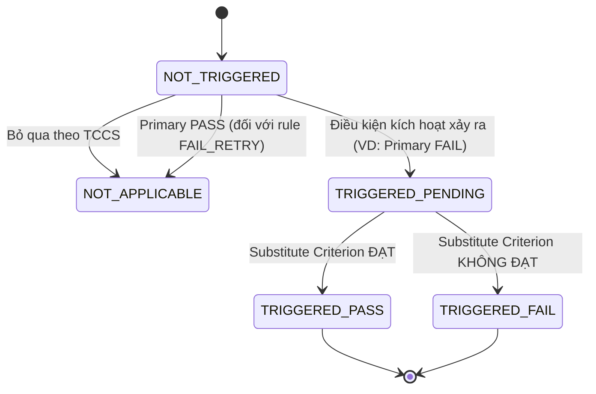

# ALTERNATE_RULE_CONTRACT: Hợp Đồng Dữ Liệu Quy Tắc Chỉ Tiêu Thay Thế

Tài liệu này chuẩn hóa toàn bộ cấu trúc dữ liệu, các loại hình quan hệ và máy trạng thái (FSM) của Quy tắc Chỉ tiêu Thay thế (Alternate Rule) trong hệ thống PQM.

---

## 1. Bản Chất Nghiệp Vụ Của Quy Tắc Thay Thế (V2 Supported Scope)

Trong kiểm nghiệm dược phẩm theo Dược điển (USP, BP, Dược điển Việt Nam), PQM V2 hỗ trợ chính thức và duy nhất **2 loại quan hệ quy tắc thay thế**:

1. **`FAIL_RETRY` (Thử lại khi không đạt)**: Khi phép thử sơ bộ 1 không đạt (ví dụ: Độ tan rã lần 1 còn 1 viên chưa rã), quy chuẩn cho phép thử lại lần 2 với cỡ mẫu mở rộng (12 viên tiếp theo). Nếu lần 2 đạt thì toàn bộ chỉ tiêu được công nhận Đạt.
2. **`CONDITIONAL_CHECK` (Kiểm tra có điều kiện / Miễn thử)**: Nếu chỉ tiêu A đạt mức an toàn cao (ví dụ: Arsen tổng số $\le$ 1.5 ppm hoặc Quy trình vô trùng được thẩm định), chỉ tiêu vi sinh/hóa vô cơ B được miễn kiểm tra thường quy (`EXEMPTED`).

> **LƯU Ý VỀ PHẠM VI (SCOPE FREEZE)**:  
> Các quy tắc `SUBSTITUTION` (thay thế phương pháp) và `PERIODIC_SKIP` (kiểm nghiệm luân phiên) được xác định là **`FUTURE / OUT OF SCOPE (V3+)`**. Tuyệt đối không tạo nghĩa vụ cài đặt hay cam kết hỗ trợ trong Domain Engine V2.

### 1.1. Ma Trận Phân Giải Logic Chuẩn Tắc (Canonical Resolution Matrix)

#### A. Đối với `FAIL_RETRY`:

| Chỉ tiêu chính (Main) | Chỉ tiêu phụ (Dependent) | Trạng thái phụ thuộc (Execution) | Kết luận chất lượng chỉ tiêu chính |
| :-------------------- | :----------------------- | :------------------------------- | :--------------------------------- |
| **`PASS`**            | Bất kỳ / Chưa làm        | `NOT_APPLICABLE`                 | **`PASS`** (Đạt ngay lần 1)        |
| **`FAIL`**            | Chưa làm / Trống         | `REQUIRED` (`TRIGGERED_PENDING`) | **`PENDING`** (Chờ thử lần 2)      |
| **`FAIL`**            | **`PASS`**               | `COMPLETED` (`TRIGGERED_PASS`)   | **`PASS`** (Được cứu thành công)   |
| **`FAIL`**            | **`FAIL`**               | `COMPLETED` (`TRIGGERED_FAIL`)   | **`FAIL`** (Khẳng định hỏng, OOS)  |

#### B. Đối với `CONDITIONAL_CHECK`:

| Điều kiện kích hoạt (Condition)     | Chỉ tiêu phụ thuộc (Dependent) | Trạng thái thực thi | Kết luận chất lượng chỉ tiêu phụ  |
| :---------------------------------- | :----------------------------- | :------------------ | :-------------------------------- |
| **`FALSE`** (Đạt điều kiện an toàn) | Không cần làm                  | **`EXEMPTED`**      | **`PASS`** (Miễn kiểm hợp lệ)     |
| **`TRUE`** (Vi phạm điều kiện)      | Chưa làm / Trống               | **`REQUIRED`**      | **`PENDING`** (Bắt buộc kiểm tra) |
| **`TRUE`** (Vi phạm điều kiện)      | **`PASS`**                     | **`COMPLETED`**     | **`PASS`** (Phép thử phụ đạt)     |
| **`TRUE`** (Vi phạm điều kiện)      | **`FAIL`**                     | **`COMPLETED`**     | **`FAIL`** (Phép thử phụ hỏng)    |

---

## 2. Định Nghĩa Kiểu Dữ Liệu (TypeScript Domain Interface)

```typescript
/**
 * Loại quan hệ thay thế giữa các chỉ tiêu (V2 Supported Scope)
 */
export type AlternateRuleType =
  | 'FAIL_RETRY' // Chỉ tiêu chính Fail -> Cho phép thử chỉ tiêu phụ/mở rộng
  | 'CONDITIONAL_CHECK'; // Điều kiện an toàn -> Miễn kiểm hoặc kích hoạt chỉ tiêu phụ

/**
 * Trạng thái kích hoạt và giải quyết của Quy tắc Thay thế
 */
export type AlternateRuleState =
  | 'NOT_APPLICABLE' // Quy tắc không kích hoạt cho lô này
  | 'NOT_TRIGGERED' // Điều kiện kích hoạt chưa xảy ra (chờ kết quả chỉ tiêu chính)
  | 'TRIGGERED_PENDING' // Đã kích hoạt điều kiện thay thế, đang chờ chỉ tiêu phụ
  | 'TRIGGERED_PASS' // Chỉ tiêu phụ đã hoàn tất và ĐẠT -> Cứu chỉ tiêu chính ĐẠT
  | 'TRIGGERED_FAIL'; // Chỉ tiêu phụ đã hoàn tất nhưng KHÔNG ĐẠT -> Lô Không Đạt

/**
 * Hợp đồng dữ liệu cấu hình Quy tắc Thay thế trong TCCS
 */
export interface AlternateRuleConfig {
  ruleId: string;
  ruleCode: string;
  ruleName: string;
  ruleType: AlternateRuleType;
  primaryCriterionId: string; // Chỉ tiêu chính (Primary)
  substituteCriterionId: string; // Chỉ tiêu thay thế / phụ thuộc (Substitute)

  // Điều kiện kích hoạt
  triggerCondition: {
    expectedPrimaryStatus: 'PASS' | 'FAIL';
    customLogicExpression?: string; // Ví dụ: "dissolution_stage_1 < 75"
  };

  // Căn cứ pháp lý
  regulatoryReference: {
    standardDocument: string; // Ví dụ: "Dược điển Việt Nam V, Phụ lục 11.4"
    approvalDecisionNumber?: string; // Quyết định nội bộ
    footnoteText: string; // Đoạn văn bản in chân trang CoA
  };
}

/**
 * Hợp đồng dữ liệu thực thi của Quy tắc Thay thế trên một Lô cụ thể
 */
export interface AlternateRuleExecutionContract {
  ruleId: string;
  batchId: string;
  state: AlternateRuleState;

  primaryResultSnapshot?: {
    criterionId: string;
    value: any;
    qualityStatus: 'PASS' | 'FAIL';
    evaluatedAt: string;
  };

  substituteResultSnapshot?: {
    criterionId: string;
    value: any;
    qualityStatus: 'PASS' | 'FAIL';
    evaluatedAt: string;
  };

  finalResolution: {
    resolvedAt?: string;
    resolvedQualityStatus: 'PASS' | 'FAIL' | 'PENDING';
    rationale: string;
    footnoteToDisplay: string;
  };
}
```

---

## 3. Máy Trạng Thái Quy Tắc Thay Thế (Alternate Rule State Machine)



---

## 4. Bất Biến Ràng Buộc (Invariants)

1. **Không tạo vòng lặp**: Nghiêm cấm cấu hình vòng lặp thay thế đệ quy (A thay thế B, B thay thế C, C lại thay thế A).
2. **Minh bạch pháp lý**: Bất kỳ khi nào trạng thái là `TRIGGERED_PASS`, CoA bắt buộc phải tự động gắn `footnoteText` vào chân trang để giải trình với cơ quan quản lý.
3. **Cấm bypass thủ công**: Không cho phép người dùng bấm chuyển trạng thái `TRIGGERED_PASS` bằng tay mà không có kết quả kiểm nghiệm thực tế của chỉ tiêu phụ.
