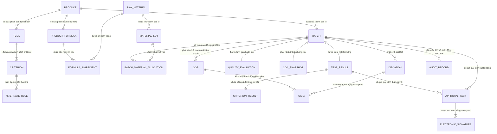

# DATA_CONTRACTS: Tổng Hợp 17 Hợp Đồng Dữ Liệu Miền Cốt Lõi PQM (Master Domain Data Contracts)

Tài liệu này là Bản đồ Tổng quan (Master Data Dictionary & Contract Hub) của toàn bộ 17 Hợp đồng Dữ liệu cốt lõi trong hệ thống Quản lý Chất lượng Dược phẩm PQM, thiết lập mối liên kết chéo, khóa chính/phụ và nguyên tắc toàn vẹn tham chiếu.

---

## 1. Danh Mục 17 Hợp Đồng Dữ Liệu Miền Cốt Lõi

| STT | Tên Hợp Đồng                   | Văn kiện chi tiết                                                                                               | Mục đích nghiệp vụ cốt lõi                                                   |
| :-: | :----------------------------- | :-------------------------------------------------------------------------------------------------------------- | :--------------------------------------------------------------------------- |
|  1  | **Product Contract**           | [`PRODUCT_TCCS_CONTRACT.md`](file:///d:/26%20Kiem%20nghiem/PQM/docs/contracts/PRODUCT_TCCS_CONTRACT.md)         | Định danh danh mục sản phẩm, hoạt chất, số đăng ký, dạng bào chế             |
|  2  | **TCCS Contract**              | [`PRODUCT_TCCS_CONTRACT.md`](file:///d:/26%20Kiem%20nghiem/PQM/docs/contracts/PRODUCT_TCCS_CONTRACT.md)         | Quy chuẩn kỹ thuật, phương pháp kiểm nghiệm, phiên bản bất biến              |
|  3  | **Criterion State Contract**   | [`CRITERION_STATE_CONTRACT.md`](file:///d:/26%20Kiem%20nghiem/PQM/docs/contracts/CRITERION_STATE_CONTRACT.md)   | Tách bạch Execution State và Quality Status của từng chỉ tiêu                |
|  4  | **Alternate Rule Contract**    | [`ALTERNATE_RULE_CONTRACT.md`](file:///d:/26%20Kiem%20nghiem/PQM/docs/contracts/ALTERNATE_RULE_CONTRACT.md)     | Xử lý logic chỉ tiêu thay thế, thử lại khi rớt, miễn kiểm có điều kiện       |
|  5  | **Formula Contract**           | [`FORMULA_MATERIAL_CONTRACT.md`](file:///d:/26%20Kiem%20nghiem/PQM/docs/contracts/FORMULA_MATERIAL_CONTRACT.md) | Định mức thành phần công thức sản phẩm chuẩn theo cỡ lô                      |
|  6  | **Raw Material Contract**      | [`FORMULA_MATERIAL_CONTRACT.md`](file:///d:/26%20Kiem%20nghiem/PQM/docs/contracts/FORMULA_MATERIAL_CONTRACT.md) | Quản lý hoạt chất, tá dược, bao bì cấp 1 và chu kỳ retest                    |
|  7  | **Material Lot Contract**      | [`FORMULA_MATERIAL_CONTRACT.md`](file:///d:/26%20Kiem%20nghiem/PQM/docs/contracts/FORMULA_MATERIAL_CONTRACT.md) | Quản lý lô nguyên liệu nhập kho, số lô nhà cung cấp, kiểm nghiệm đầu vào     |
|  8  | **Batch Contract**             | [`BATCH_GENEALOGY_CONTRACT.md`](file:///d:/26%20Kiem%20nghiem/PQM/docs/contracts/BATCH_GENEALOGY_CONTRACT.md)   | Thực thể mẹ kết nối Lô sản phẩm với công thức, TCCS và quyết định xuất xưởng |
|  9  | **Batch Genealogy Contract**   | [`BATCH_GENEALOGY_CONTRACT.md`](file:///d:/26%20Kiem%20nghiem/PQM/docs/contracts/BATCH_GENEALOGY_CONTRACT.md)   | Đồ thị mạng lưới phả hệ truy xuất nguồn gốc hai chiều (Forward/Backward)     |
| 10  | **Test Result Contract**       | [`TEST_RESULT_CONTRACT.md`](file:///d:/26%20Kiem%20nghiem/PQM/docs/contracts/TEST_RESULT_CONTRACT.md)           | Phiếu kiểm nghiệm thực tế do Kỹ thuật viên nhập liệu và thẩm định            |
| 11  | **Quality Status Contract**    | [`QUALITY_STATUS_CONTRACT.md`](file:///d:/26%20Kiem%20nghiem/PQM/docs/contracts/QUALITY_STATUS_CONTRACT.md)     | Đánh giá chất lượng chuẩn tắc đa chiều từ Domain Engine                      |
| 12  | **Workflow Status Contract**   | [`WORKFLOW_STATUS_CONTRACT.md`](file:///d:/26%20Kiem%20nghiem/PQM/docs/contracts/WORKFLOW_STATUS_CONTRACT.md)   | Luồng trạng thái tác nghiệp hành chính của Lô và Phiếu                       |
| 13  | **CoA Snapshot Contract**      | [`COA_SNAPSHOT_CONTRACT.md`](file:///d:/26%20Kiem%20nghiem/PQM/docs/contracts/COA_SNAPSHOT_CONTRACT.md)         | Bản chụp đóng băng dữ liệu bất biến của chứng thư phân tích CoA              |
| 14  | **QMS Incident Contract**      | [`QMS_INCIDENT_CONTRACT.md`](file:///d:/26%20Kiem%20nghiem/PQM/docs/contracts/QMS_INCIDENT_CONTRACT.md)         | Chu trình liên thông OOS (2 giai đoạn) -> Deviation (ICH Q9) -> CAPA         |
| 15  | **Approval Task Contract**     | [`APPROVAL_CONTRACT.md`](file:///d:/26%20Kiem%20nghiem/PQM/docs/contracts/APPROVAL_CONTRACT.md)                 | Đường ống thẩm duyệt đa cấp, rào chắn Segregation of Duties (SoD)            |
| 16  | **Signature & Audit Contract** | [`SIGNATURE_AUDIT_CONTRACT.md`](file:///d:/26%20Kiem%20nghiem/PQM/docs/contracts/SIGNATURE_AUDIT_CONTRACT.md)   | Chữ ký số 21 CFR Part 11 và Nhật ký kiểm toán chuỗi băm ALCOA+               |
| 17  | **AI Advisory Contract**       | [`AI_ADVISORY_CONTRACT.md`](file:///d:/26%20Kiem%20nghiem/PQM/docs/contracts/AI_ADVISORY_CONTRACT.md)           | Giao diện trợ lý AI đề xuất, bảo đảm Human-in-the-loop và Guardrail          |

---

## 2. Sơ Đồ Mối Quan Hệ Thực Thể Thực Tế (Entity Relationship Diagram - ERD)

---

## 3. Nguyên Tắc Toàn Vẹn Dữ Liệu Bất Biến (Master Invariants)

1. **Snapshot Before Processing**: Mọi quá trình tác nghiệp đối với Lô (`TESTING`, `EVALUATION`, `COA`) đều phải dựa trên bản Snapshot của TCCS được niêm phong tại thời điểm khởi tạo Lô. Tuyệt đối không query `live` từ bảng TCCS gốc khi kiểm tra chất lượng Lô.
2. **Quality ≠ Workflow**: Trạng thái `QualityStatus` được sinh ra tự động bởi thuật toán chuẩn tắc (`CanonicalStatusResolver`), không lưu cố định dạng boolean trên bản ghi chính của Lô. Trạng thái `WorkflowStatus` phản ánh vị trí hành chính của hồ sơ và chỉ được phép chuyển dịch thông qua `ApprovalService`.
3. **No Direct Delete**: 100% các thực thể trong danh mục 17 hợp đồng dữ liệu này không bao giờ bị xóa vật lý (`HARD DELETE`). Khi một bản ghi bị hủy, hệ thống áp dụng cơ chế đánh dấu vô hiệu (`DEACTIVATE` hoặc `REVOKE`) và lưu vết kiểm toán đầy đủ.
4. **Data Locking Hierarchy**: Khi `Batch` chuyển sang `RELEASED`, toàn bộ cây quan hệ con của nó (`Genealogy`, `TestResults`, `CoASnapshot`, `ApprovalTasks`) đều bị khóa cứng bất biến vĩnh viễn.
