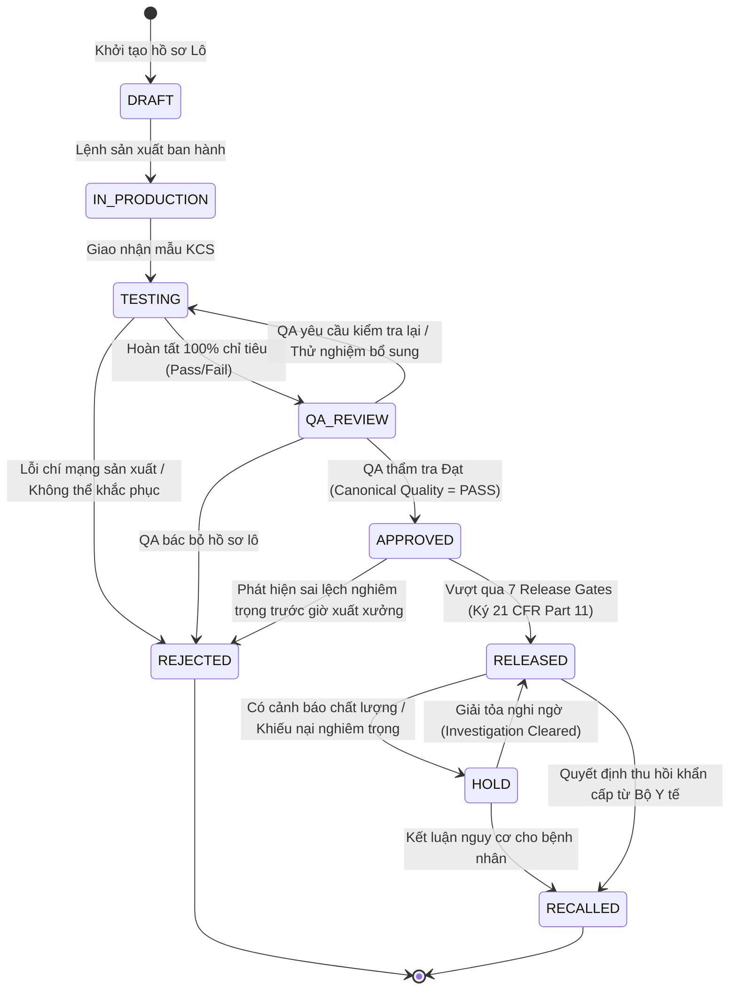
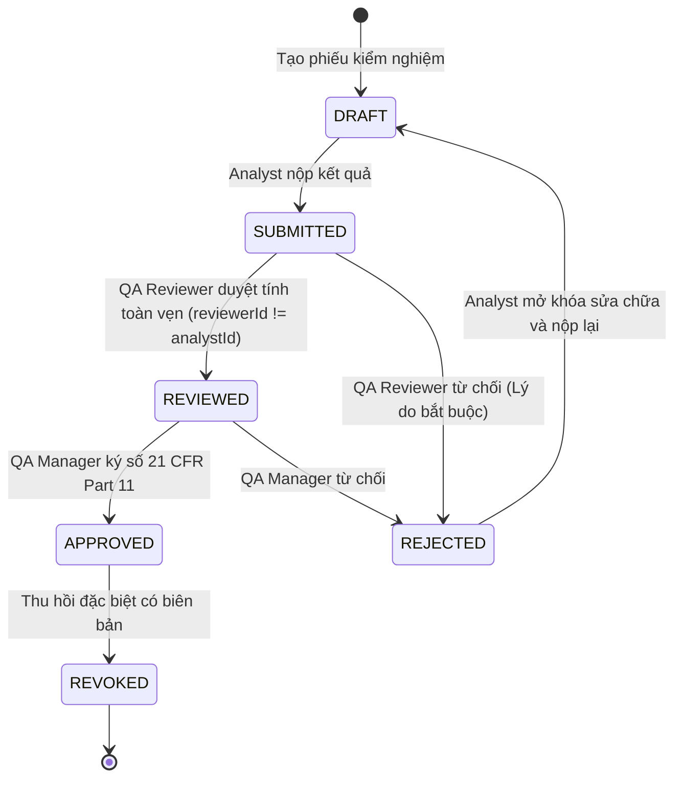
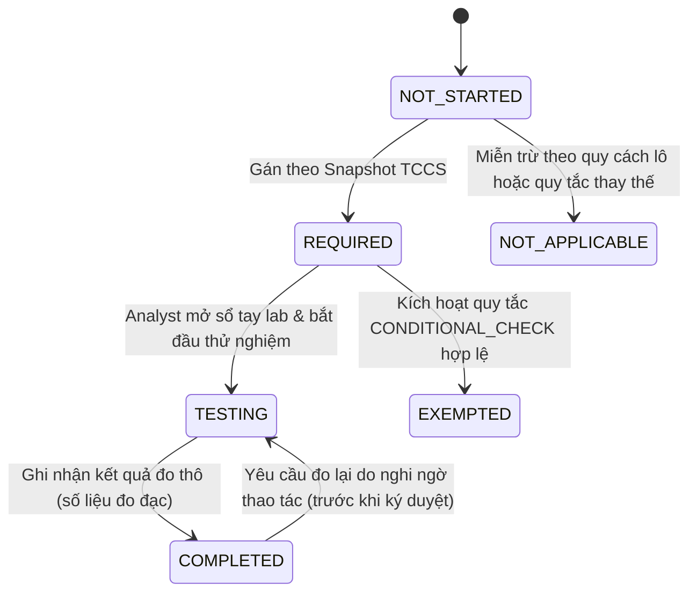
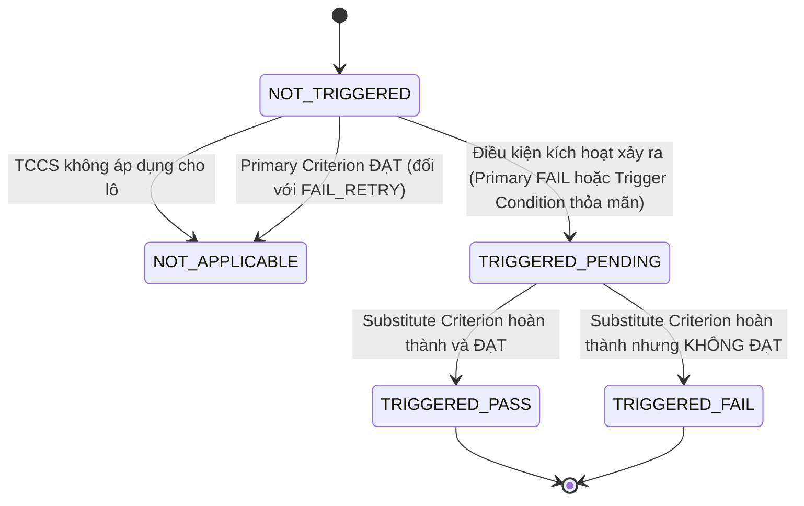

# STATE_MACHINES: Đặc Tả Toàn Diện 4 Máy Trạng Thái Hữu Hạn Độc Lập PQM (Finite State Machines)

Tài liệu này chuẩn hóa toàn bộ 4 Máy Trạng Thái Hữu Hạn (FSM) độc lập trong hệ thống PQM:

1. **Batch Workflow FSM** (Vòng đời Lô Sản Phẩm)
2. **TestResult Workflow FSM** (Vòng đời Phiếu Kiểm Nghiệm)
3. **Criterion State FSM** (Vòng đời Thực thi & Chất lượng Chỉ tiêu)
4. **Alternate Rule FSM** (Vòng đời Kích hoạt & Giải quyết Quy tắc Thay thế)

Mỗi FSM được định nghĩa tường minh với: Trạng thái (States), Sự kiện kích hoạt (Triggers), Tác nhân (Actors), Điều kiện tiên quyết (Preconditions), Bước chuyển hợp lệ (Allowed Transitions), Bước chuyển bị cấm (Forbidden Transitions), Đầu ra (Outputs) và Yêu cầu kiểm toán (Audit Trail).

---

## 1. FSM 1: BATCH WORKFLOW FINITE STATE MACHINE

### 1.1. Danh Sách Trạng Thái

- `DRAFT`: Lô mới tạo trên hệ thống, đang chờ lệnh sản xuất.
- `IN_PRODUCTION`: Đang trong dây chuyền sản xuất tại phân xưởng.
- `TESTING`: Sản xuất xong, đã gửi mẫu sang phòng QC để kiểm nghiệm.
- `QA_REVIEW`: Hoàn tất kiểm nghiệm 100%, QA đang thẩm tra hồ sơ lô điện tử (BPR) và kết quả kiểm nghiệm.
- `APPROVED`: QA xác nhận chất lượng đạt chuẩn, đủ điều kiện tiến hành thủ tục xuất xưởng.
- `RELEASED`: Đã vượt qua 7 Release Gates, Trưởng phòng QA ký lệnh xuất xưởng chính thức.
- `REJECTED`: Lô bị loại bỏ do không đạt chất lượng (Terminal State).
- `HOLD`: Lô bị tạm đình chỉ lưu thông sau khi xuất xưởng để điều tra sự cố.
- `RECALLED`: Thu hồi toàn quốc đối với lô đã phát hành ra thị trường (Terminal State).

### 1.2. Sơ Đồ Chuyển Đổi Trạng Thái

### 1.3. Bảng Quy Tắc Chuyển Đổi Chi Tiết (Transition Rules)

| Từ trạng thái   | Tới trạng thái  | Trigger (Sự kiện)  | Actor (Quyền hạn)   | Precondition (Điều kiện tiên quyết)                       | Forbidden Rule (Cấm kỵ)              |
| :-------------- | :-------------- | :----------------- | :------------------ | :-------------------------------------------------------- | :----------------------------------- |
| `DRAFT`         | `IN_PRODUCTION` | `START_PROD`       | `PRODUCTION`        | Đã gán công thức và Snapshot TCCS hợp lệ                  | Cấm chuyển nếu TCCS chưa `EFFECTIVE` |
| `IN_PRODUCTION` | `TESTING`       | `SUBMIT_QC_SAMPLE` | `PRODUCTION` / `QC` | Biên bản bàn giao mẫu đã ký                               | Cấm nếu số lượng mẫu = 0             |
| `TESTING`       | `QA_REVIEW`     | `COMPLETE_TESTING` | `QA_REVIEWER`       | 100% chỉ tiêu đã kiểm xong (`progress = 100%`)            | Cấm nếu còn chỉ tiêu `PENDING`       |
| `QA_REVIEW`     | `APPROVED`      | `APPROVE_BATCH`    | `QA_MANAGER`        | `CanonicalStatusResolver.overallQualityStatus === 'PASS'` | **CẤM DUYỆT NẾU CHẤT LƯỢNG != PASS** |
| `QA_REVIEW`     | `TESTING`       | `RETURN_QC`        | `QA_MANAGER`        | Bắt buộc nhập lý do yêu cầu kiểm lại                      | Cấm trả về nếu không có ghi chú      |
| `APPROVED`      | `RELEASED`      | `EXECUTE_RELEASE`  | `QA_MANAGER` / `QP` | Thỏa mãn đồng thời cả 7 Release Gates                     | **CẤM BYPASS BẤT KỲ CỔNG NÀO**       |
| `RELEASED`      | `HOLD`          | `ISSUE_HOLD`       | `QA_MANAGER`        | Bắt buộc có mã số phiếu sai lệch/khiếu nại                | Cấm giữ lô vô cớ                     |
| `HOLD`          | `RECALLED`      | `ISSUE_RECALL`     | `QUALITY_DIRECTOR`  | Có quyết định thu hồi bằng văn bản                        | Không thể hoàn tác sau khi đã Recall |

---

## 2. FSM 2: TESTRESULT WORKFLOW FINITE STATE MACHINE

### 2.1. Danh Sách Trạng Thái

- `DRAFT`: Kỹ thuật viên (Analyst) đang tạo và nhập số liệu thô.
- `SUBMITTED`: Đã nhập đủ dữ liệu, nộp lên cho Trưởng nhóm KCS thẩm định.
- `REVIEWED`: Trưởng nhóm KCS / QA Reviewer đã thẩm tra số liệu gốc và phương pháp thử.
- `APPROVED`: Trưởng phòng QA đã ký số điện tử phê duyệt chính thức.
- `REJECTED`: Bị từ chối tại bước Thẩm tra hoặc Phê duyệt, trả về cho Analyst làm lại.
- `REVOKED`: Đã duyệt nhưng bị thu hồi vô hiệu do phát hiện gian lận hoặc sai sót thiết bị.

### 2.2. Sơ Đồ Chuyển Đổi Trạng Thái

### 2.3. Bảng Chuyển Đổi & Kiểm Soát Segregation of Duties (SoD)

| Từ trạng thái | Tới trạng thái | Actor         | Điều kiện SoD & Tính hợp lệ                     | Hành vi hệ thống                                         |
| :------------ | :------------- | :------------ | :---------------------------------------------- | :------------------------------------------------------- |
| `DRAFT`       | `SUBMITTED`    | `Analyst`     | Đã điền đầy đủ các trường đo bắt buộc           | Khóa quyền sửa của Analyst (`isLocked = true`)           |
| `SUBMITTED`   | `REVIEWED`     | `QA_Reviewer` | `currentUserId !== analystId`                   | Ghi vết kiểm toán Review, chuyển lên hàng đợi QA Manager |
| `SUBMITTED`   | `REJECTED`     | `QA_Reviewer` | Bắt buộc có `rejectionReason` (>= 20 ký tự)     | Mở khóa cho Analyst sửa lại                              |
| `REVIEWED`    | `APPROVED`     | `QA_Manager`  | `currentUserId !== analystId` & không có OOS mở | Ký số SHA-256, khóa vĩnh viễn dữ liệu                    |
| `APPROVED`    | `REVOKED`      | `QA_Manager`  | Lô liên quan chưa được `RELEASED`               | Đánh dấu vô hiệu, tạo Revision mới dạng `DRAFT`          |

---

## 3. FSM 3: CRITERION EXECUTION FINITE STATE MACHINE (FSM 3A) & QUALITY RESOLVER

> **QUY TẮC KIẾN TRÚC BẤT BIẾN (ORTHOGONAL DIMENSIONS)**:  
> Trạng thái thực thi phép thử (`CriterionExecutionState`) và Đánh giá chất lượng (`CriterionQualityStatus`) là hai chiều độc lập, tuyệt đối không trộn lẫn vào cùng một enum trạng thái:
>
> - **Execution State**: Phản ánh tiến trình thao tác thực nghiệm của Kỹ thuật viên trong phòng Lab.
> - **Quality Status**: Là kết quả thẩm định toán học thuần túy của Domain Engine dựa trên tiêu chuẩn TCCS và quy tắc thay thế.

### 3.1. Danh Sách Trạng Thái Thực Thi (CriterionExecutionState)

- `NOT_STARTED`: Chỉ tiêu chưa được lấy mẫu kiểm nghiệm.
- `REQUIRED`: Chỉ tiêu bắt buộc phải làm theo quy định của TCCS Snapshot.
- `TESTING`: Đang trong quá trình thử nghiệm trong phòng lab.
- `COMPLETED`: Đã hoàn thành phép thử và ghi nhận kết quả đo thô (số hoặc chữ).
- `EXEMPTED`: Miễn kiểm nghiệm thực tế do kích hoạt quy tắc thay thế `CONDITIONAL_CHECK` hợp lệ.
- `NOT_APPLICABLE`: Không áp dụng cho lô cụ thể này (do khác quy cách hoặc chỉ tiêu phụ khi chỉ tiêu chính đã PASS trong `FAIL_RETRY`).

### 3.2. Sơ Đồ Chuyển Đổi Tiến Trình Thực Thi (FSM 3A)

### 3.3. Phân Giải Chất Lượng Chuẩn Tắc (Criterion Quality Resolver)

Đánh giá chất lượng của một chỉ tiêu (`CriterionQualityStatus`) là hàm thuần túy (Pure Function):
$$\text{resolveCriterionQuality}(state, rawValue, spec, alternateResolution) \longrightarrow \text{PASS} \mid \text{FAIL} \mid \text{PENDING}$$

| `CriterionExecutionState` | Dữ liệu đo đạc / Ngữ cảnh                                  | `CriterionQualityStatus` | Giải thích nghiệp vụ                                            |
| :------------------------ | :--------------------------------------------------------- | :----------------------- | :-------------------------------------------------------------- |
| `EXEMPTED`                | Miễn kiểm theo quy tắc thay thế hợp lệ                     | **`PASS`**               | Được công nhận đạt theo quy định Dược điển (không kéo lùi Lô)   |
| `NOT_APPLICABLE`          | Không áp dụng cho lô hàng này                              | **`NOT_APPLICABLE`**     | Loại khỏi mẫu số tính toán tiến độ của Lô                       |
| `COMPLETED`               | Giá trị đo $X \in [Min, Max]$ hoặc khớp văn bản định tính  | **`PASS`**               | Phép thử đạt chuẩn chấp nhận TCCS                               |
| `COMPLETED`               | Giá trị đo $X \notin [Min, Max]$ (Chưa áp dụng cứu thế)    | **`FAIL`**               | Vượt ngoài tiêu chuẩn (kích hoạt OOS)                           |
| `COMPLETED`               | $X \notin [Min, Max]$ nhưng chỉ tiêu phụ `FAIL_RETRY` PASS | **`PASS`**               | Được cứu đạt thành công qua phép thử mở rộng lần 2 (BR-ALT-001) |
| `NOT_STARTED` / `TESTING` | Đang trong tiến trình thử nghiệm                           | **`PENDING`**            | Chưa đủ căn cứ để kết luận chất lượng                           |

---

## 4. FSM 4: ALTERNATE RULE FINITE STATE MACHINE

### 4.1. Danh Sách Trạng Thái

- `NOT_APPLICABLE`: Quy tắc không có hiệu lực cho lô này.
- `NOT_TRIGGERED`: Điều kiện kích hoạt chưa diễn ra (đang chờ kết quả chỉ tiêu chính).
- `TRIGGERED_PENDING`: Đã kích hoạt điều kiện thay thế, đang chờ làm phép thử phụ/mở rộng.
- `TRIGGERED_PASS`: Phép thử phụ đã hoàn tất và ĐẠT -> Cứu chỉ tiêu chính Đạt.
- `TRIGGERED_FAIL`: Phép thử phụ đã hoàn tất nhưng KHÔNG ĐẠT -> Khẳng định Lô Không Đạt.

### 4.2. Sơ Đồ Chuyển Đổi Trạng Thái

### 4.3. Bảng Chuyển Đổi & Pháp Lý Footnote

| Loại quy tắc        | Điều kiện kích hoạt / Primary       | Trạng thái FSM (AlternateRuleState) | Kết quả Substitute | Trạng thái thực thi Alt | Phán quyết cuối cùng | Hiển thị CoA                            |
| :------------------ | :---------------------------------- | :---------------------------------- | :----------------- | :---------------------- | :------------------- | :-------------------------------------- |
| `FAIL_RETRY`        | Primary `PASS`                      | `NOT_APPLICABLE`                    | Không cần làm      | `NOT_APPLICABLE`        | `PASS`               | Hiển thị kết quả lần 1                  |
| `FAIL_RETRY`        | Primary `FAIL`                      | `TRIGGERED_PENDING`                 | Đang làm lần 2     | `REQUIRED`              | `PENDING`            | Chặn xuất bản CoA                       |
| `FAIL_RETRY`        | Primary `FAIL`                      | `TRIGGERED_PASS`                    | Substitute `PASS`  | `COMPLETED`             | `PASS`               | Kết quả lần 2 kèm footnote giải trình   |
| `FAIL_RETRY`        | Primary `FAIL`                      | `TRIGGERED_FAIL`                    | Substitute `FAIL`  | `COMPLETED`             | `FAIL`               | Kết luận Không Đạt chính thức           |
| `CONDITIONAL_CHECK` | Condition `FALSE` (An toàn)         | `NOT_TRIGGERED`                     | Miễn làm           | `EXEMPTED`              | `PASS`               | Ghi "Miễn thử (\*)" kèm footnote căn cứ |
| `CONDITIONAL_CHECK` | Condition `TRUE` (Ngưỡng kích hoạt) | `TRIGGERED_PENDING`                 | Chưa có kết quả    | `REQUIRED`              | `PENDING`            | Chặn xuất bản CoA                       |
| `CONDITIONAL_CHECK` | Condition `TRUE` (Ngưỡng kích hoạt) | `TRIGGERED_PASS`                    | Substitute `PASS`  | `COMPLETED`             | `PASS`               | Kết quả đạt kèm footnote                |
| `CONDITIONAL_CHECK` | Condition `TRUE` (Ngưỡng kích hoạt) | `TRIGGERED_FAIL`                    | Substitute `FAIL`  | `COMPLETED`             | `FAIL`               | Kết luận Không Đạt chính thức           |

---

## 5. Nguyên Tắc Đồng Bộ Giữa Các FSM (FSM Cross-Synchronization Invariants)

1. **Hierarchy Cascade**:
   - `Batch FSM` là FSM cấp cao nhất chi phối toàn bộ các FSM con.
   - Khi `Batch FSM` đang ở `DRAFT` hoặc `IN_PRODUCTION`, `TestResult FSM` không được phép chuyển sang `APPROVED`.
   - Khi `Criterion FSM` còn bất kỳ chỉ tiêu nào ở trạng thái `REQUIRED` hoặc `TESTING`, `Batch FSM` không được phép chuyển sang `QA_REVIEW`.
2. **Deterministic State Resolution**: Trạng thái chất lượng của Lô là một hàm toán học thuần túy (Deterministic Pure Function):
   $$\text{BatchQualityStatus} = f(\{\text{CriterionState}_i\}, \{\text{AlternateRuleState}_j\})$$
   Không có biến ngẫu nhiên, không phụ thuộc vào trạng thái UI.
3. **Audit Trail Synchronization**: Mọi chuyển dịch trạng thái trên cả 4 FSM bắt buộc phải ghi nhận đồng thời vào `AuditRecord` với chữ ký số và mã băm toàn vẹn tương ứng.
