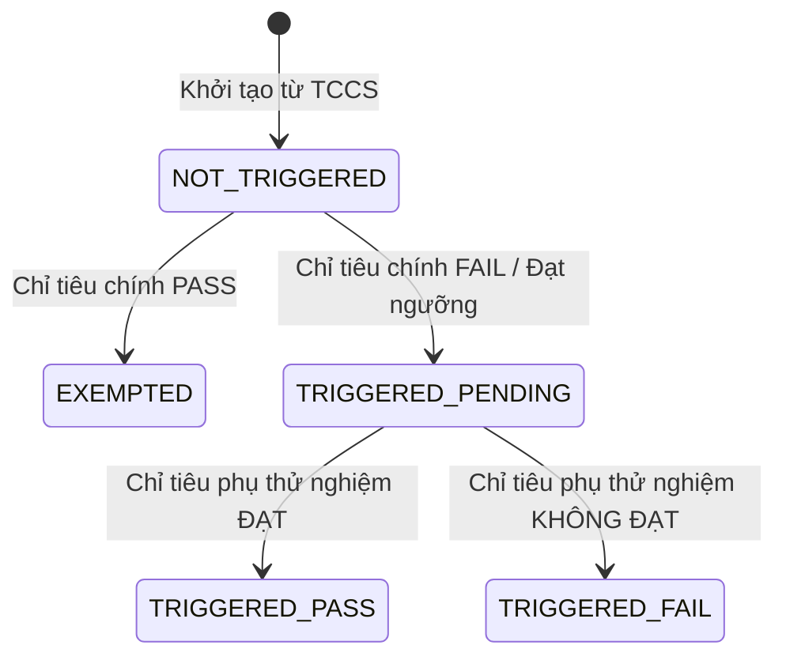
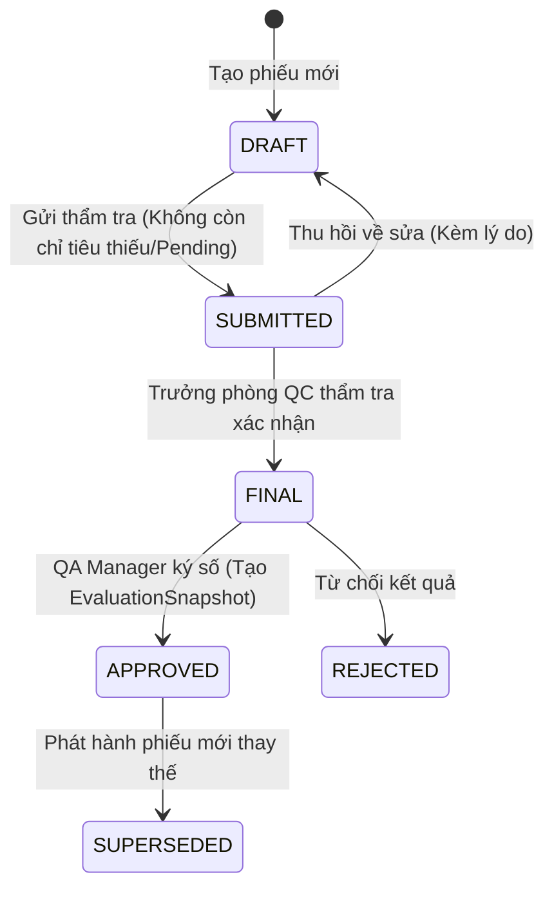

# HỢP ĐỒNG ĐẶC TẢ MÁY TRẠNG THÁI (STATE MACHINES CONTRACT)

## (LEVEL 2: TẬP TRUNG HÓA TOÀN BỘ VÒNG ĐỜI VÀ BẢNG CHUYỂN DỊCH TRẠNG THÁI)

> **Mã tài liệu**: `CONTRACT-STATE-MACHINES-01`  
> **Thư mục**: `docs/contracts/STATE_MACHINES.md`  
> **Phạm vi**: Máy trạng thái cho Lô (Batch), Phiếu kiểm nghiệm (Test Result), Chỉ tiêu kiểm nghiệm (Criterion), Quy tắc thay thế (Alternate Rule), và Hồ sơ OOS.

---

## 1. MÁY TRẠNG THÁI CẤP CHỈ TIÊU (CRITERION RESULT STATE MACHINE)

> 🔴 **ĐÂY LÀ PHẦN THIẾU HỤT ĐƯỢC BỔ SUNG ĐỂ GIẢI QUYẾT TRIỆT ĐỂ LỖI GAP-03**

### A. Danh mục các Trạng thái hợp lệ (`CriterionEvaluationState`)

1. `NOT_STARTED`: Chỉ tiêu đã được nạp từ TCCS Snapshot nhưng Kiểm nghiệm viên chưa bắt đầu thử nghiệm.
2. `REQUIRED`: Chỉ tiêu bắt buộc phải có kết quả để hoàn thành phiếu kiểm nghiệm.
3. `TESTING`: Đang thực hiện phép thử / đang nhập liệu tạm thời.
4. `PASS`: Kết quả thực chứng nằm trong giới hạn cho phép của TCCS.
5. `FAIL`: Kết quả thực chứng vượt ngưỡng giới hạn và không có quy tắc thay thế cứu vãn.
6. `PENDING`: Kết quả chưa hoàn tất (thiếu dữ liệu, hoặc chỉ tiêu thay thế đang chờ).
7. `EXEMPTED`: Chỉ tiêu được miễn kiểm hợp lệ (theo cơ chế Alternate Rule).
8. `NOT_APPLICABLE`: Chỉ tiêu không áp dụng cho lô hàng này.

### B. Bảng Chuyển Dịch Trạng Thái Chỉ Tiêu (Criterion Transition Matrix)

| Trạng thái hiện tại | Sự kiện kích hoạt (Event) | Điều kiện tiên quyết (Guard Condition)           | Trạng thái tiếp theo                         |
| :------------------ | :------------------------ | :----------------------------------------------- | :------------------------------------------- |
| `NOT_STARTED`       | `START_TESTING`           | Mở form nhập liệu PKN                            | `REQUIRED` (nếu bắt buộc) hoặc `NOT_STARTED` |
| `REQUIRED`          | `ENTER_VALUE`             | Nhập giá trị hợp lệ                              | `TESTING`                                    |
| `TESTING`           | `EVALUATE`                | $min \le val \le max$ hoặc $text === expected$   | `PASS`                                       |
| `TESTING`           | `EVALUATE`                | Giá trị vượt giới hạn & Không có Alt Rule        | `FAIL`                                       |
| `TESTING`           | `EVALUATE`                | Giá trị vượt giới hạn & Có Alt Rule `FAIL_RETRY` | `PENDING` (Chờ kích hoạt Alt)                |
| `REQUIRED`          | `APPLY_ALT_EXEMPT`        | Chỉ tiêu chính tương ứng đã ĐẠT                  | `EXEMPTED`                                   |

---

## 2. MÁY TRẠNG THÁI QUY TẮC THAY THẾ (ALTERNATE RULE STATE MACHINE)

> Áp dụng độc quyền cho các chỉ tiêu tham gia vào cấu hình `AlternateRule` (`FAIL_RETRY` hoặc `CONDITIONAL_CHECK`).

### A. Danh mục các Trạng thái (`AlternateCriterionState`)

- `NONE`: Không tham gia quy tắc thay thế.
- `NOT_TRIGGERED`: Chỉ tiêu chính chưa rớt hoặc điều kiện kích hoạt chưa xảy ra.
- `TRIGGERED_PENDING`: Quy tắc đã được kích hoạt, chỉ tiêu phụ bắt buộc phải kiểm nhưng chưa có kết quả.
- `TRIGGERED_PASS`: Chỉ tiêu phụ đã kiểm và ĐẠT ➔ Cứu thành công chỉ tiêu chính.
- `TRIGGERED_FAIL`: Chỉ tiêu phụ đã kiểm nhưng KHÔNG ĐẠT ➔ Toàn bộ cụm này rớt.
- `EXEMPTED`: Chỉ tiêu phụ chính thức được Miễn kiểm do chỉ tiêu chính đã ĐẠT.

### B. Sơ đồ Chuyển dịch Trạng thái Alternate Rule

---

## 3. MÁY TRẠNG THÁI LÔ SẢN XUẤT (BATCH WORKFLOW STATE MACHINE)

### A. Danh mục các Trạng thái (`BatchWorkflowStatus`)

`DRAFT` ➔ `IN_PROGRESS` ➔ `COMPLETED` ➔ `APPROVED` ➔ `RELEASED` / `REJECTED` / `BLOCKED`.

### B. Bảng Chuyển dịch Trạng thái Lô (Batch Transition Matrix)

| Trạng thái hiện tại | Sự kiện            | Guard Condition (Rào chắn)                       | Trạng thái tiếp theo |
| :------------------ | :----------------- | :----------------------------------------------- | :------------------- |
| `DRAFT`             | `START_PRODUCTION` | Đã có `tccsSnapshot` hợp lệ                      | `IN_PROGRESS`        |
| `IN_PROGRESS`       | `FINISH_TESTING`   | Có ít nhất 1 PKN đã hoàn tất kiểm nghiệm         | `COMPLETED`          |
| `COMPLETED`         | `APPROVE_BATCH`    | QA thẩm định hồ sơ lô                            | `APPROVED`           |
| `APPROVED`          | `RELEASE_BATCH`    | **Thỏa mãn 5 Trụ cột Release Gate (BR-REL-001)** | **`RELEASED`**       |
| Bất kỳ              | `REJECT_BATCH`     | Chất lượng hỏng hoặc có OOS không thể cứu        | `REJECTED`           |
| `RELEASED`          | `EMERGENCY_BLOCK`  | Phát hiện lỗi sau xuất xưởng (Có lý do)          | `BLOCKED`            |
| `BLOCKED`           | `LIFT_BLOCK`       | Có biên bản thanh tra QA mở phong tỏa            | `RELEASED`           |

---

## 4. MÁY TRẠNG THÁI PHIẾU KIỂM NGHIỆM (TEST RESULT STATE MACHINE)

