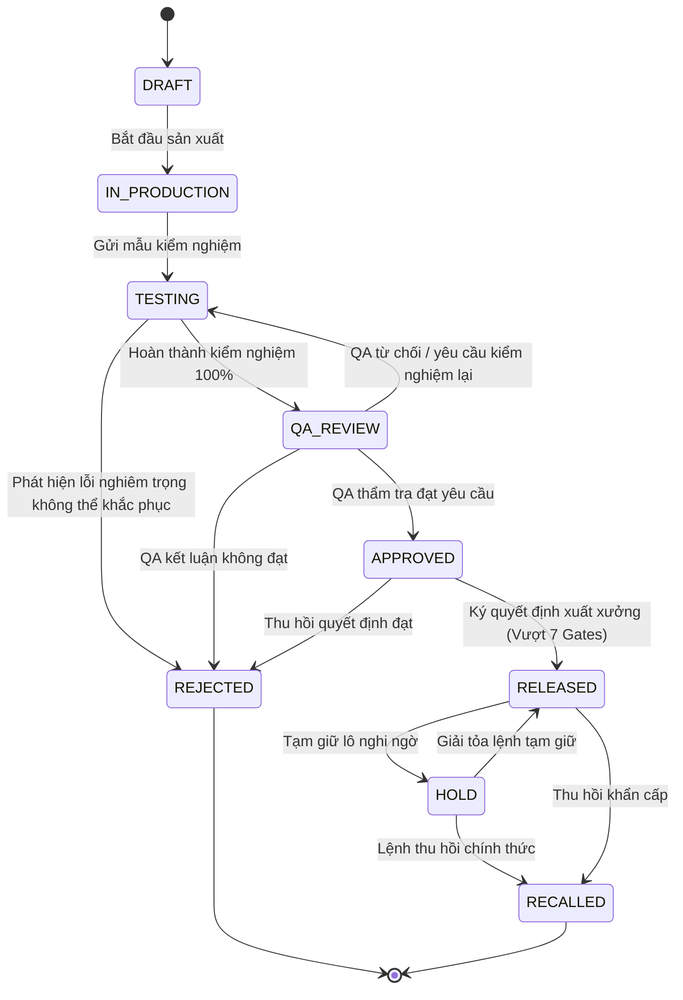

# WORKFLOW_STATUS_CONTRACT: Hợp Đồng Luồng Trạng Thái Tác Nghiệp (Workflow Status Contract)

Tài liệu này chuẩn hóa toàn bộ các trạng thái vòng đời tác nghiệp (Workflow Status) của Lô hàng và Phiếu kiểm nghiệm, xác định rõ điều kiện chuyển đổi trạng thái và ranh giới với Đánh giá chất lượng.

---

## 1. Bản Chất Nghiệp Vụ

- **Workflow Status (Trạng thái tác nghiệp)**: Thể hiện vị trí của hồ sơ trong chuỗi quy trình hành chính của phòng ban (Sản xuất -> Kiểm nghiệm -> Thẩm định -> Duyệt -> Xuất xưởng -> Lưu thông/Thu hồi).
- **Ranh giới bất biến**: `WorkflowStatus` được lưu trữ trong cơ sở dữ liệu (`batch.status`), phản ánh tiến trình xử lý hồ sơ. Ngược lại, `QualityStatus` là kết quả đánh giá logic của hệ thống chuyên gia. Lô vẫn có thể giữ nguyên `status: 'TESTING'` trong cơ sở dữ liệu ngay cả khi hệ thống đã đánh giá `overallQualityStatus: 'PASS'` (để chờ QA chính thức nhấn nút Duyệt chuyển sang `APPROVED`).

---

## 2. Định Nghĩa Kiểu Dữ Liệu (TypeScript Domain Interface)

```typescript
/**
 * Vòng đời tác nghiệp chính thức của Lô sản phẩm
 */
export type BatchWorkflowStatus =
  | 'DRAFT' // Mới lập hồ sơ lô, chưa sản xuất
  | 'IN_PRODUCTION' // Xưởng đang sản xuất
  | 'TESTING' // Đã bàn giao mẫu cho phòng KCS/QC
  | 'QA_REVIEW' // KCS nộp kết quả, QA đang thẩm tra hồ sơ lô
  | 'APPROVED' // QA đã xác nhận chất lượng đạt, đủ điều kiện xuất xưởng
  | 'RELEASED' // Đã ký lệnh xuất xưởng chính thức, hàng được phép bán
  | 'REJECTED' // Bị từ chối xuất xưởng, chuyển kho phế phẩm
  | 'HOLD' // Tạm đình chỉ lưu thông để kiểm tra bổ sung
  | 'RECALLED'; // Thu hồi sản phẩm trên toàn quốc

/**
 * Bản ghi chuyển đổi trạng thái có gắn vết kiểm toán
 */
export interface WorkflowTransitionRecord {
  transitionId: string;
  entityId: string;
  fromStatus: BatchWorkflowStatus;
  toStatus: BatchWorkflowStatus;
  triggeredBy: string;
  triggeredByName: string;
  triggeredByRole: string;
  timestamp: string; // ISO 8601
  reason?: string;
  evidenceDocumentUrl?: string;
  signatureChecksum?: string;
}
```

---

## 3. Ma Trận Chuyển Đổi Hợp Lệ Của Lô Sản Phẩm



---

## 4. Bất Biến Ràng Buộc (Invariants)

1. **Không nhảy cóc (No Skip)**: Tuyệt đối không thể chuyển trực tiếp từ `TESTING` sang `RELEASED` mà không đi qua bước thẩm tra `QA_REVIEW` và `APPROVED`.
2. **Không khôi phục từ REJECTED**: Một khi Lô đã chuyển trạng thái sang `REJECTED`, tuyệt đối không thể chuyển ngược lại bất kỳ trạng thái nào khác (Terminal State). Nếu cần làm lại, phải lập Lô Tái chế (Reprocessed Batch) mới với số lô riêng biệt.
3. **Mọi chuyển trạng thái đều lưu vết**: Không một trạng thái nào được cập nhật mà không sinh ra một bản ghi `WorkflowTransitionRecord` trong cơ sở dữ liệu.
