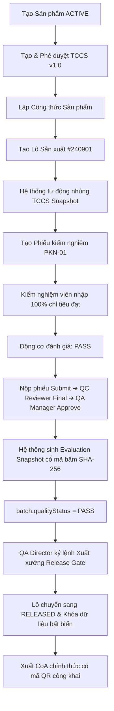

# DANH MỤC KỊCH BẢN NGHIỆP VỤ XUYÊN SUỐT (E2E SCENARIOS)

## (LEVEL 3: END-TO-END SYSTEM SCENARIOS)

> **Mã tài liệu**: `SPEC-E2E-SCENARIOS-01`  
> **Thư mục**: `docs/functional-specs/E2E_SCENARIOS.md`  
> **Phạm vi**: 6 Kịch bản nghiệp vụ chuẩn hóa dùng để kiểm thử tích hợp và nghiệm thu toàn diện hệ thống.

---

### 🎬 SCENARIO S-001: LUỒNG CHUẨN LÔ ĐẠT YÊU CẦU (HAPPY PASS FLOW)

---

### 🎬 SCENARIO S-002: CHỈ TIÊU CHÍNH FAIL ➔ KÍCH HOẠT CHỈ TIÊU THAY THẾ ĐẠT

> Kịch bản cốt lõi kiểm tra quy tắc `FAIL_RETRY` (Giải quyết dứt điểm lỗi của PQM).

1. **Chuẩn bị**: TCCS có cấu hình quy tắc thay thế:
   - Chỉ tiêu chính ($C_1$): `Độ tan rã lần 1` (Yêu cầu: $\le 15$ phút).
   - Chỉ tiêu phụ ($C_2$): `Độ tan rã lần 2` (Yêu cầu: $\le 15$ phút, thử thêm 12 viên).
   - Quy tắc: `FAIL_RETRY` giữa $C_1$ và $C_2$.
2. **Khởi tạo PKN**:
   - Cả $C_1$ và $C_2$ đều xuất hiện trên giao diện (`SC-12`).
   - $C_2$ có ô nhập bị vô hiệu hóa (`disabled`), nhãn hiển thị: `[MIỄN KIỂM]`.
3. **Thao tác 1 (Chỉ tiêu chính rớt)**:
   - Kiểm nghiệm viên nhập kết quả cho $C_1$: `18 phút` (Vượt ngưỡng 15 phút).
   - **Hệ thống phản ứng**:
     - $C_1$ đổi màu đỏ: `[K.ĐẠT]`.
     - $C_2$ tự động mở khóa (`enabled`), viền đổi màu cam, nhãn badge đổi sang: `[CHỜ KẾT QUẢ]`.
     - Trạng thái toàn phiếu: `PENDING`.
     - Nút "Gửi thẩm tra" (Submit) bị vô hiệu hóa.
4. **Thao tác 2 (Nhập kết quả chỉ tiêu thay thế)**:
   - Kiểm nghiệm viên nhập kết quả cho $C_2$: `12 phút` (Đạt yêu cầu).
   - **Hệ thống phản ứng**:
     - $C_2$ đổi màu xanh lá: `[ĐẠT (THAY THẾ)]`.
     - Động cơ `OverallResultEvaluator` tính toán: Cụm chỉ tiêu độ rã được cứu thành công.
     - Trạng thái toàn phiếu chuyển sang: `PASS`.
     - Nút "Gửi thẩm tra" (Submit) được kích hoạt trở lại.
5. **Ký duyệt & Xuất CoA**:
   - QA Manager ký duyệt ➔ Sinh `EvaluationSnapshot`.
   - Màn hình CoA hiển thị: Cột độ rã ghi `12 phút (*)` kèm dòng ghi chú tự động dưới chân trang: _"(_) Đạt theo quy tắc thử nghiệm lặp lại lần 2 của TCCS"\*.

---

### 🎬 SCENARIO S-003: CHỈ TIÊU PHỤ CHƯA CÓ KẾT QUẢ ➔ CHẶN NỘP & CHẶN XUẤT XƯỞNG

1. **Diễn biến**: Chỉ tiêu chính $C_1$ = `FAIL`. Chỉ tiêu phụ $C_2$ chuyển sang `TRIGGERED_PENDING` nhưng Kiểm nghiệm viên chưa nhập kết quả cho $C_2$ (ô nhập để trống).
2. **Kỳ vọng Hệ thống**:
   - Trạng thái toàn phiếu bắt buộc là `PENDING`.
   - Nút Submit trên form PKN bị **VÔ HIỆU HÓA HOÀN TOÀN**.
   - Trên màn hình quản lý Lô (`SC-10`): `batch.qualityStatus = 'PENDING'`.
   - Nút "Ký lệnh xuất xưởng" (Release Gate) bị **KHÓA CHẶT**, thông báo: _"Chưa hoàn thành kiểm nghiệm chỉ tiêu thay thế"_.

---

### 🎬 SCENARIO S-004: XỬ LÝ KẾT QUẢ OOS KHÔNG THỂ CỨU ➔ LÔ BỊ TỪ CHỐI (REJECTED)

1. **Diễn biến**: Cả chỉ tiêu chính $C_1$ và chỉ tiêu phụ $C_2$ đều có kết quả `FAIL` (hoặc một chỉ tiêu không có quy tắc thay thế bị FAIL).
2. **Kỳ vọng Hệ thống**:
   - Trạng thái toàn phiếu: `FAIL`.
   - Hệ thống tự động kích hoạt hồ sơ `OOS` (`SC-15`).
   - Gán cờ cảnh báo `batch.hasActiveOOS = true`.
   - Sau khi điều tra xác nhận lỗi chất lượng do sản xuất (`CONFIRMED_OOS`):
     - QA Manager bấm "Từ chối lô" ➔ `batch.status = 'REJECTED'`.
     - Lô bị niêm phong vĩnh viễn, cấm mọi hành vi xuất CoA thương mại.

---

### 🎬 SCENARIO S-005: PHONG TỎA KHẨN CẤP LÔ ĐÃ XUẤT XƯỞNG (EMERGENCY RECALL)

1. **Diễn biến**: Lô #240901 đang ở trạng thái `RELEASED`. Phát hiện khiếu nại khách hàng nghiêm trọng về cảm quan.
2. **Hành động**: QA Director kích hoạt chức năng "Phong tỏa khẩn cấp" tại `SC-10`, nhập lý do _"Nghi ngờ tạp chất lạ từ bao bì"_.
3. **Kỳ vọng Hệ thống**:
   - Lô chuyển ngay sang trạng thái `BLOCKED`.
   - Mã QR công khai của CoA khi quét lập tức báo động đỏ: _"CẢNH BÁO: LÔ NÀY ĐANG BỊ THU HỒI / PHONG TỎA"_.
   - Ghi nhận tức thì vào ALCOA+ Audit Trail.

---

### 🎬 SCENARIO S-006: XUẤT COA VÀ XÁC THỰC MÃ QR CÔNG KHAI

1. **Diễn biến**: Lô đã được `RELEASED` và có `EvaluationSnapshot`.
2. **Hành động**: Người dùng mở màn hình Xem CoA (`SC-14`) và in ra giấy hoặc file PDF.
3. **Kỳ vọng Hệ thống**:
   - Bảng kết quả đọc nguyên vẹn từ `snapshot.criterionResults`.
   - Mã QR trên bản in trỏ về URL: `https://v-biotech.web.app/verify/{batchId}`.
   - Truy cập URL công khai: Hiển thị đầy đủ thông tin xác thực, dấu thời gian ký số và danh tính người phê duyệt mà không yêu cầu đăng nhập.
