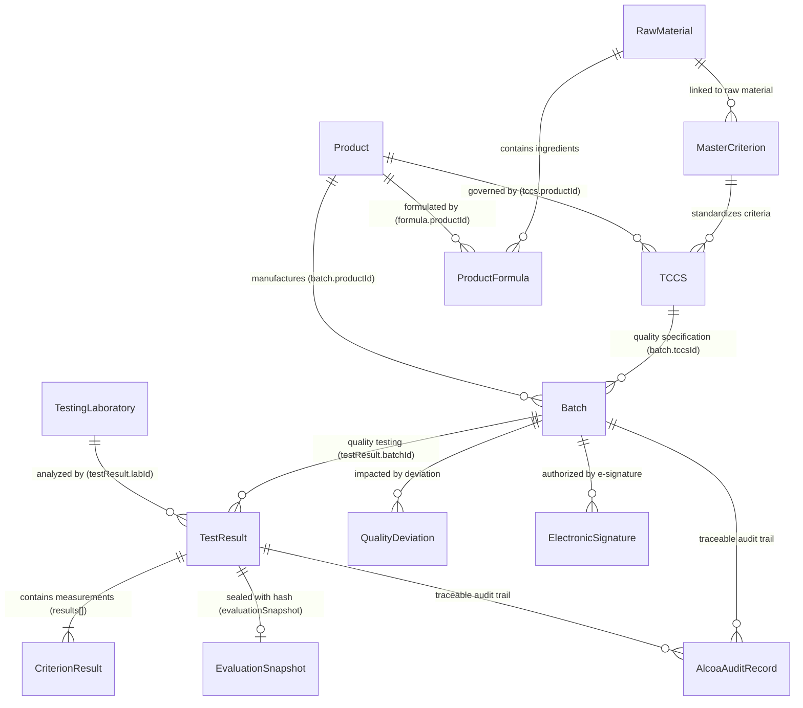
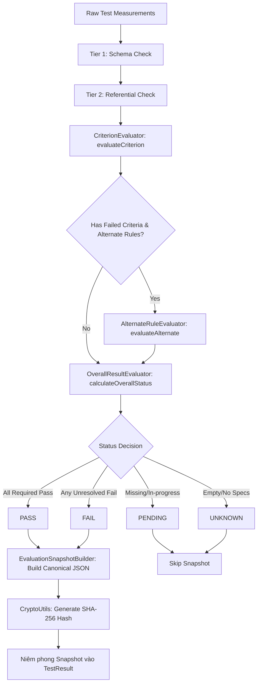

# 📘 PQM SYSTEM WORKFLOW MASTER

## HỆ THỐNG QUẢN LÝ CHẤT LƯỢNG SẢN PHẨM & KIỂM NGHIỆM DƯỢC PHẨM (V-BIOTECH PQM)

### BẢN ĐẶC TẢ XƯƠNG SỐNG NGHIỆP VỤ & HỢP ĐỒNG KIẾN TRÚC TOÀN HỆ THỐNG (MODEL 00)

> **Phiên bản:** `1.0.0-MASTER`  
> **Cấp tài liệu:** `SYSTEM WORKFLOW SOURCE OF TRUTH`  
> **Căn cứ pháp lý & quy chuẩn:** US FDA 21 CFR Part 11, Part 211; GMP-WHO Annex 11, Annex 2; Dược điển Việt Nam V (DĐVN V), USP, Ph.Eur, BP; ICH Q9, Q10.  
> **Phạm vi hiệu lực:** Bắt buộc tuân thủ 100% đối với toàn bộ các Model kỹ thuật, dịch vụ AI, luồng kiểm toán và giao diện người dùng.

---

## 1. SYSTEM PURPOSE (MỤC ĐÍCH HỆ THỐNG)

### 1.1. Bản chất hệ thống

**PQM (Product Quality Management)** là hệ thống thông tin quản lý chất lượng và kiểm soát rủi ro tuân thủ quy chuẩn Thực hành tốt sản xuất thuốc (GMP) và Dữ liệu toàn vẹn (Data Integrity / ALCOA+), phục vụ chuỗi cung ứng sản xuất y tế - dược phẩm - công nghệ sinh học của V-Biotech.

### 1.2. Mục đích hoạt động

1. **Thiết lập chuỗi kiểm soát chất lượng tất định (Deterministic Quality Control)**: Đo lường, thẩm định và kết luận chính xác trạng thái Đạt/Không đạt của sản phẩm dựa trên tiêu chuẩn kỹ thuật số hóa (TCCS, Dược điển).
2. **Ngăn ngừa phát hành sản phẩm không đạt (Zero Defect Release)**: Chặn đứng tuyệt đối việc xuất xưởng bất kỳ lô hàng nào chưa qua kiểm nghiệm, kiểm nghiệm chưa hoàn tất, hoặc có kết quả vi phạm giới hạn quy cách.
3. **Bảo toàn bằng chứng pháp lý (Data Integrity & E-Signature)**: Lưu vết bất biến (Append-only Audit Trail với mã băm mật mã SHA-256) và ràng buộc trách nhiệm pháp lý qua Chữ ký điện tử (21 CFR Part 11).
4. **Hỗ trợ phân tích & giám sát thông minh (AI Advisory Governance)**: Trợ lý AI phân tích OCR, dự báo hạn dùng ICH Q1A và phát hiện xu hướng Nelson Rules nhưng nằm dưới rào chắn thẩm quyền của con người (Human-in-the-Loop).

### 1.3. Các đối tượng chính (Core Entities)

- **Master Data**: `Product`, `TCCS`, `ProductFormula`, `RawMaterial`, `MasterCriterion`, `TestingLaboratory`, `PharmacopoeiaStandard`.
- **Dữ liệu Vận hành**: `Batch`, `TestResult`, `CriterionResult`, `EvaluationSnapshot`, `Attachment`.
- **Dữ liệu Giám sát & Khắc phục**: `QualityDeviation` (OOS/OOT), `ChangeRequest` (Change Control), `ApprovalTask`, `ElectronicSignature`, `AlcoaAuditRecord`.

### 1.4. Các luồng dữ liệu vào & ra

- **Đầu vào (Input)**: Hồ sơ đăng ký thuốc, Tiêu chuẩn cơ sở kỹ thuật, Công thức bào chế, Lệnh sản xuất Lô, Kết quả đo lường phân tích (nhập tay, trích xuất OCR Canvas từ PDF phiếu kiểm nghiệm phòng lab ngoại/nội kiểm).
- **Đầu ra (Output)**: Phiếu phân tích thành phẩm điện tử (CoA) có mã QR xác thực, Kết luận thẩm định chất lượng Lô, Hồ sơ theo dõi xu hướng SPC ($C_{pk}, P_{pk}$), Báo cáo thanh tra kiểm toán ALCOA+.

---

## 2. SYSTEM BOUNDARY (RANH GIỚI HỆ THỐNG)

```
                    ┌────────────────────────────────────────────────────────┐
                    │                      USER BOUNDARY                     │
                    │        QA, QC, Lab Analyst, Production, Auditor        │
                    └───────────────────────────┬────────────────────────────┘
                                                │
                                                ▼
 ┌───────────────────────────────────────────────────────────────────────────────────────────┐
 │ CLIENT BOUNDARY (INSECURE / PRESENTATION ONLY)                                            │
 │  • UI Components (Forms, Tables, Charts, Modals, Printable CoA)                           │
 │  • Client State (Zustand Slices, TanStack Query Cache, localStorage Drafts, Memory Cache) │
 │  🚨 TUYỆT ĐỐI: UI KHÔNG PHẢI SOURCE OF TRUTH. CACHE KHÔNG PHẢI SOURCE OF TRUTH.          │
 └──────────────────────────────────────────────┬────────────────────────────────────────────┘
                                                │ REST / RTDB Protocol
                                                ▼
 ┌───────────────────────────────────────────────────────────────────────────────────────────┐
 │ APPLICATION & DOMAIN BOUNDARY (LOGICAL ENFORCEMENT)                                       │
 │  • Application Services (BatchAppService, TestResultAppService, ApprovalWorkflowService)  │
 │  • Canonical Domain Engine (QualityEvaluationEngine, CanonicalStatusResolver)             │
 │  • Workflow State Machine (BatchStateMachine, TestResultStateMachine)                     │
 │  • Validation Engine (3-Tier Validation: Schema -> Referential -> Business GMP)           │
 │  • AI Advisory Layer (AIGateway, OCR Canvas - CHỈ ĐƯỢC PHÉP ĐỀ XUẤT)                      │
 └──────────────────────────────────────────────┬────────────────────────────────────────────┘
                                                │ Server-side Handshake
                                                ▼
 ┌───────────────────────────────────────────────────────────────────────────────────────────┐
 │ TRUSTED BACKEND & DATA BOUNDARY (PHYSICAL ENFORCEMENT)                                    │
 │  • Firebase RTDB Security Rules (`database.rules.json` - Hard RBAC & Data Freezing)       │
 │  • Firebase Cloud Functions (Transaction Handlers, Audit Generators, Cron Cleaners)       │
 │  • Firebase Realtime Database (`batches/`, `testResults/`, `audit_logs/`, `users/`)       │
 │  • Firebase Storage Rules (`storage.rules` - PDF/Image Type & Size Enforcement)           │
 └───────────────────────────────────────────────────────────────────────────────────────────┘
```

- **UI Boundary**: Chỉ thu thập input và render dữ liệu domain; không được tự phán đoán chất lượng.
- **AI Boundary**: Chỉ được phân tích, giải thích và đề xuất (`AIActionProposal`). Tuyệt đối cấm AI gọi trực tiếp lệnh ghi DB.
- **Client Boundary**: Không bao giờ được xem là ranh giới an ninh (Security Boundary). Mọi ràng buộc phải được chốt chặn tại `database.rules.json` và Backend Services.

---

## 3. CORE SYSTEM PRINCIPLES (DANH MỤC NGUYÊN TẮC CỐT LÕI)

### `PRINCIPLE-001` — SINGLE SOURCE OF TRUTH (SSoT)

- **Quy tắc**: Mỗi thuộc tính dữ liệu quan trọng chỉ có một nguồn sự thật có thẩm quyền duy nhất. Mọi trạng thái hiển thị trên UI, bộ nhớ đệm, trường dẫn xuất (derived), hoặc trường tương thích ngược (legacy) đều phải quy chiếu về nguồn này.
- **Lý do**: Triệt tiêu hiện tượng dữ liệu không đồng nhất giữa danh sách, chi tiết và báo cáo in.
- **Phạm vi**: Toàn bộ hệ thống (`Product`, `Batch`, `TestResult`, `TCCS`).
- **Thực thi**: `CanonicalStatusResolver.resolveQualityStatus(testResult)`.
- **Kiểm thử**: `src/domain/canonical/model1Regression.test.ts`, `src/domain/canonical/model2Regression.test.ts`.

### `PRINCIPLE-002` — QUALITY ≠ WORKFLOW DECOUPLING

- **Quy tắc**: Trạng thái chất lượng kỹ thuật (`QualityStatus`) và Trạng thái quy trình hành chính (`WorkflowStatus`) là 2 trục độc lập 100%. Tuyệt đối không suy luận `APPROVED` $\implies$ `PASS`, `FINAL` $\implies$ `PASS`, `RELEASED` $\implies$ `PASS`, hoặc `REJECTED` $\implies$ `FAIL`.
- **Lý do**: Một phiếu kiểm nghiệm có kết quả `FAIL` vẫn cần được `APPROVED` bởi QA để chính thức ghi nhận OOS vào hồ sơ lô.
- **Phạm vi**: `TestResult`, `Batch`.
- **Thực thi**: `CanonicalTestResult.qualityStatus` vs `CanonicalTestResult.workflowStatus`.
- **Kiểm thử**: `src/domain/canonical/model1Regression.test.ts`, `src/domain/canonical/model10Regression.test.ts`.

### `PRINCIPLE-003` — NO IMPLICIT PASS

- **Quy tắc**: Thiếu dữ liệu, kết quả rỗng, lỗi truy vấn, hoặc chỉ tiêu chưa thực hiện tuyệt đối không bao giờ được suy diễn ngầm thành `PASS` hoặc `isPass = true`.
- **Lý do**: Ngăn chặn thảm họa dược phẩm khi thuốc chưa đạt chuẩn bị xuất xưởng do lỗi hệ thống.
- **Phạm vi**: `CriterionResult`, `TestResult`, `Batch`.
- **Thực thi**: Cấm hoàn toàn pattern `|| 'PASS'`, `?? 'PASS'`, `default(true)`.
- **Kiểm thử**: `src/architecture/canonicalModelGuard.test.ts`.

### `PRINCIPLE-004` — NO IMPLICIT FAIL

- **Quy tắc**: Thiếu dữ liệu, đang kiểm nghiệm dở dang hoặc chưa có tiêu chuẩn đối chiếu không được tự ý biến thành `FAIL`. Phải bảo lưu chính xác trạng thái `PENDING` hoặc `UNKNOWN`.
- **Lý do**: Tránh tạo cảnh báo OOS giả làm gián đoạn dây chuyền sản xuất và sai lệch chỉ số năng lực quá trình $C_{pk}$.
- **Phạm vi**: `CriterionResult`, `TestResult`, `batchGenealogyService`.
- **Thực thi**: Phân loại `PENDING`, `UNKNOWN`, `INCOMPLETE` thay vì ép về boolean.
- **Kiểm thử**: `src/domain/canonical/model2Regression.test.ts`, `src/pages/batches/batch-360/batchGenealogy.test.ts`.

### `PRINCIPLE-005` — CANONICAL QUALITY EVALUATION

- **Quy tắc**: Mọi quyết định chất lượng phải do Domain Engine có thẩm quyền (`QualityEvaluationEngine`, `CanonicalStatusResolver`) tính toán. UI và Report tuyệt đối không tự lặp qua mảng chỉ tiêu để suy đoán kết quả.
- **Lý do**: Đảm bảo thuật toán đánh giá (bao gồm giới hạn số, cận kép, và quy tắc thay thế Alternate Rules) được tập trung và nhất quán.
- **Phạm vi**: Toàn bộ UI Pages, Print CoA, Dashboard KPI.
- **Thực thi**: `resolveQualityStatus(testResult)`.
- **Kiểm thử**: `src/architecture/layeringBoundary.test.ts`.

### `PRINCIPLE-006` — EVIDENCE BEFORE CONCLUSION

- **Quy tắc**: Mọi kết luận chất lượng bắt buộc phải đi từ bằng chứng thô thực tế:
  $$\text{Raw Measurement} \longrightarrow \text{Validation} \longrightarrow \text{Evaluation} \longrightarrow \text{Conclusion}$$
  Nghiêm cấm gán trực tiếp trạng thái chất lượng mà không có danh sách chỉ tiêu chi tiết đi kèm.
- **Lý do**: Tuân thủ nguyên tắc "Accurate" và "Original" của chuẩn ALCOA+.
- **Phạm vi**: `TestResult`, `EvaluationSnapshot`.
- **Thực thi**: `EvaluationSnapshotBuilder.build()`.
- **Kiểm thử**: `src/domain/evaluation/evaluationSnapshot.test.ts`.

### `PRINCIPLE-007` — CURRENT DATA BEFORE LEGACY DATA

- **Quy tắc**: Thứ tự ưu tiên phân giải dữ liệu là: (1) Snapshot niêm phong SHA-256 hợp lệ $\implies$ (2) Đánh giá lại từ dữ liệu gốc hiện hành $\implies$ (3) Trường dữ liệu cũ (Legacy fields) chỉ dùng làm fallback cho bản ghi lịch sử không thể tái tạo.
- **Lý do**: Đảm bảo tương thích ngược nhưng không để dữ liệu legacy bị lỗi ghi đè lên kết quả chuẩn.
- **Phạm vi**: `CanonicalStatusResolver`.
- **Thực thi**: `CanonicalStatusResolver.resolveBatchQuality()`.
- **Kiểm thử**: `src/domain/canonical/model2Regression.test.ts`.

### `PRINCIPLE-008` — FINALIZED DATA PROTECTION (DATA LOCKING)

- **Quy tắc**: Bản ghi đã niêm phong (`evaluationSnapshot`), đã phê duyệt (`APPROVED`) hoặc đã xuất xưởng (`RELEASED`) lập tức bị khóa chỉnh sửa đối với mọi tài khoản thông thường. Mọi can thiệp điều chỉnh bắt buộc phải thông qua Hồ sơ Sai lệch (Deviation) hoặc Kiểm soát Thay đổi (Change Control) có chữ ký số của Quản lý QA.
- **Lý do**: Chống giả mạo số liệu kiểm nghiệm sau khi đã cấp chứng chỉ xuất xưởng.
- **Phạm vi**: `TestResult`, `Batch`, `TCCS`.
- **Thực thi**: `database.rules.json`, `SecurityRulesValidator`.
- **Kiểm thử**: `src/domain/canonical/model13Regression.test.ts`.

### `PRINCIPLE-009` — AI IS ADVISORY (HUMAN-IN-THE-LOOP)

- **Quy tắc**: Trí tuệ nhân tạo (AI Copilot) chỉ có vai trò tư vấn: nhận diện OCR, trích xuất dữ liệu, phát hiện xu hướng bất thường và tạo đề xuất (`AIActionProposal`). AI tuyệt đối không có thẩm quyền trực tiếp ký duyệt, xuất xưởng, tự sửa DB hoặc thay đổi lịch sử kiểm toán.
- **Lý do**: Luật Dược quy định trách nhiệm pháp lý thuộc về cá nhân có thẩm quyền được ủy quyền bằng văn bản (QA Manager).
- **Phạm vi**: Toàn bộ các dịch vụ trong `src/services/ai/`.
- **Thực thi**: `aiActionGuard.validateAIAction()`.
- **Kiểm thử**: `src/architecture/aiGovernance.test.ts`.

### `PRINCIPLE-010` — FAIL CLOSED

- **Quy tắc**: Khi xảy ra bất kỳ sự cố bất thường nào (mất mạng, lỗi truy vấn index, không xác định được thẩm quyền, phiên bản xung đột, mã băm snapshot không khớp), hệ thống phải lập tức từ chối thao tác (Fail-Closed). Tuyệt đối cấm đoán mò hoặc fallback quét cạn toàn bộ database để cố tìm bản ghi.
- **Lý do**: Chống rò rỉ dữ liệu, chống crash trình duyệt và ngăn chặn quyết định sai khi thiếu dữ liệu.
- **Phạm vi**: `testResultService`, `SecurityRulesValidator`, `ConcurrencyManager`.
- **Thực thi**: Throw exception hoặc trả về `allowed: false` kèm lý do lỗi có cấu trúc.
- **Kiểm thử**: `src/services/testResultService.test.ts`.

### `PRINCIPLE-011` — IMMUTABLE AUDIT TRAIL

- **Quy tắc**: Nhật ký kiểm toán là phụ lục bất biến chỉ ghi thêm (Append-only). Tuyệt đối không cho phép sửa (`UPDATE`) hoặc xóa (`DELETE`) bất kỳ bản ghi kiểm toán nào, kể cả với tài khoản Quản trị viên tối cao (ADMIN).
- **Lý do**: Tuân thủ điều khoản bắt buộc US FDA 21 CFR Part 11.10(e).
- **Phạm vi**: `audit_logs/`, `AlcoaAuditManager`.
- **Thực thi**: `database.rules.json` cấm `.write` update/delete trên `audit_logs/`, `SecurityRulesValidator`.
- **Kiểm thử**: `src/domain/canonical/model9Regression.test.ts`, `src/domain/canonical/model13Regression.test.ts`.

### `PRINCIPLE-012` — END-TO-END TRACEABILITY

- **Quy tắc**: Mọi quyết định chất lượng trên UI phải truy ngược được toàn bộ chuỗi phả hệ kỹ thuật:
  $$\text{Batch Decision} \longrightarrow \text{TestResult} \longrightarrow \text{Criterion Value} \longrightarrow \text{Specification Limits} \longrightarrow \text{TCCS} \longrightarrow \text{Formula} \longrightarrow \text{Raw Material}$$
- **Lý do**: Cung cấp bằng chứng giải trình tức thì khi thanh tra cơ quan quản lý dược kiểm tra nguồn gốc lô.
- **Phạm vi**: `DataLineageManager`, `ValueOriginExplanation`.
- **Thực thi**: `DataLineageManager.explainBatchDecision()`.
- **Kiểm thử**: `src/domain/canonical/model4Regression.test.ts`.

### `PRINCIPLE-013` — ATOMIC REGULATED MUTATION

- **Quy tắc**: Kế hoạch sửa đổi dữ liệu có kiểm soát (Healing Plan / Batch Migration) gồm nhiều bước phải được thực thi theo cơ chế giao dịch nguyên tử (Atomic Transaction: All-or-Nothing). Nếu 1 bước thất bại, toàn bộ các bước trước đó phải được hoàn nguyên (Rollback) ngay lập tức; không để lại trạng thái chắp vá cục bộ (1✓, 2✓, 3✗).
- **Lý do**: Bảo đảm tính toàn vẹn của đồ thị liên kết thực thể dữ liệu.
- **Phạm vi**: `AutoHealingFramework.executeAtomicHealingPlan()`.
- **Thực thi**: Transaction handlers và rollback callbacks.
- **Kiểm thử**: `src/domain/canonical/model8Regression.test.ts`, `src/domain/canonical/model13Regression.test.ts`.

### `PRINCIPLE-014` — OPTIMISTIC CONCURRENCY & VERSION AWARENESS

- **Quy tắc**: Mọi thao tác cập nhật dữ liệu quan trọng đều phải kiểm tra phiên bản kỳ vọng (`expectedVersion === currentVersion`). Nếu phát hiện phiên bản trên máy chủ đã thay đổi, hệ thống phải từ chối ghi và phát tín hiệu xung đột (`ConcurrentModificationError`), không cho phép ghi đè trong im lặng (Silent Overwrite).
- **Lý do**: Tránh xung đột dữ liệu khi nhiều kiểm nghiệm viên hoặc QA cùng truy cập một hồ sơ lô đồng thời.
- **Phạm vi**: `Batch`, `TestResult`, `TCCS`, `ProductFormula`.
- **Thực thi**: `ConcurrencyManager.verifyVersion()`.
- **Kiểm thử**: `src/domain/canonical/model11Regression.test.ts`.

### `PRINCIPLE-015` — UI IS NOT A BUSINESS AUTHORITY

- **Quy tắc**: Tầng giao diện người dùng (UI Components) chỉ là lớp thể hiện trực quan, không nắm giữ thẩm quyền kinh doanh. UI chỉ được gọi các Application Services và nhận kết quả từ Domain Layer để hiển thị.
- **Lý do**: Ngăn ngừa phân mảnh logic nghiệp vụ khi app mở rộng sang mobile hoặc API tích hợp bên thứ ba.
- **Phạm vi**: Toàn bộ thư mục `src/pages/` và `src/components/`.
- **Thực thi**: Static Guard kiểm tra import và cấm logic tự chế.
- **Kiểm thử**: `src/architecture/layeringBoundary.test.ts`.

---

## 4. DOMAIN OBJECT MODEL (MÔ HÌNH THỰC THỂ MIỀN)

| Object Name             | Canonical ID              | Parent Entity | Source of Truth                      | Lifecycle States                                                    | Regulated / Immutable?                     |
| :---------------------- | :------------------------ | :------------ | :----------------------------------- | :------------------------------------------------------------------ | :----------------------------------------- |
| **Product**             | `productId` (`prod-xxx`)  | Root          | `products/$id`                       | `ACTIVE`, `DISCONTINUED`, `RECALLED`                                | Regulated; Không xóa vật lý khi đã có Lô   |
| **ProductFormula**      | `formulaId` (`form-xxx`)  | `Product`     | `productFormulas/$id`                | Draft $\to$ Approved $\to$ Obsolete                                 | Regulated; Khóa khi Lô đã dùng             |
| **TCCS**                | `tccsId` (`tccs-xxx`)     | `Product`     | `tccsList/$id`                       | Active $\to$ Inactive $\to$ Superseded                              | Regulated; Khóa sau khi ban hành           |
| **MasterCriterion**     | `masterCriterionId`       | Root          | `master_criteria/$id`                | Active $\to$ Inactive                                               | Master Data; Không xóa nếu đã gắn TCCS     |
| **RawMaterial**         | `materialId` (`mat-xxx`)  | Root          | `rawMaterials/$id`                   | Active $\to$ Discontinued                                           | Master Data; Quản lý nguồn gốc hoạt chất   |
| **TestingLaboratory**   | `labId` (`lab-xxx`)       | Root          | `testing_laboratories/$id`           | Active $\to$ Inactive                                               | Master Data; Quản lý đơn vị thử nghiệm     |
| **Batch**               | `batchId` (`batch-xxx`)   | `Product`     | `batches/$id`                        | `PENDING`, `TESTING`, `RELEASED`, `REJECTED`, `BLOCKED`             | Regulated; Khóa khi `RELEASED`/`REJECTED`  |
| **TestResult**          | `testResultId` (`tr-xxx`) | `Batch`       | `testResults/$id`                    | `DRAFT`, `SUBMITTED`, `FINAL`, `APPROVED`, `RELEASED`, `SUPERSEDED` | Regulated; Niêm phong sau khi có Snapshot  |
| **CriterionResult**     | In-array object           | `TestResult`  | `testResults/$id/results`            | Unresolved $\to$ Evaluated                                          | Bằng chứng gốc; Khóa cùng TestResult       |
| **EvaluationSnapshot**  | Cryptographic object      | `TestResult`  | `testResults/$id/evaluationSnapshot` | Sealed (Bất biến)                                                   | **TUYỆT ĐỐI BẤT BIẾN** (SHA-256 Hash)      |
| **QualityDeviation**    | `deviationId` (`dev-xxx`) | `Batch`       | `deviations/$id`                     | `LOGGED`, `UNDER_INVESTIGATION`, `CAPA_PLANNED`, `REVIEW`, `CLOSED` | Regulated; Bắt buộc đóng trước khi Release |
| **ChangeRequest**       | `crId` (`cr-xxx`)         | Root          | `change_controls/$id`                | `DRAFT`, `IMPACT`, `QA_REVIEW`, `APPROVED`, `VERIFIED`, `CLOSED`    | Regulated; Thẩm định thay đổi quy trình    |
| **ElectronicSignature** | `sigId` (`sig-xxx`)       | Entity        | `signatures/$id`                     | Permanent (Bất biến)                                                | **TUYỆT ĐỐI BẤT BIẾN** (21 CFR Part 11)    |
| **AlcoaAuditRecord**    | `auditId` (`AUDIT-xxx`)   | Entity        | `audit_logs/$id`                     | Append-only (Bất biến)                                              | **TUYỆT ĐỐI BẤT BIẾN** (Chuỗi băm SHA-256) |
| **HealingPlan**         | `planId` (`PLAN-xxx`)     | Issue         | In-memory / Cloud Store              | `PROPOSED`, `APPROVED`, `COMMITTED`, `ROLLED_BACK`                  | Kiểm soát; Cần chữ ký QA/ADMIN             |

---

## 5. DOMAIN RELATIONSHIP MAP (SƠ ĐỒ QUAN HỆ THỰC THỂ)



---

## 6. MASTER DATA FLOW (LUỒNG DỮ LIỆU TỔNG THỂ)

```
[1. DATA INPUT] ──────────► [2. SCHEMA VALIDATION] ─────► [3. REFERENTIAL INTEGRITY]
- Nhập tay tại Form         - Kiểm tra kiểu dữ liệu      - Kiểm tra Technical ID
- Upload PDF (AI OCR)        - Kiểm tra định dạng ngày    - Chặn khóa ngoại mồ côi
- Import Excel danh mục      - Cấm default('PASS')        - Kế thừa tccsId/productId
                                                                   │
                                                                   ▼
[6. EVALUATION & SEALING] ◄── [5. PERSIST DRAFT] ◄──────── [4. DOMAIN RULES CHECK]
- QualityEvaluationEngine    - Lưu DB với version = 1     - Quy tắc giới hạn Min/Max
- Tính PASS/FAIL/PENDING     - Tạo Genesis Audit Log      - Bất biến hạn dùng sinh học
- Niêm phong Snapshot SHA256                                       │
            │                                                      │
            ▼                                                      ▼
[7. WORKFLOW ADVANCEMENT] ──► [8. RELEASE GATE] ────────► [9. AUDIT & GENEALOGY]
- Chuyển DRAFT -> FINAL      - Thẩm định 7 điều kiện      - Truy vết toàn chuỗi phả hệ
- Ký duyệt E-Signature       - Phê duyệt Lô RELEASED      - Lưu vết bất biến ALCOA+
- Soát xét CAPA sai lệch     - Khóa bất biến hồ sơ        - Cấp chứng chỉ CoA điện tử
```

---

## 7. QUALITY EVALUATION WORKFLOW (QUY TRÌNH ĐÁNH GIÁ CHẤT LƯỢNG)



---

## 8. QUALITY STATUS CONTRACT (HỢP ĐỒNG TRẠNG THÁI CHẤT LƯỢNG)

| Status        | Ý nghĩa nghiệp vụ              | Điều kiện kích hoạt                                                                            | Bằng chứng bắt buộc (Evidence)                                |     Cho phép Xuất xưởng?      |
| :------------ | :----------------------------- | :--------------------------------------------------------------------------------------------- | :------------------------------------------------------------ | :---------------------------: |
| **`PASS`**    | Đạt chuẩn chất lượng toàn diện | 100% chỉ tiêu bắt buộc đạt giới hạn, hoặc chỉ tiêu phụ được miễn trừ hợp lệ qua Alternate Rule | Đầy đủ kết quả đo lường; Snapshot SHA-256 đối chiếu khớp 100% | **CÓ** (Nếu đủ các gate khác) |
| **`FAIL`**    | Không đạt tiêu chuẩn (OOS)     | Tồn tại ít nhất 1 chỉ tiêu kỹ thuật bắt buộc vi phạm giới hạn quy cách và không thể cứu xét    | Giá trị đo lường thực tế nằm ngoài khoảng Min-Max của TCCS    |       **TUYỆT ĐỐI CẤM**       |
| **`PENDING`** | Đang kiểm nghiệm dở dang       | Còn ít nhất 1 chỉ tiêu chưa có kết quả (đang ủ vi sinh, đang gửi mẫu ngoại kiểm)               | Chỉ tiêu có trường giá trị rỗng hoặc `isPass = null`          |  **KHÔNG** (Chặn xuất xưởng)  |
| **`UNKNOWN`** | Chưa xác định được chất lượng  | Phiếu rỗng, chưa gắn chỉ tiêu, hoặc không tìm thấy tiêu chuẩn TCCS hiệu lực để đối chiếu       | Không có mảng `results` hoặc TCCS không tồn tại               |  **KHÔNG** (Chặn xuất xưởng)  |

---

## 9. WORKFLOW STATUS CONTRACT (HỢP ĐỒNG VÒNG ĐỜI VẬN HÀNH)

### 9.1. Vòng đời Lô sản xuất (`Batch`)

- **`PENDING`**: Lô mới khởi tạo, chờ xếp lịch sản xuất hoặc gửi mẫu kiểm nghiệm.
- **`TESTING`**: Đang trong quá trình kiểm nghiệm mẫu tại phòng lab.
- **`RELEASED`**: Đã được Quản lý QA ký duyệt xuất xưởng chính thức bằng chữ ký điện tử.
- **`REJECTED`**: Lô bị từ chối do vi phạm quy chuẩn chất lượng hoặc sản xuất.
- **`BLOCKED`**: Lô bị thu hồi khẩn cấp hoặc phong tỏa tạm thời để điều tra an toàn.

### 9.2. Vòng đời Phiếu kiểm nghiệm (`TestResult`)

- **`DRAFT`**: KNV đang nhập liệu hoặc chỉnh sửa kết quả ban đầu.
- **`SUBMITTED`**: Đã nộp phiếu, chuyển giao cho QC/QA soát xét.
- **`FINAL`**: Phòng kiểm nghiệm đã chốt kết quả kỹ thuật cuối cùng.
- **`APPROVED`**: QA đã thẩm tra và ký số phê duyệt kết quả.
- **`RELEASED`**: Phiếu thuộc Lô đã được xuất xưởng.
- **`SUPERSEDED`**: Phiếu cũ bị thay thế bởi phiếu kiểm nghiệm lại (Re-test).

---

## 10. QUALITY × WORKFLOW MATRIX (MA TRẬN CHẤT LƯỢNG × VÒNG ĐỜI)

| Workflow Status  | `UNKNOWN` | `PENDING` |  `PASS`   |        `FAIL`        | Giải trình chính sách nghiệp vụ (Policy Rationale)                        |
| :--------------- | :-------: | :-------: | :-------: | :------------------: | :------------------------------------------------------------------------ |
| **`DRAFT`**      | ✅ HỢP LỆ | ✅ HỢP LỆ | ✅ HỢP LỆ |      ✅ HỢP LỆ       | Bản nháp đang thu thập số liệu hoặc vừa nhập xong kết quả đo.             |
| **`SUBMITTED`**  |  ❌ CẤM   | ✅ HỢP LỆ | ✅ HỢP LỆ |      ✅ HỢP LỆ       | Không được nộp phiếu rỗng chưa có dữ liệu chỉ tiêu.                       |
| **`FINAL`**      |  ❌ CẤM   |  ❌ CẤM   | ✅ HỢP LỆ |      ✅ HỢP LỆ       | Đã chốt kỹ thuật: Bắt buộc tất cả chỉ tiêu phải có kết luận rõ ràng.      |
| **`APPROVED`**   |  ❌ CẤM   |  ❌ CẤM   | ✅ HỢP LỆ |      ✅ HỢP LỆ       | QA phê duyệt kết quả ĐẠT hoặc phê duyệt kết quả OOS để mở điều tra.       |
| **`RELEASED`**   |  ❌ CẤM   |  ❌ CẤM   | ✅ HỢP LỆ | ❌ **CẤM TUYỆT ĐỐI** | **BẤT BIẾN GMP**: Không bao giờ cho phép Release lô hàng có kết quả FAIL. |
| **`SUPERSEDED`** | ✅ HỢP LỆ | ✅ HỢP LỆ | ✅ HỢP LỆ |      ✅ HỢP LỆ       | Phiếu cũ được lưu vết lịch sử sau khi có quyết định thử lại mẫu.          |

---

## 11. TEST RESULT DETAILED WORKFLOW (CHI TIẾT LUỒNG PHIẾU KIỂM NGHIỆM)

1. **Khởi tạo (Create)**: KNV chọn Lô sản xuất (`batchId`). Hệ thống tự động kế thừa `productId` và `tccsId` hiệu lực.
2. **Nhập liệu & Tự động đánh giá (Entry & Evaluation)**: KNV nhập giá trị hoặc tải ảnh/PDF để AI OCR trích xuất. Hệ thống kích hoạt `QualityEvaluationEngine` đánh giá tất định từng chỉ tiêu theo thời gian thực.
3. **Niêm phong ALCOA+ (Sealing Snapshot)**: Khi phiếu đạt kết luận, hệ thống chụp `evaluationSnapshot`, tính mã băm SHA-256 và gắn vào phiếu.
4. **Phê duyệt (Approval)**: Trưởng phòng QC/QA ký số phê duyệt (`workflowStatus = 'APPROVED'`). Bản ghi chuyển sang trạng thái khóa chỉnh sửa.
5. **Xử lý Re-test**: Nếu cần kiểm nghiệm lại, phiếu cũ được chuyển sang `SUPERSEDED`, phiếu mới được cấp số hiệu mới và liên kết hồ sơ lô.

---

## 12. BATCH DETAILED WORKFLOW (CHI TIẾT LUỒNG LÔ SẢN XUẤT)

1. **Đăng ký Lô**: Bộ phận sản xuất tạo lô kèm số lô (`batchNo`), ngày sản xuất (`mfgDate`), hạn dùng (`expDate`), sản lượng lý thuyết và thực tế.
2. **Tiến trình kiểm nghiệm**: Lô chuyển trạng thái `TESTING`. Phòng lab tiến hành kiểm tra mẫu và nộp các phiếu phân tích.
3. **Rà soát phả hệ & sai lệch**: Hệ thống đối chiếu phả hệ lô, kiểm tra các hồ sơ sai lệch `QualityDeviation` liên quan.
4. **Quyết định xuất xưởng / Từ chối**: QA kích hoạt Release Gate. Nếu thỏa mãn 100% điều kiện, QA thực hiện ký số xuất xưởng (`RELEASED`) hoặc từ chối (`REJECTED`).

---

## 13. RELEASE GATE CONTRACT (CỔNG KIỂM SOÁT XUẤT XƯỞNG)

```
                            ┌──────────────────────────────────────────────┐
                            │           BẮT ĐẦU THẨM ĐỊNH RELEASE          │
                            └──────────────────────┬───────────────────────┘
                                                   │
                                                   ▼
┌──────────────────────────────────────────────────┴──────────────────────────────────────────────────┐
│ KIỂM TRA 7 ĐIỀU KIỆN BẮT BUỘC TIÊN QUYẾT (RELEASE PREREQUISITES):                                  │
│  [1] Hồ sơ Lô hợp lệ, ngày sản xuất và hạn dùng hợp lý sinh học (expDate > mfgDate & chưa hết hạn) │
│  [2] Tồn tại phiếu kiểm nghiệm Authoritative đại diện chính thức cho Lô                             │
│  [3] Canonical Quality Status của Lô đạt chuẩn tuyệt đối: PASS                                     │
│  [4] Mã băm SHA-256 niêm phong Evaluation Snapshot đối chiếu hợp lệ 100% (Không bị giả mạo)        │
│  [5] Không còn bất kỳ hồ sơ sai lệch nghiêm trọng nào đang mở (Zero Open Critical Deviations)      │
│  [6] Người thực hiện có thẩm quyền bắt buộc: QA hoặc ADMIN (RBAC Verified)                          │
│  [7] Xác thực Chữ ký điện tử 21 CFR Part 11 thành công (Mật mã / Token hợp lệ)                     │
└──────────────────────────────────────────────────┬──────────────────────────────────────────────────┘
                                                   │
                         ┌─────────────────────────┴─────────────────────────┐
                         │                                                   │
                 [Tất cả ĐẠT 100%]                                   [Có 1 điều kiện FAIL]
                         │                                                   │
                         ▼                                                   ▼
         ┌───────────────────────────────┐                   ┌───────────────────────────────┐
         │       CHO PHÉP RELEASE        │                   │        RELEASE BLOCKED        │
         │ - Chuyển status -> RELEASED   │                   │ - Lập tức chặn luồng (Deny)   │
         │ - Sinh giấy chứng nhận CoA    │                   │ - Xuất danh sách lý do chặn   │
         │ - Ghi vết Audit bất biến      │                   │ - Ghi log cảnh báo an ninh    │
         └───────────────────────────────┘                   └───────────────────────────────┘
```

---

## 14. DATA INTEGRITY & MUTABILITY WORKFLOW (TOÀN VẸN & KHẢ BIẾN DỮ LIỆU)

- **Mutable Fields (Được phép sửa trong giai đoạn DRAFT)**: `notes`, `attachments`, giá trị đo lường thô `results[].value` (khi chưa niêm phong).
- **Controlled Mutation (Bắt buộc phê duyệt & Audit ALCOA+)**: `batchNo`, `mfgDate`, `expDate`, sửa đổi kết quả sau khi đã tạo bản nháp.
- **Immutable Fields (Tuyệt đối bất biến sau khi Finalize/Approve)**: `id`, `evaluationSnapshot`, `evaluationHash`, `signedAt`, `signerUid`, `checksum`, `audit_logs`.
- **Forbidden Actions**: Xóa bản ghi đã xuất xưởng, sửa trực tiếp kết quả kiểm nghiệm trên phiếu đã ký số mà không qua quy trình CAPA.

---

## 15. CONSISTENCY & RECONCILIATION WORKFLOW (ĐỐI CHIẾU & PHÁT HIỆN SAI LỆCH)

Phân loại chính xác 8 nhóm sai lệch, không đánh đồng thành FAIL:

1. **`MISSING`**: Thiếu thông tin liên kết bắt buộc (Lô chưa gắn TCCS).
2. **`INCOMPLETE`**: Dữ liệu kiểm nghiệm đang thực hiện dở dang $\to$ Mức độ: `INFO/WARNING` (Không phải lỗi chất lượng).
3. **`CONTRADICTORY`**: Dữ liệu mâu thuẫn thực tế (Phiếu ghi PASS nhưng chỉ tiêu OOS) $\to$ Mức độ: `CRITICAL`.
4. **`STALE`**: Dữ liệu dẫn xuất chưa được đồng bộ sau khi cập nhật dữ liệu gốc.
5. **`ORPHAN`**: Bản ghi mồ côi (Phiếu kiểm nghiệm trỏ tới `batchId` không tồn tại).
6. **`DUPLICATE`**: Trùng lặp định danh mã lô hoặc mã sản phẩm.
7. **`INVALID`**: Sai định dạng schema, ngày hết hạn trước ngày sản xuất.
8. **`DERIVED_MISMATCH`**: Sai lệch giữa bộ đếm hiển thị và dữ liệu thực tế.

---

## 16. AI WORKFLOW & GOVERNANCE CONTRACT (QUY CHUẨN ĐIỀU HÀNH AI)

```
[User Uploads Document] ──► [AI Gateway & OCR Engine] ──► [Feature Extraction & Risk Classify]
                                                                        │
                                                                        ▼
[Execute Mutation] ◄── [Human Signoff / Approval] ◄── [AIActionProposal (Evidence & Rationale)]
         │
         ▼
[Post-Verify & ALCOA+ Audit]
```

- AI **được phép**: Hỗ trợ bóc tách bảng biểu, gợi ý map chỉ tiêu, dự báo xu hướng, phân tích nguyên nhân gốc OOS.
- AI **bị cấm**: Tự ý bấm duyệt, tự ý cấp quyền, tự ý sửa đổi cơ sở dữ liệu khi chưa có sự xác nhận của người dùng có thẩm quyền.

---

## 17. AUTO-HEALING WORKFLOW (HÀN GẮN DỮ LIỆU TỰ ĐỘNG CÓ KIỂM SOÁT)

- **`SAFE_AUTO_HEAL`**: Chỉ áp dụng cho các trường dữ liệu phi rủi ro: chuẩn hóa định dạng văn bản (khoảng trắng, chữ hoa/thường), tái tạo index tìm kiếm.
- **`CONTROLLED_HEAL`**: Sửa khóa ngoại mồ côi, đồng bộ metadata lịch sử $\implies$ Bắt buộc QA/ADMIN phê duyệt kế hoạch `HealingPlan`.
- **`NEVER_AUTO_HEAL` (Quy tắc thép GMP)**: Tuyệt đối cấm tự động sửa bất kỳ giá trị đo lường kiểm nghiệm thô, chữ ký điện tử, kết quả chỉ tiêu vi phạm, hoặc hồ sơ đã xuất xưởng.

---

## 18. CORRECTION & DEVIATION WORKFLOW (QUY TRÌNH XỬ LÝ SAI LỆCH OOS/CAPA)

1. **Phát hiện (Detect)**: Khi có chỉ tiêu vi phạm OOS, hệ thống tự động ghi nhận sự cố và đề xuất mở hồ sơ `QualityDeviation`.
2. **Điều tra nguyên nhân gốc (Investigation)**: Đội ngũ QA/QC thực hiện điều tra phòng lab (Phase 1) và điều tra sản xuất (Phase 2) qua biểu đồ Ishikawa và 5-Why.
3. **Kế hoạch CAPA (CAPA Plan)**: Đề xuất biện pháp khắc phục và phòng ngừa kèm thời hạn và người chịu trách nhiệm.
4. **Đóng hồ sơ (Closure)**: QA kiểm tra hiệu quả của CAPA và ký số đóng hồ sơ. Chỉ khi hồ sơ Critical Deviation được đóng, Lô mới đủ điều kiện xuất xưởng.

---

## 19. AUDIT TRAIL WORKFLOW (NHẬT KÝ KIỂM TOÁN ALCOA+)

Mỗi sự kiện kiểm toán bắt buộc phải bảo đảm 9 tiêu chí ALCOA+:

- **Attributable**: Định danh rõ ràng người thực hiện (`userId`, `userRole`, `userEmail`).
- **Legible**: Lý do thay đổi rõ ràng, dễ hiểu (`reason`).
- **Contemporaneous**: Thời điểm thực tế không được hồi tố (`timestamp` đơn điệu).
- **Original**: Lưu nguyên bản giá trị cũ (`oldValue`) và giá trị mới (`newValue`).
- **Accurate**: Băm mật mã SHA-256 bảo vệ toàn vẹn nội dung (`entryHash`).
- **Consistent**: Chuỗi liên kết băm (`previousHash` trỏ tới `entryHash` của bản ghi liền trước).
- **Enduring & Immutable**: Đóng băng bộ nhớ (`Object.freeze`), cấm update/delete.
- **Available**: Cung cấp bộ lọc và trích xuất báo cáo thanh tra Dược điển bất kỳ lúc nào.

---

## 20. ERROR & EXCEPTION WORKFLOW (PHÂN LOẠI & XỬ LÝ SỰ CỐ)

| Mã lỗi phân loại          | Bản chất sự cố                                | Hành vi ứng xử của hệ thống                                 |    Có chặn luồng?    |
| :------------------------ | :-------------------------------------------- | :---------------------------------------------------------- | :------------------: |
| **`VALIDATION_ERROR`**    | Dữ liệu sai schema hoặc vi phạm giới hạn      | Hiển thị lỗi đỏ tại Form, chỉ rõ trường sai                 |        **CÓ**        |
| **`BUSINESS_RULE_ERROR`** | Vi phạm quy tắc xuất xưởng hoặc duyệt         | Chặn hành động, hiển thị danh sách điều kiện chưa đạt       |        **CÓ**        |
| **`AUTHORIZATION_ERROR`** | Không đủ thẩm quyền theo vai trò RBAC         | Báo lỗi vi phạm phân quyền ALCOA+, chặn thực thi            |        **CÓ**        |
| **`INTEGRITY_ERROR`**     | Sai lệch mã băm snapshot hoặc đứt chuỗi audit | Niêm phong hồ sơ, báo động nguy cơ giả mạo dữ liệu          | **CÓ** (Báo động đỏ) |
| **`CONCURRENCY_ERROR`**   | Xung đột ghi đè do phiên bản cũ               | Từ chối ghi, yêu cầu người dùng tải lại dữ liệu mới nhất    |        **CÓ**        |
| **`DATA_ACCESS_ERROR`**   | Lỗi kết nối Firebase hoặc mất index           | Chuyển sang Fail-Closed, đọc cache an toàn, cấm quét cạn    |        **CÓ**        |
| **`NETWORK_ERROR`**       | Mất kết nối Internet                          | Chuyển sang chế độ lưu nháp offline, tự đồng bộ khi có mạng | Không chặn nhập nháp |

---

## 21. CONCURRENCY & VERSIONING WORKFLOW (KIỂM SOÁT GHI ĐỒNG THỜI)

1. Đọc bản ghi hiện tại từ DB $\implies$ Ghi nhận phiên bản `currentVersion` (ví dụ: `v = 3`).
2. Người dùng thao tác chỉnh sửa trên client.
3. Khi gửi yêu cầu lưu, client đính kèm `expectedVersion = 3`.
4. Backend/Service so sánh: nếu bản ghi trên DB đã lên `v = 4`, lập tức ném lỗi `ConcurrentModificationError`.
5. Nếu phiên bản trùng khớp, tăng `version = 4`, ghi nhận `updatedAt`, `updatedBy` và commit nguyên tử.

---

## 22. DATA ACCESS PRINCIPLES (NGUYÊN TẮC TRUY VẤN DỮ LIỆU)

1. **Truy vấn định danh trực tiếp (Direct Lookup)**: Dùng `child(ref(db, 'collection'), id)` khi đã biết khóa chính.
2. **Truy vấn có chỉ mục (Indexed Query)**: Dùng `query(ref(db, 'collection'), orderByChild('key'), equalTo('value'))` cho các quan hệ cha con (`batchId`, `productId`).
3. **Phân trang giới hạn (Bounded Query)**: Bắt buộc dùng `limitToLast(n)` hoặc phân trang con trỏ (tie-breaker cursor) đối với tập dữ liệu lớn.
4. **TUYỆT ĐỐI CẤM**: Không bao giờ gọi `get(ref(db, 'testResults'))` hoặc `get(ref(db, 'batches'))` toàn bộ trên production path.
5. **Fail-Closed Policy**: Khi truy vấn Firebase lỗi, lập tức ngắt luồng và báo lỗi, không fallback quét toàn bộ database.

---

## 23. SECURITY BOUNDARY & AUTHORIZATION (RANH GIỚI BẢO MẬT)

- **Tầng 1 (Client UI)**: Ẩn/hiện nút bấm dựa trên vai trò (Chỉ phục vụ trải nghiệm người dùng, không có giá trị bảo mật).
- **Tầng 2 (Application Guard)**: `SecurityRulesValidator` và `aiActionGuard` tiền kiểm soát dữ liệu trước khi gửi đi.
- **Tầng 3 (Trusted Backend & Firebase Rules)**: `database.rules.json` và `storage.rules` đóng vai trò là ranh giới an ninh tối cao, từ chối mọi yêu cầu vi phạm ở cấp độ socket mạng.

---

## 24. ROLE / AUTHORIZATION MATRIX (MA TRẬN PHÂN QUYỀN RBAC)

| Hành vi nghiệp vụ (Action)           | `ADMIN` | `QA` | `QC` | `LAB` | `PRODUCTION` | `VIEWER` | `GUEST` | Yêu cầu E-Signature? |
| :----------------------------------- | :-----: | :--: | :--: | :---: | :----------: | :------: | :-----: | :------------------: |
| Tạo / Sửa Danh mục Master Data       |   ✅    |  ✅  |  ❌  |  ❌   |      ❌      |    ❌    |   ❌    |        Không         |
| Tạo Lô sản xuất (`Batch`)            |   ✅    |  ✅  |  ❌  |  ❌   |      ✅      |    ❌    |   ❌    |        Không         |
| Nhập kết quả kiểm nghiệm             |   ✅    |  ✅  |  ✅  |  ✅   |      ❌      |    ❌    |   ❌    |        Không         |
| Phê duyệt Phiếu kiểm nghiệm          |   ✅    |  ✅  |  ✅  |  ❌   |      ❌      |    ❌    |   ❌    |     **BẮT BUỘC**     |
| Phê duyệt Xuất xưởng Lô (`RELEASED`) |   ✅    |  ✅  |  ❌  |  ❌   |      ❌      |    ❌    |   ❌    |     **BẮT BUỘC**     |
| Từ chối Lô sản xuất (`REJECTED`)     |   ✅    |  ✅  |  ❌  |  ❌   |      ❌      |    ❌    |   ❌    |     **BẮT BUỘC**     |
| Thu hồi Lô đã xuất xưởng (`BLOCKED`) |   ✅    |  ✅  |  ❌  |  ❌   |      ❌      |    ❌    |   ❌    |     **BẮT BUỘC**     |
| Đóng hồ sơ Sai lệch CAPA             |   ✅    |  ✅  |  ❌  |  ❌   |      ❌      |    ❌    |   ❌    |     **BẮT BUỘC**     |
| Ban hành / Khóa TCCS                 |   ✅    |  ✅  |  ❌  |  ❌   |      ❌      |    ❌    |   ❌    |     **BẮT BUỘC**     |
| Thực thi Auto-Healing có kiểm soát   |   ✅    |  ✅  |  ❌  |  ❌   |      ❌      |    ❌    |   ❌    |     **BẮT BUỘC**     |
| Xem Báo cáo & Hồ sơ 360°             |   ✅    |  ✅  |  ✅  |  ✅   |      ✅      |    ✅    |   ❌    |        Không         |
| Sửa / Xóa Nhật ký kiểm toán          |   ❌    |  ❌  |  ❌  |  ❌   |      ❌      |    ❌    |   ❌    |  **CẤM TUYỆT ĐỐI**   |

---

## 25. STATE TRANSITION RULES (BẢNG QUY TẮC CHUYỂN TRẠNG THÁI)

### 25.1. Chuyển đổi trạng thái Lô (`BatchStateMachine`)

- `PENDING` $\longrightarrow$ `TESTING`: Khi bắt đầu gửi mẫu phân tích.
- `PENDING` $\longrightarrow$ `REJECTED`: Hủy lô trước kiểm nghiệm kèm lý do.
- `TESTING` $\longrightarrow$ `RELEASED`: Đạt 7 cổng kiểm soát Release Gate, thẩm quyền QA/ADMIN.
- `TESTING` $\longrightarrow$ `REJECTED`: Có chỉ tiêu OOS không thể cứu xét, thẩm quyền QA/ADMIN.
- `TESTING` $\longrightarrow$ `BLOCKED`: Tạm phong tỏa để thanh tra.
- `RELEASED` $\longrightarrow$ `BLOCKED`: Khởi động quy trình thu hồi sản phẩm khẩn cấp (Recall).
- `REJECTED` $\longrightarrow$ `PENDING`: Mở lại lô duy nhất khi có kết luận điều tra CAPA hợp lệ.
- ❌ **CẤM BẤT DI BẤT DỊCH**: `RELEASED` $\longrightarrow$ `PENDING`, `RELEASED` $\longrightarrow$ `TESTING`, `REJECTED` $\longrightarrow$ `RELEASED`.

### 25.2. Chuyển đổi trạng thái Phiếu (`TestResultStateMachine`)

- `PENDING` $\longrightarrow$ `PASS`: Tất cả chỉ tiêu đạt, thẩm quyền QA/QC/ADMIN.
- `PENDING` $\longrightarrow$ `FAIL`: Có chỉ tiêu không đạt.
- `PASS` $\longrightarrow$ `SUPERSEDED`: Đánh dấu thay thế khi có phiếu re-test.
- `FAIL` $\longrightarrow$ `SUPERSEDED`: Đánh dấu thay thế khi có phiếu re-test theo CAPA.
- `SUPERSEDED` $\longrightarrow$ _(Bất kỳ trạng thái nào)_: ❌ **CẤM TUYỆT ĐỐI** (Điểm kết thúc vĩnh viễn).

---

## 26. SOURCE OF TRUTH MATRIX (MA TRẬN NGUỒN SỰ THẬT DUY NHẤT)

| Dữ liệu nghiệp vụ          | Authoritative Canonical Source                                                         | Derived Sources (Chỉ đọc)              | Legacy Sources (Cấm ghi đè)   | Thẩm quyền ghi (Writable By)  |
| :------------------------- | :------------------------------------------------------------------------------------- | :------------------------------------- | :---------------------------- | :---------------------------- |
| **Chất lượng kiểm nghiệm** | `testResult.evaluationSnapshot` (nếu có) $\implies$ `resolveQualityStatus(testResult)` | `overallStatus`, `StatusBadge`         | `testResult.status`, `result` | `QualityEvaluationEngine`     |
| **Chất lượng Lô hàng**     | `CanonicalStatusResolver.resolveBatchQuality()`                                        | `batch.progressPercent`, Dashboard KPI | `batch.qualityStatus`         | `CanonicalStatusResolver`     |
| **Vòng đời Lô sản xuất**   | `batch.status`                                                                         | UI Stepper                             | `batch.state`                 | `BatchAppService` / QA E-Sign |
| **Vòng đời Phiếu**         | `testResult.workflowStatus`                                                            | Document Header                        | `testResult.isFinal`          | `TestResultAppService` / QA   |
| **Tỷ lệ Đạt (Pass Rate)**  | `passTests.length / bTests.length * 100` (nếu tests > 0; rỗng nếu 0 tests)             | Dashboard Pass Rate Widget             | Hardcoded 100%                | Computed Function             |
| **Kiểm nghiệm Đầy đủ**     | `bTests.length > 0 && every(PASS \| FAIL)`                                             | `batch.isFullyTested` badge            | Has at least 1 PASS           | Computed Function             |

---

## 27. DERIVED DATA POLICY (CHÍNH SÁCH DỮ LIỆU DẪN XUẤT)

1. Dữ liệu dẫn xuất (Derived Data) như `passRate`, `isFullyTested`, số lượng chỉ tiêu đạt, trạng thái phả hệ, điểm SPC là kết quả tính toán động trong RAM, **tuyệt đối không được lưu thành trường cứng có thẩm quyền độc lập trong cơ sở dữ liệu**.
2. Nếu lưu cache dữ liệu dẫn xuất để tăng tốc độ truy vấn, cache đó phải bị gắn nhãn `READ_ONLY_CACHE` và tự động bị hủy (invalidate) ngay khi bản ghi gốc thay đổi phiên bản.
3. Không bao giờ dùng `passRate` để quyết định thay cho việc kiểm tra từng chỉ tiêu thực tế của Lô hàng.

---

## 28. LEGACY COMPATIBILITY POLICY (CHÍNH SÁCH TƯƠNG THÍCH NGƯỢC)

| Trường Legacy cũ           | Mục đích sử dụng hiện tại           | Trường Chuẩn hóa thay thế (Canonical)         |  Cho phép Đọc?   | Cho phép Ghi mới? | Lộ trình loại bỏ                 |
| :------------------------- | :---------------------------------- | :-------------------------------------------- | :--------------: | :---------------: | :------------------------------- |
| `testResult.status`        | Fallback cho bản ghi cũ từ năm 2024 | `testResult.qualityStatus` & `workflowStatus` | ✅ Có (Fallback) |    ❌ **CẤM**     | Chuyển đổi qua Model 8 Auto-Heal |
| `testResult.overallResult` | Diagnostic hiển thị cũ              | `testResult.overallStatus`                    |      ✅ Có       |    ❌ **CẤM**     | Loại bỏ hoàn toàn ở v9.0         |
| `batch.qualityStatus`      | Biến tạm trên UI                    | `CanonicalStatusResolver.resolveBatchQuality` |     ❌ Không     |    ❌ **CẤM**     | Đã loại bỏ                       |
| `isPass: default(true)`    | Giá trị mặc định nguy hiểm          | `isPass: boolean \| null`                     |     ❌ Không     |    ❌ **CẤM**     | Đã loại bỏ triệt để ở Model 1    |

---

## 29. TRACEABILITY MODEL (MÔ HÌNH TRUY NGUYÊN NGUỒN GỐC)

Khi một thanh tra viên kiểm tra một viên thuốc thuộc Lô hàng `B260901`, hệ thống cung cấp chuỗi truy nguyên bất biến:

1. **Lô hàng**: `batchId = batch-001`, sản xuất ngày `2026-09-01`, xuất xưởng bởi `qa_lead@vbiotech.vn` lúc `2026-09-08 14:00:00 UTC` kèm chữ ký số `SHA-256 HMAC`.
2. **Phiếu kiểm nghiệm**: Phiếu `tr-001` thực hiện tại `QUATEST 3`, kết luận chất lượng `PASS`, niêm phong bằng `evaluationHash = a3f8...`.
3. **Chỉ tiêu đo lường**: Định lượng hoạt chất đạt `98.5 mg` (Tiêu chuẩn quy định: `90.0 - 110.0 mg`), phương pháp thử HPLC.
4. **Tiêu chuẩn áp dụng**: `TCCS-001` phiên bản 2, ban hành ngày `2026-01-01` dựa trên chuyên luận Dược điển Việt Nam V.
5. **Công thức & Nguyên liệu**: Công thức `FORM-001`, sử dụng hoạt chất từ nhà cung cấp mã `NL-GINKGO-01`, số kiểm soát nguyên liệu `RM-2601`.

---

## 30. GENEALOGY WORKFLOW (PHẢ HỆ CHẤT LƯỢNG)

- Cây phả hệ liên kết phải phản ánh đúng 4 trạng thái chất lượng:
  - `PASS` $\implies$ Hiển thị nút màu Xanh lá (`OK`).
  - `FAIL` $\implies$ Hiển thị nút màu Đỏ (`FAIL`).
  - `PENDING` $\implies$ Hiển thị nút màu Vàng/Cam (`PENDING`).
  - `UNKNOWN` $\implies$ Hiển thị nút màu Xám (`UNKNOWN`).
- Tuyệt đối nghiêm cấm việc biến `PENDING` hoặc `UNKNOWN` thành màu Đỏ (`FAIL`) trên sơ đồ phả hệ.

---

## 31. REPORTING CONTRACT (HỢP ĐỒNG XUẤT BÁO CÁO & COA)

1. Mọi phiếu phân tích CoA xuất xưởng bắt buộc phải trích xuất dữ liệu từ `authoritativeTestResult` đã được niêm phong snapshot.
2. Phiếu CoA phải hiển thị đầy đủ: Tên chỉ tiêu, Đơn vị tính, Mức chất lượng theo TCCS, Kết quả phân tích thực tế, Đánh giá (ĐẠT / GHI NHẬN đối với chỉ tiêu cảm quan), Tên kiểm nghiệm viên, và Chữ ký số của Trưởng phòng QA.
3. Mã QR trên CoA phải trỏ về đường dẫn xác thực công khai `https://v-biotech.web.app/verify-coa/:hash` để kiểm tra đối chiếu trực tiếp với cơ sở dữ liệu gốc.

---

## 32. UI CONTRACT (HỢP ĐỒNG GIAO DIỆN NGƯỜI DÙNG)

1. **Hiển thị trung thực**: UI chỉ render đúng những gì Domain Engine cung cấp. Không được tự ý làm tròn số liệu kiểm nghiệm làm sai lệch giới hạn tiêu chuẩn.
2. **Giao tiếp qua Service**: UI không được import Firebase SDK hoặc gọi mutation trực tiếp. Toàn bộ thao tác ghi phải thông qua các hàm trong `src/services/app/`.
3. **Phản hồi lỗi rõ ràng**: Khi thao tác bị từ chối do vi phạm quy tắc GMP, UI phải hiển thị thông báo nguyên nhân cụ thể (ví dụ: "Chưa thể xuất xưởng do còn 1 chỉ tiêu không đạt"), không hiển thị lỗi kỹ thuật chung chung.

---

## 33. AI / VIBECODING CONTRACT (HỢP ĐỒNG DÀNH CHO AI LẬP TRÌNH)

Mọi phiên làm việc Vibe Coding trong tương lai bắt buộc phải tuân thủ:

1. **Đọc Master Workflow trước tiên**: Đọc kỹ `PQM_SYSTEM_WORKFLOW_MASTER.md` trước khi sửa mã nguồn.
2. **Đối chiếu xung đột**: Nếu mã nguồn hiện tại mâu thuẫn với tài liệu này, **DỪNG LẠI VÀ BÁO CÁO MÂU THUẪN (REPORT CONFLICT)**. Tuyệt đối không tự ý sửa code làm sai lệch luồng chuẩn.
3. **Bảo toàn Gate**: Không được đi tiếp sang Model tiếp theo nếu Model hiện tại chưa vượt qua bài test hồi quy.
4. **Cập nhật tài liệu**: Luôn tự động cập nhật `PROJECT_OVERVIEW.md` và chạy `npm run export:source` sau mỗi lần triển khai.

---

## 34. MODEL DEPENDENCY MAP (BẢN ĐỒ PHỤ THUỘC CÁC MODEL)

```
MODEL 00: SYSTEM WORKFLOW MASTER (Nền tảng chuẩn hóa nghiệp vụ tối cao)
   │
   ├─► MODEL 1: Canonical Data Model (Chuẩn hóa thực thể & trạng thái kỹ thuật)
   │      │
   │      ├─► MODEL 2: Canonical Status Resolver (Single Source of Truth cho PASS/FAIL)
   │      │      │
   │      │      └─► MODEL 2.5: Data Access & Security Hardening (Xóa full scan, Fail-Closed)
   │      │             │
   │      │             ├─► MODEL 7: Consistency & Reconciliation (Phân loại 8 nhóm sai lệch)
   │      │             │      │
   │      │             │      └─► MODEL 8: Auto-Healing Framework (Hàn gắn nguyên tử All-or-Nothing)
   │      │             │
   │      │             └─► MODEL 9: Audit Trail / ALCOA+ (Chuỗi băm SHA-256 bất biến)
   │      │                    │
   │      │                    └─► MODEL 10: Workflow State Machine (Tách lifecycle khỏi quality)
   │      │                           │
   │      │                           └─► MODEL 11: Concurrency & Versioning (Chống ghi đè dữ liệu)
   │      │                                  │
   │      │                                  └─► MODEL 13: Security & Integration Gate
   │      │
   │      ├─► MODEL 3: Entity Identity (Chuẩn hóa Technical ID, chống mồ côi)
   │      ├─► MODEL 4: Data Lineage (Truy xuất nguồn gốc đa tầng)
   │      ├─► MODEL 5: 3-Tier Validation (Kiểm tra 3 tầng Fail-Fast)
   │      ├─► MODEL 6: Business Rule Engine (Tập trung hóa quy tắc nghiệp vụ Dược)
   │      └─► MODEL 12: Observability & Diagnostics (Phân loại lỗi có cấu trúc)
   │
   └─► FINAL AUDIT & RELEASE GATE (100% Tests Pass, Zero Type Errors, Clean Build)
```

---

## 35. WORKFLOW CONFLICT REGISTER (SỔ ĐĂNG KÝ MÂU THUẪN NGHIỆP VỤ)

| Conflict ID        | Triệu chứng trong Source hiện tại                | Hành vi chuẩn mong đợi              | Tệp tin liên quan          | Rủi ro GMP                   | Model xử lý |   Trạng thái    |
| :----------------- | :----------------------------------------------- | :---------------------------------- | :------------------------- | :--------------------------- | :---------: | :-------------: |
| **`CONFLICT-001`** | Ép `PENDING`/`UNKNOWN` thành `FAIL` trong phả hệ | Giữ nguyên `PENDING`/`UNKNOWN`      | `batchGenealogyService.ts` | Sai lệch báo cáo thanh tra   |   Model 2   | 🟢 ĐÃ KHẮC PHỤC |
| **`CONFLICT-002`** | Quét cạn toàn bộ database khi query lỗi          | Fail-Closed, báo lỗi, chặn quét cạn | `testResultService.ts`     | Rò rỉ dữ liệu & sập RAM      |  Model 2.5  | 🟢 ĐÃ KHẮC PHỤC |
| **`CONFLICT-003`** | Báo sai lệch Đạt/Không đạt giả khi thiếu tccsId  | Kế thừa tccsId từ Batch cha         | `consistencyModel.ts`      | Báo động OOS giả             |   Model 7   | 🟢 ĐÃ KHẮC PHỤC |
| **`CONFLICT-004`** | Thiếu cơ chế rollback khi 1 mutation lỗi         | Rollback toàn bộ (All-or-Nothing)   | `autoHealingFramework.ts`  | Dữ liệu chắp vá (1✓, 2✓, 3✗) |   Model 8   | 🟢 ĐÃ KHẮC PHỤC |
| **`CONFLICT-005`** | Bổ sung trường `productId` vào TestResult        | Bắt buộc liên kết Technical ID      | `testResult.ts`            | Mất liên kết quan hệ         | Model 1 & 3 | 🟢 ĐÃ KHẮC PHỤC |

---

## 36. OPEN DECISION REGISTER (SỔ QUYẾT ĐỊNH CHỜ PHÊ DUYỆT)

| Decision ID        | Vấn đề cần quyết định                            | Hành vi hiện tại                    | Các phương án xem xét                                                         | Tác động hệ thống               |      Trách nhiệm       |      Trạng thái       |
| :----------------- | :----------------------------------------------- | :---------------------------------- | :---------------------------------------------------------------------------- | :------------------------------ | :--------------------: | :-------------------: |
| **`DECISION-001`** | Lưu trữ chữ ký số: RTDB hay Dedicated Cloud KMS? | Lưu trữ node `signatures/` RTDB     | Phương án A: Giữ RTDB có hash SHA-256; Phương án B: Tích hợp Google Cloud KMS | Tính toàn vẹn pháp lý quốc tế   | Head of QA / Lead Arch |    PENDING REVIEW     |
| **`DECISION-002`** | Giới hạn kích thước tệp đính kèm CoA             | 10MB cho CoA, 20MB cho tài liệu thô | Phương án A: Nén ảnh WebP client; Phương án B: Giữ nguyên PDF gốc             | Băng thông & dung lượng Storage |        QA Lead         | APPROVED (Giữ nguyên) |

---

## 37. TRACEABILITY MATRIX (MA TRẬN TRUY XUẤT NGUYÊN TẮC)

| Principle ID      | Master Workflow Section | Domain Implementation          | Service Implementation     | Security Rule          | Automated Regression Test                                     |
| :---------------- | :---------------------- | :----------------------------- | :------------------------- | :--------------------- | :------------------------------------------------------------ |
| **PRINCIPLE-001** | Mục 1, 3, 26            | `canonicalResolver.ts`         | `TestResultAppService.ts`  | Read-only Snapshot     | `model1Regression.test.ts`                                    |
| **PRINCIPLE-002** | Mục 3, 8, 9, 10         | `canonicalStatus.ts`           | `BatchAppService.ts`       | Decoupled Schema       | `model1Regression.test.ts`, `model10Regression.test.ts`       |
| **PRINCIPLE-003** | Mục 3, 7, 8             | `CriterionEvaluator.ts`        | `useDataGraph.ts`          | No default PASS        | `canonicalModelGuard.test.ts`                                 |
| **PRINCIPLE-004** | Mục 3, 8, 30            | `canonicalResolver.ts`         | `batchGenealogyService.ts` | Preserved intermediate | `model2Regression.test.ts`                                    |
| **PRINCIPLE-005** | Mục 3, 7, 32            | `QualityEvaluationEngine.ts`   | UI Pages / Print CoA       | Layering Boundary      | `layeringBoundary.test.ts`                                    |
| **PRINCIPLE-006** | Mục 3, 7, 11            | `EvaluationSnapshotBuilder.ts` | `TestResultAppService.ts`  | Hash Verification      | `evaluationSnapshot.test.ts`                                  |
| **PRINCIPLE-007** | Mục 3, 26, 28           | `canonicalResolver.ts`         | `reportService.ts`         | Precedence Matrix      | `model2Regression.test.ts`                                    |
| **PRINCIPLE-008** | Mục 3, 11, 14           | `TestResultRules.ts`           | `database.rules.json`      | Lock if sealed         | `securityRulesValidator.test.ts`, `model13Regression.test.ts` |
| **PRINCIPLE-009** | Mục 3, 16               | `aiGovernanceService.ts`       | `aiActionGuard.ts`         | Direct Write Ban       | `aiGovernance.test.ts`                                        |
| **PRINCIPLE-010** | Mục 3, 20, 22           | `testResultService.ts`         | Repository Layer           | Fail-Closed Query      | `testResultService.test.ts`                                   |
| **PRINCIPLE-011** | Mục 3, 19               | `alcoaAuditModel.ts`           | `auditService.ts`          | Append-only Guard      | `model9Regression.test.ts`, `model13Regression.test.ts`       |
| **PRINCIPLE-012** | Mục 3, 5, 29            | `dataLineageModel.ts`          | `DataLineageManager.ts`    | Lineage Tree           | `model4Regression.test.ts`                                    |
| **PRINCIPLE-013** | Mục 3, 17               | `autoHealingFramework.ts`      | `AutoHealingFramework.ts`  | Atomic Rollback        | `model8Regression.test.ts`, `model13Regression.test.ts`       |
| **PRINCIPLE-014** | Mục 3, 21               | `concurrencyModel.ts`          | `ConcurrencyManager.ts`    | OCC Guard              | `model11Regression.test.ts`                                   |
| **PRINCIPLE-015** | Mục 3, 32               | `validationEngine.ts`          | App Services               | No Direct DB Write     | `layeringBoundary.test.ts`                                    |

---

## 38. WORKFLOW CONTRACT TEMPLATE (BẢN MẪU HỢP ĐỒNG QUY TRÌNH CHUẨN)

Khi xây dựng hoặc định nghĩa bất kỳ quy trình mới nào trong tương lai, kỹ sư/AI bắt buộc phải soạn thảo theo cấu trúc chuẩn sau:

```markdown
### [MÃ QUY TRÌNH] — [TÊN QUY TRÌNH NGHIỆP VỤ]

1. **Mục đích (Purpose)**: Mô tả rõ ràng mục tiêu kinh doanh/chất lượng cần đạt.
2. **Kích hoạt (Trigger)**: Sự kiện hoặc hành động người dùng khởi động quy trình.
3. **Đầu vào (Input)**: Danh sách thực thể và thuộc tính truyền vào.
4. **Điều kiện tiên quyết (Preconditions)**: Các ràng buộc phải thỏa mãn trước khi chạy.
5. **Chủ thể thực hiện (Actors & Roles)**: Vai trò người dùng có thẩm quyền (RBAC).
6. **Các bước thực thi (Steps)**: Trình tự logic từng bước.
7. **Điểm rẽ nhánh (Decision Points)**: Các điều kiện phân nhánh luồng.
8. **Chuyển đổi trạng thái (State Transitions)**: Trạng thái trước và sau khi hoàn thành.
9. **Đầu ra (Output)**: Kết quả tạo ra hoặc bản ghi được cập nhật.
10. **Kiểm toán (Audit & Evidence)**: Sự kiện kiểm toán và chữ ký số phát sinh.
11. **Xử lý sự cố & Hoàn nguyên (Rollback)**: Hành vi khi gặp lỗi giữa chừng.
12. **Hành vi nghiêm cấm (Forbidden Actions)**: Các hành vi bị hệ thống chặn đứng.
13. **Bài kiểm thử tự động (Test Cases)**: Tên file test hồi quy bảo vệ quy trình.
```

---

## 39. KẾT LUẬN & CAM KẾT KIẾN TRÚC TỐI CAO

Văn kiện `PQM_SYSTEM_WORKFLOW_MASTER.md` này là **Khế ước kiến trúc bất biến**. Bất kỳ đề xuất thay đổi nào đối với logic nghiệp vụ, quy trình phê duyệt hoặc rào chắn an ninh đều phải được phản ánh tại tài liệu này trước khi viết mã nguồn.

- **Code** là sự phản ánh thực thi.
- **Test** là công cụ kiểm chứng.
- **Master Workflow** là thẩm quyền tối cao.
