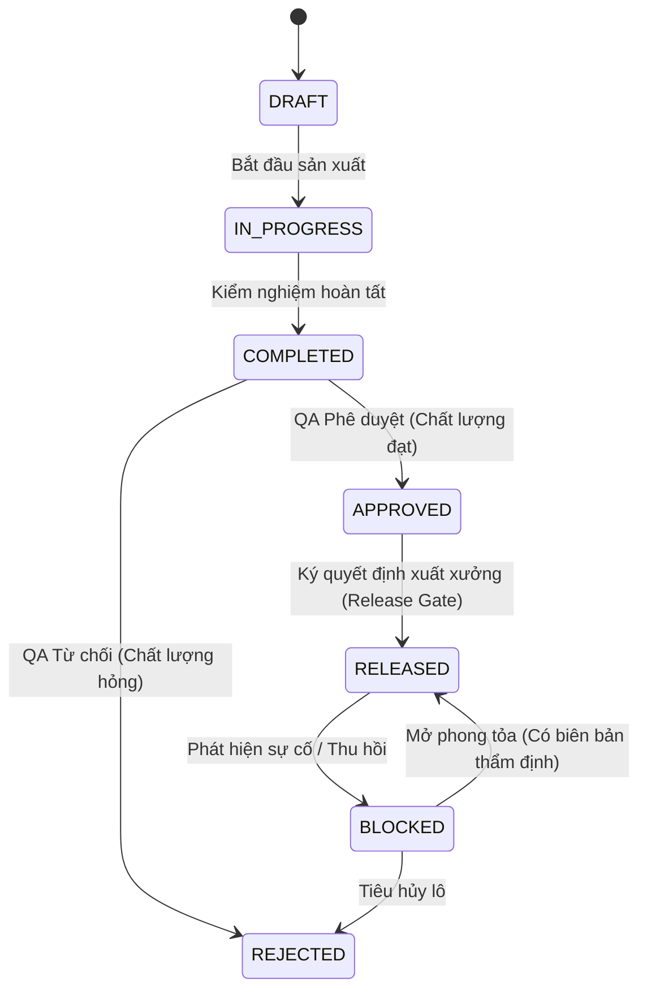

# PHÂN HỆ 06: BATCH PRODUCTION WORKFLOW

## (QUY TRÌNH QUẢN LÝ HỒ SƠ LÔ SẢN XUẤT & KHÓA DỮ LIỆU)

> **Mã phân hệ**: `MOD-06`  
> **Tài liệu**: `docs/workflows/MOD_06_BATCH_WORKFLOW.md`  
> **Phạm vi**: Khởi tạo Lô, cấp Số lô, liên kết TCCS Snapshot, theo dõi tiến độ sản xuất, thẩm định chất lượng lô, khóa dữ liệu bất biến và đóng hồ sơ lô.

---

### 1. MỤC ĐÍCH (PURPOSE)

Quản lý thực thể trung tâm của quy trình sản xuất dược phẩm: **Lô sản xuất (Batch)**. Đảm bảo:

1. Mỗi Lô được neo chặt với một bản Tiêu chuẩn cơ sở bất biến tại thời điểm sản xuất (Frozen TCCS Snapshot).
2. Tách bạch tuyệt đối giữa **Trạng thái quy trình (Workflow Status)** và **Trạng thái chất lượng kỹ thuật (Quality Status)**.
3. Cơ chế Khóa dữ liệu (Data Locking) bảo vệ hồ sơ lô khỏi mọi sự sửa đổi trái phép sau khi đã được phê duyệt hoặc xuất xưởng.

### 2. ĐỐI TƯỢNG THAM GIA (ACTORS)

- **Production Supervisor / Planner**: Khởi tạo Lô, nhập thông tin sản xuất (Ngày SX, Hạn dùng, Cỡ lô).
- **QC Analyst**: Nhập và thẩm định kết quả kiểm nghiệm cho Lô.
- **QA Manager**: Thẩm tra hồ sơ lô tổng thể, ký duyệt xuất xưởng hoặc phong tỏa lô.
- **System Engine**: Tự động snapshot TCCS, tự động cập nhật `qualityStatus` dựa trên Canonical Engine.

### 3. SỰ KIỆN KÍCH HOẠT (TRIGGER)

- Ban hành Lệnh sản xuất mới cho sản phẩm.
- Nhập kết quả kiểm nghiệm thành phẩm của Lô.
- Quyết định xuất xưởng (Release) hoặc Quyết định thu hồi/phong tỏa lô (Recall/Block).

### 4. DỮ LIỆU ĐẦU VÀO (INPUT)

- `id`: UUID bất biến của Lô.
- `batchNumber`: Số lô sản xuất chính thức (Duy nhất, VD: `2409001`).
- `productId`: ID sản phẩm.
- `mfgDate`: Ngày sản xuất.
- `expDate`: Hạn sử dụng (tính toán tự động từ `mfgDate + product.shelfLifeMonths`).
- `batchSize`: Cỡ lô thực tế (VD: `50,000 viên`).
- `tccsSnapshot`: **Bản sao chép toàn bộ TCCS hiện hành** tại thời điểm tạo lô (Bao gồm danh mục chỉ tiêu và alternateRules).
- `formulaSnapshot`: Bản sao công thức sản xuất của lô.
- `status`: Trạng thái Quy trình (Workflow Status).
- `qualityStatus`: Trạng thái Chất lượng (Canonical Quality Status).

### 5. NGUYÊN TẮC PHÂN TÁCH "QUALITY ≠ WORKFLOW"

Hệ thống quản lý 2 trục trạng thái hoàn toàn độc lập nhưng có quan hệ điều kiện:

#### A. Trục Chất lượng Kỹ thuật (`qualityStatus`) - Do Engine quyết định

- `PASS`: Toàn bộ chỉ tiêu kiểm nghiệm đạt tiêu chuẩn (kể cả qua quy tắc thay thế).
- `FAIL`: Có ít nhất một chỉ tiêu không đạt (và không được cứu bởi quy tắc thay thế).
- `PENDING`: Chưa kiểm nghiệm xong, hoặc chỉ tiêu thay thế đang chờ kết quả.
- `UNKNOWN`: Chưa có bất kỳ kết quả kiểm nghiệm nào.

#### B. Trục Quy trình Quản trị (`status`) - Do Người dùng theo quyền quyết định

- `DRAFT`: Đang lập kế hoạch / chuẩn bị sản xuất.
- `IN_PROGRESS`: Đang sản xuất / đang kiểm nghiệm trong phòng lab.
- `COMPLETED`: Đã hoàn thành sản xuất và kiểm nghiệm kỹ thuật.
- `APPROVED`: Đã được QA phê duyệt hồ sơ chất lượng.
- `RELEASED`: Đã chính thức xuất xưởng đưa ra thị trường (Chỉ khi `qualityStatus === PASS`).
- `REJECTED`: Bị từ chối xuất xưởng (do chất lượng hỏng hoặc sai lệch nghiêm trọng).
- `BLOCKED`: Tạm phong tỏa (khi phát hiện sự cố sau khi đã xuất xưởng).

### 6. CÁC BƯỚC THỰC THI (STEPS)

1. **Khởi tạo Lô**: Người dùng tạo Lô tại `SC-09`. Hệ thống đọc TCCS `ACTIVE` của sản phẩm và tạo ngay một bản `tccsSnapshot` nhúng trực tiếp vào bản ghi Lô.
2. **Tiến hành sản xuất & Kiểm nghiệm**: Lô chuyển sang `IN_PROGRESS`. Tạo một hoặc nhiều Phiếu kiểm nghiệm (`PKN`) liên kết với Lô này.
3. **Thẩm định Chất lượng**: Động cơ `QualityEvaluationEngine` tổng hợp kết quả và cập nhật `batch.qualityStatus`.
4. **Phê duyệt Hồ sơ Lô**:
   - Nếu `qualityStatus === 'PASS'`: QA có quyền chuyển sang `APPROVED`.
   - Nếu `qualityStatus === 'FAIL'`: Hệ thống bắt buộc phải có Hồ sơ OOS / Deviation đã kết luận trước khi cho phép quyết định `APPROVED` (nếu có nhượng bộ) hoặc `REJECTED`.
5. **Kích hoạt Khóa Dữ liệu (Data Locking)**:
   - Ngay khi Lô chuyển sang `APPROVED` hoặc `RELEASED`, toàn bộ trường dữ liệu của Lô, TCCS Snapshot và các Phiếu kiểm nghiệm con bị **ĐÓNG BĂNG HOÀN TOÀN** (Read-Only). CẤM mọi hành vi chỉnh sửa trực tiếp.

### 7. BẢNG QUYẾT ĐỊNH (DECISION TABLE)

| Trạng thái hiện tại        | Hành động mong muốn                | Điều kiện tiên quyết                                           | Quyết định của Hệ thống                             |
| :------------------------- | :--------------------------------- | :------------------------------------------------------------- | :-------------------------------------------------- |
| `IN_PROGRESS`              | Chuyển sang `COMPLETED`            | Phải có ít nhất 1 Phiếu kiểm nghiệm chính thức                 | Cho phép chuyển                                     |
| Bất kỳ                     | Chuyển sang `RELEASED`             | **`qualityStatus` PHẢI LÀ `PASS`** VÀ có chữ ký điện tử của QA | Cho phép Release; Chặn nếu `qualityStatus !== PASS` |
| `APPROVED` hoặc `RELEASED` | Sửa thông tin cỡ lô, ngày sản xuất | Bị cấm bởi cơ chế Data Locking                                 | Chặn thao tác, báo lỗi 403 Forbidden                |
| `RELEASED`                 | Chuyển sang `BLOCKED`              | Có biên bản sự cố chất lượng / thu hồi khẩn cấp                | Cho phép; Ghi nhận ALCOA+ Audit Trail               |

### 8. VÒNG ĐỜI TRẠNG THÁI (STATE MACHINE MERMAID)

### 9. TIÊU CHÍ NGHIỆM THU (ACCEPTANCE CRITERIA)

- `AC-BAT-01`: Mỗi Lô bắt buộc phải có `tccsSnapshot` độc lập, không thay đổi theo thời gian.
- `AC-BAT-02`: Tuyệt đối không cho phép chuyển trạng thái sang `RELEASED` nếu `qualityStatus !== 'PASS'`.
- `AC-BAT-03`: Toàn bộ dữ liệu của Lô phải bị khóa bất biến khi ở trạng thái `APPROVED` hoặc `RELEASED`.
